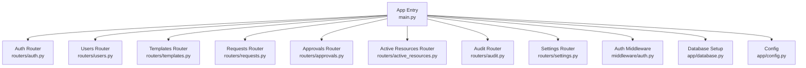
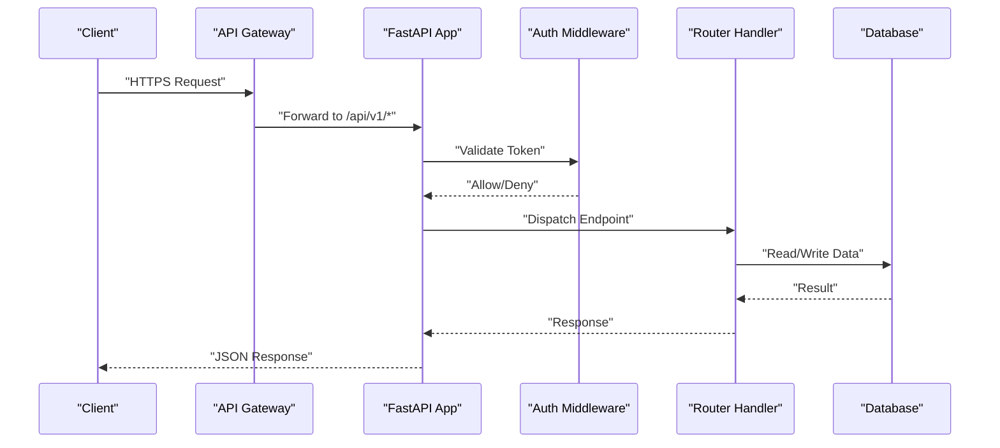
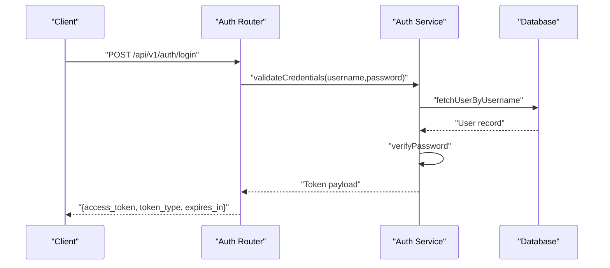
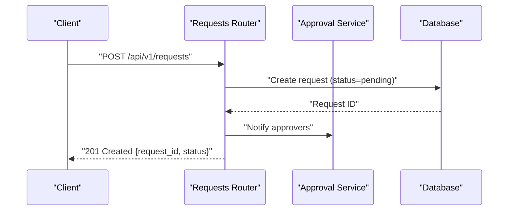
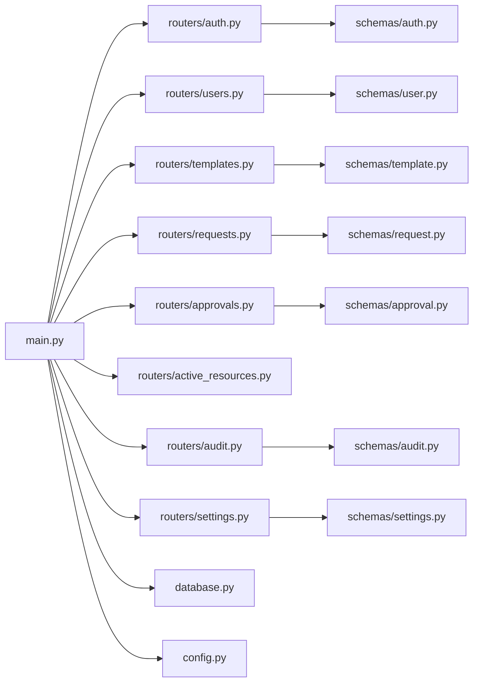

# API Reference

<cite>
**Referenced Files in This Document**
- [main.py](file://backend/app/main.py)
- [auth.py](file://backend/app/routers/auth.py)
- [users.py](file://backend/app/routers/users.py)
- [templates.py](file://backend/app/routers/templates.py)
- [requests.py](file://backend/app/routers/requests.py)
- [approvals.py](file://backend/app/routers/approvals.py)
- [active_resources.py](file://backend/app/routers/active_resources.py)
- [audit.py](file://backend/app/routers/audit.py)
- [settings.py](file://backend/app/routers/settings.py)
- [auth_middleware.py](file://backend/app/middleware/auth.py)
- [auth_schema.py](file://backend/app/schemas/auth.py)
- [user_schema.py](file://backend/app/schemas/user.py)
- [template_schema.py](file://backend/app/schemas/template.py)
- [request_schema.py](file://backend/app/schemas/request.py)
- [approval_schema.py](file://backend/app/schemas/approval.py)
- [audit_schema.py](file://backend/app/schemas/audit.py)
- [settings_schema.py](file://backend/app/schemas/settings.py)
- [database.py](file://backend/app/database.py)
- [config.py](file://backend/app/config.py)
</cite>

## Table of Contents
1. [Introduction](#introduction)
2. [Project Structure](#project-structure)
3. [Core Components](#core-components)
4. [Architecture Overview](#architecture-overview)
5. [Detailed Component Analysis](#detailed-component-analysis)
6. [Dependency Analysis](#dependency-analysis)
7. [Performance Considerations](#performance-considerations)
8. [Troubleshooting Guide](#troubleshooting-guide)
9. [Conclusion](#conclusion)
10. [Appendices](#appendices)

## Introduction
This document provides comprehensive API documentation for the ECS Creator platform backend. It covers authentication, user management, template management, request submission and approval workflows, active resources monitoring, audit log retrieval, and system settings. For each endpoint, it specifies HTTP methods, URL patterns, authentication requirements, request/response schemas, status codes, examples, error handling patterns, rate limiting, versioning, and security considerations.

## Project Structure
The backend is organized by feature modules (routers), Pydantic schemas for validation, middleware for authentication, and configuration/database setup. The application entry point registers routers and global middleware.

**Diagram sources**
- [main.py](file://backend/app/main.py)
- [auth.py](file://backend/app/routers/auth.py)
- [users.py](file://backend/app/routers/users.py)
- [templates.py](file://backend/app/routers/templates.py)
- [requests.py](file://backend/app/routers/requests.py)
- [approvals.py](file://backend/app/routers/approvals.py)
- [active_resources.py](file://backend/app/routers/active_resources.py)
- [audit.py](file://backend/app/routers/audit.py)
- [settings.py](file://backend/app/routers/settings.py)
- [auth_middleware.py](file://backend/app/middleware/auth.py)
- [database.py](file://backend/app/database.py)
- [config.py](file://backend/app/config.py)

**Section sources**
- [main.py](file://backend/app/main.py)
- [database.py](file://backend/app/database.py)
- [config.py](file://backend/app/config.py)

## Core Components
- Authentication: Login, logout, token refresh, and session management via JWT-based tokens protected by middleware.
- Users: CRUD operations and role assignments for administrators.
- Templates: Resource configuration definitions used to standardize ECS provisioning.
- Requests: Submission of resource requests based on templates and workflow lifecycle.
- Approvals: Review and decision endpoints for pending requests.
- Active Resources: Monitoring and listing of currently provisioned resources.
- Audit: Retrieval of audit logs for compliance and traceability.
- Settings: System-level configuration endpoints.

Authentication requirements:
- Public endpoints: login, token refresh (if implemented as public).
- Protected endpoints: require valid access token; some may require admin roles.

Versioning:
- All endpoints are under a versioned base path: /api/v1.

Rate Limiting:
- Apply per-client limits at gateway or middleware layer. Defaults should be enforced for sensitive endpoints (login, approvals).

Security:
- Use HTTPS only.
- Enforce strong password policies.
- Validate all inputs with Pydantic schemas.
- Log sensitive actions to audit trail.

**Section sources**
- [auth.py](file://backend/app/routers/auth.py)
- [auth_middleware.py](file://backend/app/middleware/auth.py)
- [auth_schema.py](file://backend/app/schemas/auth.py)
- [users.py](file://backend/app/routers/users.py)
- [user_schema.py](file://backend/app/schemas/user.py)
- [templates.py](file://backend/app/routers/templates.py)
- [template_schema.py](file://backend/app/schemas/template.py)
- [requests.py](file://backend/app/routers/requests.py)
- [request_schema.py](file://backend/app/schemas/request.py)
- [approvals.py](file://backend/app/routers/approvals.py)
- [approval_schema.py](file://backend/app/schemas/approval.py)
- [active_resources.py](file://backend/app/routers/active_resources.py)
- [audit.py](file://backend/app/routers/audit.py)
- [audit_schema.py](file://backend/app/schemas/audit.py)
- [settings.py](file://backend/app/routers/settings.py)
- [settings_schema.py](file://backend/app/schemas/settings.py)

## Architecture Overview
High-level flow for authenticated API calls:

**Diagram sources**
- [main.py](file://backend/app/main.py)
- [auth_middleware.py](file://backend/app/middleware/auth.py)
- [database.py](file://backend/app/database.py)

## Detailed Component Analysis

### Authentication Endpoints
Base path: /api/v1/auth

- POST /api/v1/auth/login
  - Purpose: Authenticate user and return access token.
  - Auth: None (public).
  - Request schema: username, password.
  - Response schema: access_token, token_type, expires_in, user info.
  - Status codes: 200 OK, 401 Unauthorized, 422 Validation Error.
  - Example request:
    {
      "username": "admin",
      "password": "securePassword"
    }
  - Example response:
    {
      "access_token": "eyJhbGciOiJIUzI1NiIs...",
      "token_type": "bearer",
      "expires_in": 3600,
      "user": {
        "id": 1,
        "username": "admin",
        "role": "admin"
      }
    }
  - Errors:
    - 401: Invalid credentials.
    - 422: Missing fields or invalid format.

- POST /api/v1/auth/logout
  - Purpose: Invalidate current session/token.
  - Auth: Required (Bearer token).
  - Request: None (body).
  - Response: Success message.
  - Status codes: 200 OK, 401 Unauthorized.

- POST /api/v1/auth/refresh
  - Purpose: Refresh access token using refresh token.
  - Auth: Optional depending on implementation; if required, use existing token.
  - Request schema: refresh_token.
  - Response schema: new access_token, token_type, expires_in.
  - Status codes: 200 OK, 401 Unauthorized, 422 Validation Error.

Notes:
- Tokens are short-lived; enforce refresh strategy.
- Rate limit login and refresh endpoints to prevent brute-force attacks.

**Section sources**
- [auth.py](file://backend/app/routers/auth.py)
- [auth_schema.py](file://backend/app/schemas/auth.py)
- [auth_middleware.py](file://backend/app/middleware/auth.py)

#### Authentication Flow Sequence

**Diagram sources**
- [auth.py](file://backend/app/routers/auth.py)
- [auth_schema.py](file://backend/app/schemas/auth.py)

### User Management Endpoints
Base path: /api/v1/users

- GET /api/v1/users
  - Purpose: List users with pagination and filtering.
  - Auth: Admin role required.
  - Query params: page, page_size, role, search.
  - Response schema: list of users with metadata.
  - Status codes: 200 OK, 401 Unauthorized, 403 Forbidden, 422 Validation Error.

- POST /api/v1/users
  - Purpose: Create a new user.
  - Auth: Admin role required.
  - Request schema: username, email, password, role.
  - Response schema: created user object.
  - Status codes: 201 Created, 400 Conflict (duplicate), 401 Unauthorized, 403 Forbidden, 422 Validation Error.

- GET /api/v1/users/{user_id}
  - Purpose: Retrieve user details.
  - Auth: Admin role required.
  - Response schema: user object.
  - Status codes: 200 OK, 401 Unauthorized, 403 Forbidden, 404 Not Found, 422 Validation Error.

- PUT /api/v1/users/{user_id}
  - Purpose: Update user attributes (e.g., email, role).
  - Auth: Admin role required.
  - Request schema: partial update fields.
  - Response schema: updated user object.
  - Status codes: 200 OK, 401 Unauthorized, 403 Forbidden, 404 Not Found, 422 Validation Error.

- DELETE /api/v1/users/{user_id}
  - Purpose: Delete a user.
  - Auth: Admin role required.
  - Response: Success message.
  - Status codes: 200 OK, 401 Unauthorized, 403 Forbidden, 404 Not Found.

Role assignment:
- Role field supports values such as "admin", "user".
- Ensure least privilege enforcement in middleware.

**Section sources**
- [users.py](file://backend/app/routers/users.py)
- [user_schema.py](file://backend/app/schemas/user.py)
- [auth_middleware.py](file://backend/app/middleware/auth.py)

### Template Management Endpoints
Base path: /api/v1/templates

- GET /api/v1/templates
  - Purpose: List available resource templates.
  - Auth: Any authenticated user.
  - Query params: category, search.
  - Response schema: list of templates.
  - Status codes: 200 OK, 401 Unauthorized, 422 Validation Error.

- POST /api/v1/templates
  - Purpose: Create a new template definition.
  - Auth: Admin role required.
  - Request schema: name, description, parameters, constraints.
  - Response schema: created template.
  - Status codes: 201 Created, 400 Bad Request, 401 Unauthorized, 403 Forbidden, 422 Validation Error.

- GET /api/v1/templates/{template_id}
  - Purpose: Retrieve template details.
  - Auth: Any authenticated user.
  - Response schema: template object.
  - Status codes: 200 OK, 401 Unauthorized, 404 Not Found, 422 Validation Error.

- PUT /api/v1/templates/{template_id}
  - Purpose: Update template definition.
  - Auth: Admin role required.
  - Request schema: partial update fields.
  - Response schema: updated template.
  - Status codes: 200 OK, 401 Unauthorized, 403 Forbidden, 404 Not Found, 422 Validation Error.

- DELETE /api/v1/templates/{template_id}
  - Purpose: Remove a template.
  - Auth: Admin role required.
  - Response: Success message.
  - Status codes: 200 OK, 401 Unauthorized, 403 Forbidden, 404 Not Found.

Validation:
- Parameters must conform to defined schema; server validates constraints before acceptance.

**Section sources**
- [templates.py](file://backend/app/routers/templates.py)
- [template_schema.py](file://backend/app/schemas/template.py)
- [auth_middleware.py](file://backend/app/middleware/auth.py)

### Request Submission and Approval Workflow Endpoints
Base path: /api/v1/requests

- POST /api/v1/requests
  - Purpose: Submit a new resource request based on a template.
  - Auth: Any authenticated user.
  - Request schema: template_id, parameters, priority, notes.
  - Response schema: created request with status "pending".
  - Status codes: 201 Created, 400 Bad Request, 401 Unauthorized, 422 Validation Error.

- GET /api/v1/requests
  - Purpose: List requests with filters.
  - Auth: Any authenticated user (own requests); admins see all.
  - Query params: status, template_id, date_from, date_to, page, page_size.
  - Response schema: paginated list of requests.
  - Status codes: 200 OK, 401 Unauthorized, 422 Validation Error.

- GET /api/v1/requests/{request_id}
  - Purpose: Retrieve request details.
  - Auth: Owner or admin.
  - Response schema: request object with history.
  - Status codes: 200 OK, 401 Unauthorized, 403 Forbidden, 404 Not Found, 422 Validation Error.

- PUT /api/v1/requests/{request_id}
  - Purpose: Update request (only allowed when status permits).
  - Auth: Owner or admin.
  - Request schema: partial update fields.
  - Response schema: updated request.
  - Status codes: 200 OK, 401 Unauthorized, 403 Forbidden, 404 Not Found, 422 Validation Error.

- DELETE /api/v1/requests/{request_id}
  - Purpose: Cancel a request (only when allowed by workflow).
  - Auth: Owner or admin.
  - Response: Success message.
  - Status codes: 200 OK, 401 Unauthorized, 403 Forbidden, 404 Not Found.

Approval endpoints:
- Base path: /api/v1/approvals

- GET /api/v1/approvals/pending
  - Purpose: List pending approvals.
  - Auth: Approver role required.
  - Response schema: list of pending requests.
  - Status codes: 200 OK, 401 Unauthorized, 403 Forbidden.

- POST /api/v1/approvals/{request_id}/approve
  - Purpose: Approve a request.
  - Auth: Approver role required.
  - Request schema: comments (optional).
  - Response schema: updated request with status "approved".
  - Status codes: 200 OK, 401 Unauthorized, 403 Forbidden, 404 Not Found, 422 Validation Error.

- POST /api/v1/approvals/{request_id}/reject
  - Purpose: Reject a request.
  - Auth: Approver role required.
  - Request schema: comments (required).
  - Response schema: updated request with status "rejected".
  - Status codes: 200 OK, 401 Unauthorized, 403 Forbidden, 404 Not Found, 422 Validation Error.

Workflow states:
- pending -> approved -> provisioning -> active
- pending -> rejected
- active -> terminated (via resource lifecycle outside this API)

**Section sources**
- [requests.py](file://backend/app/routers/requests.py)
- [request_schema.py](file://backend/app/schemas/request.py)
- [approvals.py](file://backend/app/routers/approvals.py)
- [approval_schema.py](file://backend/app/schemas/approval.py)
- [auth_middleware.py](file://backend/app/middleware/auth.py)

#### Request Submission Sequence

**Diagram sources**
- [requests.py](file://backend/app/routers/requests.py)
- [request_schema.py](file://backend/app/schemas/request.py)
- [approvals.py](file://backend/app/routers/approvals.py)

### Active Resources Monitoring Endpoints
Base path: /api/v1/resources

- GET /api/v1/resources
  - Purpose: List active resources with filters.
  - Auth: Admin role required.
  - Query params: status, region, template_id, owner_id, page, page_size.
  - Response schema: paginated list of resources.
  - Status codes: 200 OK, 401 Unauthorized, 403 Forbidden, 422 Validation Error.

- GET /api/v1/resources/{resource_id}
  - Purpose: Retrieve resource details.
  - Auth: Admin role required.
  - Response schema: resource object including health and metadata.
  - Status codes: 200 OK, 401 Unauthorized, 403 Forbidden, 404 Not Found, 422 Validation Error.

- DELETE /api/v1/resources/{resource_id}
  - Purpose: Terminate a resource (requires confirmation).
  - Auth: Admin role required.
  - Request schema: confirm flag.
  - Response: Success message.
  - Status codes: 200 OK, 401 Unauthorized, 403 Forbidden, 404 Not Found, 422 Validation Error.

Health checks:
- Periodic health probes can be integrated into resource service to report status.

**Section sources**
- [active_resources.py](file://backend/app/routers/active_resources.py)
- [auth_middleware.py](file://backend/app/middleware/auth.py)

### Audit Log Retrieval Endpoints
Base path: /api/v1/audit

- GET /api/v1/audit/logs
  - Purpose: Retrieve audit logs with filters.
  - Auth: Admin role required.
  - Query params: actor_id, action, entity_type, entity_id, date_from, date_to, page, page_size.
  - Response schema: paginated list of audit entries.
  - Status codes: 200 OK, 401 Unauthorized, 403 Forbidden, 422 Validation Error.

- GET /api/v1/audit/logs/{log_id}
  - Purpose: Retrieve a specific audit log entry.
  - Auth: Admin role required.
  - Response schema: audit entry object.
  - Status codes: 200 OK, 401 Unauthorized, 403 Forbidden, 404 Not Found, 422 Validation Error.

Retention and privacy:
- Sensitive data should be masked in audit logs.
- Implement retention policies per compliance requirements.

**Section sources**
- [audit.py](file://backend/app/routers/audit.py)
- [audit_schema.py](file://backend/app/schemas/audit.py)
- [auth_middleware.py](file://backend/app/middleware/auth.py)

### System Settings Endpoints
Base path: /api/v1/settings

- GET /api/v1/settings
  - Purpose: Retrieve system settings.
  - Auth: Admin role required.
  - Response schema: key-value pairs of settings.
  - Status codes: 200 OK, 401 Unauthorized, 403 Forbidden.

- PUT /api/v1/settings
  - Purpose: Update system settings.
  - Auth: Admin role required.
  - Request schema: settings updates.
  - Response schema: updated settings.
  - Status codes: 200 OK, 401 Unauthorized, 403 Forbidden, 422 Validation Error.

Security:
- Restrict sensitive settings (e.g., provider credentials) to secure storage and encrypted transmission.

**Section sources**
- [settings.py](file://backend/app/routers/settings.py)
- [settings_schema.py](file://backend/app/schemas/settings.py)
- [auth_middleware.py](file://backend/app/middleware/auth.py)

## Dependency Analysis
Routers depend on schemas for validation and middleware for authorization. Database interactions occur within services invoked by routers.

**Diagram sources**
- [main.py](file://backend/app/main.py)
- [auth.py](file://backend/app/routers/auth.py)
- [users.py](file://backend/app/routers/users.py)
- [templates.py](file://backend/app/routers/templates.py)
- [requests.py](file://backend/app/routers/requests.py)
- [approvals.py](file://backend/app/routers/approvals.py)
- [active_resources.py](file://backend/app/routers/active_resources.py)
- [audit.py](file://backend/app/routers/audit.py)
- [settings.py](file://backend/app/routers/settings.py)
- [auth_schema.py](file://backend/app/schemas/auth.py)
- [user_schema.py](file://backend/app/schemas/user.py)
- [template_schema.py](file://backend/app/schemas/template.py)
- [request_schema.py](file://backend/app/schemas/request.py)
- [approval_schema.py](file://backend/app/schemas/approval.py)
- [audit_schema.py](file://backend/app/schemas/audit.py)
- [settings_schema.py](file://backend/app/schemas/settings.py)
- [database.py](file://backend/app/database.py)
- [config.py](file://backend/app/config.py)

**Section sources**
- [main.py](file://backend/app/main.py)
- [database.py](file://backend/app/database.py)
- [config.py](file://backend/app/config.py)

## Performance Considerations
- Pagination: Always paginate list endpoints to reduce payload size.
- Indexing: Ensure database indexes on frequently filtered fields (e.g., status, template_id, actor_id).
- Caching: Cache read-heavy endpoints like templates and settings where appropriate.
- Connection pooling: Configure database connection pools to handle concurrent requests efficiently.
- Asynchronous processing: Offload long-running tasks (provisioning) to background workers.

[No sources needed since this section provides general guidance]

## Troubleshooting Guide
Common errors and handling:
- 401 Unauthorized: Missing or invalid token. Verify Authorization header format and token expiration.
- 403 Forbidden: Insufficient permissions. Check user roles and endpoint restrictions.
- 404 Not Found: Resource does not exist. Validate IDs and ensure correct paths.
- 422 Validation Error: Malformed request body. Inspect schema requirements and field types.
- 429 Too Many Requests: Rate limit exceeded. Implement retry with backoff.

Debugging tips:
- Enable detailed logging for failed requests.
- Correlate requests with audit logs using request IDs.
- Validate environment variables and configuration via settings endpoints.

**Section sources**
- [auth_middleware.py](file://backend/app/middleware/auth.py)
- [audit.py](file://backend/app/routers/audit.py)

## Conclusion
The ECS Creator platform exposes a well-structured REST API with clear separation of concerns across authentication, user management, templates, requests, approvals, active resources, audit logs, and settings. Adhering to the documented schemas, authentication requirements, and error handling patterns will ensure reliable integration. Implement robust rate limiting, versioning, and security controls to protect consumers and maintain system integrity.

[No sources needed since this section summarizes without analyzing specific files]

## Appendices

### Versioning Strategy
- Base path: /api/v1
- Future versions: /api/v2, etc.
- Deprecation policy: Announce deprecations with sunset headers and migration guides.

### Security Considerations
- Enforce HTTPS and HSTS.
- Use short-lived access tokens with refresh mechanisms.
- Validate and sanitize all inputs.
- Mask sensitive data in logs and responses.
- Apply least privilege roles and scope tokens.

### Rate Limiting Recommendations
- Login and refresh: strict limits (e.g., 5 attempts per minute per IP).
- Approvals and settings: moderate limits (e.g., 30 requests per minute per client).
- Read endpoints: higher limits with caching.

### Example Error Responses
- 401 Unauthorized:
  {
    "detail": "Invalid or expired token"
  }
- 403 Forbidden:
  {
    "detail": "Insufficient permissions"
  }
- 422 Validation Error:
  {
    "detail": [
      {
        "loc": ["body", "password"],
        "msg": "field required",
        "type": "value_error.missing"
      }
    ]
  }

[No sources needed since this section provides general guidance]