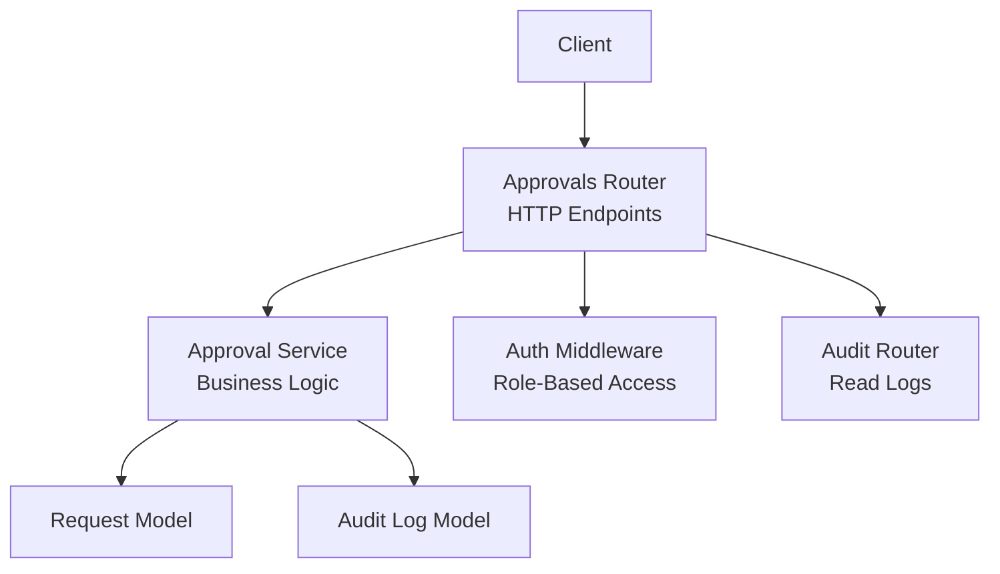
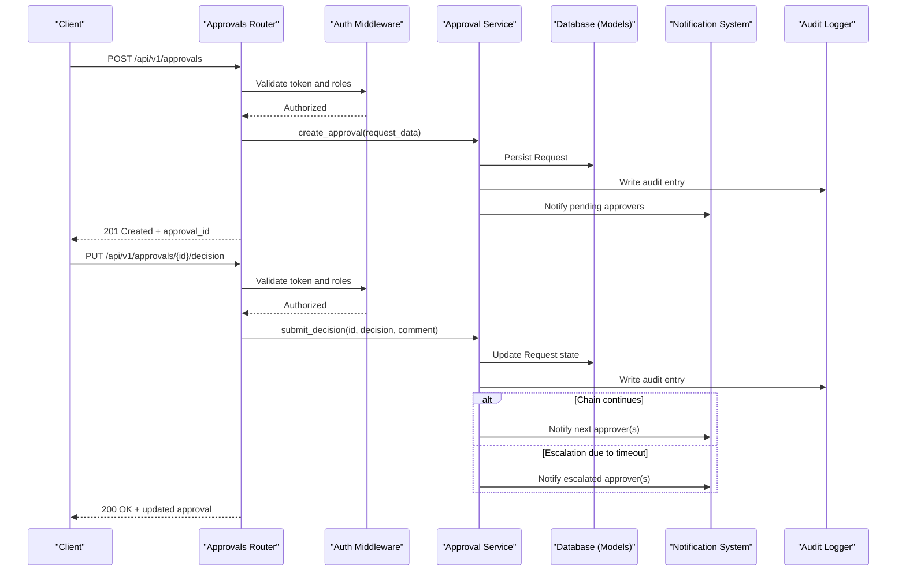
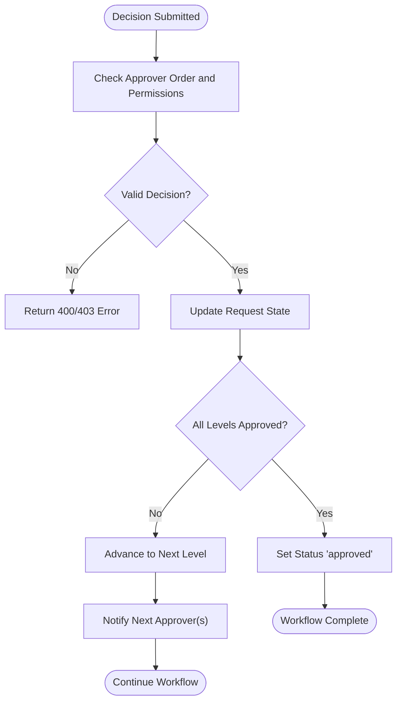
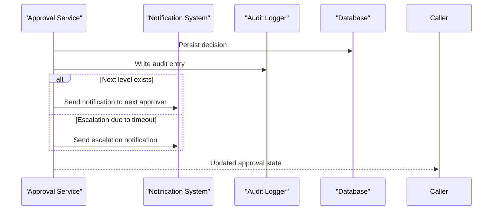
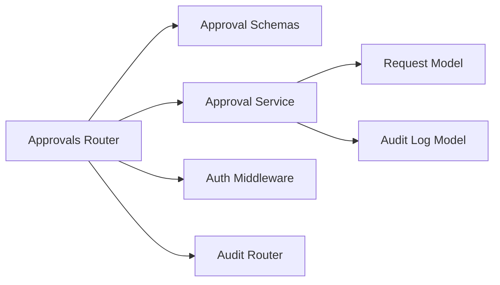

# Approval Workflow API

<cite>
**Referenced Files in This Document**
- [backend/app/routers/approvals.py](file://backend/app/routers/approvals.py)
- [backend/app/schemas/approval.py](file://backend/app/schemas/approval.py)
- [backend/app/services/approval.py](file://backend/app/services/approval.py)
- [backend/app/models/request.py](file://backend/app/models/request.py)
- [backend/app/models/audit_log.py](file://backend/app/models/audit_log.py)
- [backend/app/middleware/auth.py](file://backend/app/middleware/auth.py)
- [backend/app/routers/audit.py](file://backend/app/routers/audit.py)
- [backend/app/main.py](file://backend/app/main.py)
</cite>

## Table of Contents
1. [Introduction](#introduction)
2. [Project Structure](#project-structure)
3. [Core Components](#core-components)
4. [Architecture Overview](#architecture-overview)
5. [Detailed Component Analysis](#detailed-component-analysis)
6. [Dependency Analysis](#dependency-analysis)
7. [Performance Considerations](#performance-considerations)
8. [Troubleshooting Guide](#troubleshooting-guide)
9. [Conclusion](#conclusion)
10. [Appendices](#appendices)

## Introduction
This document provides comprehensive API documentation for the approval workflow endpoints. It covers creation, review, and decision submission for approval requests; multi-level approval chains and escalation rules; notifications; and audit logging. Authentication enforces role-based permissions to ensure only authorized users can create or approve requests. The documentation includes endpoint specifications, request/response schemas, examples, workflow states, timeout handling, and notification triggers.

## Project Structure
The backend implements a FastAPI application with routers, services, models, and schemas. Approval-related functionality is implemented under:
- Routers: HTTP endpoints for approvals and audit logs
- Services: Business logic for approval workflows, state transitions, and escalation
- Models: Database entities for requests and audit logs
- Schemas: Pydantic models for request/response validation
- Middleware: Authentication and authorization enforcement

**Diagram sources**
- [backend/app/routers/approvals.py](file://backend/app/routers/approvals.py)
- [backend/app/services/approval.py](file://backend/app/services/approval.py)
- [backend/app/models/request.py](file://backend/app/models/request.py)
- [backend/app/models/audit_log.py](file://backend/app/models/audit_log.py)
- [backend/app/middleware/auth.py](file://backend/app/middleware/auth.py)
- [backend/app/routers/audit.py](file://backend/app/routers/audit.py)

**Section sources**
- [backend/app/main.py](file://backend/app/main.py)
- [backend/app/routers/approvals.py](file://backend/app/routers/approvals.py)
- [backend/app/services/approval.py](file://backend/app/services/approval.py)
- [backend/app/models/request.py](file://backend/app/models/request.py)
- [backend/app/models/audit_log.py](file://backend/app/models/audit_log.py)
- [backend/app/middleware/auth.py](file://backend/app/middleware/auth.py)
- [backend/app/routers/audit.py](file://backend/app/routers/audit.py)

## Core Components
- Approvals Router: Exposes HTTP endpoints for creating, listing, and deciding on approval requests.
- Approval Service: Encapsulates workflow logic including chain progression, escalation, timeouts, and notifications.
- Request Model: Represents an approval request entity with fields such as requester, approvers, status, and timestamps.
- Audit Log Model: Records immutable events for compliance and traceability.
- Schemas: Define strict request/response structures for validations and OpenAPI documentation.
- Auth Middleware: Enforces authentication and role-based access control (RBAC) for endpoints.

Key responsibilities:
- Create approval requests with assigned approvers and optional multi-level chains.
- Submit decisions with comments and enforce ordering constraints.
- Advance workflow state upon successful approvals or escalate when timeouts occur.
- Emit notifications for pending approvals and state changes.
- Persist audit entries for all significant actions.

**Section sources**
- [backend/app/routers/approvals.py](file://backend/app/routers/approvals.py)
- [backend/app/services/approval.py](file://backend/app/services/approval.py)
- [backend/app/schemas/approval.py](file://backend/app/schemas/approval.py)
- [backend/app/models/request.py](file://backend/app/models/request.py)
- [backend/app/models/audit_log.py](file://backend/app/models/audit_log.py)
- [backend/app/middleware/auth.py](file://backend/app/middleware/auth.py)

## Architecture Overview
The approval workflow follows a layered architecture:
- HTTP Layer: Routers define REST endpoints and validate payloads using schemas.
- Service Layer: Implements business rules for approval chains, escalations, timeouts, and notifications.
- Data Layer: Models interact with the database to persist requests and audit logs.
- Security Layer: Middleware ensures authenticated and authorized access based on roles.

**Diagram sources**
- [backend/app/routers/approvals.py](file://backend/app/routers/approvals.py)
- [backend/app/services/approval.py](file://backend/app/services/approval.py)
- [backend/app/models/request.py](file://backend/app/models/request.py)
- [backend/app/models/audit_log.py](file://backend/app/models/audit_log.py)
- [backend/app/middleware/auth.py](file://backend/app/middleware/auth.py)

## Detailed Component Analysis

### Endpoint: Create Approval Request
- Method: POST
- URL: /api/v1/approvals
- Description: Creates a new approval request with one or more approvers and optional multi-level chain configuration.
- Authentication: Required. Role must allow creating approvals.
- Request Schema:
  - title: string
  - description: string
  - requester_id: string
  - approvers: array of objects
    - user_id: string
    - level: integer (optional, default 1)
  - metadata: object (optional)
  - timeout_minutes: integer (optional, default defined by system settings)
- Response Schema:
  - id: string
  - title: string
  - description: string
  - requester_id: string
  - approvers: array of objects with user_id, level, status
  - status: enum ("pending", "approved", "rejected", "escalated")
  - current_level: integer
  - created_at: timestamp
  - updated_at: timestamp
  - metadata: object
- Example:
  - Create a two-level approval where Level 1 approves first, then Level 2.
  - Assign approvers by user_id and specify levels.
  - Set a custom timeout if needed.

**Section sources**
- [backend/app/routers/approvals.py](file://backend/app/routers/approvals.py)
- [backend/app/schemas/approval.py](file://backend/app/schemas/approval.py)
- [backend/app/services/approval.py](file://backend/app/services/approval.py)
- [backend/app/models/request.py](file://backend/app/models/request.py)

### Endpoint: List Approval Requests
- Method: GET
- URL: /api/v1/approvals
- Description: Retrieves a paginated list of approval requests with optional filters.
- Authentication: Required. Role must allow viewing approvals.
- Query Parameters:
  - status: enum filter ("pending", "approved", "rejected", "escalated")
  - requester_id: string filter
  - approver_id: string filter
  - page: integer (default 1)
  - page_size: integer (default 20)
- Response Schema:
  - items: array of approval summaries
  - total: integer
  - page: integer
  - page_size: integer
- Example:
  - Filter pending approvals for a specific approver.
  - Paginate results for UI display.

**Section sources**
- [backend/app/routers/approvals.py](file://backend/app/routers/approvals.py)
- [backend/app/schemas/approval.py](file://backend/app/schemas/approval.py)

### Endpoint: Submit Decision
- Method: PUT
- URL: /api/v1/approvals/{id}/decision
- Description: Submits an approval decision for the specified request. Supports comments and enforces ordering constraints.
- Authentication: Required. Role must be an approver at the current level or higher.
- Path Parameter:
  - id: string (approval request ID)
- Request Schema:
  - decision: enum ("approve", "reject")
  - comment: string (optional)
- Response Schema:
  - id: string
  - status: updated enum value
  - current_level: integer
  - updated_at: timestamp
  - audit_entries: array of recent audit entries
- Example:
  - Approve at Level 1; workflow advances to Level 2.
  - Reject at any level; workflow terminates with rejected status.

**Section sources**
- [backend/app/routers/approvals.py](file://backend/app/routers/approvals.py)
- [backend/app/schemas/approval.py](file://backend/app/schemas/approval.py)
- [backend/app/services/approval.py](file://backend/app/services/approval.py)
- [backend/app/models/request.py](file://backend/app/models/request.py)

### Multi-Level Approval Chains and Escalation Rules
- Chain Progression:
  - Approvers are ordered by level.
  - Each level requires at least one approval before advancing.
  - Once all levels are approved, status becomes "approved".
- Escalation:
  - If no decision is submitted within timeout_minutes, the request escalates to the next available approver or higher-level approver.
  - Escalation updates status to "escalated" temporarily until a decision is made.
- Timeout Handling:
  - Background tasks or scheduled checks evaluate pending approvals against their timeouts.
  - On timeout, escalation logic triggers notifications and state updates.

**Diagram sources**
- [backend/app/services/approval.py](file://backend/app/services/approval.py)
- [backend/app/models/request.py](file://backend/app/models/request.py)

**Section sources**
- [backend/app/services/approval.py](file://backend/app/services/approval.py)
- [backend/app/models/request.py](file://backend/app/models/request.py)

### Notifications and Audit Logging
- Notifications:
  - Triggered when a new approval is created and assigned.
  - Triggered when advancing to the next level.
  - Triggered on escalation due to timeout.
  - Triggered on final approval or rejection.
- Audit Logging:
  - Every decision submission creates an audit entry with actor, action, timestamp, and comment.
  - Escalation events are also logged for compliance.
- Audit Retrieval:
  - Use the audit router to query logs by request ID or other filters.

**Diagram sources**
- [backend/app/services/approval.py](file://backend/app/services/approval.py)
- [backend/app/models/audit_log.py](file://backend/app/models/audit_log.py)
- [backend/app/routers/audit.py](file://backend/app/routers/audit.py)

**Section sources**
- [backend/app/services/approval.py](file://backend/app/services/approval.py)
- [backend/app/models/audit_log.py](file://backend/app/models/audit_log.py)
- [backend/app/routers/audit.py](file://backend/app/routers/audit.py)

### Authentication and Role-Based Permissions
- Authentication:
  - Requires a valid token provided via middleware.
- Roles:
  - Creator: Can create approval requests.
  - Approver: Can submit decisions for assigned levels.
  - Admin: Can view all approvals and audit logs.
- Enforcement:
  - Middleware validates tokens and checks roles before routing to handlers.
  - Unauthorized or insufficient roles result in 401/403 responses.

**Section sources**
- [backend/app/middleware/auth.py](file://backend/app/middleware/auth.py)
- [backend/app/routers/approvals.py](file://backend/app/routers/approvals.py)

## Dependency Analysis
The approval workflow depends on several components:
- Routers depend on Schemas for validation and Services for business logic.
- Services depend on Models for persistence and may integrate with Notification and Audit systems.
- Middleware secures endpoints and delegates to routers upon successful authentication.

**Diagram sources**
- [backend/app/routers/approvals.py](file://backend/app/routers/approvals.py)
- [backend/app/schemas/approval.py](file://backend/app/schemas/approval.py)
- [backend/app/services/approval.py](file://backend/app/services/approval.py)
- [backend/app/models/request.py](file://backend/app/models/request.py)
- [backend/app/models/audit_log.py](file://backend/app/models/audit_log.py)
- [backend/app/middleware/auth.py](file://backend/app/middleware/auth.py)
- [backend/app/routers/audit.py](file://backend/app/routers/audit.py)

**Section sources**
- [backend/app/routers/approvals.py](file://backend/app/routers/approvals.py)
- [backend/app/services/approval.py](file://backend/app/services/approval.py)
- [backend/app/models/request.py](file://backend/app/models/request.py)
- [backend/app/models/audit_log.py](file://backend/app/models/audit_log.py)
- [backend/app/middleware/auth.py](file://backend/app/middleware/auth.py)
- [backend/app/routers/audit.py](file://backend/app/routers/audit.py)

## Performance Considerations
- Pagination: Use page and page_size parameters to limit payload size for listing endpoints.
- Indexing: Ensure database indexes on frequently filtered fields (status, requester_id, approver_id).
- Concurrency: Avoid race conditions when multiple approvers act simultaneously; use optimistic locking or transactions.
- Timeouts: Configure reasonable timeout values to balance responsiveness and operational flexibility.
- Notifications: Queue notifications asynchronously to prevent blocking request processing.

[No sources needed since this section provides general guidance]

## Troubleshooting Guide
Common issues and resolutions:
- Unauthorized Access:
  - Verify token validity and role assignments.
  - Ensure middleware is correctly configured and attached to routes.
- Invalid Decision Submission:
  - Confirm the approver is assigned to the current level.
  - Check that the request is not already finalized.
- Missing Notifications:
  - Inspect notification service connectivity and queue health.
  - Review audit logs for escalation events.
- Audit Gaps:
  - Confirm audit logger is writing entries for all critical actions.
  - Validate database write operations and transaction commits.

**Section sources**
- [backend/app/middleware/auth.py](file://backend/app/middleware/auth.py)
- [backend/app/services/approval.py](file://backend/app/services/approval.py)
- [backend/app/models/audit_log.py](file://backend/app/models/audit_log.py)
- [backend/app/routers/audit.py](file://backend/app/routers/audit.py)

## Conclusion
The Approval Workflow API provides robust endpoints for managing multi-level approval chains with clear state transitions, escalation rules, and comprehensive audit logging. Role-based authentication ensures secure access, while notifications keep stakeholders informed throughout the process. Proper pagination, indexing, and asynchronous processing contribute to performance and reliability.

[No sources needed since this section summarizes without analyzing specific files]

## Appendices

### API Reference Summary
- Create Approval Request
  - POST /api/v1/approvals
  - Request: {title, description, requester_id, approvers[], metadata?, timeout_minutes?}
  - Response: {id, title, description, requester_id, approvers[], status, current_level, created_at, updated_at, metadata}
- List Approval Requests
  - GET /api/v1/approvals?status=&requester_id=&approver_id=&page=&page_size=
  - Response: {items[], total, page, page_size}
- Submit Decision
  - PUT /api/v1/approvals/{id}/decision
  - Request: {decision, comment?}
  - Response: {id, status, current_level, updated_at, audit_entries[]}

**Section sources**
- [backend/app/routers/approvals.py](file://backend/app/routers/approvals.py)
- [backend/app/schemas/approval.py](file://backend/app/schemas/approval.py)