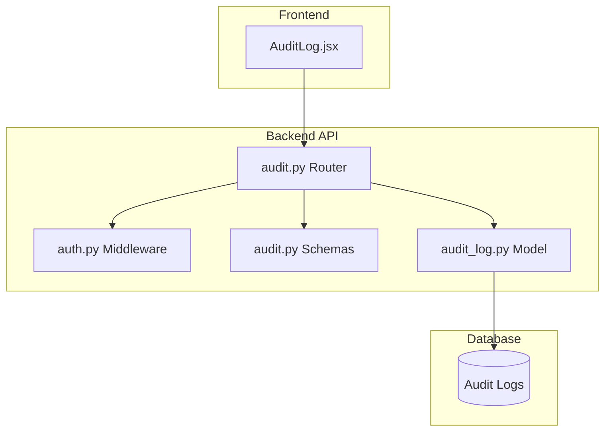
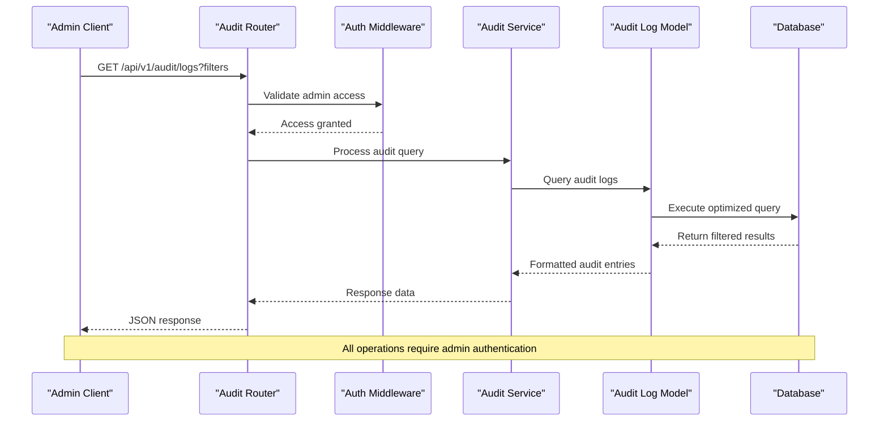
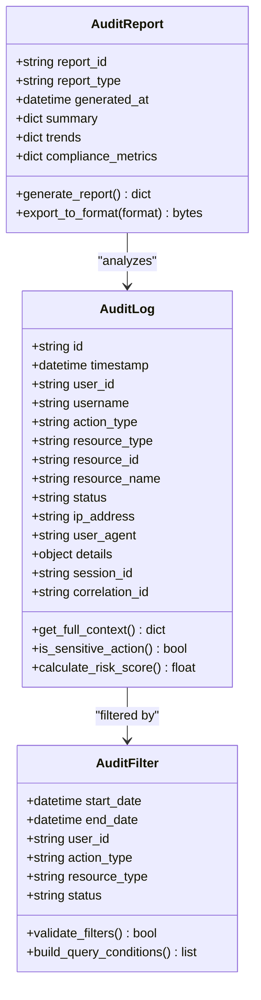
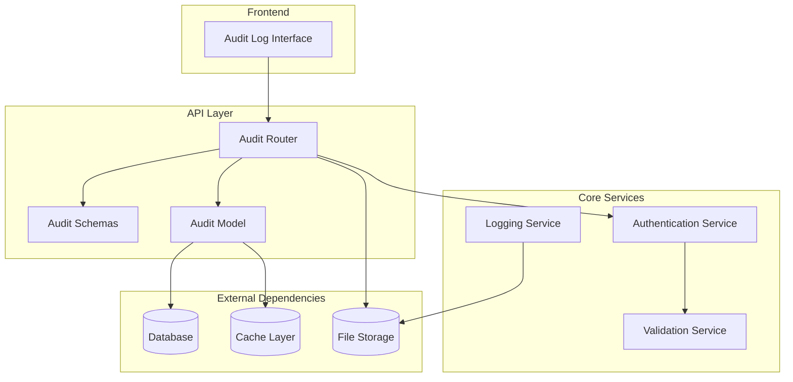

# Audit Logging API

<cite>
**Referenced Files in This Document**
- [audit.py](file://backend/app/routers/audit.py)
- [audit_log.py](file://backend/app/models/audit_log.py)
- [audit.py](file://backend/app/schemas/audit.py)
- [auth.py](file://backend/app/middleware/auth.py)
- [main.py](file://backend/app/main.py)
- [AuditLog.jsx](file://frontend/src/pages/admin/AuditLog.jsx)
</cite>

## Table of Contents
1. [Introduction](#introduction)
2. [Project Structure](#project-structure)
3. [Core Components](#core-components)
4. [Architecture Overview](#architecture-overview)
5. [Detailed Component Analysis](#detailed-component-analysis)
6. [Dependency Analysis](#dependency-analysis)
7. [Performance Considerations](#performance-considerations)
8. [Troubleshooting Guide](#troubleshooting-guide)
9. [Conclusion](#conclusion)
10. [Appendices](#appendices)

## Introduction

The Audit Logging API provides comprehensive tracking and reporting capabilities for system operations, user actions, resource changes, and approval decisions. This API enables administrators to monitor system activities, generate compliance reports, and maintain detailed audit trails for regulatory requirements. The system supports advanced filtering, date range queries, user-specific searches, and export functionality for audit logs.

## Project Structure

The audit logging system is implemented as a modular component within the backend application, following RESTful API design principles. The architecture separates concerns between routing, data models, schema validation, and middleware authentication.



**Diagram sources**
- [audit.py](file://backend/app/routers/audit.py)
- [auth.py](file://backend/app/middleware/auth.py)
- [audit.py](file://backend/app/schemas/audit.py)
- [audit_log.py](file://backend/app/models/audit_log.py)
- [AuditLog.jsx](file://frontend/src/pages/admin/AuditLog.jsx)

**Section sources**
- [audit.py](file://backend/app/routers/audit.py)
- [audit_log.py](file://backend/app/models/audit_log.py)
- [audit.py](file://backend/app/schemas/audit.py)
- [auth.py](file://backend/app/middleware/auth.py)
- [AuditLog.jsx](file://frontend/src/pages/admin/AuditLog.jsx)

## Core Components

### Authentication and Authorization
The audit logging system implements strict access controls requiring administrator privileges for all audit-related operations. Authentication middleware validates user sessions and enforces role-based access control before processing any audit log requests.

### Data Models
The audit log model defines the core data structure for capturing system events, including timestamps, user information, action types, resource details, and contextual metadata. The model supports efficient querying and indexing for performance optimization.

### Schema Validation
Pydantic schemas provide request/response validation, ensuring data integrity and type safety across API endpoints. The schemas define audit entry structures, filter parameters, and report formats.

### API Endpoints
The router module implements RESTful endpoints for audit log retrieval, filtering, and reporting. Each endpoint includes proper error handling, input validation, and response formatting.

**Section sources**
- [auth.py](file://backend/app/middleware/auth.py)
- [audit_log.py](file://backend/app/models/audit_log.py)
- [audit.py](file://backend/app/schemas/audit.py)
- [audit.py](file://backend/app/routers/audit.py)

## Architecture Overview

The audit logging system follows a layered architecture pattern with clear separation of concerns:



**Diagram sources**
- [audit.py](file://backend/app/routers/audit.py)
- [auth.py](file://backend/app/middleware/auth.py)
- [audit_log.py](file://backend/app/models/audit_log.py)

## Detailed Component Analysis

### Audit Log Retrieval Endpoint

#### GET /api/v1/audit/logs

Retrieves audit logs with comprehensive filtering capabilities. Supports pagination, sorting, and multiple filter criteria for precise log searching.

**Authentication**: Administrator only  
**Rate Limiting**: 100 requests per minute  
**Response Format**: JSON array of audit entries

##### Request Parameters

| Parameter | Type | Required | Description | Example |
|-----------|------|----------|-------------|---------|
| start_date | string | No | Start date for log filtering (ISO 8601) | "2024-01-01T00:00:00Z" |
| end_date | string | No | End date for log filtering (ISO 8601) | "2024-12-31T23:59:59Z" |
| user_id | string | No | Filter by specific user ID | "user-123" |
| action_type | string | No | Filter by action category | "USER_CREATE", "RESOURCE_MODIFY" |
| resource_type | string | No | Filter by resource category | "VM", "NETWORK", "STORAGE" |
| status | string | No | Filter by operation status | "SUCCESS", "FAILURE" |
| page | integer | No | Page number for pagination | 1 |
| limit | integer | No | Results per page (max 1000) | 50 |
| sort_by | string | No | Sort field | "timestamp" |
| sort_order | string | No | Sort direction | "desc" |

##### Response Schema

```json
{
  "data": [
    {
      "id": "uuid-string",
      "timestamp": "2024-01-15T10:30:00Z",
      "user_id": "admin-user-123",
      "username": "john.doe@company.com",
      "action_type": "USER_CREATE",
      "resource_type": "USER",
      "resource_id": "user-456",
      "resource_name": "new_user_account",
      "status": "SUCCESS",
      "ip_address": "192.168.1.100",
      "user_agent": "Mozilla/5.0...",
      "details": {
        "field_changes": ["email", "role"],
        "previous_values": null,
        "new_values": {"role": "admin"}
      },
      "session_id": "session-abc-123",
      "correlation_id": "req-corr-789"
    }
  ],
  "pagination": {
    "total": 1500,
    "page": 1,
    "limit": 50,
    "has_next": true,
    "has_prev": false
  },
  "filters_applied": {
    "start_date": "2024-01-01T00:00:00Z",
    "end_date": "2024-12-31T23:59:59Z",
    "user_id": "admin-user-123"
  }
}
```

##### Example Queries

**Date Range Filter:**
```
GET /api/v1/audit/logs?start_date=2024-01-01T00:00:00Z&end_date=2024-01-31T23:59:59Z
```

**User-Specific Actions:**
```
GET /api/v1/audit/logs?user_id=admin-user-123&action_type=USER_CREATE
```

**Resource Changes:**
```
GET /api/v1/audit/logs?resource_type=VM&status=FAILURE
```

**Complex Filtering:**
```
GET /api/v1/audit/logs?start_date=2024-01-01T00:00:00Z&user_id=admin-user-123&action_type=RESOURCE_MODIFY&page=1&limit=100
```

**Section sources**
- [audit.py](file://backend/app/routers/audit.py)
- [audit.py](file://backend/app/schemas/audit.py)

### Individual Audit Log Retrieval

#### GET /api/v1/audit/logs/{id}

Retrieves a specific audit log entry by its unique identifier. Provides complete details including full context information and related metadata.

**Authentication**: Administrator only  
**Response Format**: Single audit entry object

##### Path Parameters

| Parameter | Type | Required | Description |
|-----------|------|----------|-------------|
| id | string | Yes | Unique audit log identifier |

##### Response Schema

```json
{
  "id": "audit-log-uuid",
  "timestamp": "2024-01-15T10:30:00Z",
  "user_id": "admin-user-123",
  "username": "john.doe@company.com",
  "action_type": "USER_CREATE",
  "resource_type": "USER",
  "resource_id": "user-456",
  "resource_name": "new_user_account",
  "status": "SUCCESS",
  "ip_address": "192.168.1.100",
  "user_agent": "Mozilla/5.0...",
  "details": {
    "field_changes": ["email", "role", "permissions"],
    "previous_values": {
      "role": "user",
      "permissions": ["read"]
    },
    "new_values": {
      "role": "admin",
      "permissions": ["read", "write", "delete", "manage_users"]
    }
  },
  "session_id": "session-abc-123",
  "correlation_id": "req-corr-789",
  "request_headers": {
    "content-type": "application/json",
    "accept": "application/json"
  },
  "response_code": 201,
  "processing_time_ms": 45
}
```

**Section sources**
- [audit.py](file://backend/app/routers/audit.py)

### Audit Reports Generation

#### GET /api/v1/audit/reports

Generates comprehensive audit reports with aggregated statistics, trends analysis, and compliance summaries. Supports various report types and export formats.

**Authentication**: Administrator only  
**Report Types**: Activity Summary, Compliance Report, Security Analysis, User Activity Report  
**Export Formats**: JSON, CSV, PDF

##### Request Parameters

| Parameter | Type | Required | Description | Example |
|-----------|------|----------|-------------|---------|
| report_type | string | Yes | Type of report to generate | "activity_summary" |
| start_date | string | Yes | Report period start (ISO 8601) | "2024-01-01T00:00:00Z" |
| end_date | string | Yes | Report period end (ISO 8601) | "2024-01-31T23:59:59Z" |
| format | string | No | Export format (default: json) | "csv" |
| include_details | boolean | No | Include detailed breakdowns | true |
| group_by | string | No | Group results by field | "user_id" |

##### Report Types

**Activity Summary Report:**
```
GET /api/v1/audit/reports?report_type=activity_summary&start_date=2024-01-01T00:00:00Z&end_date=2024-01-31T23:59:59Z
```

**Compliance Report:**
```
GET /api/v1/audit/reports?report_type=compliance&format=pdf&include_details=true
```

**Security Analysis Report:**
```
GET /api/v1/audit/reports?report_type=security_analysis&group_by=user_id
```

##### Response Schema

```json
{
  "report_id": "report-uuid",
  "report_type": "activity_summary",
  "generated_at": "2024-01-15T10:30:00Z",
  "period": {
    "start_date": "2024-01-01T00:00:00Z",
    "end_date": "2024-01-31T23:59:59Z"
  },
  "summary": {
    "total_events": 15000,
    "unique_users": 45,
    "success_rate": 98.5,
    "failed_operations": 225,
    "top_actions": [
      {"type": "USER_LOGIN", "count": 5000},
      {"type": "RESOURCE_CREATE", "count": 3000},
      {"type": "USER_UPDATE", "count": 2500}
    ]
  },
  "trends": {
    "daily_activity": [
      {"date": "2024-01-01", "count": 500},
      {"date": "2024-01-02", "count": 480}
    ],
    "peak_hours": [9, 10, 11, 14, 15],
    "growth_rate": "+12.5%"
  },
  "compliance_metrics": {
    "access_controls_verified": true,
    "data_retention_compliant": true,
    "encryption_status": "enabled",
    "last_audit_date": "2024-01-10T00:00:00Z"
  },
  "export_url": "/api/v1/audit/reports/report-uuid/export",
  "expires_at": "2024-01-22T10:30:00Z"
}
```

**Section sources**
- [audit.py](file://backend/app/routers/audit.py)

### Audit Log Entry Structure

The audit log system captures comprehensive information about every significant system operation:



**Diagram sources**
- [audit_log.py](file://backend/app/models/audit_log.py)
- [audit.py](file://backend/app/schemas/audit.py)

**Section sources**
- [audit_log.py](file://backend/app/models/audit_log.py)
- [audit.py](file://backend/app/schemas/audit.py)

## Dependency Analysis

The audit logging system maintains clean dependencies and follows SOLID principles:



**Diagram sources**
- [audit.py](file://backend/app/routers/audit.py)
- [audit_log.py](file://backend/app/models/audit_log.py)
- [auth.py](file://backend/app/middleware/auth.py)

### Key Dependencies

- **Database Layer**: PostgreSQL with optimized indexes for audit log queries
- **Authentication**: JWT-based session management with role-based access control
- **Caching**: Redis cache for frequently accessed audit statistics
- **Storage**: Object storage for exported reports and large audit datasets
- **Validation**: Pydantic schemas for request/response validation

**Section sources**
- [audit.py](file://backend/app/routers/audit.py)
- [audit_log.py](file://backend/app/models/audit_log.py)
- [auth.py](file://backend/app/middleware/auth.py)

## Performance Considerations

### Database Optimization
- Indexed columns: timestamp, user_id, action_type, resource_type
- Partitioned tables by month for improved query performance
- Materialized views for common aggregation queries
- Connection pooling with configurable limits

### Caching Strategy
- Short-term cache (5 minutes) for frequently accessed audit statistics
- Long-term cache (24 hours) for report generation results
- Cache invalidation on new audit log creation
- Distributed caching for multi-instance deployments

### Query Optimization
- Efficient filtering with composite indexes
- Pagination with cursor-based navigation for large datasets
- Lazy loading of detailed audit information
- Batch processing for bulk operations

### Rate Limiting and Throttling
- Per-user rate limiting to prevent abuse
- Adaptive throttling based on system load
- Priority queuing for critical audit operations
- Graceful degradation under high load conditions

## Troubleshooting Guide

### Common Issues and Solutions

**Authentication Failures:**
- Verify administrator role assignment
- Check JWT token expiration and refresh
- Ensure proper session configuration
- Validate CORS settings for cross-origin requests

**Performance Issues:**
- Monitor database query execution times
- Check cache hit ratios and memory usage
- Review index utilization and fragmentation
- Analyze connection pool saturation

**Data Integrity Problems:**
- Verify audit log completeness and consistency
- Check for duplicate entries or missing records
- Validate timestamp synchronization across services
- Ensure proper transaction boundaries

**Export Failures:**
- Verify file storage permissions and quotas
- Check available disk space for large exports
- Validate export format compatibility
- Monitor network bandwidth for large downloads

### Monitoring and Alerting
- Real-time monitoring of audit log ingestion rates
- Alerting on unusual access patterns or security events
- Performance metrics collection and analysis
- Automated health checks and system diagnostics

**Section sources**
- [audit.py](file://backend/app/routers/audit.py)
- [auth.py](file://backend/app/middleware/auth.py)

## Conclusion

The Audit Logging API provides a robust, secure, and scalable solution for comprehensive system activity tracking and compliance reporting. The system's modular architecture, strict access controls, and advanced filtering capabilities make it suitable for enterprise environments with stringent regulatory requirements. The implementation follows best practices for performance optimization, data integrity, and security while maintaining ease of use for administrators and developers.

Key strengths include:
- Comprehensive audit trail capture with rich contextual information
- Advanced filtering and search capabilities for precise log analysis
- Flexible reporting system supporting multiple export formats
- Strong security model with administrator-only access
- Optimized performance for large-scale deployments
- Extensible architecture supporting custom audit event types

## Appendices

### A. Audit Action Types

| Category | Action Type | Description | Sensitivity Level |
|----------|-------------|-------------|-------------------|
| User Management | USER_CREATE | New user account creation | HIGH |
| User Management | USER_UPDATE | User profile modifications | MEDIUM |
| User Management | USER_DELETE | User account deletion | HIGH |
| User Management | USER_ROLE_CHANGE | Role or permission changes | HIGH |
| Resource Management | RESOURCE_CREATE | New resource provisioning | MEDIUM |
| Resource Management | RESOURCE_MODIFY | Resource configuration changes | MEDIUM |
| Resource Management | RESOURCE_DELETE | Resource destruction | HIGH |
| System Operations | CONFIG_CHANGE | System configuration updates | HIGH |
| System Operations | BACKUP_OPERATION | Backup and restore operations | MEDIUM |
| Security | LOGIN_SUCCESS | Successful user authentication | LOW |
| Security | LOGIN_FAILURE | Failed authentication attempts | MEDIUM |
| Security | ACCESS_DENIED | Unauthorized access attempts | HIGH |

### B. Compliance Requirements Support

The audit logging system supports compliance with major regulatory frameworks:

- **SOX**: Financial reporting controls and change management
- **GDPR**: Personal data protection and privacy controls
- **HIPAA**: Healthcare data protection and access controls
- **PCI DSS**: Payment card industry data security standards
- **SOC 2**: Service organization controls and security measures

### C. Integration Examples

**Webhook Integration:**
```
POST /api/v1/audit/webhooks
{
  "url": "https://your-service.com/audit-events",
  "events": ["USER_CREATE", "USER_DELETE", "CONFIG_CHANGE"],
  "secret": "webhook-secret-key",
  "active": true
}
```

**Bulk Export API:**
```
POST /api/v1/audit/export/bulk
{
  "filters": {
    "start_date": "2024-01-01T00:00:00Z",
    "end_date": "2024-01-31T23:59:59Z",
    "formats": ["json", "csv", "xml"]
  },
  "notification_email": "admin@company.com"
}
```

**Section sources**
- [audit.py](file://backend/app/routers/audit.py)
- [audit_log.py](file://backend/app/models/audit_log.py)