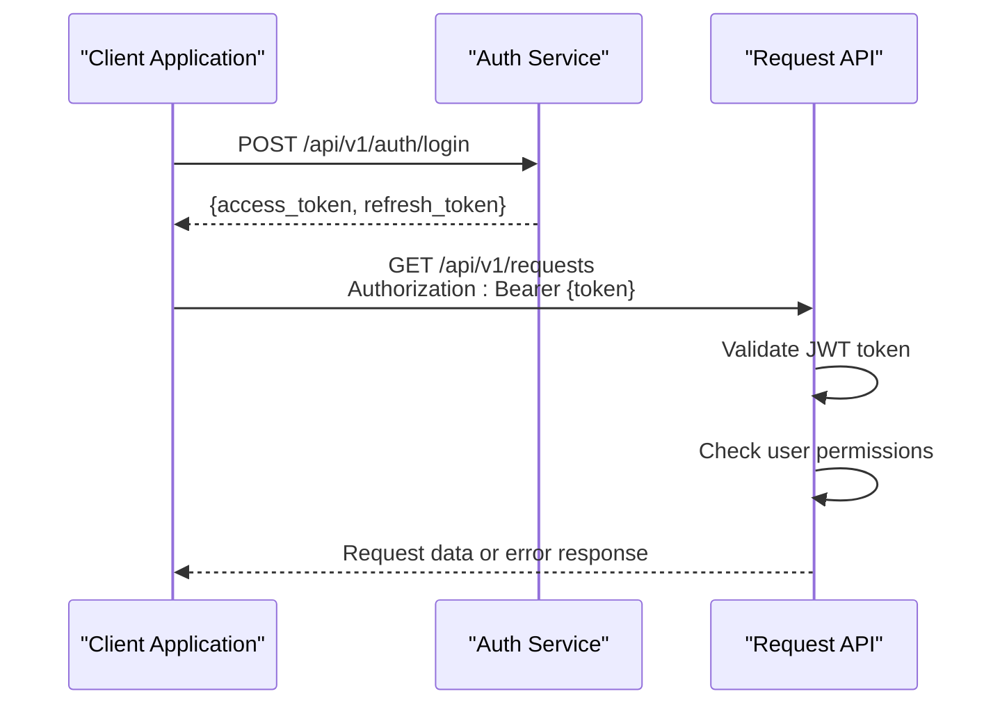
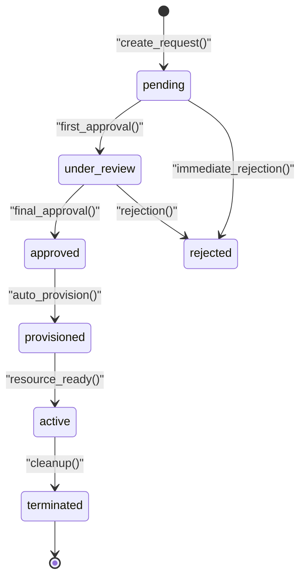
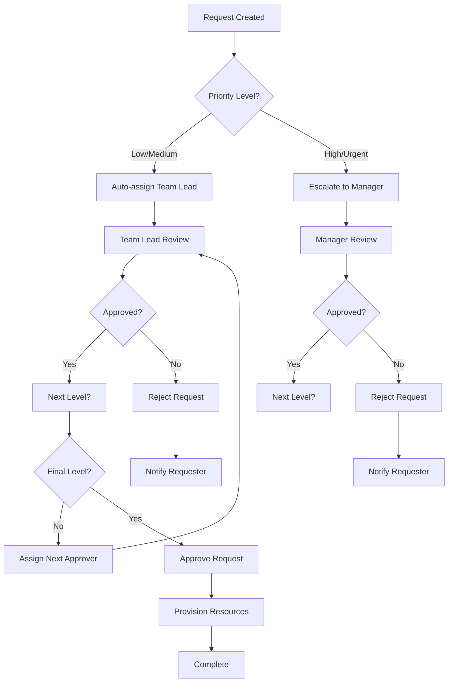
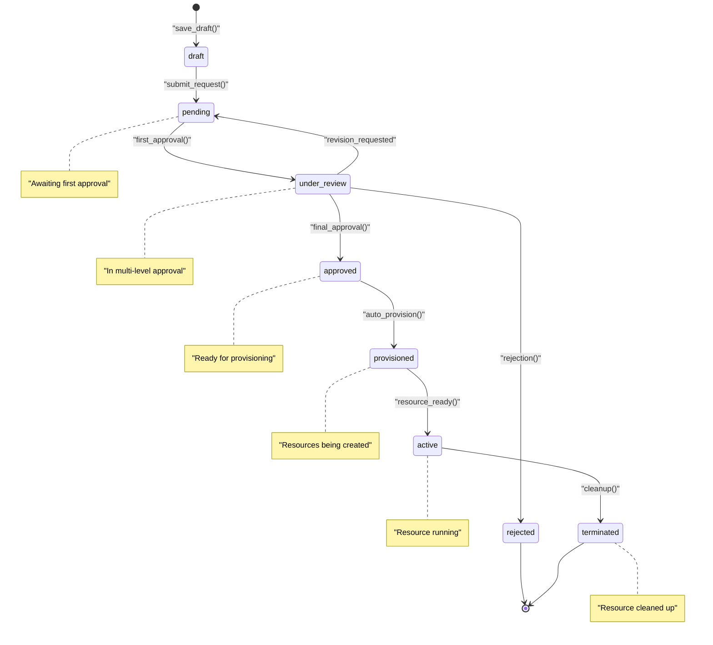

# Request Workflow API

<cite>
**Referenced Files in This Document**
- [requests.py](file://backend/app/routers/requests.py)
- [approvals.py](file://backend/app/routers/approvals.py)
- [request.py](file://backend/app/schemas/request.py)
- [approval.py](file://backend/app/schemas/approval.py)
- [request_model.py](file://backend/app/models/request.py)
- [auth_middleware.py](file://backend/app/middleware/auth.py)
- [main.py](file://backend/app/main.py)
</cite>

## Table of Contents
1. [Introduction](#introduction)
2. [Authentication & Authorization](#authentication--authorization)
3. [Request Submission API](#request-submission-api)
4. [Request Retrieval API](#request-retrieval-api)
5. [Status Management API](#status-management-api)
6. [Approval Chain Management](#approval-chain-management)
7. [Audit Trail & History](#audit-trail--history)
8. [Error Handling](#error-handling)
9. [Request Lifecycle States](#request-lifecycle-states)
10. [Examples & Use Cases](#examples--use-cases)
11. [Security Considerations](#security-considerations)

## Introduction

The Request Workflow API provides a comprehensive system for managing ECS (Elastic Compute Service) resource requests through a structured approval process. The API supports end-to-end request lifecycle management from initial submission through approval/rejection workflows, with full audit trail capabilities and role-based access control.

### Key Features
- **Template-Based Requests**: Submit requests using predefined templates
- **Multi-Level Approval**: Configurable approval chains with multiple approvers
- **Real-time Tracking**: Monitor request status and progress
- **Audit Compliance**: Complete history tracking for compliance requirements
- **Role-Based Access**: User-specific submissions and admin-level approvals

## Authentication & Authorization

The API implements JWT-based authentication with role-based authorization:

### Authentication Flow


**Diagram sources**
- [auth_middleware.py](file://backend/app/middleware/auth.py)
- [main.py](file://backend/app/main.py)

### Permission Matrix
| Role | Create Requests | View Own Requests | Approve/Reject | View All Requests | Audit Access |
|------|----------------|-------------------|----------------|-------------------|--------------|
| User | ✅ | ✅ | ❌ | ❌ | ❌ |
| Approver | ✅ | ✅ | ✅ | ❌ | ❌ |
| Admin | ✅ | ✅ | ✅ | ✅ | ✅ |

## Request Submission API

### POST /api/v1/requests

Creates a new resource request using a selected template.

#### Request Schema
```json
{
  "template_id": "string",
  "parameters": {
    "instance_type": "string",
    "region": "string", 
    "count": "integer",
    "tags": ["string"]
  },
  "justification": "string",
  "priority": "low|medium|high|urgent"
}
```

#### Response Schema
```json
{
  "id": "uuid",
  "template_id": "string", 
  "status": "pending",
  "created_by": "user_id",
  "created_at": "timestamp",
  "approval_chain": [
    {
      "role": "manager",
      "status": "pending",
      "assigned_to": "user_id"
    }
  ]
}
```

#### Example Request
```bash
curl -X POST http://localhost:8000/api/v1/requests \
  -H "Authorization: Bearer YOUR_TOKEN" \
  -H "Content-Type: application/json" \
  -d '{
    "template_id": "ecs-standard-instance",
    "parameters": {
      "instance_type": "ecs.g6.large",
      "region": "cn-hangzhou",
      "count": 2,
      "tags": ["production", "web-server"]
    },
    "justification": "Need additional instances for Q4 traffic spike",
    "priority": "high"
  }'
```

#### Validation Rules
- Template must exist and be active
- Parameters must match template schema
- Justification is required for high/urgent priority
- User must have permission to use the specified template

**Section sources**
- [requests.py](file://backend/app/routers/requests.py)
- [request.py](file://backend/app/schemas/request.py)
- [request_model.py](file://backend/app/models/request.py)

## Request Retrieval API

### GET /api/v1/requests

Retrieves paginated list of requests with filtering and sorting options.

#### Query Parameters
| Parameter | Type | Description | Default |
|-----------|------|-------------|---------|
| page | integer | Page number | 1 |
| limit | integer | Items per page | 20 |
| status | string | Filter by status | all |
| created_by | string | Filter by creator | current_user |
| template_id | string | Filter by template | none |
| sort_by | string | Sort field | created_at |
| order | string | Sort direction | desc |

#### Response Schema
```json
{
  "items": [
    {
      "id": "uuid",
      "template_name": "string",
      "status": "pending",
      "priority": "high",
      "created_by": "user_id",
      "created_at": "timestamp",
      "updated_at": "timestamp",
      "current_approver": "user_id|null"
    }
  ],
  "total": "integer",
  "page": "integer", 
  "limit": "integer",
  "has_next": "boolean",
  "has_prev": "boolean"
}
```

#### Example Request
```bash
curl -X GET "http://localhost:8000/api/v1/requests?page=1&limit=10&status=pending&sort_by=created_at&order=desc" \
  -H "Authorization: Bearer YOUR_TOKEN"
```

### GET /api/v1/requests/{id}

Retrieves detailed information about a specific request including full approval chain and audit history.

#### Path Parameters
| Parameter | Type | Description |
|-----------|------|-------------|
| id | uuid | Request identifier |

#### Response Schema
```json
{
  "id": "uuid",
  "template_id": "string",
  "template_name": "string",
  "parameters": {},
  "justification": "string",
  "priority": "string",
  "status": "string",
  "created_by": "user_id",
  "approved_by": "user_id|null",
  "created_at": "timestamp",
  "updated_at": "timestamp",
  "approval_chain": [
    {
      "step": 1,
      "role": "manager",
      "status": "approved",
      "assigned_to": "user_id",
      "action_by": "user_id",
      "action_at": "timestamp",
      "comments": "Approved for production use"
    }
  ],
  "audit_trail": [
    {
      "action": "request_created",
      "user_id": "user_id",
      "timestamp": "timestamp",
      "details": {}
    }
  ]
}
```

**Section sources**
- [requests.py](file://backend/app/routers/requests.py)
- [request.py](file://backend/app/schemas/request.py)

## Status Management API

### PATCH /api/v1/requests/{id}/status

Updates the status of a request. Requires appropriate approval permissions.

#### Request Schema
```json
{
  "status": "approved|rejected",
  "comments": "string",
  "next_approver": "user_id|null"
}
```

#### Response Schema
```json
{
  "id": "uuid",
  "status": "approved",
  "updated_by": "user_id",
  "updated_at": "timestamp",
  "approval_chain": [...],
  "audit_entry": {
    "action": "status_updated",
    "user_id": "user_id",
    "timestamp": "timestamp",
    "details": {"status": "approved"}
  }
}
```

#### Status Transition Rules


**Diagram sources**
- [approvals.py](file://backend/app/routers/approvals.py)
- [request_model.py](file://backend/app/models/request.py)

#### Example Status Update
```bash
curl -X PATCH http://localhost:8000/api/v1/requests/req-123/status \
  -H "Authorization: Bearer YOUR_ADMIN_TOKEN" \
  -H "Content-Type: application/json" \
  -d '{
    "status": "approved",
    "comments": "Approved for production deployment",
    "next_approver": null
  }'
```

**Section sources**
- [requests.py](file://backend/app/routers/requests.py)
- [approvals.py](file://backend/app/routers/approvals.py)

## Approval Chain Management

### Multi-Level Approval Process

The system supports configurable approval chains with multiple levels:

#### Approval Chain Configuration
```json
{
  "chain_id": "standard-prod",
  "steps": [
    {
      "level": 1,
      "role": "team_lead",
      "required": true,
      "timeout_hours": 24
    },
    {
      "level": 2, 
      "role": "department_manager",
      "required": true,
      "timeout_hours": 48
    },
    {
      "level": 3,
      "role": "security_officer", 
      "required": false,
      "timeout_hours": 72
    }
  ]
}
```

#### Approval Workflow


**Diagram sources**
- [approvals.py](file://backend/app/routers/approvals.py)
- [approval.py](file://backend/app/schemas/approval.py)

## Audit Trail & History

### Audit Log Endpoints

#### GET /api/v1/audit/logs

Retrieves audit logs with filtering capabilities.

##### Query Parameters
| Parameter | Type | Description |
|-----------|------|-------------|
| entity_type | string | Filter by entity type |
| entity_id | string | Filter by entity ID |
| action | string | Filter by action type |
| user_id | string | Filter by user |
| start_date | timestamp | Start date filter |
| end_date | timestamp | End date filter |

#### Audit Log Schema
```json
{
  "id": "uuid",
  "entity_type": "request",
  "entity_id": "uuid",
  "action": "status_updated",
  "user_id": "user_id",
  "timestamp": "timestamp",
  "ip_address": "string",
  "user_agent": "string",
  "details": {
    "old_status": "pending",
    "new_status": "approved",
    "comments": "Approved for production"
  },
  "metadata": {}
}
```

#### Example Audit Query
```bash
curl -X GET "http://localhost:8000/api/v1/audit/logs?entity_type=request&action=status_updated&start_date=2024-01-01T00:00:00Z" \
  -H "Authorization: Bearer YOUR_ADMIN_TOKEN"
```

**Section sources**
- [audit.py](file://backend/app/routers/audit.py)
- [audit.py](file://backend/app/schemas/audit.py)

## Error Handling

### Standard Error Response Format
```json
{
  "error": {
    "code": "INVALID_TEMPLATE",
    "message": "Template 'ecs-large-instance' not found or inactive",
    "details": {
      "template_id": "ecs-large-instance",
      "available_templates": ["ecs-small-instance", "ecs-medium-instance"]
    },
    "timestamp": "2024-01-15T10:30:00Z"
  }
}
```

### Common Error Codes
| Error Code | HTTP Status | Description | Resolution |
|------------|-------------|-------------|------------|
| INVALID_TEMPLATE | 400 | Template not found or inactive | Use valid template ID |
| INSUFFICIENT_PERMISSIONS | 403 | User lacks required role | Contact admin for access |
| INVALID_STATUS_TRANSITION | 400 | Cannot transition to requested state | Check current workflow state |
| REQUEST_NOT_FOUND | 404 | Request ID doesn't exist | Verify request ID |
| APPROVAL_TIMEOUT | 408 | Approval deadline exceeded | Escalate to next level |
| DUPLICATE_REQUEST | 409 | Similar request already exists | Check existing requests |

### Error Handling Examples

#### Invalid Template Error
```bash
curl -X POST http://localhost:8000/api/v1/requests \
  -H "Authorization: Bearer YOUR_TOKEN" \
  -H "Content-Type: application/json" \
  -d '{
    "template_id": "non-existent-template",
    "parameters": {},
    "justification": "Test"
  }'
```

Response:
```json
{
  "error": {
    "code": "INVALID_TEMPLATE",
    "message": "Template 'non-existent-template' not found",
    "details": {
      "available_templates": ["ecs-standard-instance", "ecs-dev-instance"]
    }
  }
}
```

#### Insufficient Permissions Error
```bash
curl -X PATCH http://localhost:8000/api/v1/requests/req-123/status \
  -H "Authorization: Bearer USER_TOKEN" \
  -H "Content-Type: application/json" \
  -d '{
    "status": "approved",
    "comments": "Unauthorized approval attempt"
  }'
```

Response:
```json
{
  "error": {
    "code": "INSUFFICIENT_PERMISSIONS", 
    "message": "User lacks approval privileges",
    "details": {
      "required_role": "approver",
      "user_roles": ["user"]
    }
  }
}
```

**Section sources**
- [requests.py](file://backend/app/routers/requests.py)
- [auth_middleware.py](file://backend/app/middleware/auth.py)

## Request Lifecycle States

### State Machine Overview

The request lifecycle follows a well-defined state machine:



### State Transition Rules

| Current State | Allowed Transitions | Required Role | Conditions |
|---------------|-------------------|---------------|------------|
| draft | pending | requester | Valid parameters |
| pending | under_review | first_approver | No validation errors |
| pending | rejected | any_approver | Immediate rejection |
| under_review | approved | final_approver | All conditions met |
| under_review | pending | any_approver | Revision needed |
| under_review | rejected | any_approver | Rejection decision |
| approved | provisioned | system | Auto-triggered |
| provisioned | active | system | Resource ready |
| active | terminated | admin | Cleanup initiated |

## Examples & Use Cases

### Complete Request Submission Workflow

#### Step 1: Get Available Templates
```bash
curl -X GET http://localhost:8000/api/v1/templates \
  -H "Authorization: Bearer YOUR_TOKEN"
```

#### Step 2: Submit New Request
```bash
curl -X POST http://localhost:8000/api/v1/requests \
  -H "Authorization: Bearer YOUR_TOKEN" \
  -H "Content-Type: application/json" \
  -d '{
    "template_id": "ecs-production-instance",
    "parameters": {
      "instance_type": "ecs.g6.xlarge",
      "region": "cn-shanghai",
      "count": 3,
      "storage_gb": 100,
      "tags": ["production", "web-tier", "q4-2024"]
    },
    "justification": "Required for Q4 product launch with expected 3x traffic increase",
    "priority": "high"
  }'
```

#### Step 3: Track Request Progress
```bash
curl -X GET http://localhost:8000/api/v1/requests/req-abc123 \
  -H "Authorization: Bearer YOUR_TOKEN"
```

#### Step 4: Approve Request (Admin)
```bash
curl -X PATCH http://localhost:8000/api/v1/requests/req-abc123/status \
  -H "Authorization: Bearer ADMIN_TOKEN" \
  -H "Content-Type: application/json" \
  -d '{
    "status": "approved",
    "comments": "Approved for production deployment",
    "next_approver": null
  }'
```

### Bulk Operations

#### Batch Request Creation
```bash
curl -X POST http://localhost:8000/api/v1/requests/batch \
  -H "Authorization: Bearer YOUR_TOKEN" \
  -H "Content-Type: application/json" \
  -d '{
    "requests": [
      {
        "template_id": "ecs-dev-instance",
        "parameters": {"instance_type": "ecs.t5.small"},
        "justification": "Development environment setup"
      },
      {
        "template_id": "ecs-test-instance", 
        "parameters": {"instance_type": "ecs.t5.medium"},
        "justification": "Testing infrastructure"
      }
    ]
  }'
```

#### Export Request History
```bash
curl -X GET http://localhost:8000/api/v1/requests/export?format=csv&start_date=2024-01-01 \
  -H "Authorization: Bearer YOUR_ADMIN_TOKEN" \
  -o request_history.csv
```

## Security Considerations

### Input Validation
- All template parameters are validated against schema definitions
- SQL injection prevention through parameterized queries
- XSS protection for user inputs
- Rate limiting on request creation endpoints

### Access Control
- JWT tokens with expiration and refresh mechanisms
- Role-based access control (RBAC) enforcement
- IP whitelisting for administrative operations
- Session management and logout functionality

### Data Protection
- Sensitive parameters encrypted at rest
- Audit logging for all state changes
- Data retention policies for audit trails
- Secure communication via HTTPS/TLS

### Best Practices
- Implement proper error handling without exposing internal details
- Use pagination for large datasets
- Cache frequently accessed template data
- Implement retry logic for external service calls
- Monitor API performance and usage patterns