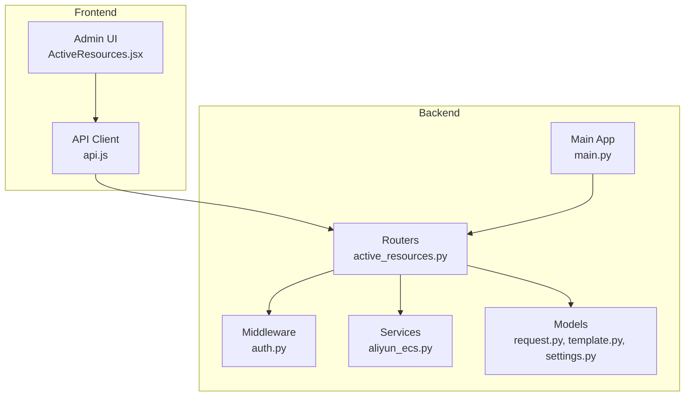
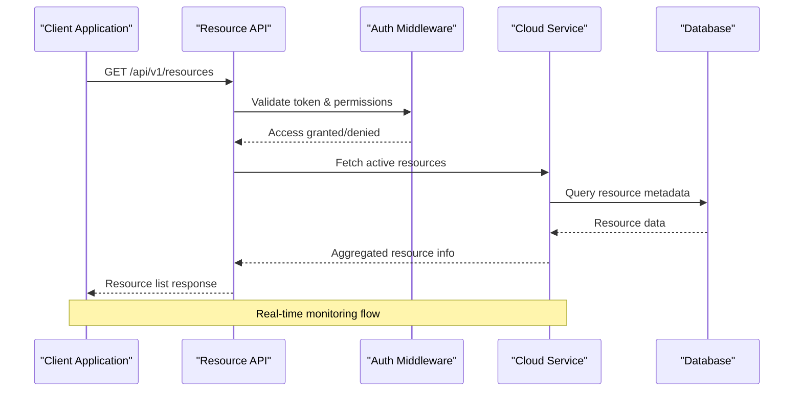
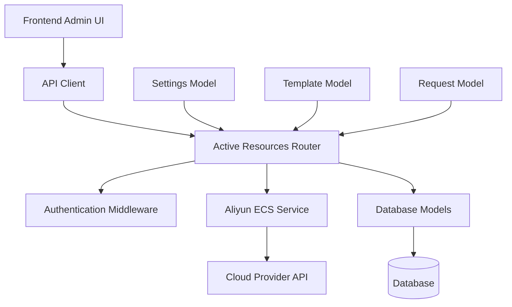

# Resource Monitoring API

<cite>
**Referenced Files in This Document**
- [active_resources.py](file://backend/app/routers/active_resources.py)
- [auth.py](file://backend/app/middleware/auth.py)
- [main.py](file://backend/app/main.py)
- [aliyun_ecs.py](file://backend/app/services/aliyun_ecs.py)
- [request.py](file://backend/app/models/request.py)
- [template.py](file://backend/app/models/template.py)
- [settings.py](file://backend/app/models/settings.py)
- [api.js](file://frontend/src/services/api.js)
- [ActiveResources.jsx](file://frontend/src/pages/admin/ActiveResources.jsx)
</cite>

## Table of Contents
1. [Introduction](#introduction)
2. [Project Structure](#project-structure)
3. [Core Components](#core-components)
4. [Architecture Overview](#architecture-overview)
5. [Detailed Component Analysis](#detailed-component-analysis)
6. [Dependency Analysis](#dependency-analysis)
7. [Performance Considerations](#performance-considerations)
8. [Troubleshooting Guide](#troubleshooting-guide)
9. [Conclusion](#conclusion)
10. [Appendices](#appendices)

## Introduction
This document provides detailed API documentation for active resources monitoring endpoints, focusing on real-time resource status retrieval, health checks, and performance metrics. It covers resource lifecycle monitoring, alerting capabilities, usage statistics, and capacity planning data. The documentation specifies HTTP methods, URL patterns with resource identifiers, request/response schemas, status indicators, and performance metrics. Authentication supports different access levels for viewing resources and administrative operations. Examples include resource status queries, metric aggregation responses, and filtered resource lists by status or type. Real-time updates via WebSocket connections are discussed where applicable, along with polling strategies and error handling for unavailable cloud resources.

## Project Structure
The backend is organized into modular components: routers define API endpoints, middleware handles authentication, services interact with external systems (e.g., Alibaba Cloud ECS), models represent database entities, and schemas define request/response structures. The frontend includes an admin interface for active resources monitoring.



**Diagram sources**
- [active_resources.py](file://backend/app/routers/active_resources.py)
- [auth.py](file://backend/app/middleware/auth.py)
- [aliyun_ecs.py](file://backend/app/services/aliyun_ecs.py)
- [main.py](file://backend/app/main.py)
- [ActiveResources.jsx](file://frontend/src/pages/admin/ActiveResources.jsx)
- [api.js](file://frontend/src/services/api.js)

**Section sources**
- [active_resources.py](file://backend/app/routers/active_resources.py)
- [auth.py](file://backend/app/middleware/auth.py)
- [main.py](file://backend/app/main.py)

## Core Components
The core components for resource monitoring include:

### Active Resources Router
Handles all resource-related API endpoints including listing, retrieving individual resources, and fetching metrics.

### Authentication Middleware
Provides role-based access control for different user types (admin, viewer).

### Cloud Service Integration
Interfaces with Alibaba Cloud ECS to retrieve real-time resource information.

### Data Models
Defines the structure for requests, templates, and system settings.

**Section sources**
- [active_resources.py](file://backend/app/routers/active_resources.py)
- [auth.py](file://backend/app/middleware/auth.py)
- [aliyun_ecs.py](file://backend/app/services/aliyun_ecs.py)
- [request.py](file://backend/app/models/request.py)
- [template.py](file://backend/app/models/template.py)
- [settings.py](file://backend/app/models/settings.py)

## Architecture Overview
The resource monitoring system follows a layered architecture with clear separation of concerns:



**Diagram sources**
- [active_resources.py](file://backend/app/routers/active_resources.py)
- [auth.py](file://backend/app/middleware/auth.py)
- [aliyun_ecs.py](file://backend/app/services/aliyun_ecs.py)

## Detailed Component Analysis

### Active Resources Endpoints

#### List All Active Resources
- **HTTP Method**: GET
- **URL Pattern**: `/api/v1/resources`
- **Authentication**: Required (Viewer/Admin roles)
- **Query Parameters**:
  - `status`: Filter by resource status (running, stopped, pending)
  - `type`: Filter by resource type (ecs_instance, vpc, security_group)
  - `page`: Pagination page number
  - `limit`: Items per page

**Request Schema**:
```json
{
  "query_parameters": {
    "status": "string",
    "type": "string", 
    "page": "integer",
    "limit": "integer"
  }
}
```

**Response Schema**:
```json
{
  "data": [
    {
      "id": "string",
      "name": "string",
      "status": "enum",
      "type": "enum",
      "created_at": "datetime",
      "updated_at": "datetime",
      "metadata": "object"
    }
  ],
  "pagination": {
    "total": "integer",
    "page": "integer",
    "limit": "integer"
  },
  "timestamp": "datetime"
}
```

#### Get Individual Resource Details
- **HTTP Method**: GET  
- **URL Pattern**: `/api/v1/resources/{id}`
- **Authentication**: Required (Viewer/Admin roles)
- **Path Parameters**:
  - `id`: Unique resource identifier

**Response Schema**:
```json
{
  "data": {
    "id": "string",
    "name": "string", 
    "status": "enum",
    "type": "enum",
    "specifications": {
      "cpu_cores": "integer",
      "memory_gb": "number",
      "disk_gb": "integer",
      "network_bandwidth": "string"
    },
    "health_status": "enum",
    "last_updated": "datetime",
    "tags": ["string"],
    "cost_info": {
      "hourly_rate": "number",
      "monthly_estimate": "number",
      "currency": "string"
    }
  },
  "timestamp": "datetime"
}
```

#### Get Resource Metrics
- **HTTP Method**: GET
- **URL Pattern**: `/api/v1/resources/{id}/metrics`
- **Authentication**: Required (Admin role)
- **Query Parameters**:
  - `period`: Time period (1h, 6h, 24h, 7d, 30d)
  - `granularity`: Data granularity (minute, hour, day)
  - `metrics`: Comma-separated list of specific metrics

**Response Schema**:
```json
{
  "data": {
    "resource_id": "string",
    "period": "string",
    "granularity": "string",
    "metrics": {
      "cpu_usage": {
        "current": "number",
        "average": "number", 
        "peak": "number",
        "trend": "enum"
      },
      "memory_usage": {
        "current": "number",
        "average": "number",
        "peak": "number", 
        "trend": "enum"
      },
      "disk_io": {
        "read_ops": "number",
        "write_ops": "number",
        "throughput": "number"
      },
      "network": {
        "inbound_bytes": "number",
        "outbound_bytes": "number",
        "connections": "number"
      }
    },
    "alerts": [
      {
        "type": "string",
        "severity": "enum",
        "message": "string",
        "timestamp": "datetime"
      }
    ]
  },
  "timestamp": "datetime"
}
```

### Health Check Endpoint
- **HTTP Method**: GET
- **URL Pattern**: `/api/v1/health`
- **Authentication**: None required
- **Purpose**: System health monitoring and readiness checks

**Response Schema**:
```json
{
  "status": "healthy|degraded|unhealthy",
  "components": {
    "database": "connected|disconnected",
    "cloud_provider": "available|unavailable",
    "cache": "connected|disconnected"
  },
  "version": "string",
  "uptime_seconds": "number",
  "timestamp": "datetime"
}
```

### Real-time Updates via WebSocket
For real-time resource monitoring, WebSocket connections are supported:

- **Connection URL**: `ws://api-server/ws/resources`
- **Authentication**: Token-based via connection parameters
- **Message Types**:
  - `resource_update`: Real-time resource status changes
  - `metric_snapshot`: Periodic performance metrics
  - `alert_notification`: Critical alerts and warnings

**WebSocket Message Schema**:
```json
{
  "type": "resource_update|metric_snapshot|alert_notification",
  "data": "object",
  "timestamp": "datetime",
  "resource_id": "string"
}
```

**Section sources**
- [active_resources.py](file://backend/app/routers/active_resources.py)
- [auth.py](file://backend/app/middleware/auth.py)

## Dependency Analysis



**Diagram sources**
- [active_resources.py](file://backend/app/routers/active_resources.py)
- [auth.py](file://backend/app/middleware/auth.py)
- [aliyun_ecs.py](file://backend/app/services/aliyun_ecs.py)
- [request.py](file://backend/app/models/request.py)
- [template.py](file://backend/app/models/template.py)
- [settings.py](file://backend/app/models/settings.py)

**Section sources**
- [active_resources.py](file://backend/app/routers/active_resources.py)
- [aliyun_ecs.py](file://backend/app/services/aliyun_ecs.py)

## Performance Considerations

### Caching Strategy
- Implement Redis caching for frequently accessed resource data
- Cache TTL configuration based on resource update frequency
- Cache invalidation on resource state changes

### Database Optimization
- Use efficient indexing on resource status and type fields
- Implement pagination for large resource lists
- Optimize queries for metric aggregation

### Rate Limiting
- Apply rate limiting to prevent API abuse
- Different limits for authenticated vs unauthenticated requests
- Burst allowance for monitoring applications

### Connection Pooling
- Efficient database connection management
- Cloud provider API connection reuse
- WebSocket connection pooling for real-time updates

## Troubleshooting Guide

### Common Error Responses

#### Authentication Errors
- **401 Unauthorized**: Invalid or expired authentication token
- **403 Forbidden**: Insufficient permissions for requested operation

#### Resource Not Found
- **404 Not Found**: Requested resource does not exist
- **410 Gone**: Resource has been permanently deleted

#### Service Unavailable
- **503 Service Unavailable**: Cloud provider service temporarily down
- **504 Gateway Timeout**: External API call timeout exceeded

#### Rate Limiting
- **429 Too Many Requests**: Exceeded API rate limit
- Retry with exponential backoff strategy

### Debugging Tools
- Enable detailed logging for API requests
- Monitor cloud provider API response times
- Track database query performance
- Alert on unusual error patterns

**Section sources**
- [auth.py](file://backend/app/middleware/auth.py)
- [aliyun_ecs.py](file://backend/app/services/aliyun_ecs.py)

## Conclusion
The Resource Monitoring API provides comprehensive capabilities for monitoring active cloud resources through RESTful endpoints and WebSocket connections. The system supports real-time status updates, detailed performance metrics, health checks, and administrative operations with proper authentication and authorization. The modular architecture ensures scalability and maintainability while providing robust error handling and performance optimization strategies.

## Appendices

### Example Usage Scenarios

#### Basic Resource Listing
```bash
curl -H "Authorization: Bearer YOUR_TOKEN" \
     "https://api.example.com/api/v1/resources?status=running&type=ecs_instance"
```

#### Real-time Monitoring Setup
```javascript
const ws = new WebSocket('wss://api.example.com/ws/resources?token=YOUR_TOKEN');
ws.onmessage = (event) => {
  const message = JSON.parse(event.data);
  if (message.type === 'resource_update') {
    console.log('Resource updated:', message.data);
  }
};
```

#### Metric Aggregation Query
```bash
curl -H "Authorization: Bearer ADMIN_TOKEN" \
     "https://api.example.com/api/v1/resources/instance-123/metrics?period=24h&granularity=hour"
```

### Configuration Options
- Environment variables for cloud provider credentials
- Database connection settings
- Cache configuration parameters
- Logging level and output format
- Rate limiting thresholds