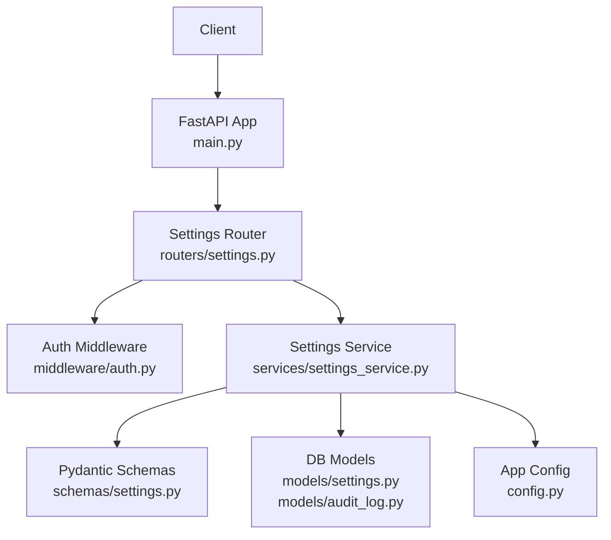
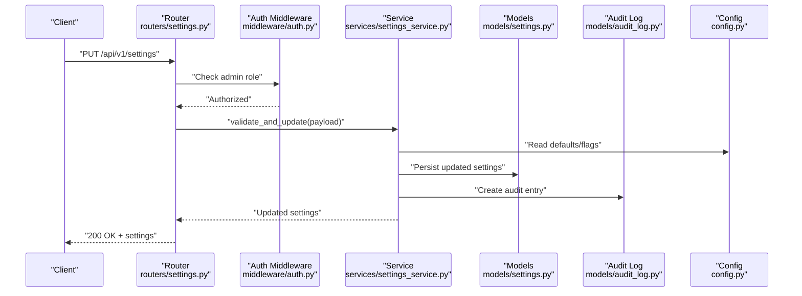
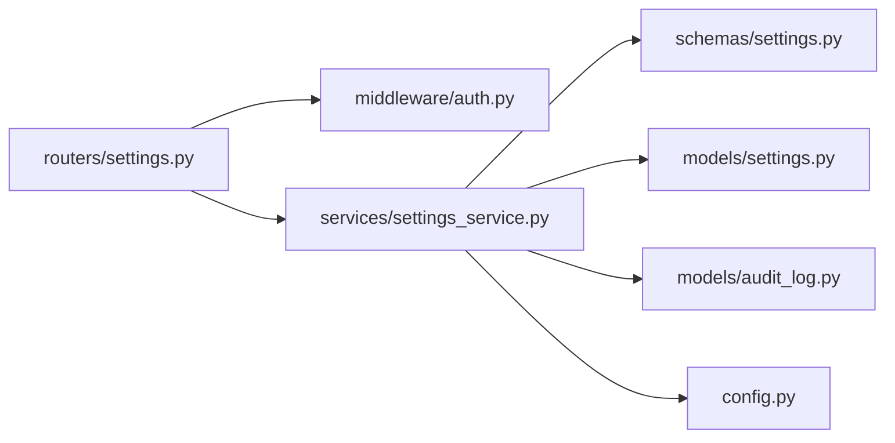

# System Settings API

<cite>
**Referenced Files in This Document**
- [settings.py](file://backend/app/routers/settings.py)
- [settings_service.py](file://backend/app/services/settings_service.py)
- [settings.py](file://backend/app/schemas/settings.py)
- [settings.py](file://backend/app/models/settings.py)
- [audit_log.py](file://backend/app/models/audit_log.py)
- [auth.py](file://backend/app/middleware/auth.py)
- [config.py](file://backend/app/config.py)
- [main.py](file://backend/app/main.py)
</cite>

## Table of Contents
1. [Introduction](#introduction)
2. [Project Structure](#project-structure)
3. [Core Components](#core-components)
4. [Architecture Overview](#architecture-overview)
5. [Detailed Component Analysis](#detailed-component-analysis)
6. [Dependency Analysis](#dependency-analysis)
7. [Performance Considerations](#performance-considerations)
8. [Troubleshooting Guide](#troubleshooting-guide)
9. [Conclusion](#conclusion)

## Introduction
This document provides detailed API documentation for system settings endpoints. It covers configuration management for application-wide settings, environment variables, and feature flags; settings validation; backup and restoration capabilities; cloud provider configuration and integration settings; authentication and authorization constraints; request/response schemas; categories; validation rules; rollback capabilities; and audit logging for configuration changes.

## Project Structure
The settings subsystem is implemented across routers, services, schemas, models, middleware, and configuration modules:
- Router layer exposes REST endpoints under /api/v1/settings.
- Service layer encapsulates business logic for reading, writing, validating, backing up, restoring, and auditing settings.
- Schemas define Pydantic models for request and response payloads.
- Models persist settings and audit logs to the database.
- Middleware enforces administrator-only access for write operations.
- Configuration module centralizes environment-based defaults and feature flags.

**Diagram sources**
- [main.py](file://backend/app/main.py)
- [settings.py](file://backend/app/routers/settings.py)
- [auth.py](file://backend/app/middleware/auth.py)
- [settings_service.py](file://backend/app/services/settings_service.py)
- [settings.py](file://backend/app/schemas/settings.py)
- [settings.py](file://backend/app/models/settings.py)
- [audit_log.py](file://backend/app/models/audit_log.py)
- [config.py](file://backend/app/config.py)

**Section sources**
- [main.py](file://backend/app/main.py)
- [settings.py](file://backend/app/routers/settings.py)
- [settings_service.py](file://backend/app/services/settings_service.py)
- [settings.py](file://backend/app/schemas/settings.py)
- [settings.py](file://backend/app/models/settings.py)
- [audit_log.py](file://backend/app/models/audit_log.py)
- [auth.py](file://backend/app/middleware/auth.py)
- [config.py](file://backend/app/config.py)

## Core Components
- Settings Router: Defines endpoints for retrieving, updating, categorizing, backing up, restoring, and rolling back settings.
- Settings Service: Implements validation, persistence, backup/restore, rollback, and audit logging.
- Schemas: Define typed request/response structures for settings keys, values, categories, and metadata.
- Models: Persist settings and audit events.
- Auth Middleware: Enforces admin-only access for mutating endpoints.
- Config: Provides environment-driven defaults and feature flags.

Key responsibilities:
- GET /api/v1/settings: Retrieve current configuration (read-only).
- PUT /api/v1/settings: Update application-wide settings with validation and audit.
- GET /api/v1/settings/categories: List available setting categories and their descriptions.
- Backup/Restore/Rollback: Manage snapshots of settings and revert to previous states.
- Cloud Provider Integration: Configure credentials and connection parameters for supported providers.

**Section sources**
- [settings.py](file://backend/app/routers/settings.py)
- [settings_service.py](file://backend/app/services/settings_service.py)
- [settings.py](file://backend/app/schemas/settings.py)
- [settings.py](file://backend/app/models/settings.py)
- [audit_log.py](file://backend/app/models/audit_log.py)
- [auth.py](file://backend/app/middleware/auth.py)
- [config.py](file://backend/app/config.py)

## Architecture Overview
The settings API follows a layered architecture:
- HTTP layer (router) validates requests using Pydantic schemas and applies auth checks.
- Service layer orchestrates validation, persistence, backup/restore, and audit logging.
- Data layer persists settings and audit records via ORM models.
- Configuration layer supplies environment-based defaults and feature flags.

**Diagram sources**
- [settings.py](file://backend/app/routers/settings.py)
- [auth.py](file://backend/app/middleware/auth.py)
- [settings_service.py](file://backend/app/services/settings_service.py)
- [settings.py](file://backend/app/models/settings.py)
- [audit_log.py](file://backend/app/models/audit_log.py)
- [config.py](file://backend/app/config.py)

## Detailed Component Analysis

### Endpoints

#### Get Current Settings
- Method: GET
- Path: /api/v1/settings
- Description: Retrieves the current system configuration including environment variables, feature flags, and cloud provider settings.
- Authentication: Read access allowed for authenticated users; write requires admin.
- Response schema:
  - settings: object mapping setting keys to values
  - categories: list of category names present in the response
  - metadata: includes version, last_updated timestamp, and source (e.g., database or env)
- Example usage:
  - Retrieve all settings: GET /api/v1/settings
  - Filter by category: GET /api/v1/settings?category=cloud
- Notes:
  - Values are resolved from database first, then environment defaults if not set.
  - Feature flags are included when enabled by configuration.

**Section sources**
- [settings.py](file://backend/app/routers/settings.py)
- [settings_service.py](file://backend/app/services/settings_service.py)
- [settings.py](file://backend/app/schemas/settings.py)
- [config.py](file://backend/app/config.py)

#### Update Application Settings
- Method: PUT
- Path: /api/v1/settings
- Description: Updates application-wide settings with validation and audit logging. Admin-only access required.
- Request schema:
  - settings: object mapping setting keys to new values
  - category: optional string to scope updates to a specific category
  - reason: optional string describing the change rationale
- Validation rules:
  - Keys must belong to known categories.
  - Values must satisfy type and constraint rules defined in schemas.
  - Some keys require additional context (e.g., cloud provider credentials need region and endpoint).
- Response schema:
  - success: boolean
  - message: string describing outcome
  - updated_keys: list of keys that were changed
  - warnings: list of non-fatal issues (e.g., deprecated keys)
- Example usage:
  - Update general app settings: PUT /api/v1/settings with { "settings": { "app_name": "New Name", "maintenance_mode": false } }
  - Update cloud provider credentials: PUT /api/v1/settings with { "settings": { "aliyun.access_key_id": "...", "aliyun.access_key_secret": "..." }, "category": "cloud" }
- Security:
  - Requires administrator role; otherwise returns 403 Forbidden.
- Audit:
  - Each successful update creates an audit log entry with user, timestamp, and diff summary.

**Section sources**
- [settings.py](file://backend/app/routers/settings.py)
- [auth.py](file://backend/app/middleware/auth.py)
- [settings_service.py](file://backend/app/services/settings_service.py)
- [settings.py](file://backend/app/schemas/settings.py)
- [audit_log.py](file://backend/app/models/audit_log.py)

#### List Setting Categories
- Method: GET
- Path: /api/v1/settings/categories
- Description: Returns available setting categories and their descriptions.
- Response schema:
  - categories: array of objects with fields:
    - name: string
    - description: string
    - keys: array of key names within the category
- Example usage:
  - GET /api/v1/settings/categories

**Section sources**
- [settings.py](file://backend/app/routers/settings.py)
- [settings_service.py](file://backend/app/services/settings_service.py)
- [settings.py](file://backend/app/schemas/settings.py)

#### Backup Settings
- Method: POST
- Path: /api/v1/settings/backup
- Description: Creates a snapshot of current settings for backup purposes.
- Request schema:
  - label: optional string to annotate the backup
- Response schema:
  - id: string identifier for the backup
  - created_at: timestamp
  - label: string
  - keys_count: integer number of backed-up keys
- Example usage:
  - POST /api/v1/settings/backup with { "label": "pre-deploy-v1.2" }

**Section sources**
- [settings.py](file://backend/app/routers/settings.py)
- [settings_service.py](file://backend/app/services/settings_service.py)
- [settings.py](file://backend/app/schemas/settings.py)

#### Restore Settings
- Method: POST
- Path: /api/v1/settings/restore
- Description: Restores settings from a previously created backup.
- Request schema:
  - backup_id: string identifier of the backup to restore
- Response schema:
  - success: boolean
  - message: string describing outcome
  - restored_keys: list of keys restored
- Example usage:
  - POST /api/v1/settings/restore with { "backup_id": "abc123" }

**Section sources**
- [settings.py](file://backend/app/routers/settings.py)
- [settings_service.py](file://backend/app/services/settings_service.py)
- [settings.py](file://backend/app/schemas/settings.py)

#### Rollback Settings
- Method: POST
- Path: /api/v1/settings/rollback
- Description: Rolls back to the most recent backup prior to a specified timestamp.
- Request schema:
  - before: ISO 8601 timestamp indicating the cutoff point
- Response schema:
  - success: boolean
  - message: string describing outcome
  - rolled_back_to: backup id used for rollback
- Example usage:
  - POST /api/v1/settings/rollback with { "before": "2024-01-01T00:00:00Z" }

**Section sources**
- [settings.py](file://backend/app/routers/settings.py)
- [settings_service.py](file://backend/app/services/settings_service.py)
- [settings.py](file://backend/app/schemas/settings.py)

#### Validate Settings
- Method: POST
- Path: /api/v1/settings/validate
- Description: Validates a proposed settings payload without persisting changes.
- Request schema:
  - settings: object mapping setting keys to values
  - category: optional string to scope validation
- Response schema:
  - valid: boolean
  - errors: array of error objects with field, message, and rule
  - warnings: array of warning messages
- Example usage:
  - POST /api/v1/settings/validate with { "settings": { "aliyun.region": "cn-hangzhou" } }

**Section sources**
- [settings.py](file://backend/app/routers/settings.py)
- [settings_service.py](file://backend/app/services/settings_service.py)
- [settings.py](file://backend/app/schemas/settings.py)

### Settings Validation Rules
- Type enforcement: Each key has an expected type (string, integer, boolean, URL, etc.).
- Constraints:
  - Required keys per category.
  - Value ranges and formats (e.g., email format, numeric bounds).
  - Conditional dependencies (e.g., enabling a feature flag may require additional keys).
- Error reporting:
  - Errors include field path, human-readable message, and violated rule.
  - Warnings indicate deprecated keys or suboptimal configurations.

**Section sources**
- [settings.py](file://backend/app/schemas/settings.py)
- [settings_service.py](file://backend/app/services/settings_service.py)

### Cloud Provider Configuration
- Supported providers: Aliyun ECS/VPC integration settings.
- Key patterns:
  - Provider-scoped keys use dot notation (e.g., aliyun.access_key_id, aliyun.access_key_secret, aliyun.region, aliyun.endpoint).
- Validation:
  - Credentials must be non-empty when provider is enabled.
  - Region and endpoint must match supported values.
- Security:
  - Secrets are stored securely and never returned in full in read responses.
- Example usage:
  - Update Aliyun credentials: PUT /api/v1/settings with { "settings": { "aliyun.access_key_id": "...", "aliyun.access_key_secret": "..." }, "category": "cloud" }

**Section sources**
- [settings.py](file://backend/app/routers/settings.py)
- [settings_service.py](file://backend/app/services/settings_service.py)
- [settings.py](file://backend/app/schemas/settings.py)

### Authentication and Authorization
- Read endpoints: Accessible to authenticated users.
- Write endpoints: Require administrator role; otherwise return 403 Forbidden.
- Enforcement:
  - Admin check performed in middleware before invoking service methods.

**Section sources**
- [auth.py](file://backend/app/middleware/auth.py)
- [settings.py](file://backend/app/routers/settings.py)

### Audit Logging
- Events captured:
  - Settings updates, backups, restores, rollbacks, and validations.
- Fields:
  - actor (user), action, target (setting keys), timestamp, diff_summary, result.
- Usage:
  - Every mutation triggers creation of an audit record.
  - Audits can be queried via separate audit endpoints (not covered here).

**Section sources**
- [audit_log.py](file://backend/app/models/audit_log.py)
- [settings_service.py](file://backend/app/services/settings_service.py)

### Environment Variables and Feature Flags
- Defaults:
  - Environment variables provide fallback defaults for settings not persisted in the database.
- Feature flags:
  - Boolean flags control availability of features and settings categories.
- Resolution order:
  - Database overrides environment defaults.
- Example:
  - If maintenance_mode is unset in DB, it falls back to the environment variable default.

**Section sources**
- [config.py](file://backend/app/config.py)
- [settings_service.py](file://backend/app/services/settings_service.py)

## Dependency Analysis
The following diagram shows how components depend on each other for settings operations:

**Diagram sources**
- [settings.py](file://backend/app/routers/settings.py)
- [auth.py](file://backend/app/middleware/auth.py)
- [settings_service.py](file://backend/app/services/settings_service.py)
- [settings.py](file://backend/app/schemas/settings.py)
- [settings.py](file://backend/app/models/settings.py)
- [audit_log.py](file://backend/app/models/audit_log.py)
- [config.py](file://backend/app/config.py)

**Section sources**
- [settings.py](file://backend/app/routers/settings.py)
- [settings_service.py](file://backend/app/services/settings_service.py)
- [settings.py](file://backend/app/schemas/settings.py)
- [settings.py](file://backend/app/models/settings.py)
- [audit_log.py](file://backend/app/models/audit_log.py)
- [auth.py](file://backend/app/middleware/auth.py)
- [config.py](file://backend/app/config.py)

## Performance Considerations
- Batch updates: Prefer grouping multiple key updates into a single PUT request to reduce round trips.
- Validation caching: Reuse validation results for repeated checks within a transaction.
- Secret handling: Avoid returning full secrets in responses; mask or omit sensitive fields.
- Indexing: Ensure audit logs and settings tables are indexed by timestamps and actors for efficient queries.

[No sources needed since this section provides general guidance]

## Troubleshooting Guide
Common issues and resolutions:
- 403 Forbidden on write endpoints:
  - Cause: User lacks administrator role.
  - Resolution: Authenticate as an administrator.
- Validation errors:
  - Cause: Invalid types, missing required keys, or constraint violations.
  - Resolution: Review errors array and adjust payload accordingly.
- Restore failures:
  - Cause: Missing or invalid backup_id.
  - Resolution: Verify backup exists and is accessible.
- Rollback ambiguity:
  - Cause: No backups before the specified timestamp.
  - Resolution: Choose a different cutoff time or create a backup first.
- Cloud provider misconfiguration:
  - Cause: Missing credentials or unsupported region/endpoint.
  - Resolution: Provide valid credentials and supported region/endpoint values.

**Section sources**
- [settings.py](file://backend/app/routers/settings.py)
- [settings_service.py](file://backend/app/services/settings_service.py)
- [settings.py](file://backend/app/schemas/settings.py)

## Conclusion
The System Settings API provides a secure, validated, and auditable interface for managing application-wide configuration, environment variables, feature flags, and cloud provider integrations. Administrators can update settings, validate proposals, and manage backups and rollbacks, while all mutations are logged for compliance and troubleshooting.