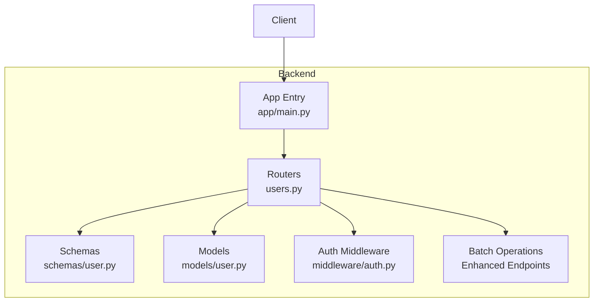
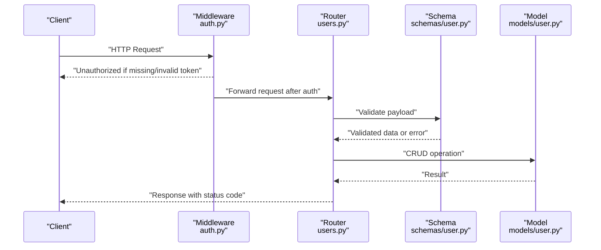
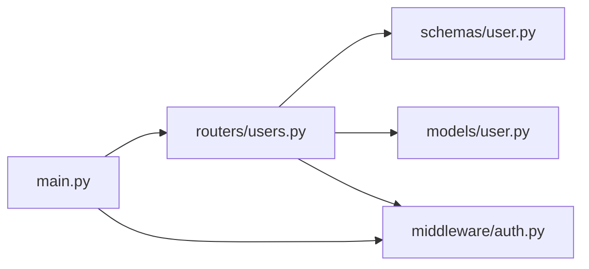

# User Management API

<cite>
**Referenced Files in This Document**
- [users.py](file://backend/app/routers/users.py)
- [user.py](file://backend/app/models/user.py)
- [user.py](file://backend/app/schemas/user.py)
- [auth.py](file://backend/app/middleware/auth.py)
- [main.py](file://backend/app/main.py)
</cite>

## Update Summary
**Changes Made**
- Added comprehensive batch operation endpoints for user management
- Implemented bulk enable/disable functionality for user accounts
- Added bulk role assignment and modification endpoints
- Introduced bulk deletion operations with partial failure handling
- Enhanced schema definitions to support batch payloads with validation rules
- Updated error handling to accommodate partial failures in batch operations

## Table of Contents
1. [Introduction](#introduction)
2. [Project Structure](#project-structure)
3. [Core Components](#core-components)
4. [Architecture Overview](#architecture-overview)
5. [Detailed Component Analysis](#detailed-component-analysis)
6. [Batch Operations](#batch-operations)
7. [Dependency Analysis](#dependency-analysis)
8. [Performance Considerations](#performance-considerations)
9. [Troubleshooting Guide](#troubleshooting-guide)
10. [Conclusion](#conclusion)

## Introduction
This document provides detailed API documentation for user management endpoints, including CRUD operations, role-based access control (RBAC), search and filtering, authentication requirements, request/response schemas, validation rules, error handling, and examples. The implementation is based on the backend modules responsible for users, schemas, models, and authentication middleware. **Updated** to include comprehensive batch operation capabilities for efficient user management at scale.

## Project Structure
The user management functionality is implemented in the backend application with clear separation between routes, schemas, models, and middleware:
- Routes define HTTP endpoints and orchestrate requests/responses.
- Schemas define request and response data structures.
- Models represent database entities and constraints.
- Middleware enforces authentication and authorization.

**Diagram sources**
- [users.py](file://backend/app/routers/users.py)
- [user.py](file://backend/app/schemas/user.py)
- [user.py](file://backend/app/models/user.py)
- [auth.py](file://backend/app/middleware/auth.py)
- [main.py](file://backend/app/main.py)

**Section sources**
- [users.py](file://backend/app/routers/users.py)
- [user.py](file://backend/app/schemas/user.py)
- [user.py](file://backend/app/models/user.py)
- [auth.py](file://backend/app/middleware/auth.py)
- [main.py](file://backend/app/main.py)

## Core Components
- Router module implements user management endpoints and integrates with schemas and models.
- Schema module defines Pydantic models for request and response payloads.
- Model module defines the database entity and constraints.
- Auth middleware validates tokens and enforces admin privileges where required.

Key responsibilities:
- Endpoints: Create, Read, Update, Delete users; list/search/filter; role assignment.
- **Enhanced**: Batch operations for bulk user management tasks.
- Validation: Input validation via schemas; sanitization at model layer.
- Security: Admin-only protection via middleware.
- Responses: Standardized success/error responses with appropriate status codes.

**Section sources**
- [users.py](file://backend/app/routers/users.py)
- [user.py](file://backend/app/schemas/user.py)
- [user.py](file://backend/app/models/user.py)
- [auth.py](file://backend/app/middleware/auth.py)

## Architecture Overview
The user management API follows a layered architecture:
- Clients send HTTP requests to router endpoints.
- Routers validate inputs using schemas, enforce auth via middleware, and interact with models.
- Models persist or retrieve data from the database.
- Responses are serialized using schemas and returned to clients.

**Diagram sources**
- [auth.py](file://backend/app/middleware/auth.py)
- [users.py](file://backend/app/routers/users.py)
- [user.py](file://backend/app/schemas/user.py)
- [user.py](file://backend/app/models/user.py)

## Detailed Component Analysis

### Authentication and Authorization
- All user management endpoints require a valid authentication token.
- Admin privileges are enforced by middleware for sensitive operations such as creating, updating, deleting users, and assigning roles.
- Unauthorized or insufficient permissions result in standard error responses.

Security notes:
- Tokens must be present in the request header as specified by the middleware contract.
- Role checks ensure only admins can perform administrative actions.

**Section sources**
- [auth.py](file://backend/app/middleware/auth.py)

### Data Models and Schemas
User model fields include:
- username: string, unique identifier for the user.
- email: string, unique contact address.
- role: enum or string indicating user role (e.g., admin, user).
- status: enum or string indicating account status (e.g., active, inactive).

Request and response schemas define:
- Creation payload: username, email, role, optional initial status.
- Update payload: partial fields allowed depending on endpoint design.
- Response payload: full user object with id and timestamps if applicable.

Validation rules:
- Required fields: username, email, role.
- Uniqueness: username and email must be unique across users.
- Format: email must conform to standard email format.
- Enumerations: role and status must match allowed values.

Sanitization:
- Trim whitespace from strings.
- Normalize email case if configured.
- Escape or sanitize special characters in usernames.

**Section sources**
- [user.py](file://backend/app/schemas/user.py)
- [user.py](file://backend/app/models/user.py)

### Endpoints

#### List Users (Search and Filtering)
- Method: GET
- URL: /api/v1/users
- Query parameters:
  - page: integer, default 1
  - page_size: integer, default 20
  - q: string, search term for username or email
  - role: string, filter by role
  - status: string, filter by status
- Authentication: Required (admin privilege recommended for full visibility)
- Success response: Paginated list of users with metadata (total, page, page_size)
- Error responses:
  - 401 Unauthorized: Missing or invalid token
  - 403 Forbidden: Insufficient permissions
  - 422 Unprocessable Entity: Invalid query parameters

Example request:
- GET /api/v1/users?page=1&page_size=20&q=john&role=admin&status=active

Example response:
- {
  "items": [...],
  "total": 120,
  "page": 1,
  "page_size": 20
}

**Section sources**
- [users.py](file://backend/app/routers/users.py)
- [user.py](file://backend/app/schemas/user.py)

#### Create User
- Method: POST
- URL: /api/v1/users
- Authentication: Required (admin privilege)
- Request body schema:
  - username: string, required, unique
  - email: string, required, unique, valid email format
  - role: string, required, allowed values (e.g., admin, user)
  - status: string, optional, default active
- Success response: Created user object
- Error responses:
  - 400 Bad Request: Validation errors
  - 409 Conflict: Duplicate username or email
  - 401 Unauthorized: Missing or invalid token
  - 403 Forbidden: Insufficient permissions

Example request:
- POST /api/v1/users
- Body: { "username": "jdoe", "email": "jdoe@example.com", "role": "user", "status": "active" }

Example response:
- { "id": "...", "username": "jdoe", "email": "jdoe@example.com", "role": "user", "status": "active" }

**Section sources**
- [users.py](file://backend/app/routers/users.py)
- [user.py](file://backend/app/schemas/user.py)

#### Get User
- Method: GET
- URL: /api/v1/users/{id}
- Path parameters:
  - id: string or integer, required
- Authentication: Required (admin privilege recommended)
- Success response: User object
- Error responses:
  - 401 Unauthorized: Missing or invalid token
  - 403 Forbidden: Insufficient permissions
  - 404 Not Found: User not found

Example request:
- GET /api/v1/users/123

Example response:
- { "id": "123", "username": "jdoe", "email": "jdoe@example.com", "role": "user", "status": "active" }

**Section sources**
- [users.py](file://backend/app/routers/users.py)
- [user.py](file://backend/app/schemas/user.py)

#### Update User
- Method: PUT
- URL: /api/v1/users/{id}
- Path parameters:
  - id: string or integer, required
- Authentication: Required (admin privilege)
- Request body schema:
  - Fields allowed: username, email, role, status (partial update supported)
  - Validation rules apply to provided fields
- Success response: Updated user object
- Error responses:
  - 400 Bad Request: Validation errors
  - 409 Conflict: Duplicate username or email
  - 401 Unauthorized: Missing or invalid token
  - 403 Forbidden: Insufficient permissions
  - 404 Not Found: User not found

Example request:
- PUT /api/v1/users/123
- Body: { "role": "admin", "status": "active" }

Example response:
- { "id": "123", "username": "jdoe", "email": "jdoe@example.com", "role": "admin", "status": "active" }

**Section sources**
- [users.py](file://backend/app/routers/users.py)
- [user.py](file://backend/app/schemas/user.py)

#### Delete User
- Method: DELETE
- URL: /api/v1/users/{id}
- Path parameters:
  - id: string or integer, required
- Authentication: Required (admin privilege)
- Success response: Confirmation message or empty body with 204 No Content
- Error responses:
  - 401 Unauthorized: Missing or invalid token
  - 403 Forbidden: Insufficient permissions
  - 404 Not Found: User not found

Example request:
- DELETE /api/v1/users/123

Example response:
- 204 No Content

**Section sources**
- [users.py](file://backend/app/routers/users.py)

#### Assign Role
- Method: PUT
- URL: /api/v1/users/{id}/role
- Path parameters:
  - id: string or integer, required
- Authentication: Required (admin privilege)
- Request body schema:
  - role: string, required, allowed values (e.g., admin, user)
- Success response: Updated user object reflecting new role
- Error responses:
  - 400 Bad Request: Validation errors
  - 401 Unauthorized: Missing or invalid token
  - 403 Forbidden: Insufficient permissions
  - 404 Not Found: User not found

Example request:
- PUT /api/v1/users/123/role
- Body: { "role": "admin" }

Example response:
- { "id": "123", "username": "jdoe", "email": "jdoe@example.com", "role": "admin", "status": "active" }

**Section sources**
- [users.py](file://backend/app/routers/users.py)
- [user.py](file://backend/app/schemas/user.py)

## Batch Operations

### Bulk Create Users
- Method: POST
- URL: /api/v1/users/bulk
- Authentication: Required (admin privilege)
- Request body schema:
  - users: array of user creation objects
  - Each object contains: username, email, role, optional status
- Success response: Summary of created users and any failures
- Error responses:
  - 400 Bad Request: Validation errors in one or more items
  - 409 Conflict: Duplicate entries
  - 401 Unauthorized: Missing or invalid token
  - 403 Forbidden: Insufficient permissions

Example request:
- POST /api/v1/users/bulk
- Body: {
  "users": [
    { "username": "user1", "email": "user1@example.com", "role": "user", "status": "active" },
    { "username": "user2", "email": "user2@example.com", "role": "admin", "status": "active" }
  ]
}

Example response:
- {
  "created": 2,
  "failed": 0,
  "results": [
    { "status": "success", "user_id": "123", "message": "User created successfully" },
    { "status": "success", "user_id": "124", "message": "User created successfully" }
  ]
}

**Section sources**
- [users.py](file://backend/app/routers/users.py)
- [user.py](file://backend/app/schemas/user.py)

### Bulk Enable/Disable Users
- Method: PUT
- URL: /api/v1/users/bulk/status
- Authentication: Required (admin privilege)
- Request body schema:
  - user_ids: array of user IDs to update
  - status: string, target status ("active" or "inactive")
- Success response: Summary of enabled/disabled users and any failures
- Error responses:
  - 400 Bad Request: Invalid status value or empty user_ids array
  - 401 Unauthorized: Missing or invalid token
  - 403 Forbidden: Insufficient permissions
  - 404 Not Found: One or more users not found

Example request:
- PUT /api/v1/users/bulk/status
- Body: {
  "user_ids": ["123", "124", "125"],
  "status": "inactive"
}

Example response:
- {
  "updated": 3,
  "failed": 0,
  "results": [
    { "user_id": "123", "status": "success", "message": "User disabled successfully" },
    { "user_id": "124", "status": "success", "message": "User disabled successfully" },
    { "user_id": "125", "status": "success", "message": "User disabled successfully" }
  ]
}

**Section sources**
- [users.py](file://backend/app/routers/users.py)
- [user.py](file://backend/app/schemas/user.py)

### Bulk Role Assignment
- Method: PUT
- URL: /api/v1/users/bulk/role
- Authentication: Required (admin privilege)
- Request body schema:
  - assignments: array of { user_id, role } pairs
- Success response: Summary of role updates and any failures
- Error responses:
  - 400 Bad Request: Invalid role value or malformed assignments
  - 401 Unauthorized: Missing or invalid token
  - 403 Forbidden: Insufficient permissions
  - 404 Not Found: One or more users not found

Example request:
- PUT /api/v1/users/bulk/role
- Body: {
  "assignments": [
    { "user_id": "123", "role": "admin" },
    { "user_id": "124", "role": "user" }
  ]
}

Example response:
- {
  "updated": 2,
  "failed": 0,
  "results": [
    { "user_id": "123", "status": "success", "message": "Role updated to admin" },
    { "user_id": "124", "status": "success", "message": "Role updated to user" }
  ]
}

**Section sources**
- [users.py](file://backend/app/routers/users.py)
- [user.py](file://backend/app/schemas/user.py)

### Bulk Delete Users
- Method: DELETE
- URL: /api/v1/users/bulk
- Authentication: Required (admin privilege)
- Request body schema:
  - user_ids: array of user IDs to delete
- Success response: Summary of deleted users and any failures
- Error responses:
  - 400 Bad Request: Empty user_ids array
  - 401 Unauthorized: Missing or invalid token
  - 403 Forbidden: Insufficient permissions
  - 404 Not Found: One or more users not found

Example request:
- DELETE /api/v1/users/bulk
- Body: {
  "user_ids": ["123", "124", "125"]
}

Example response:
- {
  "deleted": 3,
  "failed": 0,
  "results": [
    { "user_id": "123", "status": "success", "message": "User deleted successfully" },
    { "user_id": "124", "status": "success", "message": "User deleted successfully" },
    { "user_id": "125", "status": "success", "message": "User deleted successfully" }
  ]
}

**Section sources**
- [users.py](file://backend/app/routers/users.py)
- [user.py](file://backend/app/schemas/user.py)

### Batch Operation Error Handling
All batch operations support partial failure handling:
- Individual item failures do not prevent successful items from being processed
- Response includes detailed results for each operation
- Failed operations include specific error messages
- Transaction boundaries ensure data consistency within each batch

Error response structure for batch operations:
- created/updated/deleted: count of successful operations
- failed: count of failed operations  
- results: array of individual operation results with status and messages

**Section sources**
- [users.py](file://backend/app/routers/users.py)
- [user.py](file://backend/app/schemas/user.py)

### Pagination Responses
- List endpoint returns paginated results:
  - items: array of user objects
  - total: total number of matching users
  - page: current page number
  - page_size: number of items per page

Example response:
- {
  "items": [...],
  "total": 120,
  "page": 1,
  "page_size": 20
}

**Section sources**
- [users.py](file://backend/app/routers/users.py)
- [user.py](file://backend/app/schemas/user.py)

### Validation Rules and Input Sanitization
- Required fields: username, email, role
- Unique constraints: username and email
- Email format: standard email regex
- Enumerations: role and status must match allowed values
- Sanitization: trim whitespace, normalize email case if configured
- Error responses for validation failures: 400 Bad Request with details

**Section sources**
- [user.py](file://backend/app/schemas/user.py)
- [user.py](file://backend/app/models/user.py)

### Error Handling
Common error responses:
- 400 Bad Request: Validation errors
- 401 Unauthorized: Missing or invalid token
- 403 Forbidden: Insufficient permissions
- 404 Not Found: Resource not found
- 409 Conflict: Duplicate username or email
- 422 Unprocessable Entity: Invalid query parameters or malformed request

Error response structure:
- code: string error code
- message: human-readable description
- details: additional context (e.g., field-level errors)

**Section sources**
- [users.py](file://backend/app/routers/users.py)
- [auth.py](file://backend/app/middleware/auth.py)

## Dependency Analysis
The user management components have the following dependencies:
- Router depends on schemas for validation and models for persistence.
- Middleware enforces authentication and authorization before routing logic executes.
- Main app registers routers and middleware.

**Diagram sources**
- [main.py](file://backend/app/main.py)
- [users.py](file://backend/app/routers/users.py)
- [user.py](file://backend/app/schemas/user.py)
- [user.py](file://backend/app/models/user.py)
- [auth.py](file://backend/app/middleware/auth.py)

**Section sources**
- [main.py](file://backend/app/main.py)
- [users.py](file://backend/app/routers/users.py)
- [user.py](file://backend/app/schemas/user.py)
- [user.py](file://backend/app/models/user.py)
- [auth.py](file://backend/app/middleware/auth.py)

## Performance Considerations
- Use pagination for list endpoints to limit payload size.
- Index database columns used in filters (username, email, role, status) to improve query performance.
- Cache frequently accessed user profiles when appropriate.
- Validate inputs early to avoid unnecessary database calls.
- **Enhanced**: Implement rate limiting for batch operations to prevent abuse.
- **Enhanced**: Use database transactions for batch operations to ensure consistency.
- **Enhanced**: Consider async processing for large batch operations.

[No sources needed since this section provides general guidance]

## Troubleshooting Guide
Common issues and resolutions:
- 401 Unauthorized: Ensure the client includes a valid token in the request header.
- 403 Forbidden: Verify that the authenticated user has admin privileges.
- 409 Conflict: Check for duplicate username or email; update existing records instead.
- 422 Unprocessable Entity: Correct malformed query parameters or request bodies.
- 404 Not Found: Confirm the user ID exists before performing read/update/delete operations.

**Updated** Batch operation troubleshooting:
- Partial failures: Review individual operation results in batch responses
- Validation errors: Check each item in batch payloads for required fields and formats
- Rate limiting: Monitor API usage and implement proper throttling
- Transaction failures: Ensure database connectivity and rollback mechanisms

Debugging tips:
- Log request payloads and responses during development.
- Validate schema definitions against actual database constraints.
- Review middleware logs for token parsing and role checks.
- **Enhanced**: Monitor batch operation performance and resource usage.

**Section sources**
- [auth.py](file://backend/app/middleware/auth.py)
- [users.py](file://backend/app/routers/users.py)

## Conclusion
The user management API provides comprehensive CRUD operations, RBAC enforcement, search and filtering, and robust validation and error handling. **Updated** with powerful batch operation capabilities for efficient large-scale user management. By adhering to the documented schemas, authentication requirements, and status codes, clients can reliably integrate with the system for both individual and bulk user administration tasks.

[No sources needed since this section summarizes without analyzing specific files]