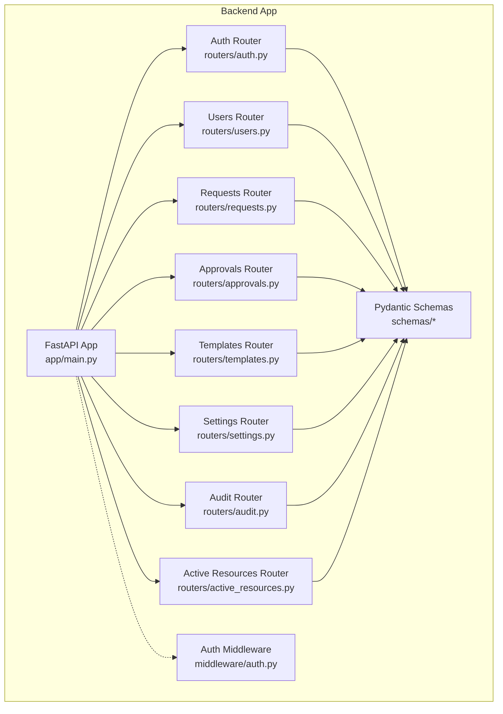
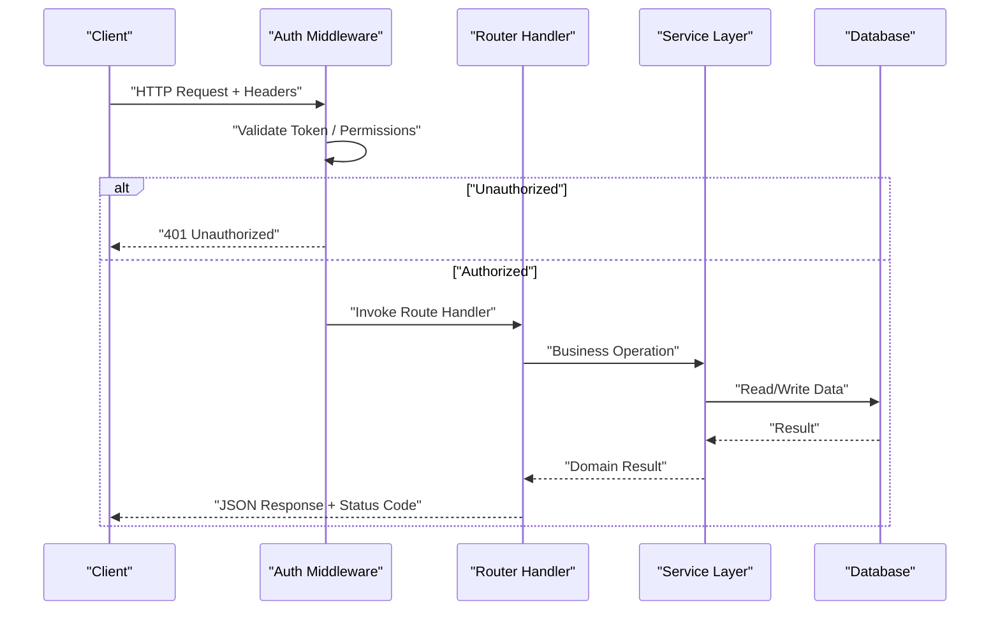
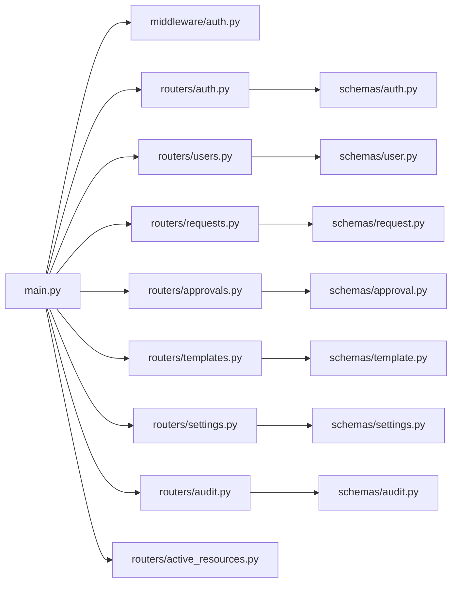

# API Routers & Endpoints

<cite>
**Referenced Files in This Document**
- [main.py](file://backend/app/main.py)
- [auth.py](file://backend/app/routers/auth.py)
- [users.py](file://backend/app/routers/users.py)
- [requests.py](file://backend/app/routers/requests.py)
- [approvals.py](file://backend/app/routers/approvals.py)
- [templates.py](file://backend/app/routers/templates.py)
- [settings.py](file://backend/app/routers/settings.py)
- [audit.py](file://backend/app/routers/audit.py)
- [active_resources.py](file://backend/app/routers/active_resources.py)
- [auth_middleware.py](file://backend/app/middleware/auth.py)
- [schemas/__init__.py](file://backend/app/schemas/__init__.py)
- [schemas/auth.py](file://backend/app/schemas/auth.py)
- [schemas/user.py](file://backend/app/schemas/user.py)
- [schemas/request.py](file://backend/app/schemas/request.py)
- [schemas/approval.py](file://backend/app/schemas/approval.py)
- [schemas/template.py](file://backend/app/schemas/template.py)
- [schemas/settings.py](file://backend/app/schemas/settings.py)
- [schemas/audit.py](file://backend/app/schemas/audit.py)
</cite>

## Table of Contents
1. [Introduction](#introduction)
2. [Project Structure](#project-structure)
3. [Core Components](#core-components)
4. [Architecture Overview](#architecture-overview)
5. [Detailed Component Analysis](#detailed-component-analysis)
6. [Dependency Analysis](#dependency-analysis)
7. [Performance Considerations](#performance-considerations)
8. [Troubleshooting Guide](#troubleshooting-guide)
9. [Conclusion](#conclusion)
10. [Appendices](#appendices)

## Introduction
This document provides comprehensive documentation for the RESTful API routers implemented in the backend application. It covers HTTP methods, URL patterns, request and response schemas, authentication requirements, parameter validation, error handling strategies, and response formatting patterns. It also includes practical examples for calling endpoints, guidance on rate limiting, pagination, filtering, common integration patterns, client-side usage tips, troubleshooting, and instructions for extending existing routers or creating new endpoint groups following established conventions.

## Project Structure
The API is organized by feature into router modules under the app/routers directory. Each router defines a FastAPI APIRouter instance with route handlers that use Pydantic schemas from app/schemas for request/response validation and serialization. Authentication and authorization are enforced via middleware and dependency injection.

**Diagram sources**
- [main.py](file://backend/app/main.py)
- [auth.py](file://backend/app/routers/auth.py)
- [users.py](file://backend/app/routers/users.py)
- [requests.py](file://backend/app/routers/requests.py)
- [approvals.py](file://backend/app/routers/approvals.py)
- [templates.py](file://backend/app/routers/templates.py)
- [settings.py](file://backend/app/routers/settings.py)
- [audit.py](file://backend/app/routers/audit.py)
- [active_resources.py](file://backend/app/routers/active_resources.py)
- [auth_middleware.py](file://backend/app/middleware/auth.py)
- [schemas/__init__.py](file://backend/app/schemas/__init__.py)

**Section sources**
- [main.py](file://backend/app/main.py)
- [auth.py](file://backend/app/routers/auth.py)
- [users.py](file://backend/app/routers/users.py)
- [requests.py](file://backend/app/routers/requests.py)
- [approvals.py](file://backend/app/routers/approvals.py)
- [templates.py](file://backend/app/routers/templates.py)
- [settings.py](file://backend/app/routers/settings.py)
- [audit.py](file://backend/app/routers/audit.py)
- [active_resources.py](file://backend/app/routers/active_resources.py)
- [auth_middleware.py](file://backend/app/middleware/auth.py)
- [schemas/__init__.py](file://backend/app/schemas/__init__.py)

## Core Components
- Router Modules: Feature-scoped routers encapsulate related endpoints (authentication, users, requests, approvals, templates, settings, audit, active resources).
- Schemas: Pydantic models define request bodies, query parameters, and responses for consistent validation and OpenAPI generation.
- Middleware: Authentication middleware validates tokens and enforces access control before routes execute.
- Dependency Injection: Shared dependencies provide current user context and database sessions to route handlers.

Key responsibilities:
- Define URL patterns and HTTP methods per router.
- Validate inputs using Pydantic schemas.
- Enforce authentication and authorization.
- Return structured JSON responses with standardized status codes.
- Centralize error handling and logging where applicable.

**Section sources**
- [main.py](file://backend/app/main.py)
- [auth_middleware.py](file://backend/app/middleware/auth.py)
- [schemas/__init__.py](file://backend/app/schemas/__init__.py)

## Architecture Overview
The API follows a layered architecture:
- Presentation Layer: FastAPI routers handle HTTP requests and responses.
- Validation Layer: Pydantic schemas validate and serialize data.
- Business Logic Layer: Services implement domain operations (e.g., ECS/VPC services, approval workflows).
- Data Access Layer: Database interactions via ORM and migrations.

**Diagram sources**
- [auth_middleware.py](file://backend/app/middleware/auth.py)
- [main.py](file://backend/app/main.py)

## Detailed Component Analysis

### Authentication Router (/api/v1/auth)
Endpoints:
- POST /api/v1/auth/login
  - Purpose: Authenticate user and return session token.
  - Request Body: Credentials defined by login schema.
  - Response: Session token and user metadata.
  - Auth: None (public).
  - Validation: Email/password format checks via schema.
  - Errors: 400 for invalid input, 401 for invalid credentials.
- POST /api/v1/auth/logout
  - Purpose: Invalidate current session token.
  - Request: Requires valid token in headers.
  - Response: Success acknowledgment.
  - Auth: Required.
  - Errors: 401 if token missing/invalid, 400 for malformed requests.
- GET /api/v1/auth/me
  - Purpose: Retrieve current authenticated user profile.
  - Response: User details.
  - Auth: Required.
  - Errors: 401 if unauthorized.

Authentication Requirements:
- Bearer token in Authorization header for protected endpoints.
- Token validation performed by middleware.

Parameter Validation:
- Pydantic schemas enforce required fields, types, and constraints.

Error Handling:
- Standardized JSON error responses with message and code.

Response Formatting:
- Consistent envelope with data, message, and optional metadata.

Example Usage:
- Login:
  - Method: POST
  - Path: /api/v1/auth/login
  - Headers: Content-Type: application/json
  - Body: { "email": "...", "password": "..." }
  - Expected Response: { "token": "...", "user": {...} }
- Get Current User:
  - Method: GET
  - Path: /api/v1/auth/me
  - Headers: Authorization: Bearer <token>
  - Expected Response: { "user": {...} }

**Section sources**
- [auth.py](file://backend/app/routers/auth.py)
- [auth_middleware.py](file://backend/app/middleware/auth.py)
- [schemas/auth.py](file://backend/app/schemas/auth.py)

### Users Router (/api/v1/users)
Endpoints:
- GET /api/v1/users
  - Purpose: List users with optional filters and pagination.
  - Query Params: page, page_size, filter fields (e.g., role, status).
  - Response: Paginated list of users.
  - Auth: Admin required.
  - Validation: Page/page_size bounds; filter field enums validated.
  - Errors: 400 for invalid params, 403 for insufficient permissions.
- GET /api/v1/users/{user_id}
  - Purpose: Retrieve user by ID.
  - Path Param: user_id (UUID/int).
  - Response: User object.
  - Auth: Admin or self-access depending on policy.
  - Errors: 404 if not found, 403 if unauthorized.
- POST /api/v1/users
  - Purpose: Create a new user.
  - Request Body: User creation schema.
  - Response: Created user object.
  - Auth: Admin required.
  - Validation: Unique constraints, password hashing rules.
  - Errors: 400 for validation failures, 409 for duplicates.
- PUT /api/v1/users/{user_id}
  - Purpose: Update user attributes.
  - Request Body: Partial update schema.
  - Response: Updated user object.
  - Auth: Admin or self-update depending on policy.
  - Errors: 400 for validation failures, 404 if not found.
- DELETE /api/v1/users/{user_id}
  - Purpose: Delete user.
  - Auth: Admin required.
  - Response: Success acknowledgment.
  - Errors: 404 if not found, 403 if unauthorized.

Pagination:
- Implemented via page and page_size query parameters.
- Response includes total count and next/prev links when available.

Filtering:
- Supported filters include role, status, and search by name/email.

Example Usage:
- List Users:
  - Method: GET
  - Path: /api/v1/users?page=1&page_size=20&role=admin&status=active
  - Headers: Authorization: Bearer <token>
  - Expected Response: { "items": [...], "total": N, "page": 1, "page_size": 20 }
- Create User:
  - Method: POST
  - Path: /api/v1/users
  - Headers: Authorization: Bearer <token>, Content-Type: application/json
  - Body: { "email": "...", "name": "...", "role": "admin" }
  - Expected Response: { "id": "...", "email": "...", "name": "...", "role": "admin" }

**Section sources**
- [users.py](file://backend/app/routers/users.py)
- [schemas/user.py](file://backend/app/schemas/user.py)

### Requests Router (/api/v1/requests)
Endpoints:
- GET /api/v1/requests
  - Purpose: List resource requests with filters and pagination.
  - Query Params: page, page_size, status, template_id, requester_id.
  - Response: Paginated list of requests.
  - Auth: Required (user sees own requests; admin sees all).
  - Validation: Enum values for status; date range filters supported.
  - Errors: 400 for invalid params, 403 for unauthorized access.
- GET /api/v1/requests/{request_id}
  - Purpose: Retrieve request details.
  - Path Param: request_id.
  - Response: Request object with associated metadata.
  - Auth: Required.
  - Errors: 404 if not found, 403 if unauthorized.
- POST /api/v1/requests
  - Purpose: Submit a new resource request.
  - Request Body: Request creation schema including template selection and parameters.
  - Response: Created request object.
  - Auth: Required.
  - Validation: Template existence, parameter constraints.
  - Errors: 400 for validation failures, 404 for missing template.
- PATCH /api/v1/requests/{request_id}
  - Purpose: Update request state (e.g., cancel).
  - Request Body: State change payload.
  - Response: Updated request object.
  - Auth: Required (owner or admin).
  - Errors: 400 for invalid transitions, 404 if not found.

Filtering:
- Supports status, template_id, requester_id, and date range filters.

Example Usage:
- Create Request:
  - Method: POST
  - Path: /api/v1/requests
  - Headers: Authorization: Bearer <token>, Content-Type: application/json
  - Body: { "template_id": "...", "parameters": {...} }
  - Expected Response: { "id": "...", "status": "pending", "template_id": "...", "parameters": {...} }
- List Requests:
  - Method: GET
  - Path: /api/v1/requests?status=pending&page=1&page_size=10
  - Headers: Authorization: Bearer <token>
  - Expected Response: { "items": [...], "total": N, "page": 1, "page_size": 10 }

**Section sources**
- [requests.py](file://backend/app/routers/requests.py)
- [schemas/request.py](file://backend/app/schemas/request.py)

### Approvals Router (/api/v1/approvals)
Endpoints:
- GET /api/v1/approvals
  - Purpose: List pending approvals with filters and pagination.
  - Query Params: page, page_size, request_id, approver_id.
  - Response: Paginated list of approvals.
  - Auth: Required (approvers/admins).
  - Validation: Enum values for action; request existence checks.
  - Errors: 400 for invalid params, 403 for unauthorized.
- POST /api/v1/approvals/{approval_id}/approve
  - Purpose: Approve a request.
  - Request Body: Optional comment/reason.
  - Response: Updated approval and request status.
  - Auth: Required (approver/admin).
  - Errors: 400 for invalid state transition, 404 if not found.
- POST /api/v1/approvals/{approval_id}/reject
  - Purpose: Reject a request.
  - Request Body: Optional comment/reason.
  - Response: Updated approval and request status.
  - Auth: Required (approver/admin).
  - Errors: 400 for invalid state transition, 404 if not found.

State Transitions:
- Pending -> Approved or Rejected.
- Once approved/rejected, further actions are disallowed.

Example Usage:
- Approve Request:
  - Method: POST
  - Path: /api/v1/approvals/{approval_id}/approve
  - Headers: Authorization: Bearer <token>, Content-Type: application/json
  - Body: { "comment": "Approved per policy." }
  - Expected Response: { "status": "approved", "updated_at": "..." }

**Section sources**
- [approvals.py](file://backend/app/routers/approvals.py)
- [schemas/approval.py](file://backend/app/schemas/approval.py)

### Templates Router (/api/v1/templates)
Endpoints:
- GET /api/v1/templates
  - Purpose: List available resource templates.
  - Query Params: page, page_size, category.
  - Response: Paginated list of templates.
  - Auth: Required.
  - Validation: Category enum validation.
  - Errors: 400 for invalid params.
- GET /api/v1/templates/{template_id}
  - Purpose: Retrieve template details and parameter schema.
  - Path Param: template_id.
  - Response: Template object with parameter definitions.
  - Auth: Required.
  - Errors: 404 if not found.
- POST /api/v1/templates
  - Purpose: Create a new template (admin only).
  - Request Body: Template creation schema.
  - Response: Created template object.
  - Auth: Admin required.
  - Validation: Parameter schema structure, uniqueness constraints.
  - Errors: 400 for validation failures, 409 for duplicates.
- PUT /api/v1/templates/{template_id}
  - Purpose: Update template definition.
  - Request Body: Partial update schema.
  - Response: Updated template object.
  - Auth: Admin required.
  - Errors: 400 for validation failures, 404 if not found.
- DELETE /api/v1/templates/{template_id}
  - Purpose: Delete template.
  - Auth: Admin required.
  - Response: Success acknowledgment.
  - Errors: 404 if not found, 409 if referenced by active requests.

Example Usage:
- Create Template:
  - Method: POST
  - Path: /api/v1/templates
  - Headers: Authorization: Bearer <token>, Content-Type: application/json
  - Body: { "name": "...", "category": "...", "parameters": {...} }
  - Expected Response: { "id": "...", "name": "...", "category": "...", "parameters": {...} }

**Section sources**
- [templates.py](file://backend/app/routers/templates.py)
- [schemas/template.py](file://backend/app/schemas/template.py)

### Settings Router (/api/v1/settings)
Endpoints:
- GET /api/v1/settings
  - Purpose: Retrieve system settings.
  - Response: Settings object.
  - Auth: Admin required.
  - Errors: 403 if unauthorized.
- PUT /api/v1/settings
  - Purpose: Update system settings.
  - Request Body: Settings update schema.
  - Response: Updated settings object.
  - Auth: Admin required.
  - Validation: Allowed keys and value constraints.
  - Errors: 400 for invalid settings, 403 if unauthorized.

Example Usage:
- Update Settings:
  - Method: PUT
  - Path: /api/v1/settings
  - Headers: Authorization: Bearer <token>, Content-Type: application/json
  - Body: { "key": "...", "value": "..." }
  - Expected Response: { "key": "...", "value": "..." }

**Section sources**
- [settings.py](file://backend/app/routers/settings.py)
- [schemas/settings.py](file://backend/app/schemas/settings.py)

### Audit Router (/api/v1/audit)
Endpoints:
- GET /api/v1/audit
  - Purpose: List audit logs with filters and pagination.
  - Query Params: page, page_size, entity_type, entity_id, actor_id, start_date, end_date.
  - Response: Paginated list of audit entries.
  - Auth: Admin required.
  - Validation: Date range and entity filters.
  - Errors: 400 for invalid params, 403 for unauthorized.

Filtering:
- Supports entity type, entity ID, actor ID, and date range filters.

Example Usage:
- List Audit Logs:
  - Method: GET
  - Path: /api/v1/audit?entity_type=request&start_date=2024-01-01T00:00:00Z&end_date=2024-12-31T23:59:59Z&page=1&page_size=50
  - Headers: Authorization: Bearer <token>
  - Expected Response: { "items": [...], "total": N, "page": 1, "page_size": 50 }

**Section sources**
- [audit.py](file://backend/app/routers/audit.py)
- [schemas/audit.py](file://backend/app/schemas/audit.py)

### Active Resources Router (/api/v1/resources)
Endpoints:
- GET /api/v1/resources
  - Purpose: List active cloud resources with filters and pagination.
  - Query Params: page, page_size, resource_type, owner_id, status.
  - Response: Paginated list of active resources.
  - Auth: Required (user sees own resources; admin sees all).
  - Validation: Enum values for resource_type and status.
  - Errors: 400 for invalid params, 403 for unauthorized.
- GET /api/v1/resources/{resource_id}
  - Purpose: Retrieve resource details.
  - Path Param: resource_id.
  - Response: Resource object.
  - Auth: Required.
  - Errors: 404 if not found, 403 if unauthorized.

Filtering:
- Supports resource type, owner, and status filters.

Example Usage:
- List Active Resources:
  - Method: GET
  - Path: /api/v1/resources?resource_type=ecs_instance&status=running&page=1&page_size=20
  - Headers: Authorization: Bearer <token>
  - Expected Response: { "items": [...], "total": N, "page": 1, "page_size": 20 }

**Section sources**
- [active_resources.py](file://backend/app/routers/active_resources.py)

## Dependency Analysis
Routers depend on shared schemas for validation and on middleware for authentication. The main application wires routers and applies global middleware.

**Diagram sources**
- [main.py](file://backend/app/main.py)
- [auth_middleware.py](file://backend/app/middleware/auth.py)
- [auth.py](file://backend/app/routers/auth.py)
- [users.py](file://backend/app/routers/users.py)
- [requests.py](file://backend/app/routers/requests.py)
- [approvals.py](file://backend/app/routers/approvals.py)
- [templates.py](file://backend/app/routers/templates.py)
- [settings.py](file://backend/app/routers/settings.py)
- [audit.py](file://backend/app/routers/audit.py)
- [active_resources.py](file://backend/app/routers/active_resources.py)
- [schemas/auth.py](file://backend/app/schemas/auth.py)
- [schemas/user.py](file://backend/app/schemas/user.py)
- [schemas/request.py](file://backend/app/schemas/request.py)
- [schemas/approval.py](file://backend/app/schemas/approval.py)
- [schemas/template.py](file://backend/app/schemas/template.py)
- [schemas/settings.py](file://backend/app/schemas/settings.py)
- [schemas/audit.py](file://backend/app/schemas/audit.py)

**Section sources**
- [main.py](file://backend/app/main.py)
- [auth_middleware.py](file://backend/app/middleware/auth.py)
- [auth.py](file://backend/app/routers/auth.py)
- [users.py](file://backend/app/routers/users.py)
- [requests.py](file://backend/app/routers/requests.py)
- [approvals.py](file://backend/app/routers/approvals.py)
- [templates.py](file://backend/app/routers/templates.py)
- [settings.py](file://backend/app/routers/settings.py)
- [audit.py](file://backend/app/routers/audit.py)
- [active_resources.py](file://backend/app/routers/active_resources.py)
- [schemas/auth.py](file://backend/app/schemas/auth.py)
- [schemas/user.py](file://backend/app/schemas/user.py)
- [schemas/request.py](file://backend/app/schemas/request.py)
- [schemas/approval.py](file://backend/app/schemas/approval.py)
- [schemas/template.py](file://backend/app/schemas/template.py)
- [schemas/settings.py](file://backend/app/schemas/settings.py)
- [schemas/audit.py](file://backend/app/schemas/audit.py)

## Performance Considerations
- Pagination: Use page and page_size to limit result sets and reduce payload sizes.
- Filtering: Apply server-side filters to minimize data transfer and processing overhead.
- Caching: Consider caching frequently accessed read-only resources (e.g., templates) at the application or reverse proxy layer.
- Indexing: Ensure database indexes on commonly filtered columns (e.g., status, entity_id, actor_id) to optimize query performance.
- Rate Limiting: Implement rate limiting at the gateway or application level to protect against abuse.

[No sources needed since this section provides general guidance]

## Troubleshooting Guide
Common Issues:
- 401 Unauthorized: Missing or invalid Authorization header. Verify token presence and validity.
- 403 Forbidden: Insufficient permissions. Confirm user roles and access policies.
- 400 Bad Request: Invalid or missing parameters. Check schema constraints and query param formats.
- 404 Not Found: Resource does not exist. Verify IDs and paths.
- 409 Conflict: Duplicate entities or invalid state transitions. Review unique constraints and workflow states.

Debugging Tips:
- Enable detailed logging for request/response payloads in development.
- Validate request bodies against schema definitions.
- Inspect middleware logs for token validation errors.
- Use pagination and filtering to isolate problematic datasets.

**Section sources**
- [auth_middleware.py](file://backend/app/middleware/auth.py)
- [auth.py](file://backend/app/routers/auth.py)
- [users.py](file://backend/app/routers/users.py)
- [requests.py](file://backend/app/routers/requests.py)
- [approvals.py](file://backend/app/routers/approvals.py)
- [templates.py](file://backend/app/routers/templates.py)
- [settings.py](file://backend/app/routers/settings.py)
- [audit.py](file://backend/app/routers/audit.py)
- [active_resources.py](file://backend/app/routers/active_resources.py)

## Conclusion
The API provides a well-structured set of routers covering authentication, user management, resource requests, approvals, templates, settings, audit logs, and active resources. Consistent use of Pydantic schemas ensures robust validation and clear OpenAPI documentation. Authentication and authorization are enforced via middleware and dependency injection. Following the conventions outlined here will help maintain consistency, improve reliability, and facilitate extension of the API surface.

[No sources needed since this section summarizes without analyzing specific files]

## Appendices

### Extending Existing Routers
- Add new endpoints within the relevant router module.
- Define Pydantic schemas in the corresponding schemas file.
- Apply authentication and authorization dependencies consistently.
- Follow naming conventions for URL patterns and HTTP methods.
- Include pagination and filtering where appropriate.

### Creating New Endpoint Groups
- Create a new router module under app/routers.
- Register the router with the main application.
- Define schemas under app/schemas.
- Implement middleware or dependencies for cross-cutting concerns.
- Document endpoints thoroughly and add tests.

### Client-Side Integration Patterns
- Always include Authorization: Bearer <token> for protected endpoints.
- Handle pagination by iterating through pages until completion.
- Respect rate limits and implement retry/backoff strategies.
- Parse standardized error responses and display user-friendly messages.

[No sources needed since this section provides general guidance]