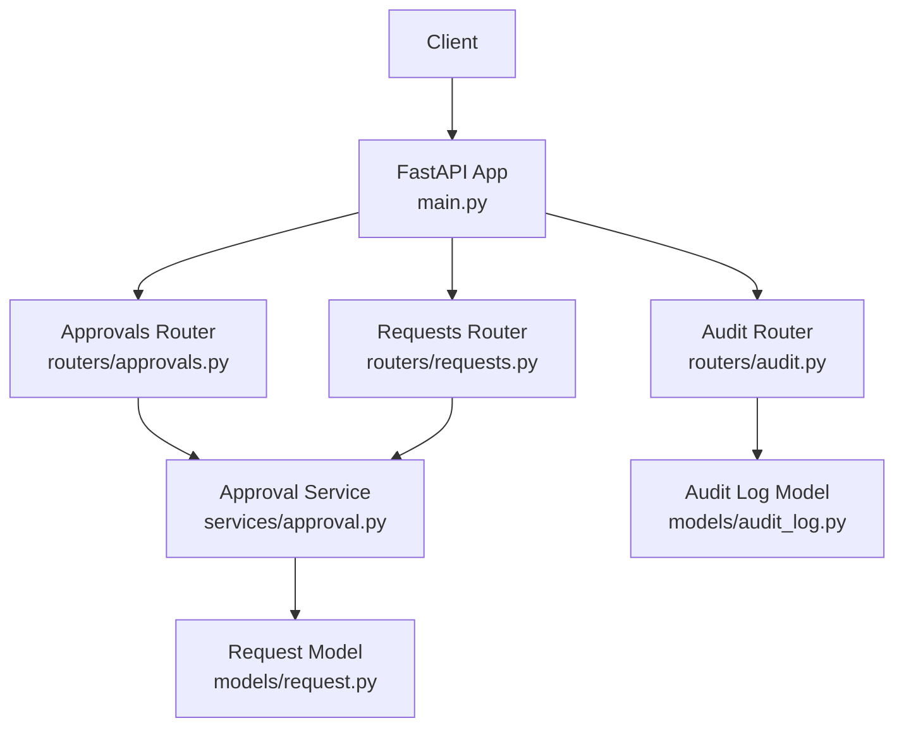
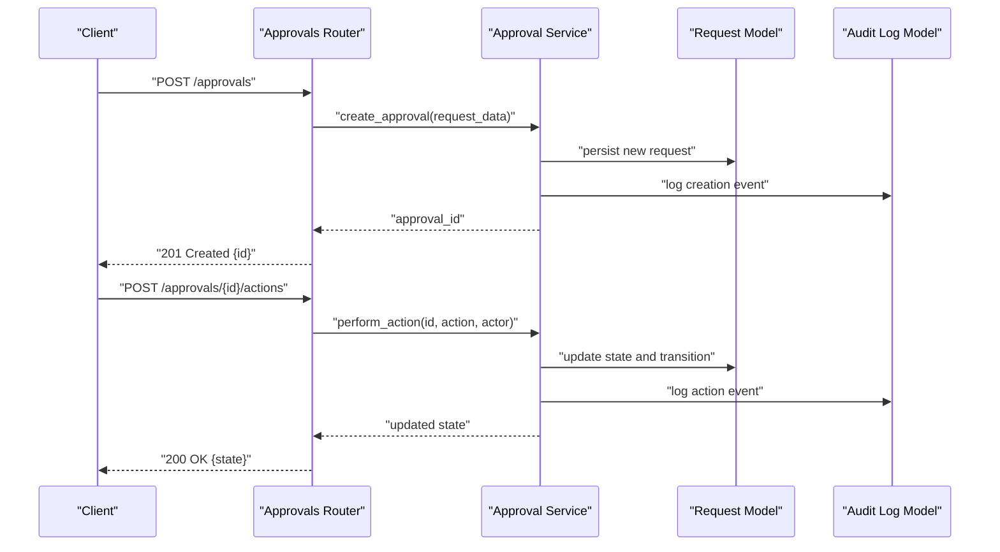
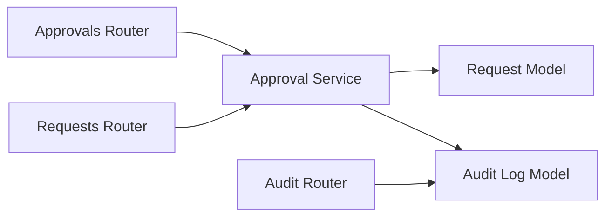

# Approval System API

<cite>
**Referenced Files in This Document**
- [backend/app/routers/approvals.py](file://backend/app/routers/approvals.py)
- [backend/app/services/approval.py](file://backend/app/services/approval.py)
- [backend/app/schemas/approval.py](file://backend/app/schemas/approval.py)
- [backend/app/models/request.py](file://backend/app/models/request.py)
- [backend/app/models/audit_log.py](file://backend/app/models/audit_log.py)
- [backend/app/routers/requests.py](file://backend/app/routers/requests.py)
- [backend/app/routers/audit.py](file://backend/app/routers/audit.py)
- [backend/app/main.py](file://backend/app/main.py)
</cite>

## Table of Contents
1. [Introduction](#introduction)
2. [Project Structure](#project-structure)
3. [Core Components](#core-components)
4. [Architecture Overview](#architecture-overview)
5. [Detailed Component Analysis](#detailed-component-analysis)
6. [Dependency Analysis](#dependency-analysis)
7. [Performance Considerations](#performance-considerations)
8. [Troubleshooting Guide](#troubleshooting-guide)
9. [Conclusion](#conclusion)
10. [Appendices](#appendices)

## Introduction
This document provides detailed API documentation for the approval system endpoints. It covers HTTP methods for managing approval workflows, including creating approval requests, performing approval actions (approve/reject), escalation handling, and retrieving approval history. It also explains approval chain configuration, conditional approvals, multi-level approval processes, automated rules, notification triggers, state management, conflict resolution, and audit logging integration.

## Project Structure
The approval system is implemented as a FastAPI backend with modular routers, services, schemas, and models:
- Routers define HTTP endpoints for approvals, requests, and audit logs.
- Services implement business logic for approval workflows, including chain evaluation, state transitions, and notifications.
- Schemas define request/response structures for API contracts.
- Models represent persistent entities such as requests and audit logs.

**Diagram sources**
- [backend/app/main.py](file://backend/app/main.py)
- [backend/app/routers/approvals.py](file://backend/app/routers/approvals.py)
- [backend/app/routers/requests.py](file://backend/app/routers/requests.py)
- [backend/app/routers/audit.py](file://backend/app/routers/audit.py)
- [backend/app/services/approval.py](file://backend/app/services/approval.py)
- [backend/app/models/request.py](file://backend/app/models/request.py)
- [backend/app/models/audit_log.py](file://backend/app/models/audit_log.py)

**Section sources**
- [backend/app/main.py](file://backend/app/main.py)
- [backend/app/routers/approvals.py](file://backend/app/routers/approvals.py)
- [backend/app/routers/requests.py](file://backend/app/routers/requests.py)
- [backend/app/routers/audit.py](file://backend/app/routers/audit.py)
- [backend/app/services/approval.py](file://backend/app/services/approval.py)
- [backend/app/models/request.py](file://backend/app/models/request.py)
- [backend/app/models/audit_log.py](file://backend/app/models/audit_log.py)

## Core Components
- Approval Router: Exposes endpoints to create, approve, reject, escalate, and list approvals and their history.
- Approval Service: Encapsulates workflow logic, including chain traversal, conditional checks, state transitions, and notifications.
- Schemas: Define structured payloads for requests and responses used by the API.
- Models: Represent persistent data for requests and audit logs.

Key responsibilities:
- End-to-end lifecycle management of approval requests.
- Enforcement of approval chains and conditions.
- Recording audit events for compliance and traceability.
- Triggering notifications upon state changes.

**Section sources**
- [backend/app/routers/approvals.py](file://backend/app/routers/approvals.py)
- [backend/app/services/approval.py](file://backend/app/services/approval.py)
- [backend/app/schemas/approval.py](file://backend/app/schemas/approval.py)
- [backend/app/models/request.py](file://backend/app/models/request.py)
- [backend/app/models/audit_log.py](file://backend/app/models/audit_log.py)

## Architecture Overview
The approval system follows a layered architecture:
- Presentation layer: FastAPI routers handle HTTP requests and responses.
- Business layer: Approval service implements workflow orchestration, condition evaluation, and side effects (notifications, audit).
- Data layer: Models persist requests and audit logs.

**Diagram sources**
- [backend/app/routers/approvals.py](file://backend/app/routers/approvals.py)
- [backend/app/services/approval.py](file://backend/app/services/approval.py)
- [backend/app/models/request.py](file://backend/app/models/request.py)
- [backend/app/models/audit_log.py](file://backend/app/models/audit_log.py)

## Detailed Component Analysis

### Approval Endpoints
The approval router exposes endpoints for:
- Creating an approval request
- Performing approval actions (approve/reject)
- Escalating pending approvals
- Listing approvals and retrieving approval history

Typical operations:
- Create: POST /approvals
- Action: POST /approvals/{id}/actions
- Escalate: POST /approvals/{id}/escalate
- List: GET /approvals
- History: GET /approvals/{id}/history

Notes:
- Authentication and authorization are enforced at the router level before invoking service methods.
- Responses conform to schemas defined in the approval schema module.

**Section sources**
- [backend/app/routers/approvals.py](file://backend/app/routers/approvals.py)
- [backend/app/schemas/approval.py](file://backend/app/schemas/approval.py)

### Approval Actions and State Transitions
Actions include approve and reject. The service validates:
- Current state allows the requested action
- Actor has permission to act on the target approval
- Conditions for the current step are satisfied

On success:
- State transitions to next step or final state
- Audit log records the action with actor and timestamp
- Notification triggers may be invoked based on policy

On failure:
- Returns appropriate error codes (e.g., 400 for invalid action, 403 for unauthorized)

**Section sources**
- [backend/app/services/approval.py](file://backend/app/services/approval.py)
- [backend/app/models/request.py](file://backend/app/models/request.py)
- [backend/app/models/audit_log.py](file://backend/app/models/audit_log.py)

### Escalation Handling
Escalation allows moving a pending approval to another approver or higher authority when:
- Time-based thresholds are exceeded
- Manual escalation is requested by authorized users
- Conditional rules indicate escalation is required

Behavior:
- Updates the current approver or step
- Records escalation event in audit log
- Triggers notifications to the escalated party

**Section sources**
- [backend/app/routers/approvals.py](file://backend/app/routers/approvals.py)
- [backend/app/services/approval.py](file://backend/app/services/approval.py)
- [backend/app/models/audit_log.py](file://backend/app/models/audit_log.py)

### Approval History Retrieval
History retrieval returns a chronological sequence of events for a given approval:
- Creation, transitions, approvals, rejections, escalations
- Each event includes actor, timestamp, and outcome

Use cases:
- Auditing and compliance reporting
- Debugging workflow issues
- User visibility into progress

**Section sources**
- [backend/app/routers/approvals.py](file://backend/app/routers/approvals.py)
- [backend/app/models/audit_log.py](file://backend/app/models/audit_log.py)

### Approval Chain Configuration
Approval chains define the ordered set of steps and approvers:
- Single-level vs multi-level chains
- Role-based or user-specific approvers
- Parallel vs sequential steps
- Conditional branches based on request attributes

Configuration inputs typically include:
- Step definitions with approver selection rules
- Conditions for branching or skipping steps
- Timeout and escalation policies per step

**Section sources**
- [backend/app/services/approval.py](file://backend/app/services/approval.py)
- [backend/app/schemas/approval.py](file://backend/app/schemas/approval.py)

### Conditional Approvals
Conditional approvals allow dynamic routing and decision-making:
- Evaluate request properties (e.g., amount, resource type)
- Apply rule sets to determine approver or path
- Support fallbacks and default paths

Implementation patterns:
- Rule engine or predicate functions evaluated during step resolution
- Short-circuiting when conditions match
- Logging of rule evaluations for transparency

**Section sources**
- [backend/app/services/approval.py](file://backend/app/services/approval.py)

### Multi-Level Approval Processes
Multi-level approvals enforce hierarchical review:
- Sequential steps where each must succeed before proceeding
- Optional parallel reviews with aggregation rules (e.g., all must approve)
- Rejection at any level terminates the workflow

State management ensures:
- Idempotent actions
- Consistent transitions across retries
- Clear final states (approved, rejected, expired)

**Section sources**
- [backend/app/services/approval.py](file://backend/app/services/approval.py)
- [backend/app/models/request.py](file://backend/app/models/request.py)

### Automated Approval Rules
Automated rules can auto-approve or auto-reject under specific conditions:
- Low-risk requests within predefined thresholds
- Pre-approved templates or whitelisted resources
- Time-based automatic approvals if no action taken

Integration points:
- Evaluated during step resolution
- Recorded in audit log as automated decisions
- Notifications sent to stakeholders

**Section sources**
- [backend/app/services/approval.py](file://backend/app/services/approval.py)
- [backend/app/models/audit_log.py](file://backend/app/models/audit_log.py)

### Notification Triggers
Notifications are triggered on key events:
- New approval assigned
- Action taken (approve/reject)
- Escalation occurred
- Workflow completed

Channels may include email, webhook, or internal messaging, configured per organization policy.

**Section sources**
- [backend/app/services/approval.py](file://backend/app/services/approval.py)

### Approval State Management
States and transitions:
- Draft -> Pending -> Approved/Rejected
- Pending -> Escalated -> Pending
- Final states: Approved, Rejected, Expired

Rules:
- Only valid transitions allowed
- Actors validated against step permissions
- Conflicts resolved by locking or optimistic concurrency

**Section sources**
- [backend/app/models/request.py](file://backend/app/models/request.py)
- [backend/app/services/approval.py](file://backend/app/services/approval.py)

### Conflict Resolution
Conflict scenarios:
- Concurrent actions on the same approval
- Overlapping approver assignments
- Inconsistent state due to retries

Resolution strategies:
- Optimistic locking with version fields
- Idempotency keys for actions
- Deterministic tie-breaking rules

**Section sources**
- [backend/app/services/approval.py](file://backend/app/services/approval.py)
- [backend/app/models/request.py](file://backend/app/models/request.py)

### Audit Logging Integration
Audit logs capture:
- Who performed what action
- When it happened
- Why (conditions and rules applied)
- Outcome and side effects

Endpoints:
- Retrieve audit entries for approvals
- Filter by time range, actor, or event type

**Section sources**
- [backend/app/routers/audit.py](file://backend/app/routers/audit.py)
- [backend/app/models/audit_log.py](file://backend/app/models/audit_log.py)

### Request Creation Flow
Creating a request initiates the approval process:
- Validate input payload
- Determine initial step and approver(s)
- Persist request and initial audit event
- Return created approval ID

**Section sources**
- [backend/app/routers/requests.py](file://backend/app/routers/requests.py)
- [backend/app/services/approval.py](file://backend/app/services/approval.py)
- [backend/app/models/request.py](file://backend/app/models/request.py)
- [backend/app/models/audit_log.py](file://backend/app/models/audit_log.py)

## Dependency Analysis
The approval system components interact as follows:
- Routers depend on services for business logic.
- Services depend on models for persistence and may trigger notifications.
- Audit logs are written alongside state transitions.

**Diagram sources**
- [backend/app/routers/approvals.py](file://backend/app/routers/approvals.py)
- [backend/app/routers/requests.py](file://backend/app/routers/requests.py)
- [backend/app/routers/audit.py](file://backend/app/routers/audit.py)
- [backend/app/services/approval.py](file://backend/app/services/approval.py)
- [backend/app/models/request.py](file://backend/app/models/request.py)
- [backend/app/models/audit_log.py](file://backend/app/models/audit_log.py)

**Section sources**
- [backend/app/routers/approvals.py](file://backend/app/routers/approvals.py)
- [backend/app/routers/requests.py](file://backend/app/routers/requests.py)
- [backend/app/routers/audit.py](file://backend/app/routers/audit.py)
- [backend/app/services/approval.py](file://backend/app/services/approval.py)
- [backend/app/models/request.py](file://backend/app/models/request.py)
- [backend/app/models/audit_log.py](file://backend/app/models/audit_log.py)

## Performance Considerations
- Batch operations: Prefer batched approvals where supported to reduce round trips.
- Indexing: Ensure database indexes on frequently queried fields (e.g., status, approver_id).
- Pagination: Use pagination for listing approvals and history to avoid large payloads.
- Concurrency: Implement idempotency and optimistic locking to handle concurrent actions efficiently.
- Caching: Cache static approval chain configurations to minimize lookup overhead.

[No sources needed since this section provides general guidance]

## Troubleshooting Guide
Common issues and resolutions:
- Invalid action errors: Verify current state and actor permissions before calling action endpoints.
- Unauthorized access: Ensure authentication headers and roles align with step requirements.
- Duplicate submissions: Use idempotency keys to prevent duplicate actions.
- Missing history: Confirm audit logging is enabled and write operations succeeded.

Diagnostic steps:
- Inspect audit logs for the approval ID to trace events.
- Validate request payload against schema constraints.
- Check notification delivery logs if applicable.

**Section sources**
- [backend/app/routers/approvals.py](file://backend/app/routers/approvals.py)
- [backend/app/routers/audit.py](file://backend/app/routers/audit.py)
- [backend/app/services/approval.py](file://backend/app/services/approval.py)
- [backend/app/models/audit_log.py](file://backend/app/models/audit_log.py)

## Conclusion
The approval system provides a robust, auditable, and configurable workflow engine for managing approvals. It supports multi-level chains, conditional routing, escalation, and comprehensive history tracking. By adhering to the documented endpoints and best practices, teams can implement secure and compliant approval processes tailored to organizational needs.

[No sources needed since this section summarizes without analyzing specific files]

## Appendices

### API Reference Summary
- Create Approval: POST /approvals
- Perform Action: POST /approvals/{id}/actions
- Escalate: POST /approvals/{id}/escalate
- List Approvals: GET /approvals
- Approval History: GET /approvals/{id}/history
- Audit Logs: GET /audit/logs (filterable by entity and event)

For exact request/response schemas and validation rules, refer to the approval schema module.

**Section sources**
- [backend/app/routers/approvals.py](file://backend/app/routers/approvals.py)
- [backend/app/routers/audit.py](file://backend/app/routers/audit.py)
- [backend/app/schemas/approval.py](file://backend/app/schemas/approval.py)