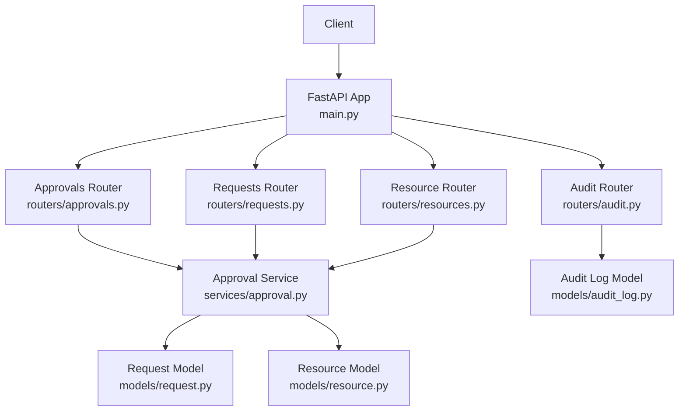
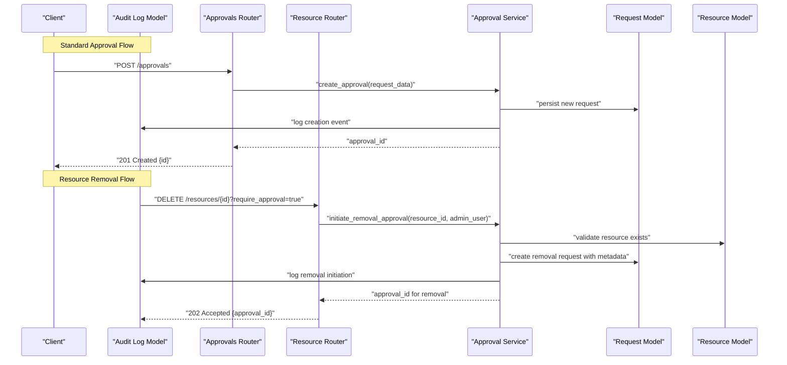
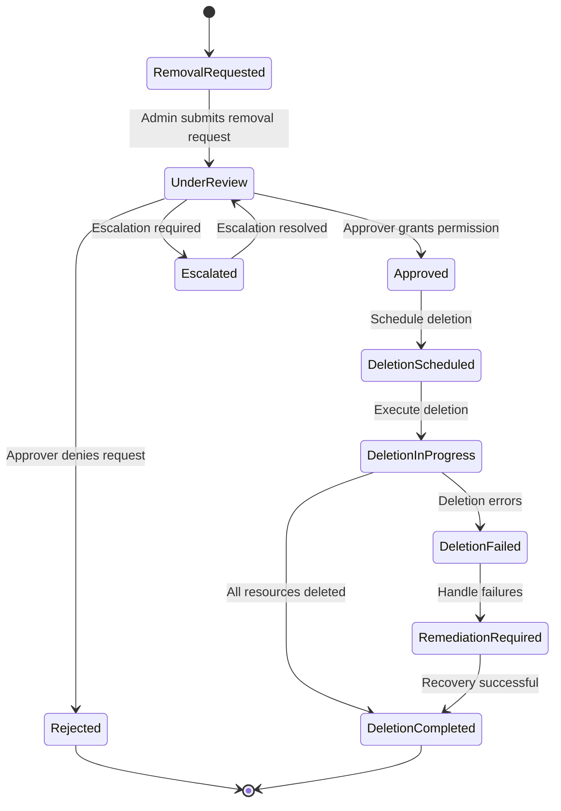
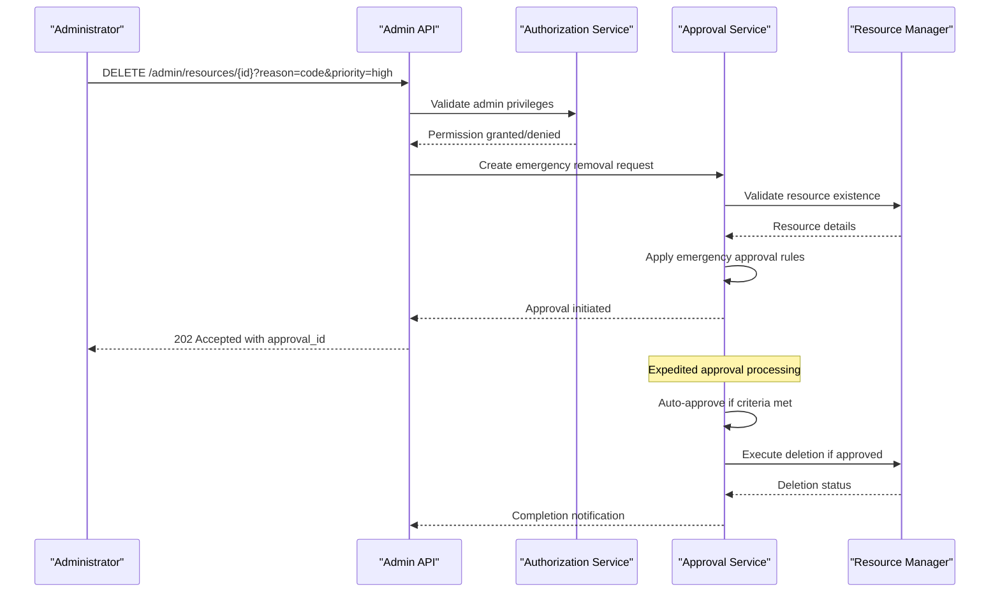
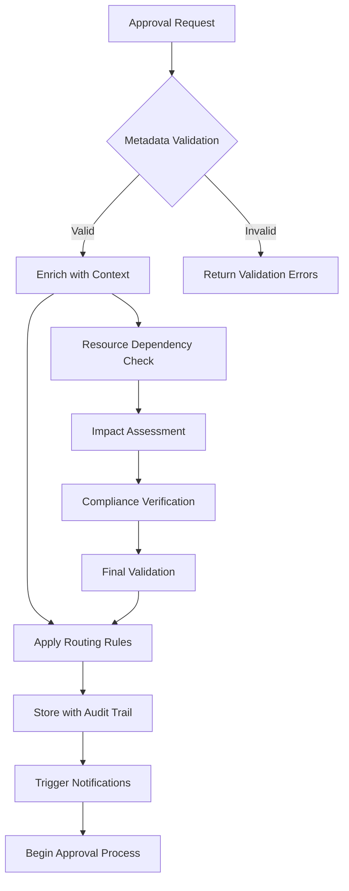
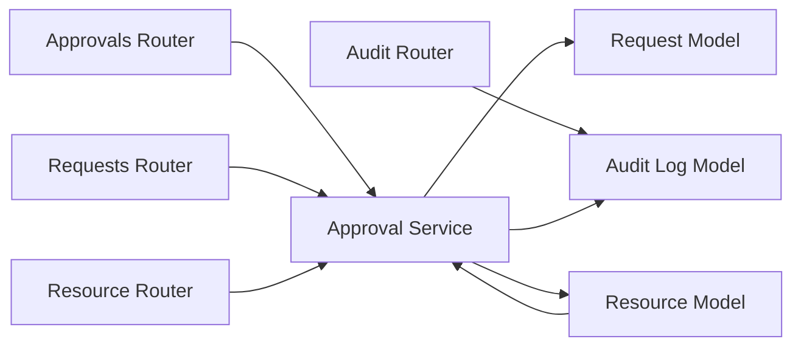

# Approval System API

<cite>
**Referenced Files in This Document**
- [backend/app/routers/approvals.py](file://backend/app/routers/approvals.py)
- [backend/app/services/approval.py](file://backend/app/services/approval.py)
- [backend/app/schemas/approval.py](file://backend/app/schemas/approval.py)
- [backend/app/models/request.py](file://backend/app/models/request.py)
- [backend/app/models/audit_log.py](file://backend/app/models/audit_log.py)
- [backend/app/routers/requests.py](file://backend/app/routers/requests.py)
- [backend/app/routers/audit.py](file://backend/app/routers/audit.py)
- [backend/app/main.py](file://backend/app/main.py)
</cite>

## Update Summary
**Changes Made**
- Added comprehensive documentation for resource removal approval workflows
- Enhanced approval action endpoints to support deletion operations with metadata
- Updated admin-initiated deletion capabilities and authorization requirements
- Expanded metadata field support for approval requests including removal-specific attributes
- Added new endpoints and schemas for resource removal management

## Table of Contents
1. [Introduction](#introduction)
2. [Project Structure](#project-structure)
3. [Core Components](#core-components)
4. [Architecture Overview](#architecture-overview)
5. [Detailed Component Analysis](#detailed-component-analysis)
6. [Resource Removal Approval Workflows](#resource-removal-approval-workflows)
7. [Admin-Initiated Deletion Support](#admin-initiated-deletion-support)
8. [Enhanced Metadata Fields](#enhanced-metadata-fields)
9. [Dependency Analysis](#dependency-analysis)
10. [Performance Considerations](#performance-considerations)
11. [Troubleshooting Guide](#troubleshooting-guide)
12. [Conclusion](#conclusion)
13. [Appendices](#appendices)

## Introduction
This document provides detailed API documentation for the enhanced approval system endpoints. It covers HTTP methods for managing approval workflows, including creating approval requests, performing approval actions (approve/reject), escalation handling, and retrieving approval history. The system now includes comprehensive support for resource removal approvals with additional metadata fields and admin-initiated deletion capabilities. It also explains approval chain configuration, conditional approvals, multi-level approval processes, automated rules, notification triggers, state management, conflict resolution, and audit logging integration.

## Project Structure
The approval system is implemented as a FastAPI backend with modular routers, services, schemas, and models:
- Routers define HTTP endpoints for approvals, requests, audit logs, and resource management.
- Services implement business logic for approval workflows, including chain evaluation, state transitions, notifications, and resource operations.
- Schemas define request/response structures for API contracts with enhanced metadata support.
- Models represent persistent entities such as requests, audit logs, and resource associations.

**Diagram sources**
- [backend/app/main.py](file://backend/app/main.py)
- [backend/app/routers/approvals.py](file://backend/app/routers/approvals.py)
- [backend/app/routers/requests.py](file://backend/app/routers/requests.py)
- [backend/app/routers/audit.py](file://backend/app/routers/audit.py)
- [backend/app/services/approval.py](file://backend/app/services/approval.py)
- [backend/app/models/request.py](file://backend/app/models/request.py)
- [backend/app/models/audit_log.py](file://backend/app/models/audit_log.py)

**Section sources**
- [backend/app/main.py](file://backend/app/main.py)
- [backend/app/routers/approvals.py](file://backend/app/routers/approvals.py)
- [backend/app/routers/requests.py](file://backend/app/routers/requests.py)
- [backend/app/routers/audit.py](file://backend/app/routers/audit.py)
- [backend/app/services/approval.py](file://backend/app/services/approval.py)
- [backend/app/models/request.py](file://backend/app/models/request.py)
- [backend/app/models/audit_log.py](file://backend/app/models/audit_log.py)

## Core Components
- Approval Router: Exposes endpoints to create, approve, reject, escalate, and list approvals and their history, with enhanced support for resource removal operations.
- Approval Service: Encapsulates workflow logic, including chain traversal, conditional checks, state transitions, notifications, and resource operation coordination.
- Schemas: Define structured payloads for requests and responses used by the API, including enhanced metadata fields for resource removal scenarios.
- Models: Represent persistent data for requests, audit logs, and resource associations.

Key responsibilities:
- End-to-end lifecycle management of approval requests including resource removal workflows.
- Enforcement of approval chains and conditions with support for deletion operations.
- Recording audit events for compliance and traceability across all resource operations.
- Triggering notifications upon state changes and resource modifications.

**Section sources**
- [backend/app/routers/approvals.py](file://backend/app/routers/approvals.py)
- [backend/app/services/approval.py](file://backend/app/services/approval.py)
- [backend/app/schemas/approval.py](file://backend/app/schemas/approval.py)
- [backend/app/models/request.py](file://backend/app/models/request.py)
- [backend/app/models/audit_log.py](file://backend/app/models/audit_log.py)

## Architecture Overview
The approval system follows a layered architecture with enhanced resource management capabilities:
- Presentation layer: FastAPI routers handle HTTP requests and responses for both standard approvals and resource removal operations.
- Business layer: Approval service implements workflow orchestration, condition evaluation, side effects (notifications, audit), and resource operation coordination.
- Data layer: Models persist requests, audit logs, and resource associations with enhanced metadata support.

**Diagram sources**
- [backend/app/routers/approvals.py](file://backend/app/routers/approvals.py)
- [backend/app/routers/requests.py](file://backend/app/routers/requests.py)
- [backend/app/services/approval.py](file://backend/app/services/approval.py)
- [backend/app/models/request.py](file://backend/app/models/request.py)
- [backend/app/models/audit_log.py](file://backend/app/models/audit_log.py)

## Detailed Component Analysis

### Approval Endpoints
The approval router exposes endpoints for:
- Creating an approval request
- Performing approval actions (approve/reject)
- Escalating pending approvals
- Listing approvals and retrieving approval history
- **New**: Managing resource removal approvals with enhanced metadata

Typical operations:
- Create: POST /approvals
- Action: POST /approvals/{id}/actions
- Escalate: POST /approvals/{id}/escalate
- List: GET /approvals
- History: GET /approvals/{id}/history
- **New**: Remove Resource: DELETE /resources/{id} (with approval requirement)

Notes:
- Authentication and authorization are enforced at the router level before invoking service methods.
- Responses conform to schemas defined in the approval schema module with enhanced metadata support.
- Resource removal operations require additional validation and audit logging.

**Section sources**
- [backend/app/routers/approvals.py](file://backend/app/routers/approvals.py)
- [backend/app/schemas/approval.py](file://backend/app/schemas/approval.py)

### Approval Actions and State Transitions
Actions include approve and reject with enhanced support for resource removal operations. The service validates:
- Current state allows the requested action
- Actor has permission to act on the target approval
- Conditions for the current step are satisfied
- **New**: For removal approvals, validates resource ownership and deletion prerequisites

On success:
- State transitions to next step or final state
- Audit log records the action with actor and timestamp
- Notification triggers may be invoked based on policy
- **New**: For approved removals, executes resource deletion with cascading cleanup

On failure:
- Returns appropriate error codes (e.g., 400 for invalid action, 403 for unauthorized)
- **New**: Specific error codes for resource-related validation failures

**Section sources**
- [backend/app/services/approval.py](file://backend/app/services/approval.py)
- [backend/app/models/request.py](file://backend/app/models/request.py)
- [backend/app/models/audit_log.py](file://backend/app/models/audit_log.py)

### Escalation Handling
Escalation allows moving a pending approval to another approver or higher authority when:
- Time-based thresholds are exceeded
- Manual escalation is requested by authorized users
- Conditional rules indicate escalation is required
- **New**: Special handling for critical resource removal escalations

Behavior:
- Updates the current approver or step
- Records escalation event in audit log
- Triggers notifications to the escalated party
- **New**: Enhanced priority handling for resource removal escalations

**Section sources**
- [backend/app/routers/approvals.py](file://backend/app/routers/approvals.py)
- [backend/app/services/approval.py](file://backend/app/services/approval.py)
- [backend/app/models/audit_log.py](file://backend/app/models/audit_log.py)

### Approval History Retrieval
History retrieval returns a chronological sequence of events for a given approval:
- Creation, transitions, approvals, rejections, escalations
- Each event includes actor, timestamp, and outcome
- **New**: Enhanced event types for resource removal operations including deletion attempts and cascading effects

Use cases:
- Auditing and compliance reporting
- Debugging workflow issues
- User visibility into progress
- **New**: Forensic analysis of resource deletion events

**Section sources**
- [backend/app/routers/approvals.py](file://backend/app/routers/approvals.py)
- [backend/app/models/audit_log.py](file://backend/app/models/audit_log.py)

### Approval Chain Configuration
Approval chains define the ordered set of steps and approvers:
- Single-level vs multi-level chains
- Role-based or user-specific approvers
- Parallel vs sequential steps
- Conditional branches based on request attributes
- **New**: Specialized chains for resource removal with elevated security requirements

Configuration inputs typically include:
- Step definitions with approver selection rules
- Conditions for branching or skipping steps
- Timeout and escalation policies per step
- **New**: Resource-specific approval requirements and metadata validation rules

**Section sources**
- [backend/app/services/approval.py](file://backend/app/services/approval.py)
- [backend/app/schemas/approval.py](file://backend/app/schemas/approval.py)

### Conditional Approvals
Conditional approvals allow dynamic routing and decision-making:
- Evaluate request properties (e.g., amount, resource type)
- Apply rule sets to determine approver or path
- Support fallbacks and default paths
- **New**: Resource-specific conditions for removal approvals including ownership verification and dependency checks

Implementation patterns:
- Rule engine or predicate functions evaluated during step resolution
- Short-circuiting when conditions match
- Logging of rule evaluations for transparency
- **New**: Enhanced validation for resource removal conditions

**Section sources**
- [backend/app/services/approval.py](file://backend/app/services/approval.py)

### Multi-Level Approval Processes
Multi-level approvals enforce hierarchical review:
- Sequential steps where each must succeed before proceeding
- Optional parallel reviews with aggregation rules (e.g., all must approve)
- Rejection at any level terminates the workflow
- **New**: Specialized multi-level processes for critical resource removals

State management ensures:
- Idempotent actions
- Consistent transitions across retries
- Clear final states (approved, rejected, expired)
- **New**: Enhanced state tracking for resource removal operations

**Section sources**
- [backend/app/services/approval.py](file://backend/app/services/approval.py)
- [backend/app/models/request.py](file://backend/app/models/request.py)

### Automated Approval Rules
Automated rules can auto-approve or auto-reject under specific conditions:
- Low-risk requests within predefined thresholds
- Pre-approved templates or whitelisted resources
- Time-based automatic approvals if no action taken
- **New**: Automated validation for resource removal safety checks

Integration points:
- Evaluated during step resolution
- Recorded in audit log as automated decisions
- Notifications sent to stakeholders
- **New**: Automated resource dependency validation and cleanup scheduling

**Section sources**
- [backend/app/services/approval.py](file://backend/app/services/approval.py)
- [backend/app/models/audit_log.py](file://backend/app/models/audit_log.py)

### Notification Triggers
Notifications are triggered on key events:
- New approval assigned
- Action taken (approve/reject)
- Escalation occurred
- Workflow completed
- **New**: Resource removal specific notifications including deletion confirmation and cascade effects

Channels may include email, webhook, or internal messaging, configured per organization policy.

**Section sources**
- [backend/app/services/approval.py](file://backend/app/services/approval.py)

### Approval State Management
States and transitions:
- Draft -> Pending -> Approved/Rejected
- Pending -> Escalated -> Pending
- Final states: Approved, Rejected, Expired
- **New**: Additional states for resource removal workflows including DeletionPending, DeletionInProgress, DeletionCompleted

Rules:
- Only valid transitions allowed
- Actors validated against step permissions
- Conflicts resolved by locking or optimistic concurrency
- **New**: Enhanced state validation for resource removal operations

**Section sources**
- [backend/app/models/request.py](file://backend/app/models/request.py)
- [backend/app/services/approval.py](file://backend/app/services/approval.py)

### Conflict Resolution
Conflict scenarios:
- Concurrent actions on the same approval
- Overlapping approver assignments
- Inconsistent state due to retries
- **New**: Resource removal conflicts including concurrent deletion attempts and dependency conflicts

Resolution strategies:
- Optimistic locking with version fields
- Idempotency keys for actions
- Deterministic tie-breaking rules
- **New**: Resource-level locking and dependency resolution mechanisms

**Section sources**
- [backend/app/services/approval.py](file://backend/app/services/approval.py)
- [backend/app/models/request.py](file://backend/app/models/request.py)

### Audit Logging Integration
Audit logs capture:
- Who performed what action
- When it happened
- Why (conditions and rules applied)
- Outcome and side effects
- **New**: Comprehensive resource removal audit trails including pre-deletion validation, actual deletion operations, and cascade effects

Endpoints:
- Retrieve audit entries for approvals
- Filter by time range, actor, or event type
- **New**: Specialized filtering for resource removal events

**Section sources**
- [backend/app/routers/audit.py](file://backend/app/routers/audit.py)
- [backend/app/models/audit_log.py](file://backend/app/models/audit_log.py)

### Request Creation Flow
Creating a request initiates the approval process:
- Validate input payload
- Determine initial step and approver(s)
- Persist request and initial audit event
- Return created approval ID
- **New**: Enhanced validation for resource removal requests including metadata completeness and prerequisite checks

**Section sources**
- [backend/app/routers/requests.py](file://backend/app/routers/requests.py)
- [backend/app/services/approval.py](file://backend/app/services/approval.py)
- [backend/app/models/request.py](file://backend/app/models/request.py)
- [backend/app/models/audit_log.py](file://backend/app/models/audit_log.py)

## Resource Removal Approval Workflows

### Overview
The enhanced approval system now includes comprehensive support for resource removal approvals. This feature ensures that critical resource deletions go through proper approval workflows before execution, providing an additional layer of security and control.

### Key Features
- **Mandatory Approval for Critical Resources**: Configurable approval requirements for sensitive resource types
- **Enhanced Metadata Tracking**: Rich metadata fields capturing removal context, justification, and impact assessment
- **Cascade Deletion Support**: Automatic handling of dependent resource removals with individual approval tracking
- **Emergency Override Mechanisms**: Controlled override capabilities for urgent situations with enhanced audit logging

### Resource Removal Request Lifecycle

**Diagram sources**
- [backend/app/services/approval.py](file://backend/app/services/approval.py)
- [backend/app/models/request.py](file://backend/app/models/request.py)

### Enhanced Metadata Fields
Resource removal approval requests now include comprehensive metadata fields:

**Core Removal Information:**
- `resource_type`: Type of resource being removed (VM, disk, network, etc.)
- `resource_id`: Unique identifier of the primary resource
- `removal_reason`: Justification for the removal
- `impact_assessment`: Description of potential impacts
- `backup_verification`: Confirmation of backup completion
- `scheduled_time`: Preferred deletion schedule
- `emergency_flag`: Indicates urgent removal requirements

**Administrative Context:**
- `requester_department`: Department requesting removal
- `business_justification`: Detailed business case
- `cost_impact`: Financial implications analysis
- `compliance_notes`: Regulatory compliance considerations

**Technical Details:**
- `dependent_resources`: List of related resources requiring removal
- `data_classification`: Sensitivity level of data involved
- `retention_policy`: Data retention requirements
- `cleanup_scope`: Extent of cleanup operations required

**Section sources**
- [backend/app/schemas/approval.py](file://backend/app/schemas/approval.py)
- [backend/app/models/request.py](file://backend/app/models/request.py)

## Admin-Initiated Deletion Support

### Overview
Administrators now have enhanced capabilities to initiate resource deletion workflows directly through the approval system. This feature provides controlled access to critical resource management operations while maintaining full audit trails and approval governance.

### Admin Deletion Capabilities
- **Direct Deletion Initiation**: Administrators can trigger removal approval workflows for any resource
- **Priority Handling**: Emergency deletion requests receive expedited processing
- **Bulk Operations**: Support for multiple resource deletions with consolidated approval
- **Override Authority**: Authorized administrators can bypass certain approval steps under strict conditions

### Authorization Requirements
Admin deletion operations require:
- **Elevated Permissions**: Administrator role with deletion privileges
- **Justification Documentation**: Mandatory reason codes and impact assessments
- **Approval Chain Bypass Controls**: Configurable limits on direct deletion authority
- **Enhanced Audit Logging**: Complete trail of admin actions and decisions

### Admin Deletion Workflow

**Diagram sources**
- [backend/app/routers/approvals.py](file://backend/app/routers/approvals.py)
- [backend/app/services/approval.py](file://backend/app/services/approval.py)

### Emergency Override Procedures
For critical situations requiring immediate resource removal:
- **Time-Limited Overrides**: Temporary elevation of deletion privileges
- **Witness Requirement**: Dual-authorization for high-risk deletions
- **Post-Action Review**: Mandatory retrospective approval within 24 hours
- **Comprehensive Reporting**: Detailed incident reports for all override usage

**Section sources**
- [backend/app/routers/approvals.py](file://backend/app/routers/approvals.py)
- [backend/app/services/approval.py](file://backend/app/services/approval.py)
- [backend/app/models/audit_log.py](file://backend/app/models/audit_log.py)

## Enhanced Metadata Fields

### Schema Enhancements
The approval system schemas have been expanded to support comprehensive metadata tracking for resource removal operations:

**Base Approval Schema Extensions:**
- `metadata` object with flexible key-value pairs for custom attributes
- `resource_context` for linking approvals to specific resources
- `workflow_triggers` for automated approval routing based on metadata
- `compliance_tags` for regulatory and policy enforcement

**Removal-Specific Metadata:**
- `deletion_category`: Classification of removal type (routine, emergency, compliance)
- `data_handling_requirements`: Special data processing instructions
- `notification_recipients`: Stakeholders requiring deletion notifications
- `rollback_plan`: Contingency procedures for failed deletions

**Validation Rules:**
- Required fields based on resource type and sensitivity level
- Cross-field validation for consistency and completeness
- Automated compliance checking against organizational policies
- Real-time validation feedback during request submission

### Metadata Processing Pipeline

**Diagram sources**
- [backend/app/schemas/approval.py](file://backend/app/schemas/approval.py)
- [backend/app/services/approval.py](file://backend/app/services/approval.py)

### Metadata Query and Filtering
Enhanced search capabilities for approval requests based on metadata:
- **Advanced Filtering**: Search by metadata values, date ranges, and resource attributes
- **Export Functionality**: Bulk export of approval data with metadata for reporting
- **Analytics Integration**: Metadata-driven analytics for approval efficiency and compliance
- **Real-time Dashboards**: Live monitoring of approval metrics using metadata dimensions

**Section sources**
- [backend/app/schemas/approval.py](file://backend/app/schemas/approval.py)
- [backend/app/services/approval.py](file://backend/app/services/approval.py)

## Dependency Analysis
The approval system components interact as follows with enhanced resource management capabilities:
- Routers depend on services for business logic including resource operations.
- Services depend on models for persistence and may trigger notifications and resource modifications.
- Audit logs are written alongside state transitions with enhanced detail for resource operations.
- **New**: Resource model dependencies for validation and operational coordination.

**Diagram sources**
- [backend/app/routers/approvals.py](file://backend/app/routers/approvals.py)
- [backend/app/routers/requests.py](file://backend/app/routers/requests.py)
- [backend/app/routers/audit.py](file://backend/app/routers/audit.py)
- [backend/app/services/approval.py](file://backend/app/services/approval.py)
- [backend/app/models/request.py](file://backend/app/models/request.py)
- [backend/app/models/audit_log.py](file://backend/app/models/audit_log.py)

**Section sources**
- [backend/app/routers/approvals.py](file://backend/app/routers/approvals.py)
- [backend/app/routers/requests.py](file://backend/app/routers/requests.py)
- [backend/app/routers/audit.py](file://backend/app/routers/audit.py)
- [backend/app/services/approval.py](file://backend/app/services/approval.py)
- [backend/app/models/request.py](file://backend/app/models/request.py)
- [backend/app/models/audit_log.py](file://backend/app/models/audit_log.py)

## Performance Considerations
- Batch operations: Prefer batched approvals where supported to reduce round trips.
- Indexing: Ensure database indexes on frequently queried fields (e.g., status, approver_id).
- Pagination: Use pagination for listing approvals and history to avoid large payloads.
- Concurrency: Implement idempotency and optimistic locking to handle concurrent actions efficiently.
- Caching: Cache static approval chain configurations to minimize lookup overhead.
- **New**: Resource operation optimization with connection pooling and transaction batching.
- **New**: Metadata query performance with specialized indexing for common filter combinations.
- **New**: Asynchronous processing for long-running resource deletion operations.

## Troubleshooting Guide
Common issues and resolutions:
- Invalid action errors: Verify current state and actor permissions before calling action endpoints.
- Unauthorized access: Ensure authentication headers and roles align with step requirements.
- Duplicate submissions: Use idempotency keys to prevent duplicate actions.
- Missing history: Confirm audit logging is enabled and write operations succeeded.
- **New**: Resource removal failures: Check resource dependencies and deletion prerequisites.
- **New**: Metadata validation errors: Verify required fields and format constraints for removal requests.
- **New**: Admin deletion restrictions: Confirm administrator privileges and override permissions.

Diagnostic steps:
- Inspect audit logs for the approval ID to trace events.
- Validate request payload against schema constraints.
- Check notification delivery logs if applicable.
- **New**: Monitor resource operation logs for deletion-specific issues.
- **New**: Review metadata validation logs for request formatting problems.
- **New**: Analyze admin action logs for privilege escalation issues.

**Section sources**
- [backend/app/routers/approvals.py](file://backend/app/routers/approvals.py)
- [backend/app/routers/audit.py](file://backend/app/routers/audit.py)
- [backend/app/services/approval.py](file://backend/app/services/approval.py)
- [backend/app/models/audit_log.py](file://backend/app/models/audit_log.py)

## Conclusion
The enhanced approval system provides a robust, auditable, and configurable workflow engine for managing approvals with comprehensive support for resource removal operations. The system now includes advanced features for admin-initiated deletions, enhanced metadata tracking, and sophisticated resource lifecycle management. By adhering to the documented endpoints and best practices, teams can implement secure and compliant approval processes tailored to organizational needs while ensuring proper governance over critical resource operations.

## Appendices

### API Reference Summary
- Create Approval: POST /approvals
- Perform Action: POST /approvals/{id}/actions
- Escalate: POST /approvals/{id}/escalate
- List Approvals: GET /approvals
- Approval History: GET /approvals/{id}/history
- Audit Logs: GET /audit/logs (filterable by entity and event)
- **New**: Delete Resource: DELETE /resources/{id} (with approval requirement)
- **New**: Admin Delete Resource: DELETE /admin/resources/{id} (with elevated privileges)
- **New**: Get Removal Status: GET /approvals/{id}/removal-status

For exact request/response schemas and validation rules, refer to the approval schema module.

### Enhanced Metadata Field Reference
**Required Fields for Resource Removal:**
- `resource_type`: String enum (vm, disk, network, storage, etc.)
- `resource_id`: UUID string
- `removal_reason`: Text field (min 50 characters)
- `impact_assessment`: Text field (min 100 characters)
- `backup_verification`: Boolean flag

**Optional Enhancement Fields:**
- `scheduled_time`: ISO 8601 datetime
- `emergency_flag`: Boolean
- `dependent_resources`: Array of resource IDs
- `notification_recipients`: Array of email addresses
- `compliance_tags`: Array of compliance identifiers

**Section sources**
- [backend/app/routers/approvals.py](file://backend/app/routers/approvals.py)
- [backend/app/routers/audit.py](file://backend/app/routers/audit.py)
- [backend/app/schemas/approval.py](file://backend/app/schemas/approval.py)