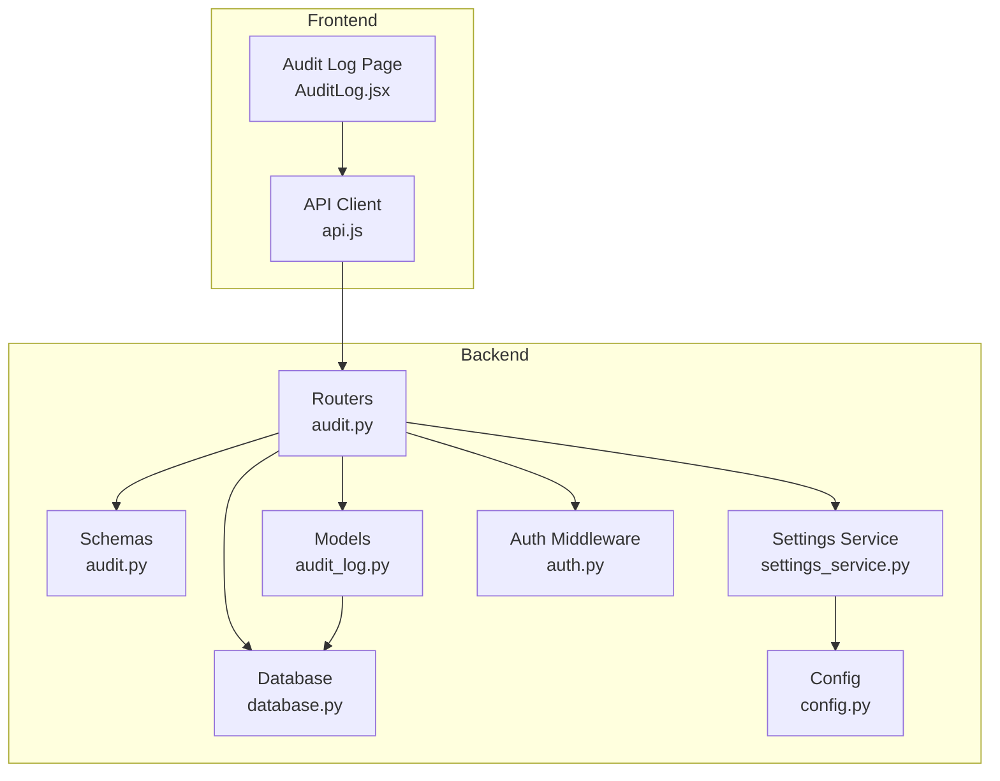
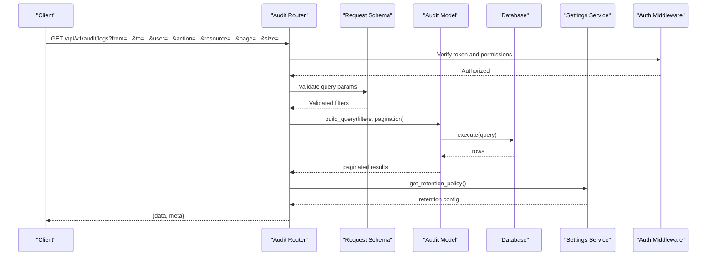
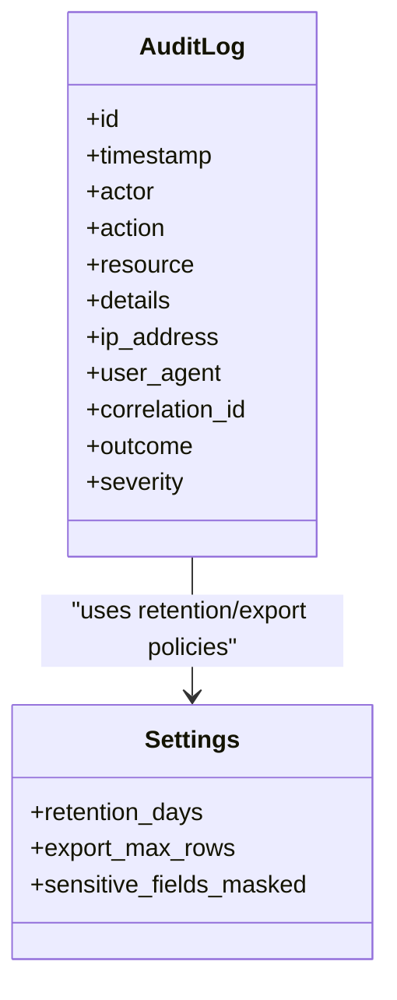
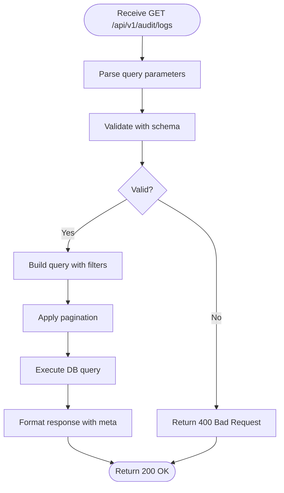
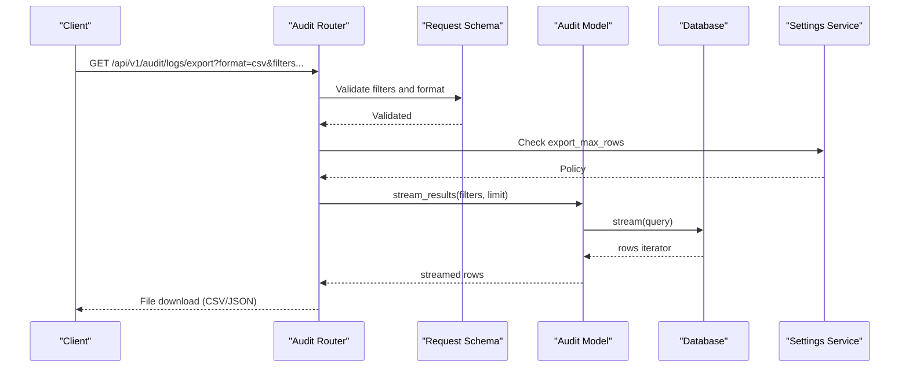
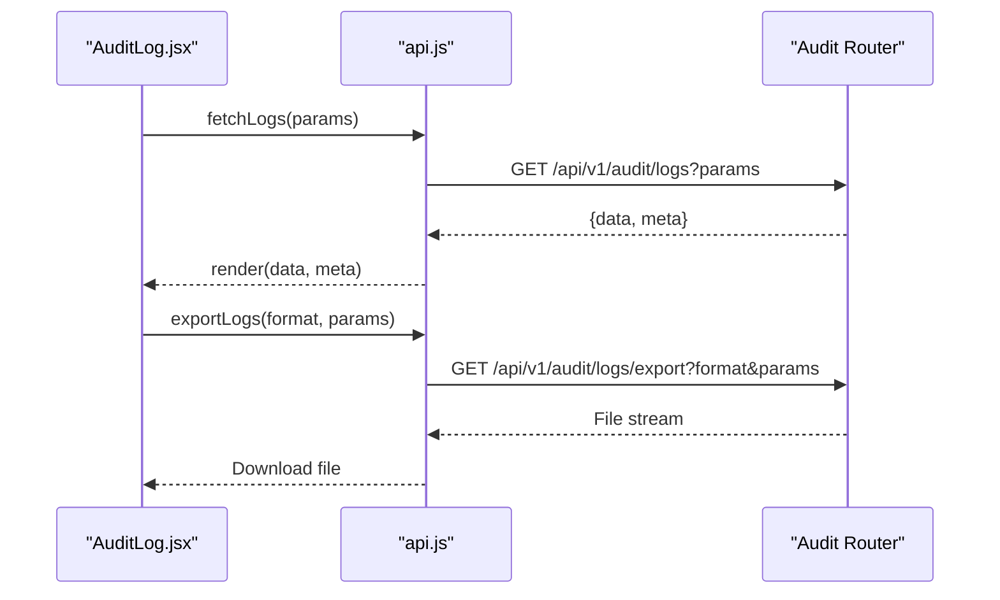
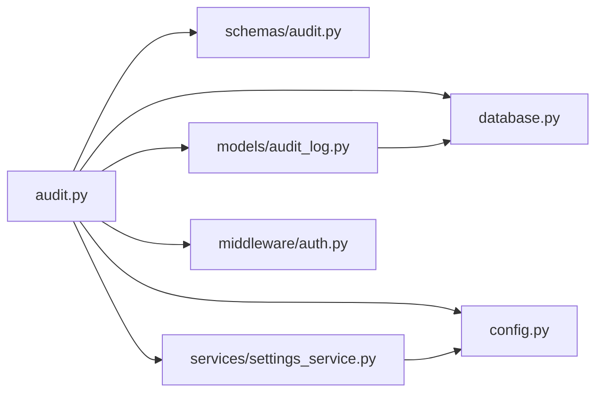

# Audit Logging API

<cite>
**Referenced Files in This Document**
- [backend/app/routers/audit.py](file://backend/app/routers/audit.py)
- [backend/app/schemas/audit.py](file://backend/app/schemas/audit.py)
- [backend/app/models/audit_log.py](file://backend/app/models/audit_log.py)
- [backend/app/services/settings_service.py](file://backend/app/services/settings_service.py)
- [backend/app/config.py](file://backend/app/config.py)
- [backend/app/database.py](file://backend/app/database.py)
- [backend/app/middleware/auth.py](file://backend/app/middleware/auth.py)
- [frontend/src/pages/admin/AuditLog.jsx](file://frontend/src/pages/admin/AuditLog.jsx)
- [frontend/src/services/api.js](file://frontend/src/services/api.js)
</cite>

## Table of Contents
1. [Introduction](#introduction)
2. [Project Structure](#project-structure)
3. [Core Components](#core-components)
4. [Architecture Overview](#architecture-overview)
5. [Detailed Component Analysis](#detailed-component-analysis)
6. [Dependency Analysis](#dependency-analysis)
7. [Performance Considerations](#performance-considerations)
8. [Troubleshooting Guide](#troubleshooting-guide)
9. [Conclusion](#conclusion)
10. [Appendices](#appendices)

## Introduction
This document provides detailed API documentation for the audit logging endpoints, including HTTP methods for retrieving audit trails and filtering logs by time range, user, action type, and resource. It explains the log entry structure, metadata fields, compliance reporting features, query patterns, export functionality, integration with security information systems, retention policies, search optimization, and privacy considerations for sensitive audit data.

## Project Structure
The audit logging feature is implemented in the backend under routers, schemas, models, services, and middleware. The frontend includes an admin page that consumes these APIs.

**Diagram sources**
- [backend/app/routers/audit.py](file://backend/app/routers/audit.py)
- [backend/app/schemas/audit.py](file://backend/app/schemas/audit.py)
- [backend/app/models/audit_log.py](file://backend/app/models/audit_log.py)
- [backend/app/database.py](file://backend/app/database.py)
- [backend/app/config.py](file://backend/app/config.py)
- [backend/app/services/settings_service.py](file://backend/app/services/settings_service.py)
- [backend/app/middleware/auth.py](file://backend/app/middleware/auth.py)
- [frontend/src/pages/admin/AuditLog.jsx](file://frontend/src/pages/admin/AuditLog.jsx)
- [frontend/src/services/api.js](file://frontend/src/services/api.js)

**Section sources**
- [backend/app/routers/audit.py](file://backend/app/routers/audit.py)
- [backend/app/schemas/audit.py](file://backend/app/schemas/audit.py)
- [backend/app/models/audit_log.py](file://backend/app/models/audit_log.py)
- [backend/app/database.py](file://backend/app/database.py)
- [backend/app/config.py](file://backend/app/config.py)
- [backend/app/services/settings_service.py](file://backend/app/services/settings_service.py)
- [backend/app/middleware/auth.py](file://backend/app/middleware/auth.py)
- [frontend/src/pages/admin/AuditLog.jsx](file://frontend/src/pages/admin/AuditLog.jsx)
- [frontend/src/services/api.js](file://frontend/src/services/api.js)

## Core Components
- Router: Defines REST endpoints for querying audit logs and exporting results.
- Schema: Validates request parameters (time range, user, action type, resource) and response payloads.
- Model: Maps database schema to ORM objects for audit entries.
- Database: Provides connection/session management and query execution.
- Settings Service: Reads system settings such as retention policy and export configuration.
- Auth Middleware: Enforces authentication and authorization for audit endpoints.
- Frontend: Admin UI that calls the audit endpoints and renders filtered results.

Key responsibilities:
- Filtering: Time range, user, action type, resource.
- Pagination: Cursor or offset-based pagination for large datasets.
- Export: CSV/JSON export via a dedicated endpoint.
- Compliance: Immutable append-only records and metadata for traceability.

**Section sources**
- [backend/app/routers/audit.py](file://backend/app/routers/audit.py)
- [backend/app/schemas/audit.py](file://backend/app/schemas/audit.py)
- [backend/app/models/audit_log.py](file://backend/app/models/audit_log.py)
- [backend/app/database.py](file://backend/app/database.py)
- [backend/app/services/settings_service.py](file://backend/app/services/settings_service.py)
- [backend/app/middleware/auth.py](file://backend/app/middleware/auth.py)
- [frontend/src/pages/admin/AuditLog.jsx](file://frontend/src/pages/admin/AuditLog.jsx)
- [frontend/src/services/api.js](file://frontend/src/services/api.js)

## Architecture Overview
The audit API follows a layered architecture:
- Clients call the router endpoints.
- Router validates inputs using Pydantic schemas.
- Router queries the database through the model layer.
- Settings service supplies retention/export policies.
- Auth middleware protects endpoints.

**Diagram sources**
- [backend/app/routers/audit.py](file://backend/app/routers/audit.py)
- [backend/app/schemas/audit.py](file://backend/app/schemas/audit.py)
- [backend/app/models/audit_log.py](file://backend/app/models/audit_log.py)
- [backend/app/database.py](file://backend/app/database.py)
- [backend/app/services/settings_service.py](file://backend/app/services/settings_service.py)
- [backend/app/middleware/auth.py](file://backend/app/middleware/auth.py)

## Detailed Component Analysis

### Audit Logs Query Endpoint
- Method: GET
- Path: /api/v1/audit/logs
- Purpose: Retrieve audit trail entries with filtering and pagination.

Query Parameters:
- from: ISO-8601 timestamp (inclusive start of time range).
- to: ISO-8601 timestamp (inclusive end of time range).
- user: Filter by actor username or ID.
- action: Filter by action type (e.g., create, update, delete, access).
- resource: Filter by resource identifier or type.
- page: Page number (default 1).
- size: Page size (default 50; max enforced by server).

Response Fields:
- data: Array of audit entries.
- meta: Pagination info (total, page, size, has_next).

Each audit entry contains:
- id: Unique log identifier.
- timestamp: When the event occurred.
- actor: User who performed the action.
- action: Type of action.
- resource: Target resource identifier/type.
- details: Structured payload describing the change.
- ip_address: Source IP of the request.
- user_agent: Client user agent string.
- correlation_id: Request correlation identifier for tracing.
- outcome: Success/failure status.
- severity: Severity level (info, warning, error).

Notes:
- All filters are optional; omitting them returns all entries within default time bounds if configured.
- Sorting defaults to newest first; some implementations may allow sort_by and order parameters.

Example usage patterns:
- Last 24 hours: set from to 24h ago and to to now.
- Specific user actions: add user filter.
- Action-specific logs: add action filter.
- Resource-scoped logs: add resource filter.
- Combine filters: use multiple filters together.

Export Endpoint:
- Method: GET
- Path: /api/v1/audit/logs/export
- Query Parameters: Same as query endpoint plus format (csv or json).
- Behavior: Streams a downloadable file based on current filters.

Security:
- Requires authenticated session with appropriate role (e.g., auditor or admin).
- Rate limiting applies to prevent abuse.

**Section sources**
- [backend/app/routers/audit.py](file://backend/app/routers/audit.py)
- [backend/app/schemas/audit.py](file://backend/app/schemas/audit.py)
- [backend/app/models/audit_log.py](file://backend/app/models/audit_log.py)
- [backend/app/database.py](file://backend/app/database.py)
- [backend/app/services/settings_service.py](file://backend/app/services/settings_service.py)
- [backend/app/middleware/auth.py](file://backend/app/middleware/auth.py)

### Data Model and Relationships
The audit log model maps to a table storing immutable audit events. Typical fields include identifiers, timestamps, actor, action, resource, details, and metadata.

**Diagram sources**
- [backend/app/models/audit_log.py](file://backend/app/models/audit_log.py)
- [backend/app/services/settings_service.py](file://backend/app/services/settings_service.py)

**Section sources**
- [backend/app/models/audit_log.py](file://backend/app/models/audit_log.py)
- [backend/app/services/settings_service.py](file://backend/app/services/settings_service.py)

### Request Validation Flow

**Diagram sources**
- [backend/app/schemas/audit.py](file://backend/app/schemas/audit.py)
- [backend/app/routers/audit.py](file://backend/app/routers/audit.py)
- [backend/app/database.py](file://backend/app/database.py)

**Section sources**
- [backend/app/schemas/audit.py](file://backend/app/schemas/audit.py)
- [backend/app/routers/audit.py](file://backend/app/routers/audit.py)
- [backend/app/database.py](file://backend/app/database.py)

### Export Workflow

**Diagram sources**
- [backend/app/routers/audit.py](file://backend/app/routers/audit.py)
- [backend/app/schemas/audit.py](file://backend/app/schemas/audit.py)
- [backend/app/models/audit_log.py](file://backend/app/models/audit_log.py)
- [backend/app/database.py](file://backend/app/database.py)
- [backend/app/services/settings_service.py](file://backend/app/services/settings_service.py)

**Section sources**
- [backend/app/routers/audit.py](file://backend/app/routers/audit.py)
- [backend/app/schemas/audit.py](file://backend/app/schemas/audit.py)
- [backend/app/models/audit_log.py](file://backend/app/models/audit_log.py)
- [backend/app/database.py](file://backend/app/database.py)
- [backend/app/services/settings_service.py](file://backend/app/services/settings_service.py)

### Frontend Integration
The admin page consumes the audit endpoints to display filtered logs and trigger exports.

**Diagram sources**
- [frontend/src/pages/admin/AuditLog.jsx](file://frontend/src/pages/admin/AuditLog.jsx)
- [frontend/src/services/api.js](file://frontend/src/services/api.js)
- [backend/app/routers/audit.py](file://backend/app/routers/audit.py)

**Section sources**
- [frontend/src/pages/admin/AuditLog.jsx](file://frontend/src/pages/admin/AuditLog.jsx)
- [frontend/src/services/api.js](file://frontend/src/services/api.js)
- [backend/app/routers/audit.py](file://backend/app/routers/audit.py)

## Dependency Analysis
The audit subsystem depends on configuration, database connectivity, and settings services.

**Diagram sources**
- [backend/app/routers/audit.py](file://backend/app/routers/audit.py)
- [backend/app/schemas/audit.py](file://backend/app/schemas/audit.py)
- [backend/app/models/audit_log.py](file://backend/app/models/audit_log.py)
- [backend/app/database.py](file://backend/app/database.py)
- [backend/app/services/settings_service.py](file://backend/app/services/settings_service.py)
- [backend/app/config.py](file://backend/app/config.py)
- [backend/app/middleware/auth.py](file://backend/app/middleware/auth.py)

**Section sources**
- [backend/app/routers/audit.py](file://backend/app/routers/audit.py)
- [backend/app/schemas/audit.py](file://backend/app/schemas/audit.py)
- [backend/app/models/audit_log.py](file://backend/app/models/audit_log.py)
- [backend/app/database.py](file://backend/app/database.py)
- [backend/app/services/settings_service.py](file://backend/app/services/settings_service.py)
- [backend/app/config.py](file://backend/app/config.py)
- [backend/app/middleware/auth.py](file://backend/app/middleware/auth.py)

## Performance Considerations
- Indexing: Ensure indexes on timestamp, actor, action, and resource columns to optimize filtering.
- Pagination: Use cursor-based pagination for large result sets to avoid deep offset scans.
- Streaming Exports: Stream rows during export to reduce memory footprint.
- Query Limits: Enforce maximum row limits for exports and queries to prevent overload.
- Caching: Avoid caching mutable audit data; rely on database-level optimizations.
- Connection Pooling: Tune database connection pool sizes for concurrent audit queries.

[No sources needed since this section provides general guidance]

## Troubleshooting Guide
Common issues and resolutions:
- Authentication failures: Ensure valid tokens and correct roles for audit endpoints.
- Invalid date ranges: Validate ISO-8601 formats and ensure from <= to.
- Empty results: Confirm filters exist in the dataset; adjust time range or remove restrictive filters.
- Export timeouts: Reduce page size or narrow filters; verify export_max_rows setting.
- High latency: Check database indexes and query plans; consider partitioning by time.

Operational checks:
- Review application logs for validation errors and query performance metrics.
- Monitor database slow query logs for unoptimized filters.
- Verify settings service availability and configuration values.

**Section sources**
- [backend/app/middleware/auth.py](file://backend/app/middleware/auth.py)
- [backend/app/schemas/audit.py](file://backend/app/schemas/audit.py)
- [backend/app/services/settings_service.py](file://backend/app/services/settings_service.py)
- [backend/app/database.py](file://backend/app/database.py)

## Conclusion
The audit logging API provides secure, filterable, and exportable access to immutable audit trails. With robust validation, pagination, streaming exports, and configurable retention policies, it supports compliance reporting and integration with security information systems. Proper indexing, query limits, and privacy controls ensure performance and data protection.

[No sources needed since this section summarizes without analyzing specific files]

## Appendices

### Log Retention Policies
- Retention days: Configurable via settings service.
- Archival: Older records can be archived or purged according to policy.
- Immutability: Records should not be modified post-insertion.

**Section sources**
- [backend/app/services/settings_service.py](file://backend/app/services/settings_service.py)
- [backend/app/config.py](file://backend/app/config.py)

### Search Optimization
- Recommended indexes: timestamp, actor, action, resource.
- Composite indexes: (timestamp, actor), (timestamp, action), (timestamp, resource).
- Partitioning: By month or quarter for large datasets.

**Section sources**
- [backend/app/models/audit_log.py](file://backend/app/models/audit_log.py)
- [backend/app/database.py](file://backend/app/database.py)

### Privacy Considerations
- Mask sensitive fields in details where required by policy.
- Restrict access to full details based on roles.
- Avoid logging secrets or PII unless necessary and compliant.

**Section sources**
- [backend/app/services/settings_service.py](file://backend/app/services/settings_service.py)
- [backend/app/middleware/auth.py](file://backend/app/middleware/auth.py)

### Compliance Reporting Features
- Immutable append-only logs.
- Correlation IDs for cross-system tracing.
- Export to CSV/JSON for SIEM ingestion.
- Metadata fields for provenance and context.

**Section sources**
- [backend/app/routers/audit.py](file://backend/app/routers/audit.py)
- [backend/app/models/audit_log.py](file://backend/app/models/audit_log.py)
- [backend/app/services/settings_service.py](file://backend/app/services/settings_service.py)