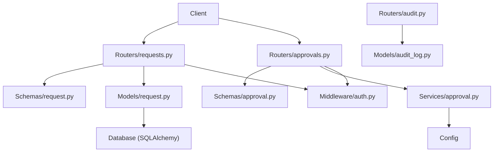
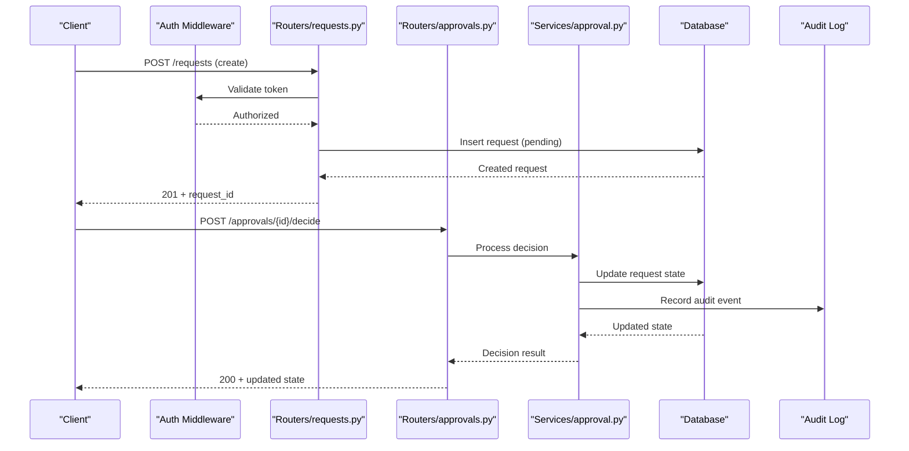
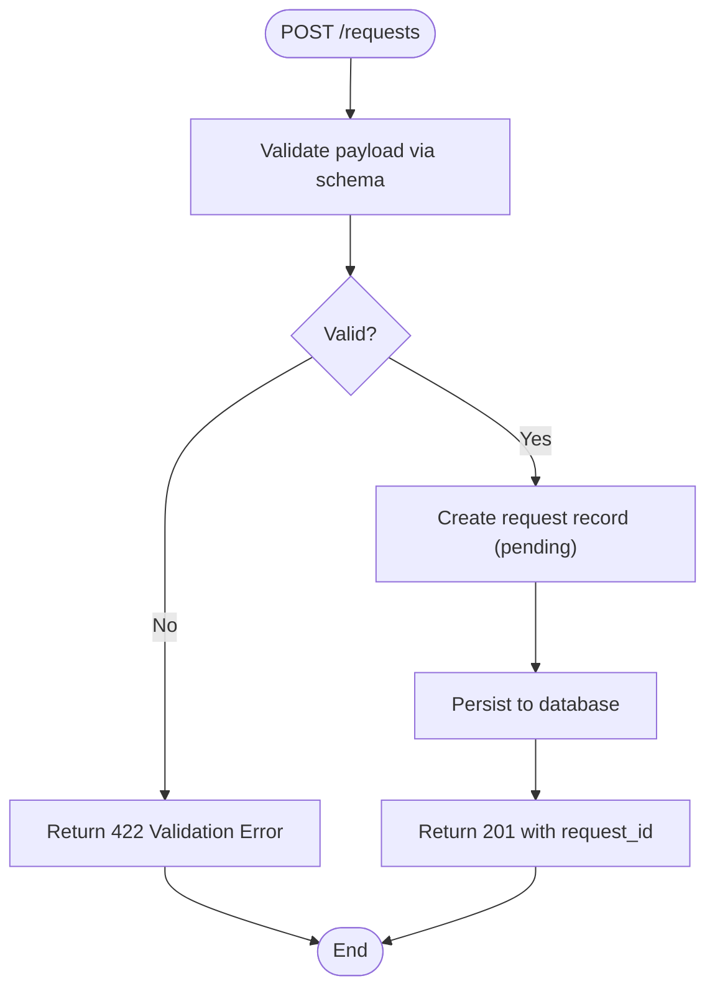
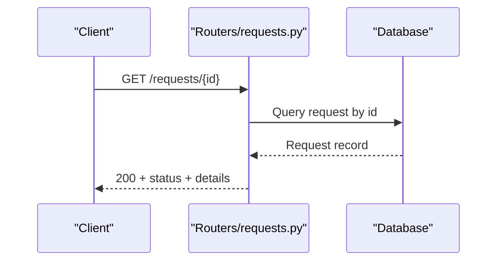
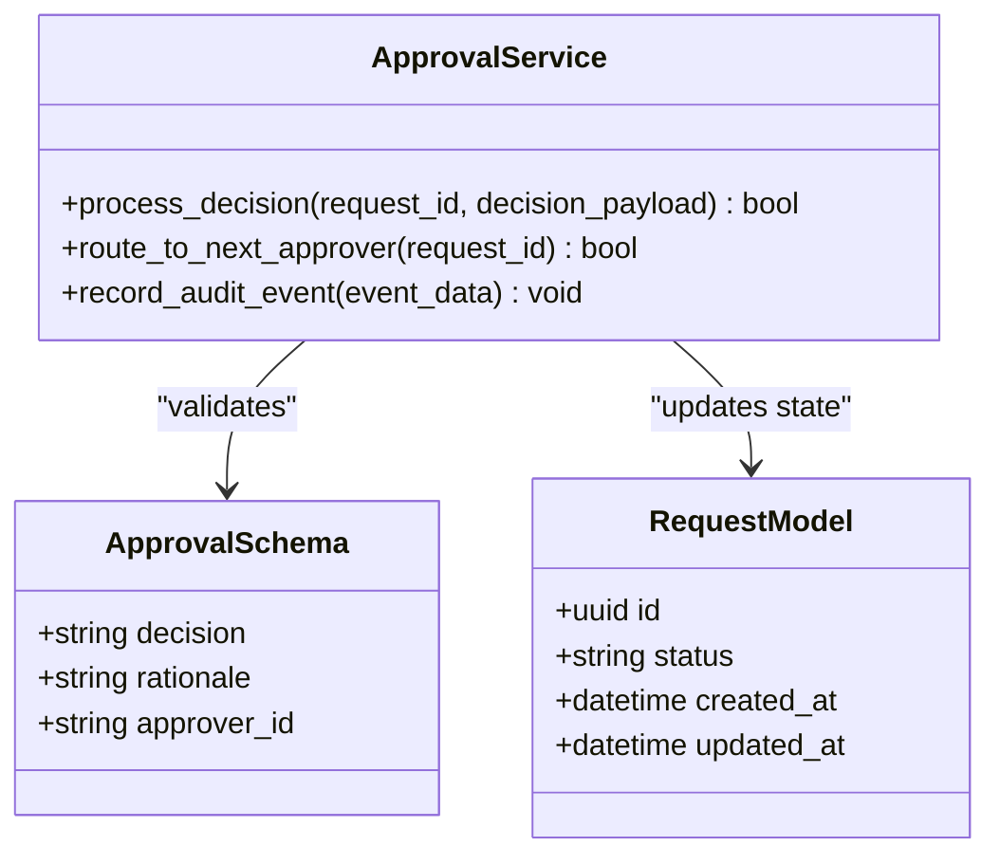
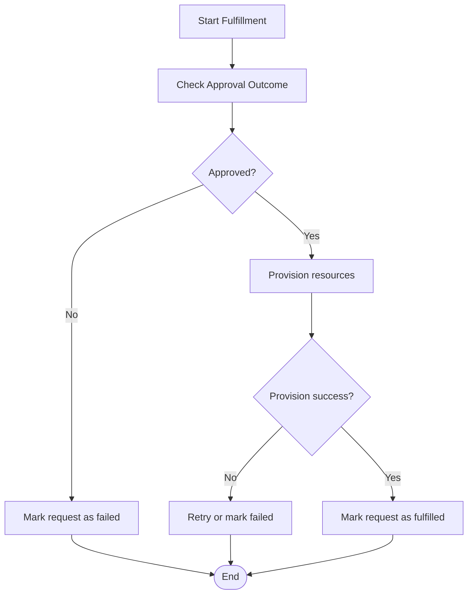
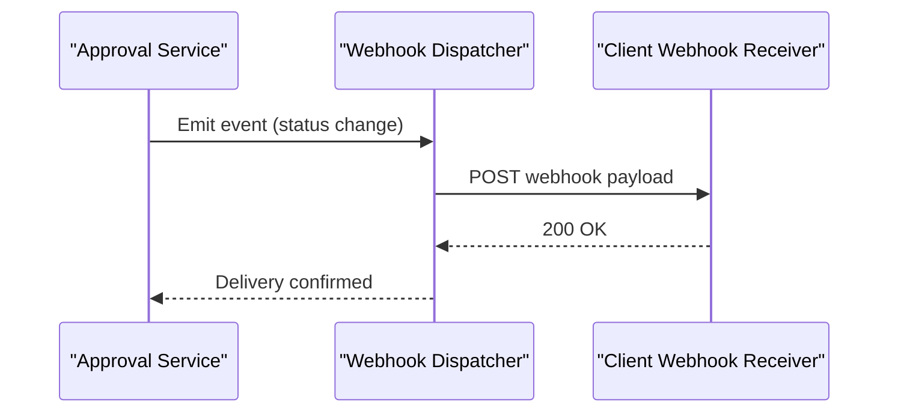
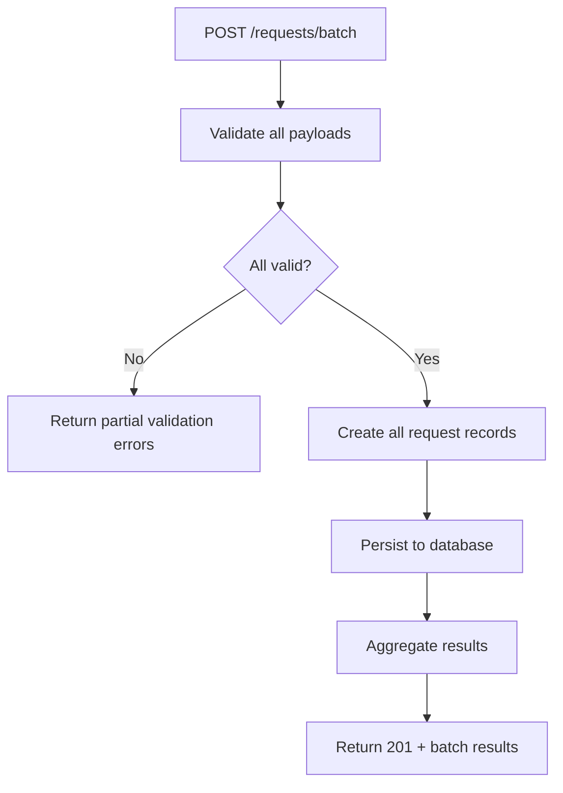
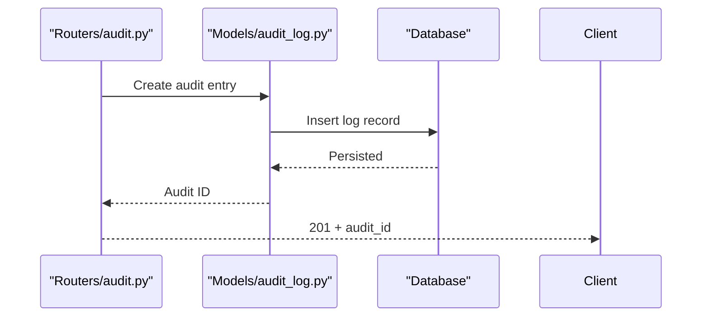
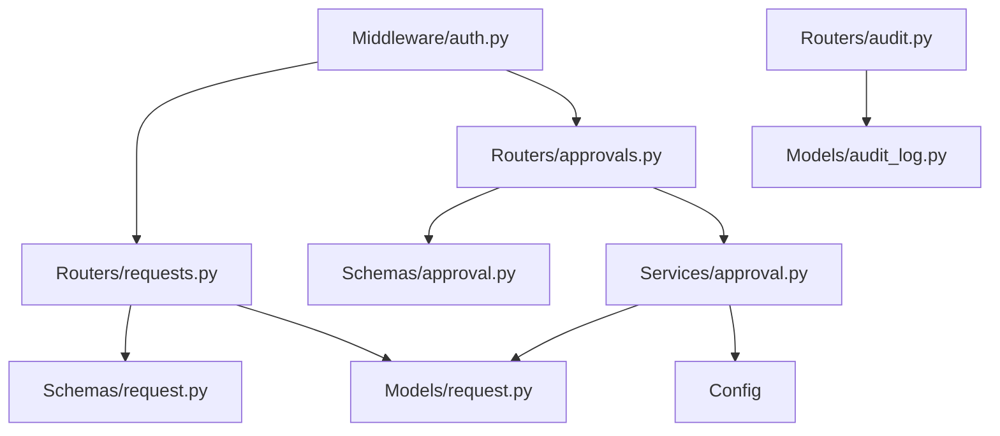

# Request Workflow API

<cite>
**Referenced Files in This Document**
- [backend/app/main.py](file://backend/app/main.py)
- [backend/app/routers/requests.py](file://backend/app/routers/requests.py)
- [backend/app/routers/approvals.py](file://backend/app/routers/approvals.py)
- [backend/app/schemas/request.py](file://backend/app/schemas/request.py)
- [backend/app/schemas/approval.py](file://backend/app/schemas/approval.py)
- [backend/app/models/request.py](file://backend/app/models/request.py)
- [backend/app/services/approval.py](file://backend/app/services/approval.py)
- [backend/app/middleware/auth.py](file://backend/app/middleware/auth.py)
- [backend/app/config.py](file://backend/app/config.py)
- [backend/app/database.py](file://backend/app/database.py)
- [backend/app/models/audit_log.py](file://backend/app/models/audit_log.py)
- [backend/app/routers/audit.py](file://backend/app/routers/audit.py)
</cite>

## Table of Contents
1. [Introduction](#introduction)
2. [Project Structure](#project-structure)
3. [Core Components](#core-components)
4. [Architecture Overview](#architecture-overview)
5. [Detailed Component Analysis](#detailed-component-analysis)
6. [Dependency Analysis](#dependency-analysis)
7. [Performance Considerations](#performance-considerations)
8. [Troubleshooting Guide](#troubleshooting-guide)
9. [Conclusion](#conclusion)

## Introduction
This document provides comprehensive API documentation for the resource request workflow endpoints. It covers the complete lifecycle from submission to completion, including request creation, status tracking, approval routing, and fulfillment processes. It also details request schemas, state transitions, configuration options, examples of submission patterns, polling, webhook notifications, batch processing, error handling, retry mechanisms, and audit trail integration.

## Project Structure
The backend implements a FastAPI application with modular routers, Pydantic schemas, SQLAlchemy models, and service layers. The request workflow spans multiple modules:
- Routers expose HTTP endpoints for requests and approvals.
- Schemas define request and approval payloads.
- Models represent persistent entities such as requests and audit logs.
- Services encapsulate business logic, including approval workflows and external integrations.
- Middleware handles authentication and authorization.
- Configuration and database modules manage settings and persistence.

**Diagram sources**
- [backend/app/main.py](file://backend/app/main.py)
- [backend/app/routers/requests.py](file://backend/app/routers/requests.py)
- [backend/app/routers/approvals.py](file://backend/app/routers/approvals.py)
- [backend/app/schemas/request.py](file://backend/app/schemas/request.py)
- [backend/app/schemas/approval.py](file://backend/app/schemas/approval.py)
- [backend/app/models/request.py](file://backend/app/models/request.py)
- [backend/app/services/approval.py](file://backend/app/services/approval.py)
- [backend/app/middleware/auth.py](file://backend/app/middleware/auth.py)
- [backend/app/config.py](file://backend/app/config.py)
- [backend/app/database.py](file://backend/app/database.py)
- [backend/app/models/audit_log.py](file://backend/app/models/audit_log.py)
- [backend/app/routers/audit.py](file://backend/app/routers/audit.py)

**Section sources**
- [backend/app/main.py](file://backend/app/main.py)
- [backend/app/config.py](file://backend/app/config.py)
- [backend/app/database.py](file://backend/app/database.py)

## Core Components
- Request Lifecycle Endpoints: Create, retrieve, update, cancel, and list requests.
- Approval Routing Endpoints: Submit decisions, route to approvers, and track approval states.
- Schemas: Strict validation for request and approval payloads.
- Models: Persistent representation of requests and audit logs.
- Services: Business logic for approvals and workflow orchestration.
- Middleware: Authentication and authorization enforcement.
- Audit Trail: Logging of significant events across the workflow.

Key responsibilities:
- Routers handle HTTP methods, parameter parsing, and response formatting.
- Schemas enforce input/output contracts.
- Models map to database tables and relationships.
- Services implement workflow rules, state transitions, and external calls.
- Middleware ensures secure access.
- Audit module records compliance-relevant actions.

**Section sources**
- [backend/app/routers/requests.py](file://backend/app/routers/requests.py)
- [backend/app/routers/approvals.py](file://backend/app/routers/approvals.py)
- [backend/app/schemas/request.py](file://backend/app/schemas/request.py)
- [backend/app/schemas/approval.py](file://backend/app/schemas/approval.py)
- [backend/app/models/request.py](file://backend/app/models/request.py)
- [backend/app/services/approval.py](file://backend/app/services/approval.py)
- [backend/app/middleware/auth.py](file://backend/app/middleware/auth.py)
- [backend/app/models/audit_log.py](file://backend/app/models/audit_log.py)
- [backend/app/routers/audit.py](file://backend/app/routers/audit.py)

## Architecture Overview
The request workflow follows a layered architecture:
- Presentation layer: FastAPI routers expose REST endpoints.
- Validation layer: Pydantic schemas validate inputs and outputs.
- Domain layer: Services implement workflow logic and state transitions.
- Persistence layer: SQLAlchemy models interact with the database.
- Cross-cutting concerns: Authentication middleware and audit logging.

**Diagram sources**
- [backend/app/routers/requests.py](file://backend/app/routers/requests.py)
- [backend/app/routers/approvals.py](file://backend/app/routers/approvals.py)
- [backend/app/services/approval.py](file://backend/app/services/approval.py)
- [backend/app/models/request.py](file://backend/app/models/request.py)
- [backend/app/models/audit_log.py](file://backend/app/models/audit_log.py)
- [backend/app/middleware/auth.py](file://backend/app/middleware/auth.py)

## Detailed Component Analysis

### Request Creation and Submission
- Endpoint: POST /requests
- Purpose: Submit a new resource request.
- Input schema: Defined by request schema with fields for resource type, parameters, and metadata.
- Behavior: Validates payload, creates a pending request record, and returns the created request identifier.
- Error handling: Returns validation errors and conflict responses when applicable.

**Diagram sources**
- [backend/app/routers/requests.py](file://backend/app/routers/requests.py)
- [backend/app/schemas/request.py](file://backend/app/schemas/request.py)
- [backend/app/models/request.py](file://backend/app/models/request.py)

**Section sources**
- [backend/app/routers/requests.py](file://backend/app/routers/requests.py)
- [backend/app/schemas/request.py](file://backend/app/schemas/request.py)
- [backend/app/models/request.py](file://backend/app/models/request.py)

### Status Tracking and Polling
- Endpoint: GET /requests/{id}
- Purpose: Retrieve current request status and details.
- Behavior: Fetches request record, includes current state, timestamps, and any associated notes or artifacts.
- Polling pattern: Clients can poll this endpoint at intervals to track progress until completion.

**Diagram sources**
- [backend/app/routers/requests.py](file://backend/app/routers/requests.py)
- [backend/app/models/request.py](file://backend/app/models/request.py)

**Section sources**
- [backend/app/routers/requests.py](file://backend/app/routers/requests.py)
- [backend/app/models/request.py](file://backend/app/models/request.py)

### Approval Routing and Decisions
- Endpoint: POST /approvals/{id}/decide
- Purpose: Submit an approval decision for a specific request.
- Input schema: Defined by approval schema with fields for decision, rationale, and approver identity.
- Behavior: Validates decision, updates request state, routes to next approver if needed, and records audit events.

**Diagram sources**
- [backend/app/schemas/approval.py](file://backend/app/schemas/approval.py)
- [backend/app/models/request.py](file://backend/app/models/request.py)
- [backend/app/services/approval.py](file://backend/app/services/approval.py)

**Section sources**
- [backend/app/routers/approvals.py](file://backend/app/routers/approvals.py)
- [backend/app/schemas/approval.py](file://backend/app/schemas/approval.py)
- [backend/app/services/approval.py](file://backend/app/services/approval.py)
- [backend/app/models/request.py](file://backend/app/models/request.py)

### Fulfillment Processes
- Purpose: Transition requests to fulfilled or failed states based on approval outcomes and external provisioning results.
- Behavior: Updates request status, records fulfillment artifacts, and triggers audit entries.
- Integration points: May call external services for resource provisioning and report back status changes.

**Diagram sources**
- [backend/app/services/approval.py](file://backend/app/services/approval.py)
- [backend/app/models/request.py](file://backend/app/models/request.py)

**Section sources**
- [backend/app/services/approval.py](file://backend/app/services/approval.py)
- [backend/app/models/request.py](file://backend/app/models/request.py)

### Webhook Notifications
- Purpose: Notify clients of request status changes via webhooks.
- Behavior: Emits webhook events upon key state transitions (created, approved, fulfilled, failed).
- Configuration: Webhook URLs and retry policies are managed via configuration.

**Diagram sources**
- [backend/app/services/approval.py](file://backend/app/services/approval.py)
- [backend/app/config.py](file://backend/app/config.py)

**Section sources**
- [backend/app/services/approval.py](file://backend/app/services/approval.py)
- [backend/app/config.py](file://backend/app/config.py)

### Batch Request Processing
- Purpose: Submit multiple requests in a single operation.
- Behavior: Validates each payload, creates records, and returns aggregated results with per-request statuses.
- Error handling: Partial failures are reported without aborting the entire batch.

**Diagram sources**
- [backend/app/routers/requests.py](file://backend/app/routers/requests.py)
- [backend/app/schemas/request.py](file://backend/app/schemas/request.py)
- [backend/app/models/request.py](file://backend/app/models/request.py)

**Section sources**
- [backend/app/routers/requests.py](file://backend/app/routers/requests.py)
- [backend/app/schemas/request.py](file://backend/app/schemas/request.py)
- [backend/app/models/request.py](file://backend/app/models/request.py)

### Audit Trail Integration
- Purpose: Record significant events for compliance and debugging.
- Behavior: Logs creation, approval decisions, state transitions, and fulfillment outcomes.
- Access: Audit endpoints allow querying historical events.

**Diagram sources**
- [backend/app/routers/audit.py](file://backend/app/routers/audit.py)
- [backend/app/models/audit_log.py](file://backend/app/models/audit_log.py)

**Section sources**
- [backend/app/routers/audit.py](file://backend/app/routers/audit.py)
- [backend/app/models/audit_log.py](file://backend/app/models/audit_log.py)

## Dependency Analysis
The request workflow depends on several modules:
- Routers depend on schemas for validation and models for persistence.
- Services encapsulate business logic and coordinate between models and external systems.
- Middleware enforces authentication across endpoints.
- Configuration drives behavior such as webhook settings and retry policies.

**Diagram sources**
- [backend/app/routers/requests.py](file://backend/app/routers/requests.py)
- [backend/app/routers/approvals.py](file://backend/app/routers/approvals.py)
- [backend/app/schemas/request.py](file://backend/app/schemas/request.py)
- [backend/app/schemas/approval.py](file://backend/app/schemas/approval.py)
- [backend/app/models/request.py](file://backend/app/models/request.py)
- [backend/app/services/approval.py](file://backend/app/services/approval.py)
- [backend/app/middleware/auth.py](file://backend/app/middleware/auth.py)
- [backend/app/config.py](file://backend/app/config.py)
- [backend/app/routers/audit.py](file://backend/app/routers/audit.py)
- [backend/app/models/audit_log.py](file://backend/app/models/audit_log.py)

**Section sources**
- [backend/app/routers/requests.py](file://backend/app/routers/requests.py)
- [backend/app/routers/approvals.py](file://backend/app/routers/approvals.py)
- [backend/app/schemas/request.py](file://backend/app/schemas/request.py)
- [backend/app/schemas/approval.py](file://backend/app/schemas/approval.py)
- [backend/app/models/request.py](file://backend/app/models/request.py)
- [backend/app/services/approval.py](file://backend/app/services/approval.py)
- [backend/app/middleware/auth.py](file://backend/app/middleware/auth.py)
- [backend/app/config.py](file://backend/app/config.py)
- [backend/app/routers/audit.py](file://backend/app/routers/audit.py)
- [backend/app/models/audit_log.py](file://backend/app/models/audit_log.py)

## Performance Considerations
- Use pagination for listing requests to avoid large payloads.
- Implement caching for frequently accessed request statuses where appropriate.
- Optimize database queries with proper indexing on status and timestamps.
- Avoid blocking operations in request handlers; offload long-running tasks to background workers.
- Configure webhook retries with exponential backoff to handle transient failures.

[No sources needed since this section provides general guidance]

## Troubleshooting Guide
Common issues and resolutions:
- Validation errors: Ensure payloads conform to schema definitions.
- Authentication failures: Verify tokens and permissions.
- Approval routing loops: Check configuration and approver assignments.
- Webhook delivery failures: Inspect client endpoints and retry policies.
- Audit gaps: Confirm audit logging is enabled and accessible.

**Section sources**
- [backend/app/middleware/auth.py](file://backend/app/middleware/auth.py)
- [backend/app/services/approval.py](file://backend/app/services/approval.py)
- [backend/app/routers/audit.py](file://backend/app/routers/audit.py)

## Conclusion
The Request Workflow API provides a robust framework for managing resource requests through well-defined endpoints, schemas, and services. It supports end-to-end lifecycle management, including creation, approval routing, fulfillment, and auditing. By following the documented patterns for submission, polling, webhooks, and batch processing, clients can integrate seamlessly while maintaining reliability and compliance.