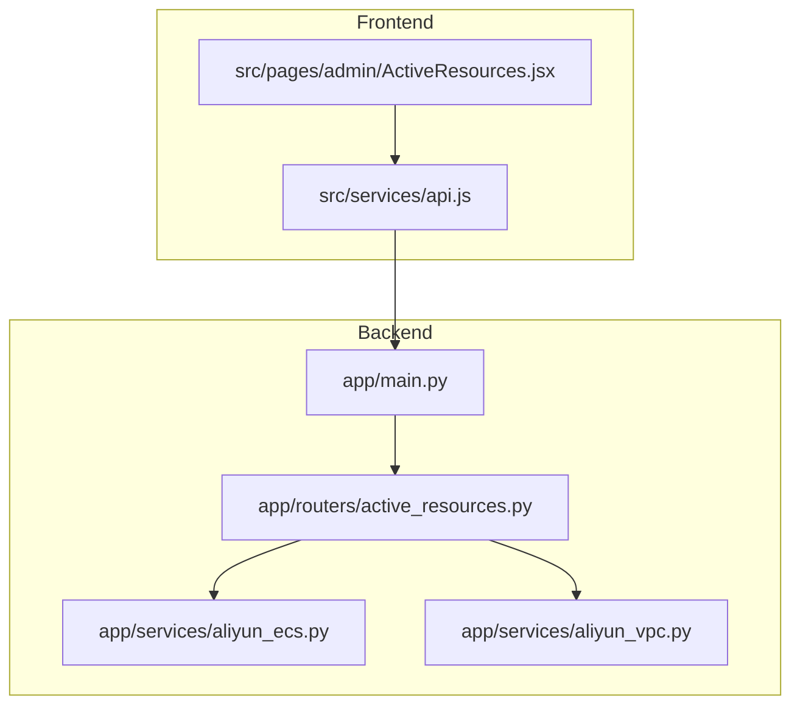
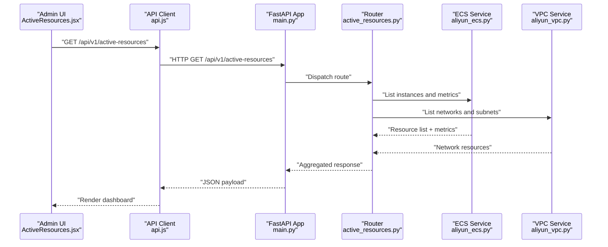
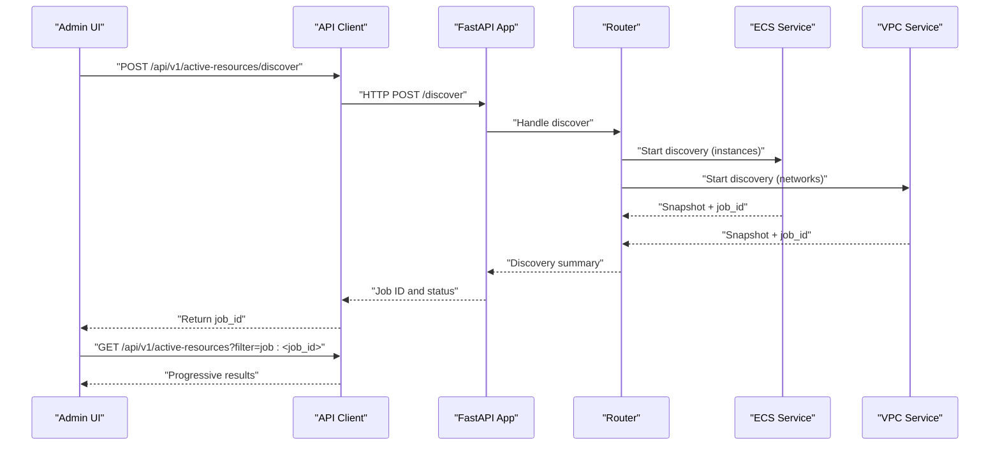
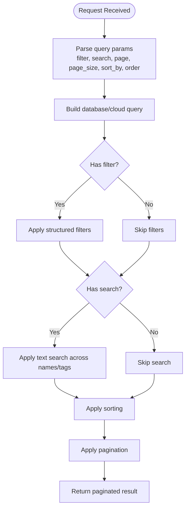
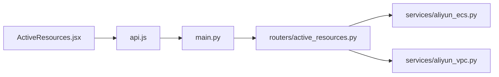

# Resource Monitoring API

<cite>
**Referenced Files in This Document**
- [active_resources.py](file://backend/app/routers/active_resources.py)
- [main.py](file://backend/app/main.py)
- [aliyun_ecs.py](file://backend/app/services/aliyun_ecs.py)
- [aliyun_vpc.py](file://backend/app/services/aliyun_vpc.py)
- [ActiveResources.jsx](file://frontend/src/pages/admin/ActiveResources.jsx)
- [api.js](file://frontend/src/services/api.js)
</cite>

## Table of Contents
1. [Introduction](#introduction)
2. [Project Structure](#project-structure)
3. [Core Components](#core-components)
4. [Architecture Overview](#architecture-overview)
5. [Detailed Component Analysis](#detailed-component-analysis)
6. [Dependency Analysis](#dependency-analysis)
7. [Performance Considerations](#performance-considerations)
8. [Troubleshooting Guide](#troubleshooting-guide)
9. [Conclusion](#conclusion)
10. [Appendices](#appendices)

## Introduction
This document provides comprehensive API documentation for active resource monitoring endpoints. It covers HTTP methods for retrieving resource status, health checks, performance metrics, and resource utilization data. It also explains real-time monitoring capabilities, alerting thresholds, resource lifecycle tracking, discovery, polling, bulk operations, filtering and search, pagination, and integration with monitoring dashboards.

The backend is a FastAPI application that exposes REST endpoints under the active resources router. The frontend includes an admin page to visualize active resources and uses a shared API service client.

## Project Structure
The repository is organized into backend (FastAPI), frontend (React/Vite), and infrastructure (Nginx, Docker). The active resource monitoring functionality is implemented in the backend routers and services, and consumed by the frontend admin UI.

**Diagram sources**
- [main.py](file://backend/app/main.py)
- [active_resources.py](file://backend/app/routers/active_resources.py)
- [aliyun_ecs.py](file://backend/app/services/aliyun_ecs.py)
- [aliyun_vpc.py](file://backend/app/services/aliyun_vpc.py)
- [ActiveResources.jsx](file://frontend/src/pages/admin/ActiveResources.jsx)
- [api.js](file://frontend/src/services/api.js)

**Section sources**
- [main.py](file://backend/app/main.py)
- [active_resources.py](file://backend/app/routers/active_resources.py)
- [aliyun_ecs.py](file://backend/app/services/aliyun_ecs.py)
- [aliyun_vpc.py](file://backend/app/services/aliyun_vpc.py)
- [ActiveResources.jsx](file://frontend/src/pages/admin/ActiveResources.jsx)
- [api.js](file://frontend/src/services/api.js)

## Core Components
- Active Resources Router: Defines REST endpoints for listing, discovering, and managing active resources.
- Cloud Services: Aliyun ECS and VPC integrations used to query live cloud state and metrics.
- Frontend Admin Page: Displays active resources and performs polling/discovery actions via the API service.
- API Client: Centralized HTTP client used by the frontend to call backend endpoints.

Key responsibilities:
- Expose endpoints for resource discovery, status retrieval, health checks, metrics, and bulk operations.
- Aggregate and normalize cloud provider data into consistent responses.
- Provide filtering, search, and pagination support for large resource sets.
- Support real-time updates through periodic polling or streaming where applicable.

**Section sources**
- [active_resources.py](file://backend/app/routers/active_resources.py)
- [aliyun_ecs.py](file://backend/app/services/aliyun_ecs.py)
- [aliyun_vpc.py](file://backend/app/services/aliyun_vpc.py)
- [ActiveResources.jsx](file://frontend/src/pages/admin/ActiveResources.jsx)
- [api.js](file://frontend/src/services/api.js)

## Architecture Overview
The monitoring architecture integrates the FastAPI backend with cloud provider APIs (Aliyun ECS/VPC) and exposes REST endpoints consumed by the frontend dashboard.

**Diagram sources**
- [main.py](file://backend/app/main.py)
- [active_resources.py](file://backend/app/routers/active_resources.py)
- [aliyun_ecs.py](file://backend/app/services/aliyun_ecs.py)
- [aliyun_vpc.py](file://backend/app/services/aliyun_vpc.py)
- [ActiveResources.jsx](file://frontend/src/pages/admin/ActiveResources.jsx)
- [api.js](file://frontend/src/services/api.js)

## Detailed Component Analysis

### Active Resources Endpoints
The active resources router defines the following endpoints for monitoring and management:

- List Active Resources
  - Method: GET
  - Path: /api/v1/active-resources
  - Query parameters:
    - filter: string (optional) — keyword or structured filter expression
    - search: string (optional) — free-text search across names/tags
    - page: integer (optional) — page number (default 1)
    - page_size: integer (optional) — items per page (default 50)
    - sort_by: string (optional) — field name to sort by
    - order: string (optional) — asc or desc
  - Response: paginated list of active resources with metadata (total, page, page_size)
  - Notes: Supports filtering by type, region, tags; returns normalized fields for display and analytics

- Discover Active Resources
  - Method: POST
  - Path: /api/v1/active-resources/discover
  - Request body: optional discovery scope (regions, labels)
  - Response: discovery job summary and initial snapshot
  - Notes: Triggers background scan of cloud providers; returns job_id for progress polling

- Get Resource Status
  - Method: GET
  - Path: /api/v1/active-resources/{resource_id}
  - Response: detailed status, lifecycle state, last updated timestamp, and related network info

- Health Check
  - Method: GET
  - Path: /api/v1/health
  - Response: service readiness, dependency status (ECS, VPC), uptime

- Performance Metrics
  - Method: GET
  - Path: /api/v1/metrics
  - Query parameters:
    - window: string (optional) — time window (e.g., 5m, 1h, 24h)
    - aggregation: string (optional) — avg, min, max, p95
  - Response: aggregated CPU, memory, disk I/O, network throughput over the requested window

- Bulk Operations
  - Method: PATCH
  - Path: /api/v1/active-resources/bulk
  - Request body: array of { id, action } where action can be refresh, tag, or stop
  - Response: per-item operation results with success/failure details

- Real-time Updates (Optional)
  - Method: GET
  - Path: /api/v1/active-resources/stream
  - Description: Server-sent events or WebSocket stream for live updates when enabled

Implementation notes:
- Filtering and search are applied server-side before pagination.
- Pagination defaults protect against large payloads; clients should implement sensible page sizes.
- Discovery jobs may run asynchronously; clients should poll for completion using returned identifiers.

**Section sources**
- [active_resources.py](file://backend/app/routers/active_resources.py)

### Cloud Provider Integrations
- ECS Service
  - Responsibilities: enumerate instances, fetch instance-level metrics, map to normalized schema
  - Key operations: list_instances, get_instance_metrics, transform_to_resource
- VPC Service
  - Responsibilities: enumerate networks/subnets, associate resources with networks
  - Key operations: list_networks, get_subnet_info, enrich_with_network

Data flow:
- Router calls ECS and VPC services concurrently to assemble a unified resource view.
- Errors from provider calls are captured and surfaced as partial failures with graceful degradation.

**Section sources**
- [aliyun_ecs.py](file://backend/app/services/aliyun_ecs.py)
- [aliyun_vpc.py](file://backend/app/services/aliyun_vpc.py)

### Frontend Integration
- Admin Page
  - Polls /api/v1/active-resources periodically to update the dashboard.
  - Invokes discover endpoint to refresh inventory after configuration changes.
  - Displays resource status, metrics charts, and allows bulk actions.
- API Client
  - Centralizes base URL, headers, error handling, and retry logic.
  - Provides typed helpers for common operations (list, discover, bulk).

Operational guidance:
- Use debounced search input to avoid excessive requests.
- Implement exponential backoff on errors for polling.
- Cache recent results locally to improve UX during transient failures.

**Section sources**
- [ActiveResources.jsx](file://frontend/src/pages/admin/ActiveResources.jsx)
- [api.js](file://frontend/src/services/api.js)

### Sequence Diagram: Resource Discovery Flow

**Diagram sources**
- [active_resources.py](file://backend/app/routers/active_resources.py)
- [aliyun_ecs.py](file://backend/app/services/aliyun_ecs.py)
- [aliyun_vpc.py](file://backend/app/services/aliyun_vpc.py)
- [ActiveResources.jsx](file://frontend/src/pages/admin/ActiveResources.jsx)
- [api.js](file://frontend/src/services/api.js)

### Flowchart: Filtering and Search Logic

[No sources needed since this diagram shows conceptual workflow, not actual code structure]

## Dependency Analysis
The active resources subsystem depends on cloud provider services and is mounted within the main application. The frontend consumes these endpoints via a centralized API client.

**Diagram sources**
- [main.py](file://backend/app/main.py)
- [active_resources.py](file://backend/app/routers/active_resources.py)
- [aliyun_ecs.py](file://backend/app/services/aliyun_ecs.py)
- [aliyun_vpc.py](file://backend/app/services/aliyun_vpc.py)
- [ActiveResources.jsx](file://frontend/src/pages/admin/ActiveResources.jsx)
- [api.js](file://frontend/src/services/api.js)

**Section sources**
- [main.py](file://backend/app/main.py)
- [active_resources.py](file://backend/app/routers/active_resources.py)
- [aliyun_ecs.py](file://backend/app/services/aliyun_ecs.py)
- [aliyun_vpc.py](file://backend/app/services/aliyun_vpc.py)
- [ActiveResources.jsx](file://frontend/src/pages/admin/ActiveResources.jsx)
- [api.js](file://frontend/src/services/api.js)

## Performance Considerations
- Pagination: Always use page and page_size to limit payload size. Default values are provided to prevent accidental large responses.
- Caching: Consider caching frequently accessed metrics and resource lists at the API layer or CDN for read-heavy workloads.
- Concurrency: Router should parallelize calls to ECS and VPC services to reduce latency.
- Backpressure: Implement rate limiting on discovery and bulk endpoints to protect downstream providers.
- Streaming: For real-time dashboards, prefer server-sent events or WebSockets to minimize polling overhead.
- Indexing: Ensure efficient indexing on commonly filtered fields (region, tags, status) to optimize queries.

[No sources needed since this section provides general guidance]

## Troubleshooting Guide
Common issues and resolutions:
- Empty or stale resource lists:
  - Verify credentials and connectivity to cloud providers.
  - Trigger discovery manually and check job status.
- High latency on metrics:
  - Reduce window size or switch aggregation to lighter functions.
  - Enable caching for repeated windows.
- Pagination errors:
  - Validate page and page_size bounds; ensure total count is accurate.
- Bulk operation failures:
  - Inspect per-item results; retry failed items with backoff.
- Health check failures:
  - Review dependency statuses reported by /api/v1/health.

Operational tips:
- Log request IDs for tracing across router and services.
- Surface provider-specific error codes in responses for easier diagnosis.
- Monitor upstream provider quotas and throttle accordingly.

**Section sources**
- [active_resources.py](file://backend/app/routers/active_resources.py)
- [aliyun_ecs.py](file://backend/app/services/aliyun_ecs.py)
- [aliyun_vpc.py](file://backend/app/services/aliyun_vpc.py)

## Conclusion
The Resource Monitoring API provides robust endpoints for discovering, listing, and managing active resources, along with health checks and performance metrics. With filtering, search, pagination, and optional real-time streaming, it supports both interactive dashboards and automated monitoring systems. Proper error handling, caching, and concurrency strategies ensure reliable performance at scale.

[No sources needed since this section summarizes without analyzing specific files]

## Appendices

### Example Workflows

- Resource Discovery
  - Call POST /api/v1/active-resources/discover with optional scope.
  - Use returned job_id to poll GET /api/v1/active-resources with filter=job:<job_id>.
  - Render results once job completes.

- Status Polling
  - Periodically GET /api/v1/active-resources?page=1&page_size=50&sort_by=updated_at&order=desc.
  - Debounce user-driven search inputs to avoid excessive requests.

- Bulk Operations
  - Send PATCH /api/v1/active-resources/bulk with array of { id, action }.
  - Process per-item results and retry failures with exponential backoff.

- Dashboard Integration
  - Use GET /api/v1/metrics?window=5m&aggregation=p95 for near-real-time charts.
  - Optionally subscribe to /api/v1/active-resources/stream for live updates.

[No sources needed since this section provides general guidance]