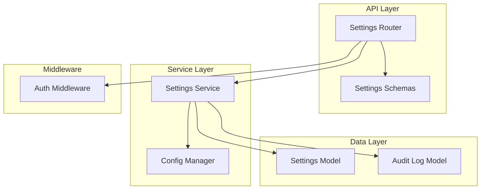
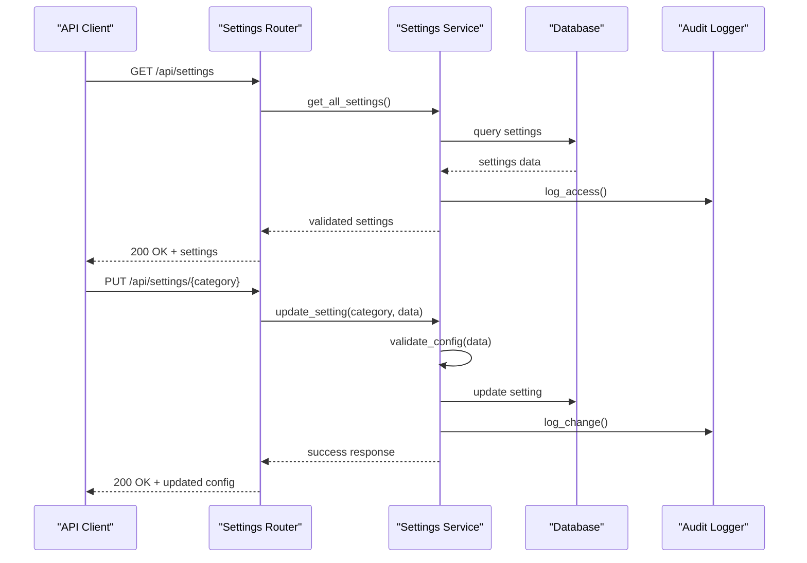
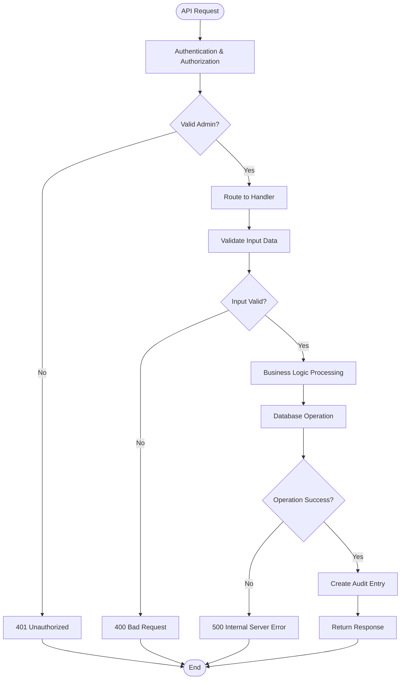
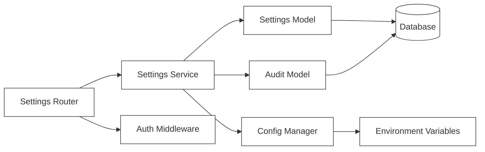
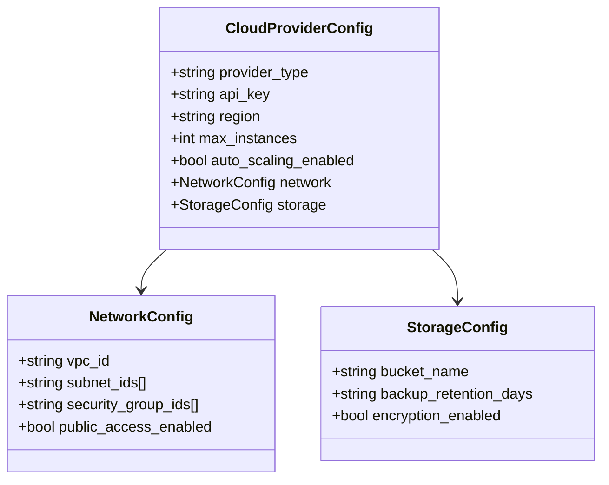

# System Settings API

<cite>
**Referenced Files in This Document**
- [settings.py](file://backend/app/routers/settings.py)
- [settings.py](file://backend/app/schemas/settings.py)
- [settings_service.py](file://backend/app/services/settings_service.py)
- [settings.py](file://backend/app/models/settings.py)
- [main.py](file://backend/app/main.py)
- [config.py](file://backend/app/config.py)
- [audit_log.py](file://backend/app/models/audit_log.py)
- [auth.py](file://backend/app/middleware/auth.py)
</cite>

## Table of Contents
1. [Introduction](#introduction)
2. [Project Structure](#project-structure)
3. [Core Components](#core-components)
4. [Architecture Overview](#architecture-overview)
5. [Detailed Component Analysis](#detailed-component-analysis)
6. [Dependency Analysis](#dependency-analysis)
7. [Performance Considerations](#performance-considerations)
8. [Troubleshooting Guide](#troubleshooting-guide)
9. [Security Considerations](#security-considerations)
10. [Configuration Management](#configuration-management)
11. [Backup and Restore Operations](#backup-and-restore-operations)
12. [Migration Procedures](#migration-procedures)
13. [Conclusion](#conclusion)

## Introduction

The System Settings API provides comprehensive management capabilities for application configuration across multiple domains including cloud provider settings, approval workflow configurations, and system preferences. This RESTful API enables administrators to retrieve, update, validate, and manage application settings with support for environment-specific configurations, hot-reload capabilities, and comprehensive audit logging.

The API is built using FastAPI and follows modern REST principles with JSON request/response formats. It includes robust validation, security middleware, and comprehensive error handling to ensure reliable configuration management.

## Project Structure

The system settings functionality is organized following a clean architecture pattern with clear separation of concerns:

**Diagram sources**
- [settings.py](file://backend/app/routers/settings.py)
- [settings_service.py](file://backend/app/services/settings_service.py)
- [settings.py](file://backend/app/models/settings.py)

**Section sources**
- [settings.py](file://backend/app/routers/settings.py)
- [settings_service.py](file://backend/app/services/settings_service.py)
- [settings.py](file://backend/app/models/settings.py)

## Core Components

### Settings Router
The router defines all HTTP endpoints for system settings management, implementing CRUD operations and specialized configuration actions.

### Settings Service
The service layer handles business logic for settings operations, including validation, transformation, and persistence operations.

### Settings Models
Database models define the schema for storing settings data with proper relationships and constraints.

### Settings Schemas
Pydantic schemas provide request/response validation and serialization for API endpoints.

**Section sources**
- [settings.py](file://backend/app/routers/settings.py)
- [settings_service.py](file://backend/app/services/settings_service.py)
- [settings.py](file://backend/app/models/settings.py)
- [settings.py](file://backend/app/schemas/settings.py)

## Architecture Overview

The System Settings API follows a layered architecture pattern with clear separation between presentation, business logic, and data access layers.

**Diagram sources**
- [settings.py](file://backend/app/routers/settings.py)
- [settings_service.py](file://backend/app/services/settings_service.py)
- [audit_log.py](file://backend/app/models/audit_log.py)

## Detailed Component Analysis

### Settings Endpoints

#### Get All Settings
Retrieves all application settings with optional filtering by category.

**HTTP Method:** `GET`
**Endpoint:** `/api/settings`
**Authentication:** Required (Admin role)
**Response Format:** JSON object containing categorized settings

#### Get Setting by Category
Retrieves settings for a specific configuration category.

**HTTP Method:** `GET`
**Endpoint:** `/api/settings/{category}`
**Parameters:** 
- `category`: String identifier for the settings category
**Response Format:** JSON object with category-specific settings

#### Update Setting
Updates a specific setting value within a category.

**HTTP Method:** `PUT`
**Endpoint:** `/api/settings/{category}/{key}`
**Request Body:** New setting value
**Validation:** Type checking and business rule validation
**Response Format:** Updated setting with metadata

#### Bulk Update Settings
Updates multiple settings within a category atomically.

**HTTP Method:** `POST`
**Endpoint:** `/api/settings/{category}/bulk`
**Request Body:** Array of key-value pairs
**Transaction:** All updates succeed or fail together

#### Validate Configuration
Validates current configuration without applying changes.

**HTTP Method:** `POST`
**Endpoint:** `/api/settings/validate`
**Request Body:** Configuration to validate
**Response Format:** Validation results with error details

#### Reset to Default
Resets settings to their default values.

**HTTP Method:** `DELETE`
**Endpoint:** `/api/settings/{category}`
**Confirmation:** Requires admin confirmation
**Audit:** Full audit trail maintained

### Settings Categories

#### Cloud Provider Settings
Configuration for cloud infrastructure providers including credentials, regions, and resource limits.

**Key Properties:**
- Provider credentials and authentication tokens
- Region and availability zone settings
- Resource quotas and limits
- Network configuration parameters

#### Approval Workflow Settings
Controls the approval process for resource requests and administrative actions.

**Key Properties:**
- Approval chain definitions
- Role-based permissions
- Notification templates
- Escalation rules

#### System Preferences
Global application behavior and user interface settings.

**Key Properties:**
- UI theme and localization
- Feature flags and toggles
- Performance tuning parameters
- Logging and monitoring settings

### Data Flow Diagram

**Diagram sources**
- [settings.py](file://backend/app/routers/settings.py)
- [settings_service.py](file://backend/app/services/settings_service.py)
- [auth.py](file://backend/app/middleware/auth.py)

**Section sources**
- [settings.py](file://backend/app/routers/settings.py)
- [settings_service.py](file://backend/app/services/settings_service.py)
- [settings.py](file://backend/app/schemas/settings.py)

## Dependency Analysis

The settings management system has well-defined dependencies between components:

**Diagram sources**
- [settings.py](file://backend/app/routers/settings.py)
- [settings_service.py](file://backend/app/services/settings_service.py)
- [settings.py](file://backend/app/models/settings.py)
- [auth.py](file://backend/app/middleware/auth.py)

**Section sources**
- [settings.py](file://backend/app/routers/settings.py)
- [settings_service.py](file://backend/app/services/settings_service.py)
- [settings.py](file://backend/app/models/settings.py)

## Performance Considerations

### Caching Strategy
- Settings are cached in memory with configurable TTL
- Cache invalidation on settings updates
- Redis integration for distributed caching in multi-instance deployments

### Database Optimization
- Indexed queries on category and key fields
- Batch operations for bulk updates
- Connection pooling for database efficiency

### Hot Reload Implementation
- File watcher for configuration file changes
- Graceful reload without service interruption
- Rollback capability on failed reloads

## Troubleshooting Guide

### Common Issues

#### Authentication Failures
- Verify admin role assignment
- Check JWT token validity
- Ensure middleware is properly configured

#### Validation Errors
- Review input data types and formats
- Check business rule constraints
- Examine validation error messages

#### Database Connection Issues
- Verify database connectivity
- Check connection pool settings
- Monitor database performance metrics

### Debugging Tools
- Comprehensive logging at multiple levels
- Request tracing for performance analysis
- Audit log inspection for change tracking

**Section sources**
- [settings_service.py](file://backend/app/services/settings_service.py)
- [audit_log.py](file://backend/app/models/audit_log.py)

## Security Considerations

### Authentication and Authorization
- JWT-based authentication required for all endpoints
- Role-based access control (RBAC) with admin-only permissions
- Session management with secure cookie handling

### Sensitive Data Protection
- Encryption at rest for sensitive configuration values
- Masking of secrets in API responses
- Secure transmission via HTTPS only

### Audit Trail
- Complete audit logging for all configuration changes
- User attribution for all modifications
- Immutable audit records with timestamps

### Input Validation
- Strict type validation for all inputs
- SQL injection prevention through parameterized queries
- XSS protection for user-provided content

**Section sources**
- [auth.py](file://backend/app/middleware/auth.py)
- [audit_log.py](file://backend/app/models/audit_log.py)
- [settings_service.py](file://backend/app/services/settings_service.py)

## Configuration Management

### Environment-Specific Configuration
The system supports different configuration profiles for development, staging, and production environments.

#### Configuration Loading Order
1. Environment variables (highest priority)
2. Configuration files
3. Database defaults
4. Application defaults (lowest priority)

#### Environment Variables
- `APP_ENV`: Current environment (development/staging/production)
- `DB_CONNECTION`: Database connection string
- `SECRET_KEY`: Application encryption key
- `CLOUD_PROVIDER_*`: Cloud provider specific settings

### Configuration Categories

#### Cloud Provider Settings

**Diagram sources**
- [settings.py](file://backend/app/models/settings.py)
- [settings_service.py](file://backend/app/services/settings_service.py)

#### Approval Workflow Settings
- Multi-level approval chains
- Role-based approval permissions
- Email notification templates
- Escalation policies

#### System Preferences
- UI customization options
- Feature flag management
- Performance tuning parameters
- Localization settings

### Validation Rules
Each configuration category has specific validation rules:

- **Type Validation**: Ensures correct data types
- **Format Validation**: Validates format requirements (emails, URLs, etc.)
- **Business Rule Validation**: Enforces domain-specific constraints
- **Cross-field Validation**: Validates relationships between fields

**Section sources**
- [settings.py](file://backend/app/models/settings.py)
- [settings_service.py](file://backend/app/services/settings_service.py)
- [config.py](file://backend/app/config.py)

## Backup and Restore Operations

### Backup Functionality
The system provides comprehensive backup capabilities for all configuration data.

#### Backup Types
- **Full Backup**: Complete system configuration snapshot
- **Incremental Backup**: Changes since last backup
- **Selective Backup**: Specific categories or individual settings

#### Backup Format
- JSON format for human readability
- Compressed archives for storage efficiency
- Encrypted backups for sensitive data

### Restore Operations
- Point-in-time recovery from backups
- Selective restoration of specific settings
- Conflict resolution during restore operations

### Backup Schedule
- Automated scheduled backups
- Manual backup triggers via API
- Backup retention policy management

**Section sources**
- [settings_service.py](file://backend/app/services/settings_service.py)

## Migration Procedures

### Version Management
Configuration schema versioning ensures compatibility across system upgrades.

#### Migration Process
1. **Schema Validation**: Check current configuration version
2. **Compatibility Check**: Verify migration path availability
3. **Backup Creation**: Automatic backup before migration
4. **Schema Migration**: Apply necessary schema changes
5. **Data Migration**: Transform existing data to new format
6. **Validation**: Verify migrated configuration integrity
7. **Rollback Support**: Automatic rollback on failure

#### Migration Scripts
- Versioned migration scripts in Alembic format
- Idempotent migrations that can be safely re-run
- Rollback scripts for each forward migration

### Upgrade Procedures
- Zero-downtime upgrades supported
- Graceful degradation during maintenance windows
- Health check endpoints for upgrade monitoring

**Section sources**
- [settings_service.py](file://backend/app/services/settings_service.py)
- [alembic.ini](file://backend/alembic.ini)

## Conclusion

The System Settings API provides a robust, secure, and scalable solution for managing application configuration across multiple domains. With comprehensive validation, audit logging, and backup capabilities, it ensures reliable configuration management while maintaining security and operational excellence.

The modular architecture allows for easy extension and customization, while the comprehensive documentation and troubleshooting guides enable effective operation and maintenance. The system's support for environment-specific configurations, hot-reload capabilities, and migration procedures makes it suitable for complex deployment scenarios ranging from development to production environments.

Key strengths include:
- **Security**: Comprehensive authentication, authorization, and data protection
- **Reliability**: Robust validation, error handling, and audit trails
- **Flexibility**: Extensible architecture supporting custom configuration categories
- **Operational Excellence**: Backup, restore, and migration capabilities
- **Performance**: Optimized caching and database operations

This API serves as a foundation for enterprise-grade configuration management, providing the tools necessary for safe and efficient system administration.