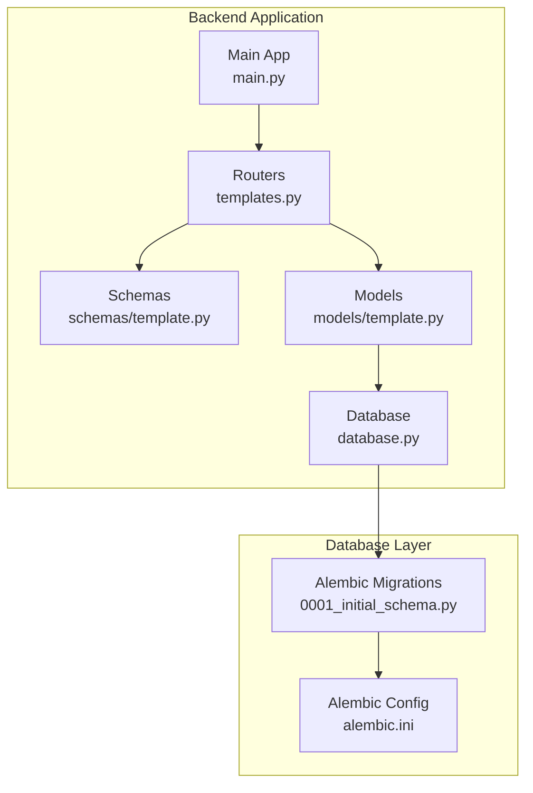
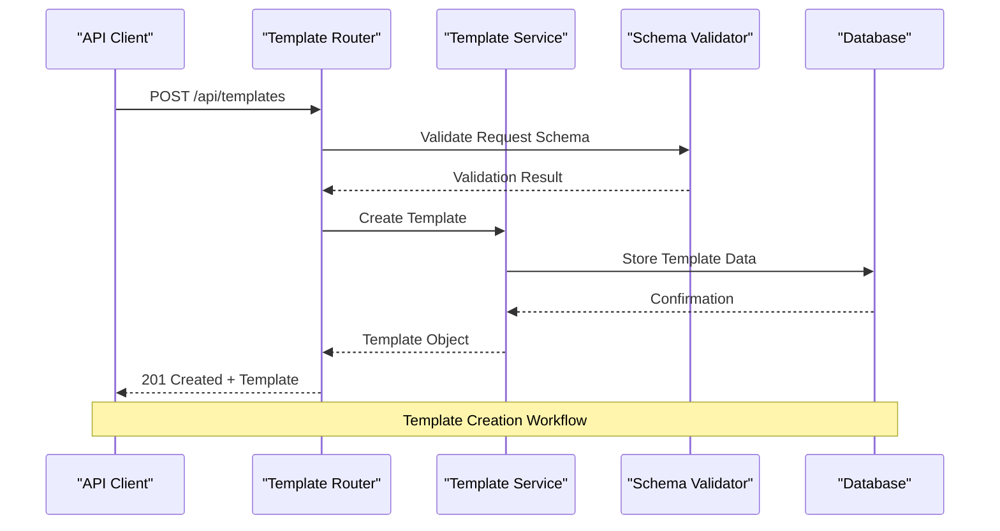
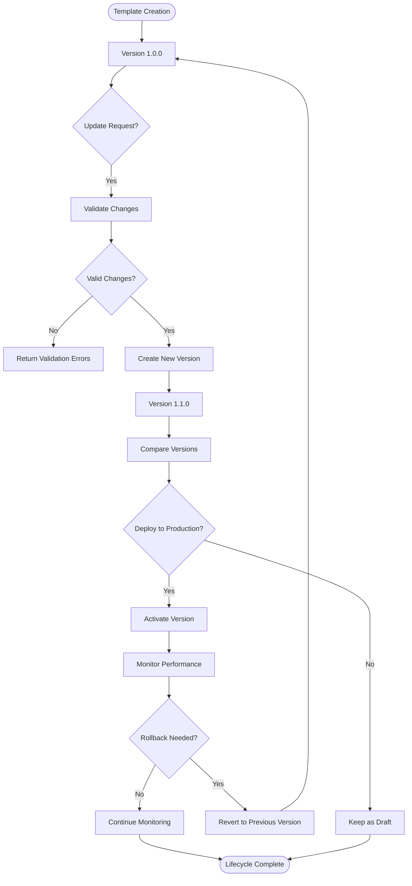
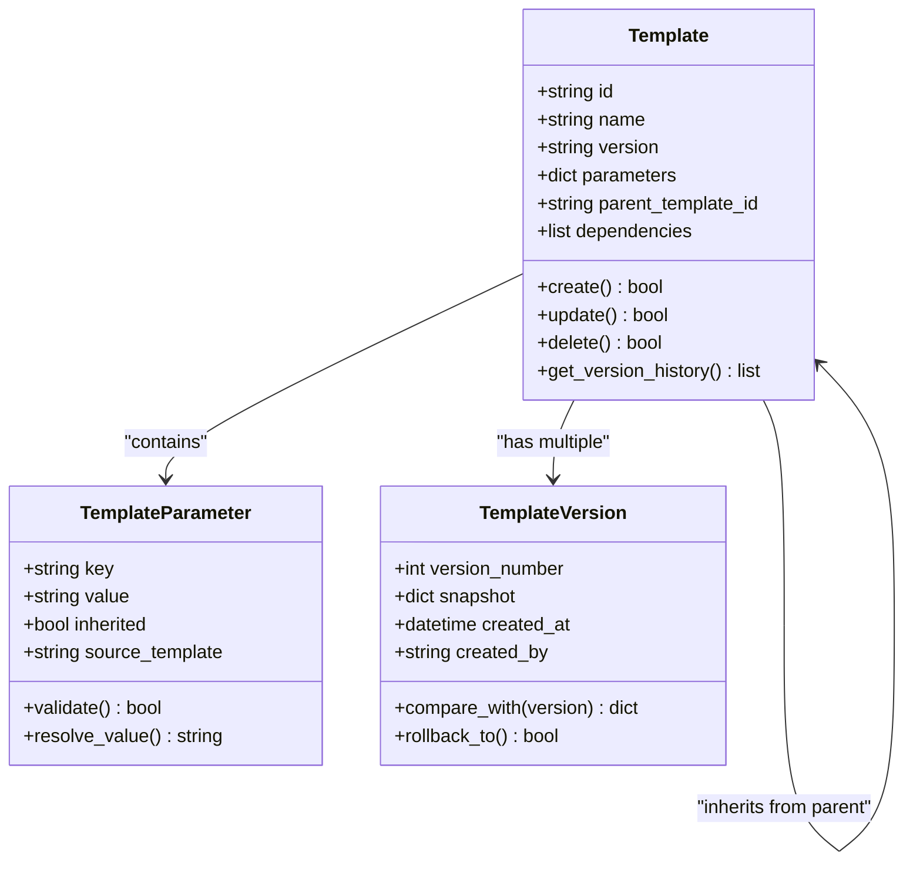
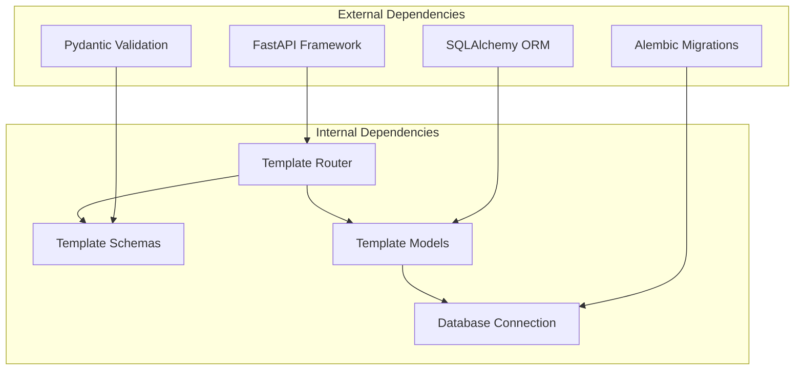

# Template Management API

<cite>
**Referenced Files in This Document**
- [templates.py](file://backend/app/routers/templates.py)
- [template.py](file://backend/app/models/template.py)
- [template.py](file://backend/app/schemas/template.py)
- [main.py](file://backend/app/main.py)
- [database.py](file://backend/app/database.py)
- [alembic.ini](file://backend/alembic.ini)
- [0001_initial_schema.py](file://backend/alembic/versions/0001_initial_schema.py)
</cite>

## Table of Contents
1. [Introduction](#introduction)
2. [Project Structure](#project-structure)
3. [Core Components](#core-components)
4. [Architecture Overview](#architecture-overview)
5. [Detailed Component Analysis](#detailed-component-analysis)
6. [Dependency Analysis](#dependency-analysis)
7. [Performance Considerations](#performance-considerations)
8. [Troubleshooting Guide](#troubleshooting-guide)
9. [Conclusion](#conclusion)
10. [Appendices](#appendices)

## Introduction
This document provides detailed API documentation for template management endpoints, focusing on creating, reading, updating, deleting, and versioning resource templates. It explains schema validation, parameter inheritance, sharing mechanisms, lifecycle management, rollback procedures, dependency management, and testing capabilities. The goal is to help both technical and non-technical users understand how to work with the template system effectively.

## Project Structure
The template management functionality is implemented in the backend application using a FastAPI-based architecture:
- Routers define HTTP endpoints for template operations
- Schemas provide Pydantic models for request/response validation
- Models define database entities and relationships
- Database configuration handles connection and migrations



**Diagram sources**
- [templates.py](file://backend/app/routers/templates.py)
- [template.py](file://backend/app/schemas/template.py)
- [template.py](file://backend/app/models/template.py)
- [main.py](file://backend/app/main.py)
- [database.py](file://backend/app/database.py)
- [0001_initial_schema.py](file://backend/alembic/versions/0001_initial_schema.py)
- [alembic.ini](file://backend/alembic.ini)

**Section sources**
- [main.py](file://backend/app/main.py)
- [templates.py](file://backend/app/routers/templates.py)
- [template.py](file://backend/app/schemas/template.py)
- [template.py](file://backend/app/models/template.py)
- [database.py](file://backend/app/database.py)

## Core Components

### Template Schema Validation
The template system uses Pydantic schemas for comprehensive validation of template data structures. These schemas ensure that all template requests conform to expected formats and contain required fields.

Key validation features include:
- Field type checking and constraints
- Required field validation
- Custom validation rules for template-specific logic
- Nested object validation for complex template structures

### Template Data Model
The template model defines the database structure for storing template information, including:
- Template metadata (name, description, version)
- Template content and parameters
- Version history tracking
- Sharing permissions and access controls
- Dependency relationships between templates

### Template Lifecycle Management
Templates follow a structured lifecycle from creation through deployment to archival:
- Creation with initial validation
- Versioning for change tracking
- Approval workflows for production deployments
- Rollback capabilities for failed deployments
- Archival of deprecated versions

**Section sources**
- [template.py](file://backend/app/schemas/template.py)
- [template.py](file://backend/app/models/template.py)

## Architecture Overview

The template management system follows a layered architecture pattern with clear separation of concerns:



**Diagram sources**
- [templates.py](file://backend/app/routers/templates.py)
- [template.py](file://backend/app/schemas/template.py)
- [template.py](file://backend/app/models/template.py)
- [database.py](file://backend/app/database.py)

## Detailed Component Analysis

### Template CRUD Operations

#### Create Template Endpoint
The create template endpoint allows users to define new resource templates with full schema validation.

**HTTP Method:** POST  
**Endpoint:** `/api/templates`  
**Request Body:** Template schema object  
**Response:** Created template with version number  

#### Read Template Endpoints
Multiple endpoints support different read operations:

**List Templates:** GET `/api/templates`  
**Get Template by ID:** GET `/api/templates/{template_id}`  
**Get Template Version:** GET `/api/templates/{template_id}/versions/{version}`  

#### Update Template Endpoint
**HTTP Method:** PUT/PATCH  
**Endpoint:** `/api/templates/{template_id}`  
**Features:** Incremental updates with version control  

#### Delete Template Endpoint
**HTTP Method:** DELETE  
**Endpoint:** `/api/templates/{template_id}`  
**Behavior:** Soft delete with audit logging  

### Template Versioning System

The versioning system maintains complete history of template changes:



**Diagram sources**
- [template.py](file://backend/app/models/template.py)
- [templates.py](file://backend/app/routers/templates.py)

### Template Parameter Inheritance

The system supports hierarchical parameter inheritance where child templates can inherit settings from parent templates:



**Diagram sources**
- [template.py](file://backend/app/models/template.py)
- [template.py](file://backend/app/schemas/template.py)

### Template Sharing Mechanisms

The sharing system enables collaborative template development:

**Sharing Features:**
- Team-based access control
- Individual user permissions
- Public vs private templates
- Read-only vs edit permissions
- Audit trail for access changes

**Access Control Matrix:**
- Owner: Full CRUD operations
- Editor: Create, update, delete own versions
- Viewer: Read-only access
- Admin: System-wide template management

### Template Validation Rules

Comprehensive validation ensures template integrity:

**Schema Validation:**
- Required field presence
- Data type enforcement
- Constraint validation (min/max values)
- Format validation (email, URL patterns)
- Cross-field validation

**Business Logic Validation:**
- Dependency resolution
- Circular dependency detection
- Resource quota checks
- Environment compatibility
- Security policy compliance

### Dependency Management

Templates can declare dependencies on other templates or external resources:

**Dependency Types:**
- Direct template dependencies
- External service dependencies
- Configuration dependencies
- Resource dependencies

**Dependency Resolution:**
- Topological sorting for load order
- Circular dependency detection
- Version compatibility checking
- Missing dependency handling

### Testing Capabilities

The system includes comprehensive testing support:

**Test Utilities:**
- Mock template creation
- Validation test helpers
- Integration test fixtures
- Performance testing tools

**Testing Strategies:**
- Unit tests for individual components
- Integration tests for API endpoints
- End-to-end workflow tests
- Load testing for scalability

**Section sources**
- [templates.py](file://backend/app/routers/templates.py)
- [template.py](file://backend/app/models/template.py)
- [template.py](file://backend/app/schemas/template.py)

## Dependency Analysis

The template management system has well-defined dependencies between components:



**Diagram sources**
- [main.py](file://backend/app/main.py)
- [templates.py](file://backend/app/routers/templates.py)
- [template.py](file://backend/app/schemas/template.py)
- [template.py](file://backend/app/models/template.py)
- [database.py](file://backend/app/database.py)

**Section sources**
- [main.py](file://backend/app/main.py)
- [templates.py](file://backend/app/routers/templates.py)
- [database.py](file://backend/app/database.py)

## Performance Considerations

### Caching Strategies
- Template schema caching for frequently accessed templates
- Version comparison result caching
- Dependency graph caching
- Query result caching for list operations

### Database Optimization
- Proper indexing on template IDs and version numbers
- Efficient querying for template hierarchies
- Batch operations for bulk template updates
- Connection pooling for high concurrency

### API Response Optimization
- Selective field inclusion based on client needs
- Pagination for large template collections
- Compression for large template payloads
- ETag support for conditional requests

## Troubleshooting Guide

### Common Issues and Solutions

**Template Validation Errors:**
- Check schema definitions for required fields
- Verify data types match expected formats
- Review custom validation rules
- Examine error messages for specific field issues

**Version Conflicts:**
- Ensure proper version numbering
- Check for concurrent modification attempts
- Review merge strategies for conflicting changes
- Use version comparison tools to identify differences

**Dependency Resolution Failures:**
- Verify all referenced templates exist
- Check version compatibility requirements
- Look for circular dependencies
- Validate external service availability

**Performance Issues:**
- Monitor database query performance
- Check cache hit rates
- Analyze API response times
- Review resource utilization metrics

### Debugging Tools

**Logging Levels:**
- DEBUG: Detailed operation logs
- INFO: Standard operational logs
- WARNING: Potential issues
- ERROR: Critical failures

**Audit Trail:**
- Track all template modifications
- Record user actions and timestamps
- Maintain change history for compliance
- Support forensic analysis

**Section sources**
- [templates.py](file://backend/app/routers/templates.py)
- [template.py](file://backend/app/models/template.py)

## Conclusion

The template management API provides a comprehensive solution for managing resource templates with robust versioning, validation, and collaboration features. The system's modular architecture ensures maintainability while providing powerful capabilities for template lifecycle management. Key strengths include:

- Comprehensive schema validation and business rule enforcement
- Advanced versioning with rollback capabilities
- Flexible sharing and permission systems
- Robust dependency management
- Extensive testing and debugging support

The API is designed to scale with growing template libraries and team sizes while maintaining performance and reliability.

## Appendices

### API Endpoint Reference

#### Template Management Endpoints

| Method | Endpoint | Description | Authentication | Rate Limit |
|--------|----------|-------------|----------------|------------|
| POST | `/api/templates` | Create new template | Required | 10/min |
| GET | `/api/templates` | List all templates | Optional | 30/min |
| GET | `/api/templates/{id}` | Get template details | Optional | 60/min |
| PUT | `/api/templates/{id}` | Update template | Required | 10/min |
| DELETE | `/api/templates/{id}` | Delete template | Required | 5/min |
| GET | `/api/templates/{id}/versions` | Get version history | Optional | 30/min |
| POST | `/api/templates/{id}/versions` | Create new version | Required | 10/min |
| GET | `/api/templates/{id}/versions/{version}` | Get specific version | Optional | 60/min |
| POST | `/api/templates/{id}/compare` | Compare versions | Optional | 10/min |
| POST | `/api/templates/batch` | Batch operations | Required | 5/min |

#### Response Codes

| Code | Description | Usage |
|------|-------------|-------|
| 200 | Success | Successful GET/PUT operations |
| 201 | Created | Successful POST operations |
| 204 | No Content | Successful DELETE operations |
| 400 | Bad Request | Invalid input data |
| 401 | Unauthorized | Missing/invalid authentication |
| 403 | Forbidden | Insufficient permissions |
| 404 | Not Found | Resource doesn't exist |
| 409 | Conflict | Version conflicts |
| 422 | Validation Error | Schema validation failures |
| 429 | Too Many Requests | Rate limit exceeded |
| 500 | Internal Server Error | Server-side errors |

### Template Schema Examples

#### Basic Template Structure
```json
{
  "name": "web-server-template",
  "description": "Standard web server configuration",
  "version": "1.0.0",
  "parameters": {
    "instance_type": "t2.micro",
    "region": "us-east-1",
    "security_groups": ["sg-123456"]
  },
  "dependencies": ["base-os-template"],
  "tags": ["production", "web"]
}
```

#### Template with Inheritance
```json
{
  "name": "staging-web-server",
  "parent_template_id": "web-server-template",
  "parameters": {
    "instance_type": "t2.small",
    "environment": "staging"
  }
}
```

### Migration Information

The database schema is managed through Alembic migrations. Current migration status and available upgrades are tracked in the migration history.

**Section sources**
- [templates.py](file://backend/app/routers/templates.py)
- [template.py](file://backend/app/models/template.py)
- [template.py](file://backend/app/schemas/template.py)
- [0001_initial_schema.py](file://backend/alembic/versions/0001_initial_schema.py)
- [alembic.ini](file://backend/alembic.ini)