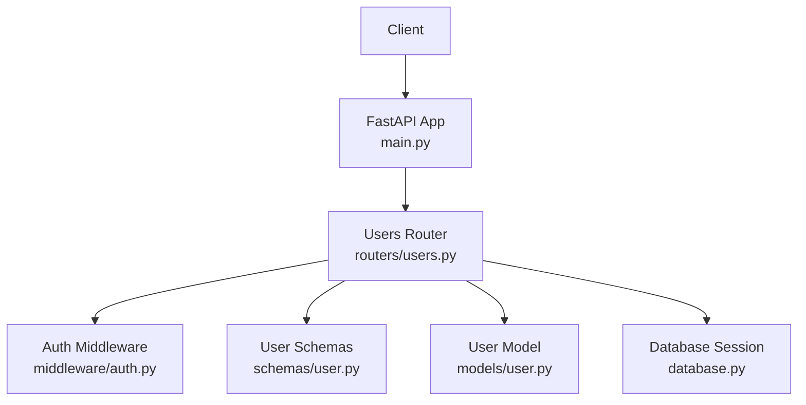
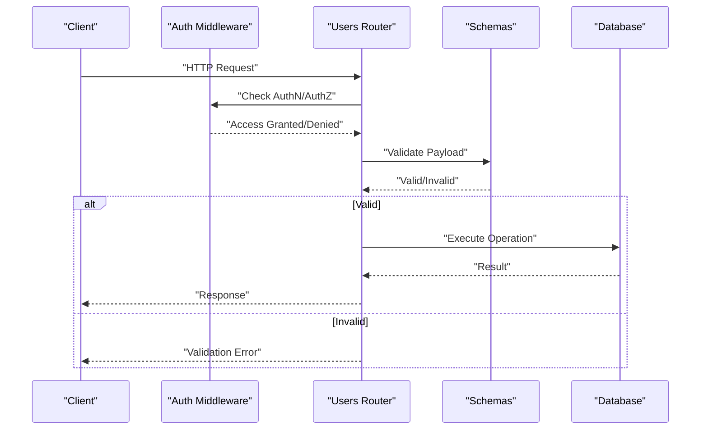
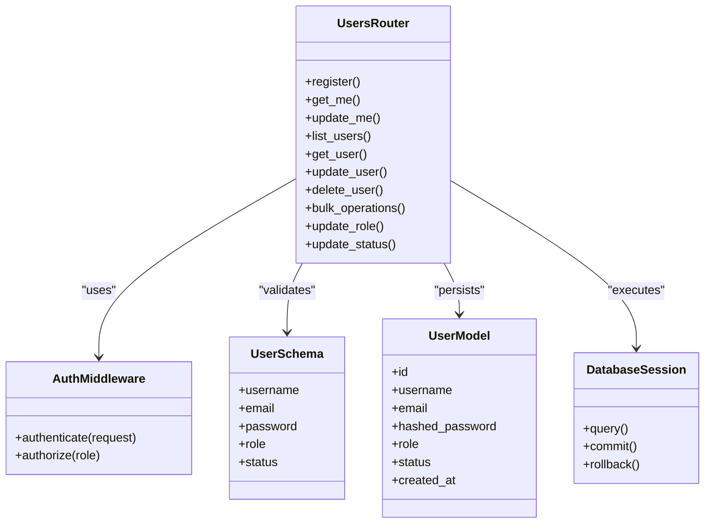

# User Management API

<cite>
**Referenced Files in This Document**
- [users.py](file://backend/app/routers/users.py)
- [user.py](file://backend/app/models/user.py)
- [user.py](file://backend/app/schemas/user.py)
- [auth.py](file://backend/app/middleware/auth.py)
- [main.py](file://backend/app/main.py)
- [database.py](file://backend/app/database.py)
</cite>

## Table of Contents
1. [Introduction](#introduction)
2. [Project Structure](#project-structure)
3. [Core Components](#core-components)
4. [Architecture Overview](#architecture-overview)
5. [Detailed Component Analysis](#detailed-component-analysis)
6. [Dependency Analysis](#dependency-analysis)
7. [Performance Considerations](#performance-considerations)
8. [Troubleshooting Guide](#troubleshooting-guide)
9. [Conclusion](#conclusion)

## Introduction
This document provides comprehensive API documentation for user management endpoints. It covers HTTP methods (GET, POST, PUT, DELETE) for user CRUD operations including registration, profile updates, role management, and status control. It also details request/response schemas with field validation rules, authentication requirements, authorization levels, practical examples, bulk operations, search/filtering capabilities, error responses, and common integration patterns.

## Project Structure
The user management functionality is implemented within the backend application using a FastAPI-style router pattern. The key files involved are:
- Router defining user endpoints
- Pydantic schemas for request/response validation
- SQLAlchemy model for persistence
- Authentication middleware for access control
- Application entry point and database configuration

**Diagram sources**
- [main.py](file://backend/app/main.py)
- [users.py](file://backend/app/routers/users.py)
- [auth.py](file://backend/app/middleware/auth.py)
- [user.py](file://backend/app/schemas/user.py)
- [user.py](file://backend/app/models/user.py)
- [database.py](file://backend/app/database.py)

**Section sources**
- [main.py](file://backend/app/main.py)
- [users.py](file://backend/app/routers/users.py)
- [auth.py](file://backend/app/middleware/auth.py)
- [user.py](file://backend/app/schemas/user.py)
- [user.py](file://backend/app/models/user.py)
- [database.py](file://backend/app/database.py)

## Core Components
- Users Router: Defines all user-related HTTP endpoints and orchestrates business logic.
- User Schemas: Define Pydantic models for request payloads and response structures, including validation rules.
- User Model: Represents the persistent user entity in the database.
- Auth Middleware: Enforces authentication and authorization checks on protected routes.
- Database: Provides session management and query execution.

Key responsibilities:
- Validate inputs via schemas before processing requests.
- Authenticate users and enforce role-based access control.
- Perform CRUD operations against the database through the ORM layer.
- Return standardized responses and errors.

**Section sources**
- [users.py](file://backend/app/routers/users.py)
- [user.py](file://backend/app/schemas/user.py)
- [user.py](file://backend/app/models/user.py)
- [auth.py](file://backend/app/middleware/auth.py)
- [database.py](file://backend/app/database.py)

## Architecture Overview
The user management API follows a layered architecture:
- Presentation Layer: HTTP endpoints defined in the users router.
- Validation Layer: Pydantic schemas ensure data integrity.
- Business Logic Layer: Router functions implement workflows such as creation, updates, and role/status changes.
- Security Layer: Middleware validates tokens and permissions.
- Persistence Layer: SQLAlchemy interacts with the database.

**Diagram sources**
- [users.py](file://backend/app/routers/users.py)
- [auth.py](file://backend/app/middleware/auth.py)
- [user.py](file://backend/app/schemas/user.py)
- [database.py](file://backend/app/database.py)

## Detailed Component Analysis

### Authentication and Authorization
- Authentication: Requires a valid token or session as enforced by middleware.
- Authorization: Role-based checks determine access to endpoints (e.g., admin-only operations).
- Protected Routes: Most user management endpoints require authentication; administrative actions require elevated roles.

Common behaviors:
- Reject unauthenticated requests with 401 Unauthorized.
- Deny insufficient privileges with 403 Forbidden.
- Attach current user context to request scope for downstream use.

**Section sources**
- [auth.py](file://backend/app/middleware/auth.py)
- [users.py](file://backend/app/routers/users.py)

### User Registration (POST /api/users/register)
Purpose: Create a new user account.

Request schema fields:
- username: string, required, unique, min/max length constraints.
- email: string, required, valid email format, unique.
- password: string, required, meets complexity policy.
- role: optional enum (e.g., user/admin), defaults to user if not provided.
- status: optional enum (active/inactive), defaults to active.

Validation rules:
- Username uniqueness check.
- Email uniqueness and format validation.
- Password strength enforcement.
- Role must be one of allowed values.

Authorization:
- Public endpoint (no auth required) unless configured otherwise.

Response schema:
- id: integer or UUID.
- username: string.
- email: string.
- role: string.
- status: string.
- created_at: timestamp.

Example workflow:
- Client sends POST with payload.
- Server validates input via schema.
- Server checks uniqueness constraints.
- Server hashes password and persists user.
- Server returns 201 Created with user object.

Error responses:
- 400 Bad Request: Validation errors (invalid fields).
- 409 Conflict: Duplicate username or email.
- 500 Internal Server Error: Unexpected failures.

**Section sources**
- [users.py](file://backend/app/routers/users.py)
- [user.py](file://backend/app/schemas/user.py)
- [user.py](file://backend/app/models/user.py)

### Get User Profile (GET /api/users/me)
Purpose: Retrieve the authenticated user’s profile.

Authentication:
- Required.

Authorization:
- Any authenticated user can access their own profile.

Response schema:
- id, username, email, role, status, timestamps.

Example:
- GET /api/users/me with valid token returns 200 OK and user profile.

Errors:
- 401 Unauthorized if no token.
- 404 Not Found if user record missing.

**Section sources**
- [users.py](file://backend/app/routers/users.py)
- [auth.py](file://backend/app/middleware/auth.py)

### Update User Profile (PUT /api/users/me)
Purpose: Update the authenticated user’s profile fields.

Authentication:
- Required.

Authorization:
- Users can update only their own profile.

Request schema fields:
- email: optional, valid email format.
- username: optional, unique constraint.
- role: typically not editable by non-admins.
- status: typically not editable by non-admins.

Validation rules:
- Field-specific validations (format, length).
- Uniqueness checks for username/email.

Response schema:
- Updated user object.

Example workflow:
- Client sends PUT with partial payload.
- Server validates and applies updates.
- Server returns updated profile.

Errors:
- 400 Bad Request: Validation errors.
- 409 Conflict: Duplicate username/email.
- 403 Forbidden: Attempting to update another user or restricted fields.

**Section sources**
- [users.py](file://backend/app/routers/users.py)
- [user.py](file://backend/app/schemas/user.py)

### List Users (GET /api/users)
Purpose: Retrieve a paginated list of users with filtering and sorting.

Authentication:
- Required.

Authorization:
- Admin role required.

Query parameters:
- page: integer, default 1.
- page_size: integer, default 20, max limit enforced.
- role: filter by role.
- status: filter by status.
- search: substring match on username or email.
- sort_by: field name (e.g., created_at).
- order: asc/desc.

Response schema:
- items: array of user objects.
- total: integer count.
- page: integer.
- page_size: integer.

Example:
- GET /api/users?page=1&page_size=10&role=admin&status=active&search=john

Errors:
- 401 Unauthorized.
- 403 Forbidden.
- 400 Bad Request: Invalid pagination or filter values.

**Section sources**
- [users.py](file://backend/app/routers/users.py)

### Get User by ID (GET /api/users/{user_id})
Purpose: Retrieve a specific user by identifier.

Authentication:
- Required.

Authorization:
- Admin role required.

Path parameter:
- user_id: integer or UUID.

Response schema:
- Single user object.

Errors:
- 404 Not Found if user does not exist.
- 403 Forbidden if unauthorized.

**Section sources**
- [users.py](file://backend/app/routers/users.py)

### Update User (PUT /api/users/{user_id})
Purpose: Update an existing user’s attributes (admin operation).

Authentication:
- Required.

Authorization:
- Admin role required.

Request schema fields:
- username: optional, unique.
- email: optional, valid email.
- role: optional, allowed enum values.
- status: optional, allowed enum values.

Validation rules:
- Field-specific validations.
- Uniqueness constraints.

Response schema:
- Updated user object.

Errors:
- 400 Bad Request: Validation errors.
- 404 Not Found: User not found.
- 409 Conflict: Duplicate username/email.
- 403 Forbidden: Unauthorized.

**Section sources**
- [users.py](file://backend/app/routers/users.py)
- [user.py](file://backend/app/schemas/user.py)

### Delete User (DELETE /api/users/{user_id})
Purpose: Permanently remove a user account.

Authentication:
- Required.

Authorization:
- Admin role required.

Path parameter:
- user_id: integer or UUID.

Response:
- 204 No Content on success.

Errors:
- 404 Not Found.
- 403 Forbidden.

**Section sources**
- [users.py](file://backend/app/routers/users.py)

### Bulk Operations (POST /api/users/bulk)
Purpose: Perform batch create/update operations on multiple users.

Authentication:
- Required.

Authorization:
- Admin role required.

Request schema:
- action: enum (create/update).
- users: array of user objects conforming to create/update schemas.
- options: optional flags (e.g., skip_duplicates, dry_run).

Validation rules:
- Each user object validated individually.
- Total size limits enforced.

Response schema:
- results: array of per-user outcomes (success/error).
- summary: counts of successes/failures.

Example workflow:
- Client sends bulk create with up to N users.
- Server validates each entry.
- Server persists valid entries and aggregates errors.
- Server returns detailed results.

Errors:
- 400 Bad Request: Invalid payload structure or too many items.
- 403 Forbidden.
- 500 Internal Server Error.

**Section sources**
- [users.py](file://backend/app/routers/users.py)
- [user.py](file://backend/app/schemas/user.py)

### Role Management (PATCH /api/users/{user_id}/role)
Purpose: Change a user’s role.

Authentication:
- Required.

Authorization:
- Admin role required.

Request schema:
- role: enum value (e.g., user/admin).

Validation rules:
- Role must be allowed.

Response schema:
- Updated user object.

Errors:
- 400 Bad Request: Invalid role.
- 404 Not Found.
- 403 Forbidden.

**Section sources**
- [users.py](file://backend/app/routers/users.py)

### Status Control (PATCH /api/users/{user_id}/status)
Purpose: Activate or deactivate a user account.

Authentication:
- Required.

Authorization:
- Admin role required.

Request schema:
- status: enum (active/inactive).

Validation rules:
- Status must be allowed.

Response schema:
- Updated user object.

Errors:
- 400 Bad Request: Invalid status.
- 404 Not Found.
- 403 Forbidden.

**Section sources**
- [users.py](file://backend/app/routers/users.py)

### Search and Filtering Capabilities
- Search: Substring matching on username and email via query parameter.
- Filters: By role and status.
- Pagination: Page and page_size with server-side limits.
- Sorting: By selected fields with ascending/descending order.

Best practices:
- Use small page sizes for performance.
- Combine filters to narrow result sets.
- Avoid overly broad searches without filters.

**Section sources**
- [users.py](file://backend/app/routers/users.py)

### Practical Examples

#### User Creation Workflow
- Register a new user via POST /api/users/register.
- Verify response includes id, username, email, role, status.
- Log in with credentials to obtain token.
- Access GET /api/users/me to confirm profile.

#### Profile Update Workflow
- Send PUT /api/users/me with desired fields.
- Handle validation errors and conflicts.
- Confirm updates via GET /api/users/me.

#### Admin Role Assignment
- Admin calls PATCH /api/users/{user_id}/role with new role.
- Verify response reflects updated role.
- Optionally re-authenticate affected user to refresh session.

#### Bulk User Import
- Prepare JSON array of user objects.
- Send POST /api/users/bulk with action=create.
- Inspect results for per-user outcomes and summary.

**Section sources**
- [users.py](file://backend/app/routers/users.py)
- [user.py](file://backend/app/schemas/user.py)

## Dependency Analysis
The user management module depends on:
- Authentication middleware for security checks.
- Pydantic schemas for validation.
- SQLAlchemy model for persistence.
- Database session for queries.

**Diagram sources**
- [users.py](file://backend/app/routers/users.py)
- [auth.py](file://backend/app/middleware/auth.py)
- [user.py](file://backend/app/schemas/user.py)
- [user.py](file://backend/app/models/user.py)
- [database.py](file://backend/app/database.py)

**Section sources**
- [users.py](file://backend/app/routers/users.py)
- [auth.py](file://backend/app/middleware/auth.py)
- [user.py](file://backend/app/schemas/user.py)
- [user.py](file://backend/app/models/user.py)
- [database.py](file://backend/app/database.py)

## Performance Considerations
- Pagination: Always paginate large lists; set sensible defaults and maximum limits.
- Indexes: Ensure database indexes on frequently filtered columns (username, email, role, status).
- Query Optimization: Use selective filters and avoid full-table scans.
- Bulk Operations: Limit batch sizes to prevent memory spikes and long-running transactions.
- Caching: Consider caching read-heavy endpoints behind a cache layer if appropriate.

[No sources needed since this section provides general guidance]

## Troubleshooting Guide
Common issues and resolutions:
- 401 Unauthorized: Missing or invalid token. Ensure client attaches correct headers.
- 403 Forbidden: Insufficient privileges. Verify user role and endpoint permissions.
- 400 Bad Request: Validation errors. Check request payload against schema constraints.
- 404 Not Found: Resource does not exist. Verify identifiers and existence.
- 409 Conflict: Duplicate username/email. Resolve collisions before retry.
- 500 Internal Server Error: Unexpected failures. Review server logs and database connectivity.

Integration patterns:
- Retry with exponential backoff for transient errors.
- Implement idempotency keys for bulk operations.
- Log request IDs for correlation across services.

**Section sources**
- [users.py](file://backend/app/routers/users.py)
- [auth.py](file://backend/app/middleware/auth.py)

## Conclusion
The User Management API provides robust CRUD operations, secure authentication and authorization, flexible search and filtering, and efficient bulk capabilities. Adhering to the documented schemas, validation rules, and best practices ensures reliable integrations and maintainable administration workflows.