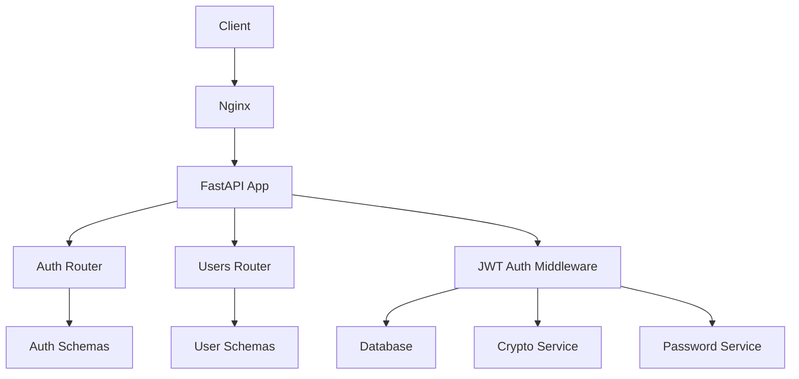
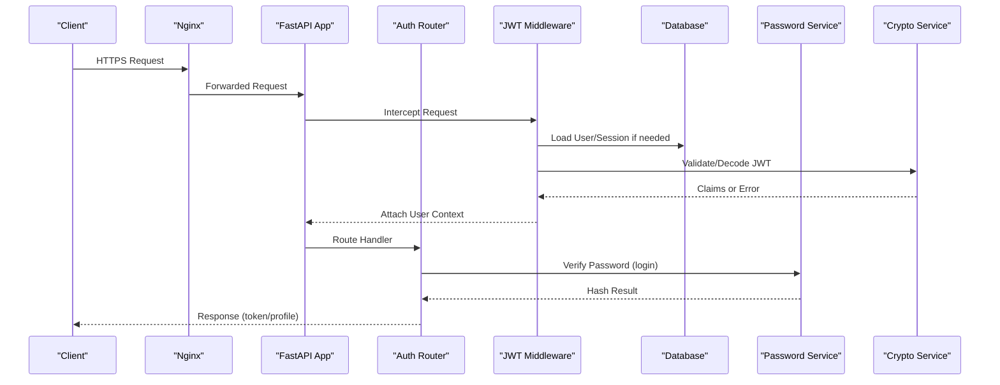
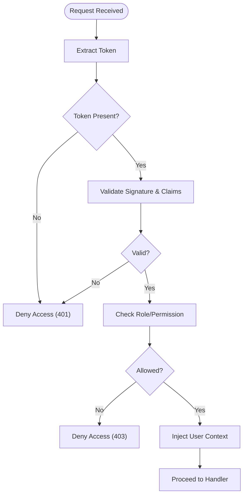
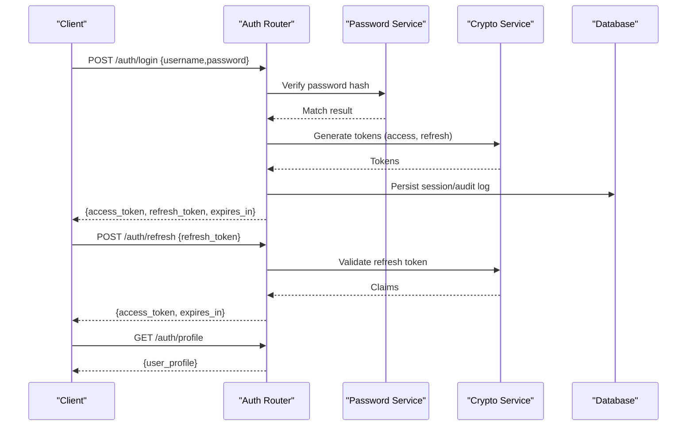
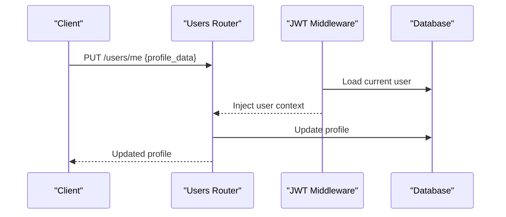
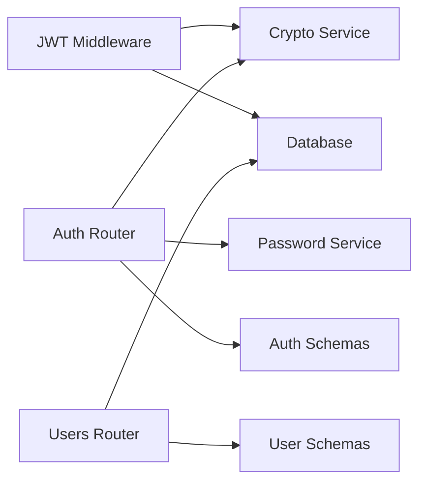

# Authentication & Security

<cite>
**Referenced Files in This Document**
- [main.py](file://backend/app/main.py)
- [auth_middleware.py](file://backend/app/middleware/auth.py)
- [auth_router.py](file://backend/app/routers/auth.py)
- [users_router.py](file://backend/app/routers/users.py)
- [auth_schemas.py](file://backend/app/schemas/auth.py)
- [user_schemas.py](file://backend/app/schemas/user.py)
- [password_service.py](file://backend/app/services/password.py)
- [crypto_service.py](file://backend/app/services/crypto.py)
- [config.py](file://backend/app/config.py)
- [database.py](file://backend/app/database.py)
- [user_model.py](file://backend/app/models/user.py)
- [session_model.py](file://backend/app/models/session.py)
- [settings_model.py](file://backend/app/models/settings.py)
- [nginx.conf](file://nginx/nginx.conf)
</cite>

## Table of Contents
1. [Introduction](#introduction)
2. [Project Structure](#project-structure)
3. [Core Components](#core-components)
4. [Architecture Overview](#architecture-overview)
5. [Detailed Component Analysis](#detailed-component-analysis)
6. [Dependency Analysis](#dependency-analysis)
7. [Performance Considerations](#performance-considerations)
8. [Troubleshooting Guide](#troubleshooting-guide)
9. [Conclusion](#conclusion)
10. [Appendices](#appendices)

## Introduction
This document explains the authentication and security subsystem, focusing on JWT-based authentication middleware, token validation, user context injection, role-based access control (RBAC), request/response schemas, password hashing, cryptographic utilities, auth router endpoints, and integration patterns for external identity providers. It also provides best practices, common vulnerabilities, and mitigations to help you implement secure authentication flows.

## Project Structure
The authentication subsystem spans several modules:
- Middleware for JWT validation and user context injection
- Routers for login/logout, token refresh, and profile management
- Schemas for validating requests and responses
- Services for password hashing and cryptography
- Models for users, sessions, and settings
- Configuration for secrets and runtime behavior
- Nginx configuration for TLS termination and headers

**Diagram sources**
- [main.py](file://backend/app/main.py)
- [auth_middleware.py](file://backend/app/middleware/auth.py)
- [auth_router.py](file://backend/app/routers/auth.py)
- [users_router.py](file://backend/app/routers/users.py)
- [auth_schemas.py](file://backend/app/schemas/auth.py)
- [user_schemas.py](file://backend/app/schemas/user.py)
- [password_service.py](file://backend/app/services/password.py)
- [crypto_service.py](file://backend/app/services/crypto.py)
- [database.py](file://backend/app/database.py)
- [nginx.conf](file://nginx/nginx.conf)

**Section sources**
- [main.py](file://backend/app/main.py)
- [nginx.conf](file://nginx/nginx.conf)

## Core Components
- JWT Auth Middleware: Validates tokens, enforces RBAC, injects authenticated user into request context.
- Auth Router: Provides login, logout, token refresh, and profile endpoints.
- Schemas: Pydantic models for input/output validation across auth flows.
- Password Service: Secure password hashing and verification.
- Crypto Service: Cryptographic helpers for signing, encryption, and random value generation.
- Models: User, Session, Settings entities used by auth flows.
- Config: Centralized configuration for secrets, token lifetimes, and security flags.

Key responsibilities:
- Token lifecycle: issuance, validation, refresh, revocation.
- Context propagation: current user and roles attached to requests.
- RBAC: route-level or dependency-level checks based on roles/permissions.
- Input validation: strict schemas for all API payloads.
- Secure defaults: HTTPS, HSTS, CORS, rate limiting, and safe cookie flags.

**Section sources**
- [auth_middleware.py](file://backend/app/middleware/auth.py)
- [auth_router.py](file://backend/app/routers/auth.py)
- [auth_schemas.py](file://backend/app/schemas/auth.py)
- [user_schemas.py](file://backend/app/schemas/user.py)
- [password_service.py](file://backend/app/services/password.py)
- [crypto_service.py](file://backend/app/services/crypto.py)
- [config.py](file://backend/app/config.py)
- [user_model.py](file://backend/app/models/user.py)
- [session_model.py](file://backend/app/models/session.py)
- [settings_model.py](file://backend/app/models/settings.py)

## Architecture Overview
The system uses FastAPI with a custom JWT middleware that intercepts requests, validates tokens, and enriches the request with user context. Auth routers expose endpoints for credential-based login, token refresh, and profile operations. Password hashing is handled via a dedicated service, and cryptographic operations are centralized.

**Diagram sources**
- [main.py](file://backend/app/main.py)
- [auth_middleware.py](file://backend/app/middleware/auth.py)
- [auth_router.py](file://backend/app/routers/auth.py)
- [password_service.py](file://backend/app/services/password.py)
- [crypto_service.py](file://backend/app/services/crypto.py)
- [database.py](file://backend/app/database.py)

## Detailed Component Analysis

### JWT Auth Middleware
Responsibilities:
- Extract and validate JWT from Authorization header or cookies.
- Decode claims and verify signature using configured secrets.
- Enforce RBAC by checking required roles/permissions against user claims.
- Inject authenticated user object into request state for downstream handlers.
- Handle token expiration, invalid signatures, and missing credentials gracefully.

Security considerations:
- Use short-lived access tokens and refresh tokens where applicable.
- Reject tokens without expected claims and enforce audience/issuer constraints.
- Rate-limit login attempts and protect sensitive endpoints.
- Ensure secure cookie attributes (HttpOnly, Secure, SameSite) when used.

**Diagram sources**
- [auth_middleware.py](file://backend/app/middleware/auth.py)

**Section sources**
- [auth_middleware.py](file://backend/app/middleware/auth.py)

### Auth Router Endpoints
Endpoints typically include:
- Login: authenticate credentials, issue access and refresh tokens.
- Logout: revoke tokens or invalidate sessions.
- Refresh: exchange refresh token for new access token.
- Profile: retrieve/update authenticated user profile.

Validation and response:
- Strict Pydantic schemas for inputs and outputs.
- Consistent error codes and messages.
- Secure handling of sensitive fields.

**Diagram sources**
- [auth_router.py](file://backend/app/routers/auth.py)
- [password_service.py](file://backend/app/services/password.py)
- [crypto_service.py](file://backend/app/services/crypto.py)
- [database.py](file://backend/app/database.py)

**Section sources**
- [auth_router.py](file://backend/app/routers/auth.py)
- [auth_schemas.py](file://backend/app/schemas/auth.py)

### User Router and Profile Management
Responsibilities:
- Manage user profiles and account settings.
- Enforce RBAC for administrative actions.
- Validate updates via schemas.

**Diagram sources**
- [users_router.py](file://backend/app/routers/users.py)
- [auth_middleware.py](file://backend/app/middleware/auth.py)
- [user_schemas.py](file://backend/app/schemas/user.py)
- [database.py](file://backend/app/database.py)

**Section sources**
- [users_router.py](file://backend/app/routers/users.py)
- [user_schemas.py](file://backend/app/schemas/user.py)

### Schemas for Request/Response Validation
- Auth schemas define login payloads, token responses, and refresh requests.
- User schemas define profile fields, update rules, and validation constraints.
- All endpoints rely on these schemas to ensure consistent and safe data handling.

Best practices:
- Use strict typing and validators.
- Avoid exposing sensitive fields in responses.
- Normalize inputs and sanitize outputs.

**Section sources**
- [auth_schemas.py](file://backend/app/schemas/auth.py)
- [user_schemas.py](file://backend/app/schemas/user.py)

### Password Hashing and Verification
- Password service implements secure hashing and verification.
- Uses modern algorithms suitable for passwords.
- Ensures constant-time comparisons to prevent timing attacks.

Recommendations:
- Configure appropriate work factor.
- Rotate hashing parameters periodically.
- Never store plaintext passwords.

**Section sources**
- [password_service.py](file://backend/app/services/password.py)

### Cryptographic Utilities
- Crypto service centralizes signing, encryption, and random value generation.
- Used for JWT signing, token generation, and secure random values.
- Should be configured with strong keys and algorithms.

Security notes:
- Use approved algorithms and key sizes.
- Protect secret keys at rest and in transit.
- Implement key rotation strategies.

**Section sources**
- [crypto_service.py](file://backend/app/services/crypto.py)

### Models: User, Session, Settings
- User model stores identity and role information.
- Session model tracks active sessions and token revocation.
- Settings model holds application-wide security configurations.

Data integrity:
- Enforce constraints and relationships.
- Audit changes to sensitive records.

**Section sources**
- [user_model.py](file://backend/app/models/user.py)
- [session_model.py](file://backend/app/models/session.py)
- [settings_model.py](file://backend/app/models/settings.py)

### Configuration and Runtime Security
- Central config manages secrets, token lifetimes, CORS, and feature flags.
- Environment variables should not be hardcoded; use secure secret management.
- Enable HTTPS and secure headers via Nginx.

**Section sources**
- [config.py](file://backend/app/config.py)
- [nginx.conf](file://nginx/nginx.conf)

## Dependency Analysis
The authentication subsystem has clear boundaries:
- Middleware depends on crypto and database services for token validation and user lookup.
- Routers depend on schemas and services for validation and business logic.
- Models represent persistent entities consumed by services and routers.

**Diagram sources**
- [auth_middleware.py](file://backend/app/middleware/auth.py)
- [auth_router.py](file://backend/app/routers/auth.py)
- [users_router.py](file://backend/app/routers/users.py)
- [password_service.py](file://backend/app/services/password.py)
- [crypto_service.py](file://backend/app/services/crypto.py)
- [database.py](file://backend/app/database.py)
- [auth_schemas.py](file://backend/app/schemas/auth.py)
- [user_schemas.py](file://backend/app/schemas/user.py)

**Section sources**
- [auth_middleware.py](file://backend/app/middleware/auth.py)
- [auth_router.py](file://backend/app/routers/auth.py)
- [users_router.py](file://backend/app/routers/users.py)
- [password_service.py](file://backend/app/services/password.py)
- [crypto_service.py](file://backend/app/services/crypto.py)
- [database.py](file://backend/app/database.py)
- [auth_schemas.py](file://backend/app/schemas/auth.py)
- [user_schemas.py](file://backend/app/schemas/user.py)

## Performance Considerations
- Keep JWT payloads minimal to reduce overhead.
- Cache frequent lookups (e.g., user roles) where safe.
- Use connection pooling for database operations.
- Avoid heavy computations in request paths; offload to background tasks when possible.
- Monitor latency and errors around token validation and password hashing.

[No sources needed since this section provides general guidance]

## Troubleshooting Guide
Common issues and mitigations:
- Invalid token errors: check algorithm, secret, and expiration settings.
- Missing user context: ensure middleware runs before route handlers.
- Password mismatch: verify hashing parameters and stored hashes.
- CORS failures: configure allowed origins and methods properly.
- Rate limiting: tune limits to balance security and usability.

Debugging tips:
- Log token validation steps without sensitive data.
- Inspect schema validation errors for malformed requests.
- Use health checks to verify dependencies (DB, crypto).

**Section sources**
- [auth_middleware.py](file://backend/app/middleware/auth.py)
- [auth_router.py](file://backend/app/routers/auth.py)
- [password_service.py](file://backend/app/services/password.py)
- [config.py](file://backend/app/config.py)

## Conclusion
The authentication and security subsystem combines JWT middleware, robust schemas, secure password hashing, and centralized cryptographic utilities to provide a solid foundation for secure APIs. By following best practices—short-lived tokens, strict validation, RBAC enforcement, and secure configuration—you can mitigate common vulnerabilities and maintain a resilient authentication flow.

[No sources needed since this section summarizes without analyzing specific files]

## Appendices

### Custom Authentication Decorators and Permission Checks
- Create decorators that wrap route handlers to enforce additional checks beyond JWT validation.
- Extend RBAC by reading roles/permissions from claims or database and comparing against required sets.
- Combine multiple decorators for layered security (e.g., admin-only, resource-scoped permissions).

Implementation pattern:
- Define a decorator factory that accepts required roles/permissions.
- Inside the decorator, call the middleware’s user context extraction and perform checks.
- Raise appropriate HTTP exceptions for unauthorized or forbidden scenarios.

[No sources needed since this section provides general guidance]

### Integrating with External Identity Providers
- Support OAuth 2.0/OpenID Connect flows for third-party logins.
- Map external claims to internal roles and permissions.
- Store minimal user data locally and rely on provider tokens where appropriate.
- Implement token introspection or JWKS endpoints for validation.

Integration checklist:
- Configure client IDs/secrets securely.
- Set redirect URIs and scopes carefully.
- Validate issuer, audience, and token types.
- Handle provider-specific error responses and retries.

[No sources needed since this section provides general guidance]

### Security Best Practices and Vulnerability Mitigations
- Enforce HTTPS everywhere; set HSTS and secure headers via Nginx.
- Use HttpOnly, Secure, and SameSite cookies for tokens when applicable.
- Limit token lifetimes and rotate secrets regularly.
- Apply rate limiting and account lockout policies.
- Sanitize and validate all inputs; avoid leaking stack traces.
- Audit sensitive operations and monitor anomalies.

[No sources needed since this section provides general guidance]