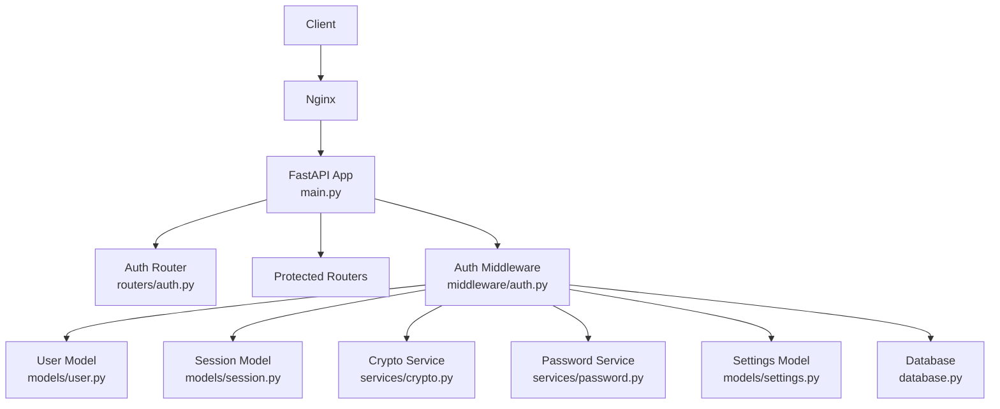
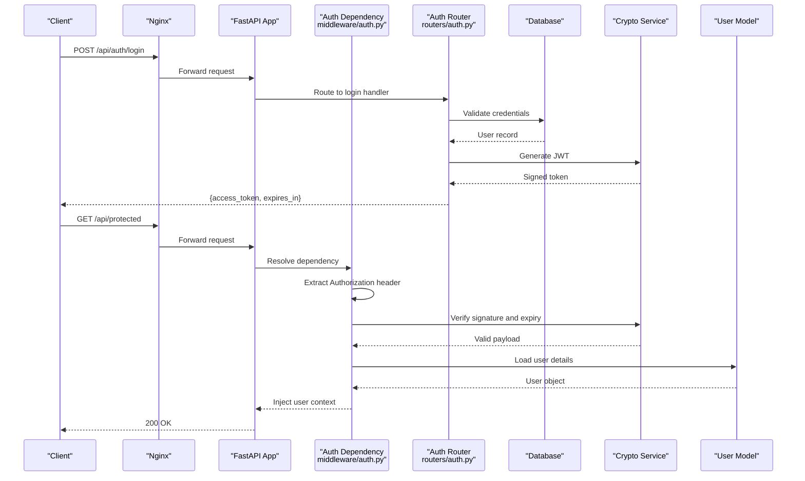
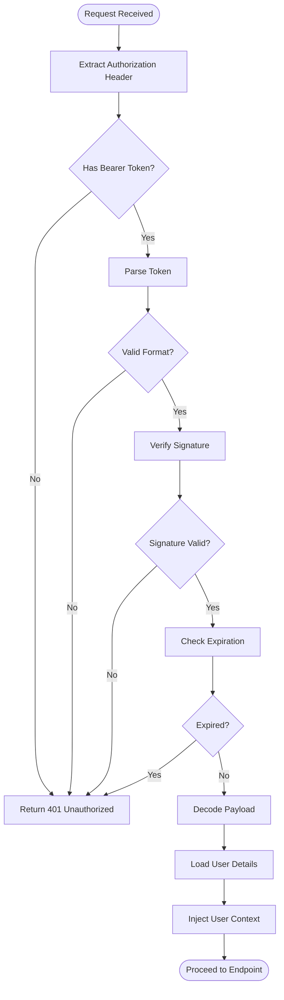
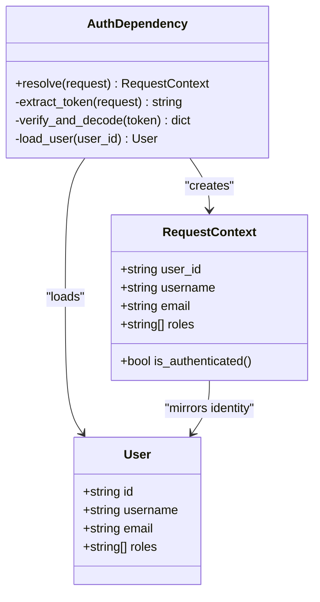
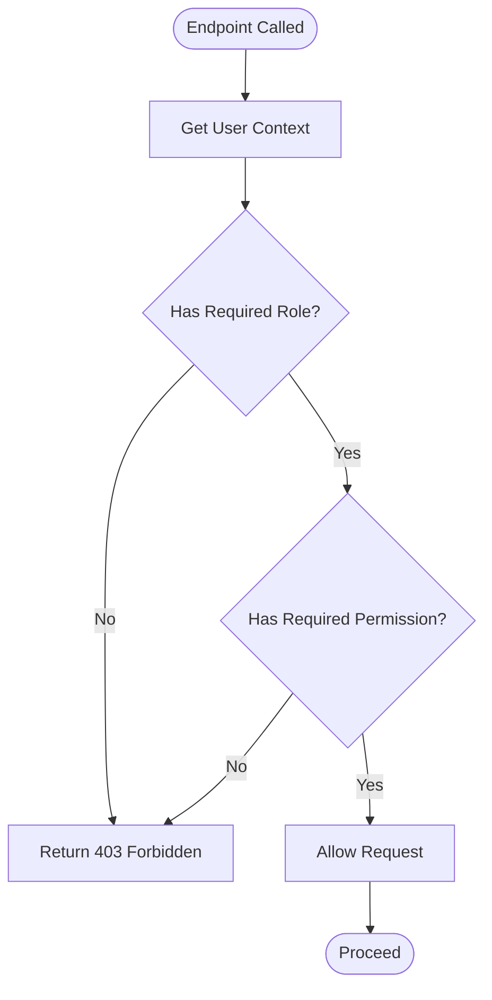
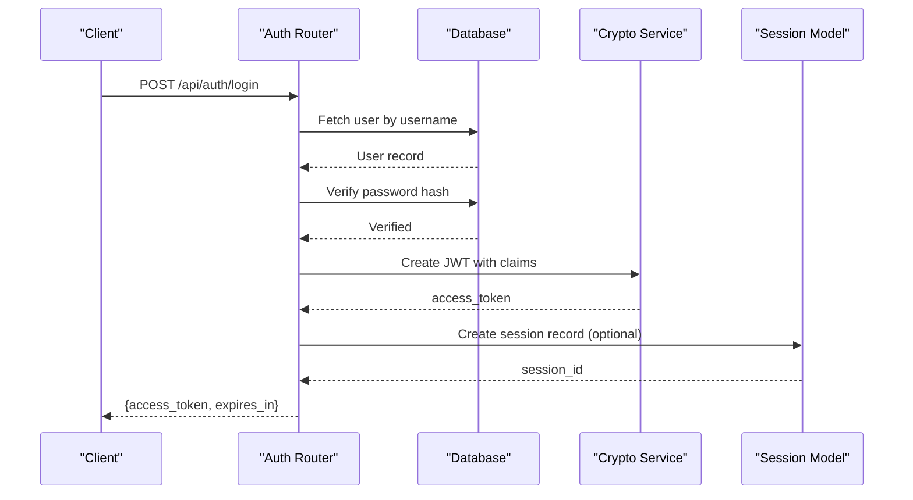
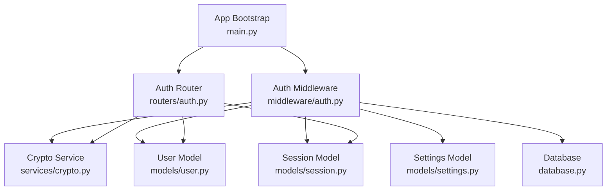

# Authentication Middleware

<cite>
**Referenced Files in This Document**
- [auth.py](file://backend/app/middleware/auth.py)
- [main.py](file://backend/app/main.py)
- [user.py](file://backend/app/models/user.py)
- [session.py](file://backend/app/models/session.py)
- [auth.py](file://backend/app/routers/auth.py)
- [settings.py](file://backend/app/models/settings.py)
- [crypto.py](file://backend/app/services/crypto.py)
- [password.py](file://backend/app/services/password.py)
- [config.py](file://backend/app/config.py)
- [database.py](file://backend/app/database.py)
</cite>

## Table of Contents
1. [Introduction](#introduction)
2. [Project Structure](#project-structure)
3. [Core Components](#core-components)
4. [Architecture Overview](#architecture-overview)
5. [Detailed Component Analysis](#detailed-component-analysis)
6. [Dependency Analysis](#dependency-analysis)
7. [Performance Considerations](#performance-considerations)
8. [Troubleshooting Guide](#troubleshooting-guide)
9. [Conclusion](#conclusion)
10. [Appendices](#appendices)

## Introduction
This document explains the authentication middleware implementation, focusing on JWT token validation (extraction from headers, signature verification, and expiration handling), user context injection into request context, role-based access control (RBAC), permission-checking decorators, and custom authorization rules. It also provides practical examples for protecting endpoints, implementing admin-only routes, extending permissions, and addresses security considerations such as token storage, CSRF protection, and session management.

## Project Structure
The authentication-related code is primarily located under backend/app:
- Middleware: auth.py implements FastAPI dependency-based authentication and RBAC.
- Models: user.py defines the User model; session.py models sessions; settings.py holds configuration values used by auth.
- Routers: auth.py handles login/logout and token issuance.
- Services: crypto.py and password.py provide cryptographic utilities and password hashing helpers.
- App bootstrap: main.py mounts routers and applies global middleware.
- Config and DB: config.py and database.py provide application configuration and database connectivity.

**Diagram sources**
- [main.py](file://backend/app/main.py)
- [auth.py](file://backend/app/middleware/auth.py)
- [auth.py](file://backend/app/routers/auth.py)
- [user.py](file://backend/app/models/user.py)
- [session.py](file://backend/app/models/session.py)
- [crypto.py](file://backend/app/services/crypto.py)
- [password.py](file://backend/app/services/password.py)
- [settings.py](file://backend/app/models/settings.py)
- [database.py](file://backend/app/database.py)

**Section sources**
- [main.py](file://backend/app/main.py)
- [auth.py](file://backend/app/middleware/auth.py)
- [auth.py](file://backend/app/routers/auth.py)
- [user.py](file://backend/app/models/user.py)
- [session.py](file://backend/app/models/session.py)
- [settings.py](file://backend/app/models/settings.py)
- [crypto.py](file://backend/app/services/crypto.py)
- [password.py](file://backend/app/services/password.py)
- [config.py](file://backend/app/config.py)
- [database.py](file://backend/app/database.py)

## Core Components
- Authentication dependency: extracts and validates JWT tokens from the Authorization header, verifies signatures using configured secrets, checks expiration, and raises appropriate errors.
- User context injection: populates the request context with authenticated user data after successful validation.
- RBAC and permission decorators: enforce role-based access and fine-grained permissions on protected endpoints.
- Token lifecycle: issues tokens upon successful login, supports logout via session invalidation or token revocation strategies.

Key responsibilities:
- Header parsing and token extraction.
- Signature verification and expiration checks.
- Context population with user identity and roles.
- Permission evaluation against endpoint requirements.
- Error responses for unauthenticated/forbidden requests.

**Section sources**
- [auth.py](file://backend/app/middleware/auth.py)
- [auth.py](file://backend/app/routers/auth.py)
- [user.py](file://backend/app/models/user.py)
- [session.py](file://backend/app/models/session.py)
- [settings.py](file://backend/app/models/settings.py)
- [crypto.py](file://backend/app/services/crypto.py)
- [password.py](file://backend/app/services/password.py)

## Architecture Overview
The authentication flow integrates FastAPI dependencies with JWT validation and RBAC enforcement:

**Diagram sources**
- [auth.py](file://backend/app/middleware/auth.py)
- [auth.py](file://backend/app/routers/auth.py)
- [crypto.py](file://backend/app/services/crypto.py)
- [user.py](file://backend/app/models/user.py)
- [database.py](file://backend/app/database.py)

## Detailed Component Analysis

### JWT Validation Flow
The middleware dependency performs:
- Extraction of the Authorization header and parsing of the Bearer token.
- Signature verification using configured secrets or keys.
- Expiration check against the token’s exp claim.
- Decoding of the payload to retrieve user identity and roles.
- Raising HTTP exceptions for missing, malformed, expired, or invalid tokens.

**Diagram sources**
- [auth.py](file://backend/app/middleware/auth.py)
- [crypto.py](file://backend/app/services/crypto.py)
- [user.py](file://backend/app/models/user.py)

**Section sources**
- [auth.py](file://backend/app/middleware/auth.py)
- [crypto.py](file://backend/app/services/crypto.py)
- [user.py](file://backend/app/models/user.py)

### User Context Injection
After successful validation, the middleware injects the authenticated user into the request context so that downstream handlers can access identity and roles without re-parsing tokens. This typically involves:
- Creating a context object or attaching attributes to the request state.
- Populating fields like user ID, username, email, and roles.
- Ensuring context is available across the request lifecycle.

**Diagram sources**
- [auth.py](file://backend/app/middleware/auth.py)
- [user.py](file://backend/app/models/user.py)

**Section sources**
- [auth.py](file://backend/app/middleware/auth.py)
- [user.py](file://backend/app/models/user.py)

### Role-Based Access Control (RBAC)
RBAC is enforced via decorators or dependency wrappers that:
- Require specific roles (e.g., admin, editor, viewer).
- Optionally require specific permissions (e.g., resource:create, resource:delete).
- Evaluate the current user’s roles/permissions against endpoint requirements.
- Return 403 Forbidden when access is denied.

**Diagram sources**
- [auth.py](file://backend/app/middleware/auth.py)

**Section sources**
- [auth.py](file://backend/app/middleware/auth.py)

### Token Issuance and Lifecycle
Login endpoints validate credentials and issue JWTs:
- Credentials are verified against stored hashes.
- Tokens include claims for identity and roles.
- Expiration is set according to policy.
- Optional session records may be created for revocation or audit.

**Diagram sources**
- [auth.py](file://backend/app/routers/auth.py)
- [crypto.py](file://backend/app/services/crypto.py)
- [session.py](file://backend/app/models/session.py)
- [user.py](file://backend/app/models/user.py)
- [database.py](file://backend/app/database.py)

**Section sources**
- [auth.py](file://backend/app/routers/auth.py)
- [crypto.py](file://backend/app/services/crypto.py)
- [session.py](file://backend/app/models/session.py)
- [user.py](file://backend/app/models/user.py)
- [database.py](file://backend/app/database.py)

### Protecting API Endpoints
To protect an endpoint:
- Apply the authentication dependency to resolve and validate the token.
- Use RBAC decorators to enforce role/permission requirements.
- Example patterns:
  - Protect a route requiring any authenticated user.
  - Protect a route requiring admin role.
  - Protect a route requiring specific permissions.

Practical guidance:
- Always place RBAC checks after authentication dependency resolution.
- Keep permission names consistent and documented.
- Avoid exposing sensitive data in error messages.

**Section sources**
- [auth.py](file://backend/app/middleware/auth.py)

### Implementing Custom Authorization Rules
Custom rules can be implemented by:
- Extending the RBAC decorator to evaluate additional conditions (e.g., ownership checks, IP allowlists).
- Adding new permission scopes and mapping them to roles.
- Integrating external policy engines if needed.

Steps:
- Define the rule function or decorator.
- Integrate it into the request pipeline before the endpoint handler.
- Ensure failures return appropriate HTTP status codes.

**Section sources**
- [auth.py](file://backend/app/middleware/auth.py)

## Dependency Analysis
Authentication components depend on configuration, cryptography, and persistence layers:

**Diagram sources**
- [auth.py](file://backend/app/middleware/auth.py)
- [auth.py](file://backend/app/routers/auth.py)
- [crypto.py](file://backend/app/services/crypto.py)
- [user.py](file://backend/app/models/user.py)
- [session.py](file://backend/app/models/session.py)
- [settings.py](file://backend/app/models/settings.py)
- [database.py](file://backend/app/database.py)
- [main.py](file://backend/app/main.py)

**Section sources**
- [auth.py](file://backend/app/middleware/auth.py)
- [auth.py](file://backend/app/routers/auth.py)
- [crypto.py](file://backend/app/services/crypto.py)
- [user.py](file://backend/app/models/user.py)
- [session.py](file://backend/app/models/session.py)
- [settings.py](file://backend/app/models/settings.py)
- [database.py](file://backend/app/database.py)
- [main.py](file://backend/app/main.py)

## Performance Considerations
- Minimize database calls during token validation by caching user lookups where safe.
- Use short-lived access tokens and refresh tokens to reduce exposure window.
- Prefer symmetric signing algorithms for performance when feasible; otherwise, ensure efficient key management.
- Avoid heavy computations in the critical path; offload non-critical tasks asynchronously.
- Monitor and rate-limit authentication endpoints to prevent brute-force attacks.

[No sources needed since this section provides general guidance]

## Troubleshooting Guide
Common issues and resolutions:
- Missing Authorization header: Ensure clients send Bearer tokens in all protected requests.
- Invalid signature: Verify secret/key configuration matches between issuer and verifier.
- Expired tokens: Refresh tokens or adjust expiration policies; handle 401 responses gracefully on the client.
- Permission denied: Confirm user roles/permissions match endpoint requirements.
- Session inconsistencies: Validate session records and ensure proper cleanup on logout.

Debugging tips:
- Log token extraction and validation steps (without sensitive data).
- Inspect payload claims to verify expected fields.
- Review RBAC decorator configurations and permission mappings.

**Section sources**
- [auth.py](file://backend/app/middleware/auth.py)
- [auth.py](file://backend/app/routers/auth.py)

## Conclusion
The authentication middleware provides robust JWT validation, user context injection, and RBAC enforcement. By following the outlined patterns for protecting endpoints, implementing admin-only routes, and extending permission checks, developers can build secure APIs. Adhering to security best practices—secure token storage, CSRF mitigation, and careful session management—ensures a resilient authentication system.

[No sources needed since this section summarizes without analyzing specific files]

## Appendices

### Security Considerations
- Token Storage:
  - Prefer HttpOnly, Secure cookies for web clients; avoid localStorage for sensitive tokens.
  - Use short-lived access tokens and rotate refresh tokens securely.
- CSRF Protection:
  - Enable CSRF middleware for state-changing endpoints when using cookies.
  - Validate SameSite cookie attributes appropriately.
- Session Management:
  - Store minimal session data; prefer server-side sessions with secure storage.
  - Invalidate sessions on logout and implement token revocation lists if necessary.
- Configuration:
  - Centralize secrets via environment variables or secure vaults.
  - Enforce strong cryptographic algorithms and key rotation policies.

[No sources needed since this section provides general guidance]