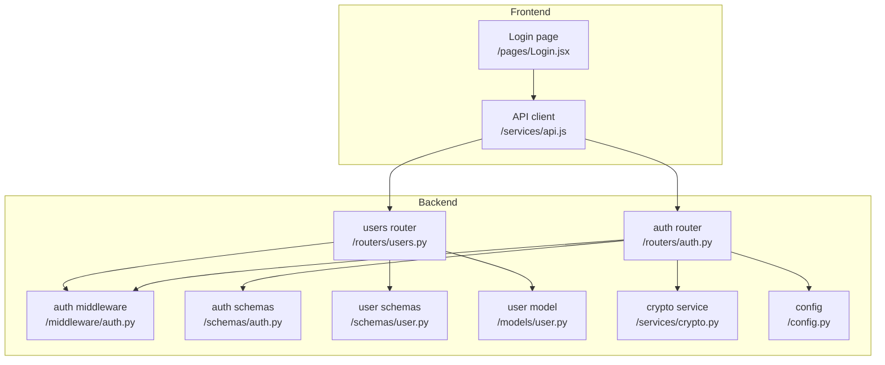
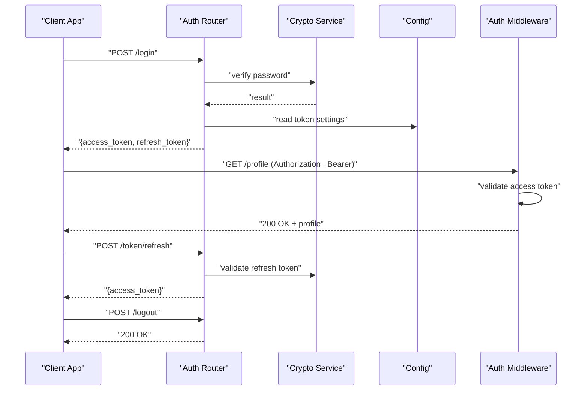
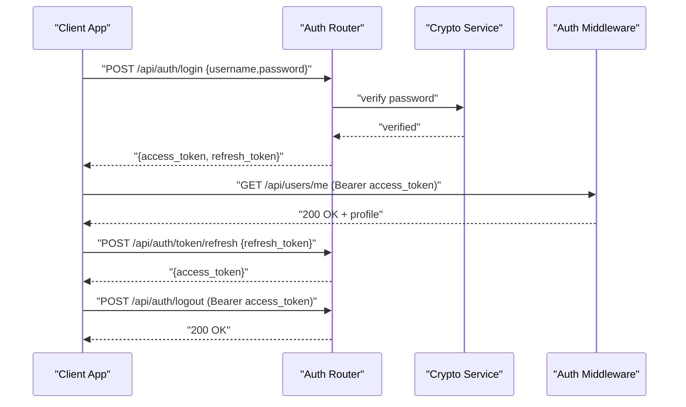
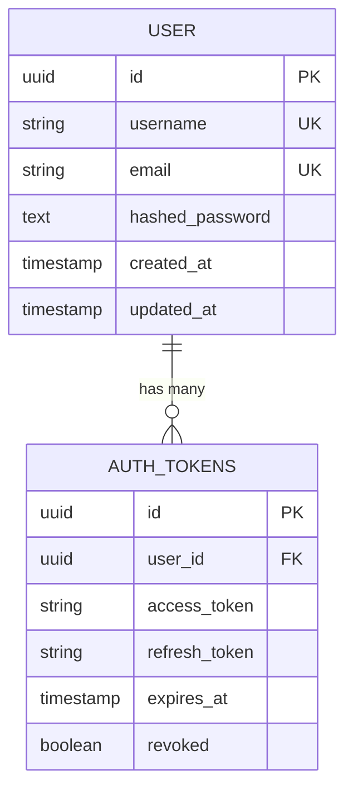
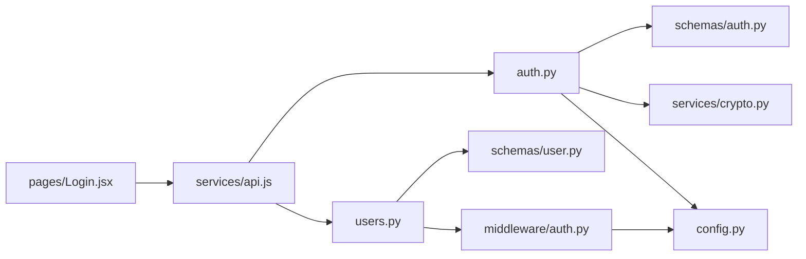

# Authentication Routes

<cite>
**Referenced Files in This Document**
- [backend/app/routers/auth.py](file://backend/app/routers/auth.py)
- [backend/app/routers/users.py](file://backend/app/routers/users.py)
- [backend/app/middleware/auth.py](file://backend/app/middleware/auth.py)
- [backend/app/schemas/auth.py](file://backend/app/schemas/auth.py)
- [backend/app/schemas/user.py](file://backend/app/schemas/user.py)
- [backend/app/models/user.py](file://backend/app/models/user.py)
- [backend/app/services/crypto.py](file://backend/app/services/crypto.py)
- [backend/app/config.py](file://backend/app/config.py)
- [frontend/src/pages/Login.jsx](file://frontend/src/pages/Login.jsx)
- [frontend/src/services/api.js](file://frontend/src/services/api.js)
</cite>

## Table of Contents
1. [Introduction](#introduction)
2. [Project Structure](#project-structure)
3. [Core Components](#core-components)
4. [Architecture Overview](#architecture-overview)
5. [Detailed Component Analysis](#detailed-component-analysis)
6. [Dependency Analysis](#dependency-analysis)
7. [Performance Considerations](#performance-considerations)
8. [Troubleshooting Guide](#troubleshooting-guide)
9. [Conclusion](#conclusion)
10. [Appendices](#appendices)

## Introduction
This document provides detailed API documentation for authentication endpoints, including login, logout, user profile management, and token refresh mechanisms. It explains request/response formats, HTTP status codes, error responses, and authentication requirements. It also includes curl examples and client-side implementation patterns to help integrate with the authentication API.

## Project Structure
The authentication functionality is implemented in the backend under routers, schemas, middleware, models, services, and configuration modules. The frontend demonstrates usage via a login page and an API service layer.

**Diagram sources**
- [backend/app/routers/auth.py](file://backend/app/routers/auth.py)
- [backend/app/routers/users.py](file://backend/app/routers/users.py)
- [backend/app/middleware/auth.py](file://backend/app/middleware/auth.py)
- [backend/app/schemas/auth.py](file://backend/app/schemas/auth.py)
- [backend/app/schemas/user.py](file://backend/app/schemas/user.py)
- [backend/app/models/user.py](file://backend/app/models/user.py)
- [backend/app/services/crypto.py](file://backend/app/services/crypto.py)
- [backend/app/config.py](file://backend/app/config.py)
- [frontend/src/pages/Login.jsx](file://frontend/src/pages/Login.jsx)
- [frontend/src/services/api.js](file://frontend/src/services/api.js)

**Section sources**
- [backend/app/routers/auth.py](file://backend/app/routers/auth.py)
- [backend/app/routers/users.py](file://backend/app/routers/users.py)
- [backend/app/middleware/auth.py](file://backend/app/middleware/auth.py)
- [backend/app/schemas/auth.py](file://backend/app/schemas/auth.py)
- [backend/app/schemas/user.py](file://backend/app/schemas/user.py)
- [backend/app/models/user.py](file://backend/app/models/user.py)
- [backend/app/services/crypto.py](file://backend/app/services/crypto.py)
- [backend/app/config.py](file://backend/app/config.py)
- [frontend/src/pages/Login.jsx](file://frontend/src/pages/Login.jsx)
- [frontend/src/services/api.js](file://frontend/src/services/api.js)

## Core Components
- Authentication Router: Defines login, logout, and token refresh endpoints.
- Users Router: Provides profile retrieval and update endpoints.
- Auth Middleware: Validates access tokens and enforces authentication on protected routes.
- Schemas: Pydantic models for request and response validation.
- Crypto Service: Handles secure hashing and cryptographic operations.
- Configuration: Centralizes secrets, token lifetimes, and security settings.

Key responsibilities:
- Login validates credentials, issues access and refresh tokens, and returns session context.
- Logout invalidates tokens or clears server-side sessions as applicable.
- Token refresh reissues short-lived access tokens using valid refresh tokens.
- Profile endpoints read/update user data with appropriate authorization checks.

**Section sources**
- [backend/app/routers/auth.py](file://backend/app/routers/auth.py)
- [backend/app/routers/users.py](file://backend/app/routers/users.py)
- [backend/app/middleware/auth.py](file://backend/app/middleware/auth.py)
- [backend/app/schemas/auth.py](file://backend/app/schemas/auth.py)
- [backend/app/schemas/user.py](file://backend/app/schemas/user.py)
- [backend/app/services/crypto.py](file://backend/app/services/crypto.py)
- [backend/app/config.py](file://backend/app/config.py)

## Architecture Overview
Authentication flow overview:
- Client sends credentials to login endpoint.
- Server validates credentials, creates tokens (access and refresh), and returns them.
- Client stores tokens and attaches access token to subsequent requests.
- Middleware validates access tokens for protected routes.
- When access token expires, client uses refresh token to obtain a new access token.
- Logout invalidates tokens or clears sessions.

**Diagram sources**
- [backend/app/routers/auth.py](file://backend/app/routers/auth.py)
- [backend/app/middleware/auth.py](file://backend/app/middleware/auth.py)
- [backend/app/services/crypto.py](file://backend/app/services/crypto.py)
- [backend/app/config.py](file://backend/app/config.py)

## Detailed Component Analysis

### Login Endpoint
- Method and path: POST /api/auth/login
- Request body fields:
  - username: string
  - password: string
- Response fields:
  - access_token: string
  - refresh_token: string
  - token_type: string (e.g., bearer)
  - expires_in: integer seconds
- Authentication requirements: None (public endpoint)
- Success status code: 200 OK
- Error responses:
  - 401 Unauthorized: invalid credentials
  - 422 Unprocessable Entity: malformed request body
- Notes:
  - Passwords are verified securely using the crypto service.
  - Tokens follow configured lifetimes from config.

curl example:
- curl -X POST https://example.com/api/auth/login -H "Content-Type: application/json" -d '{"username":"user@example.com","password":"secret"}'

Client-side pattern:
- Store access_token and refresh_token securely.
- Attach access_token to Authorization header for protected requests.
- On 401 responses, attempt automatic token renewal using refresh token.

**Section sources**
- [backend/app/routers/auth.py](file://backend/app/routers/auth.py)
- [backend/app/schemas/auth.py](file://backend/app/schemas/auth.py)
- [backend/app/services/crypto.py](file://backend/app/services/crypto.py)
- [backend/app/config.py](file://backend/app/config.py)

### Logout Endpoint
- Method and path: POST /api/auth/logout
- Request body fields:
  - refresh_token: string (optional depending on implementation)
- Response fields:
  - message: string indicating successful logout
- Authentication requirements:
  - Requires valid access_token in Authorization header
- Success status code: 200 OK
- Error responses:
  - 401 Unauthorized: missing or invalid access token
  - 422 Unprocessable Entity: malformed request body
- Notes:
  - Invalidates or revokes refresh token if provided.
  - Clears server-side session state if used.

curl example:
- curl -X POST https://example.com/api/auth/logout -H "Authorization: Bearer <access_token>" -H "Content-Type: application/json" -d '{"refresh_token":"<refresh_token>"}'

Client-side pattern:
- After logout, clear stored tokens and redirect to login.

**Section sources**
- [backend/app/routers/auth.py](file://backend/app/routers/auth.py)
- [backend/app/middleware/auth.py](file://backend/app/middleware/auth.py)

### Token Refresh Endpoint
- Method and path: POST /api/auth/token/refresh
- Request body fields:
  - refresh_token: string
- Response fields:
  - access_token: string
  - token_type: string
  - expires_in: integer seconds
- Authentication requirements: None (public endpoint)
- Success status code: 200 OK
- Error responses:
  - 401 Unauthorized: invalid or expired refresh token
  - 422 Unprocessable Entity: malformed request body
- Notes:
  - Supports automatic renewal when access token expires.
  - May rotate refresh tokens based on policy.

curl example:
- curl -X POST https://example.com/api/auth/token/refresh -H "Content-Type: application/json" -d '{"refresh_token":"<refresh_token>"}'

Client-side pattern:
- Implement retry logic: on 401, call refresh endpoint, then retry original request.
- Handle refresh failures by prompting re-login.

**Section sources**
- [backend/app/routers/auth.py](file://backend/app/routers/auth.py)
- [backend/app/schemas/auth.py](file://backend/app/schemas/auth.py)

### User Profile Endpoints

#### Get Profile
- Method and path: GET /api/users/me
- Request headers:
  - Authorization: Bearer <access_token>
- Response fields:
  - id: string
  - username: string
  - email: string
  - created_at: timestamp
  - updated_at: timestamp
- Authentication requirements: Valid access_token required
- Success status code: 200 OK
- Error responses:
  - 401 Unauthorized: missing or invalid access token
  - 404 Not Found: user not found

curl example:
- curl -X GET https://example.com/api/users/me -H "Authorization: Bearer <access_token>"

**Section sources**
- [backend/app/routers/users.py](file://backend/app/routers/users.py)
- [backend/app/schemas/user.py](file://backend/app/schemas/user.py)
- [backend/app/middleware/auth.py](file://backend/app/middleware/auth.py)

#### Update Profile
- Method and path: PUT /api/users/me
- Request headers:
  - Authorization: Bearer <access_token>
- Request body fields:
  - email: string (optional)
  - display_name: string (optional)
  - other profile fields as defined by schema
- Response fields:
  - Updated user profile object
- Authentication requirements: Valid access_token required
- Success status code: 200 OK
- Error responses:
  - 401 Unauthorized: missing or invalid access token
  - 422 Unprocessable Entity: validation errors

curl example:
- curl -X PUT https://example.com/api/users/me -H "Authorization: Bearer <access_token>" -H "Content-Type: application/json" -d '{"email":"new@example.com","display_name":"New Name"}'

**Section sources**
- [backend/app/routers/users.py](file://backend/app/routers/users.py)
- [backend/app/schemas/user.py](file://backend/app/schemas/user.py)
- [backend/app/middleware/auth.py](file://backend/app/middleware/auth.py)

### Authentication Flow Sequence

**Diagram sources**
- [backend/app/routers/auth.py](file://backend/app/routers/auth.py)
- [backend/app/middleware/auth.py](file://backend/app/middleware/auth.py)
- [backend/app/services/crypto.py](file://backend/app/services/crypto.py)

### Data Models Diagram

**Diagram sources**
- [backend/app/models/user.py](file://backend/app/models/user.py)

## Dependency Analysis
- Routers depend on schemas for validation and on middleware for authorization.
- Auth router depends on crypto service for password verification and token handling.
- Config module centralizes token lifetimes and security parameters.
- Frontend login page and API client demonstrate integration patterns.

**Diagram sources**
- [backend/app/routers/auth.py](file://backend/app/routers/auth.py)
- [backend/app/routers/users.py](file://backend/app/routers/users.py)
- [backend/app/schemas/auth.py](file://backend/app/schemas/auth.py)
- [backend/app/schemas/user.py](file://backend/app/schemas/user.py)
- [backend/app/middleware/auth.py](file://backend/app/middleware/auth.py)
- [backend/app/services/crypto.py](file://backend/app/services/crypto.py)
- [backend/app/config.py](file://backend/app/config.py)
- [frontend/src/pages/Login.jsx](file://frontend/src/pages/Login.jsx)
- [frontend/src/services/api.js](file://frontend/src/services/api.js)

**Section sources**
- [backend/app/routers/auth.py](file://backend/app/routers/auth.py)
- [backend/app/routers/users.py](file://backend/app/routers/users.py)
- [backend/app/schemas/auth.py](file://backend/app/schemas/auth.py)
- [backend/app/schemas/user.py](file://backend/app/schemas/user.py)
- [backend/app/middleware/auth.py](file://backend/app/middleware/auth.py)
- [backend/app/services/crypto.py](file://backend/app/services/crypto.py)
- [backend/app/config.py](file://backend/app/config.py)
- [frontend/src/pages/Login.jsx](file://frontend/src/pages/Login.jsx)
- [frontend/src/services/api.js](file://frontend/src/services/api.js)

## Performance Considerations
- Use short-lived access tokens to minimize exposure window.
- Cache validated user contexts where appropriate to reduce repeated lookups.
- Implement rate limiting on login and refresh endpoints to prevent abuse.
- Avoid storing sensitive tokens in insecure storage; prefer httpOnly cookies or secure storage APIs.

[No sources needed since this section provides general guidance]

## Troubleshooting Guide
Common issues and resolutions:
- 401 Unauthorized: Ensure access_token is present and valid; check expiration and rotation policies.
- 422 Unprocessable Entity: Validate request payloads against schemas; ensure required fields are included.
- Token refresh failures: Verify refresh_token validity and rotation behavior; handle forced re-login if necessary.
- Session cleanup: Confirm logout invalidates tokens and clears server-side state.

**Section sources**
- [backend/app/middleware/auth.py](file://backend/app/middleware/auth.py)
- [backend/app/routers/auth.py](file://backend/app/routers/auth.py)
- [backend/app/schemas/auth.py](file://backend/app/schemas/auth.py)

## Conclusion
The authentication system provides secure login, logout, token refresh, and profile management endpoints. Proper client-side handling of tokens and robust error management ensures a smooth user experience. Follow the documented request/response formats and status codes to integrate effectively.

[No sources needed since this section summarizes without analyzing specific files]

## Appendices

### Client-Side Implementation Patterns
- Automatic token renewal:
  - Intercept 401 responses.
  - Call refresh endpoint with refresh_token.
  - Retry original request with new access_token.
  - If refresh fails, prompt re-login.
- Secure storage:
  - Prefer httpOnly cookies for tokens when possible.
  - If using JS storage, use secure storage APIs and avoid XSS vectors.
- Error handling:
  - Display meaningful messages for 401 and 422 errors.
  - Log errors for debugging while avoiding sensitive data leakage.

**Section sources**
- [frontend/src/pages/Login.jsx](file://frontend/src/pages/Login.jsx)
- [frontend/src/services/api.js](file://frontend/src/services/api.js)