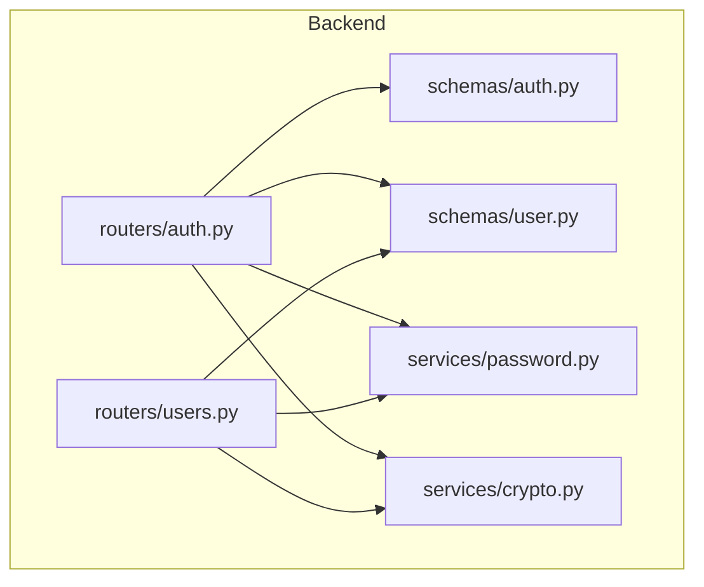
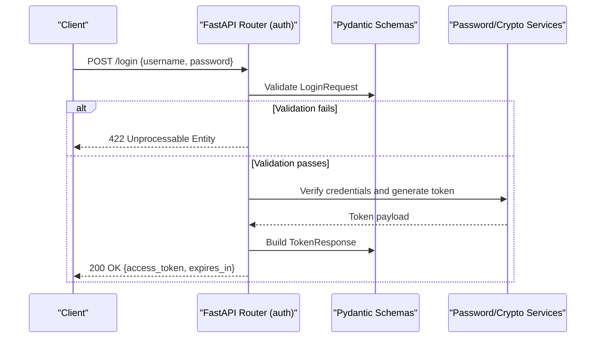
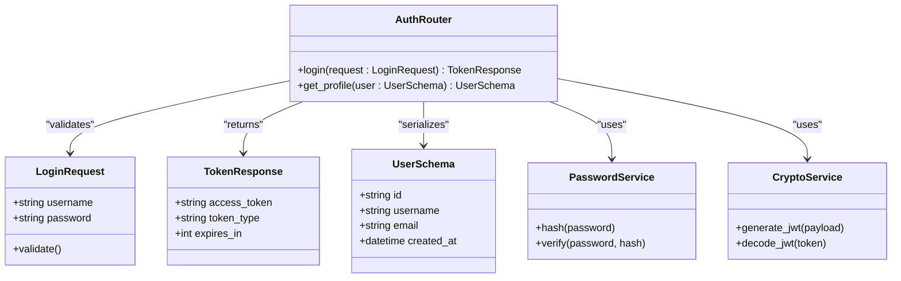

# Authentication Schemas

<cite>
**Referenced Files in This Document**
- [auth.py](file://backend/app/schemas/auth.py)
- [user.py](file://backend/app/schemas/user.py)
- [password.py](file://backend/app/services/password.py)
- [auth.py](file://backend/app/routers/auth.py)
- [users.py](file://backend/app/routers/users.py)
- [crypto.py](file://backend/app/services/crypto.py)
</cite>

## Table of Contents
1. [Introduction](#introduction)
2. [Project Structure](#project-structure)
3. [Core Components](#core-components)
4. [Architecture Overview](#architecture-overview)
5. [Detailed Component Analysis](#detailed-component-analysis)
6. [Dependency Analysis](#dependency-analysis)
7. [Performance Considerations](#performance-considerations)
8. [Troubleshooting Guide](#troubleshooting-guide)
9. [Conclusion](#conclusion)

## Introduction
This document explains the authentication-related Pydantic schemas used by the backend, focusing on:
- LoginRequest for user authentication input validation
- TokenResponse for JWT token responses
- UserSchema for user profile serialization
- Password and email validation patterns
- Input sanitization strategies
- Usage examples in FastAPI endpoints and custom validators

The goal is to provide a clear understanding of how these schemas enforce correctness, security, and consistency across API requests and responses.

## Project Structure
Authentication-related schemas and services are organized under the backend application:
- Schemas: Pydantic models for request/response validation
- Routers: FastAPI endpoints that consume and produce schema instances
- Services: Utilities for password hashing/verification and cryptographic operations

**Diagram sources**
- [auth.py](file://backend/app/schemas/auth.py)
- [user.py](file://backend/app/schemas/user.py)
- [password.py](file://backend/app/services/password.py)
- [crypto.py](file://backend/app/services/crypto.py)
- [auth.py](file://backend/app/routers/auth.py)
- [users.py](file://backend/app/routers/users.py)

**Section sources**
- [auth.py](file://backend/app/schemas/auth.py)
- [user.py](file://backend/app/schemas/user.py)
- [password.py](file://backend/app/services/password.py)
- [crypto.py](file://backend/app/services/crypto.py)
- [auth.py](file://backend/app/routers/auth.py)
- [users.py](file://backend/app/routers/users.py)

## Core Components
This section summarizes the key Pydantic schemas involved in authentication:
- LoginRequest: Validates username and password inputs for login endpoints
- TokenResponse: Represents JWT access tokens and expiration metadata returned by auth endpoints
- UserSchema: Serializes user profile data for authenticated endpoints and admin views

These schemas integrate with FastAPI’s automatic request/response validation and OpenAPI documentation generation.

**Section sources**
- [auth.py](file://backend/app/schemas/auth.py)
- [user.py](file://backend/app/schemas/user.py)

## Architecture Overview
The authentication flow uses Pydantic schemas at the boundaries of FastAPI endpoints:
- Clients send JSON payloads validated against LoginRequest
- The router invokes service functions to verify credentials and issue tokens
- Responses are serialized using TokenResponse or UserSchema

**Diagram sources**
- [auth.py](file://backend/app/routers/auth.py)
- [auth.py](file://backend/app/schemas/auth.py)
- [password.py](file://backend/app/services/password.py)
- [crypto.py](file://backend/app/services/crypto.py)

## Detailed Component Analysis

### LoginRequest Schema
Purpose:
- Enforces presence and format of username and password fields
- Provides consistent error messages when validation fails
- Integrates with FastAPI to return structured 422 errors

Validation rules:
- Username: required string; may include length constraints and allowed character sets
- Password: required string; may include minimum length and complexity requirements

Error handling:
- FastAPI returns detailed field-level errors for missing or invalid fields
- Custom validators can add domain-specific checks (e.g., account lockout indicators)

Usage example:
- Endpoint parameter annotated with LoginRequest
- Automatic parsing and validation before handler execution

**Section sources**
- [auth.py](file://backend/app/schemas/auth.py)
- [auth.py](file://backend/app/routers/auth.py)

### TokenResponse Schema
Purpose:
- Standardizes JWT token response structure
- Includes token value and expiration metadata

Fields:
- access_token: string containing the JWT
- token_type: typically "bearer"
- expires_in: integer seconds until expiration

Serialization rules:
- Ensures only safe, serializable types are exposed
- Aligns with client-side token storage and refresh logic

Usage example:
- Returned from login endpoint after successful credential verification
- Used by clients to set Authorization headers for subsequent requests

**Section sources**
- [auth.py](file://backend/app/schemas/auth.py)
- [auth.py](file://backend/app/routers/auth.py)

### UserSchema
Purpose:
- Serializes user profile data for authenticated routes and admin endpoints
- Exposes only necessary fields while enforcing constraints

Constraints:
- Field types and optional/required status defined explicitly
- May include read-only fields populated by services or database models

Serialization rules:
- Omits sensitive data such as passwords or secrets
- Supports nested structures if needed (e.g., roles, preferences)

Usage example:
- Returned by user profile endpoints
- Consumed by frontend components to display user information

**Section sources**
- [user.py](file://backend/app/schemas/user.py)
- [users.py](file://backend/app/routers/users.py)

### Password Validation and Sanitization
Patterns:
- Minimum length enforcement
- Complexity requirements (e.g., uppercase, lowercase, digits, special characters)
- Rejection of common or leaked passwords via external checks (if integrated)

Sanitization:
- Trim whitespace from usernames and emails
- Normalize case where appropriate (e.g., lowercasing usernames)
- Reject control characters and disallowed Unicode ranges

Integration points:
- Custom validators attached to Pydantic fields
- Service-layer checks for additional business rules

**Section sources**
- [password.py](file://backend/app/services/password.py)
- [auth.py](file://backend/app/schemas/auth.py)

### Email Validation Patterns
Patterns:
- RFC-compliant email regex or library-based validation
- Domain existence checks (optional, via DNS lookup)
- Local part restrictions (length, allowed characters)

Sanitization:
- Lowercase normalization for storage and comparison
- Removal of leading/trailing whitespace

Integration points:
- Applied during user registration and profile updates
- Validated in both request schemas and service layers

**Section sources**
- [user.py](file://backend/app/schemas/user.py)
- [password.py](file://backend/app/services/password.py)

### Integration with FastAPI Request/Response Validation
How it works:
- Endpoints declare parameters typed with Pydantic schemas
- FastAPI automatically parses JSON bodies, validates fields, and returns 422 errors with details
- Response models ensure consistent output shapes and exclude internal fields

Best practices:
- Keep schemas focused and minimal
- Use descriptive field names and helpful error messages
- Separate input schemas from output schemas to avoid leaking sensitive data

**Section sources**
- [auth.py](file://backend/app/routers/auth.py)
- [users.py](file://backend/app/routers/users.py)
- [auth.py](file://backend/app/schemas/auth.py)
- [user.py](file://backend/app/schemas/user.py)

### Custom Validators and Error Handling
Custom validators:
- Implement field-level or model-level checks
- Raise ValueError or use pydantic.ValidationError for structured feedback
- Combine multiple validations into reusable functions

Error handling:
- Centralize error formatting for consistent API behavior
- Map validation failures to user-friendly messages
- Log security-relevant events without exposing sensitive details

Example flows:
- Password strength validation returning specific failure reasons
- Account lockout checks based on failed attempts

**Section sources**
- [password.py](file://backend/app/services/password.py)
- [crypto.py](file://backend/app/services/crypto.py)
- [auth.py](file://backend/app/schemas/auth.py)

## Dependency Analysis
Relationships between authentication components:

**Diagram sources**
- [auth.py](file://backend/app/schemas/auth.py)
- [user.py](file://backend/app/schemas/user.py)
- [auth.py](file://backend/app/routers/auth.py)
- [users.py](file://backend/app/routers/users.py)
- [password.py](file://backend/app/services/password.py)
- [crypto.py](file://backend/app/services/crypto.py)

**Section sources**
- [auth.py](file://backend/app/schemas/auth.py)
- [user.py](file://backend/app/schemas/user.py)
- [auth.py](file://backend/app/routers/auth.py)
- [users.py](file://backend/app/routers/users.py)
- [password.py](file://backend/app/services/password.py)
- [crypto.py](file://backend/app/services/crypto.py)

## Performance Considerations
- Prefer lightweight validation in request schemas; defer heavy checks to background jobs
- Cache expensive operations like DNS lookups for email domain checks
- Avoid unnecessary object conversions; pass validated data directly to services
- Use streaming or pagination for large user lists to reduce memory pressure

[No sources needed since this section provides general guidance]

## Troubleshooting Guide
Common issues and resolutions:
- 422 Validation Errors: Inspect field-level messages; ensure required fields are present and meet constraints
- Invalid JWT: Verify token signing configuration and expiration settings
- Password Policy Failures: Confirm complexity rules and any external password checks
- Email Normalization Problems: Ensure trimming and lowercasing are applied consistently

Debugging tips:
- Enable detailed request logging for payloads and responses
- Add structured logs around validation and token generation steps
- Use test fixtures to reproduce edge cases in password and email validation

**Section sources**
- [auth.py](file://backend/app/routers/auth.py)
- [password.py](file://backend/app/services/password.py)
- [crypto.py](file://backend/app/services/crypto.py)

## Conclusion
The authentication schemas provide a robust foundation for secure and consistent API interactions. By leveraging Pydantic’s validation and FastAPI’s integration, the system enforces strong input contracts, produces predictable outputs, and supports extensible validation through custom validators and service-layer checks. Adhering to the patterns outlined here will improve reliability, security, and developer experience across the platform.

[No sources needed since this section summarizes without analyzing specific files]