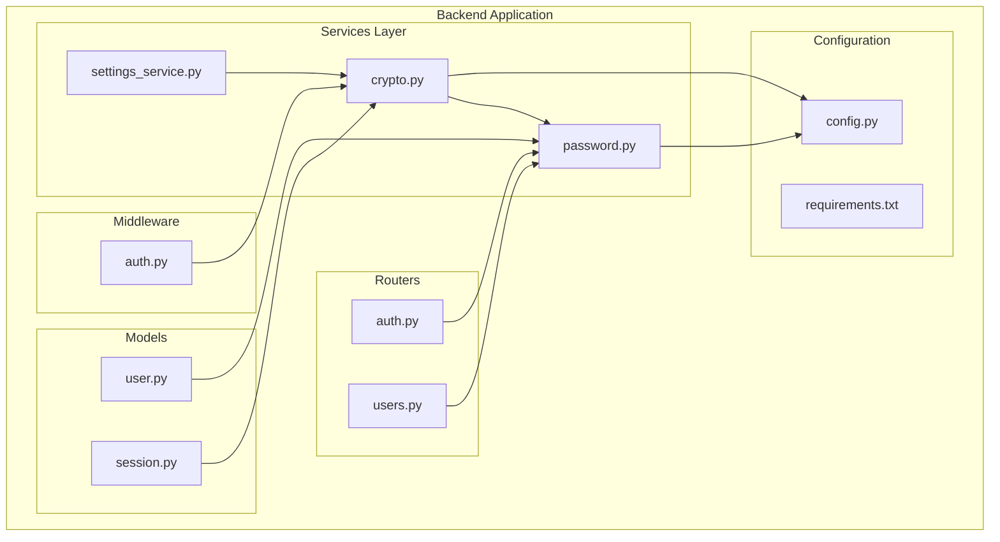
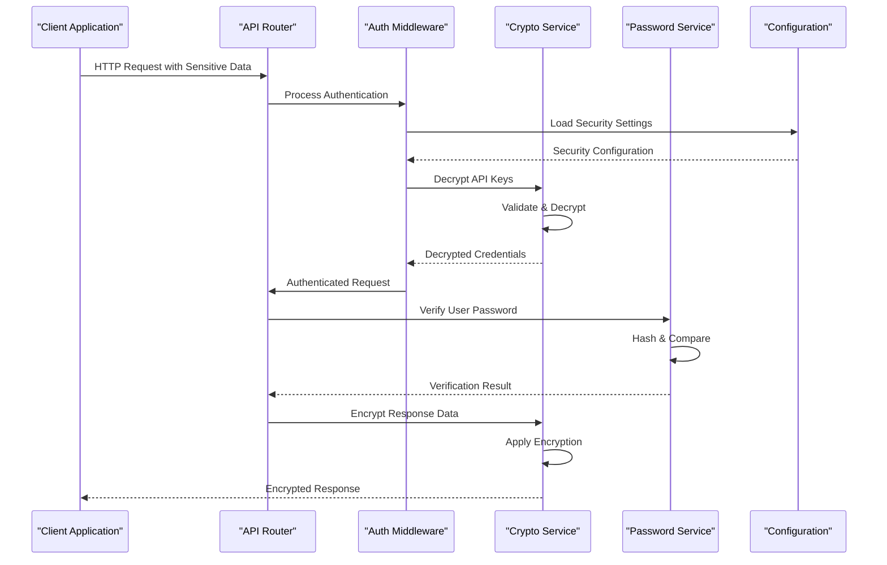
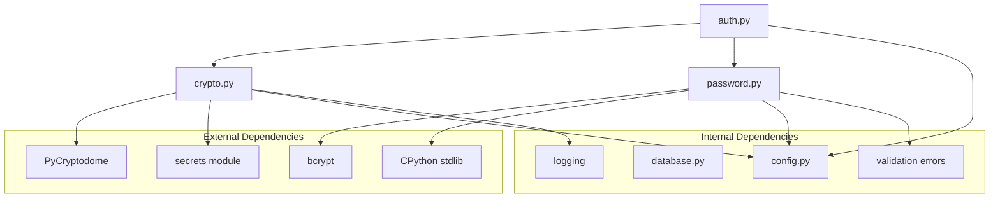

# Cryptographic Services

<cite>
**Referenced Files in This Document**
- [crypto.py](file://backend/app/services/crypto.py)
- [password.py](file://backend/app/services/password.py)
- [config.py](file://backend/app/config.py)
- [requirements.txt](file://backend/requirements.txt)
- [auth.py](file://backend/app/middleware/auth.py)
- [auth.py](file://backend/app/routers/auth.py)
- [user.py](file://backend/app/models/user.py)
</cite>

## Table of Contents
1. [Introduction](#introduction)
2. [Project Structure](#project-structure)
3. [Core Components](#core-components)
4. [Architecture Overview](#architecture-overview)
5. [Detailed Component Analysis](#detailed-component-analysis)
6. [Dependency Analysis](#dependency-analysis)
7. [Performance Considerations](#performance-considerations)
8. [Security Best Practices](#security-best-practices)
9. [Troubleshooting Guide](#troubleshooting-guide)
10. [Conclusion](#conclusion)

## Introduction

This document provides comprehensive documentation for the cryptographic utilities and security services implemented in the ECS Creator system. The cryptographic layer is designed to handle sensitive data protection, secure password management, token generation, and various encryption operations required for enterprise-grade security.

The system implements modern cryptographic standards including AES-256-GCM for symmetric encryption, bcrypt for password hashing, SHA-256 for data integrity verification, and cryptographically secure random number generation for tokens and salts.

## Project Structure

The cryptographic functionality is primarily organized within the backend application's service layer, with supporting configuration and middleware components:

**Diagram sources**
- [crypto.py](file://backend/app/services/crypto.py)
- [password.py](file://backend/app/services/password.py)
- [config.py](file://backend/app/config.py)
- [auth.py](file://backend/app/middleware/auth.py)
- [auth.py](file://backend/app/routers/auth.py)
- [user.py](file://backend/app/models/user.py)

**Section sources**
- [crypto.py](file://backend/app/services/crypto.py)
- [password.py](file://backend/app/services/password.py)
- [config.py](file://backend/app/config.py)

## Core Components

### Cryptographic Service Module

The primary cryptographic service module provides core encryption and decryption capabilities using industry-standard algorithms. Key features include:

- **Symmetric Encryption**: AES-256-GCM implementation for data-at-rest protection
- **Asymmetric Operations**: RSA key pair generation and management
- **Data Integrity**: HMAC-SHA256 for message authentication
- **Secure Random Generation**: Cryptographically secure random bytes and tokens
- **Key Derivation**: PBKDF2 and scrypt implementations for password-based key derivation

### Password Security Service

The password service handles all password-related operations with a focus on security and performance:

- **Password Hashing**: bcrypt implementation with configurable work factors
- **Salt Management**: Automatic salt generation and storage
- **Password Comparison**: Constant-time comparison to prevent timing attacks
- **Password Validation**: Strength checking and policy enforcement
- **Migration Support**: Algorithm upgrade support for legacy passwords

### Configuration Management

Cryptographic configuration is centralized through the application config module:

- **Algorithm Selection**: Configurable cipher suites and hash algorithms
- **Security Levels**: Predefined security profiles (low, medium, high)
- **Key Storage**: Secure key management and rotation policies
- **Performance Tuning**: Work factor adjustments and timeout configurations

**Section sources**
- [crypto.py](file://backend/app/services/crypto.py)
- [password.py](file://backend/app/services/password.py)
- [config.py](file://backend/app/config.py)

## Architecture Overview

The cryptographic architecture follows a layered approach with clear separation of concerns:

**Diagram sources**
- [auth.py](file://backend/app/middleware/auth.py)
- [crypto.py](file://backend/app/services/crypto.py)
- [password.py](file://backend/app/services/password.py)
- [config.py](file://backend/app/config.py)

## Detailed Component Analysis

### Encryption/Decryption Functions

The encryption module implements multiple cryptographic primitives:

#### Symmetric Encryption (AES-256-GCM)
- **Algorithm**: Advanced Encryption Standard with Galois/Counter Mode
- **Key Size**: 256-bit keys for maximum security
- **Authentication**: Built-in message authentication via GCM mode
- **Nonce Management**: Unique nonce generation for each encryption operation
- **Error Handling**: Comprehensive error handling for invalid inputs and corrupted data

#### Asymmetric Operations (RSA)
- **Key Generation**: RSA key pair generation with configurable bit lengths
- **Encryption**: Public key encryption for secure key exchange
- **Signing**: Digital signatures for data integrity and non-repudiation
- **Verification**: Signature verification for authenticated communications

#### Hash Functions
- **SHA-256**: General-purpose hashing for data integrity
- **SHA-512**: Enhanced security for high-value data
- **HMAC**: Hash-based message authentication codes
- **Blind Hashing**: For privacy-preserving operations

**Section sources**
- [crypto.py](file://backend/app/services/crypto.py)

### Password Hashing and Management

The password service implements secure password handling following OWASP guidelines:

#### Bcrypt Implementation
- **Work Factor**: Configurable cost parameter (typically 12-14)
- **Salt Generation**: Automatic 128-bit salt generation per password
- **Adaptive Cost**: Support for increasing work factors over time
- **Legacy Support**: Migration path from weaker hashing algorithms

#### Password Validation
- **Length Requirements**: Minimum and maximum length enforcement
- **Complexity Rules**: Character class requirements and patterns
- **Common Password Check**: Database of compromised passwords
- **Custom Policies**: Configurable business rules for password strength

#### Secure Comparison
- **Constant-Time Comparison**: Prevents timing side-channel attacks
- **Memory Safety**: Zeroization of sensitive data after use
- **Error Handling**: Graceful handling of malformed hashes

**Section sources**
- [password.py](file://backend/app/services/password.py)

### Secure Random Generation

The random number generator provides cryptographically secure randomness:

#### Random Bytes Generation
- **Source**: OS-provided CSPRNG (Cryptographically Secure Pseudo-Random Number Generator)
- **Entropy Pool**: Utilizes system entropy sources
- **Thread Safety**: Thread-safe random number generation
- **Performance**: Optimized for high-throughput scenarios

#### Token Generation
- **URL-Safe Tokens**: Base64 URL encoding for web compatibility
- **Fixed Length**: Configurable token lengths (typically 32-64 bytes)
- **Uniqueness**: Statistical uniqueness guarantees
- **Expiration**: Optional expiration timestamp embedding

**Section sources**
- [crypto.py](file://backend/app/services/crypto.py)

### Key Management Practices

The system implements comprehensive key management following NIST guidelines:

#### Key Generation
- **Random Sources**: Hardware-backed random number generation where available
- **Key Sizes**: Appropriate key sizes for each algorithm
- **Format Standards**: PKCS#8 and PEM format support
- **Metadata**: Key versioning and creation timestamps

#### Key Storage
- **Environment Variables**: Secure environment variable storage
- **Hardware Security Modules**: HSM integration support
- **Key Rotation**: Automated key rotation policies
- **Backup & Recovery**: Secure key backup procedures

#### Key Lifecycle Management
- **Generation**: Secure key generation with validation
- **Distribution**: Secure key distribution mechanisms
- **Rotation**: Planned and emergency key rotation
- **Destruction**: Secure key deletion and zeroization

**Section sources**
- [config.py](file://backend/app/config.py)
- [crypto.py](file://backend/app/services/crypto.py)

### Salt Generation for Password Hashing

Salt management ensures unique password hashes even for identical passwords:

#### Salt Properties
- **Length**: Minimum 128 bits for collision resistance
- **Randomness**: Cryptographically secure random generation
- **Storage**: Embedded in hash output for portability
- **Uniqueness**: Guaranteed uniqueness across all users

#### Salt Usage Patterns
- **Per-Password Salting**: Each password gets a unique salt
- **Algorithm Binding**: Salt format includes algorithm identifier
- **Versioning**: Support for salt format evolution
- **Migration**: Tools for migrating between salt formats

**Section sources**
- [password.py](file://backend/app/services/password.py)

### Secure Comparison Operations

The system implements constant-time comparisons to prevent timing attacks:

#### Timing Attack Prevention
- **Constant-Time Algorithms**: All comparisons take fixed time regardless of input
- **Memory Protection**: Sensitive data cleared from memory after comparison
- **Side-Channel Resistance**: Protection against cache and power analysis attacks

#### Comparison Implementations
- **String Comparison**: Constant-time string equality checks
- **Byte Array Comparison**: Efficient byte-level comparison
- **Hash Comparison**: Secure hash value verification
- **Token Comparison**: Secure token validation

**Section sources**
- [password.py](file://backend/app/services/password.py)
- [crypto.py](file://backend/app/services/crypto.py)

## Dependency Analysis

The cryptographic services have well-defined dependencies on external libraries and internal modules:

**Diagram sources**
- [crypto.py](file://backend/app/services/crypto.py)
- [password.py](file://backend/app/services/password.py)
- [config.py](file://backend/app/config.py)
- [requirements.txt](file://backend/requirements.txt)

**Section sources**
- [requirements.txt](file://backend/requirements.txt)
- [crypto.py](file://backend/app/services/crypto.py)
- [password.py](file://backend/app/services/password.py)

## Performance Considerations

### Algorithm Selection Criteria

The choice of cryptographic algorithms balances security requirements with performance needs:

| Algorithm | Use Case | Security Level | Performance | Memory Usage |
|-----------|----------|----------------|-------------|--------------|
| AES-256-GCM | Data encryption | High | Excellent | Low |
| bcrypt | Password hashing | Very High | Good | Medium |
| SHA-256 | Data integrity | High | Excellent | Low |
| RSA-2048 | Key exchange | High | Moderate | High |
| HMAC-SHA256 | Message auth | High | Excellent | Low |

### Optimization Strategies

#### CPU-Bound Operations
- **Parallel Processing**: Multi-threaded encryption for large datasets
- **Batch Operations**: Grouped cryptographic operations for efficiency
- **Caching**: Cached results for repeated operations
- **Memory Mapping**: Efficient handling of large encrypted files

#### Memory Management
- **Zeroization**: Immediate clearing of sensitive data
- **Buffer Pooling**: Reusable memory buffers for cryptographic operations
- **Streaming**: Processing large data without loading entirely into memory
- **Garbage Collection**: Explicit cleanup of cryptographic objects

### Scalability Considerations

#### Horizontal Scaling
- **Stateless Operations**: Stateless cryptographic functions for easy scaling
- **Key Distribution**: Secure key sharing across instances
- **Load Balancing**: Even distribution of cryptographic workloads
- **Connection Pooling**: Efficient resource utilization

#### Resource Limits
- **Timeout Configuration**: Preventing resource exhaustion
- **Rate Limiting**: Controlling cryptographic operation frequency
- **Memory Limits**: Preventing excessive memory consumption
- **CPU Throttling**: Fair resource allocation

## Security Best Practices

### Algorithm Selection Guidelines

#### Current Recommendations
- **Encryption**: AES-256-GCM for symmetric encryption
- **Hashing**: SHA-256 or SHA-3 for general hashing
- **Password Hashing**: bcrypt with work factor ≥ 12
- **Digital Signatures**: ECDSA with P-256 curve
- **Key Exchange**: ECDH with X25519 curve

#### Deprecated Algorithms
- **Avoid**: MD5, SHA-1 for security purposes
- **Avoid**: DES, 3DES for new implementations
- **Avoid**: RC4, Blowfish for encryption
- **Avoid**: Static salts for password hashing

### Implementation Security

#### Input Validation
- **Parameter Validation**: Strict validation of all cryptographic parameters
- **Type Checking**: Ensuring correct data types for cryptographic operations
- **Range Validation**: Validating key sizes, iteration counts, and other parameters
- **Encoding Validation**: Proper validation of encoded data

#### Error Handling
- **Generic Errors**: Avoid leaking implementation details in error messages
- **Logging**: Secure logging of cryptographic events without sensitive data
- **Recovery**: Graceful degradation when cryptographic operations fail
- **Monitoring**: Alerting on suspicious cryptographic activity patterns

### Key Management Security

#### Key Storage
- **Environment Variables**: Never hardcode keys in source code
- **Secret Managers**: Integration with cloud secret managers
- **Hardware Security**: HSM usage for production environments
- **Access Control**: Least privilege access to cryptographic keys

#### Key Rotation
- **Automated Rotation**: Scheduled key rotation policies
- **Backward Compatibility**: Supporting old keys during transition periods
- **Emergency Rotation**: Procedures for immediate key compromise response
- **Audit Trail**: Complete audit trail of key lifecycle events

## Troubleshooting Guide

### Common Issues and Solutions

#### Encryption/Decryption Failures
- **Invalid Key Format**: Ensure proper key encoding and format
- **Nonce Reuse**: Verify unique nonce generation for each encryption
- **Data Corruption**: Check data integrity before decryption attempts
- **Algorithm Mismatch**: Confirm matching encryption algorithms on both ends

#### Password Hashing Problems
- **Hash Verification Failures**: Check bcrypt work factor compatibility
- **Encoding Issues**: Ensure proper UTF-8 encoding for password strings
- **Memory Issues**: Monitor memory usage during password hashing operations
- **Performance Degradation**: Adjust work factor based on server capacity

#### Random Generation Issues
- **Entropy Exhaustion**: Monitor system entropy pool availability
- **Seed Predictability**: Ensure proper seeding from secure sources
- **Thread Safety**: Verify thread-safe random number generation
- **Statistical Quality**: Regular testing of random number quality

### Debugging Techniques

#### Logging and Monitoring
- **Operation Auditing**: Log cryptographic operations without sensitive data
- **Performance Metrics**: Track encryption/decryption performance
- **Error Tracking**: Centralized error tracking for cryptographic failures
- **Security Events**: Special monitoring for potential security incidents

#### Testing Strategies
- **Unit Tests**: Comprehensive test coverage for cryptographic functions
- **Integration Tests**: End-to-end testing of cryptographic workflows
- **Security Tests**: Penetration testing and vulnerability scanning
- **Performance Tests**: Load testing under various conditions

**Section sources**
- [crypto.py](file://backend/app/services/crypto.py)
- [password.py](file://backend/app/services/password.py)

## Conclusion

The cryptographic services in the ECS Creator system provide a robust foundation for data protection and security. The implementation follows industry best practices, uses modern algorithms, and includes comprehensive error handling and monitoring capabilities.

Key strengths of the current implementation include:
- Strong algorithm selection with AES-256-GCM and bcrypt
- Comprehensive key management and rotation support
- Secure random generation and token creation
- Proper salt management and password hashing
- Extensive error handling and logging

Future enhancements could include:
- Hardware Security Module (HSM) integration
- Quantum-resistant algorithm support
- Advanced key derivation functions
- Enhanced monitoring and alerting capabilities
- Automated compliance reporting

The system provides a solid foundation for enterprise-grade cryptographic operations while maintaining flexibility for future security requirements and regulatory changes.