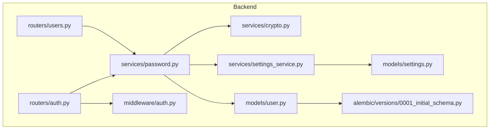
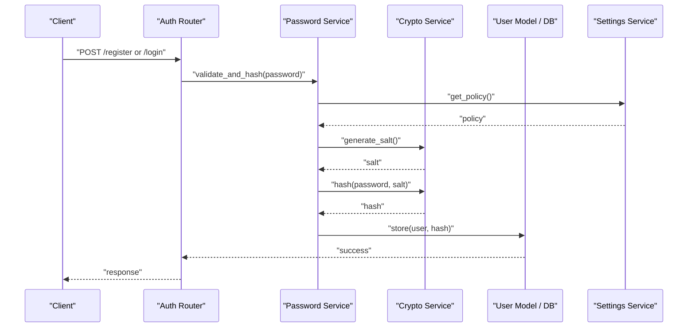
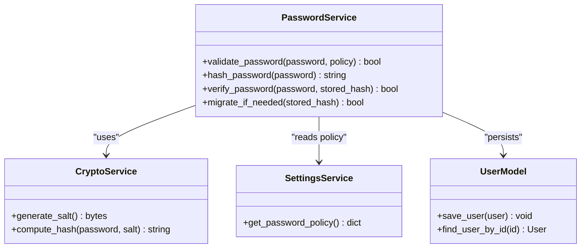
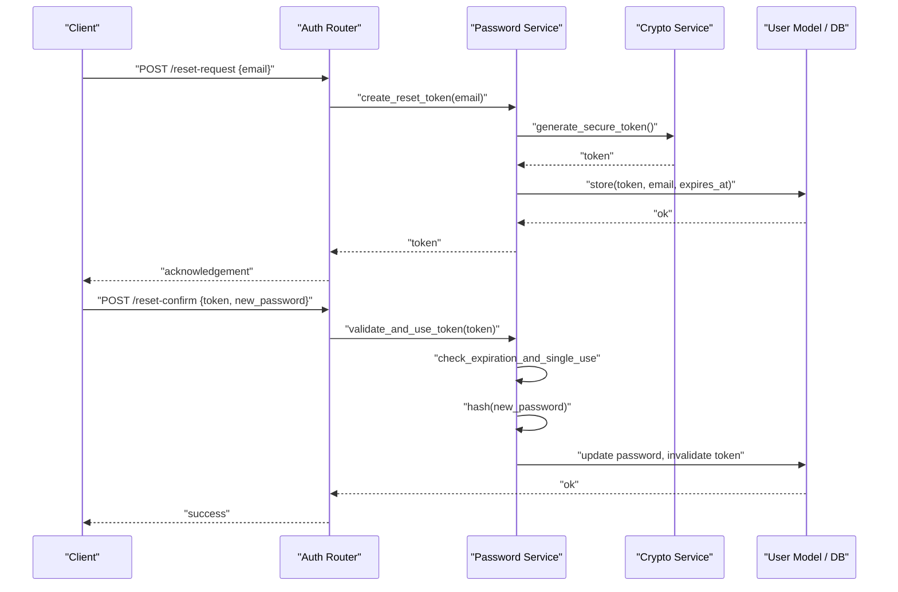
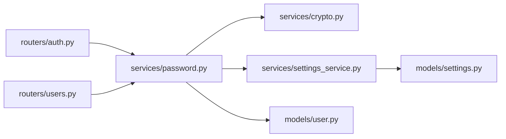

# Password Management

<cite>
**Referenced Files in This Document**
- [password.py](file://backend/app/services/password.py)
- [crypto.py](file://backend/app/services/crypto.py)
- [user.py](file://backend/app/models/user.py)
- [auth.py](file://backend/app/routers/auth.py)
- [users.py](file://backend/app/routers/users.py)
- [auth.py](file://backend/app/middleware/auth.py)
- [settings_service.py](file://backend/app/services/settings_service.py)
- [settings.py](file://backend/app/models/settings.py)
- [alembic.ini](file://backend/alembic.ini)
- [0001_initial_schema.py](file://backend/alembic/versions/0001_initial_schema.py)
</cite>

## Table of Contents
1. [Introduction](#introduction)
2. [Project Structure](#project-structure)
3. [Core Components](#core-components)
4. [Architecture Overview](#architecture-overview)
5. [Detailed Component Analysis](#detailed-component-analysis)
6. [Dependency Analysis](#dependency-analysis)
7. [Performance Considerations](#performance-considerations)
8. [Troubleshooting Guide](#troubleshooting-guide)
9. [Conclusion](#conclusion)
10. [Appendices](#appendices)

## Introduction
This document explains how passwords are managed and validated across the system, focusing on hashing algorithms, salt generation, secure storage, validation rules, reset workflows, token handling, and security considerations such as brute-force protection and policy compliance. It also provides guidance for implementing custom validators, integrating with external strength checkers, and migrating password hashes safely.

## Project Structure
Password-related functionality is implemented primarily within backend services and routers:
- Services: password hashing/validation and cryptographic utilities
- Models: user entity and settings used by password policies
- Routers: authentication endpoints and user management
- Middleware: request-time authentication enforcement
- Database migrations: schema definitions including password fields

**Diagram sources**
- [password.py](file://backend/app/services/password.py)
- [crypto.py](file://backend/app/services/crypto.py)
- [user.py](file://backend/app/models/user.py)
- [auth.py](file://backend/app/routers/auth.py)
- [users.py](file://backend/app/routers/users.py)
- [auth.py](file://backend/app/middleware/auth.py)
- [settings_service.py](file://backend/app/services/settings_service.py)
- [settings.py](file://backend/app/models/settings.py)
- [0001_initial_schema.py](file://backend/alembic/versions/0001_initial_schema.py)

**Section sources**
- [password.py](file://backend/app/services/password.py)
- [crypto.py](file://backend/app/services/crypto.py)
- [user.py](file://backend/app/models/user.py)
- [auth.py](file://backend/app/routers/auth.py)
- [users.py](file://backend/app/routers/users.py)
- [auth.py](file://backend/app/middleware/auth.py)
- [settings_service.py](file://backend/app/services/settings_service.py)
- [settings.py](file://backend/app/models/settings.py)
- [0001_initial_schema.py](file://backend/alembic/versions/0001_initial_schema.py)

## Core Components
- Password service: centralizes hashing, verification, and validation logic; coordinates with crypto utilities and configuration.
- Crypto service: provides low-level cryptographic primitives (e.g., random salt generation, hash computation).
- User model: defines the persistent representation of users, including password storage fields.
- Settings service and model: supply configurable password policies (length, complexity, history, etc.).
- Auth router: exposes login, registration, password change, and reset endpoints.
- Users router: admin operations that may trigger password resets or updates.
- Auth middleware: enforces authenticated access to protected routes.

Key responsibilities:
- Hashing and verification using a modern algorithm with per-user salts.
- Validation against policy rules (length, character classes, common lists).
- Secure reset flows with short-lived tokens and single-use semantics.
- Policy-driven behavior via settings.

**Section sources**
- [password.py](file://backend/app/services/password.py)
- [crypto.py](file://backend/app/services/crypto.py)
- [user.py](file://backend/app/models/user.py)
- [settings_service.py](file://backend/app/services/settings_service.py)
- [settings.py](file://backend/app/models/settings.py)
- [auth.py](file://backend/app/routers/auth.py)
- [users.py](file://backend/app/routers/users.py)
- [auth.py](file://backend/app/middleware/auth.py)

## Architecture Overview
The password subsystem follows a layered design:
- API layer (routers) orchestrates requests and responses.
- Service layer encapsulates business logic for hashing, validation, and reset flows.
- Data layer persists user credentials and related metadata.
- Configuration layer supplies policy parameters.

**Diagram sources**
- [auth.py](file://backend/app/routers/auth.py)
- [password.py](file://backend/app/services/password.py)
- [crypto.py](file://backend/app/services/crypto.py)
- [user.py](file://backend/app/models/user.py)
- [settings_service.py](file://backend/app/services/settings_service.py)

## Detailed Component Analysis

### Password Service
Responsibilities:
- Enforce password policy from settings.
- Validate complexity rules (length, character classes, common list checks).
- Generate secure salts and compute hashes.
- Verify passwords against stored hashes.
- Support migration helpers if needed.

Implementation highlights:
- Uses a modern hashing algorithm with per-user random salts.
- Applies configurable constraints (minimum length, required character categories).
- Optionally integrates with an external strength checker via a pluggable interface.
- Provides helper functions for one-way verification and batch migration support.

Security notes:
- Never log raw passwords or secrets.
- Use constant-time comparison where applicable during verification.
- Ensure salts are unique and sufficiently long.

**Section sources**
- [password.py](file://backend/app/services/password.py)
- [settings_service.py](file://backend/app/services/settings_service.py)
- [settings.py](file://backend/app/models/settings.py)

#### Class Diagram

**Diagram sources**
- [password.py](file://backend/app/services/password.py)
- [crypto.py](file://backend/app/services/crypto.py)
- [settings_service.py](file://backend/app/services/settings_service.py)
- [user.py](file://backend/app/models/user.py)

### Crypto Service
Responsibilities:
- Provide secure random salt generation.
- Compute password hashes using the configured algorithm.

Security notes:
- Use cryptographically secure RNG for salts.
- Avoid deprecated or weak algorithms.

**Section sources**
- [crypto.py](file://backend/app/services/crypto.py)

### User Model
Responsibilities:
- Define fields for storing hashed passwords and related metadata (e.g., last password change timestamp).
- Provide ORM methods for retrieval and persistence.

Schema alignment:
- The initial Alembic migration defines the core tables and columns used by the user model.

**Section sources**
- [user.py](file://backend/app/models/user.py)
- [0001_initial_schema.py](file://backend/alembic/versions/0001_initial_schema.py)

### Authentication Router
Responsibilities:
- Expose endpoints for login, registration, password change, and password reset.
- Coordinate with the password service for hashing and validation.
- Issue temporary tokens for reset flows and enforce expiration and single-use semantics.

Typical flows:
- Registration: validate input, hash password, store user.
- Login: verify credentials, issue session/token.
- Change password: authenticate current password, apply policy, hash new password.
- Reset password: generate token, send notification, allow one-time use to set new password.

**Section sources**
- [auth.py](file://backend/app/routers/auth.py)
- [password.py](file://backend/app/services/password.py)

#### Sequence Diagram: Password Reset Flow

**Diagram sources**
- [auth.py](file://backend/app/routers/auth.py)
- [password.py](file://backend/app/services/password.py)
- [crypto.py](file://backend/app/services/crypto.py)
- [user.py](file://backend/app/models/user.py)

### Users Router
Responsibilities:
- Admin operations for managing users, including forced password resets.
- May trigger policy checks and re-hashing when updating credentials.

**Section sources**
- [users.py](file://backend/app/routers/users.py)
- [password.py](file://backend/app/services/password.py)

### Auth Middleware
Responsibilities:
- Enforce authentication on protected routes.
- Validate sessions/tokens before allowing access to sensitive endpoints.

**Section sources**
- [auth.py](file://backend/app/middleware/auth.py)

### Settings Service and Model
Responsibilities:
- Provide centralized configuration for password policies (length, complexity, history, rotation intervals).
- Persist policy settings and expose them to the password service.

**Section sources**
- [settings_service.py](file://backend/app/services/settings_service.py)
- [settings.py](file://backend/app/models/settings.py)

## Dependency Analysis
High-level dependencies among components:
- Routers depend on the password service for all credential operations.
- Password service depends on crypto service for randomness and hashing.
- Password service reads policy from settings service/model.
- User model persists credentials and related metadata.

**Diagram sources**
- [auth.py](file://backend/app/routers/auth.py)
- [users.py](file://backend/app/routers/users.py)
- [password.py](file://backend/app/services/password.py)
- [crypto.py](file://backend/app/services/crypto.py)
- [settings_service.py](file://backend/app/services/settings_service.py)
- [settings.py](file://backend/app/models/settings.py)
- [user.py](file://backend/app/models/user.py)

**Section sources**
- [auth.py](file://backend/app/routers/auth.py)
- [users.py](file://backend/app/routers/users.py)
- [password.py](file://backend/app/services/password.py)
- [crypto.py](file://backend/app/services/crypto.py)
- [settings_service.py](file://backend/app/services/settings_service.py)
- [settings.py](file://backend/app/models/settings.py)
- [user.py](file://backend/app/models/user.py)

## Performance Considerations
- Hashing cost: Choose an algorithm and work factor appropriate for your environment to balance security and latency.
- Salt generation: Ensure it is fast but uses a secure RNG; avoid blocking the request thread unnecessarily.
- Verification: Use constant-time comparisons to mitigate timing attacks.
- Rate limiting: Apply at the API gateway or router level to protect against brute-force attempts.
- Caching: Do not cache plaintext passwords; consider caching only non-sensitive derived data if necessary.

[No sources needed since this section provides general guidance]

## Troubleshooting Guide
Common issues and resolutions:
- Invalid password errors:
  - Confirm policy constraints (length, complexity) are met.
  - Check whether the password appears on common lists.
- Hash mismatch:
  - Verify the hashing algorithm and parameters match those used at creation time.
  - Ensure salts were generated securely and stored correctly.
- Reset token failures:
  - Check token expiration and single-use enforcement.
  - Confirm token was not reused or tampered with.
- Migration problems:
  - Validate that old hashes can be detected and rehashed under the new scheme.
  - Ensure atomic updates and rollback strategies are in place.

Operational tips:
- Log only high-level outcomes; never log raw passwords or tokens.
- Monitor failed login rates and enable adaptive throttling.
- Keep Alembic migrations up to date and test schema changes in staging.

**Section sources**
- [password.py](file://backend/app/services/password.py)
- [auth.py](file://backend/app/routers/auth.py)
- [0001_initial_schema.py](file://backend/alembic/versions/0001_initial_schema.py)

## Conclusion
The password subsystem centralizes secure hashing, validation, and reset workflows behind well-defined services and routers. By leveraging per-user salts, modern algorithms, policy-driven validation, and robust reset flows, the system balances security, usability, and maintainability. Extensibility points allow integration with external strength checkers and future policy evolution.

[No sources needed since this section summarizes without analyzing specific files]

## Appendices

### Password Validation Rules
- Length constraints: Minimum and maximum lengths enforced by policy.
- Complexity requirements: Required character classes (uppercase, lowercase, digits, symbols).
- Common password detection: Rejects entries found in curated lists.
- History and reuse: Prevents reuse of recent passwords based on policy.

**Section sources**
- [password.py](file://backend/app/services/password.py)
- [settings_service.py](file://backend/app/services/settings_service.py)
- [settings.py](file://backend/app/models/settings.py)

### Custom Validators and Integrations
- Implement a validator function conforming to the service’s expected interface.
- Register the validator with the password service so it runs during validation.
- Integrate with external strength checkers via a thin adapter that returns pass/fail and optional feedback.

**Section sources**
- [password.py](file://backend/app/services/password.py)

### Secure Storage Mechanisms
- Store only hashed values with embedded or separate salt.
- Use a strong, parameterized hashing algorithm suitable for passwords.
- Rotate algorithms/work factors over time through migration helpers.

**Section sources**
- [password.py](file://backend/app/services/password.py)
- [crypto.py](file://backend/app/services/crypto.py)
- [user.py](file://backend/app/models/user.py)

### Brute Force Protection and Compliance
- Enforce rate limiting at the router/gateway layer.
- Lockout or progressive delays after repeated failures.
- Align with organizational password policies and regulatory requirements.

**Section sources**
- [auth.py](file://backend/app/routers/auth.py)
- [auth.py](file://backend/app/middleware/auth.py)
- [settings_service.py](file://backend/app/services/settings_service.py)

### Password Migration Scenarios
- Detect legacy hashes and transparently rehash upon successful verification.
- Provide a background job to migrate existing records.
- Maintain backward compatibility until all accounts are migrated.

**Section sources**
- [password.py](file://backend/app/services/password.py)
- [0001_initial_schema.py](file://backend/alembic/versions/0001_initial_schema.py)
- [alembic.ini](file://backend/alembic.ini)