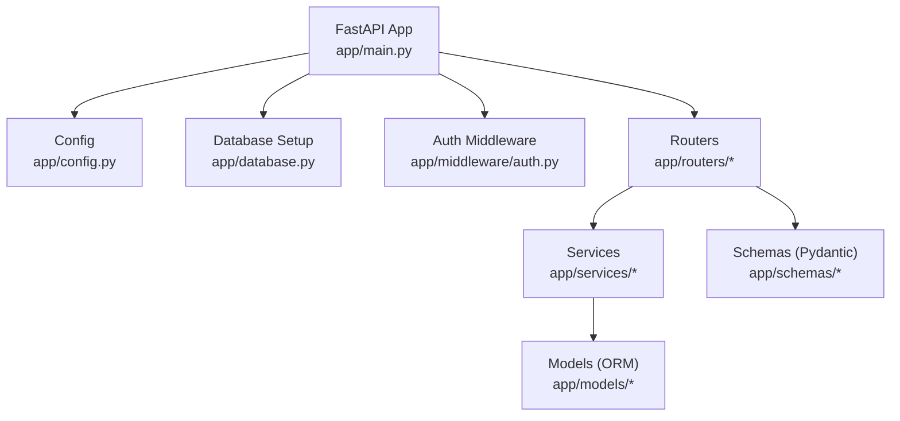
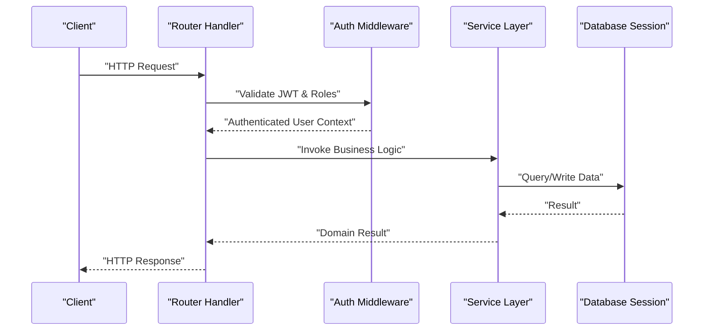
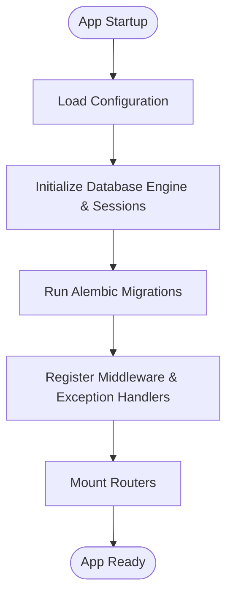
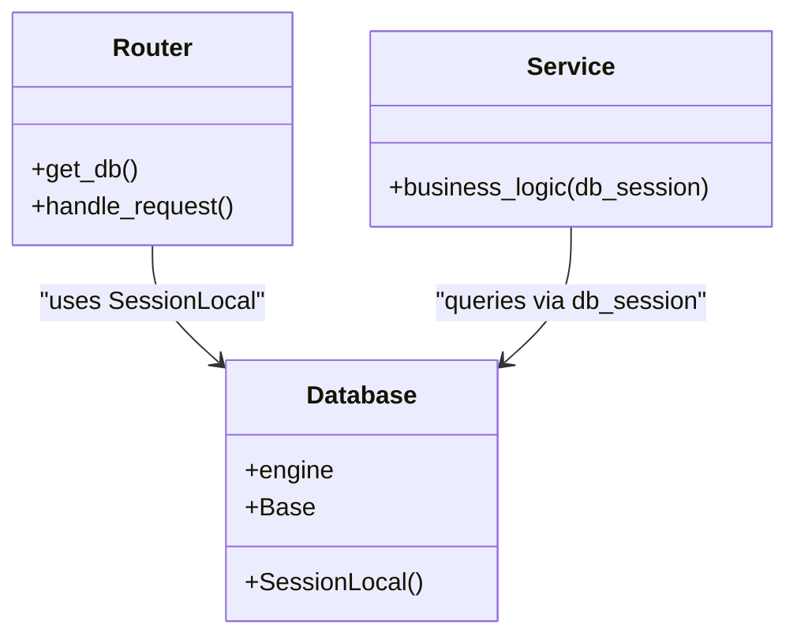
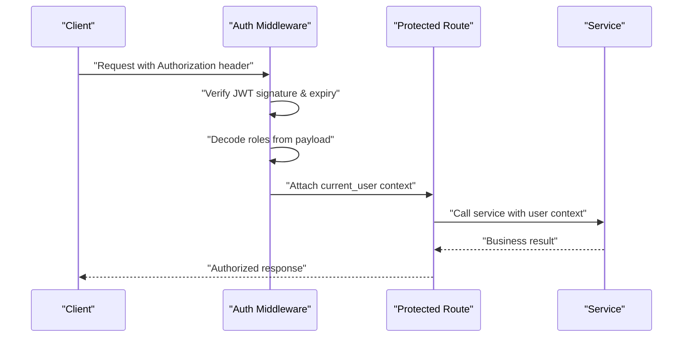
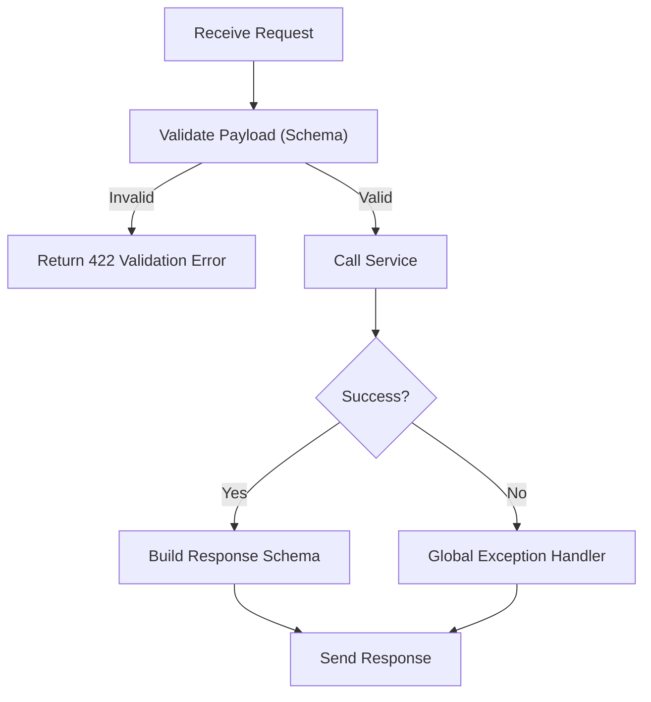
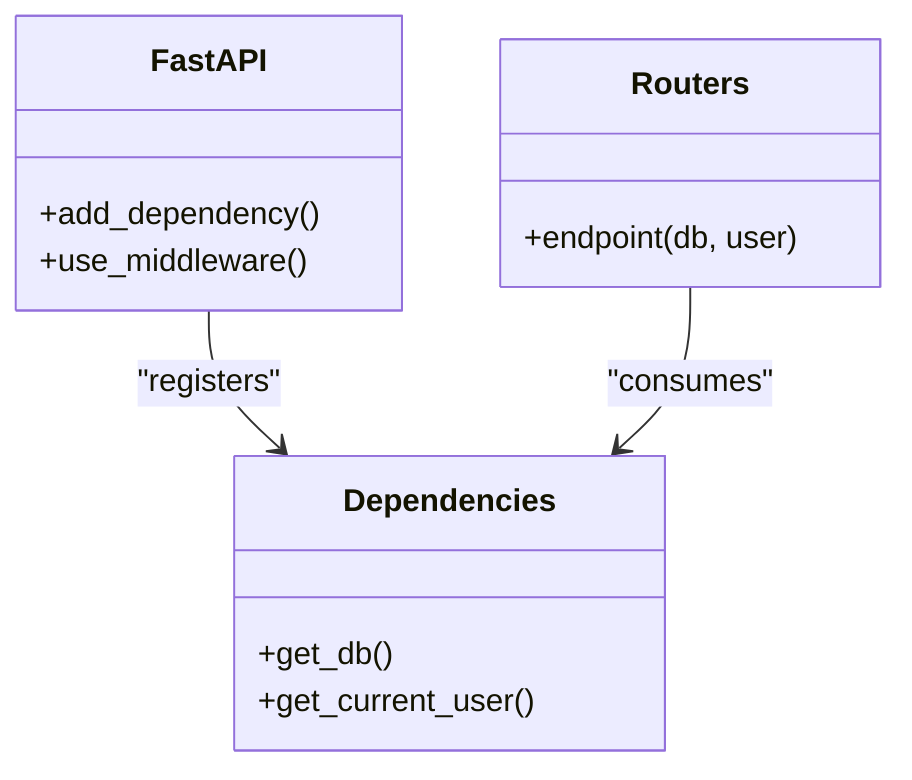
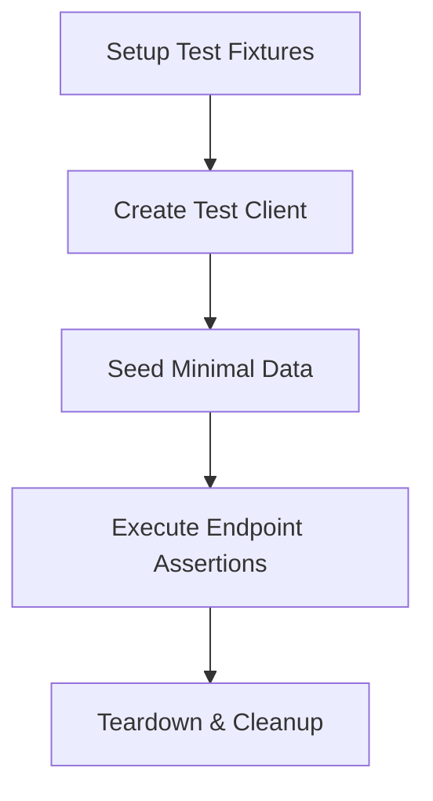
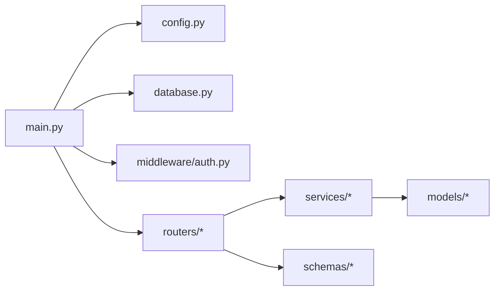

# Backend Development

<cite>
**Referenced Files in This Document**
- [main.py](file://backend/app/main.py)
- [config.py](file://backend/app/config.py)
- [database.py](file://backend/app/database.py)
- [auth.py](file://backend/app/middleware/auth.py)
- [auth.py](file://backend/app/routers/auth.py)
- [users.py](file://backend/app/routers/users.py)
- [settings_service.py](file://backend/app/services/settings_service.py)
- [user.py](file://backend/app/models/user.py)
- [user.py](file://backend/app/schemas/user.py)
- [conftest.py](file://backend/tests/conftest.py)
- [test_system.py](file://backend/tests/test_system.py)
</cite>

## Table of Contents
1. [Introduction](#introduction)
2. [Project Structure](#project-structure)
3. [Core Components](#core-components)
4. [Architecture Overview](#architecture-overview)
5. [Detailed Component Analysis](#detailed-component-analysis)
6. [Dependency Analysis](#dependency-analysis)
7. [Performance Considerations](#performance-considerations)
8. [Troubleshooting Guide](#troubleshooting-guide)
9. [Conclusion](#conclusion)

## Introduction
This document provides comprehensive backend development documentation for the FastAPI application. It explains the modular architecture with clear separation of concerns between routers, services, models, and schemas. It also documents application initialization, configuration management, database connectivity patterns, authentication middleware using JWT tokens and role-based access control, request processing flow, error handling strategies, dependency injection patterns, testing approaches, logging implementation, and performance optimization techniques specific to the backend components.

## Project Structure
The backend is organized by feature and layer:
- app/main.py: Application entry point and startup configuration
- app/config.py: Settings and environment-driven configuration
- app/database.py: Database engine, session factory, and base model setup
- app/middleware/auth.py: Authentication and authorization middleware
- app/routers/*: API route handlers grouped by domain
- app/services/*: Business logic and external integrations
- app/models/*: SQLAlchemy ORM models
- app/schemas/*: Pydantic request/response schemas
- tests/*: Test fixtures and test cases

**Diagram sources**
- [main.py](file://backend/app/main.py)
- [config.py](file://backend/app/config.py)
- [database.py](file://backend/app/database.py)
- [auth.py](file://backend/app/middleware/auth.py)
- [auth.py](file://backend/app/routers/auth.py)
- [users.py](file://backend/app/routers/users.py)
- [settings_service.py](file://backend/app/services/settings_service.py)
- [user.py](file://backend/app/models/user.py)
- [user.py](file://backend/app/schemas/user.py)

**Section sources**
- [main.py](file://backend/app/main.py)
- [config.py](file://backend/app/config.py)
- [database.py](file://backend/app/database.py)
- [auth.py](file://backend/app/middleware/auth.py)
- [auth.py](file://backend/app/routers/auth.py)
- [users.py](file://backend/app/routers/users.py)
- [settings_service.py](file://backend/app/services/settings_service.py)
- [user.py](file://backend/app/models/user.py)
- [user.py](file://backend/app/schemas/user.py)

## Core Components
- Application Initialization: The main module creates the FastAPI instance, mounts routers, configures middleware, and sets up lifespan events for startup/shutdown tasks such as database migrations and cache warm-up.
- Configuration Management: Centralized settings loaded from environment variables or a configuration file, exposing typed settings to the rest of the application.
- Database Connectivity: Engine and session factory are configured once at startup; sessions are injected into routes via FastAPI’s dependency injection.
- Authentication Middleware: JWT token validation and role checks are applied globally or per-route, enforcing RBAC across endpoints.
- Routers: Domain-specific route modules that parse requests, call services, and return responses.
- Services: Encapsulate business logic and external integrations (e.g., cloud providers).
- Models and Schemas: Data persistence models (SQLAlchemy) and data validation/serialization schemas (Pydantic) are separated for clarity.

**Section sources**
- [main.py](file://backend/app/main.py)
- [config.py](file://backend/app/config.py)
- [database.py](file://backend/app/database.py)
- [auth.py](file://backend/app/middleware/auth.py)
- [auth.py](file://backend/app/routers/auth.py)
- [users.py](file://backend/app/routers/users.py)
- [settings_service.py](file://backend/app/services/settings_service.py)
- [user.py](file://backend/app/models/user.py)
- [user.py](file://backend/app/schemas/user.py)

## Architecture Overview
The backend follows a layered architecture:
- Presentation Layer: Routers handle HTTP requests and responses.
- Service Layer: Business logic and external calls.
- Data Access Layer: SQLAlchemy models and database sessions.
- Cross-Cutting Concerns: Authentication middleware, logging, error handling, and configuration.

**Diagram sources**
- [auth.py](file://backend/app/middleware/auth.py)
- [auth.py](file://backend/app/routers/auth.py)
- [users.py](file://backend/app/routers/users.py)
- [settings_service.py](file://backend/app/services/settings_service.py)
- [database.py](file://backend/app/database.py)

## Detailed Component Analysis

### Application Initialization and Lifespan
- Creates the FastAPI app instance and registers routers.
- Configures CORS, exception handlers, and global middleware.
- Uses lifespan context managers to initialize resources (e.g., database migrations) on startup and clean them up on shutdown.

**Diagram sources**
- [main.py](file://backend/app/main.py)
- [config.py](file://backend/app/config.py)
- [database.py](file://backend/app/database.py)

**Section sources**
- [main.py](file://backend/app/main.py)
- [config.py](file://backend/app/config.py)
- [database.py](file://backend/app/database.py)

### Configuration Management
- Centralized settings object providing typed access to environment variables.
- Supports different environments (development, production) via environment overrides.
- Exposes secrets and toggles for features like JWT signing keys and RBAC policies.

**Section sources**
- [config.py](file://backend/app/config.py)

### Database Connectivity Patterns
- Engine creation with connection pooling parameters.
- Session factory scoped per request lifecycle.
- Base model metadata used by Alembic for migrations.
- Dependency injection pattern for passing DB sessions to routers and services.

**Diagram sources**
- [database.py](file://backend/app/database.py)
- [users.py](file://backend/app/routers/users.py)
- [settings_service.py](file://backend/app/services/settings_service.py)

**Section sources**
- [database.py](file://backend/app/database.py)
- [users.py](file://backend/app/routers/users.py)
- [settings_service.py](file://backend/app/services/settings_service.py)

### Authentication Middleware and Role-Based Access Control
- Validates JWT tokens from request headers.
- Extracts user identity and roles from token payload.
- Enforces RBAC by checking required roles before invoking route handlers.
- Provides reusable dependencies for protected routes.

**Diagram sources**
- [auth.py](file://backend/app/middleware/auth.py)
- [auth.py](file://backend/app/routers/auth.py)
- [users.py](file://backend/app/routers/users.py)

**Section sources**
- [auth.py](file://backend/app/middleware/auth.py)
- [auth.py](file://backend/app/routers/auth.py)
- [users.py](file://backend/app/routers/users.py)

### Request Processing Flow and Error Handling
- Routers validate input using Pydantic schemas.
- Services perform business operations and raise domain exceptions.
- Global exception handlers convert errors to consistent HTTP responses.
- Logging captures request details and errors for observability.

**Diagram sources**
- [users.py](file://backend/app/routers/users.py)
- [settings_service.py](file://backend/app/services/settings_service.py)
- [user.py](file://backend/app/schemas/user.py)

**Section sources**
- [users.py](file://backend/app/routers/users.py)
- [settings_service.py](file://backend/app/services/settings_service.py)
- [user.py](file://backend/app/schemas/user.py)

### Dependency Injection Patterns
- Database sessions injected via a generator dependency.
- Current user context injected after JWT validation.
- Services instantiated with dependencies (e.g., settings, clients).

**Diagram sources**
- [main.py](file://backend/app/main.py)
- [auth.py](file://backend/app/middleware/auth.py)
- [users.py](file://backend/app/routers/users.py)

**Section sources**
- [main.py](file://backend/app/main.py)
- [auth.py](file://backend/app/middleware/auth.py)
- [users.py](file://backend/app/routers/users.py)

### Testing Approaches
- Fixtures provide test database sessions and authenticated client instances.
- Tests assert status codes, response schemas, and side effects.
- Isolated test runs ensure no interference with production data.

**Diagram sources**
- [conftest.py](file://backend/tests/conftest.py)
- [test_system.py](file://backend/tests/test_system.py)

**Section sources**
- [conftest.py](file://backend/tests/conftest.py)
- [test_system.py](file://backend/tests/test_system.py)

### Logging Implementation
- Structured logging attached to request lifecycle.
- Captures method, path, status code, and duration.
- Logs exceptions with stack traces for debugging.

**Section sources**
- [main.py](file://backend/app/main.py)
- [auth.py](file://backend/app/middleware/auth.py)

## Dependency Analysis
The following diagram shows key runtime dependencies among core modules.

**Diagram sources**
- [main.py](file://backend/app/main.py)
- [config.py](file://backend/app/config.py)
- [database.py](file://backend/app/database.py)
- [auth.py](file://backend/app/middleware/auth.py)
- [auth.py](file://backend/app/routers/auth.py)
- [users.py](file://backend/app/routers/users.py)
- [settings_service.py](file://backend/app/services/settings_service.py)
- [user.py](file://backend/app/models/user.py)
- [user.py](file://backend/app/schemas/user.py)

**Section sources**
- [main.py](file://backend/app/main.py)
- [config.py](file://backend/app/config.py)
- [database.py](file://backend/app/database.py)
- [auth.py](file://backend/app/middleware/auth.py)
- [auth.py](file://backend/app/routers/auth.py)
- [users.py](file://backend/app/routers/users.py)
- [settings_service.py](file://backend/app/services/settings_service.py)
- [user.py](file://backend/app/models/user.py)
- [user.py](file://backend/app/schemas/user.py)

## Performance Considerations
- Connection Pooling: Tune pool size and max overflow based on workload and database capacity.
- Async I/O: Prefer async handlers and async clients for external services to improve throughput.
- Query Optimization: Use selective fields, pagination, and indexes to reduce latency.
- Caching: Cache frequently accessed read-only data (e.g., settings) with appropriate invalidation.
- Serialization: Minimize payload sizes and avoid unnecessary transformations.
- Middleware Overhead: Keep middleware lightweight; move heavy work to background tasks.

[No sources needed since this section provides general guidance]

## Troubleshooting Guide
- Authentication Failures: Verify JWT secret, algorithm, and token expiration; check middleware order and role claims.
- Database Errors: Inspect connection strings, pool exhaustion, and migration state; confirm engine and session factory configuration.
- Validation Errors: Review schema definitions and request payloads; ensure required fields are present.
- Logging and Metrics: Enable request-level logs and error traces; correlate timestamps and correlation IDs.

**Section sources**
- [auth.py](file://backend/app/middleware/auth.py)
- [database.py](file://backend/app/database.py)
- [user.py](file://backend/app/schemas/user.py)

## Conclusion
The backend implements a clean, modular FastAPI architecture with clear separation between routers, services, models, and schemas. Authentication and RBAC are enforced via middleware, while dependency injection simplifies resource management. Robust configuration, database connectivity, and testing practices support maintainability and scalability. Following the performance and troubleshooting recommendations will help ensure reliable operation under load.