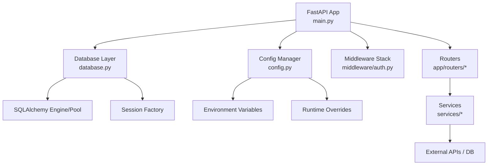
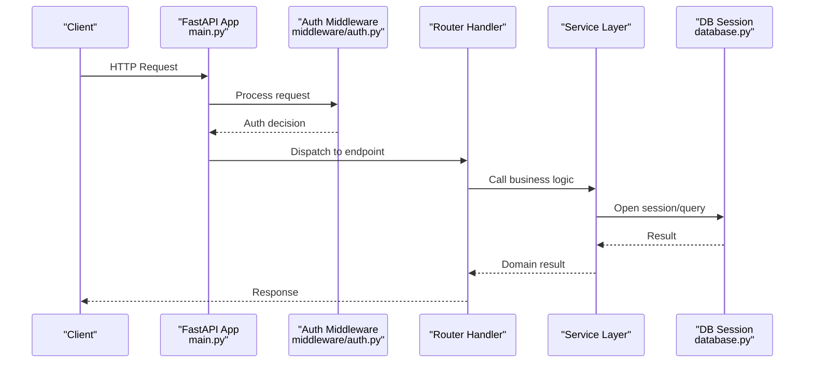
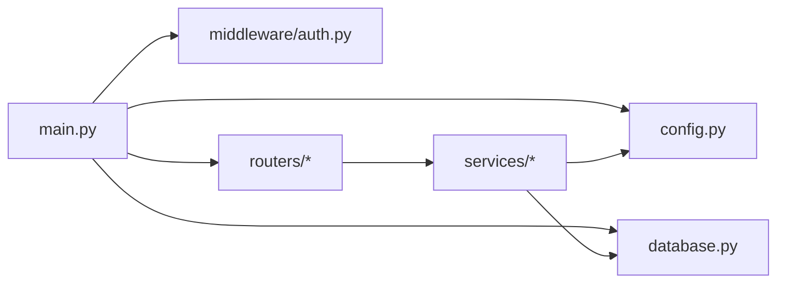

# Core Application Components

<cite>
**Referenced Files in This Document**
- [main.py](file://backend/app/main.py)
- [config.py](file://backend/app/config.py)
- [database.py](file://backend/app/database.py)
- [auth.py](file://backend/app/middleware/auth.py)
- [settings_service.py](file://backend/app/services/settings_service.py)
- [alembic.ini](file://backend/alembic.ini)
- [env.py](file://backend/alembic/env.py)
</cite>

## Table of Contents
1. [Introduction](#introduction)
2. [Project Structure](#project-structure)
3. [Core Components](#core-components)
4. [Architecture Overview](#architecture-overview)
5. [Detailed Component Analysis](#detailed-component-analysis)
6. [Dependency Analysis](#dependency-analysis)
7. [Performance Considerations](#performance-considerations)
8. [Troubleshooting Guide](#troubleshooting-guide)
9. [Conclusion](#conclusion)
10. [Appendices](#appendices)

## Introduction
This document explains the core FastAPI application components with a focus on:
- Application initialization and startup lifecycle in main.py, including middleware setup, dependency injection configuration, and route registration patterns
- Centralized configuration management in config.py for environment-specific settings, secret handling, and runtime overrides
- Database connectivity in database.py covering connection pooling, session management, and error handling strategies
- Practical examples for extending the application with new middleware, configuring additional services, and implementing custom dependency injection patterns

The goal is to provide both high-level understanding and actionable guidance for developers extending or maintaining the backend.

## Project Structure
The backend is organized by feature areas (routers, models, schemas, services) with shared infrastructure under app/. The core files relevant to this document are:
- Application entrypoint and startup orchestration: backend/app/main.py
- Configuration management: backend/app/config.py
- Database layer: backend/app/database.py
- Middleware example: backend/app/middleware/auth.py
- Settings service integration: backend/app/services/settings_service.py
- Alembic configuration: backend/alembic.ini and backend/alembic/env.py

[No sources needed since this diagram shows conceptual workflow, not actual code structure]

## Core Components
This section summarizes responsibilities and interactions among the core components:
- main.py initializes the FastAPI application, registers middleware, sets up dependency providers, and mounts routers
- config.py loads and validates configuration from environment variables, supports defaults, and exposes typed settings
- database.py provides SQLAlchemy engine/session factories, connection pool tuning, and robust session lifecycle management
- auth.py demonstrates request-scoped middleware that can enforce authentication/authorization before routes execute
- settings_service.py integrates with configuration to serve application settings to business logic

Key extension points:
- Add new middleware by mounting it early in the stack
- Register new routers to expose endpoints
- Implement custom dependencies via FastAPI’s dependency injection system
- Extend configuration by adding new fields to the settings model and wiring them into services

**Section sources**
- [main.py](file://backend/app/main.py)
- [config.py](file://backend/app/config.py)
- [database.py](file://backend/app/database.py)
- [auth.py](file://backend/app/middleware/auth.py)
- [settings_service.py](file://backend/app/services/settings_service.py)

## Architecture Overview
The application follows a layered architecture:
- Entry point orchestrates startup, middleware, and routing
- Configuration is centralized and consumed by services and database layer
- Database access is abstracted through sessions and engines
- Routers delegate to services which interact with external systems and the database

**Diagram sources**
- [main.py](file://backend/app/main.py)
- [auth.py](file://backend/app/middleware/auth.py)
- [database.py](file://backend/app/database.py)

## Detailed Component Analysis

### Application Initialization (main.py)
Responsibilities:
- Create the FastAPI application instance
- Configure CORS, lifespan events, and global exception handlers
- Mount middleware (e.g., authentication, logging, security headers)
- Register dependency providers for database sessions and configuration
- Mount routers for each domain area

Startup flow:
- Load configuration once at import time
- Initialize database engine and session factory
- Apply middleware in order (security-critical first)
- Register routers and any root-level dependencies

Extension patterns:
- Add new middleware by inserting it into the middleware stack
- Register new routers under a consistent path prefix
- Provide new dependencies using FastAPI’s Depends() and override them in tests

**Section sources**
- [main.py](file://backend/app/main.py)

### Centralized Configuration Management (config.py)
Responsibilities:
- Define a typed settings model with defaults
- Read values from environment variables
- Support runtime overrides (e.g., test fixtures, hot reloads)
- Validate critical secrets and fail fast if missing
- Expose a singleton or provider function for dependency injection

Key behaviors:
- Environment-specific settings via prefixes or separate sections
- Secret handling with secure defaults and validation
- Runtime overrides applied after loading from environment

Usage pattern:
- Import settings object or call a get_settings() function
- Inject settings into routers/services via Depends()

**Section sources**
- [config.py](file://backend/app/config.py)

### Database Connectivity (database.py)
Responsibilities:
- Configure SQLAlchemy engine with connection pooling parameters
- Provide a session factory scoped per request
- Ensure proper session cleanup and transaction boundaries
- Handle connection errors and retries where appropriate

Connection pooling:
- Tune pool size, max overflow, and timeouts based on workload
- Use event listeners for health checks or metrics

Session management:
- Create a generator-based dependency that yields sessions
- Commit/rollback semantics aligned with request lifecycle
- Avoid long-lived sessions; prefer short-lived per-request sessions

Error handling:
- Translate low-level DB exceptions into API-friendly responses
- Log detailed diagnostics without leaking sensitive data

**Section sources**
- [database.py](file://backend/app/database.py)

### Authentication Middleware (auth.py)
Responsibilities:
- Parse and validate tokens or credentials from requests
- Enforce authorization rules and set request context
- Short-circuit unauthenticated requests early

Integration:
- Mounted in main.py before routers
- Can inject current user context into dependencies

**Section sources**
- [auth.py](file://backend/app/middleware/auth.py)

### Settings Service Integration (settings_service.py)
Responsibilities:
- Provide application-wide settings to services
- Cache or memoize expensive lookups if needed
- Bridge between config.py and business logic

**Section sources**
- [settings_service.py](file://backend/app/services/settings_service.py)

## Dependency Analysis
High-level dependency relationships:
- main.py depends on config.py, database.py, middleware, and routers
- database.py depends on SQLAlchemy and environment-driven settings
- config.py depends on environment variables and optional runtime overrides
- Services depend on config and database sessions

**Diagram sources**
- [main.py](file://backend/app/main.py)
- [config.py](file://backend/app/config.py)
- [database.py](file://backend/app/database.py)
- [auth.py](file://backend/app/middleware/auth.py)

**Section sources**
- [main.py](file://backend/app/main.py)
- [config.py](file://backend/app/config.py)
- [database.py](file://backend/app/database.py)
- [auth.py](file://backend/app/middleware/auth.py)

## Performance Considerations
- Connection pooling: Adjust pool_size, max_overflow, and pool_timeout according to expected concurrency and database capacity
- Session scope: Keep sessions short-lived; avoid holding connections across long-running tasks
- Middleware ordering: Place lightweight, essential middleware early to reduce overhead
- Configuration caching: Cache immutable settings at startup to avoid repeated parsing
- Lazy initialization: Defer heavy resource initialization until first use if startup latency is critical

[No sources needed since this section provides general guidance]

## Troubleshooting Guide
Common issues and resolutions:
- Missing environment variables: Ensure all required settings are present; config should fail fast with clear messages
- Database connection failures: Verify credentials, network reachability, and pool limits; check logs for timeout details
- Session leaks: Confirm sessions are closed after each request; ensure exception paths trigger rollback/close
- Middleware misconfiguration: Validate token formats and header names; add debug logging for failed auth attempts
- Migration problems: Check alembic configuration and env settings; confirm database URL and target versions

Operational tips:
- Use structured logging for requests, DB operations, and auth decisions
- Expose minimal diagnostic info in responses; log full details server-side
- Validate configuration at startup and surface errors early

**Section sources**
- [config.py](file://backend/app/config.py)
- [database.py](file://backend/app/database.py)
- [auth.py](file://backend/app/middleware/auth.py)
- [alembic.ini](file://backend/alembic.ini)
- [env.py](file://backend/alembic/env.py)

## Conclusion
The backend follows a clean separation of concerns:
- main.py orchestrates startup, middleware, and routing
- config.py centralizes configuration with strong typing and validation
- database.py encapsulates connection and session management
- Middleware and services build upon these foundations

Extensibility is straightforward: add middleware, register routers, implement dependencies, and extend configuration as needed.

[No sources needed since this section summarizes without analyzing specific files]

## Appendices

### Extending the Application

#### Adding New Middleware
- Implement a callable or class-based middleware
- Mount it in main.py before routers
- Ensure it handles exceptions and returns valid responses

**Section sources**
- [main.py](file://backend/app/main.py)
- [auth.py](file://backend/app/middleware/auth.py)

#### Configuring Additional Services
- Define service classes that consume config and DB sessions
- Register them as dependencies or singletons
- Use dependency injection to wire services into routers

**Section sources**
- [settings_service.py](file://backend/app/services/settings_service.py)
- [config.py](file://backend/app/config.py)
- [database.py](file://backend/app/database.py)

#### Custom Dependency Injection Patterns
- Create reusable Depends() providers for DB sessions, config, and external clients
- Override dependencies in tests for isolation
- Compose complex dependencies from simpler ones

**Section sources**
- [main.py](file://backend/app/main.py)
- [database.py](file://backend/app/database.py)
- [config.py](file://backend/app/config.py)