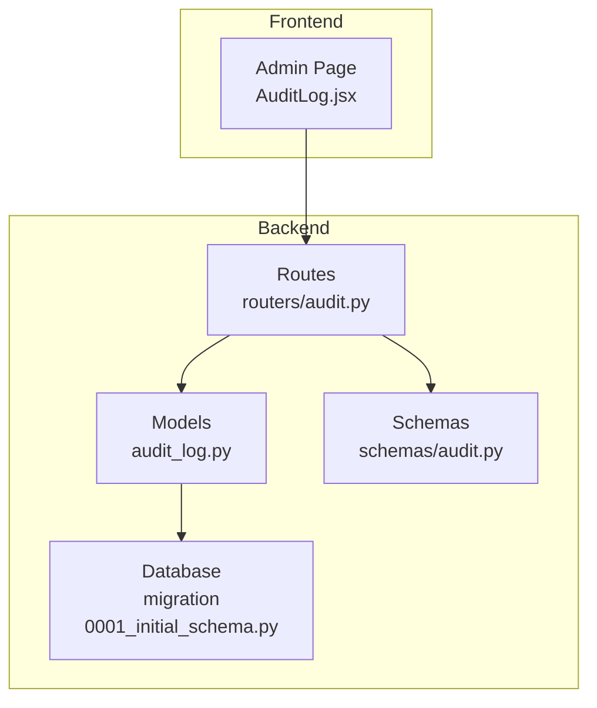
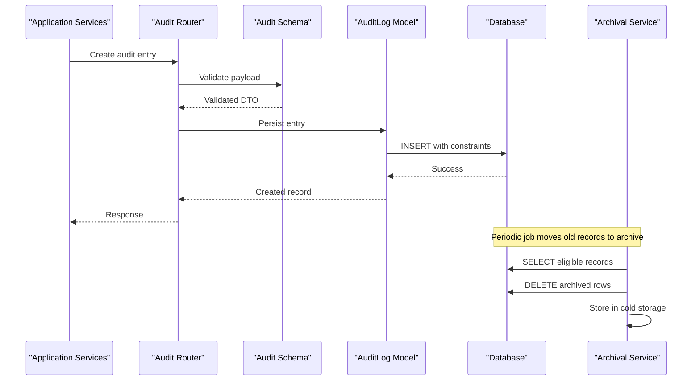
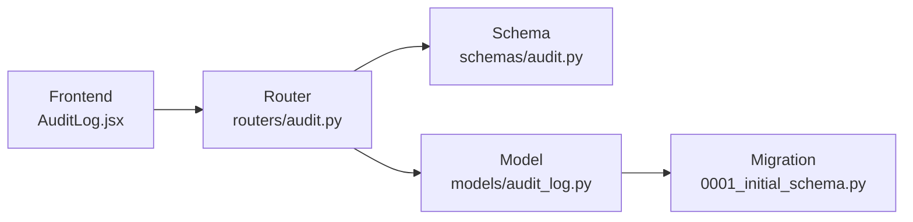

# Audit & Compliance Models

<cite>
**Referenced Files in This Document**   
- [audit_log.py](file://backend/app/models/audit_log.py)
- [audit.py](file://backend/app/schemas/audit.py)
- [audit.py](file://backend/app/routers/audit.py)
- [0001_initial_schema.py](file://backend/alembic/versions/0001_initial_schema.py)
- [AuditLog.jsx](file://frontend/src/pages/admin/AuditLog.jsx)
</cite>

## Table of Contents
1. [Introduction](#introduction)
2. [Project Structure](#project-structure)
3. [Core Components](#core-components)
4. [Architecture Overview](#architecture-overview)
5. [Detailed Component Analysis](#detailed-component-analysis)
6. [Dependency Analysis](#dependency-analysis)
7. [Performance Considerations](#performance-considerations)
8. [Troubleshooting Guide](#troubleshooting-guide)
9. [Conclusion](#conclusion)
10. [Appendices](#appendices)

## Introduction
This document describes the data model and operational design for audit logging and compliance tracking. It focuses on the AuditLog model, event categorization, retention policies, indexing strategies, and querying patterns used for compliance reporting. It also covers archival strategies and performance optimization for high-volume scenarios.

## Project Structure
The audit and compliance features span backend models, schemas, API routes, database migrations, and a frontend page for inspection:
- Backend model and schema definitions define the canonical structure of audit entries.
- Database migration captures the initial schema for audit tables.
- API routes expose endpoints for creating and querying audit logs.
- Frontend provides an admin interface to browse audit records.

[No sources needed since this diagram shows conceptual workflow, not actual code structure]

## Core Components
- AuditLog model: Represents immutable records of user actions, system events, and security-related activities. Fields typically include actor identity, action type, resource context, outcome, timestamps, and optional metadata.
- Audit schema: Defines request/response contracts for audit APIs, including validation rules and serialization formats.
- Audit routes: Provide endpoints to create audit entries and query them with filters suitable for compliance reports.
- Migration: Establishes the initial table structure, constraints, and indexes required for efficient queries.

Key responsibilities:
- Capture who did what, when, where, and why.
- Enforce immutability and integrity of audit records.
- Support filtering by time range, actor, action category, resource, and outcome.
- Enable efficient reporting through targeted indexes.

**Section sources**
- [audit_log.py](file://backend/app/models/audit_log.py)
- [audit.py](file://backend/app/schemas/audit.py)
- [audit.py](file://backend/app/routers/audit.py)
- [0001_initial_schema.py](file://backend/alembic/versions/0001_initial_schema.py)

## Architecture Overview
The audit pipeline is designed for durability and query efficiency:
- Producers (services, middleware, or handlers) emit audit events.
- Routes accept and validate audit payloads via schemas.
- Model persists entries to the database with appropriate constraints.
- Queries leverage indexes for fast filtering and aggregation.
- Archival processes move older records to long-term storage per retention policy.

**Diagram sources**
- [audit.py](file://backend/app/routers/audit.py)
- [audit.py](file://backend/app/schemas/audit.py)
- [audit_log.py](file://backend/app/models/audit_log.py)
- [0001_initial_schema.py](file://backend/alembic/versions/0001_initial_schema.py)

## Detailed Component Analysis

### AuditLog Data Model
The AuditLog model defines the canonical fields for each audit event. Typical attributes include:
- Actor identity (user or service principal)
- Action type and category
- Resource identifiers and context
- Outcome and status
- Timestamps (created_at, updated_at if applicable)
- Optional structured metadata for rich context

Constraints and integrity:
- Primary key and surrogate ID for stable references.
- Not-null constraints on critical fields (actor, action, timestamp).
- Optional foreign keys to users/resources if normalized.
- Immutable insert-only semantics enforced at application or DB layer.

Indexing strategy:
- Composite index on (created_at, actor_id) for time-range and actor-based queries.
- Index on (action_category, created_at) for category-driven reporting.
- Index on (resource_type, resource_id) for resource-centric lookups.
- Partial or filtered indexes for hot categories if needed.

Retention and lifecycle:
- Hot storage retains recent records for interactive queries.
- Cold storage archives historical records per policy.
- Deletion jobs purge expired records after archival.

Example entries by event type:
- User action: login success/failure, profile update, permission change.
- System event: scheduled job run, configuration change, dependency upgrade.
- Security activity: failed auth attempts, token issuance/revocation, policy enforcement.

Query patterns for compliance:
- Time-bounded queries for incident response.
- Actor-centric queries for user behavior analysis.
- Category-based queries for regulatory reporting.
- Resource-centric queries for change impact analysis.

**Section sources**
- [audit_log.py](file://backend/app/models/audit_log.py)
- [0001_initial_schema.py](file://backend/alembic/versions/0001_initial_schema.py)

### Audit API Schemas
The audit schema enforces input/output contracts:
- Request DTOs for creating audit entries with validated fields.
- Response DTOs for listing/filtering entries with pagination and sorting.
- Enumerations for action categories and outcomes to ensure consistency.

Validation rules:
- Required fields and format checks.
- Allowed values for enums.
- Size limits for text fields and metadata.

**Section sources**
- [audit.py](file://backend/app/schemas/audit.py)

### Audit API Routes
The audit router exposes endpoints:
- Create: Accepts validated audit payloads and persists entries.
- List/Filter: Supports filtering by time range, actor, category, resource, and outcome; includes pagination and sorting.
- Read: Retrieves a single audit entry by ID.

Security considerations:
- Authorization checks for administrative access.
- Rate limiting and input sanitization.
- Idempotency options for safe retries.

**Section sources**
- [audit.py](file://backend/app/routers/audit.py)

### Database Migration
The initial migration establishes:
- Table definition for audit entries with columns matching the model.
- Constraints ensuring data integrity.
- Indexes aligned with query patterns described above.

Operational notes:
- Backward-compatible changes only.
- Explicit index creation statements for performance.
- Optional partitioning hints for large datasets.

**Section sources**
- [0001_initial_schema.py](file://backend/alembic/versions/0001_initial_schema.py)

### Frontend Audit Viewer
The admin page allows browsing and filtering audit logs:
- Filters for date range, actor, category, and outcome.
- Pagination and sorting controls.
- Detail view for individual entries.

Integration points:
- Calls list and read endpoints from the audit router.
- Displays structured metadata when available.

**Section sources**
- [AuditLog.jsx](file://frontend/src/pages/admin/AuditLog.jsx)

## Dependency Analysis
High-level dependencies among components:
- Router depends on Schema for validation and on Model for persistence.
- Model depends on Database via ORM/migration-defined schema.
- Frontend depends on Router endpoints.

**Diagram sources**
- [audit.py](file://backend/app/routers/audit.py)
- [audit.py](file://backend/app/schemas/audit.py)
- [audit_log.py](file://backend/app/models/audit_log.py)
- [0001_initial_schema.py](file://backend/alembic/versions/0001_initial_schema.py)
- [AuditLog.jsx](file://frontend/src/pages/admin/AuditLog.jsx)

**Section sources**
- [audit.py](file://backend/app/routers/audit.py)
- [audit.py](file://backend/app/schemas/audit.py)
- [audit_log.py](file://backend/app/models/audit_log.py)
- [0001_initial_schema.py](file://backend/alembic/versions/0001_initial_schema.py)
- [AuditLog.jsx](file://frontend/src/pages/admin/AuditLog.jsx)

## Performance Considerations
- Indexing: Use composite indexes for frequent filter combinations (time + actor, category + time, resource + time).
- Partitioning: Consider time-based partitioning for very large tables to improve maintenance and query performance.
- Query design: Prefer selective filters and avoid wildcard scans; use server-side pagination.
- Write path: Batch inserts where possible; ensure async emission does not block user flows.
- Archival: Move cold data off the primary database to reduce size and improve cache hit rates.
- Monitoring: Track slow queries and index usage; adjust indexes based on real workload.

[No sources needed since this section provides general guidance]

## Troubleshooting Guide
Common issues and resolutions:
- Missing indexes causing slow queries: Review and add composite indexes aligned with reported queries.
- Constraint violations on inserts: Validate payloads against schema and ensure required fields are present.
- High write latency: Offload audit writes to background tasks; consider batching.
- Storage growth: Implement retention and archival jobs; monitor disk usage.
- Inconsistent categories: Standardize enums and enforce via schema validation.

**Section sources**
- [audit.py](file://backend/app/routers/audit.py)
- [audit.py](file://backend/app/schemas/audit.py)
- [audit_log.py](file://backend/app/models/audit_log.py)
- [0001_initial_schema.py](file://backend/alembic/versions/0001_initial_schema.py)

## Conclusion
A robust audit and compliance system hinges on a clear data model, strong validation, thoughtful indexing, and disciplined retention. By capturing essential context, enforcing immutability, and optimizing for typical reporting queries, the system supports both operational needs and compliance obligations.

[No sources needed since this section summarizes without analyzing specific files]

## Appendices

### Example Event Categories and Fields
- Authentication: actor, action, outcome, ip_address, user_agent
- Access Control: actor, target_role, resource, decision, reason
- Configuration Change: actor, config_key, old_value, new_value, approval_id
- System Operations: actor_or_service, operation, resource, status, duration_ms

[No sources needed since this section provides general guidance]

### Sample Query Patterns
- Last N days by actor and category
- Failed actions by resource type
- Changes to sensitive configurations within a window
- Actions by service account across resources

[No sources needed since this section provides general guidance]