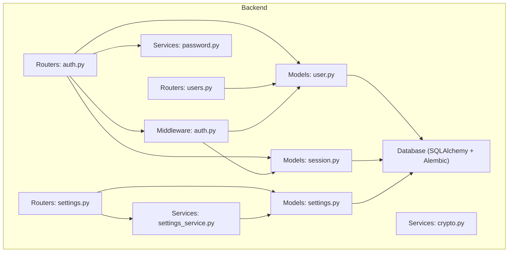
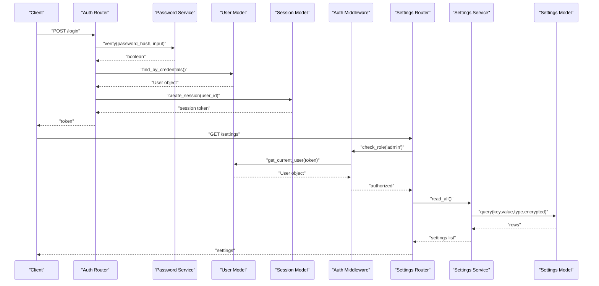
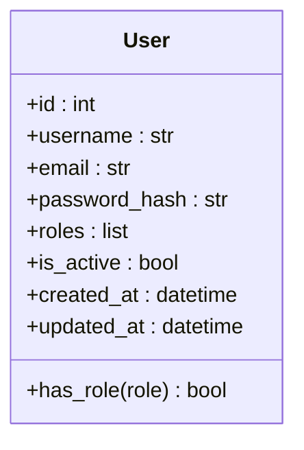
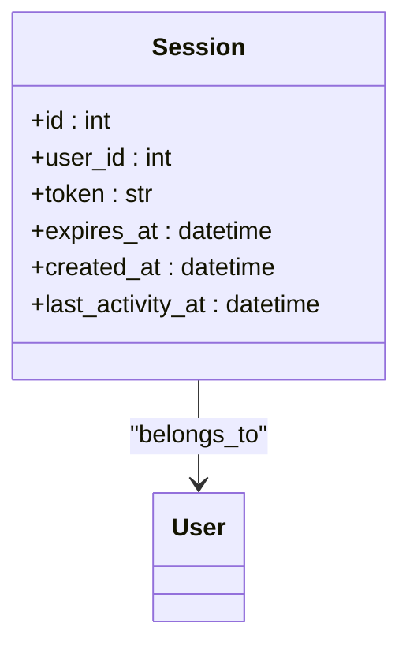
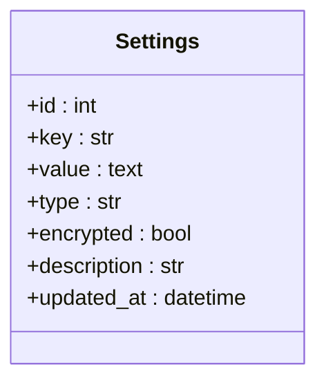
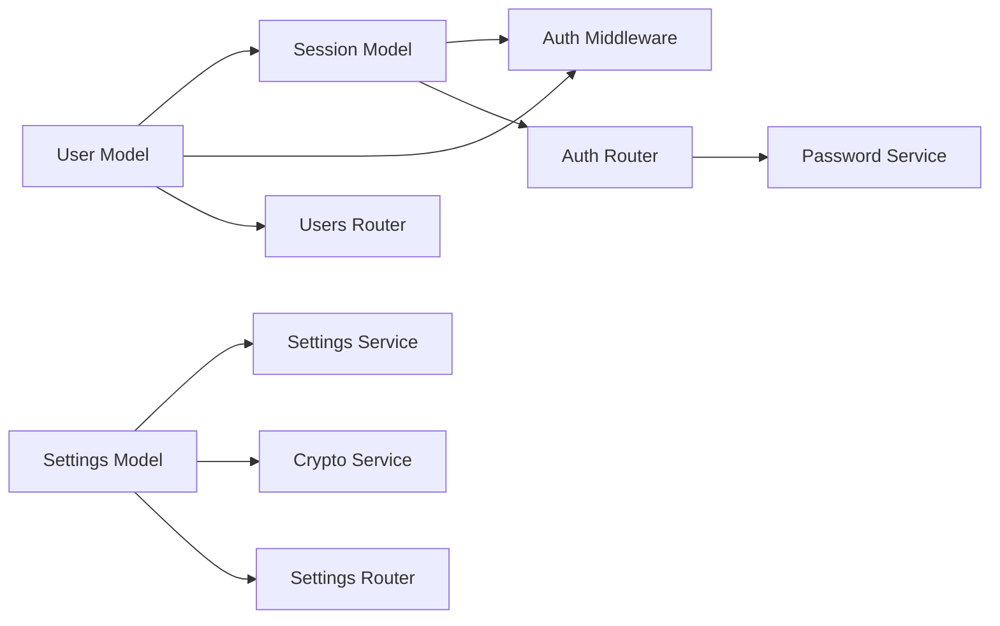
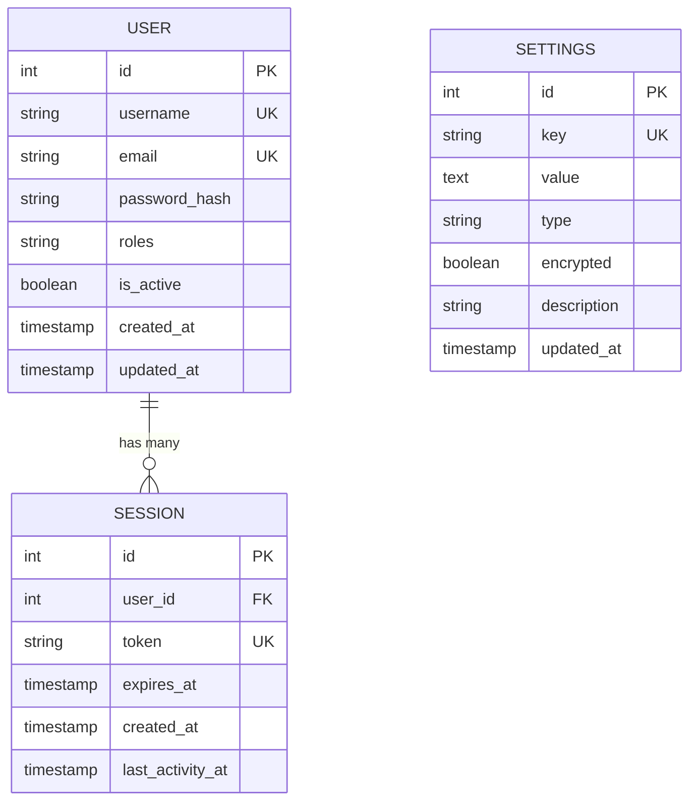

# Core Models (User, Session, Settings)

<cite>
**Referenced Files in This Document**
- [user.py](file://backend/app/models/user.py)
- [session.py](file://backend/app/models/session.py)
- [settings.py](file://backend/app/models/settings.py)
- [auth.py](file://backend/app/middleware/auth.py)
- [auth_router.py](file://backend/app/routers/auth.py)
- [users_router.py](file://backend/app/routers/users.py)
- [settings_router.py](file://backend/app/routers/settings.py)
- [password_service.py](file://backend/app/services/password.py)
- [crypto_service.py](file://backend/app/services/crypto.py)
- [settings_service.py](file://backend/app/services/settings_service.py)
- [database.py](file://backend/app/database.py)
- [0001_initial_schema.py](file://backend/alembic/versions/0001_initial_schema.py)
</cite>

## Table of Contents
1. [Introduction](#introduction)
2. [Project Structure](#project-structure)
3. [Core Components](#core-components)
4. [Architecture Overview](#architecture-overview)
5. [Detailed Component Analysis](#detailed-component-analysis)
6. [Dependency Analysis](#dependency-analysis)
7. [Performance Considerations](#performance-considerations)
8. [Troubleshooting Guide](#troubleshooting-guide)
9. [Conclusion](#conclusion)
10. [Appendices](#appendices)

## Introduction
This document provides comprehensive data model documentation for the core system models: User, Session, and Settings. It covers entity relationships, field definitions, data types, constraints, primary and foreign key relationships, indexes, and database optimization strategies. It also explains user role-based access control implementation, session management lifecycle, application settings persistence, validation rules, business logic constraints, security considerations for sensitive data handling, sample data structures, and common query patterns for user administration and system configuration.

## Project Structure
The backend organizes models under app/models, with supporting routers, services, middleware, and Alembic migrations. The core models are defined in dedicated files and referenced by routers and services to implement authentication, authorization, and configuration features.

**Diagram sources**
- [user.py](file://backend/app/models/user.py)
- [session.py](file://backend/app/models/session.py)
- [settings.py](file://backend/app/models/settings.py)
- [auth.py](file://backend/app/middleware/auth.py)
- [auth_router.py](file://backend/app/routers/auth.py)
- [users_router.py](file://backend/app/routers/users.py)
- [settings_router.py](file://backend/app/routers/settings.py)
- [password_service.py](file://backend/app/services/password.py)
- [crypto_service.py](file://backend/app/services/crypto.py)
- [settings_service.py](file://backend/app/services/settings_service.py)
- [database.py](file://backend/app/database.py)

**Section sources**
- [user.py](file://backend/app/models/user.py)
- [session.py](file://backend/app/models/session.py)
- [settings.py](file://backend/app/models/settings.py)
- [auth.py](file://backend/app/middleware/auth.py)
- [auth_router.py](file://backend/app/routers/auth.py)
- [users_router.py](file://backend/app/routers/users.py)
- [settings_router.py](file://backend/app/routers/settings.py)
- [password_service.py](file://backend/app/services/password.py)
- [crypto_service.py](file://backend/app/services/crypto.py)
- [settings_service.py](file://backend/app/services/settings_service.py)
- [database.py](file://backend/app/database.py)

## Core Components
This section summarizes the three core models and their responsibilities:
- User: Represents authenticated users, including identity fields, roles, and account state.
- Session: Tracks active sessions per user, enabling secure login/logout flows and session invalidation.
- Settings: Stores application-level configuration as key-value pairs with type metadata and optional encryption.

Key cross-cutting concerns:
- Role-based access control is enforced via middleware that inspects the current user’s roles.
- Password hashing uses a dedicated service to ensure secure storage.
- Sensitive settings can be encrypted at rest using a crypto service.
- Database interactions are managed through SQLAlchemy with Alembic migrations.

**Section sources**
- [user.py](file://backend/app/models/user.py)
- [session.py](file://backend/app/models/session.py)
- [settings.py](file://backend/app/models/settings.py)
- [auth.py](file://backend/app/middleware/auth.py)
- [password_service.py](file://backend/app/services/password.py)
- [crypto_service.py](file://backend/app/services/crypto.py)
- [settings_service.py](file://backend/app/services/settings_service.py)
- [database.py](file://backend/app/database.py)

## Architecture Overview
The authentication and configuration architecture integrates models, services, middleware, and routers:
- Authentication flow: Client requests login; router validates credentials via password service; on success, a session is created; middleware enforces RBAC on protected routes.
- Configuration flow: Admins read/write settings via settings router; settings service handles persistence and optional encryption.

**Diagram sources**
- [auth_router.py](file://backend/app/routers/auth.py)
- [password_service.py](file://backend/app/services/password.py)
- [user.py](file://backend/app/models/user.py)
- [session.py](file://backend/app/models/session.py)
- [auth.py](file://backend/app/middleware/auth.py)
- [settings_router.py](file://backend/app/routers/settings.py)
- [settings_service.py](file://backend/app/services/settings_service.py)
- [settings.py](file://backend/app/models/settings.py)

## Detailed Component Analysis

### User Model
Responsibilities:
- Store user identity and account state.
- Enforce role-based access control via roles field.
- Provide unique constraints on identifiers such as username/email.

Typical fields and constraints:
- Primary key: auto-increment integer or UUID.
- Username: string, unique, non-empty.
- Email: string, unique, valid email format.
- Password hash: string, never store plaintext.
- Roles: array or JSON of role strings (e.g., admin, user).
- Active flag: boolean to disable accounts without deletion.
- Timestamps: created_at, updated_at.

Indexes and keys:
- Unique index on username and email.
- Optional index on roles for filtering administrators.

Validation and business rules:
- Reject duplicate usernames/emails.
- Ensure password is hashed before persisting.
- Prevent modification of critical fields by non-admins.

Security considerations:
- Never log or expose password hashes.
- Validate and sanitize inputs.
- Enforce least privilege when updating user records.

Common queries:
- Find user by username or email.
- List users with pagination and filters.
- Check if a user has a specific role.

Sample structure (illustrative):
- id: integer
- username: string
- email: string
- password_hash: string
- roles: ["user"]
- is_active: true
- created_at: timestamp
- updated_at: timestamp

**Section sources**
- [user.py](file://backend/app/models/user.py)
- [auth.py](file://backend/app/middleware/auth.py)
- [users_router.py](file://backend/app/routers/users.py)
- [password_service.py](file://backend/app/services/password.py)

#### Class Diagram

**Diagram sources**
- [user.py](file://backend/app/models/user.py)

### Session Model
Responsibilities:
- Track active sessions tied to a user.
- Support logout and session invalidation.
- Optionally enforce expiration policies.

Typical fields and constraints:
- Primary key: auto-increment integer or UUID.
- user_id: foreign key referencing User.id.
- token: string, unique, opaque session identifier.
- expires_at: timestamp for TTL-based expiry.
- created_at: timestamp.
- last_activity_at: timestamp for idle timeout.

Indexes and keys:
- Unique index on token.
- Index on user_id for quick lookup.
- Optional index on expires_at for cleanup jobs.

Validation and business rules:
- Create a new session only after successful authentication.
- Invalidate existing sessions on logout or password change.
- Expire sessions based on expires_at or last_activity_at.

Security considerations:
- Treat tokens as secrets; do not log them.
- Rotate tokens on privilege changes.
- Use HTTPS-only transport.

Common queries:
- Find session by token.
- Delete expired sessions.
- Revoke all sessions for a user.

Sample structure (illustrative):
- id: integer
- user_id: int (FK -> User.id)
- token: string
- expires_at: timestamp
- created_at: timestamp
- last_activity_at: timestamp

**Section sources**
- [session.py](file://backend/app/models/session.py)
- [auth_router.py](file://backend/app/routers/auth.py)
- [auth.py](file://backend/app/middleware/auth.py)

#### Class Diagram

**Diagram sources**
- [session.py](file://backend/app/models/session.py)
- [user.py](file://backend/app/models/user.py)

### Settings Model
Responsibilities:
- Persist application-wide configuration as key-value pairs.
- Support typed values and optional encryption for sensitive settings.

Typical fields and constraints:
- Primary key: auto-increment integer or UUID.
- key: string, unique, descriptive setting name.
- value: text or JSON blob.
- type: enum or string indicating value type (string, number, boolean, json).
- encrypted: boolean flag to indicate whether value is encrypted.
- description: optional human-readable description.
- updated_at: timestamp.

Indexes and keys:
- Unique index on key.
- Optional index on type for filtering.

Validation and business rules:
- Enforce allowed keys and types.
- Encrypt values when encrypted flag is set.
- Restrict writes to authorized roles (e.g., admin).

Security considerations:
- Use strong encryption for sensitive values.
- Avoid logging encrypted payloads.
- Manage encryption keys securely outside the database.

Common queries:
- Read all settings.
- Get a single setting by key.
- Update multiple settings atomically.

Sample structure (illustrative):
- id: integer
- key: string
- value: text
- type: string
- encrypted: boolean
- description: string
- updated_at: timestamp

**Section sources**
- [settings.py](file://backend/app/models/settings.py)
- [settings_service.py](file://backend/app/services/settings_service.py)
- [crypto_service.py](file://backend/app/services/crypto.py)
- [settings_router.py](file://backend/app/routers/settings.py)

#### Class Diagram

**Diagram sources**
- [settings.py](file://backend/app/models/settings.py)

### Role-Based Access Control (RBAC) Implementation
RBAC is enforced by middleware that:
- Extracts the current user from the request context (typically via token).
- Validates the user’s roles against required roles for the endpoint.
- Denies access if the user lacks necessary permissions.

Implementation notes:
- Roles are stored in the User model as an array/list of strings.
- Middleware checks for presence of required roles before invoking route handlers.
- Admin-only endpoints should explicitly require admin role.

Security considerations:
- Always verify roles server-side; client-side checks are insufficient.
- Keep role names consistent and well-documented.
- Audit privileged operations where applicable.

**Section sources**
- [auth.py](file://backend/app/middleware/auth.py)
- [user.py](file://backend/app/models/user.py)
- [users_router.py](file://backend/app/routers/users.py)
- [settings_router.py](file://backend/app/routers/settings.py)

### Session Management Lifecycle
Lifecycle steps:
- Login: Authenticate user, create session record, return token.
- Access: Middleware resolves user from token, validates session existence and expiry.
- Activity: Update last_activity_at on each request to support idle timeouts.
- Logout: Invalidate session by token or revoke all sessions for a user.
- Expiry: Background job or lazy checks remove expired sessions.

Operational guidance:
- Use short-lived tokens with refresh mechanisms if needed.
- Rotate tokens on privilege escalation or password reset.
- Ensure token uniqueness and collision handling.

**Section sources**
- [auth_router.py](file://backend/app/routers/auth.py)
- [session.py](file://backend/app/models/session.py)
- [auth.py](file://backend/app/middleware/auth.py)

### Application Settings Persistence
Persistence strategy:
- Key-value store with typed values.
- Optional encryption for sensitive settings.
- Atomic updates for batch configuration changes.

Best practices:
- Define allowed keys and types centrally.
- Provide defaults for missing keys.
- Cache frequently accessed settings in memory with invalidation on update.

**Section sources**
- [settings_service.py](file://backend/app/services/settings_service.py)
- [settings.py](file://backend/app/models/settings.py)
- [crypto_service.py](file://backend/app/services/crypto.py)
- [settings_router.py](file://backend/app/routers/settings.py)

## Dependency Analysis
The following diagram shows how core models depend on each other and related components:

**Diagram sources**
- [user.py](file://backend/app/models/user.py)
- [session.py](file://backend/app/models/session.py)
- [settings.py](file://backend/app/models/settings.py)
- [auth.py](file://backend/app/middleware/auth.py)
- [auth_router.py](file://backend/app/routers/auth.py)
- [users_router.py](file://backend/app/routers/users.py)
- [settings_router.py](file://backend/app/routers/settings.py)
- [password_service.py](file://backend/app/services/password.py)
- [crypto_service.py](file://backend/app/services/crypto.py)
- [settings_service.py](file://backend/app/services/settings_service.py)

**Section sources**
- [user.py](file://backend/app/models/user.py)
- [session.py](file://backend/app/models/session.py)
- [settings.py](file://backend/app/models/settings.py)
- [auth.py](file://backend/app/middleware/auth.py)
- [auth_router.py](file://backend/app/routers/auth.py)
- [users_router.py](file://backend/app/routers/users.py)
- [settings_router.py](file://backend/app/routers/settings.py)
- [password_service.py](file://backend/app/services/password.py)
- [crypto_service.py](file://backend/app/services/crypto.py)
- [settings_service.py](file://backend/app/services/settings_service.py)

## Performance Considerations
- Indexes:
  - Unique indexes on username, email, and session token.
  - Index on user_id in sessions for fast lookups.
  - Optional index on expires_at for efficient cleanup.
- Query patterns:
  - Use selective columns in SELECT statements.
  - Paginate user lists and settings retrieval.
  - Batch updates for bulk configuration changes.
- Caching:
  - Cache settings in memory with cache invalidation on write.
  - Consider short TTL for frequently changing settings.
- Encryption overhead:
  - Minimize encryption scope to sensitive fields only.
  - Use streaming or chunked reads for large values.
- Connection pooling:
  - Configure appropriate pool sizes for concurrent workloads.

[No sources needed since this section provides general guidance]

## Troubleshooting Guide
Common issues and resolutions:
- Duplicate username/email:
  - Ensure unique constraints exist and handle integrity errors gracefully.
- Invalid role:
  - Verify role names and middleware checks align with expected values.
- Session not found:
  - Check token validity, session expiry, and cleanup jobs.
- Settings encryption failures:
  - Validate encryption keys and flags; ensure encrypted values are properly decoded.
- Permission denied:
  - Confirm user roles and endpoint requirements; review middleware logic.

Operational tips:
- Log high-level events without sensitive details.
- Monitor failed authentication attempts and session creation.
- Audit changes to settings and user roles.

**Section sources**
- [auth.py](file://backend/app/middleware/auth.py)
- [auth_router.py](file://backend/app/routers/auth.py)
- [users_router.py](file://backend/app/routers/users.py)
- [settings_router.py](file://backend/app/routers/settings.py)
- [password_service.py](file://backend/app/services/password.py)
- [crypto_service.py](file://backend/app/services/crypto.py)
- [settings_service.py](file://backend/app/services/settings_service.py)

## Conclusion
The core models—User, Session, and Settings—form the foundation of authentication, authorization, and configuration management. Proper indexing, validation, and security measures ensure robustness and performance. RBAC enforcement via middleware, secure session lifecycle, and encrypted settings persistence provide a solid baseline for scalable and secure operations.

[No sources needed since this section summarizes without analyzing specific files]

## Appendices

### Entity Relationship Diagram

**Diagram sources**
- [user.py](file://backend/app/models/user.py)
- [session.py](file://backend/app/models/session.py)
- [settings.py](file://backend/app/models/settings.py)

### Validation Rules Summary
- User:
  - Unique username and email.
  - Non-empty required fields.
  - Password must be hashed before save.
- Session:
  - Unique token.
  - Valid user_id reference.
  - Expiration and activity timestamps maintained.
- Settings:
  - Unique key.
  - Type consistency.
  - Encrypted flag matches actual encryption status.

**Section sources**
- [user.py](file://backend/app/models/user.py)
- [session.py](file://backend/app/models/session.py)
- [settings.py](file://backend/app/models/settings.py)

### Security Considerations Summary
- Passwords:
  - Hash with a strong algorithm via password service.
- Tokens:
  - Treat as secrets; rotate on sensitive actions.
- Encryption:
  - Use crypto service for sensitive settings; manage keys securely.
- Transport:
  - Enforce HTTPS for all endpoints.
- Auditing:
  - Record privileged operations and configuration changes.

**Section sources**
- [password_service.py](file://backend/app/services/password.py)
- [crypto_service.py](file://backend/app/services/crypto.py)
- [auth.py](file://backend/app/middleware/auth.py)

### Common Query Patterns
- User administration:
  - Find user by username/email.
  - List users with pagination and role filter.
  - Update user roles (admin-only).
- Session management:
  - Lookup session by token.
  - Revoke session(s) by user_id.
  - Clean up expired sessions.
- System configuration:
  - Read all settings.
  - Update multiple settings atomically.
  - Toggle encryption for sensitive keys.

**Section sources**
- [users_router.py](file://backend/app/routers/users.py)
- [auth_router.py](file://backend/app/routers/auth.py)
- [settings_router.py](file://backend/app/routers/settings.py)
- [settings_service.py](file://backend/app/services/settings_service.py)

### Database Optimization Strategies
- Add indexes for frequent filters and joins.
- Use partial indexes for active users or non-expired sessions.
- Partition large tables if growth warrants it.
- Tune connection pools and query timeouts.
- Regularly analyze and vacuum tables.

**Section sources**
- [database.py](file://backend/app/database.py)
- [0001_initial_schema.py](file://backend/alembic/versions/0001_initial_schema.py)