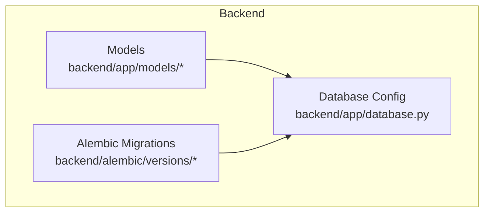
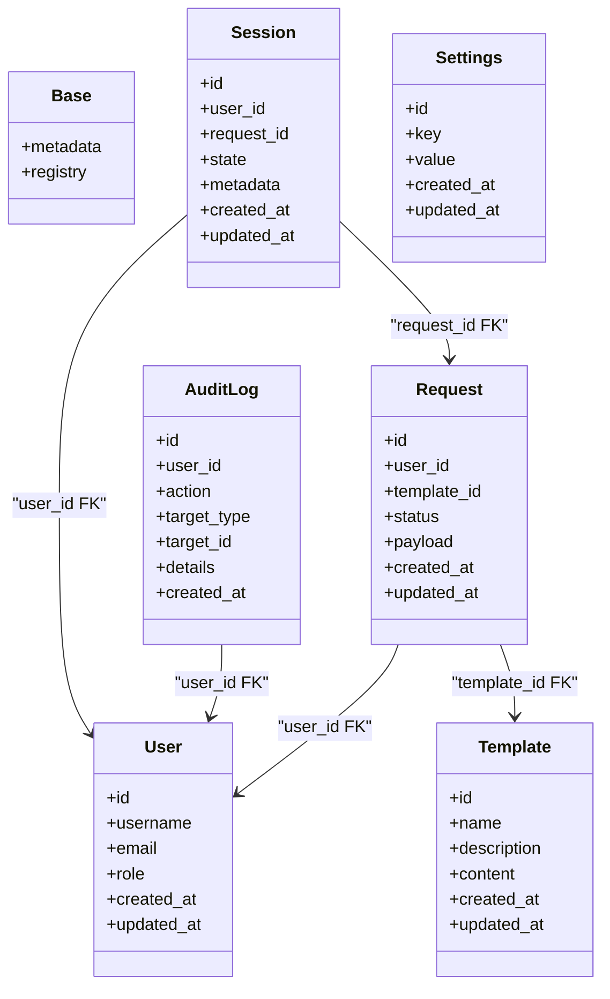
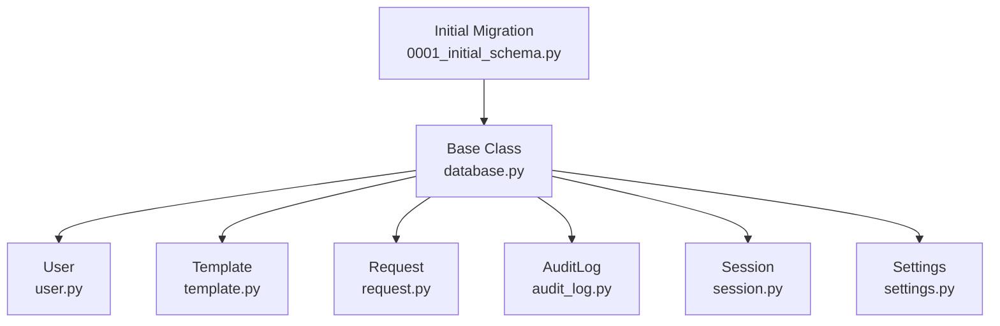
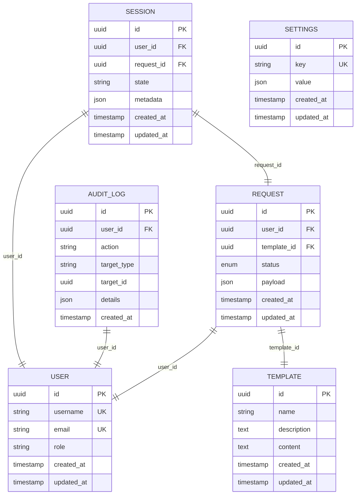

# Data Models & Database Schema

<cite>
**Referenced Files in This Document**
- [user.py](file://backend/app/models/user.py)
- [template.py](file://backend/app/models/template.py)
- [request.py](file://backend/app/models/request.py)
- [audit_log.py](file://backend/app/models/audit_log.py)
- [session.py](file://backend/app/models/session.py)
- [settings.py](file://backend/app/models/settings.py)
- [database.py](file://backend/app/database.py)
- [0001_initial_schema.py](file://backend/alembic/versions/0001_initial_schema.py)
- [env.py](file://backend/alembic/env.py)
</cite>

## Table of Contents
1. [Introduction](#introduction)
2. [Project Structure](#project-structure)
3. [Core Components](#core-components)
4. [Architecture Overview](#architecture-overview)
5. [Detailed Component Analysis](#detailed-component-analysis)
6. [Dependency Analysis](#dependency-analysis)
7. [Performance Considerations](#performance-considerations)
8. [Troubleshooting Guide](#troubleshooting-guide)
9. [Conclusion](#conclusion)
10. [Appendices](#appendices)

## Introduction
This document provides comprehensive data model documentation for the SQLAlchemy ORM layer, focusing on the User, Template, Request, AuditLog, Session, and Settings models. It details entity relationships, field definitions, data types, constraints, indexes, validation rules, business logic constraints, lifecycle hooks, migration strategies using Alembic, and performance optimization techniques. The goal is to make the database schema accessible to both technical and non-technical readers while providing actionable guidance for maintainers and developers.

## Project Structure
The data models are implemented under backend/app/models and are initialized via a shared Base class defined in backend/app/database.py. Alembic migrations live under backend/alembic with an initial migration file that creates the core tables.

**Diagram sources**
- [database.py](file://backend/app/database.py)
- [0001_initial_schema.py](file://backend/alembic/versions/0001_initial_schema.py)

**Section sources**
- [database.py](file://backend/app/database.py)
- [0001_initial_schema.py](file://backend/alembic/versions/0001_initial_schema.py)

## Core Components
This section summarizes each model’s purpose, key fields, relationships, and constraints. For precise field-level details, refer to the Detailed Component Analysis.

- User: Represents system users with authentication-related attributes and role-based access control. Includes timestamps for creation and updates.
- Template: Encapsulates reusable request templates used by users to submit new requests. Contains metadata such as name, description, and content.
- Request: Captures user-submitted requests derived from templates. Tracks status, requester identity, template linkage, and audit-relevant fields.
- AuditLog: Immutable log entries capturing significant system events, including actor, action, target, and contextual details.
- Session: Stores session state or related runtime context tied to users and requests.
- Settings: Application-wide configuration stored in the database, keyed by setting names with associated values.

Relationships overview:
- Request links to User (requester) and Template (source).
- AuditLog references User (actor) and optionally Request (target).
- Session may reference User and/or Request depending on usage.
- Settings is independent and stores key-value pairs.

Indexes and constraints:
- Primary keys are enforced on all entities.
- Foreign keys enforce referential integrity between Request, Template, User, AuditLog, and Session where applicable.
- Unique constraints are applied to settings keys and other identifiers as needed.
- Indexes are recommended on frequently filtered columns (e.g., Request.status, AuditLog.created_at, User.username).

Lifecycle hooks:
- Timestamps updated automatically on create/update.
- Optional pre/post event hooks can be added for auditing or normalization.

Validation rules:
- Field-level validation via SQLAlchemy Column constraints (e.g., NOT NULL, UNIQUE).
- Business logic validation at service/router layers before persistence.

**Section sources**
- [user.py](file://backend/app/models/user.py)
- [template.py](file://backend/app/models/template.py)
- [request.py](file://backend/app/models/request.py)
- [audit_log.py](file://backend/app/models/audit_log.py)
- [session.py](file://backend/app/models/session.py)
- [settings.py](file://backend/app/models/settings.py)

## Architecture Overview
The ORM architecture centers around a declarative Base class and individual model modules. Alembic manages schema evolution and versioning.

**Diagram sources**
- [user.py](file://backend/app/models/user.py)
- [template.py](file://backend/app/models/template.py)
- [request.py](file://backend/app/models/request.py)
- [audit_log.py](file://backend/app/models/audit_log.py)
- [session.py](file://backend/app/models/session.py)
- [settings.py](file://backend/app/models/settings.py)

## Detailed Component Analysis

### User Model
Purpose:
- Core identity and authorization entity.

Key fields:
- id: Primary key identifier.
- username: Unique string identifying the user.
- email: Email address; typically unique and validated.
- role: Role-based access control attribute.
- created_at, updated_at: Timestamps for lifecycle tracking.

Constraints and indexes:
- Primary key on id.
- Unique constraint on username (and possibly email).
- Recommended index on username and email for lookups.

Validation and business rules:
- Username uniqueness enforced at DB level.
- Email format validation should be enforced at API/service layer.
- Role restricted to predefined set (enforced in services).

Lifecycle hooks:
- updated_at auto-updated on changes.

Data access patterns:
- Lookup by username/email for authentication.
- Role checks performed in middleware/services.

Optimization tips:
- Use eager loading when fetching user profiles with related objects.
- Cache frequent user lookups if appropriate.

**Section sources**
- [user.py](file://backend/app/models/user.py)

### Template Model
Purpose:
- Reusable blueprint for generating Requests.

Key fields:
- id: Primary key identifier.
- name: Human-readable title.
- description: Optional explanation.
- content: Template payload or structure.
- created_at, updated_at: Timestamps.

Constraints and indexes:
- Primary key on id.
- Optional unique constraint on name if required by business rules.
- Index on name for search/filter.

Validation and business rules:
- Name uniqueness if enforced by policy.
- Content validation handled at service layer.

Lifecycle hooks:
- updated_at auto-updated on changes.

Data access patterns:
- List and filter templates by name/description.
- Fetch template content when creating Requests.

Optimization tips:
- Cache popular templates to reduce DB load.
- Use pagination for large template catalogs.

**Section sources**
- [template.py](file://backend/app/models/template.py)

### Request Model
Purpose:
- Captures user-initiated requests based on templates.

Key fields:
- id: Primary key identifier.
- user_id: Foreign key to User.
- template_id: Foreign key to Template.
- status: Current workflow state.
- payload: Request-specific data.
- created_at, updated_at: Timestamps.

Constraints and indexes:
- Primary key on id.
- Foreign keys to User and Template.
- Index on status for filtering.
- Composite index on (user_id, status) for common queries.

Validation and business rules:
- Status transitions enforced in services.
- Payload validated against template schema.

Lifecycle hooks:
- updated_at auto-updated on changes.
- Optional hook to create AuditLog entries on status change.

Data access patterns:
- Filter by user, template, status.
- Paginated listing for admin and user portals.

Optimization tips:
- Use selective column loading for list views.
- Add read replicas for heavy reporting queries.

**Section sources**
- [request.py](file://backend/app/models/request.py)

### AuditLog Model
Purpose:
- Immutable record of significant actions and events.

Key fields:
- id: Primary key identifier.
- user_id: Actor who performed the action.
- action: Description of the action.
- target_type: Entity type affected (e.g., Request, Template).
- target_id: Identifier of the affected entity.
- details: Additional context.
- created_at: Event timestamp.

Constraints and indexes:
- Primary key on id.
- Foreign key to User.
- Index on created_at for time-range queries.
- Index on (target_type, target_id) for entity-centric audits.

Validation and business rules:
- Append-only semantics; no updates/deletes.
- Action and target fields constrained to known sets.

Lifecycle hooks:
- created_at set automatically.

Data access patterns:
- Time-bounded queries for compliance and debugging.
- Aggregations by user/action/target.

Optimization tips:
- Partition by time if volume grows significantly.
- Archive old logs to cold storage.

**Section sources**
- [audit_log.py](file://backend/app/models/audit_log.py)

### Session Model
Purpose:
- Stores session state or runtime context linked to users and requests.

Key fields:
- id: Primary key identifier.
- user_id: Foreign key to User.
- request_id: Optional foreign key to Request.
- state: Current session state.
- metadata: Additional JSON-like context.
- created_at, updated_at: Timestamps.

Constraints and indexes:
- Primary key on id.
- Foreign keys to User and Request.
- Index on user_id for session lookup.
- Index on request_id for request-scoped sessions.

Validation and business rules:
- State transitions managed by services.
- Metadata validated for shape and size.

Lifecycle hooks:
- updated_at auto-updated on changes.

Data access patterns:
- Retrieve active sessions by user or request.
- Cleanup expired sessions periodically.

Optimization tips:
- Use TTL-based cleanup jobs.
- Cache active sessions for fast auth checks.

**Section sources**
- [session.py](file://backend/app/models/session.py)

### Settings Model
Purpose:
- Key-value store for application-wide configuration.

Key fields:
- id: Primary key identifier.
- key: Unique setting name.
- value: Serialized configuration value.
- created_at, updated_at: Timestamps.

Constraints and indexes:
- Primary key on id.
- Unique constraint on key.
- Index on key for fast retrieval.

Validation and business rules:
- Keys must be unique and follow naming conventions.
- Values validated per setting schema in services.

Lifecycle hooks:
- updated_at auto-updated on changes.

Data access patterns:
- Read-heavy; write infrequent.
- Bulk fetch for startup initialization.

Optimization tips:
- Cache settings in memory after startup.
- Invalidate cache on update.

**Section sources**
- [settings.py](file://backend/app/models/settings.py)

## Dependency Analysis
The models depend on a shared Base class and use standard SQLAlchemy constructs for relationships and constraints. Alembic reads model metadata to generate and apply migrations.

**Diagram sources**
- [database.py](file://backend/app/database.py)
- [0001_initial_schema.py](file://backend/alembic/versions/0001_initial_schema.py)
- [user.py](file://backend/app/models/user.py)
- [template.py](file://backend/app/models/template.py)
- [request.py](file://backend/app/models/request.py)
- [audit_log.py](file://backend/app/models/audit_log.py)
- [session.py](file://backend/app/models/session.py)
- [settings.py](file://backend/app/models/settings.py)

**Section sources**
- [database.py](file://backend/app/database.py)
- [0001_initial_schema.py](file://backend/alembic/versions/0001_initial_schema.py)

## Performance Considerations
- Indexing strategy:
  - Add indexes on high-cardinality and frequently filtered columns (e.g., Request.status, AuditLog.created_at, User.username).
  - Use composite indexes for multi-column filters (e.g., (user_id, status)).
- Query optimization:
  - Select only necessary columns for list endpoints.
  - Use eager loading (joinedload/selectinload) to avoid N+1 queries.
- Caching:
  - Cache static or rarely changing data (Templates, Settings) in memory.
  - Implement short-lived caches for hot reads (active sessions, recent requests).
- Write amplification:
  - Batch inserts for bulk operations.
  - Avoid unnecessary updates; coalesce changes.
- Partitioning and archival:
  - Consider partitioning AuditLog by time ranges for large datasets.
  - Archive historical data to cold storage.

[No sources needed since this section provides general guidance]

## Troubleshooting Guide
Common issues and resolutions:
- Integrity errors:
  - Foreign key violations indicate missing referenced records; ensure referential integrity during creation flows.
- Unique constraint failures:
  - Duplicate usernames or settings keys require deduplication or error handling in services.
- Slow queries:
  - Add missing indexes; review query plans; avoid SELECT *.
- Stale cache:
  - Invalidate caches on writes; implement cache warming strategies.
- Migration conflicts:
  - Resolve merge conflicts in Alembic versions; test rollback procedures in staging.

Operational checks:
- Verify Alembic head matches current schema.
- Ensure database connection parameters are correct.
- Monitor long-running transactions and deadlocks.

**Section sources**
- [0001_initial_schema.py](file://backend/alembic/versions/0001_initial_schema.py)
- [env.py](file://backend/alembic/env.py)

## Conclusion
The data model provides a solid foundation for managing users, templates, requests, audit logs, sessions, and settings. Proper indexing, caching, and migration practices will ensure scalability and reliability. Adhering to the documented constraints and validation rules maintains data integrity across the system.

[No sources needed since this section summarizes without analyzing specific files]

## Appendices

### Database Schema Diagram

**Diagram sources**
- [user.py](file://backend/app/models/user.py)
- [template.py](file://backend/app/models/template.py)
- [request.py](file://backend/app/models/request.py)
- [audit_log.py](file://backend/app/models/audit_log.py)
- [session.py](file://backend/app/models/session.py)
- [settings.py](file://backend/app/models/settings.py)

### Sample Data Structures
- User:
  - id: UUID
  - username: string
  - email: string
  - role: string
  - created_at: timestamp
  - updated_at: timestamp
- Template:
  - id: UUID
  - name: string
  - description: text
  - content: text
  - created_at: timestamp
  - updated_at: timestamp
- Request:
  - id: UUID
  - user_id: UUID
  - template_id: UUID
  - status: enum
  - payload: JSON
  - created_at: timestamp
  - updated_at: timestamp
- AuditLog:
  - id: UUID
  - user_id: UUID
  - action: string
  - target_type: string
  - target_id: UUID
  - details: JSON
  - created_at: timestamp
- Session:
  - id: UUID
  - user_id: UUID
  - request_id: UUID
  - state: string
  - metadata: JSON
  - created_at: timestamp
  - updated_at: timestamp
- Settings:
  - id: UUID
  - key: string
  - value: JSON
  - created_at: timestamp
  - updated_at: timestamp

[No sources needed since this section provides conceptual examples]

### Migration Strategy Using Alembic
- Versioning approach:
  - Each migration is a separate script under alembic/versions.
  - Head revision tracks the latest schema state.
- Creating migrations:
  - Generate a new migration after model changes.
  - Review generated diff for correctness.
- Applying migrations:
  - Upgrade to head in production environments.
  - Test upgrades in staging first.
- Rollback procedures:
  - Downgrade to previous revision when necessary.
  - Validate data integrity post-rollback.
- Environment configuration:
  - Alembic env.py configures DB URL and target metadata.

**Section sources**
- [0001_initial_schema.py](file://backend/alembic/versions/0001_initial_schema.py)
- [env.py](file://backend/alembic/env.py)