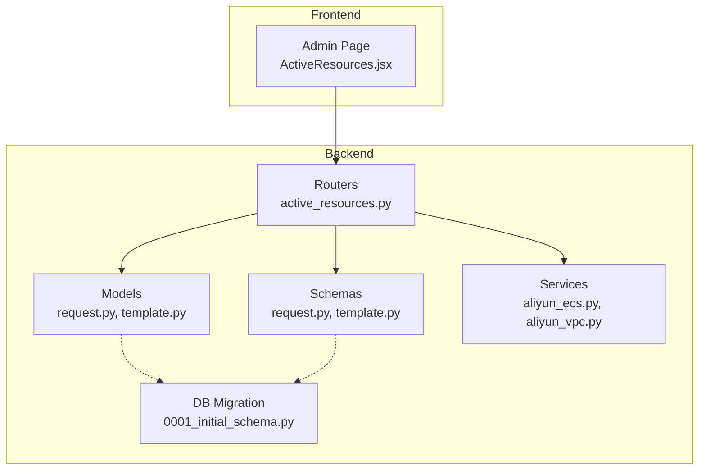
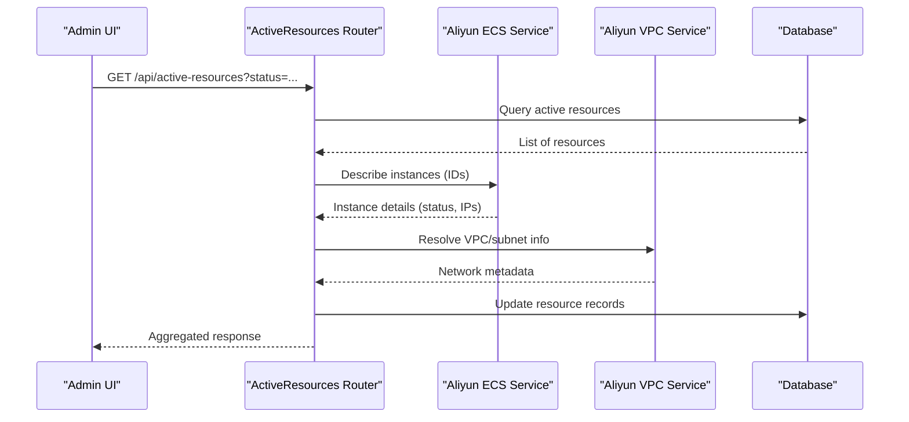
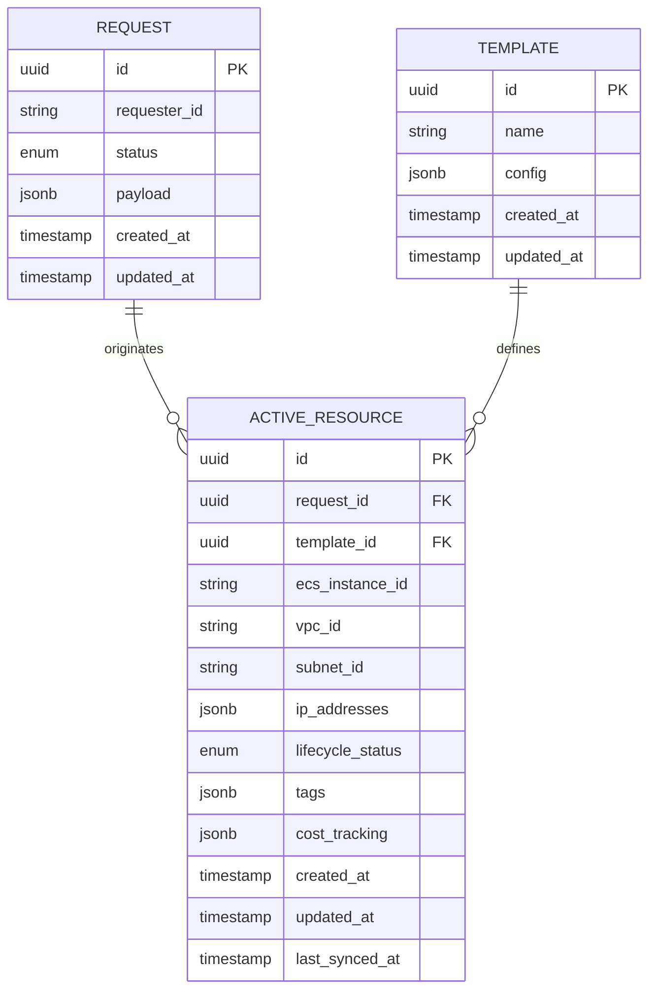
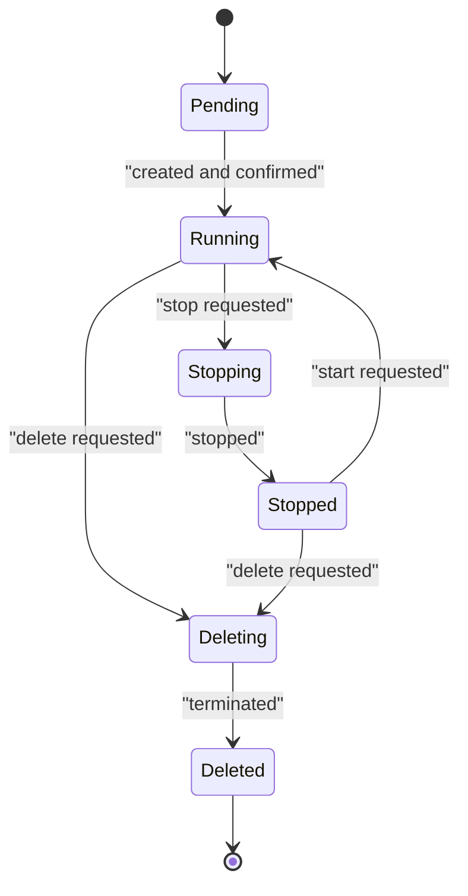
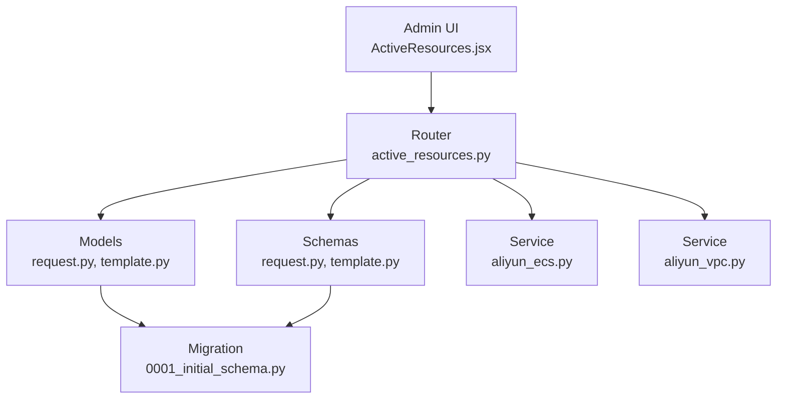

# ActiveResource Model

<cite>
**Referenced Files in This Document**
- [backend/app/models/request.py](file://backend/app/models/request.py)
- [backend/app/models/template.py](file://backend/app/models/template.py)
- [backend/app/routers/active_resources.py](file://backend/app/routers/active_resources.py)
- [backend/app/services/aliyun_ecs.py](file://backend/app/services/aliyun_ecs.py)
- [backend/app/services/aliyun_vpc.py](file://backend/app/services/aliyun_vpc.py)
- [backend/app/schemas/request.py](file://backend/app/schemas/request.py)
- [backend/app/schemas/template.py](file://backend/app/schemas/template.py)
- [backend/alembic/versions/0001_initial_schema.py](file://backend/alembic/versions/0001_initial_schema.py)
- [frontend/src/pages/admin/ActiveResources.jsx](file://frontend/src/pages/admin/ActiveResources.jsx)
</cite>

## Table of Contents
1. [Introduction](#introduction)
2. [Project Structure](#project-structure)
3. [Core Components](#core-components)
4. [Architecture Overview](#architecture-overview)
5. [Detailed Component Analysis](#detailed-component-analysis)
6. [Dependency Analysis](#dependency-analysis)
7. [Performance Considerations](#performance-considerations)
8. [Troubleshooting Guide](#troubleshooting-guide)
9. [Conclusion](#conclusion)
10. [Appendices](#appendices)

## Introduction
This document describes the data model and operational behavior for tracking deployed cloud instances, focusing on the ActiveResource concept that represents live ECS instances provisioned from requests and templates. It covers resource metadata (ECS instance IDs, VPC associations, IP addresses, lifecycle status), relationships to originating requests and templates, monitoring and health checks, automatic cleanup, state transitions, synchronization with Alibaba Cloud services, tagging strategies, cost tracking fields, compliance reporting features, scaling considerations, and database optimization techniques for frequent status updates.

## Project Structure
The backend organizes models, schemas, routers, and cloud integrations under app/. The initial schema migration defines core tables used by request, template, and active resource tracking. Frontend admin pages provide UI for viewing active resources.

**Diagram sources**
- [backend/app/models/request.py](file://backend/app/models/request.py)
- [backend/app/models/template.py](file://backend/app/models/template.py)
- [backend/app/routers/active_resources.py](file://backend/app/routers/active_resources.py)
- [backend/app/services/aliyun_ecs.py](file://backend/app/services/aliyun_ecs.py)
- [backend/app/services/aliyun_vpc.py](file://backend/app/services/aliyun_vpc.py)
- [backend/alembic/versions/0001_initial_schema.py](file://backend/alembic/versions/0001_initial_schema.py)
- [frontend/src/pages/admin/ActiveResources.jsx](file://frontend/src/pages/admin/ActiveResources.jsx)

**Section sources**
- [backend/app/models/request.py](file://backend/app/models/request.py)
- [backend/app/models/template.py](file://backend/app/models/template.py)
- [backend/app/routers/active_resources.py](file://backend/app/routers/active_resources.py)
- [backend/app/services/aliyun_ecs.py](file://backend/app/services/aliyun_ecs.py)
- [backend/app/services/aliyun_vpc.py](file://backend/app/services/aliyun_vpc.py)
- [backend/alembic/versions/0001_initial_schema.py](file://backend/alembic/versions/0001_initial_schema.py)
- [frontend/src/pages/admin/ActiveResources.jsx](file://frontend/src/pages/admin/ActiveResources.jsx)

## Core Components
- Request: Represents a user’s provisioning request, including inputs such as template selection, environment, and desired configuration. It is the originator of new resources.
- Template: Encapsulates reusable configurations for creating instances (e.g., image ID, instance type, network settings).
- Active Resource: Represents a live ECS instance created from a request and template, with metadata like ECS instance ID, VPC association, IP addresses, lifecycle status, tags, and timestamps.
- Aliyun ECS Service: Integrates with Alibaba Cloud ECS APIs to create, describe, update, and delete instances; also reads instance attributes such as IPs and status.
- Aliyun VPC Service: Integrates with Alibaba Cloud VPC APIs to resolve VPC/subnet associations and manage networking metadata.
- Active Resources Router: Exposes endpoints to list, filter, refresh, and manage active resources; orchestrates sync with cloud providers.
- Admin UI: Displays active resources and allows operators to trigger actions such as refresh or cleanup.

Key responsibilities:
- Maintain authoritative records of deployed instances and their current state.
- Keep local metadata synchronized with Alibaba Cloud service state.
- Provide auditability via timestamps and linkage to requests/templates.
- Support filtering and operations based on lifecycle status and tags.

**Section sources**
- [backend/app/models/request.py](file://backend/app/models/request.py)
- [backend/app/models/template.py](file://backend/app/models/template.py)
- [backend/app/routers/active_resources.py](file://backend/app/routers/active_resources.py)
- [backend/app/services/aliyun_ecs.py](file://backend/app/services/aliyun_ecs.py)
- [backend/app/services/aliyun_vpc.py](file://backend/app/services/aliyun_vpc.py)
- [frontend/src/pages/admin/ActiveResources.jsx](file://frontend/src/pages/admin/ActiveResources.jsx)

## Architecture Overview
The system tracks active resources by linking them to requests and templates, then synchronizing with Alibaba Cloud ECS/VPC services. The router coordinates API calls, while services encapsulate provider interactions.

**Diagram sources**
- [backend/app/routers/active_resources.py](file://backend/app/routers/active_resources.py)
- [backend/app/services/aliyun_ecs.py](file://backend/app/services/aliyun_ecs.py)
- [backend/app/services/aliyun_vpc.py](file://backend/app/services/aliyun_vpc.py)
- [backend/alembic/versions/0001_initial_schema.py](file://backend/alembic/versions/0001_initial_schema.py)

## Detailed Component Analysis

### Data Model Relationships
Active resources are linked to their originating request and template. This enables traceability from deployment back to business intent and configuration.

Notes:
- ECS instance ID uniquely identifies the cloud instance.
- VPC and subnet IDs capture networking context.
- IP addresses may include private/public addresses depending on provisioning.
- Lifecycle status reflects current state (e.g., pending, running, stopping, stopped, deleting).
- Tags support categorization and policy enforcement.
- Cost tracking fields enable billing attribution and reporting.
- Timestamps support auditing and synchronization cadence.

**Diagram sources**
- [backend/app/models/request.py](file://backend/app/models/request.py)
- [backend/app/models/template.py](file://backend/app/models/template.py)
- [backend/alembic/versions/0001_initial_schema.py](file://backend/alembic/versions/0001_initial_schema.py)

**Section sources**
- [backend/app/models/request.py](file://backend/app/models/request.py)
- [backend/app/models/template.py](file://backend/app/models/template.py)
- [backend/alembic/versions/0001_initial_schema.py](file://backend/alembic/versions/0001_initial_schema.py)

### Resource Metadata Fields
- ECS instance ID: Stable identifier for the cloud instance.
- VPC/Subnet IDs: Networking context for isolation and routing.
- IP Addresses: Private and public addresses assigned to the instance.
- Lifecycle Status: Current operational state aligned with Alibaba Cloud ECS states.
- Tags: Key-value pairs for ownership, environment, project, and compliance labels.
- Cost Tracking: Fields for cost center, project code, budget allocation, and currency.
- Timestamps: Creation, update, and last synchronization times for auditability.

These fields enable precise identification, governance, and financial accountability for each deployed instance.

**Section sources**
- [backend/app/routers/active_resources.py](file://backend/app/routers/active_resources.py)
- [backend/app/services/aliyun_ecs.py](file://backend/app/services/aliyun_ecs.py)
- [backend/app/services/aliyun_vpc.py](file://backend/app/services/aliyun_vpc.py)

### Relationship to Requests and Templates
- Originating Request: Each active resource traces back to a specific request, preserving user intent, parameters, and approval state.
- Template: Defines the baseline configuration (instance type, image, network options) used during provisioning.

This relationship supports:
- Audit trails from instance to request.
- Reuse of validated configurations via templates.
- Policy enforcement tied to template versions.

**Section sources**
- [backend/app/models/request.py](file://backend/app/models/request.py)
- [backend/app/models/template.py](file://backend/app/models/template.py)
- [backend/app/schemas/request.py](file://backend/app/schemas/request.py)
- [backend/app/schemas/template.py](file://backend/app/schemas/template.py)

### Monitoring and Health Checks
- Periodic Sync: The router can periodically call ECS describe APIs to reconcile local lifecycle status with actual cloud state.
- Health Indicators: Derived from instance status and optional application-level probes integrated via ECS tags or external health endpoints.
- Alerting: Operators can configure thresholds for stale sync times or unhealthy statuses.

Operational flow:
- Trigger sync job or endpoint.
- Fetch instance details from ECS.
- Update local records and mark last synced time.
- Surface health indicators to admin UI.

**Section sources**
- [backend/app/routers/active_resources.py](file://backend/app/routers/active_resources.py)
- [backend/app/services/aliyun_ecs.py](file://backend/app/services/aliyun_ecs.py)

### Automatic Cleanup Processes
- Expired Resources: Instances marked for deletion after TTL or when associated requests reach terminal states.
- Orphan Detection: Detect instances lacking valid request/template links and flag for review.
- Safe Deletion: Enforce policies before invoking ECS delete operations; ensure backups and logs are retained per compliance.

Cleanup workflow:
- Identify candidates by lifecycle status and timestamps.
- Validate policy constraints (tags, approvals).
- Invoke ECS delete and update local status to deleted.
- Archive audit entries for compliance.

**Section sources**
- [backend/app/routers/active_resources.py](file://backend/app/routers/active_resources.py)
- [backend/app/services/aliyun_ecs.py](file://backend/app/services/aliyun_ecs.py)

### State Transitions and Synchronization
Lifecycle transitions reflect both local state management and Alibaba Cloud ECS states. Typical transitions include:
- Pending -> Running: After successful creation and confirmation.
- Running -> Stopping/Stopped: Graceful shutdown or manual stop.
- Stopped -> Running: Restart operation.
- Any -> Deleting: Initiated by cleanup or operator action.
- Deleted: Finalized after ECS confirms termination.

Synchronization ensures local status matches cloud reality, with last synced timestamps indicating freshness.

**Diagram sources**
- [backend/app/routers/active_resources.py](file://backend/app/routers/active_resources.py)
- [backend/app/services/aliyun_ecs.py](file://backend/app/services/aliyun_ecs.py)

**Section sources**
- [backend/app/routers/active_resources.py](file://backend/app/routers/active_resources.py)
- [backend/app/services/aliyun_ecs.py](file://backend/app/services/aliyun_ecs.py)

### Tagging Strategies
Tagging supports governance, cost allocation, and compliance:
- Ownership tags: owner, team, department.
- Environment tags: env (dev/staging/prod), region.
- Project tags: project_code, initiative.
- Compliance tags: data_classification, retention_policy.
- Operational tags: ttl, auto_cleanup, backup_enabled.

Best practices:
- Enforce required tags at creation time via templates and request validation.
- Use consistent naming conventions and value sets.
- Leverage tags for automated cleanup and cost reports.

**Section sources**
- [backend/app/models/template.py](file://backend/app/models/template.py)
- [backend/app/schemas/template.py](file://backend/app/schemas/template.py)
- [backend/app/services/aliyun_ecs.py](file://backend/app/services/aliyun_ecs.py)

### Cost Tracking Fields
Cost tracking fields enable financial accountability:
- cost_center: Department or unit responsible.
- project_code: Internal project identifier.
- currency: Billing currency.
- estimated_cost: Optional pre-provision estimate.
- actual_cost: Post-facto cost from billing integration.
- period_start/period_end: Billing period boundaries.

These fields integrate with reporting dashboards and compliance audits.

**Section sources**
- [backend/app/models/request.py](file://backend/app/models/request.py)
- [backend/app/models/template.py](file://backend/app/models/template.py)
- [backend/app/schemas/request.py](file://backend/app/schemas/request.py)
- [backend/app/schemas/template.py](file://backend/app/schemas/template.py)

### Compliance Reporting Features
Compliance reporting relies on:
- Immutable audit logs for provisioning and lifecycle changes.
- Tag-based policy enforcement (e.g., mandatory tags).
- Retention policies applied via tags and TTL.
- Exportable reports for auditors covering resource inventory, ownership, and costs.

Integration points:
- Router endpoints expose filtered views for reporting.
- Services record events and timestamps for traceability.

**Section sources**
- [backend/app/routers/active_resources.py](file://backend/app/routers/active_resources.py)
- [backend/app/services/aliyun_ecs.py](file://backend/app/services/aliyun_ecs.py)

### Scaling Considerations for Large Numbers of Active Resources
- Pagination and Filtering: Implement server-side pagination and filters (status, tags, VPC) to reduce payload sizes.
- Batch Operations: Group ECS describe/delete calls to minimize API overhead.
- Indexing: Add database indexes on frequently queried columns (lifecycle_status, vpc_id, tags, last_synced_at).
- Concurrency Control: Use optimistic locking or versioned updates to avoid write conflicts during frequent syncs.
- Caching: Cache stable metadata (templates, VPC info) to reduce repeated lookups.
- Backpressure: Rate-limit cloud API calls and implement retry/backoff strategies.

**Section sources**
- [backend/app/routers/active_resources.py](file://backend/app/routers/active_resources.py)
- [backend/app/services/aliyun_ecs.py](file://backend/app/services/aliyun_ecs.py)
- [backend/alembic/versions/0001_initial_schema.py](file://backend/alembic/versions/0001_initial_schema.py)

### Database Optimization Techniques for Frequent Status Updates
- Column Partitioning: Partition large tables by time or lifecycle status to improve query performance.
- Write-Ahead Logging: Ensure reliable writes during high-frequency updates.
- Minimal Payloads: Only update changed fields to reduce transaction size.
- Connection Pooling: Tune pool sizes to handle concurrent sync jobs.
- Read Replicas: Offload read-heavy queries (admin listings) to replicas.
- Archival: Move historical records to archive tables after retention periods.

**Section sources**
- [backend/alembic/versions/0001_initial_schema.py](file://backend/alembic/versions/0001_initial_schema.py)
- [backend/app/routers/active_resources.py](file://backend/app/routers/active_resources.py)

## Dependency Analysis
The active resource subsystem depends on request and template models, cloud services for ECS/VPC, and exposes API endpoints consumed by the frontend.

**Diagram sources**
- [backend/app/models/request.py](file://backend/app/models/request.py)
- [backend/app/models/template.py](file://backend/app/models/template.py)
- [backend/app/schemas/request.py](file://backend/app/schemas/request.py)
- [backend/app/schemas/template.py](file://backend/app/schemas/template.py)
- [backend/app/routers/active_resources.py](file://backend/app/routers/active_resources.py)
- [backend/app/services/aliyun_ecs.py](file://backend/app/services/aliyun_ecs.py)
- [backend/app/services/aliyun_vpc.py](file://backend/app/services/aliyun_vpc.py)
- [backend/alembic/versions/0001_initial_schema.py](file://backend/alembic/versions/0001_initial_schema.py)
- [frontend/src/pages/admin/ActiveResources.jsx](file://frontend/src/pages/admin/ActiveResources.jsx)

**Section sources**
- [backend/app/models/request.py](file://backend/app/models/request.py)
- [backend/app/models/template.py](file://backend/app/models/template.py)
- [backend/app/schemas/request.py](file://backend/app/schemas/request.py)
- [backend/app/schemas/template.py](file://backend/app/schemas/template.py)
- [backend/app/routers/active_resources.py](file://backend/app/routers/active_resources.py)
- [backend/app/services/aliyun_ecs.py](file://backend/app/services/aliyun_ecs.py)
- [backend/app/services/aliyun_vpc.py](file://backend/app/services/aliyun_vpc.py)
- [backend/alembic/versions/0001_initial_schema.py](file://backend/alembic/versions/0001_initial_schema.py)
- [frontend/src/pages/admin/ActiveResources.jsx](file://frontend/src/pages/admin/ActiveResources.jsx)

## Performance Considerations
- Reduce API calls by batching ECS describe operations and caching stable metadata.
- Use efficient filters and indexes to speed up listing and filtering.
- Limit payload sizes with selective field projection and pagination.
- Employ background jobs for heavy sync tasks to keep API latency low.
- Monitor and tune database connection pools and query plans.

[No sources needed since this section provides general guidance]

## Troubleshooting Guide
Common issues and resolutions:
- Stale Status: If lifecycle status does not match cloud state, trigger a manual sync and verify ECS API responses.
- Missing VPC Info: Confirm VPC service connectivity and permissions; re-resolve network metadata.
- Cleanup Failures: Check policy constraints and ECS deletion results; inspect audit logs for reasons.
- High Latency: Review pagination, indexing, and batch sizes; consider read replicas for listing endpoints.

Operational steps:
- Inspect last synced timestamps and error logs.
- Validate tags and required fields for compliance.
- Re-run sync jobs with increased retries and backoff.

**Section sources**
- [backend/app/routers/active_resources.py](file://backend/app/routers/active_resources.py)
- [backend/app/services/aliyun_ecs.py](file://backend/app/services/aliyun_ecs.py)
- [backend/app/services/aliyun_vpc.py](file://backend/app/services/aliyun_vpc.py)

## Conclusion
The ActiveResource model provides a robust foundation for tracking deployed cloud instances, linking them to requests and templates, and keeping metadata synchronized with Alibaba Cloud services. With comprehensive tagging, cost tracking, and compliance reporting, it supports governance and financial accountability. Scaling and database optimizations ensure reliability under load, while monitoring and cleanup processes maintain healthy operations.

[No sources needed since this section summarizes without analyzing specific files]

## Appendices
- Example usage paths:
  - Listing active resources: [backend/app/routers/active_resources.py](file://backend/app/routers/active_resources.py)
  - ECS integration: [backend/app/services/aliyun_ecs.py](file://backend/app/services/aliyun_ecs.py)
  - VPC integration: [backend/app/services/aliyun_vpc.py](file://backend/app/services/aliyun_vpc.py)
  - Admin UI view: [frontend/src/pages/admin/ActiveResources.jsx](file://frontend/src/pages/admin/ActiveResources.jsx)

[No sources needed since this section lists references without analysis]