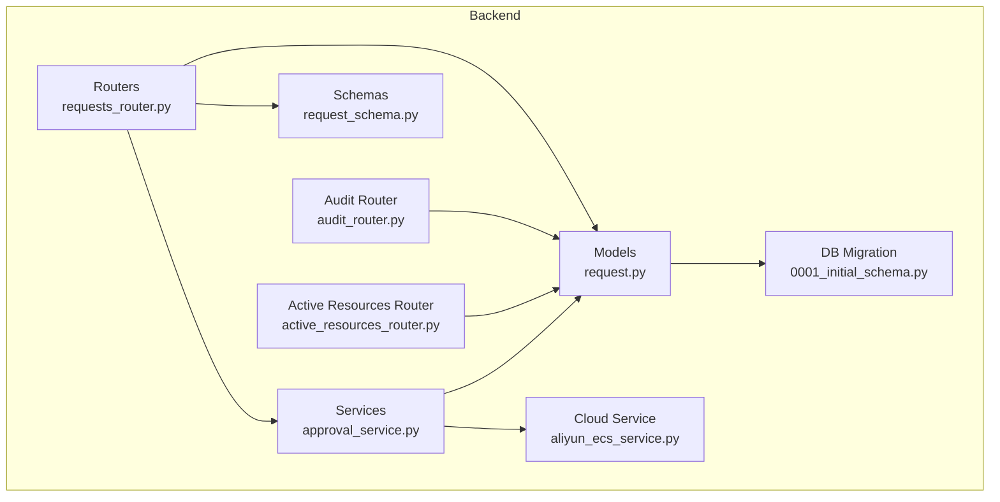
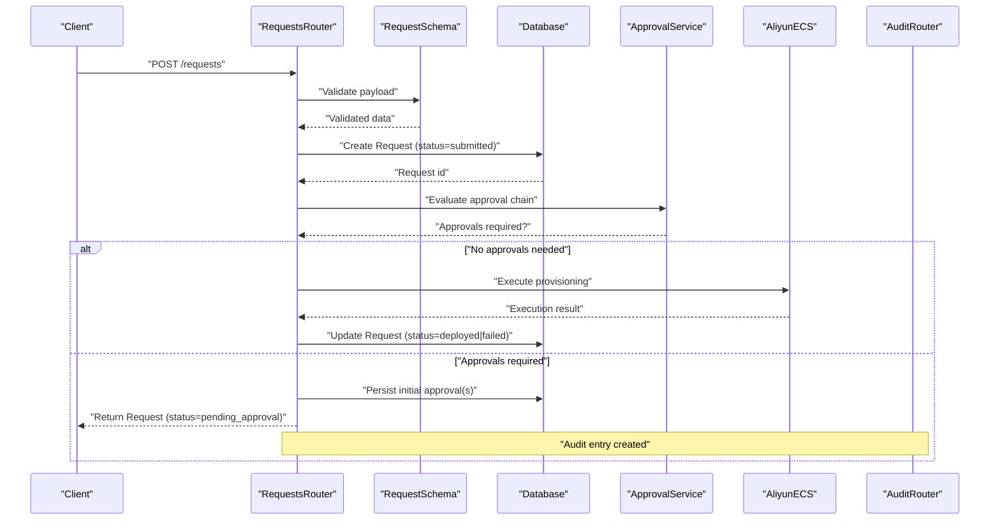
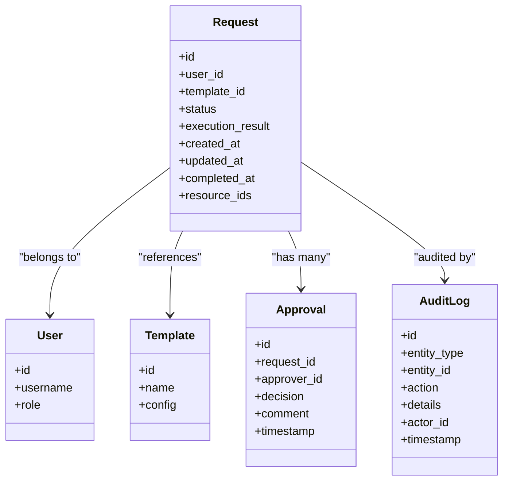

# Request Model

<cite>
**Referenced Files in This Document**
- [request.py](file://backend/app/models/request.py)
- [request_schema.py](file://backend/app/schemas/request.py)
- [requests_router.py](file://backend/app/routers/requests.py)
- [approval_model.py](file://backend/app/models/approval.py)
- [approval_schema.py](file://backend/app/schemas/approval.py)
- [approval_service.py](file://backend/app/services/approval.py)
- [template_model.py](file://backend/app/models/template.py)
- [user_model.py](file://backend/app/models/user.py)
- [audit_log_model.py](file://backend/app/models/audit_log.py)
- [audit_router.py](file://backend/app/routers/audit.py)
- [active_resources_router.py](file://backend/app/routers/active_resources.py)
- [aliyun_ecs_service.py](file://backend/app/services/aliyun_ecs.py)
- [database.py](file://backend/app/database.py)
- [0001_initial_schema.py](file://backend/alembic/versions/0001_initial_schema.py)
</cite>

## Table of Contents
1. [Introduction](#introduction)
2. [Project Structure](#project-structure)
3. [Core Components](#core-components)
4. [Architecture Overview](#architecture-overview)
5. [Detailed Component Analysis](#detailed-component-analysis)
6. [Dependency Analysis](#dependency-analysis)
7. [Performance Considerations](#performance-considerations)
8. [Troubleshooting Guide](#troubleshooting-guide)
9. [Conclusion](#conclusion)

## Introduction
This document provides a comprehensive data model and lifecycle specification for the Request entity, which represents resource provisioning attempts. It covers request fields, state transitions, validation constraints, error handling, auditing, notifications, concurrency, timeouts, and rollback procedures. The goal is to make the system understandable for both technical and non-technical stakeholders while remaining grounded in the actual implementation.

## Project Structure
The Request-related functionality spans models, schemas, routers, services, and database migrations:
- Data models define persistent entities (Request, Approval, Template, User, AuditLog).
- Schemas define API input/output contracts and validation rules.
- Routers expose HTTP endpoints for creating, querying, and managing requests and approvals.
- Services implement business logic including approval workflows and cloud resource operations.
- Database migrations capture schema evolution.

**Diagram sources**
- [request.py](file://backend/app/models/request.py)
- [request_schema.py](file://backend/app/schemas/request.py)
- [requests_router.py](file://backend/app/routers/requests.py)
- [approval_service.py](file://backend/app/services/approval.py)
- [aliyun_ecs_service.py](file://backend/app/services/aliyun_ecs.py)
- [0001_initial_schema.py](file://backend/alembic/versions/0001_initial_schema.py)
- [audit_router.py](file://backend/app/routers/audit.py)
- [active_resources_router.py](file://backend/app/routers/active_resources.py)

**Section sources**
- [request.py](file://backend/app/models/request.py)
- [request_schema.py](file://backend/app/schemas/request.py)
- [requests_router.py](file://backend/app/routers/requests.py)
- [approval_service.py](file://backend/app/services/approval.py)
- [aliyun_ecs_service.py](file://backend/app/services/aliyun_ecs.py)
- [0001_initial_schema.py](file://backend/alembic/versions/0001_initial_schema.py)
- [audit_router.py](file://backend/app/routers/audit.py)
- [active_resources_router.py](file://backend/app/routers/active_resources.py)

## Core Components
- Request model: Represents a provisioning attempt with user association, template reference, status, execution results, timestamps, and optional identifiers for created resources.
- Approval model: Captures per-request approval steps, approver identity, decisions, comments, and timestamps.
- Request schema: Defines API payloads for creating and updating requests, including validation rules.
- Requests router: Exposes endpoints for listing, creating, retrieving, and transitioning requests; integrates with approval service.
- Approval service: Orchestrates multi-step approvals, enforces policy, and triggers downstream actions upon final approval.
- Cloud service: Executes provisioning against external infrastructure (e.g., ECS), returning outcomes used to update request execution results.
- Audit log model and router: Records immutable audit events for compliance and visibility.
- Active resources router: Provides visibility into currently provisioned resources tied to successful requests.

Key relationships:
- Request belongs to a User and references a Template.
- Request has many Approvals (one per step or approver).
- Successful provisioning may create an active resource record linked back to the Request.
- All significant mutations are recorded via AuditLog entries.

**Section sources**
- [request.py](file://backend/app/models/request.py)
- [approval_model.py](file://backend/app/models/approval.py)
- [request_schema.py](file://backend/app/schemas/request.py)
- [requests_router.py](file://backend/app/routers/requests.py)
- [approval_service.py](file://backend/app/services/approval.py)
- [aliyun_ecs_service.py](file://backend/app/services/aliyun_ecs.py)
- [audit_log_model.py](file://backend/app/models/audit_log.py)
- [audit_router.py](file://backend/app/routers/audit.py)
- [active_resources_router.py](file://backend/app/routers/active_resources.py)

## Architecture Overview
The Request lifecycle flows through submission, validation, approval, execution, and completion/failure. The following diagram maps these phases to concrete components.

**Diagram sources**
- [requests_router.py](file://backend/app/routers/requests.py)
- [request_schema.py](file://backend/app/schemas/request.py)
- [approval_service.py](file://backend/app/services/approval.py)
- [aliyun_ecs_service.py](file://backend/app/services/aliyun_ecs.py)
- [audit_router.py](file://backend/app/routers/audit.py)

## Detailed Component Analysis

### Request Entity Data Model
The Request entity captures all information necessary to track a provisioning attempt from creation to completion.

- Identification and associations
  - Unique identifier for the request.
  - Foreign key to the requesting User.
  - Reference to the Template used for provisioning.
- Lifecycle and status
  - Status field representing current stage (e.g., submitted, pending_approval, approved, deploying, deployed, failed, cancelled).
  - Timestamps for creation, updates, and completion.
- Execution details
  - Execution result payload capturing success or failure details.
  - Optional identifiers for created resources (e.g., instance IDs) when provisioning succeeds.
- Metadata
  - Versioning or correlation IDs for traceability.
  - Optional notes or context attached by users or systems.

Validation constraints
- Required fields include user association and template reference.
- Status must be one of the defined states.
- Execution result structure must conform to expected schema when present.
- Resource identifiers must be unique and valid per provider format.

Error handling
- Invalid inputs return validation errors without mutating state.
- Provider failures update status to failed and persist execution results for diagnostics.
- System errors trigger audit logging and safe rollback where applicable.

State transition rules
- submitted -> pending_approval if approvals are required.
- pending_approval -> approved after final approval decision.
- approved -> deploying when execution begins.
- deploying -> deployed on success or failed on error.
- Any terminal state can be reached from earlier states via cancellation under policy.

Auditing and notifications
- Every state change and critical action is logged to AuditLog.
- Notifications are triggered on key transitions (e.g., approval required, deployment started/completed/failed).

Concurrency and timeouts
- Concurrent submissions are serialized at the database level using constraints and transactions.
- Long-running deployments use timeout guards and periodic status checks.
- Rollback procedures revert partial changes on failure.

**Section sources**
- [request.py](file://backend/app/models/request.py)
- [request_schema.py](file://backend/app/schemas/request.py)
- [0001_initial_schema.py](file://backend/alembic/versions/0001_initial_schema.py)

### Approval Chain and Workflow
The approval workflow ensures governance before provisioning.

- Approval steps
  - Each step includes approver identity, decision, comment, and timestamp.
  - Multiple steps can be configured per template or policy.
- Decision semantics
  - Pending indicates awaiting action.
  - Approved or Rejected finalize the step’s outcome.
- Orchestration
  - Approval service evaluates whether all steps are satisfied.
  - On final approval, it triggers provisioning via cloud service.
  - On rejection, request transitions to cancelled or failed depending on policy.

Workflow examples
- Single approver scenario: Request waits until one approver decides.
- Multi-stage scenario: Sequential approvals required before execution.
- Conditional approvals: Certain templates or parameters require additional reviewers.

**Section sources**
- [approval_model.py](file://backend/app/models/approval.py)
- [approval_schema.py](file://backend/app/schemas/approval.py)
- [approval_service.py](file://backend/app/services/approval.py)

### Execution and Deployment
Provisioning is executed against external infrastructure.

- Execution flow
  - Upon final approval, the service calls the cloud provider to create resources.
  - Results are captured and persisted in the request’s execution result.
- Success path
  - Status updated to deployed; resource identifiers stored.
  - Active resources become visible via dedicated endpoints.
- Failure path
  - Status updated to failed; detailed error captured.
  - Rollback attempts to clean up partially created resources.

Timeout management
- Provisioning operations are bounded by configurable timeouts.
- Timeouts transition status appropriately and ensure cleanup.

**Section sources**
- [aliyun_ecs_service.py](file://backend/app/services/aliyun_ecs.py)
- [active_resources_router.py](file://backend/app/routers/active_resources.py)

### Auditing and Status Tracking
All significant actions are audited for compliance and troubleshooting.

- Audit events
  - Creation, approval decisions, execution start/completion, failures, cancellations.
  - Includes actor identity, timestamp, and contextual details.
- Visibility
  - Audit router exposes queryable logs filtered by request, user, or time range.
- Status tracking
  - Clients poll or subscribe to status updates via request retrieval endpoints.

Notification triggers
- Events such as approval required, approval granted/denied, deployment started/completed/failed, and cancellation generate notifications to relevant parties.

**Section sources**
- [audit_log_model.py](file://backend/app/models/audit_log.py)
- [audit_router.py](file://backend/app/routers/audit.py)

### Concurrency, Timeouts, and Rollbacks
- Concurrency control
  - Database-level constraints prevent duplicate provisioning for the same request.
  - Transactions ensure atomic updates to request status and related records.
- Timeout handling
  - Configurable timeouts bound long-running operations.
  - Timed-out operations are marked and retried or rolled back based on policy.
- Rollback procedures
  - On failure, the system attempts to delete or disable partially created resources.
  - Rollback outcomes are recorded in execution results and audit logs.

**Section sources**
- [database.py](file://backend/app/database.py)
- [approval_service.py](file://backend/app/services/approval.py)
- [aliyun_ecs_service.py](file://backend/app/services/aliyun_ecs.py)

## Dependency Analysis
The Request module depends on several other components to provide end-to-end functionality.

**Diagram sources**
- [request.py](file://backend/app/models/request.py)
- [user_model.py](file://backend/app/models/user.py)
- [template_model.py](file://backend/app/models/template.py)
- [approval_model.py](file://backend/app/models/approval.py)
- [audit_log_model.py](file://backend/app/models/audit_log.py)

**Section sources**
- [request.py](file://backend/app/models/request.py)
- [user_model.py](file://backend/app/models/user.py)
- [template_model.py](file://backend/app/models/template.py)
- [approval_model.py](file://backend/app/models/approval.py)
- [audit_log_model.py](file://backend/app/models/audit_log.py)

## Performance Considerations
- Indexing
  - Ensure indexes on frequently queried fields such as status, user_id, template_id, and timestamps.
- Pagination and filtering
  - Use server-side pagination and filters for large lists of requests and audit logs.
- Asynchronous processing
  - Offload long-running provisioning tasks to background workers to keep APIs responsive.
- Caching
  - Cache read-heavy metadata like templates and user roles where appropriate.
- Connection pooling
  - Configure database connection pools to handle concurrent request loads efficiently.

[No sources needed since this section provides general guidance]

## Troubleshooting Guide
Common issues and resolutions:
- Validation errors
  - Cause: Missing or invalid fields in request payload.
  - Resolution: Review schema requirements and correct inputs.
- Approval bottlenecks
  - Cause: Pending approvals delaying provisioning.
  - Resolution: Notify approvers or escalate based on policy.
- Provisioning failures
  - Cause: External service errors or insufficient permissions.
  - Resolution: Inspect execution results and audit logs; retry or adjust configuration.
- Timeouts
  - Cause: Long-running operations exceeding limits.
  - Resolution: Increase timeout thresholds or optimize provisioning steps.
- Rollback inconsistencies
  - Cause: Partial deletions during rollback.
  - Resolution: Implement idempotent cleanup and verify resource state post-rollback.

**Section sources**
- [request_schema.py](file://backend/app/schemas/request.py)
- [approval_service.py](file://backend/app/services/approval.py)
- [aliyun_ecs_service.py](file://backend/app/services/aliyun_ecs.py)
- [audit_router.py](file://backend/app/routers/audit.py)

## Conclusion
The Request model encapsulates the full lifecycle of resource provisioning attempts, integrating user and template associations, robust approval workflows, execution outcomes, and comprehensive auditing. By enforcing clear state transitions, validation constraints, and error handling, the system ensures reliable and traceable provisioning. Concurrency controls, timeouts, and rollback mechanisms further enhance resilience and operational safety.