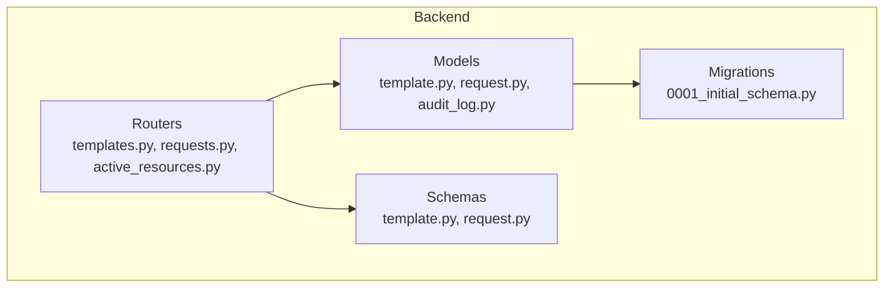
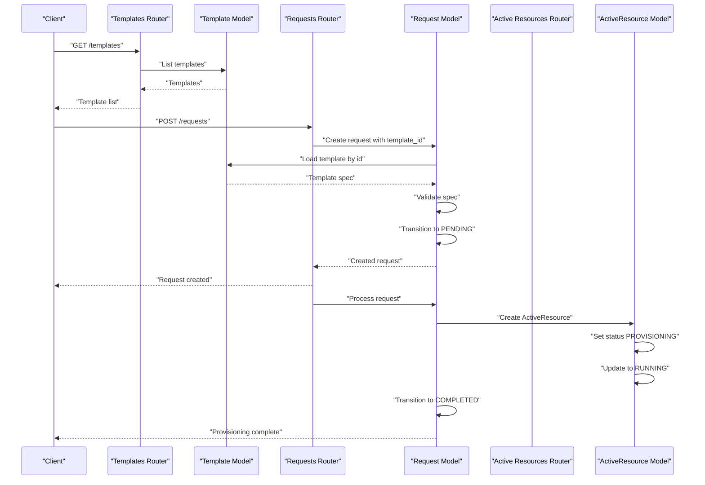
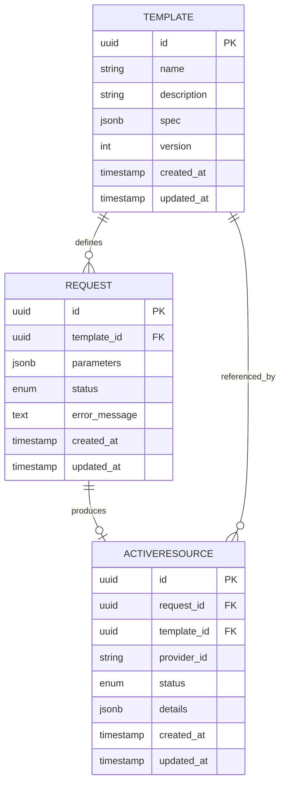
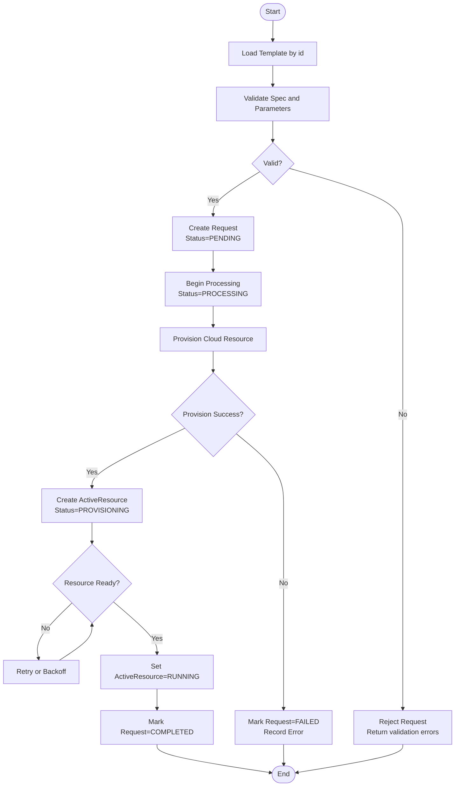
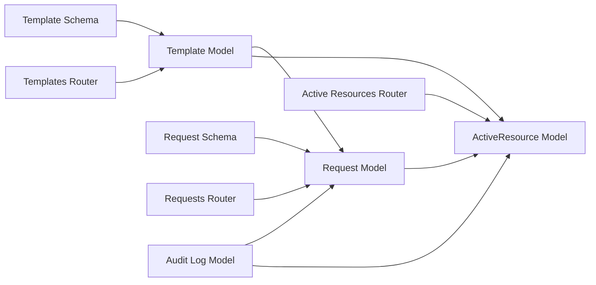

# Resource Management Models (Template, Request, ActiveResource)

<cite>
**Referenced Files in This Document**
- [template.py](file://backend/app/models/template.py)
- [request.py](file://backend/app/models/request.py)
- [audit_log.py](file://backend/app/models/audit_log.py)
- [active_resources.py](file://backend/app/routers/active_resources.py)
- [templates.py](file://backend/app/routers/templates.py)
- [requests.py](file://backend/app/routers/requests.py)
- [template.py](file://backend/app/schemas/template.py)
- [request.py](file://backend/app/schemas/request.py)
- [0001_initial_schema.py](file://backend/alembic/versions/0001_initial_schema.py)
</cite>

## Table of Contents
1. [Introduction](#introduction)
2. [Project Structure](#project-structure)
3. [Core Components](#core-components)
4. [Architecture Overview](#architecture-overview)
5. [Detailed Component Analysis](#detailed-component-analysis)
6. [Dependency Analysis](#dependency-analysis)
7. [Performance Considerations](#performance-considerations)
8. [Troubleshooting Guide](#troubleshooting-guide)
9. [Conclusion](#conclusion)

## Introduction
This document describes the data models and workflows for resource management centered on three core entities: Template, Request, and ActiveResource. It explains how templates define reusable resource configurations, how requests represent provisioning attempts against those templates, and how active resources track deployed instances. It also covers state transitions, validation rules, audit trail integration, database schema relationships, performance considerations, and caching strategies for high-scale operations.

## Project Structure
The resource management domain is implemented across models, schemas, routers, and migrations:
- Models define persistent entities and relationships.
- Schemas enforce request/response validation.
- Routers implement API endpoints that orchestrate workflows.
- Migrations capture the evolving database schema.

**Diagram sources**
- [template.py](file://backend/app/models/template.py)
- [request.py](file://backend/app/models/request.py)
- [audit_log.py](file://backend/app/models/audit_log.py)
- [templates.py](file://backend/app/routers/templates.py)
- [requests.py](file://backend/app/routers/requests.py)
- [active_resources.py](file://backend/app/routers/active_resources.py)
- [template.py](file://backend/app/schemas/template.py)
- [request.py](file://backend/app/schemas/request.py)
- [0001_initial_schema.py](file://backend/alembic/versions/0001_initial_schema.py)

**Section sources**
- [template.py](file://backend/app/models/template.py)
- [request.py](file://backend/app/models/request.py)
- [audit_log.py](file://backend/app/models/audit_log.py)
- [templates.py](file://backend/app/routers/templates.py)
- [requests.py](file://backend/app/routers/requests.py)
- [active_resources.py](file://backend/app/routers/active_resources.py)
- [template.py](file://backend/app/schemas/template.py)
- [request.py](file://backend/app/schemas/request.py)
- [0001_initial_schema.py](file://backend/alembic/versions/0001_initial_schema.py)

## Core Components
- Template: Defines a reusable configuration blueprint for cloud resources. It includes metadata, versioning, and a specification object describing instance parameters such as image, instance type, networking, and tags.
- Request: Represents a provisioning attempt tied to a template. It captures user intent, parameters, lifecycle state, and references to created resources.
- ActiveResource: Tracks live deployments resulting from successful requests. It stores provider identifiers, current status, and linkage back to the originating request and template.

Key responsibilities:
- Templates provide canonical definitions and constraints.
- Requests drive the workflow and maintain an auditable history.
- ActiveResources reflect the actual state of provisioned assets.

**Section sources**
- [template.py](file://backend/app/models/template.py)
- [request.py](file://backend/app/models/request.py)
- [active_resources.py](file://backend/app/routers/active_resources.py)

## Architecture Overview
The template-based provisioning workflow connects templates, requests, and active resources through well-defined states and validations.

**Diagram sources**
- [templates.py](file://backend/app/routers/templates.py)
- [template.py](file://backend/app/models/template.py)
- [requests.py](file://backend/app/routers/requests.py)
- [request.py](file://backend/app/models/request.py)
- [active_resources.py](file://backend/app/routers/active_resources.py)
- [active_resources.py](file://backend/app/routers/active_resources.py)

## Detailed Component Analysis

### Data Model Relationships
The following diagram shows the primary relationships between Template, Request, and ActiveResource.

**Diagram sources**
- [template.py](file://backend/app/models/template.py)
- [request.py](file://backend/app/models/request.py)
- [active_resources.py](file://backend/app/routers/active_resources.py)
- [0001_initial_schema.py](file://backend/alembic/versions/0001_initial_schema.py)

#### Template Entity
- Purpose: Encapsulates reusable resource definitions and constraints.
- Key attributes:
  - Identifier and metadata (name, description).
  - Versioned specification object (spec) defining instance parameters.
  - Timestamps for creation and updates.
- Validation:
  - Schema-level checks ensure required fields exist in spec.
  - Type constraints enforced via Pydantic-like validators.
- Usage:
  - Referenced by requests during provisioning.
  - Used to render parameter defaults and constraints.

**Section sources**
- [template.py](file://backend/app/models/template.py)
- [template.py](file://backend/app/schemas/template.py)

#### Request Entity
- Purpose: Captures a single provisioning attempt against a template.
- Key attributes:
  - Foreign key to Template.
  - Parameters payload derived from template spec.
  - Lifecycle status field tracking progression.
  - Optional error message for failed attempts.
- Lifecycle states:
  - PENDING: Created but not yet processed.
  - PROCESSING: Underway execution.
  - COMPLETED: Successfully provisioned.
  - FAILED: Provisioning failed; contains error context.
- Transitions:
  - PENDING -> PROCESSING when processing begins.
  - PROCESSING -> COMPLETED upon success.
  - PROCESSING -> FAILED on error.
- Audit trail:
  - Each transition should be recorded in the audit log with actor, action, and timestamps.

**Section sources**
- [request.py](file://backend/app/models/request.py)
- [request.py](file://backend/app/schemas/request.py)
- [requests.py](file://backend/app/routers/requests.py)

#### ActiveResource Entity
- Purpose: Tracks a deployed instance produced by a request.
- Key attributes:
  - Link to the originating Request and Template.
  - Provider identifier (e.g., cloud instance ID).
  - Current operational status.
  - Additional details (IP addresses, tags, etc.).
- Status semantics:
  - PROVISIONING: Creation in progress.
  - RUNNING: Operational.
  - STOPPED: Stopped but retained.
  - DELETED: Removed from provider.
- Consistency:
  - ActiveResource status must align with Request lifecycle.
  - Deletion of ActiveResource should update Request if necessary.

**Section sources**
- [active_resources.py](file://backend/app/routers/active_resources.py)
- [request.py](file://backend/app/models/request.py)

### Template-Based Provisioning Workflow
End-to-end flow from template selection to active resource readiness:

**Diagram sources**
- [templates.py](file://backend/app/routers/templates.py)
- [template.py](file://backend/app/models/template.py)
- [requests.py](file://backend/app/routers/requests.py)
- [request.py](file://backend/app/models/request.py)
- [active_resources.py](file://backend/app/routers/active_resources.py)

### Validation Rules for Resource Specifications
- Required fields in spec:
  - Instance type, image identifier, region, and network settings.
- Type constraints:
  - Numeric ranges for CPU/memory.
  - Allowed enumerations for instance families.
- Cross-field constraints:
  - Network CIDR must not overlap existing allocations.
  - Tags must conform to naming conventions.
- Enforcement points:
  - Schema layer validates incoming payloads.
  - Model layer enforces business rules before persistence.

**Section sources**
- [template.py](file://backend/app/schemas/template.py)
- [request.py](file://backend/app/schemas/request.py)

### Audit Trail Integration
- Events to record:
  - Request creation, state transitions, and failures.
  - ActiveResource lifecycle changes (provisioning, running, deletion).
  - Template updates affecting versions.
- Fields per event:
  - Actor identity, action type, entity type, entity id, before/after snapshots, timestamp.
- Queryability:
  - Indexes on entity_type and entity_id for efficient retrieval.
  - Time-range queries for compliance reporting.

**Section sources**
- [audit_log.py](file://backend/app/models/audit_log.py)
- [requests.py](file://backend/app/routers/requests.py)
- [active_resources.py](file://backend/app/routers/active_resources.py)

## Dependency Analysis
High-level dependencies among components involved in resource management:

**Diagram sources**
- [template.py](file://backend/app/schemas/template.py)
- [request.py](file://backend/app/schemas/request.py)
- [template.py](file://backend/app/models/template.py)
- [request.py](file://backend/app/models/request.py)
- [active_resources.py](file://backend/app/routers/active_resources.py)
- [templates.py](file://backend/app/routers/templates.py)
- [requests.py](file://backend/app/routers/requests.py)
- [audit_log.py](file://backend/app/models/audit_log.py)

**Section sources**
- [template.py](file://backend/app/models/template.py)
- [request.py](file://backend/app/models/request.py)
- [active_resources.py](file://backend/app/routers/active_resources.py)
- [templates.py](file://backend/app/routers/templates.py)
- [requests.py](file://backend/app/routers/requests.py)
- [audit_log.py](file://backend/app/models/audit_log.py)

## Performance Considerations
- Database indexing:
  - Index foreign keys (template_id, request_id) and frequently filtered columns (status, created_at).
  - Partial indexes for active sets (e.g., status = RUNNING).
- Query optimization:
  - Use selective projections for listing endpoints.
  - Avoid N+1 queries by eager loading related entities where appropriate.
- Concurrency control:
  - Apply optimistic locking or row-level locks when updating request/active resource states.
  - Idempotent request processing to handle retries safely.
- Caching strategies:
  - Cache template specs with short TTLs keyed by template id and version.
  - Invalidate cache on template updates.
  - Consider read replicas for heavy read workloads (template listings).
- Backpressure and rate limiting:
  - Limit concurrent provisioning jobs per tenant or globally.
  - Implement exponential backoff for external provider calls.

[No sources needed since this section provides general guidance]

## Troubleshooting Guide
Common issues and diagnostics:
- Validation failures:
  - Check schema violations in request payloads against template spec.
  - Inspect error messages returned by the request creation endpoint.
- State inconsistencies:
  - Verify Request status matches ActiveResource status.
  - Review audit logs for missing transitions.
- Provisioning timeouts:
  - Monitor provider-side job statuses and reconcile with ActiveResource.
  - Ensure retry/backoff logic is functioning correctly.
- Performance regressions:
  - Analyze slow queries using database profiling.
  - Confirm cache hit rates for template lookups.

**Section sources**
- [requests.py](file://backend/app/routers/requests.py)
- [active_resources.py](file://backend/app/routers/active_resources.py)
- [audit_log.py](file://backend/app/models/audit_log.py)

## Conclusion
The Template, Request, and ActiveResource models form a robust foundation for template-driven resource provisioning. Clear state transitions, strong validation, and comprehensive auditing enable reliable operations at scale. With careful attention to indexing, concurrency, and caching, the system can support large-scale environments while maintaining responsiveness and consistency.