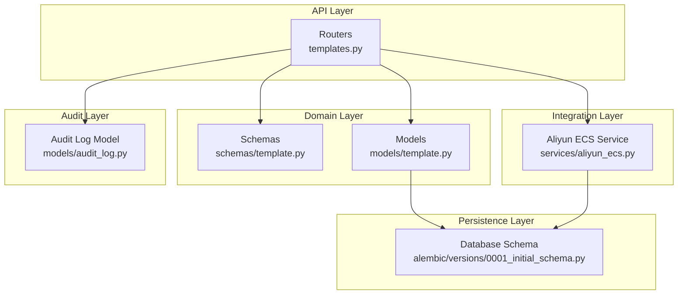
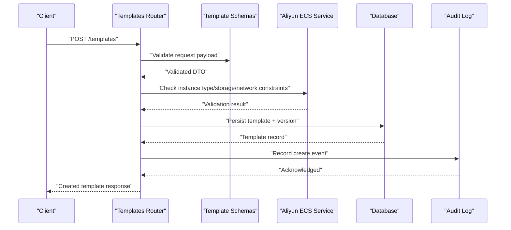
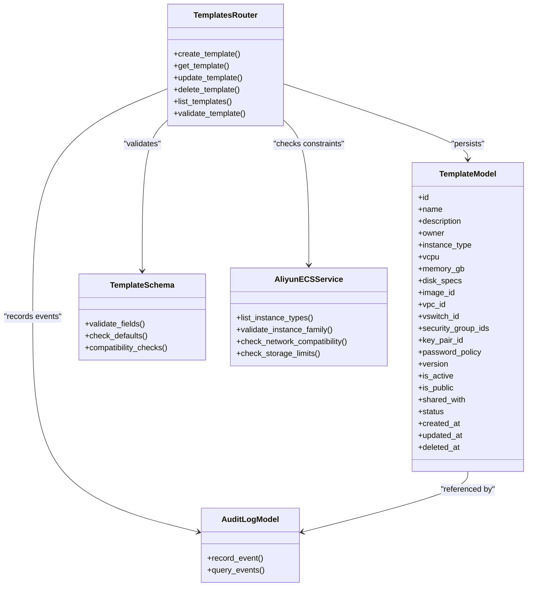

# Template Model

<cite>
**Referenced Files in This Document**
- [template.py](file://backend/app/models/template.py)
- [template.py](file://backend/app/schemas/template.py)
- [templates.py](file://backend/app/routers/templates.py)
- [aliyun_ecs.py](file://backend/app/services/aliyun_ecs.py)
- [audit_log.py](file://backend/app/models/audit_log.py)
- [0001_initial_schema.py](file://backend/alembic/versions/0001_initial_schema.py)
</cite>

## Table of Contents
1. [Introduction](#introduction)
2. [Project Structure](#project-structure)
3. [Core Components](#core-components)
4. [Architecture Overview](#architecture-overview)
5. [Detailed Component Analysis](#detailed-component-analysis)
6. [Dependency Analysis](#dependency-analysis)
7. [Performance Considerations](#performance-considerations)
8. [Troubleshooting Guide](#troubleshooting-guide)
9. [Conclusion](#conclusion)

## Introduction
This document provides comprehensive data model documentation for the Template entity used to define reusable Alibaba Cloud ECS instance configurations. It covers template structure, resource specifications, configuration parameters, validation rules, versioning and sharing mechanisms, inheritance patterns, lifecycle management, caching strategies, and audit trail integration. The goal is to help developers and operators understand how templates are modeled, validated, stored, and consumed across the system.

## Project Structure
The Template entity spans multiple layers:
- Data models and schemas define the canonical representation and API contracts.
- Routers expose endpoints for CRUD operations and validation.
- Services integrate with Alibaba Cloud APIs to validate and resolve resource constraints.
- Database migrations define persistence schema.
- Audit logging captures changes for compliance and traceability.

**Diagram sources**
- [templates.py](file://backend/app/routers/templates.py)
- [template.py](file://backend/app/schemas/template.py)
- [template.py](file://backend/app/models/template.py)
- [aliyun_ecs.py](file://backend/app/services/aliyun_ecs.py)
- [0001_initial_schema.py](file://backend/alembic/versions/0001_initial_schema.py)
- [audit_log.py](file://backend/app/models/audit_log.py)

**Section sources**
- [template.py](file://backend/app/models/template.py)
- [template.py](file://backend/app/schemas/template.py)
- [templates.py](file://backend/app/routers/templates.py)
- [aliyun_ecs.py](file://backend/app/services/aliyun_ecs.py)
- [0001_initial_schema.py](file://backend/alembic/versions/0001_initial_schema.py)
- [audit_log.py](file://backend/app/models/audit_log.py)

## Core Components
- Template Model: Defines persistent fields for template identity, metadata, resource specs, network/security settings, and versioning/sharing attributes.
- Template Schemas: Pydantic models that enforce input validation, default values, and compatibility checks against Alibaba Cloud ECS constraints.
- Templates Router: Exposes REST endpoints for creating, updating, listing, and validating templates; orchestrates service calls and audit events.
- Aliyun ECS Service: Provides capability discovery and constraint validation (instance types, storage classes, VPC/VSwitch availability).
- Audit Log Model: Records template mutations for traceability.
- Database Schema: Migration file defines table structures and relationships.

Key responsibilities:
- Validation: Ensure required fields, ranges, and allowed values match Alibaba Cloud ECS capabilities.
- Versioning: Maintain versions per template to support rollbacks and lineage.
- Sharing: Control visibility and access via sharing flags or scopes.
- Inheritance: Allow derived templates to extend base templates with overrides.
- Lifecycle: Manage creation, activation, deprecation, and archival states.

**Section sources**
- [template.py](file://backend/app/models/template.py)
- [template.py](file://backend/app/schemas/template.py)
- [templates.py](file://backend/app/routers/templates.py)
- [aliyun_ecs.py](file://backend/app/services/aliyun_ecs.py)
- [audit_log.py](file://backend/app/models/audit_log.py)
- [0001_initial_schema.py](file://backend/alembic/versions/0001_initial_schema.py)

## Architecture Overview
The Template workflow integrates API, validation, cloud capability checks, persistence, and auditing.

**Diagram sources**
- [templates.py](file://backend/app/routers/templates.py)
- [template.py](file://backend/app/schemas/template.py)
- [aliyun_ecs.py](file://backend/app/services/aliyun_ecs.py)
- [audit_log.py](file://backend/app/models/audit_log.py)
- [0001_initial_schema.py](file://backend/alembic/versions/0001_initial_schema.py)

## Detailed Component Analysis

### Template Data Model
The Template model represents a reusable ECS configuration blueprint. Typical fields include:
- Identity and metadata: id, name, description, owner, tags
- Resource specifications: instance_type, vcpu, memory_gb, disk_specs, image_id
- Network settings: vpc_id, vswitch_id, security_group_ids, public_ip_enabled
- Security configurations: key_pair_id, password_policy, ssh_access_allowed
- Versioning and sharing: version, is_active, is_public, shared_with
- Lifecycle state: status (draft, active, deprecated, archived), created_at, updated_at, deleted_at

Relationships:
- One-to-many with TemplateVersion for historical snapshots
- Many-to-many with Tag entities if tagging is implemented
- References to VPC/VSwitch/SecurityGroup resources by ID

Complexity considerations:
- Indexes on frequently queried fields (name, owner, status, is_public)
- Unique constraints on (name, owner, version) to prevent duplicates
- Soft delete pattern using deleted_at for retention and recovery

**Section sources**
- [template.py](file://backend/app/models/template.py)
- [0001_initial_schema.py](file://backend/alembic/versions/0001_initial_schema.py)

### Template Schemas and Validation Rules
Pydantic schemas enforce:
- Required fields: name, instance_type, vpc_id, vswitch_id, at least one security group
- Allowed values: instance_type must be present in Alibaba Cloud supported list
- Numeric ranges: vcpu within supported bounds, memory_gb aligned with instance family
- Storage constraints: disk class and size limits per instance family
- Network constraints: valid CIDR ranges, compatible VPC/VSwitch pairs
- Security constraints: key pair existence, password policy compliance
- Defaults: public_ip_enabled defaults to false unless explicitly set; is_public defaults to false
- Compatibility checks: cross-field validations such as memory matching instance family requirements

Error handling:
- Field-level errors with clear messages
- Aggregated validation failures returned to clients

**Section sources**
- [template.py](file://backend/app/schemas/template.py)
- [aliyun_ecs.py](file://backend/app/services/aliyun_ecs.py)

### Templates Router Endpoints
Endpoints typically include:
- POST /templates: Create and validate a new template
- GET /templates/{id}: Retrieve template details
- PUT /templates/{id}: Update template (creates a new version)
- DELETE /templates/{id}: Soft-delete template
- GET /templates: List templates with filters (owner, status, is_public)
- POST /templates/{id}/validate: Validate template against current Alibaba Cloud constraints without persisting

Processing logic:
- Request parsing and schema validation
- Capability checks via Aliyun ECS service
- Persistence and version increment
- Audit logging for all mutations
- Response serialization

**Section sources**
- [templates.py](file://backend/app/routers/templates.py)
- [template.py](file://backend/app/schemas/template.py)
- [aliyun_ecs.py](file://backend/app/services/aliyun_ecs.py)
- [audit_log.py](file://backend/app/models/audit_log.py)

### Aliyun ECS Integration and Compatibility Checks
The Aliyun ECS service provides:
- Instance family and type enumeration
- Supported CPU/memory combinations
- Disk class and size limits
- VPC/VSwitch availability and compatibility
- Security group constraints

Compatibility checks:
- Validate instance_type exists and matches requested vcpu/memory
- Ensure disk specs align with instance family capabilities
- Confirm VPC/VSwitch belong to the same region and are routable
- Verify security groups exist and are accessible to the requesting user

**Section sources**
- [aliyun_ecs.py](file://backend/app/services/aliyun_ecs.py)

### Versioning, Sharing, and Inheritance
Versioning:
- Each update increments version while preserving prior snapshots
- Active version determines runtime behavior
- Rollback creates a new version pointing to previous snapshot

Sharing:
- is_public flag controls global visibility
- shared_with allows scoped sharing to specific users or teams
- Access control enforced at router and service layers

Inheritance:
- Base templates can be referenced by derived templates
- Derived templates override specific fields while inheriting others
- Merge strategy applies base defaults then layer overrides

**Section sources**
- [template.py](file://backend/app/models/template.py)
- [template.py](file://backend/app/schemas/template.py)
- [templates.py](file://backend/app/routers/templates.py)

### Lifecycle Management
States:
- Draft: Created but not yet validated or published
- Active: Validated and available for provisioning
- Deprecated: No longer recommended; still usable for existing references
- Archived: Hidden from listings; retained for compliance

Transitions:
- Draft -> Active after successful validation and capability checks
- Active -> Deprecated when superseded by newer versions
- Any -> Archived upon soft deletion or retention policy

**Section sources**
- [template.py](file://backend/app/models/template.py)
- [templates.py](file://backend/app/routers/templates.py)

### Audit Trail Integration
Audit events captured:
- Template created, updated, deleted
- Version increments and rollbacks
- Sharing changes and visibility toggles
- Validation outcomes and error contexts

Retention and querying:
- Immutable log entries with timestamps and actor IDs
- Searchable by template ID, action type, and time range

**Section sources**
- [audit_log.py](file://backend/app/models/audit_log.py)
- [templates.py](file://backend/app/routers/templates.py)

### Database Schema Examples
The migration file defines tables and relationships for templates and related entities. Key aspects:
- Templates table with columns for identity, metadata, resource specs, network/security settings, versioning, sharing, and lifecycle state
- TemplateVersions table storing snapshots of template configurations
- Indexes and constraints ensuring query performance and data integrity
- Foreign keys linking to VPC/VSwitch/SecurityGroup identifiers where applicable

Note: Refer to the migration file for exact column definitions and constraints.

**Section sources**
- [0001_initial_schema.py](file://backend/alembic/versions/0001_initial_schema.py)

### Example Template Definitions
Representative examples illustrate typical usage patterns:
- Minimal template: specifies instance_type, vpc_id, vswitch_id, and security_group_ids
- Full template: includes disk_specs, image_id, public_ip_enabled, key_pair_id, and password_policy
- Derived template: inherits from a base template and overrides instance_type and disk_specs

These examples demonstrate field combinations and default behaviors.

**Section sources**
- [template.py](file://backend/app/schemas/template.py)
- [templates.py](file://backend/app/routers/templates.py)

## Dependency Analysis
The Template subsystem depends on:
- Schemas for validation and serialization
- Aliyun ECS service for capability discovery and constraint checks
- Database for persistence and versioning
- Audit log for change tracking

**Diagram sources**
- [template.py](file://backend/app/models/template.py)
- [template.py](file://backend/app/schemas/template.py)
- [templates.py](file://backend/app/routers/templates.py)
- [aliyun_ecs.py](file://backend/app/services/aliyun_ecs.py)
- [audit_log.py](file://backend/app/models/audit_log.py)

**Section sources**
- [template.py](file://backend/app/models/template.py)
- [template.py](file://backend/app/schemas/template.py)
- [templates.py](file://backend/app/routers/templates.py)
- [aliyun_ecs.py](file://backend/app/services/aliyun_ecs.py)
- [audit_log.py](file://backend/app/models/audit_log.py)

## Performance Considerations
- Caching strategies:
  - Cache Alibaba Cloud instance type enumerations and constraints to reduce API calls
  - Cache capability results keyed by region and account context
  - Use short TTLs for dynamic capability data and longer TTLs for static reference data
- Query optimization:
  - Index common filter fields (owner, status, is_public)
  - Paginate list endpoints to avoid large payloads
- Validation efficiency:
  - Precompute compatibility checks during creation/update
  - Defer expensive checks until necessary (e.g., on activation)

[No sources needed since this section provides general guidance]

## Troubleshooting Guide
Common issues and resolutions:
- Invalid instance_type:
  - Check Aliyun ECS service response for supported families
  - Ensure requested vcpu/memory align with instance family constraints
- Network incompatibility:
  - Verify VPC/VSwitch belong to the same region and are routable
  - Confirm security groups exist and are accessible
- Storage limits exceeded:
  - Validate disk class and size against instance family limits
- Validation errors:
  - Review schema error messages for missing or out-of-range fields
  - Apply defaults where appropriate and re-validate
- Audit discrepancies:
  - Inspect audit logs for mutation history and actor context
  - Correlate timestamps with deployment or configuration changes

**Section sources**
- [template.py](file://backend/app/schemas/template.py)
- [aliyun_ecs.py](file://backend/app/services/aliyun_ecs.py)
- [audit_log.py](file://backend/app/models/audit_log.py)

## Conclusion
The Template model encapsulates reusable ECS configurations with robust validation, versioning, sharing, and lifecycle management. By integrating with Alibaba Cloud ECS services, it ensures compatibility and reliability. Comprehensive audit trails provide traceability, while caching and indexing strategies optimize performance. Adhering to the documented schemas and workflows enables consistent template authoring and consumption across the platform.