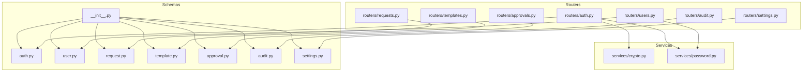
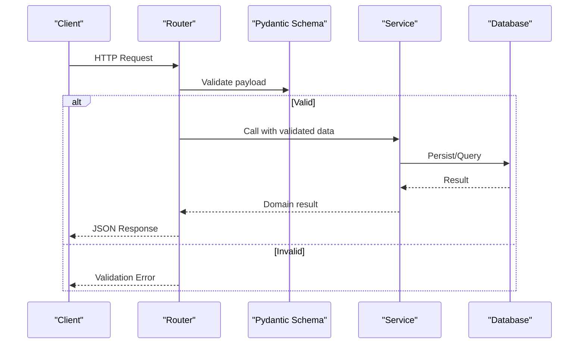
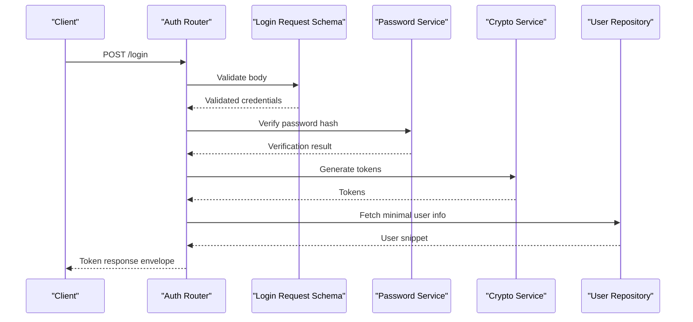
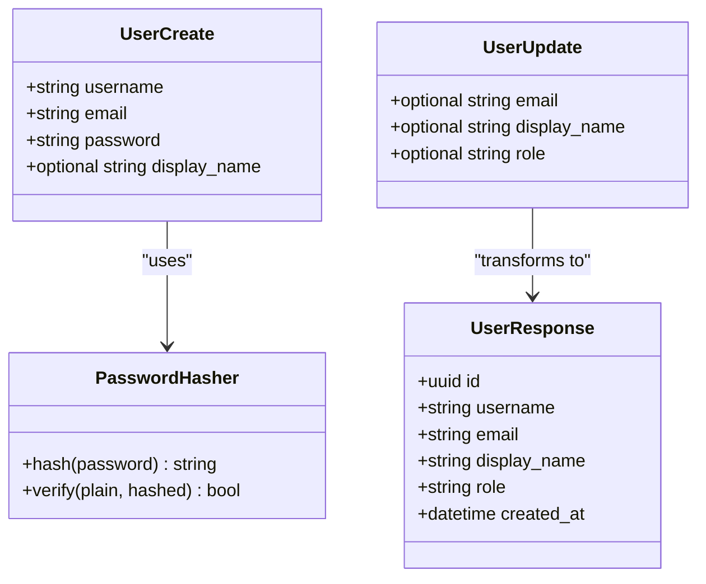
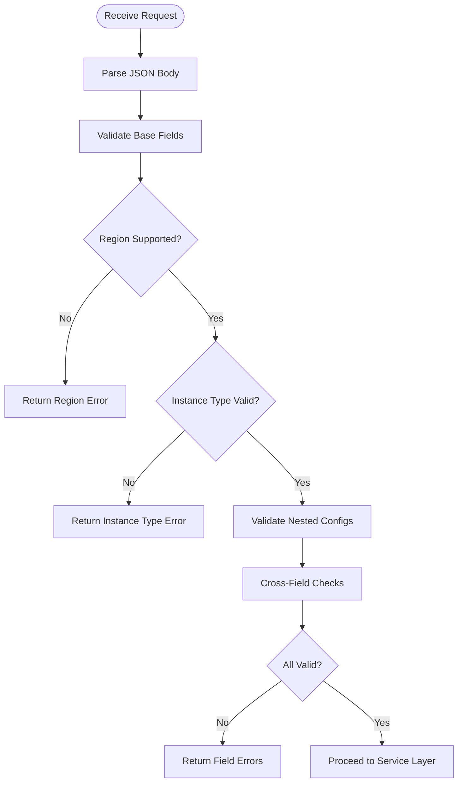
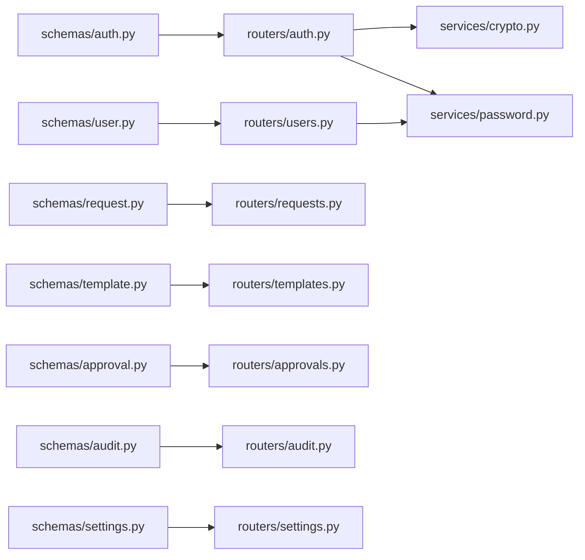

# Schemas & Data Validation

<cite>
**Referenced Files in This Document**
- [backend/app/schemas/__init__.py](file://backend/app/schemas/__init__.py)
- [backend/app/schemas/auth.py](file://backend/app/schemas/auth.py)
- [backend/app/schemas/user.py](file://backend/app/schemas/user.py)
- [backend/app/schemas/request.py](file://backend/app/schemas/request.py)
- [backend/app/schemas/template.py](file://backend/app/schemas/template.py)
- [backend/app/schemas/approval.py](file://backend/app/schemas/approval.py)
- [backend/app/schemas/audit.py](file://backend/app/schemas/audit.py)
- [backend/app/schemas/settings.py](file://backend/app/schemas/settings.py)
- [backend/app/routers/auth.py](file://backend/app/routers/auth.py)
- [backend/app/routers/users.py](file://backend/app/routers/users.py)
- [backend/app/routers/requests.py](file://backend/app/routers/requests.py)
- [backend/app/routers/templates.py](file://backend/app/routers/templates.py)
- [backend/app/routers/approvals.py](file://backend/app/routers/approvals.py)
- [backend/app/routers/audit.py](file://backend/app/routers/audit.py)
- [backend/app/routers/settings.py](file://backend/app/routers/settings.py)
- [backend/app/services/crypto.py](file://backend/app/services/crypto.py)
- [backend/app/services/password.py](file://backend/app/services/password.py)
</cite>

## Table of Contents
1. [Introduction](#introduction)
2. [Project Structure](#project-structure)
3. [Core Components](#core-components)
4. [Architecture Overview](#architecture-overview)
5. [Detailed Component Analysis](#detailed-component-analysis)
6. [Dependency Analysis](#dependency-analysis)
7. [Performance Considerations](#performance-considerations)
8. [Troubleshooting Guide](#troubleshooting-guide)
9. [Conclusion](#conclusion)
10. [Appendices](#appendices)

## Introduction
This document explains the Pydantic schema definitions and data validation patterns used across the backend. It covers schema hierarchy, inheritance, reusable components, validation rules, custom validators, transformation logic, request/response design, nested object validation, conditional validation, versioning strategies, backward compatibility, migration approaches, guidelines for creating new schemas, implementing custom validation, optimizing serialization performance, and error message customization with internationalization support.

## Project Structure
The schemas are organized by domain under backend/app/schemas. Each domain typically defines:
- Request schemas (input validation)
- Response schemas (output serialization)
- Shared or base models for reuse
- Optional enums and constants for constrained fields

Routers consume these schemas to validate incoming requests and serialize responses. Services may transform validated data into domain objects or API payloads.

**Diagram sources**
- [backend/app/schemas/__init__.py](file://backend/app/schemas/__init__.py)
- [backend/app/schemas/auth.py](file://backend/app/schemas/auth.py)
- [backend/app/schemas/user.py](file://backend/app/schemas/user.py)
- [backend/app/schemas/request.py](file://backend/app/schemas/request.py)
- [backend/app/schemas/template.py](file://backend/app/schemas/template.py)
- [backend/app/schemas/approval.py](file://backend/app/schemas/approval.py)
- [backend/app/schemas/audit.py](file://backend/app/schemas/audit.py)
- [backend/app/schemas/settings.py](file://backend/app/schemas/settings.py)
- [backend/app/routers/auth.py](file://backend/app/routers/auth.py)
- [backend/app/routers/users.py](file://backend/app/routers/users.py)
- [backend/app/routers/requests.py](file://backend/app/routers/requests.py)
- [backend/app/routers/templates.py](file://backend/app/routers/templates.py)
- [backend/app/routers/approvals.py](file://backend/app/routers/approvals.py)
- [backend/app/routers/audit.py](file://backend/app/routers/audit.py)
- [backend/app/routers/settings.py](file://backend/app/routers/settings.py)
- [backend/app/services/crypto.py](file://backend/app/services/crypto.py)
- [backend/app/services/password.py](file://backend/app/services/password.py)

**Section sources**
- [backend/app/schemas/__init__.py](file://backend/app/schemas/__init__.py)
- [backend/app/routers/auth.py](file://backend/app/routers/auth.py)
- [backend/app/routers/users.py](file://backend/app/routers/users.py)
- [backend/app/routers/requests.py](file://backend/app/routers/requests.py)
- [backend/app/routers/templates.py](file://backend/app/routers/templates.py)
- [backend/app/routers/approvals.py](file://backend/app/routers/approvals.py)
- [backend/app/routers/audit.py](file://backend/app/routers/audit.py)
- [backend/app/routers/settings.py](file://backend/app/routers/settings.py)

## Core Components
This section summarizes the primary schema domains and their responsibilities:
- Authentication: login, token issuance, refresh flows
- Users: user profiles, role-based attributes, password handling
- Requests: ECS resource provisioning requests, status transitions
- Templates: reusable configuration templates for requests
- Approvals: approval workflow entities and actions
- Audit: immutable audit log entries
- Settings: system-wide configuration keys/values

Common patterns include:
- Base response wrappers for consistent API envelopes
- Enumerations for constrained fields (e.g., statuses, roles)
- Nested models for complex payloads
- Validators and field constraints for input safety
- Transformations between request and response models

**Section sources**
- [backend/app/schemas/auth.py](file://backend/app/schemas/auth.py)
- [backend/app/schemas/user.py](file://backend/app/schemas/user.py)
- [backend/app/schemas/request.py](file://backend/app/schemas/request.py)
- [backend/app/schemas/template.py](file://backend/app/schemas/template.py)
- [backend/app/schemas/approval.py](file://backend/app/schemas/approval.py)
- [backend/app/schemas/audit.py](file://backend/app/schemas/audit.py)
- [backend/app/schemas/settings.py](file://backend/app/schemas/settings.py)

## Architecture Overview
The validation architecture follows a clear separation:
- Routers declare endpoints and use Pydantic schemas as request bodies/query parameters/path items
- Schemas enforce types, constraints, and custom validation
- Services perform business logic using validated data
- Responses are serialized via response schemas

[No sources needed since this diagram shows conceptual workflow, not actual code structure]

## Detailed Component Analysis

### Authentication Schemas
Responsibilities:
- Define login credentials and token-related payloads
- Enforce required fields and formats
- Provide response envelopes for tokens and user context

Key aspects:
- Input schemas for username/password and optional device/session metadata
- Output schemas for access tokens, refresh tokens, and user profile snippets
- Optional nested structures for session details

Validation patterns:
- Required string fields for identity
- Length and format constraints where applicable
- Custom validators for password strength or token expiration checks

Serialization:
- Exclude sensitive fields from responses
- Use aliases for stable API contracts

**Section sources**
- [backend/app/schemas/auth.py](file://backend/app/schemas/auth.py)
- [backend/app/routers/auth.py](file://backend/app/routers/auth.py)
- [backend/app/services/crypto.py](file://backend/app/services/crypto.py)
- [backend/app/services/password.py](file://backend/app/services/password.py)

#### Sequence Diagram: Login Flow

**Diagram sources**
- [backend/app/routers/auth.py](file://backend/app/routers/auth.py)
- [backend/app/schemas/auth.py](file://backend/app/schemas/auth.py)
- [backend/app/services/password.py](file://backend/app/services/password.py)
- [backend/app/services/crypto.py](file://backend/app/services/crypto.py)

### User Schemas
Responsibilities:
- Represent user profiles and administrative operations
- Enforce role-based constraints and email uniqueness
- Provide safe read-only views excluding secrets

Key aspects:
- Create/update input schemas with optional fields and defaults
- Read-only response schemas that omit sensitive data
- Role/status enumerations for access control

Validation patterns:
- Email format validation
- Password hashing integration on write paths
- Conditional fields based on role or status

**Section sources**
- [backend/app/schemas/user.py](file://backend/app/schemas/user.py)
- [backend/app/routers/users.py](file://backend/app/routers/users.py)
- [backend/app/services/password.py](file://backend/app/services/password.py)

#### Class Diagram: User Models

**Diagram sources**
- [backend/app/schemas/user.py](file://backend/app/schemas/user.py)
- [backend/app/services/password.py](file://backend/app/services/password.py)

### Request Schemas (ECS Provisioning)
Responsibilities:
- Model ECS instance provisioning requests
- Enforce region, instance type, and network constraints
- Support nested configurations such as disk and security groups

Key aspects:
- Nested models for compute, storage, and networking
- Enumerations for instance families and regions
- Conditional validation depending on selected options

Validation patterns:
- Range checks for CPU/memory/disk sizes
- Cross-field validation (e.g., VPC/subnet compatibility)
- Template-driven defaults when applicable

**Section sources**
- [backend/app/schemas/request.py](file://backend/app/schemas/request.py)
- [backend/app/routers/requests.py](file://backend/app/routers/requests.py)

#### Flowchart: Request Validation Logic

**Diagram sources**
- [backend/app/schemas/request.py](file://backend/app/schemas/request.py)

### Template Schemas
Responsibilities:
- Define reusable configuration templates for requests
- Allow template selection to reduce input complexity
- Provide versioned template snapshots for reproducibility

Key aspects:
- Template definition schemas with nested config blocks
- Version fields and effective date ranges
- Mapping from template to request schema

Validation patterns:
- Template existence and active range checks
- Default value propagation and override rules

**Section sources**
- [backend/app/schemas/template.py](file://backend/app/schemas/template.py)
- [backend/app/routers/templates.py](file://backend/app/routers/templates.py)

### Approval Schemas
Responsibilities:
- Model approval workflows for requests
- Capture approver identity, comments, and timestamps
- Enforce state transitions and permissions

Key aspects:
- Approval action enums (approve/reject)
- Conditional fields based on action
- Linkage to request and approver entities

Validation patterns:
- State machine enforcement
- Duplicate action prevention

**Section sources**
- [backend/app/schemas/approval.py](file://backend/app/schemas/approval.py)
- [backend/app/routers/approvals.py](file://backend/app/routers/approvals.py)

### Audit Schemas
Responsibilities:
- Immutable records of significant events
- Include actor, action, target, and metadata
- Ensure tamper-evident structure

Key aspects:
- Strict typing for event categories and actors
- Read-only response schemas
- Pagination-friendly structures

Validation patterns:
- Non-editable fields enforced at schema level
- Metadata shape validation

**Section sources**
- [backend/app/schemas/audit.py](file://backend/app/schemas/audit.py)
- [backend/app/routers/audit.py](file://backend/app/routers/audit.py)

### Settings Schemas
Responsibilities:
- System-wide key/value configuration management
- Typed values and scopes (global, per-tenant)
- Safe updates with validation

Key aspects:
- Value type discrimination (string, number, boolean, json)
- Scoped keys and precedence rules
- Read-only exposure of sensitive settings

Validation patterns:
- Key naming conventions and allowed prefixes
- Value type enforcement and sanitization

**Section sources**
- [backend/app/schemas/settings.py](file://backend/app/schemas/settings.py)
- [backend/app/routers/settings.py](file://backend/app/routers/settings.py)

## Dependency Analysis
Schemas depend on:
- Standard library types and Pydantic primitives
- Enums and constants defined within or imported by schemas
- Services for transformations (e.g., password hashing, crypto utilities)

Routers depend on:
- Schemas for request/response modeling
- Services for business logic
- Database repositories for persistence

**Diagram sources**
- [backend/app/schemas/auth.py](file://backend/app/schemas/auth.py)
- [backend/app/schemas/user.py](file://backend/app/schemas/user.py)
- [backend/app/schemas/request.py](file://backend/app/schemas/request.py)
- [backend/app/schemas/template.py](file://backend/app/schemas/template.py)
- [backend/app/schemas/approval.py](file://backend/app/schemas/approval.py)
- [backend/app/schemas/audit.py](file://backend/app/schemas/audit.py)
- [backend/app/schemas/settings.py](file://backend/app/schemas/settings.py)
- [backend/app/routers/auth.py](file://backend/app/routers/auth.py)
- [backend/app/routers/users.py](file://backend/app/routers/users.py)
- [backend/app/routers/requests.py](file://backend/app/routers/requests.py)
- [backend/app/routers/templates.py](file://backend/app/routers/templates.py)
- [backend/app/routers/approvals.py](file://backend/app/routers/approvals.py)
- [backend/app/routers/audit.py](file://backend/app/routers/audit.py)
- [backend/app/routers/settings.py](file://backend/app/routers/settings.py)
- [backend/app/services/crypto.py](file://backend/app/services/crypto.py)
- [backend/app/services/password.py](file://backend/app/services/password.py)

**Section sources**
- [backend/app/schemas/__init__.py](file://backend/app/schemas/__init__.py)
- [backend/app/routers/auth.py](file://backend/app/routers/auth.py)
- [backend/app/routers/users.py](file://backend/app/routers/users.py)
- [backend/app/routers/requests.py](file://backend/app/routers/requests.py)
- [backend/app/routers/templates.py](file://backend/app/routers/templates.py)
- [backend/app/routers/approvals.py](file://backend/app/routers/approvals.py)
- [backend/app/routers/audit.py](file://backend/app/routers/audit.py)
- [backend/app/routers/settings.py](file://backend/app/routers/settings.py)

## Performance Considerations
Guidelines for efficient serialization and validation:
- Prefer strict schemas for inputs; use lighter response schemas to exclude unnecessary fields
- Avoid heavy computations inside validators; precompute or cache where possible
- Use model_dump(mode="json") selectively to minimize overhead
- Reuse shared base models and nested structures to reduce duplication
- Limit deep nesting in hot paths; flatten when appropriate
- Batch validations for large arrays to avoid repeated overhead

[No sources needed since this section provides general guidance]

## Troubleshooting Guide
Common issues and resolutions:
- Validation errors: Inspect detailed field-level messages returned by Pydantic; ensure client maps them appropriately
- Missing required fields: Confirm request payloads match schema requirements and handle optional vs required correctly
- Type mismatches: Verify numeric/string/date/time formats align with schema expectations
- Custom validator failures: Add targeted logging around custom validators to pinpoint failing conditions
- Serialization surprises: Double-check exclude/include settings on response schemas to avoid leaking sensitive data

Error message customization and internationalization:
- Centralize error codes and human-readable messages
- Support multiple locales by selecting messages based on request headers or user preferences
- Keep error payloads consistent across endpoints for predictable client handling

**Section sources**
- [backend/app/schemas/auth.py](file://backend/app/schemas/auth.py)
- [backend/app/schemas/user.py](file://backend/app/schemas/user.py)
- [backend/app/schemas/request.py](file://backend/app/schemas/request.py)
- [backend/app/schemas/template.py](file://backend/app/schemas/template.py)
- [backend/app/schemas/approval.py](file://backend/app/schemas/approval.py)
- [backend/app/schemas/audit.py](file://backend/app/schemas/audit.py)
- [backend/app/schemas/settings.py](file://backend/app/schemas/settings.py)

## Conclusion
The schema layer enforces robust input validation, ensures safe output serialization, and supports complex workflows through nested and conditional models. By following the patterns outlined here—clear hierarchy, reusable components, explicit constraints, and thoughtful transformations—you can maintain consistency, improve reliability, and scale the API surface safely.

[No sources needed since this section summarizes without analyzing specific files]

## Appendices

### Guidelines for Creating New Schemas
- Start with a focused purpose: one schema per logical entity or operation
- Separate request and response models; keep responses minimal
- Use enums for constrained sets and document valid values
- Apply field constraints early (min/max, regex, length)
- Introduce custom validators only when built-in constraints are insufficient
- Prefer composition over deep inheritance to keep schemas readable

### Implementing Custom Validation Logic
- Use field-level validators for simple cases
- Use model-level validators for cross-field checks
- Raise descriptive errors with field names and hints
- Keep validators pure and side-effect free

### Optimizing Serialization Performance
- Use response schemas tailored to each endpoint
- Exclude sensitive or unused fields explicitly
- Avoid expensive transformations during serialization; do them earlier if needed
- Cache derived data when appropriate

### Schema Versioning Strategies and Backward Compatibility
- Version APIs at the router level or include a version header
- Maintain backward-compatible response shapes; add fields as optional
- Deprecate old fields gradually with warnings
- Keep request schemas additive; avoid breaking changes to required fields

### Migration Approaches
- Align schema evolution with database migrations
- Introduce dual-write/read during transition periods
- Roll out changes behind feature flags
- Test both old and new clients during rollout

### Examples of Request/Response Design
- Authentication: login request returns token envelope; refresh request reissues tokens
- Users: create/update inputs differ from read-only responses
- Requests: nested compute/storage/network configs map to service calls
- Approvals: action-specific payloads with comments and timestamps
- Settings: typed values with scope-aware updates

[No sources needed since this section provides general guidance]