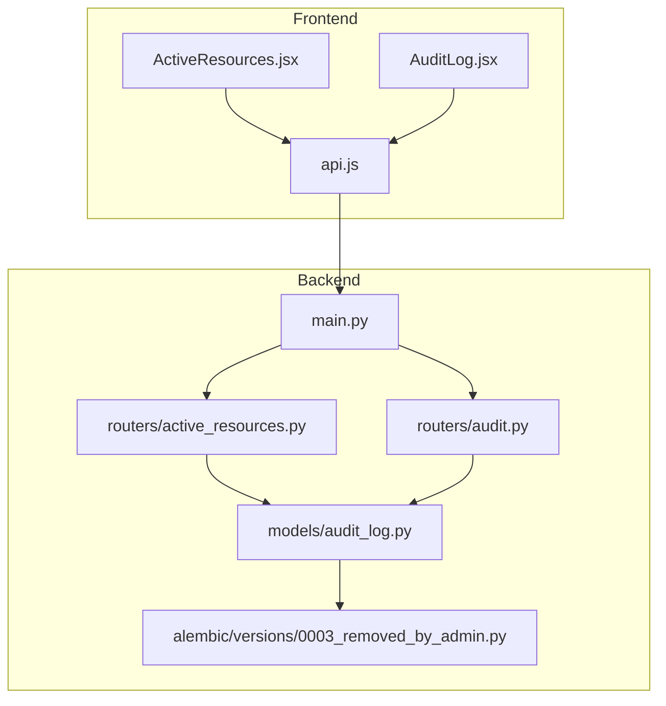
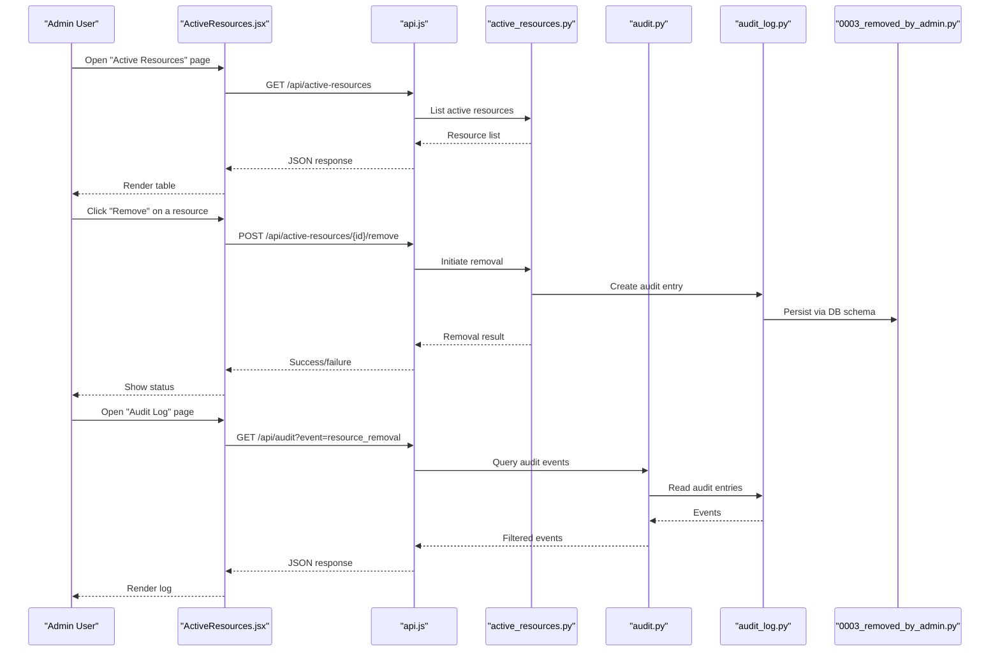
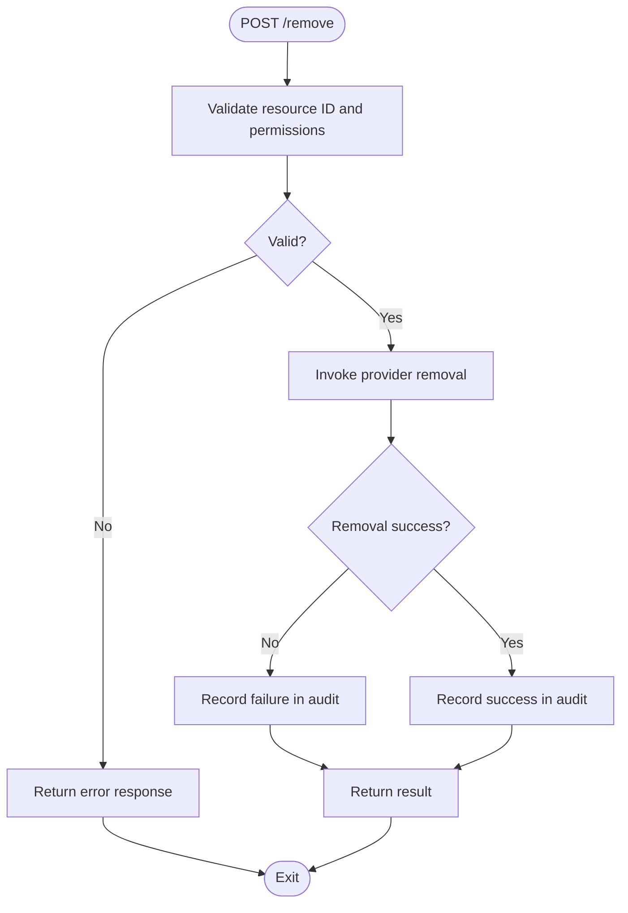
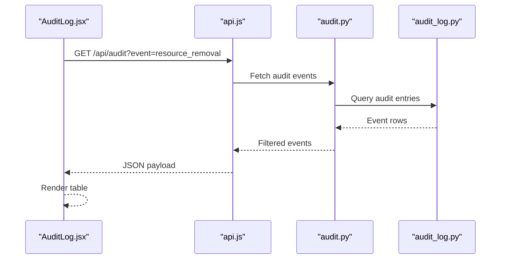
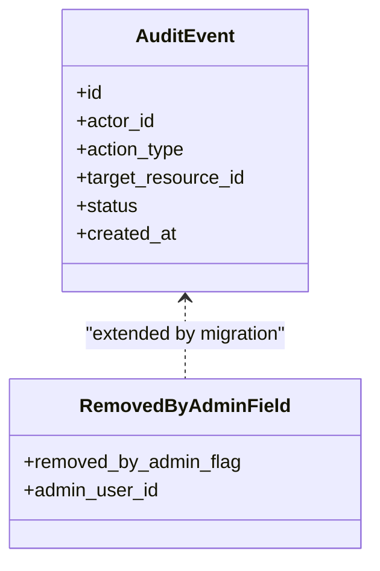
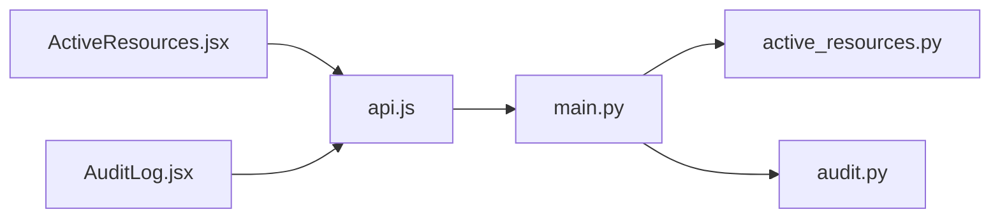
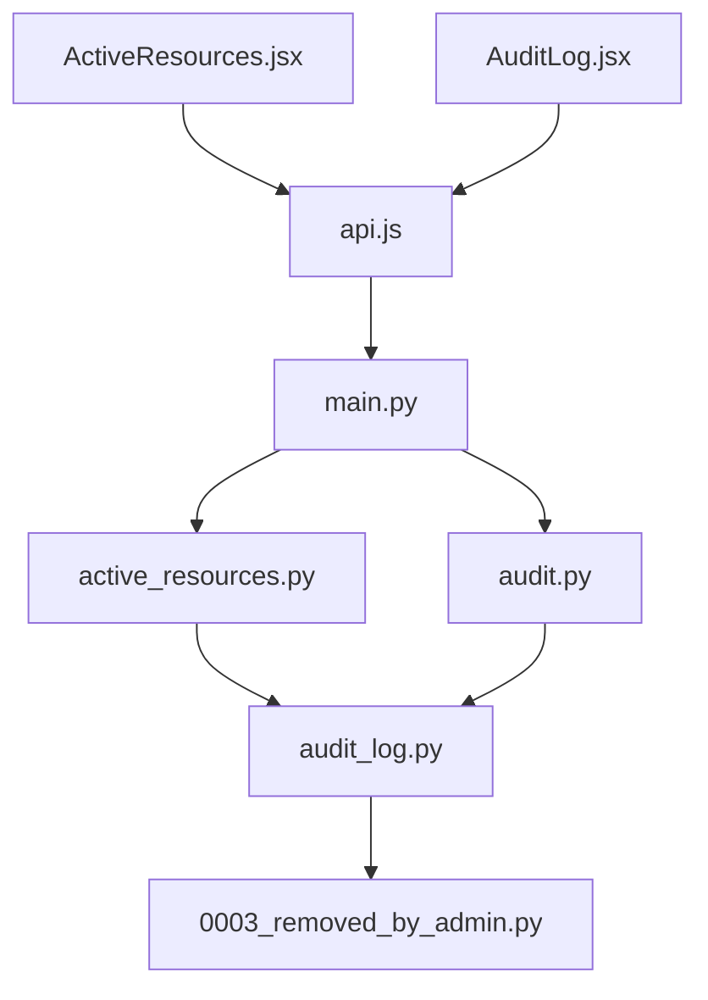

# Admin Resource Removal System

<cite>
**Referenced Files in This Document**
- [main.py](file://backend/app/main.py)
- [active_resources.py](file://backend/app/routers/active_resources.py)
- [audit_log.py](file://backend/app/models/audit_log.py)
- [audit.py](file://backend/app/routers/audit.py)
- [ActiveResources.jsx](file://frontend/src/pages/admin/ActiveResources.jsx)
- [AuditLog.jsx](file://frontend/src/pages/admin/AuditLog.jsx)
- [api.js](file://frontend/src/services/api.js)
- [0003_removed_by_admin.py](file://backend/alembic/versions/0003_removed_by_admin.py)
</cite>

## Table of Contents
1. [Introduction](#introduction)
2. [Project Structure](#project-structure)
3. [Core Components](#core-components)
4. [Architecture Overview](#architecture-overview)
5. [Detailed Component Analysis](#detailed-component-analysis)
6. [Dependency Analysis](#dependency-analysis)
7. [Performance Considerations](#performance-considerations)
8. [Troubleshooting Guide](#troubleshooting-guide)
9. [Conclusion](#conclusion)

## Introduction
This document describes the Admin Resource Removal System, which enables administrators to identify active cloud resources and remove them with full auditability. The system provides:
- A backend API for listing active resources and initiating removals
- An admin frontend for browsing active resources and viewing audit logs
- Database migrations that record administrative actions
- End-to-end flows from UI interactions to provider-side resource deletion and logging

The goal is to ensure safe, traceable, and auditable resource lifecycle management by authorized administrators.

## Project Structure
At a high level, the system consists of:
- Backend (FastAPI): routers for resource operations and auditing, models for persistence, Alembic migrations, and integration services
- Frontend (React + Vite): admin pages for Active Resources and Audit Log, plus an API client
- Nginx reverse proxy configuration
- Docker orchestration files

**Diagram sources**
- [main.py](file://backend/app/main.py)
- [active_resources.py](file://backend/app/routers/active_resources.py)
- [audit.py](file://backend/app/routers/audit.py)
- [audit_log.py](file://backend/app/models/audit_log.py)
- [0003_removed_by_admin.py](file://backend/alembic/versions/0003_removed_by_admin.py)
- [ActiveResources.jsx](file://frontend/src/pages/admin/ActiveResources.jsx)
- [AuditLog.jsx](file://frontend/src/pages/admin/AuditLog.jsx)
- [api.js](file://frontend/src/services/api.js)

**Section sources**
- [main.py](file://backend/app/main.py)
- [active_resources.py](file://backend/app/routers/active_resources.py)
- [audit.py](file://backend/app/routers/audit.py)
- [audit_log.py](file://backend/app/models/audit_log.py)
- [0003_removed_by_admin.py](file://backend/alembic/versions/0003_removed_by_admin.py)
- [ActiveResources.jsx](file://frontend/src/pages/admin/ActiveResources.jsx)
- [AuditLog.jsx](file://frontend/src/pages/admin/AuditLog.jsx)
- [api.js](file://frontend/src/services/api.js)

## Core Components
- Active Resources Router: Provides endpoints to list active resources and trigger removal workflows initiated by admins.
- Audit Router: Exposes endpoints to query audit events, including resource removal actions.
- Audit Log Model: Defines the schema and persistence for audit records, capturing who performed the action and what was removed.
- Migration: Adds database fields or tables to support tracking of administrative removals.
- Frontend Pages: Admin UI components for browsing active resources and reviewing audit logs.
- API Client: Centralized HTTP client used by the frontend to call backend endpoints.

These components collaborate to implement the complete removal workflow with strong audit trails.

**Section sources**
- [active_resources.py](file://backend/app/routers/active_resources.py)
- [audit.py](file://backend/app/routers/audit.py)
- [audit_log.py](file://backend/app/models/audit_log.py)
- [0003_removed_by_admin.py](file://backend/alembic/versions/0003_removed_by_admin.py)
- [ActiveResources.jsx](file://frontend/src/pages/admin/ActiveResources.jsx)
- [AuditLog.jsx](file://frontend/src/pages/admin/AuditLog.jsx)
- [api.js](file://frontend/src/services/api.js)

## Architecture Overview
The Admin Resource Removal System follows a layered architecture:
- Presentation Layer: React admin pages render lists and forms, and call the API client.
- API Layer: FastAPI routers expose REST endpoints for listing resources and performing removals.
- Domain Layer: Business logic orchestrates provider calls and updates audit records.
- Persistence Layer: SQLAlchemy models and Alembic migrations store audit data.

**Diagram sources**
- [ActiveResources.jsx](file://frontend/src/pages/admin/ActiveResources.jsx)
- [api.js](file://frontend/src/services/api.js)
- [active_resources.py](file://backend/app/routers/active_resources.py)
- [audit.py](file://backend/app/routers/audit.py)
- [audit_log.py](file://backend/app/models/audit_log.py)
- [0003_removed_by_admin.py](file://backend/alembic/versions/0003_removed_by_admin.py)

## Detailed Component Analysis

### Active Resources Router
Responsibilities:
- Endpoint to list active resources for admin review
- Endpoint to initiate removal of a specific resource
- Orchestrates provider-side deletion and writes audit records

Key behaviors:
- Validates resource identifiers before proceeding
- Executes removal operation and captures outcome
- Records removal event with actor context and timestamp

**Diagram sources**
- [active_resources.py](file://backend/app/routers/active_resources.py)
- [audit_log.py](file://backend/app/models/audit_log.py)

**Section sources**
- [active_resources.py](file://backend/app/routers/active_resources.py)
- [audit_log.py](file://backend/app/models/audit_log.py)

### Audit Router
Responsibilities:
- Endpoint to retrieve audit events, optionally filtered by event type
- Aggregates and returns structured audit records for admin consumption

Key behaviors:
- Supports filtering by event name such as resource removal
- Returns paginated or sorted results as needed
- Reads from the audit model layer

**Diagram sources**
- [AuditLog.jsx](file://frontend/src/pages/admin/AuditLog.jsx)
- [api.js](file://frontend/src/services/api.js)
- [audit.py](file://backend/app/routers/audit.py)
- [audit_log.py](file://backend/app/models/audit_log.py)

**Section sources**
- [audit.py](file://backend/app/routers/audit.py)
- [audit_log.py](file://backend/app/models/audit_log.py)
- [AuditLog.jsx](file://frontend/src/pages/admin/AuditLog.jsx)
- [api.js](file://frontend/src/services/api.js)

### Audit Log Model and Migration
Responsibilities:
- Define the audit event schema and relationships
- Provide migration to add or update fields required for tracking administrative removals

Key aspects:
- Captures actor identity, action type, target resource, and outcome
- Ensures schema evolution through Alembic versioning

**Diagram sources**
- [audit_log.py](file://backend/app/models/audit_log.py)
- [0003_removed_by_admin.py](file://backend/alembic/versions/0003_removed_by_admin.py)

**Section sources**
- [audit_log.py](file://backend/app/models/audit_log.py)
- [0003_removed_by_admin.py](file://backend/alembic/versions/0003_removed_by_admin.py)

### Frontend Integration
Responsibilities:
- Present active resources and allow removal actions
- Display audit logs with filters for removal events
- Communicate with backend via centralized API client

Key behaviors:
- Renders resource lists and removal confirmations
- Submits removal requests and displays outcomes
- Loads audit events and renders tabular views

**Diagram sources**
- [ActiveResources.jsx](file://frontend/src/pages/admin/ActiveResources.jsx)
- [AuditLog.jsx](file://frontend/src/pages/admin/AuditLog.jsx)
- [api.js](file://frontend/src/services/api.js)
- [main.py](file://backend/app/main.py)
- [active_resources.py](file://backend/app/routers/active_resources.py)
- [audit.py](file://backend/app/routers/audit.py)

**Section sources**
- [ActiveResources.jsx](file://frontend/src/pages/admin/ActiveResources.jsx)
- [AuditLog.jsx](file://frontend/src/pages/admin/AuditLog.jsx)
- [api.js](file://frontend/src/services/api.js)
- [main.py](file://backend/app/main.py)

## Dependency Analysis
The following diagram shows key dependencies among core modules involved in the removal flow:

**Diagram sources**
- [ActiveResources.jsx](file://frontend/src/pages/admin/ActiveResources.jsx)
- [AuditLog.jsx](file://frontend/src/pages/admin/AuditLog.jsx)
- [api.js](file://frontend/src/services/api.js)
- [main.py](file://backend/app/main.py)
- [active_resources.py](file://backend/app/routers/active_resources.py)
- [audit.py](file://backend/app/routers/audit.py)
- [audit_log.py](file://backend/app/models/audit_log.py)
- [0003_removed_by_admin.py](file://backend/alembic/versions/0003_removed_by_admin.py)

**Section sources**
- [active_resources.py](file://backend/app/routers/active_resources.py)
- [audit.py](file://backend/app/routers/audit.py)
- [audit_log.py](file://backend/app/models/audit_log.py)
- [0003_removed_by_admin.py](file://backend/alembic/versions/0003_removed_by_admin.py)
- [ActiveResources.jsx](file://frontend/src/pages/admin/ActiveResources.jsx)
- [AuditLog.jsx](file://frontend/src/pages/admin/AuditLog.jsx)
- [api.js](file://frontend/src/services/api.js)
- [main.py](file://backend/app/main.py)

## Performance Considerations
- Pagination and Filtering: Ensure audit queries support pagination and filtering to avoid large payloads.
- Idempotency: Implement idempotent removal endpoints to safely retry failed operations without duplicate deletions.
- Concurrency Control: Use locks or state checks to prevent concurrent removal attempts on the same resource.
- Provider Rate Limits: Respect upstream provider rate limits and implement backoff strategies when calling external APIs.
- Caching: Consider short-lived caching for active resource listings if appropriate, with invalidation on removal.

[No sources needed since this section provides general guidance]

## Troubleshooting Guide
Common issues and resolutions:
- Missing Audit Entries: Verify that removal endpoints write audit records on both success and failure paths. Check the audit router and model usage.
- Schema Mismatch: Ensure the latest Alembic migration has been applied so that new fields exist in the database.
- Authentication Context: Confirm that admin identity is propagated to the audit logger to capture the correct actor.
- Provider Errors: Inspect logs around provider calls to diagnose timeouts or permission errors during removal.
- Frontend State: Validate that the UI reflects removal outcomes and refreshes the resource list and audit log appropriately.

**Section sources**
- [active_resources.py](file://backend/app/routers/active_resources.py)
- [audit.py](file://backend/app/routers/audit.py)
- [audit_log.py](file://backend/app/models/audit_log.py)
- [0003_removed_by_admin.py](file://backend/alembic/versions/0003_removed_by_admin.py)
- [ActiveResources.jsx](file://frontend/src/pages/admin/ActiveResources.jsx)
- [AuditLog.jsx](file://frontend/src/pages/admin/AuditLog.jsx)

## Conclusion
The Admin Resource Removal System provides a secure, auditable pathway for administrators to manage active cloud resources. By combining well-defined API endpoints, robust audit logging, and clear frontend interfaces, it ensures transparency and accountability throughout the removal process. Adhering to the performance and troubleshooting recommendations will help maintain reliability and operational clarity.

[No sources needed since this section summarizes without analyzing specific files]