# Approval Workflow Service

<cite>
**Referenced Files in This Document**
- [backend/app/routers/approvals.py](file://backend/app/routers/approvals.py)
- [backend/app/services/approval.py](file://backend/app/services/approval.py)
- [backend/app/schemas/approval.py](file://backend/app/schemas/approval.py)
- [backend/app/models/request.py](file://backend/app/models/request.py)
- [backend/app/models/audit_log.py](file://backend/app/models/audit_log.py)
- [backend/app/routers/requests.py](file://backend/app/routers/requests.py)
- [backend/app/routers/audit.py](file://backend/app/routers/audit.py)
- [backend/app/models/user.py](file://backend/app/models/user.py)
- [backend/app/middleware/auth.py](file://backend/app/middleware/auth.py)
- [backend/app/config.py](file://backend/app/config.py)
- [backend/app/database.py](file://backend/app/database.py)
- [backend/alembic/versions/0001_initial_schema.py](file://backend/alembic/versions/0001_initial_schema.py)
</cite>

## Table of Contents
1. [Introduction](#introduction)
2. [Project Structure](#project-structure)
3. [Core Components](#core-components)
4. [Architecture Overview](#architecture-overview)
5. [Detailed Component Analysis](#detailed-component-analysis)
6. [Dependency Analysis](#dependency-analysis)
7. [Performance Considerations](#performance-considerations)
8. [Troubleshooting Guide](#troubleshooting-guide)
9. [Conclusion](#conclusion)
10. [Appendices](#appendices)

## Introduction
This document describes the approval workflow engine implemented in the backend service. It explains how requests are routed into the approval system, how state transitions are enforced, and how multi-level approval chains are executed. It also covers notification integration points, escalation rules, audit trail generation, concurrency handling, timeouts, rollback scenarios, and extension strategies for new approval types and external systems.

The goal is to provide both a high-level understanding and code-mapped details so that developers can operate, extend, and troubleshoot the workflow reliably.

## Project Structure
The approval workflow spans routers (HTTP endpoints), services (business logic), schemas (request/response models), and database models (persistence). The key files involved are:
- Routers: approvals, requests, audit
- Services: approval orchestration
- Schemas: approval request/response contracts
- Models: Request, AuditLog, User
- Middleware: authentication
- Config and Database: environment and persistence setup
- Alembic migration: initial schema

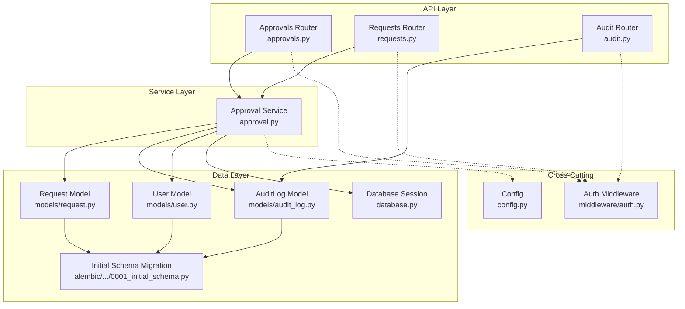

**Diagram sources**
- [backend/app/routers/approvals.py](file://backend/app/routers/approvals.py)
- [backend/app/routers/requests.py](file://backend/app/routers/requests.py)
- [backend/app/routers/audit.py](file://backend/app/routers/audit.py)
- [backend/app/services/approval.py](file://backend/app/services/approval.py)
- [backend/app/models/request.py](file://backend/app/models/request.py)
- [backend/app/models/audit_log.py](file://backend/app/models/audit_log.py)
- [backend/app/models/user.py](file://backend/app/models/user.py)
- [backend/app/database.py](file://backend/app/database.py)
- [backend/alembic/versions/0001_initial_schema.py](file://backend/alembic/versions/0001_initial_schema.py)
- [backend/app/middleware/auth.py](file://backend/app/middleware/auth.py)
- [backend/app/config.py](file://backend/app/config.py)

**Section sources**
- [backend/app/routers/approvals.py](file://backend/app/routers/approvals.py)
- [backend/app/services/approval.py](file://backend/app/services/approval.py)
- [backend/app/schemas/approval.py](file://backend/app/schemas/approval.py)
- [backend/app/models/request.py](file://backend/app/models/request.py)
- [backend/app/models/audit_log.py](file://backend/app/models/audit_log.py)
- [backend/app/routers/requests.py](file://backend/app/routers/requests.py)
- [backend/app/routers/audit.py](file://backend/app/routers/audit.py)
- [backend/app/models/user.py](file://backend/app/models/user.py)
- [backend/app/middleware/auth.py](file://backend/app/middleware/auth.py)
- [backend/app/config.py](file://backend/app/config.py)
- [backend/app/database.py](file://backend/app/database.py)
- [backend/alembic/versions/0001_initial_schema.py](file://backend/alembic/versions/0001_initial_schema.py)

## Core Components
- Approvals Router: Exposes HTTP endpoints to submit, query, approve, reject, escalate, and list approvals. It validates inputs using Pydantic schemas and delegates business logic to the Approval Service.
- Requests Router: Creates resource requests that may trigger an approval workflow. It persists the request and invokes the approval service to start the workflow.
- Approval Service: Implements the core workflow engine: routing, state machine transitions, multi-level chain execution, notifications, escalation, timeouts, concurrency control, and audit logging.
- Schemas: Define request/response structures for approvals and related operations.
- Models: Represent persisted entities such as Request, AuditLog, and User.
- Audit Router: Provides read-only access to audit logs for compliance and troubleshooting.
- Auth Middleware: Enforces authentication on protected routes.
- Config and Database: Provide configuration values and database session management.

Key responsibilities:
- Routing: Determine which approvers or groups must act based on request attributes and policy.
- State Machine: Enforce valid transitions between states (e.g., pending, approved, rejected, escalated, expired).
- Multi-Level Chains: Support sequential or parallel stages with configurable thresholds.
- Notifications: Integrate with email/webhook providers to notify approvers.
- Escalation: Auto-escalate after timeout or when conditions are met.
- Audit Trail: Record all actions and state changes for traceability.
- Concurrency: Ensure idempotent approvals and prevent race conditions.
- Timeouts: Expire stale approvals and trigger escalation or auto-rejection.
- Rollback: Reverse partial provisioning if downstream steps fail.

**Section sources**
- [backend/app/routers/approvals.py](file://backend/app/routers/approvals.py)
- [backend/app/routers/requests.py](file://backend/app/routers/requests.py)
- [backend/app/services/approval.py](file://backend/app/services/approval.py)
- [backend/app/schemas/approval.py](file://backend/app/schemas/approval.py)
- [backend/app/models/request.py](file://backend/app/models/request.py)
- [backend/app/models/audit_log.py](file://backend/app/models/audit_log.py)
- [backend/app/routers/audit.py](file://backend/app/routers/audit.py)
- [backend/app/middleware/auth.py](file://backend/app/middleware/auth.py)
- [backend/app/config.py](file://backend/app/config.py)
- [backend/app/database.py](file://backend/app/database.py)

## Architecture Overview
The approval workflow follows a layered architecture:
- API Layer: FastAPI routers handle HTTP requests and responses.
- Service Layer: Encapsulates workflow orchestration, state transitions, and integrations.
- Data Layer: SQLAlchemy models backed by a relational database; migrations managed via Alembic.
- Cross-Cutting: Authentication middleware and configuration.

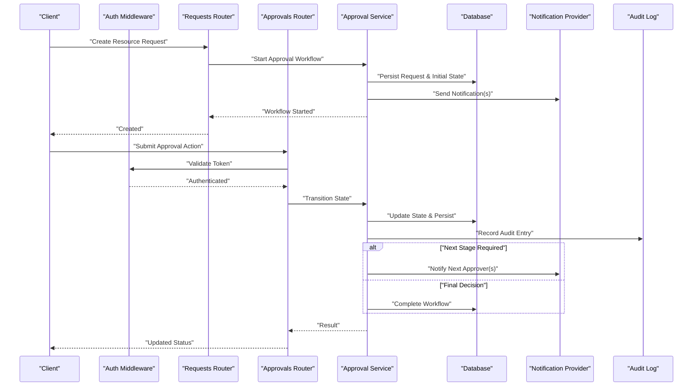

**Diagram sources**
- [backend/app/routers/requests.py](file://backend/app/routers/requests.py)
- [backend/app/routers/approvals.py](file://backend/app/routers/approvals.py)
- [backend/app/services/approval.py](file://backend/app/services/approval.py)
- [backend/app/models/request.py](file://backend/app/models/request.py)
- [backend/app/models/audit_log.py](file://backend/app/models/audit_log.py)
- [backend/app/middleware/auth.py](file://backend/app/middleware/auth.py)

## Detailed Component Analysis

### Request Routing System
- Entry Points:
  - Create request: triggers workflow initiation.
  - Approve/reject/escalate: triggers state transitions.
- Validation:
  - Input validation via Pydantic schemas ensures required fields and constraints.
- Routing Logic:
  - Determines next approvers based on request type, attributes, and configured policies.
  - Supports single-stage and multi-stage chains.
- Idempotency:
  - Duplicate approval submissions are detected and ignored safely.

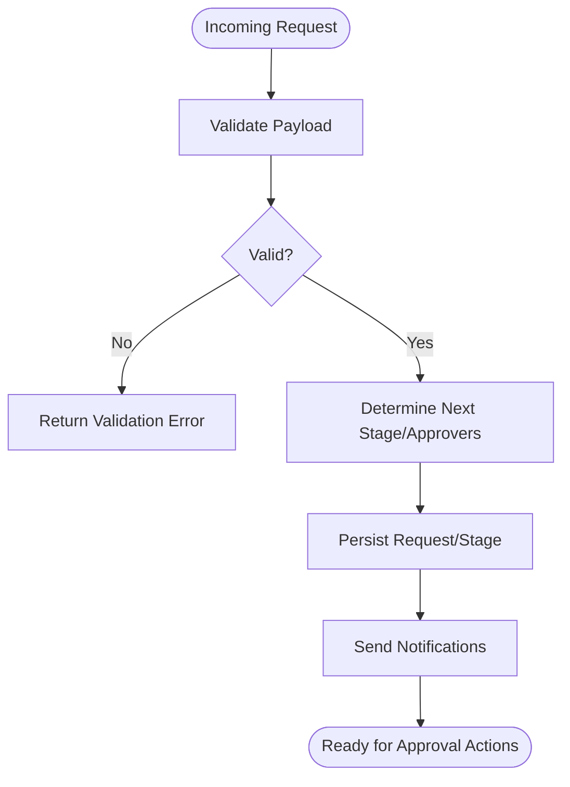

**Diagram sources**
- [backend/app/routers/requests.py](file://backend/app/routers/requests.py)
- [backend/app/routers/approvals.py](file://backend/app/routers/approvals.py)
- [backend/app/services/approval.py](file://backend/app/services/approval.py)
- [backend/app/schemas/approval.py](file://backend/app/schemas/approval.py)

**Section sources**
- [backend/app/routers/requests.py](file://backend/app/routers/requests.py)
- [backend/app/routers/approvals.py](file://backend/app/routers/approvals.py)
- [backend/app/services/approval.py](file://backend/app/services/approval.py)
- [backend/app/schemas/approval.py](file://backend/app/schemas/approval.py)

### State Machine Transitions
- States:
  - Pending, Approved, Rejected, Escalated, Expired, Completed.
- Transitions:
  - Pending -> Approved/Rejected/Escalated/Expired
  - Escalated -> Approved/Rejected/Expired
  - Expired -> Reopened (if allowed) or Closed
- Enforcement:
  - Only valid transitions are permitted; invalid attempts raise errors and are audited.
- Finality:
  - Approved/Rejected are terminal unless explicitly reopened by admin policy.

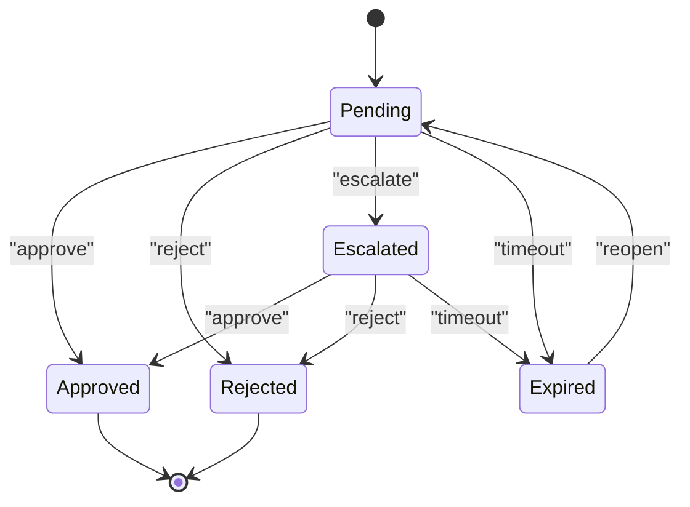

**Diagram sources**
- [backend/app/services/approval.py](file://backend/app/services/approval.py)
- [backend/app/models/request.py](file://backend/app/models/request.py)

**Section sources**
- [backend/app/services/approval.py](file://backend/app/services/approval.py)
- [backend/app/models/request.py](file://backend/app/models/request.py)

### Multi-Level Approval Chains
- Sequential Stages:
  - Each stage defines one or more approvers/groups.
  - All approvers in a stage must approve (or threshold-based) before advancing.
- Parallel Stages:
  - Multiple approvers within a stage can approve concurrently.
- Thresholds:
  - Configurable number of approvals required per stage.
- Chain Configuration:
  - Defined via request attributes and policy mappings.

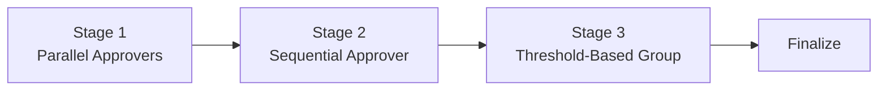

**Diagram sources**
- [backend/app/services/approval.py](file://backend/app/services/approval.py)
- [backend/app/models/request.py](file://backend/app/models/request.py)

**Section sources**
- [backend/app/services/approval.py](file://backend/app/services/approval.py)
- [backend/app/models/request.py](file://backend/app/models/request.py)

### Notification System Integration
- Triggers:
  - New approval assigned, escalation, deadline reminders, final decisions.
- Channels:
  - Email and webhook endpoints are supported; extensible via provider interface.
- Content:
  - Includes request context, action links, and SLA information.
- Reliability:
  - Retries and dead-lettering for failed deliveries; logged in audit trail.

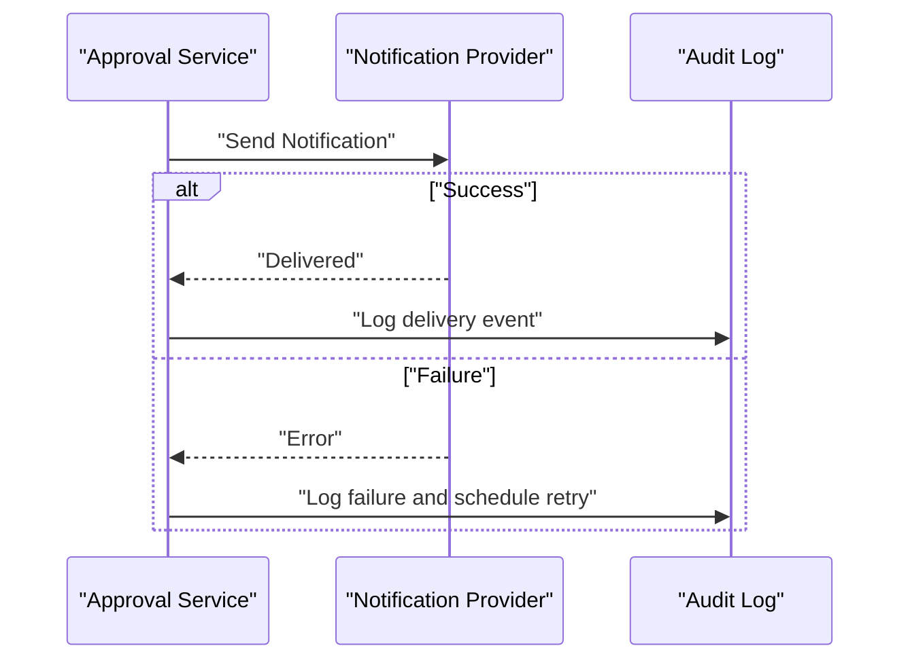

**Diagram sources**
- [backend/app/services/approval.py](file://backend/app/services/approval.py)
- [backend/app/models/audit_log.py](file://backend/app/models/audit_log.py)

**Section sources**
- [backend/app/services/approval.py](file://backend/app/services/approval.py)
- [backend/app/models/audit_log.py](file://backend/app/models/audit_log.py)

### Escalation Rules
- Conditions:
  - Timeout without action, manual escalation by authorized users.
- Behavior:
  - Move to escalated state, notify higher-level approvers, update deadlines.
- Policy:
  - Configurable escalation paths and maximum escalations.

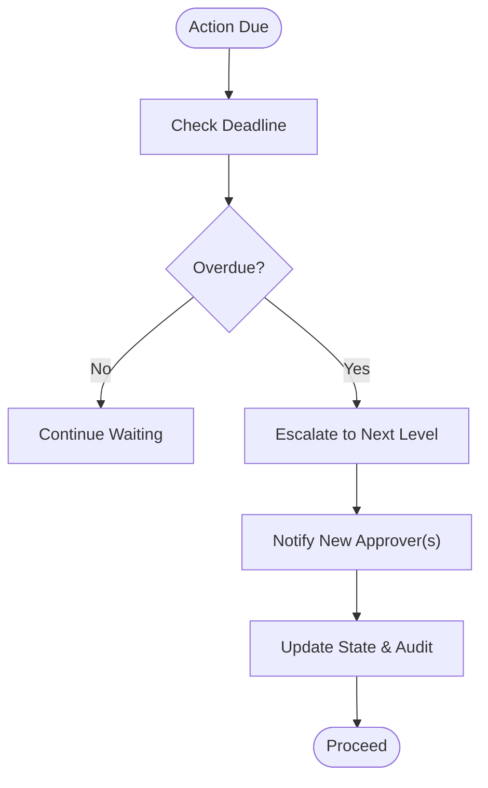

**Diagram sources**
- [backend/app/services/approval.py](file://backend/app/services/approval.py)
- [backend/app/models/audit_log.py](file://backend/app/models/audit_log.py)

**Section sources**
- [backend/app/services/approval.py](file://backend/app/services/approval.py)
- [backend/app/models/audit_log.py](file://backend/app/models/audit_log.py)

### Audit Trail Generation
- Events:
  - Creation, transitions, approvals, rejections, escalations, timeouts, reopenings.
- Fields:
  - Actor, timestamp, previous/current state, reason, correlation IDs.
- Access:
  - Read-only via audit router for compliance and debugging.

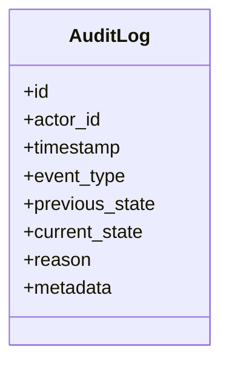

**Diagram sources**
- [backend/app/models/audit_log.py](file://backend/app/models/audit_log.py)
- [backend/app/routers/audit.py](file://backend/app/routers/audit.py)

**Section sources**
- [backend/app/models/audit_log.py](file://backend/app/models/audit_log.py)
- [backend/app/routers/audit.py](file://backend/app/routers/audit.py)

### Concurrency Handling
- Strategies:
  - Optimistic locking/versioning on request records.
  - Idempotency keys for approval actions.
  - Transaction boundaries around state updates.
- Guarantees:
  - No double-counted approvals; consistent state across concurrent requests.

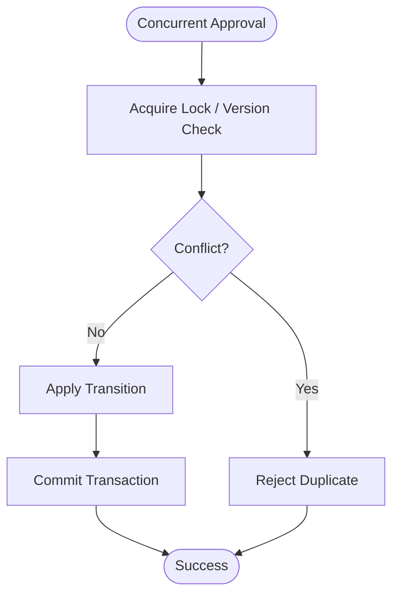

**Diagram sources**
- [backend/app/services/approval.py](file://backend/app/services/approval.py)
- [backend/app/models/request.py](file://backend/app/models/request.py)

**Section sources**
- [backend/app/services/approval.py](file://backend/app/services/approval.py)
- [backend/app/models/request.py](file://backend/app/models/request.py)

### Timeout Management
- Policies:
  - Per-stage deadlines and global timeouts.
- Actions:
  - Expire pending approvals, trigger escalation or auto-rejection.
- Monitoring:
  - Scheduled tasks scan for overdue items and apply transitions.

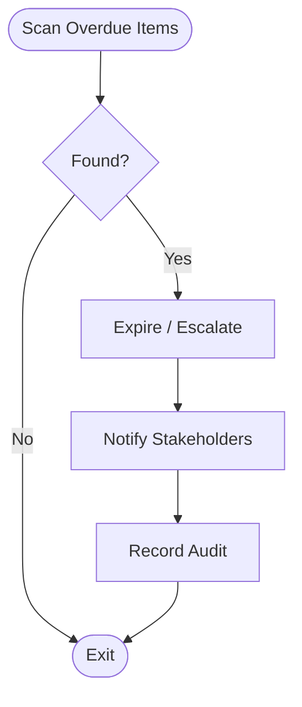

**Diagram sources**
- [backend/app/services/approval.py](file://backend/app/services/approval.py)
- [backend/app/models/audit_log.py](file://backend/app/models/audit_log.py)

**Section sources**
- [backend/app/services/approval.py](file://backend/app/services/approval.py)
- [backend/app/models/audit_log.py](file://backend/app/models/audit_log.py)

### Workflow Rollback Scenarios
- Trigger:
  - Downstream provisioning fails after approvals.
- Strategy:
  - Compensating actions to undo partial changes.
- Safety:
  - Atomic steps where possible; detailed audit of rollback actions.

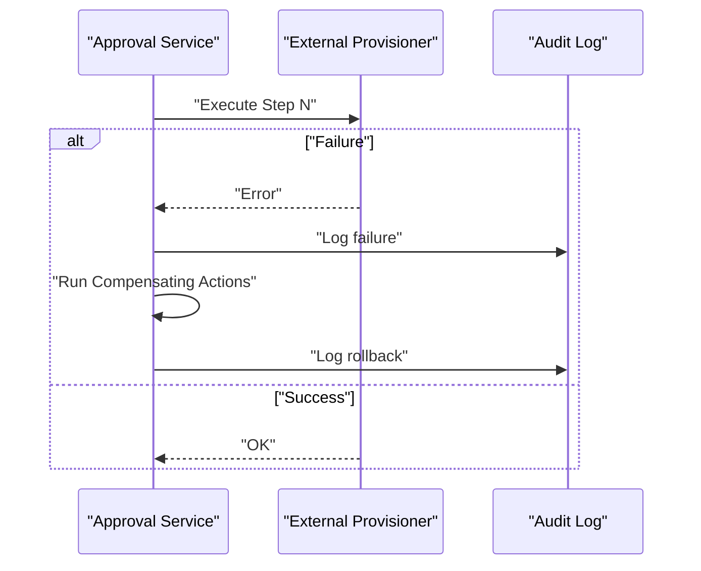

**Diagram sources**
- [backend/app/services/approval.py](file://backend/app/services/approval.py)
- [backend/app/models/audit_log.py](file://backend/app/models/audit_log.py)

**Section sources**
- [backend/app/services/approval.py](file://backend/app/services/approval.py)
- [backend/app/models/audit_log.py](file://backend/app/models/audit_log.py)

### Extending Workflows with New Approval Types
- Steps:
  - Add new request attributes and policy mappings.
  - Extend routing logic to include new approver selection rules.
  - Implement custom transition handlers if needed.
  - Add corresponding audit events and notifications.
- Testing:
  - Unit tests for routing and transitions; integration tests for end-to-end flows.

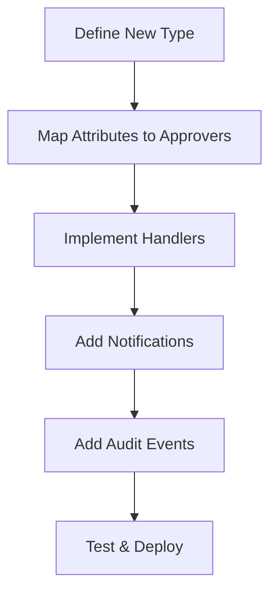

**Diagram sources**
- [backend/app/services/approval.py](file://backend/app/services/approval.py)
- [backend/app/models/request.py](file://backend/app/models/request.py)
- [backend/app/models/audit_log.py](file://backend/app/models/audit_log.py)

**Section sources**
- [backend/app/services/approval.py](file://backend/app/services/approval.py)
- [backend/app/models/request.py](file://backend/app/models/request.py)
- [backend/app/models/audit_log.py](file://backend/app/models/audit_log.py)

### Integrating External Approval Systems
- Approach:
  - Adapter pattern for external providers.
  - Webhook callbacks to synchronize external decisions.
  - Retry and reconciliation jobs for consistency.
- Security:
  - Signature verification and token exchange.

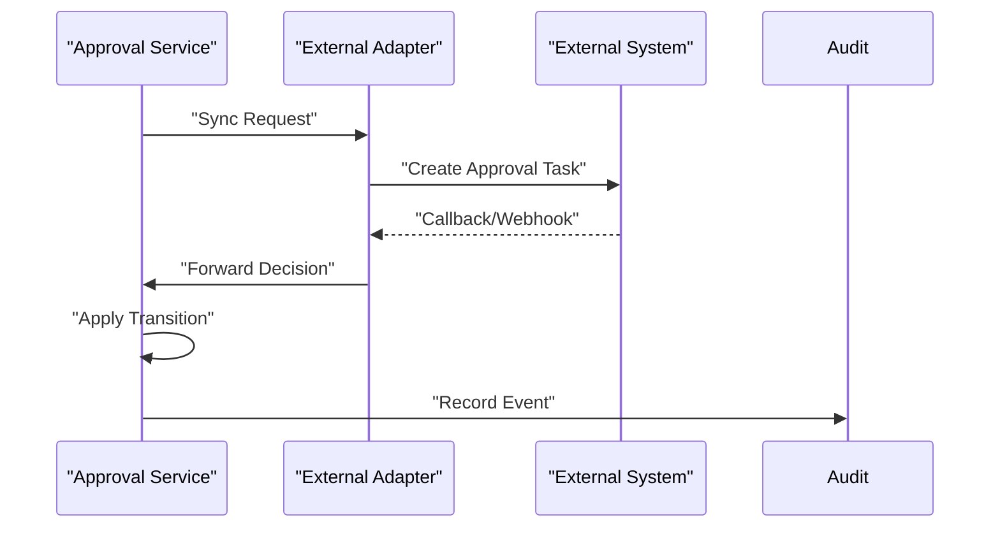

**Diagram sources**
- [backend/app/services/approval.py](file://backend/app/services/approval.py)
- [backend/app/models/audit_log.py](file://backend/app/models/audit_log.py)

**Section sources**
- [backend/app/services/approval.py](file://backend/app/services/approval.py)
- [backend/app/models/audit_log.py](file://backend/app/models/audit_log.py)

## Dependency Analysis
The following diagram shows key dependencies among components:

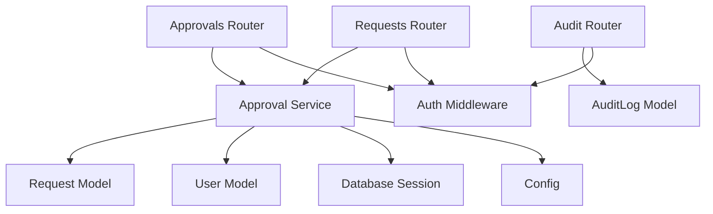

**Diagram sources**
- [backend/app/routers/approvals.py](file://backend/app/routers/approvals.py)
- [backend/app/routers/requests.py](file://backend/app/routers/requests.py)
- [backend/app/routers/audit.py](file://backend/app/routers/audit.py)
- [backend/app/services/approval.py](file://backend/app/services/approval.py)
- [backend/app/models/request.py](file://backend/app/models/request.py)
- [backend/app/models/audit_log.py](file://backend/app/models/audit_log.py)
- [backend/app/models/user.py](file://backend/app/models/user.py)
- [backend/app/database.py](file://backend/app/database.py)
- [backend/app/middleware/auth.py](file://backend/app/middleware/auth.py)
- [backend/app/config.py](file://backend/app/config.py)

**Section sources**
- [backend/app/routers/approvals.py](file://backend/app/routers/approvals.py)
- [backend/app/routers/requests.py](file://backend/app/routers/requests.py)
- [backend/app/routers/audit.py](file://backend/app/routers/audit.py)
- [backend/app/services/approval.py](file://backend/app/services/approval.py)
- [backend/app/models/request.py](file://backend/app/models/request.py)
- [backend/app/models/audit_log.py](file://backend/app/models/audit_log.py)
- [backend/app/models/user.py](file://backend/app/models/user.py)
- [backend/app/database.py](file://backend/app/database.py)
- [backend/app/middleware/auth.py](file://backend/app/middleware/auth.py)
- [backend/app/config.py](file://backend/app/config.py)

## Performance Considerations
- Use database indexes on frequently queried fields (e.g., status, approver_id, created_at).
- Batch notifications and use asynchronous workers to avoid blocking request threads.
- Employ optimistic locking to reduce contention during concurrent approvals.
- Cache static policy mappings to minimize repeated lookups.
- Monitor long-running workflows and set appropriate timeouts to free resources.

[No sources needed since this section provides general guidance]

## Troubleshooting Guide
Common issues and resolutions:
- Invalid state transitions:
  - Verify current state and allowed transitions; check audit logs for prior actions.
- Duplicate approvals:
  - Ensure idempotency keys are used; inspect lock/version conflicts.
- Notification failures:
  - Check provider connectivity and retries; review audit log for delivery events.
- Escalation not triggered:
  - Confirm deadlines and scheduled job health; verify escalation policy configuration.
- Rollback inconsistencies:
  - Review compensating action logs; reconcile with external systems via reconciliation jobs.

**Section sources**
- [backend/app/services/approval.py](file://backend/app/services/approval.py)
- [backend/app/models/audit_log.py](file://backend/app/models/audit_log.py)
- [backend/app/routers/audit.py](file://backend/app/routers/audit.py)

## Conclusion
The approval workflow engine provides a robust, auditable, and extensible system for managing multi-level approvals. It enforces strict state transitions, supports complex chains, integrates notifications and external systems, and handles concurrency and timeouts safely. By following the extension guidelines and leveraging the audit trail, teams can confidently evolve workflows and maintain compliance.

[No sources needed since this section summarizes without analyzing specific files]

## Appendices

### Example: Workflow Definition
- Define request attributes that map to approver selection rules.
- Configure stage order, thresholds, and escalation paths.
- Attach notification templates and audit event types.

**Section sources**
- [backend/app/services/approval.py](file://backend/app/services/approval.py)
- [backend/app/models/request.py](file://backend/app/models/request.py)

### Example: Approval Chain Configuration
- Specify sequential vs parallel stages.
- Set per-stage approvers or groups.
- Define thresholds and fallback behaviors.

**Section sources**
- [backend/app/services/approval.py](file://backend/app/services/approval.py)
- [backend/app/models/request.py](file://backend/app/models/request.py)

### Example: Custom Approval Logic Implementation
- Implement custom routing functions for new request types.
- Add transition handlers for specialized approvals.
- Emit custom audit events and notifications.

**Section sources**
- [backend/app/services/approval.py](file://backend/app/services/approval.py)
- [backend/app/models/audit_log.py](file://backend/app/models/audit_log.py)

### Database Schema Notes
- Initial schema includes tables for requests, approvals/stages, and audit logs.
- Migrations are managed via Alembic.

**Section sources**
- [backend/alembic/versions/0001_initial_schema.py](file://backend/alembic/versions/0001_initial_schema.py)