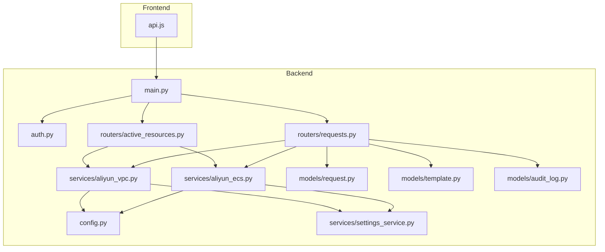
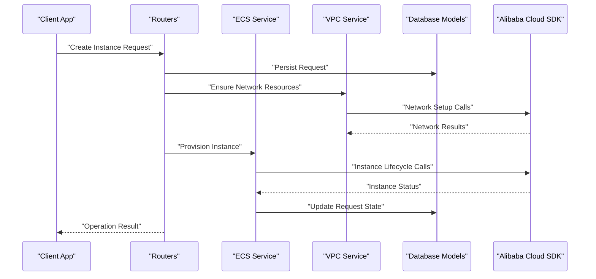
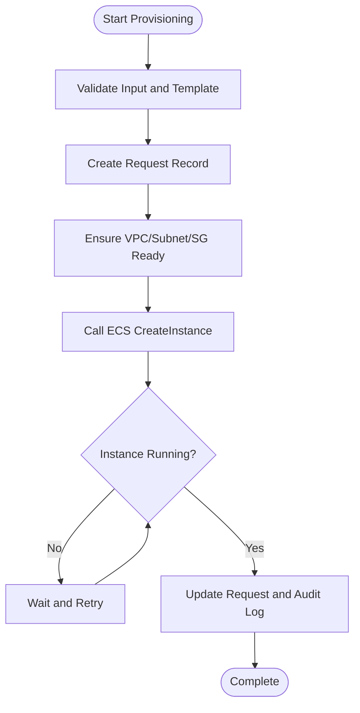
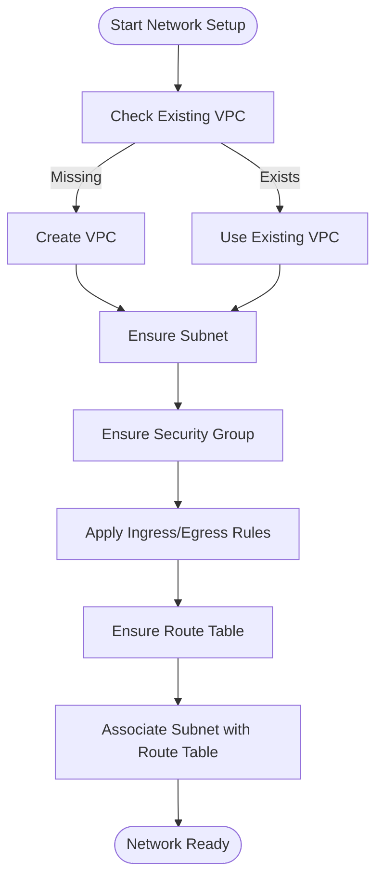
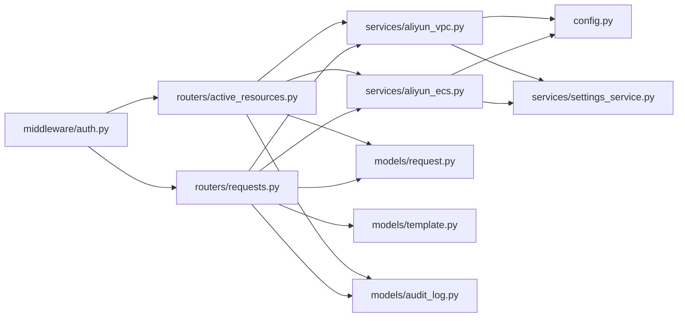

# Cloud Integration Services

<cite>
**Referenced Files in This Document**
- [aliyun_ecs.py](file://backend/app/services/aliyun_ecs.py)
- [aliyun_vpc.py](file://backend/app/services/aliyun_vpc.py)
- [config.py](file://backend/app/config.py)
- [main.py](file://backend/app/main.py)
- [settings_service.py](file://backend/app/services/settings_service.py)
- [active_resources.py](file://backend/app/routers/active_resources.py)
- [requests.py](file://backend/app/routers/requests.py)
- [template.py](file://backend/app/models/template.py)
- [request.py](file://backend/app/models/request.py)
- [audit_log.py](file://backend/app/models/audit_log.py)
- [auth.py](file://backend/app/middleware/auth.py)
- [api.js](file://frontend/src/services/api.js)
</cite>

## Table of Contents
1. [Introduction](#introduction)
2. [Project Structure](#project-structure)
3. [Core Components](#core-components)
4. [Architecture Overview](#architecture-overview)
5. [Detailed Component Analysis](#detailed-component-analysis)
6. [Dependency Analysis](#dependency-analysis)
7. [Performance Considerations](#performance-considerations)
8. [Troubleshooting Guide](#troubleshooting-guide)
9. [Conclusion](#conclusion)
10. [Appendices](#appendices)

## Introduction
This document provides comprehensive documentation for Alibaba Cloud integration services implemented in the project, focusing on ECS and VPC capabilities. It explains how instances are provisioned and managed, how networking resources are configured, and how authentication, credentials, and API responses are handled. It also includes guidance on extending integrations, handling asynchronous operations, error handling patterns, retry mechanisms, and rate limiting strategies.

## Project Structure
The backend exposes REST APIs that orchestrate Alibaba Cloud resource management via dedicated service modules. The frontend consumes these APIs to drive user workflows. Key areas:
- Service layer: Alibaba Cloud SDK wrappers for ECS and VPC
- Configuration and settings: Centralized access to cloud credentials and options
- Routers: HTTP endpoints that invoke service methods
- Models: Persistent state for requests, templates, and audit logs
- Middleware: Authentication and authorization
- Frontend: UI components calling backend APIs

**Diagram sources**
- [main.py](file://backend/app/main.py)
- [auth.py](file://backend/app/middleware/auth.py)
- [requests.py](file://backend/app/routers/requests.py)
- [active_resources.py](file://backend/app/routers/active_resources.py)
- [aliyun_ecs.py](file://backend/app/services/aliyun_ecs.py)
- [aliyun_vpc.py](file://backend/app/services/aliyun_vpc.py)
- [config.py](file://backend/app/config.py)
- [settings_service.py](file://backend/app/services/settings_service.py)
- [request.py](file://backend/app/models/request.py)
- [template.py](file://backend/app/models/template.py)
- [audit_log.py](file://backend/app/models/audit_log.py)
- [api.js](file://frontend/src/services/api.js)

**Section sources**
- [main.py](file://backend/app/main.py)
- [auth.py](file://backend/app/middleware/auth.py)
- [requests.py](file://backend/app/routers/requests.py)
- [active_resources.py](file://backend/app/routers/active_resources.py)
- [aliyun_ecs.py](file://backend/app/services/aliyun_ecs.py)
- [aliyun_vpc.py](file://backend/app/services/aliyun_vpc.py)
- [config.py](file://backend/app/config.py)
- [settings_service.py](file://backend/app/services/settings_service.py)
- [request.py](file://backend/app/models/request.py)
- [template.py](file://backend/app/models/template.py)
- [audit_log.py](file://backend/app/models/audit_log.py)
- [api.js](file://frontend/src/services/api.js)

## Core Components
- ECS Service: Encapsulates instance lifecycle operations (create, start, stop, terminate), status monitoring, and configuration management using Alibaba Cloud SDK.
- VPC Service: Manages network setup including VPC creation, subnet management, security groups, and routing configuration.
- Configuration and Settings: Provides centralized access to Alibaba Cloud credentials and runtime options; integrates with persistent settings where applicable.
- Routers: Expose HTTP endpoints that coordinate request validation, persistence, and invocation of service methods.
- Models: Represent requests, templates, and audit logs to persist state and support auditing.
- Middleware: Enforces authentication and authorization for protected routes.

**Section sources**
- [aliyun_ecs.py](file://backend/app/services/aliyun_ecs.py)
- [aliyun_vpc.py](file://backend/app/services/aliyun_vpc.py)
- [config.py](file://backend/app/config.py)
- [settings_service.py](file://backend/app/services/settings_service.py)
- [requests.py](file://backend/app/routers/requests.py)
- [active_resources.py](file://backend/app/routers/active_resources.py)
- [request.py](file://backend/app/models/request.py)
- [template.py](file://backend/app/models/template.py)
- [audit_log.py](file://backend/app/models/audit_log.py)
- [auth.py](file://backend/app/middleware/auth.py)

## Architecture Overview
The system follows a layered architecture:
- Presentation Layer: Frontend calls backend APIs.
- API Layer: FastAPI routers handle HTTP requests, validate inputs, and orchestrate business logic.
- Service Layer: Alibaba Cloud SDK wrappers implement domain-specific operations for ECS and VPC.
- Data Layer: Database models persist requests, templates, and audit logs.
- Cross-Cutting: Authentication middleware, configuration, and settings service.

**Diagram sources**
- [requests.py](file://backend/app/routers/requests.py)
- [active_resources.py](file://backend/app/routers/active_resources.py)
- [aliyun_ecs.py](file://backend/app/services/aliyun_ecs.py)
- [aliyun_vpc.py](file://backend/app/services/aliyun_vpc.py)
- [request.py](file://backend/app/models/request.py)
- [template.py](file://backend/app/models/template.py)
- [audit_log.py](file://backend/app/models/audit_log.py)

## Detailed Component Analysis

### ECS Service Implementation
Responsibilities:
- Instance provisioning based on templates and request parameters
- Lifecycle operations: create, start, stop, terminate
- Status monitoring and polling until stable states
- Configuration management for instance attributes (e.g., image, instance type, key pair)
- Error handling, retries, and rate limiting when interacting with Alibaba Cloud SDK

Key behaviors:
- Validates input against template definitions and settings
- Persists request state transitions and audit entries
- Uses exponential backoff or configurable retry policies for transient failures
- Monitors instance status by polling and updating database records

**Diagram sources**
- [aliyun_ecs.py](file://backend/app/services/aliyun_ecs.py)
- [request.py](file://backend/app/models/request.py)
- [audit_log.py](file://backend/app/models/audit_log.py)

**Section sources**
- [aliyun_ecs.py](file://backend/app/services/aliyun_ecs.py)
- [request.py](file://backend/app/models/request.py)
- [audit_log.py](file://backend/app/models/audit_log.py)

### VPC Service Implementation
Responsibilities:
- Network setup: create VPC if needed, manage subnets
- Security group configuration: rules for ingress/egress
- Routing configuration: route tables and associations
- Idempotent resource management to avoid duplicates

Key behaviors:
- Checks existing resources before creating new ones
- Applies security group rules deterministically
- Updates routing tables and associates them with subnets
- Handles conflicts and partial failures gracefully

**Diagram sources**
- [aliyun_vpc.py](file://backend/app/services/aliyun_vpc.py)

**Section sources**
- [aliyun_vpc.py](file://backend/app/services/aliyun_vpc.py)

### Configuration and Credentials Management
Centralized configuration:
- Loads Alibaba Cloud credentials and region settings from environment or config files
- Integrates with persistent settings service for dynamic updates
- Provides typed accessors for SDK initialization

Security considerations:
- Avoid hardcoding secrets; prefer environment variables or secret managers
- Rotate credentials without code changes
- Restrict least-privilege permissions for the access keys

**Section sources**
- [config.py](file://backend/app/config.py)
- [settings_service.py](file://backend/app/services/settings_service.py)

### API Routers and Orchestration
Endpoints:
- Request submission: validates payload, persists request, triggers provisioning workflow
- Active resources listing: queries current state and returns resource details
- Auditing: records lifecycle events and errors

Orchestration flow:
- Validates and normalizes inputs
- Ensures network prerequisites via VPC service
- Provisions ECS instances via ECS service
- Persists state transitions and audit logs
- Returns consistent response formats

**Section sources**
- [requests.py](file://backend/app/routers/requests.py)
- [active_resources.py](file://backend/app/routers/active_resources.py)
- [request.py](file://backend/app/models/request.py)
- [template.py](file://backend/app/models/template.py)
- [audit_log.py](file://backend/app/models/audit_log.py)

### Authentication and Authorization
Middleware:
- Enforces token-based authentication for protected routes
- Attaches user context to requests for auditing and access control

Integration points:
- Routers use decorators or dependency injection to require authentication
- Audit logs include authenticated user identifiers

**Section sources**
- [auth.py](file://backend/app/middleware/auth.py)
- [requests.py](file://backend/app/routers/requests.py)
- [active_resources.py](file://backend/app/routers/active_resources.py)

### Frontend Integration
Frontend service:
- Calls backend APIs for request submission and resource listing
- Displays operational status and results to users

Best practices:
- Handle HTTP errors and display user-friendly messages
- Debounce repeated polling for long-running operations

**Section sources**
- [api.js](file://frontend/src/services/api.js)

## Dependency Analysis
High-level dependencies:
- Routers depend on ECS and VPC services
- Services depend on configuration and settings
- Routers depend on models for persistence and auditing
- Middleware protects router endpoints
- Frontend depends on backend API contracts

**Diagram sources**
- [requests.py](file://backend/app/routers/requests.py)
- [active_resources.py](file://backend/app/routers/active_resources.py)
- [aliyun_ecs.py](file://backend/app/services/aliyun_ecs.py)
- [aliyun_vpc.py](file://backend/app/services/aliyun_vpc.py)
- [config.py](file://backend/app/config.py)
- [settings_service.py](file://backend/app/services/settings_service.py)
- [request.py](file://backend/app/models/request.py)
- [template.py](file://backend/app/models/template.py)
- [audit_log.py](file://backend/app/models/audit_log.py)
- [auth.py](file://backend/app/middleware/auth.py)

**Section sources**
- [requests.py](file://backend/app/routers/requests.py)
- [active_resources.py](file://backend/app/routers/active_resources.py)
- [aliyun_ecs.py](file://backend/app/services/aliyun_ecs.py)
- [aliyun_vpc.py](file://backend/app/services/aliyun_vpc.py)
- [config.py](file://backend/app/config.py)
- [settings_service.py](file://backend/app/services/settings_service.py)
- [request.py](file://backend/app/models/request.py)
- [template.py](file://backend/app/models/template.py)
- [audit_log.py](file://backend/app/models/audit_log.py)
- [auth.py](file://backend/app/middleware/auth.py)

## Performance Considerations
- Batch operations: Where possible, batch resource checks or updates to reduce API calls.
- Caching: Cache frequently accessed settings and resource lookups with appropriate TTL.
- Concurrency: Use background tasks for long-running provisioning to keep APIs responsive.
- Pagination: Implement pagination for listing active resources to avoid large payloads.
- Backpressure: Respect Alibaba Cloud SDK rate limits and apply adaptive throttling.

[No sources needed since this section provides general guidance]

## Troubleshooting Guide
Common issues and resolutions:
- Authentication failures: Verify credentials and permissions; ensure least-privilege policy is correctly scoped.
- Rate limit errors: Implement retry with exponential backoff and jitter; respect SDK-provided headers.
- Partial failures: Ensure idempotency for network and instance creation; reconcile state after retries.
- Long-running operations: Provide polling endpoints or webhooks; update request status consistently.
- Auditability: Confirm all lifecycle events are recorded with timestamps and user context.

Operational tips:
- Enable detailed logging around SDK calls for diagnostics.
- Use structured logs with correlation IDs for tracing across components.
- Monitor resource quotas and capacity constraints proactively.

**Section sources**
- [aliyun_ecs.py](file://backend/app/services/aliyun_ecs.py)
- [aliyun_vpc.py](file://backend/app/services/aliyun_vpc.py)
- [audit_log.py](file://backend/app/models/audit_log.py)

## Conclusion
The Alibaba Cloud integration services provide robust ECS and VPC capabilities through well-defined service layers, secure configuration management, and comprehensive auditing. By following the recommended patterns for error handling, retries, and rate limiting, teams can build reliable automation workflows. Extensibility is supported by modular services and clear separation of concerns, enabling additional cloud integrations with minimal friction.

[No sources needed since this section summarizes without analyzing specific files]

## Appendices

### Example Invocation Patterns
- Provision an ECS instance:
  - Submit a request via the requests endpoint, which ensures VPC prerequisites and then provisions the instance.
  - Reference: [requests.py](file://backend/app/routers/requests.py)
- List active resources:
  - Query the active resources endpoint to retrieve current ECS instances and their statuses.
  - Reference: [active_resources.py](file://backend/app/routers/active_resources.py)
- Manage settings:
  - Update cloud credentials or region settings via the settings service.
  - Reference: [settings_service.py](file://backend/app/services/settings_service.py)

### Error Handling Patterns
- Transient errors:
  - Detect SDK exceptions indicating temporary conditions and retry with backoff.
  - Reference: [aliyun_ecs.py](file://backend/app/services/aliyun_ecs.py), [aliyun_vpc.py](file://backend/app/services/aliyun_vpc.py)
- Permanent errors:
  - Fail fast for invalid configurations or insufficient permissions; record audit entries.
  - Reference: [audit_log.py](file://backend/app/models/audit_log.py)

### Retry Mechanisms and Rate Limiting
- Implement exponential backoff with jitter for SDK calls.
- Honor Alibaba Cloud rate limits by tracking per-region or per-API quotas.
- Integrate circuit breakers for degraded external services.

[No sources needed since this section provides general guidance]

### Asynchronous Operations
- Background tasks:
  - Offload long-running provisioning to background workers.
  - Provide status polling endpoints for clients.
- Event-driven updates:
  - Emit events upon state transitions for downstream consumers.

[No sources needed since this section provides general guidance]