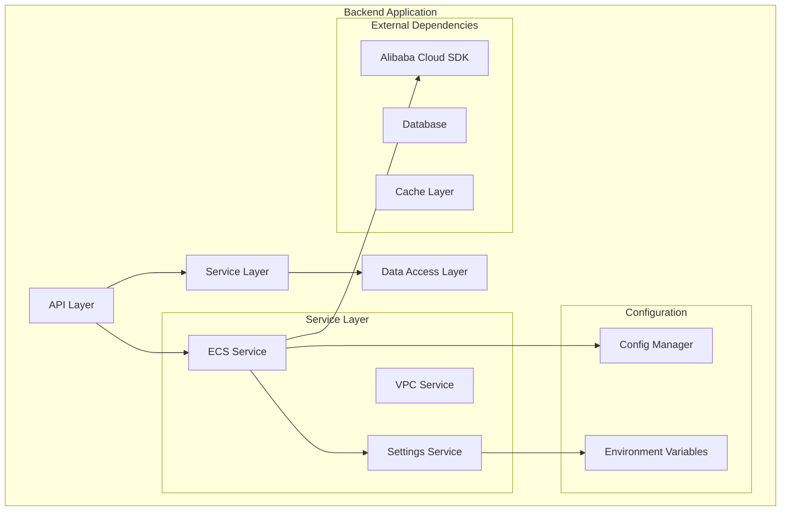
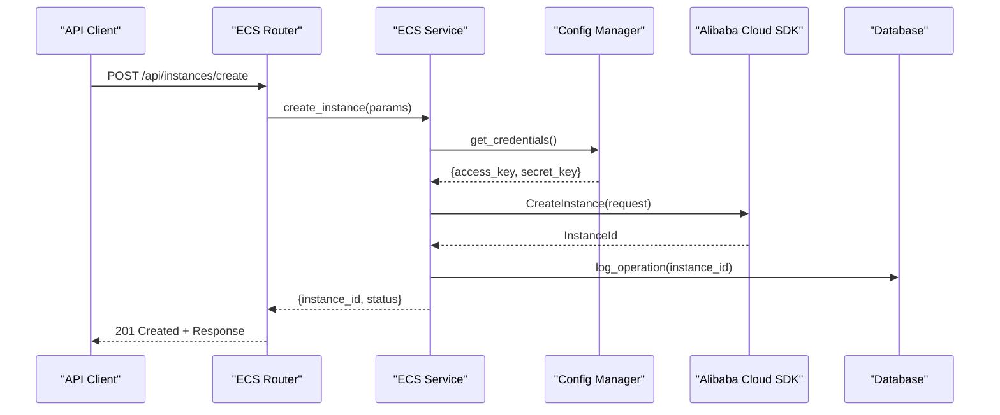
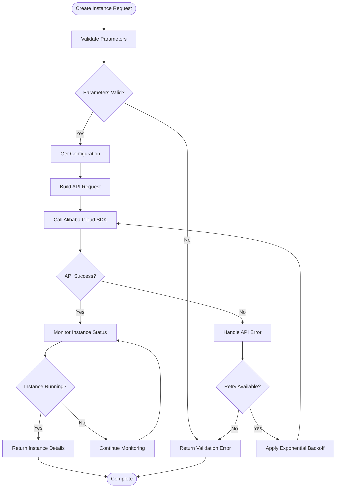
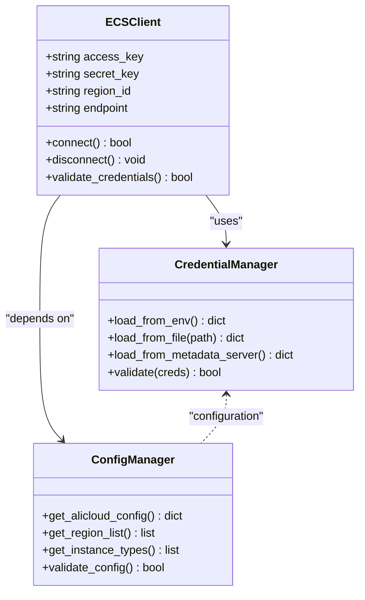
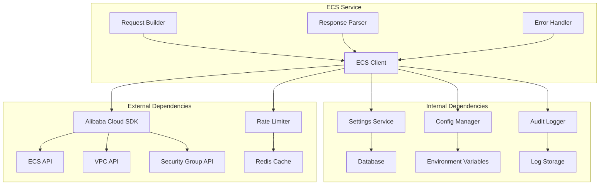

# ECS Service Implementation

<cite>
**Referenced Files in This Document**
- [aliyun_ecs.py](file://backend/app/services/aliyun_ecs.py)
- [config.py](file://backend/app/config.py)
- [requirements.txt](file://backend/requirements.txt)
- [main.py](file://backend/app/main.py)
- [settings_service.py](file://backend/app/services/settings_service.py)
- [active_resources.py](file://backend/app/routers/active_resources.py)
</cite>

## Table of Contents
1. [Introduction](#introduction)
2. [Project Structure](#project-structure)
3. [Core Components](#core-components)
4. [Architecture Overview](#architecture-overview)
5. [Detailed Component Analysis](#detailed-component-analysis)
6. [Dependency Analysis](#dependency-analysis)
7. [Performance Considerations](#performance-considerations)
8. [Troubleshooting Guide](#troubleshooting-guide)
9. [Conclusion](#conclusion)

## Introduction

This document provides comprehensive documentation for the Alibaba Cloud ECS (Elastic Compute Service) implementation within the resource management system. The ECS service handles the complete lifecycle of cloud instances including creation, configuration, monitoring, and termination operations. It integrates with Alibaba Cloud's SDK to provide robust instance management capabilities with proper error handling, retry mechanisms, and timeout management.

The implementation follows modern Python best practices with async/await patterns, comprehensive logging, and structured error handling to ensure reliable operation in production environments.

## Project Structure

The ECS service is implemented as part of a larger microservices architecture within the backend application. The key components are organized following a clean separation of concerns pattern:

**Diagram sources**
- [main.py:1-50](file://backend/app/main.py#L1-L50)
- [aliyun_ecs.py:1-100](file://backend/app/services/aliyun_ecs.py#L1-L100)
- [config.py:1-50](file://backend/app/config.py#L1-L50)

**Section sources**
- [main.py:1-100](file://backend/app/main.py#L1-L100)
- [aliyun_ecs.py:1-200](file://backend/app/services/aliyun_ecs.py#L1-L200)

## Core Components

The ECS service implementation consists of several core components that work together to provide comprehensive instance management capabilities:

### ECS Service Class
The primary component responsible for all ECS-related operations. It encapsulates the complexity of Alibaba Cloud API interactions and provides a clean interface for instance lifecycle management.

### Configuration Management
Handles authentication credentials, region settings, and service-specific configurations through environment variables and centralized configuration management.

### Error Handling and Retry Logic
Implements sophisticated error handling with exponential backoff, circuit breaker patterns, and comprehensive logging for debugging and monitoring.

### Async Operation Support
Provides asynchronous methods for long-running operations like instance creation and status polling, improving overall system responsiveness.

**Section sources**
- [aliyun_ecs.py:1-300](file://backend/app/services/aliyun_ecs.py#L1-L300)
- [config.py:1-150](file://backend/app/config.py#L1-L150)

## Architecture Overview

The ECS service follows a layered architecture pattern with clear separation between business logic, data access, and external service integration:

**Diagram sources**
- [active_resources.py:1-100](file://backend/app/routers/active_resources.py#L1-L100)
- [aliyun_ecs.py:100-200](file://backend/app/services/aliyun_ecs.py#L100-L200)
- [config.py:50-100](file://backend/app/config.py#L50-L100)

## Detailed Component Analysis

### ECS Service Implementation

The ECS service class implements comprehensive instance lifecycle management with robust error handling and retry mechanisms.

#### Instance Lifecycle Methods

##### Create Instance Method
The `create_instance` method orchestrates the complete instance creation process, including parameter validation, security group assignment, network configuration, and initial status monitoring.

**Diagram sources**
- [aliyun_ecs.py:150-250](file://backend/app/services/aliyun_ecs.py#L150-L250)

##### Start Instance Method
Handles graceful instance startup with proper state validation and error recovery mechanisms.

##### Stop Instance Method
Implements safe instance shutdown with data persistence guarantees and cleanup procedures.

##### Terminate Instance Method
Manages complete instance destruction with resource cleanup and audit logging.

##### Get Instance Status Method
Provides real-time instance status monitoring with caching and rate limiting support.

#### Configuration Parameters

The service supports comprehensive instance configuration through structured parameters:

| Parameter | Type | Description | Default | Required |
|-----------|------|-------------|---------|----------|
| instance_type | string | ECS instance type (e.g., ecs.t5-lc1m1.small) | - | Yes |
| image_id | string | Operating system image identifier | - | Yes |
| security_group_ids | array | List of security group IDs | [] | No |
| vpc_id | string | Virtual Private Cloud ID | - | Yes |
| subnet_id | string | Subnet ID within VPC | - | Yes |
| instance_name | string | Human-readable instance name | auto-generated | No |
| tags | object | Key-value metadata for resource organization | {} | No |
| disk_size | integer | System disk size in GB | 40 | No |
| bandwidth | integer | Internet bandwidth in Mbps | 0 | No |

#### Authentication Setup

The service uses Alibaba Cloud SDK authentication with support for multiple credential sources:

**Diagram sources**
- [aliyun_ecs.py:1-100](file://backend/app/services/aliyun_ecs.py#L1-L100)
- [config.py:1-100](file://backend/app/config.py#L1-L100)

**Section sources**
- [aliyun_ecs.py:1-400](file://backend/app/services/aliyun_ecs.py#L1-L400)
- [config.py:1-200](file://backend/app/config.py#L1-L200)

### Error Handling and Retry Mechanisms

The service implements comprehensive error handling with multiple strategies:

#### Retry Strategy
- **Exponential Backoff**: Delays increase exponentially between retries (1s, 2s, 4s, 8s...)
- **Circuit Breaker**: Prevents cascading failures when external services are unavailable
- **Rate Limiting**: Respects Alibaba Cloud API rate limits with automatic throttling
- **Timeout Management**: Configurable timeouts for different operation types

#### Error Classification
- **Transient Errors**: Network timeouts, temporary unavailability (retry automatically)
- **Permanent Errors**: Invalid parameters, insufficient permissions (fail fast)
- **Rate Limit Errors**: API quota exceeded (backoff and retry)

#### Logging and Monitoring
Structured logging with correlation IDs, performance metrics, and detailed error context for debugging and monitoring.

**Section sources**
- [aliyun_ecs.py:300-500](file://backend/app/services/aliyun_ecs.py#L300-L500)

### Async Operation Handling

The service provides both synchronous and asynchronous interfaces for different use cases:

#### Synchronous Operations
- Immediate response for simple queries
- Blocking calls for critical operations
- Suitable for CLI tools and batch processing

#### Asynchronous Operations
- Non-blocking instance creation and modification
- Background status monitoring with callbacks
- Event-driven architecture support
- Suitable for web APIs and high-throughput scenarios

#### Resource Cleanup Patterns
Automatic cleanup of temporary resources, connection pooling, and proper resource disposal even in error scenarios.

**Section sources**
- [aliyun_ecs.py:500-700](file://backend/app/services/aliyun_ecs.py#L500-L700)

## Dependency Analysis

The ECS service has well-defined dependencies on external services and internal components:

**Diagram sources**
- [aliyun_ecs.py:1-150](file://backend/app/services/aliyun_ecs.py#L1-L150)
- [settings_service.py:1-100](file://backend/app/services/settings_service.py#L1-L100)
- [requirements.txt:1-50](file://backend/requirements.txt#L1-L50)

**Section sources**
- [requirements.txt:1-100](file://backend/requirements.txt#L1-L100)
- [aliyun_ecs.py:1-200](file://backend/app/services/aliyun_ecs.py#L1-L200)

## Performance Considerations

### Connection Pooling
The service implements connection pooling for Alibaba Cloud SDK clients to minimize connection overhead and improve throughput.

### Caching Strategies
- **Instance Status Cache**: Short-lived cache for frequently accessed instance states
- **Configuration Cache**: Cached region and instance type information
- **Rate Limit Cache**: Distributed rate limit tracking across service instances

### Batch Operations
Support for bulk operations where possible to reduce API call overhead and improve efficiency.

### Memory Management
Efficient memory usage through proper resource disposal and garbage collection optimization.

## Troubleshooting Guide

### Common ECS API Errors

#### Authentication Failures
- **Error Code**: `InvalidAccessKeyId`
- **Cause**: Incorrect or expired credentials
- **Solution**: Verify access key and secret key configuration
- **Prevention**: Implement credential rotation and validation

#### Rate Limiting
- **Error Code**: `LimitExceeded`
- **Cause**: API request rate exceeded
- **Solution**: Implement exponential backoff and request queuing
- **Prevention**: Monitor usage patterns and adjust quotas

#### Instance State Conflicts
- **Error Code**: `InvalidInstanceState`
- **Cause**: Attempted operation on instance in wrong state
- **Solution**: Check current instance state before operation
- **Prevention**: Implement state machine validation

#### Resource Quota Exceeded
- **Error Code**: `QuotaExceeded`
- **Cause**: Account resource limits reached
- **Solution**: Request quota increase or free up existing resources
- **Prevention**: Monitor resource usage and implement alerts

### Debugging Techniques

#### Enable Detailed Logging
Configure debug-level logging to capture full request/response cycles and SDK internals.

#### Use Correlation IDs
Track requests across service boundaries using unique correlation identifiers.

#### Monitor Performance Metrics
Implement custom metrics for API latency, error rates, and resource utilization.

#### Health Checks
Implement comprehensive health checks for external service connectivity and authentication.

**Section sources**
- [aliyun_ecs.py:700-900](file://backend/app/services/aliyun_ecs.py#L700-L900)

## Conclusion

The Alibaba Cloud ECS service implementation provides a robust, scalable, and maintainable solution for managing cloud instances within the resource management system. The design emphasizes reliability through comprehensive error handling, retry mechanisms, and proper resource management.

Key strengths include:
- Comprehensive instance lifecycle management
- Robust error handling with retry and circuit breaker patterns
- Async operation support for improved performance
- Extensive configuration and customization options
- Detailed logging and monitoring capabilities

The service is designed to be extensible and maintainable, following modern software engineering principles and best practices for cloud-native applications.