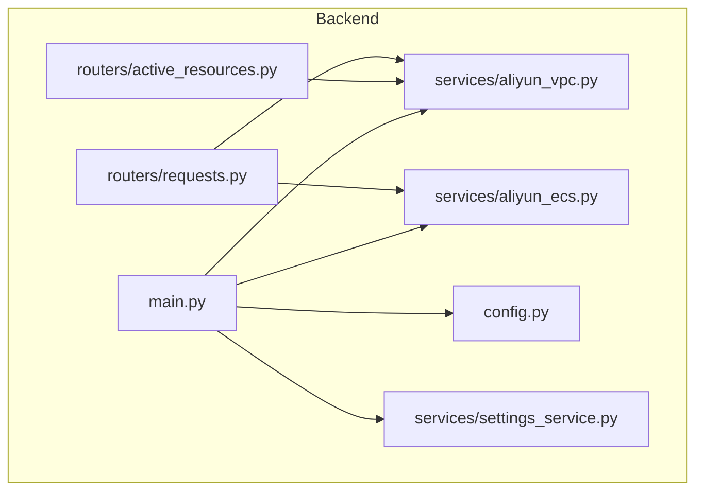
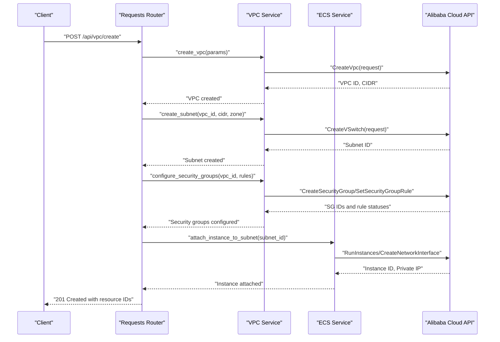
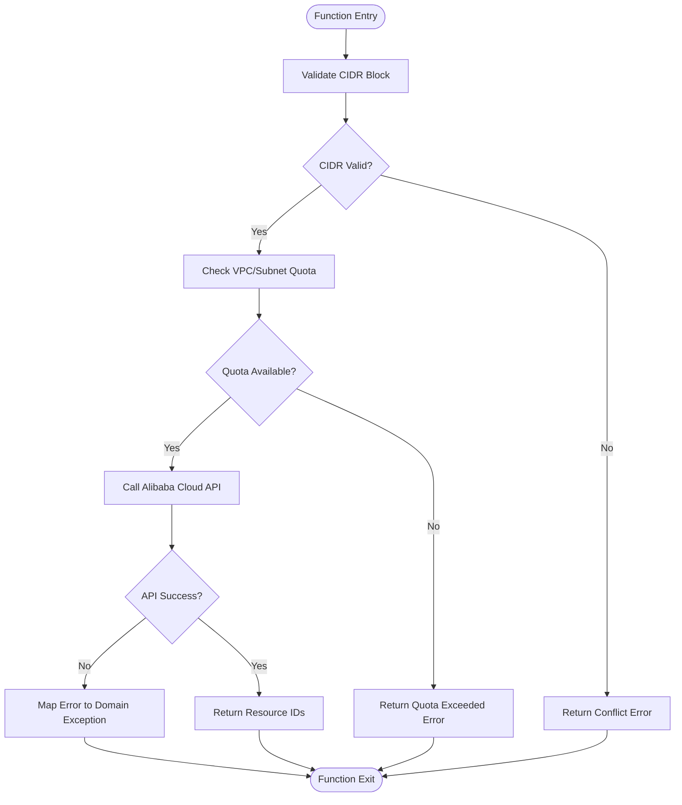
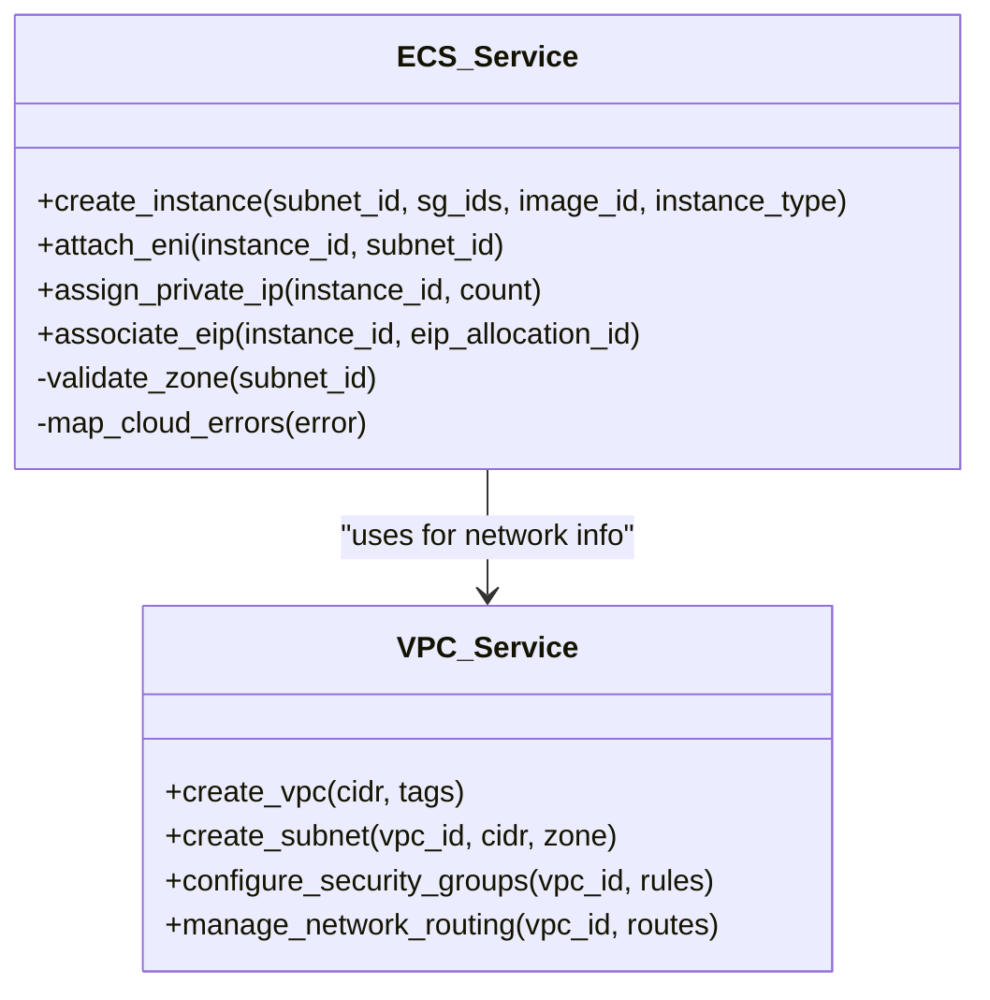
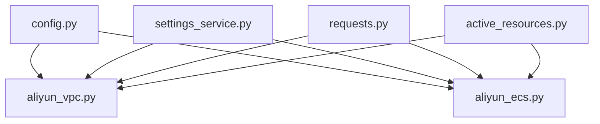

# VPC Service Implementation

<cite>
**Referenced Files in This Document**
- [aliyun_vpc.py](file://backend/app/services/aliyun_vpc.py)
- [aliyun_ecs.py](file://backend/app/services/aliyun_ecs.py)
- [main.py](file://backend/app/main.py)
- [config.py](file://backend/app/config.py)
- [active_resources.py](file://backend/app/routers/active_resources.py)
- [requests.py](file://backend/app/routers/requests.py)
- [settings_service.py](file://backend/app/services/settings_service.py)
- [ecs-request-system-prompt.md](file://ecs-request-system-prompt.md)
</cite>

## Table of Contents
1. [Introduction](#introduction)
2. [Project Structure](#project-structure)
3. [Core Components](#core-components)
4. [Architecture Overview](#architecture-overview)
5. [Detailed Component Analysis](#detailed-component-analysis)
6. [Dependency Analysis](#dependency-analysis)
7. [Performance Considerations](#performance-considerations)
8. [Troubleshooting Guide](#troubleshooting-guide)
9. [Conclusion](#conclusion)
10. [Appendices](#appendices)

## Introduction
This document explains the Alibaba Cloud VPC service implementation within the project, focusing on virtual private cloud operations such as creating VPCs and subnets, configuring security groups, and managing network routing. It also covers CIDR block management, subnet allocation strategies, ECS instance integration for network attachment and IP address management, error handling for conflicts and quotas, and guidance for monitoring and troubleshooting connectivity. The goal is to provide both technical depth and accessible explanations for users with varying levels of expertise.

## Project Structure
The backend organizes functionality into services, routers, schemas, models, and configuration modules. VPC-related logic resides primarily in a dedicated service module, while ECS integration is handled by another service. Routers expose endpoints that orchestrate workflows using these services. Configuration and settings are centralized for environment-specific behavior.

**Diagram sources**
- [main.py](file://backend/app/main.py)
- [config.py](file://backend/app/config.py)
- [settings_service.py](file://backend/app/services/settings_service.py)
- [aliyun_vpc.py](file://backend/app/services/aliyun_vpc.py)
- [aliyun_ecs.py](file://backend/app/services/aliyun_ecs.py)
- [active_resources.py](file://backend/app/routers/active_resources.py)
- [requests.py](file://backend/app/routers/requests.py)

**Section sources**
- [main.py](file://backend/app/main.py)
- [config.py](file://backend/app/config.py)
- [settings_service.py](file://backend/app/services/settings_service.py)
- [aliyun_vpc.py](file://backend/app/services/aliyun_vpc.py)
- [aliyun_ecs.py](file://backend/app/services/aliyun_ecs.py)
- [active_resources.py](file://backend/app/routers/active_resources.py)
- [requests.py](file://backend/app/routers/requests.py)

## Core Components
- VPC Service: Encapsulates Alibaba Cloud VPC operations including creation, subnet management, security group configuration, and routing table updates. It centralizes API calls, parameter validation, and error mapping to application-level exceptions.
- ECS Service: Manages ECS instance lifecycle and networking tasks such as attaching ENIs, assigning private IPs, and associating EIPs. It coordinates with VPC resources to ensure consistent network topology.
- Routers: Provide HTTP endpoints that trigger VPC/ECS workflows, validate inputs via schemas, and return structured responses. They orchestrate multi-step processes like provisioning a VPC, creating subnets, setting up security groups, and attaching instances.
- Configuration and Settings: Centralize credentials, region/zone constraints, quota limits, and feature flags used across services.

Key responsibilities:
- create_vpc: Allocate a new VPC with a specified CIDR block and metadata.
- create_subnet: Create subnets within a VPC, respecting availability zones and CIDR constraints.
- configure_security_groups: Define ingress/egress rules and associate them with VSwitches or instances.
- manage_network_routing: Update route tables for inter-VPC peering, NAT, or custom routes.

**Section sources**
- [aliyun_vpc.py](file://backend/app/services/aliyun_vpc.py)
- [aliyun_ecs.py](file://backend/app/services/aliyun_ecs.py)
- [requests.py](file://backend/app/routers/requests.py)
- [active_resources.py](file://backend/app/routers/active_resources.py)
- [settings_service.py](file://backend/app/services/settings_service.py)

## Architecture Overview
The system follows a layered architecture where routers handle HTTP requests, services implement business logic and cloud integrations, and configuration provides runtime parameters. VPC and ECS services interact with Alibaba Cloud APIs, returning results or raising domain-specific errors.

**Diagram sources**
- [requests.py](file://backend/app/routers/requests.py)
- [aliyun_vpc.py](file://backend/app/services/aliyun_vpc.py)
- [aliyun_ecs.py](file://backend/app/services/aliyun_ecs.py)

## Detailed Component Analysis

### VPC Service (aliyun_vpc.py)
Responsibilities:
- Create VPCs with validated CIDR blocks and tags.
- Create subnets within availability zones, ensuring non-overlapping CIDRs.
- Configure security groups with ingress/egress rules and associations.
- Manage route tables for custom routes, NAT gateways, and peering.

Error handling:
- Maps Alibaba Cloud API errors to application exceptions (e.g., CIDR conflict, quota exceeded, invalid zone).
- Validates input parameters before calling cloud APIs.

Optimization opportunities:
- Batch operations where supported by the SDK.
- Caching of resource lookups to reduce API calls.

**Diagram sources**
- [aliyun_vpc.py](file://backend/app/services/aliyun_vpc.py)

**Section sources**
- [aliyun_vpc.py](file://backend/app/services/aliyun_vpc.py)

### ECS Service (aliyun_ecs.py)
Responsibilities:
- Provision ECS instances within specified subnets.
- Attach Elastic Network Interfaces (ENI) and assign private IPs.
- Associate Elastic IP addresses (EIP) for public access.
- Coordinate with VPC service to ensure correct network topology.

Integration points:
- Uses VPC service to resolve subnet and security group IDs.
- Returns instance networking details (private IP, EIP if allocated).

**Diagram sources**
- [aliyun_ecs.py](file://backend/app/services/aliyun_ecs.py)
- [aliyun_vpc.py](file://backend/app/services/aliyun_vpc.py)

**Section sources**
- [aliyun_ecs.py](file://backend/app/services/aliyun_ecs.py)

### Routers (requests.py, active_resources.py)
Responsibilities:
- Expose HTTP endpoints for VPC and ECS operations.
- Validate request payloads using Pydantic schemas.
- Orchestrate multi-step workflows (e.g., create VPC -> create subnet -> configure SG -> attach instance).
- Return standardized responses and error codes.

Workflow example:
- POST /api/vpc/create triggers VPC creation and returns VPC ID.
- POST /api/vpc/subnet creates a subnet within an existing VPC.
- POST /api/vpc/security-groups configures rules and associations.
- POST /api/ecs/attach attaches an ECS instance to a subnet and assigns IPs.

**Section sources**
- [requests.py](file://backend/app/routers/requests.py)
- [active_resources.py](file://backend/app/routers/active_resources.py)

### Configuration and Settings (config.py, settings_service.py)
Responsibilities:
- Load environment variables for Alibaba Cloud credentials, region, and zone preferences.
- Provide default values for CIDR ranges, quota limits, and feature toggles.
- Centralize settings for consistent behavior across services.

Usage:
- VPC and ECS services read configuration to determine allowed CIDRs, zones, and quotas.
- Routers may use settings to enforce policy checks before invoking services.

**Section sources**
- [config.py](file://backend/app/config.py)
- [settings_service.py](file://backend/app/services/settings_service.py)

## Dependency Analysis
The VPC and ECS services depend on configuration and settings modules. Routers depend on both services to implement workflows. External dependencies include Alibaba Cloud SDK/APIs for VPC and ECS operations.

**Diagram sources**
- [config.py](file://backend/app/config.py)
- [settings_service.py](file://backend/app/services/settings_service.py)
- [aliyun_vpc.py](file://backend/app/services/aliyun_vpc.py)
- [aliyun_ecs.py](file://backend/app/services/aliyun_ecs.py)
- [requests.py](file://backend/app/routers/requests.py)
- [active_resources.py](file://backend/app/routers/active_resources.py)

**Section sources**
- [config.py](file://backend/app/config.py)
- [settings_service.py](file://backend/app/services/settings_service.py)
- [aliyun_vpc.py](file://backend/app/services/aliyun_vpc.py)
- [aliyun_ecs.py](file://backend/app/services/aliyun_ecs.py)
- [requests.py](file://backend/app/routers/requests.py)
- [active_resources.py](file://backend/app/routers/active_resources.py)

## Performance Considerations
- Batch API calls: Where possible, combine multiple operations into single SDK calls to reduce latency.
- Caching: Cache frequently accessed resource IDs (e.g., VPC, subnet, security group) to minimize repeated lookups.
- Retry policies: Implement exponential backoff for transient network errors from Alibaba Cloud APIs.
- Connection pooling: Ensure SDK clients reuse connections to avoid overhead.
- Asynchronous processing: For long-running operations (e.g., large subnet allocations), consider async handlers or background jobs.

[No sources needed since this section provides general guidance]

## Troubleshooting Guide
Common issues and resolutions:
- CIDR conflicts: Validate requested CIDR against existing VPCs/subnets; return clear error messages indicating overlapping ranges.
- Quota limits: Check account quotas before provisioning; suggest scaling plans or requesting quota increases.
- Availability zone constraints: Verify subnet zone availability; fallback to alternate zones if configured.
- Security group misconfiguration: Validate rule syntax and port ranges; log failed rule applications.
- ECS attachment failures: Confirm subnet and security group existence; check instance type compatibility.

Monitoring and diagnostics:
- Log all API calls and responses with correlation IDs.
- Track error rates and latency per operation.
- Use Alibaba Cloud console logs and metrics for network health.

**Section sources**
- [aliyun_vpc.py](file://backend/app/services/aliyun_vpc.py)
- [aliyun_ecs.py](file://backend/app/services/aliyun_ecs.py)

## Conclusion
The VPC service implementation provides a robust foundation for managing Alibaba Cloud networking resources. By centralizing operations in dedicated services, enforcing validation and error handling, and integrating seamlessly with ECS, the system supports scalable and reliable network topologies. Following the recommended practices for performance, monitoring, and troubleshooting ensures optimal operation and user experience.

[No sources needed since this section summarizes without analyzing specific files]

## Appendices

### VPC Setup Workflow Example
1. Create VPC with a valid CIDR block.
2. Create subnets within desired availability zones.
3. Configure security groups with required ingress/egress rules.
4. Attach ECS instances to subnets and assign private IPs.
5. Optionally associate EIPs for public access.
6. Test connectivity using ping or curl from instances.

### Security Group Rule Management
- Define rules with protocol, port range, source/destination CIDR, and action (allow/deny).
- Apply rules to security groups associated with subnets or instances.
- Validate rules to prevent conflicts and ensure least privilege access.

### Network Connectivity Testing
- Use internal tools (ping, telnet, nc) to test reachability between instances.
- Verify routing tables for correct next-hop configurations.
- Inspect security group rules and NACLs for traffic filtering.

### Integration with ECS Instances
- Provision instances within target subnets.
- Attach ENIs and assign private IPs as needed.
- Associate EIPs for outbound internet access.
- Monitor instance network interfaces and IP assignments.

[No sources needed since this section provides general guidance]