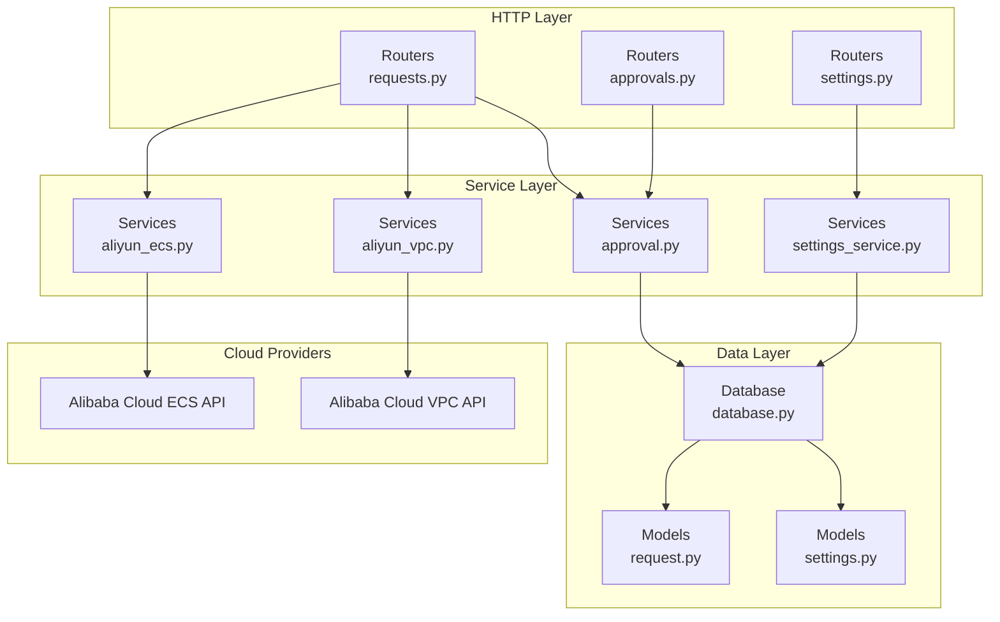
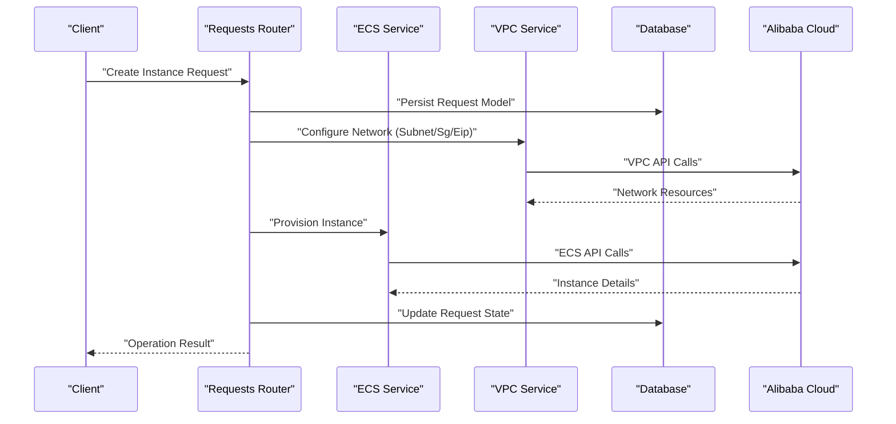
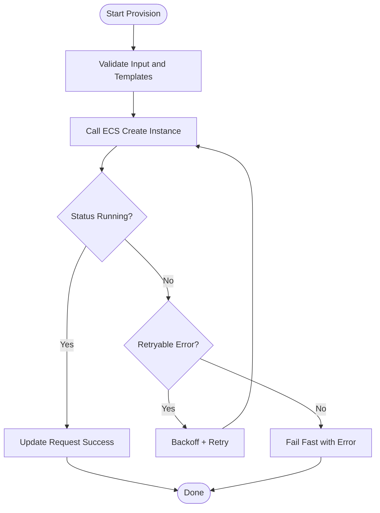
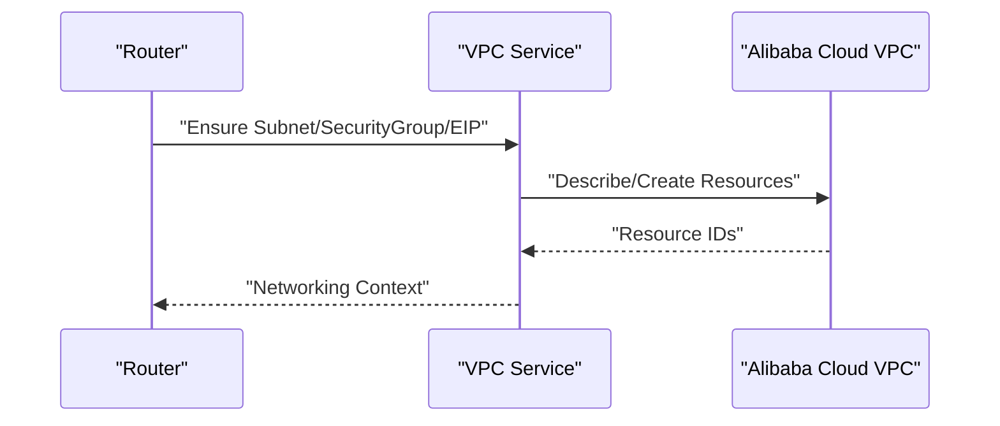
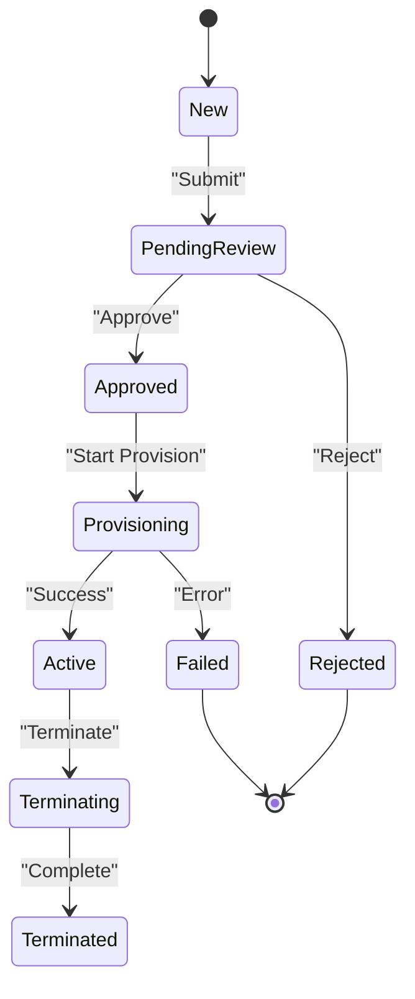
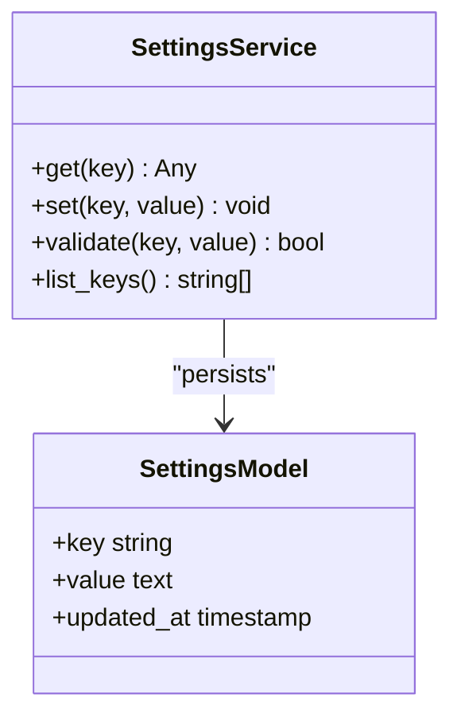
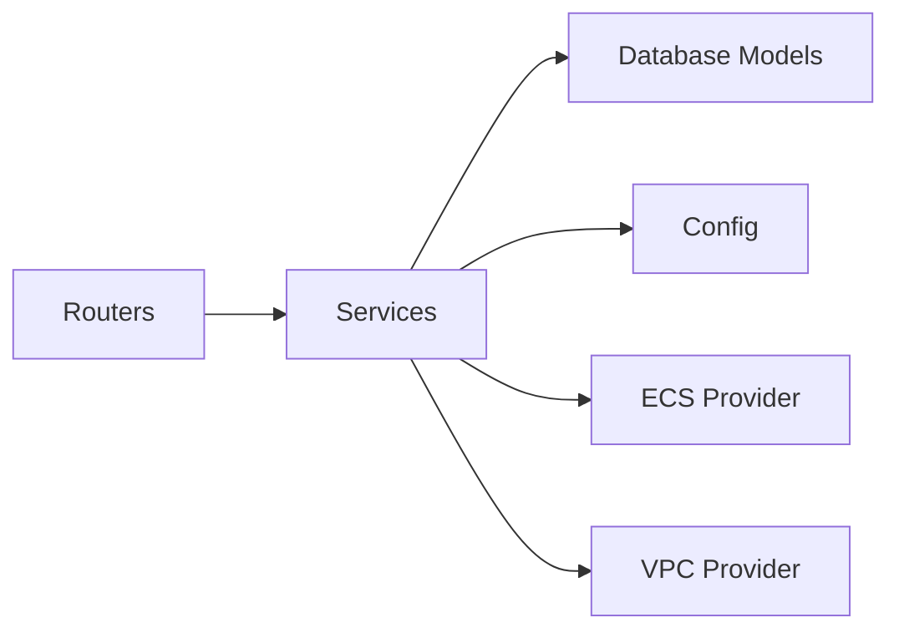

# Service Layer & Business Logic

<cite>
**Referenced Files in This Document**
- [main.py](file://backend/app/main.py)
- [config.py](file://backend/app/config.py)
- [database.py](file://backend/app/database.py)
- [aliyun_ecs.py](file://backend/app/services/aliyun_ecs.py)
- [aliyun_vpc.py](file://backend/app/services/aliyun_vpc.py)
- [approval.py](file://backend/app/services/approval.py)
- [settings_service.py](file://backend/app/services/settings_service.py)
- [request.py](file://backend/app/models/request.py)
- [settings.py](file://backend/app/models/settings.py)
- [requests.py](file://backend/app/routers/requests.py)
- [approvals.py](file://backend/app/routers/approvals.py)
- [settings.py](file://backend/app/routers/settings.py)
</cite>

## Table of Contents
1. [Introduction](#introduction)
2. [Project Structure](#project-structure)
3. [Core Components](#core-components)
4. [Architecture Overview](#architecture-overview)
5. [Detailed Component Analysis](#detailed-component-analysis)
6. [Dependency Analysis](#dependency-analysis)
7. [Performance Considerations](#performance-considerations)
8. [Troubleshooting Guide](#troubleshooting-guide)
9. [Conclusion](#conclusion)
10. [Appendices](#appendices)

## Introduction
This document explains the service layer and core business logic of the ECS request system. It focuses on:
- Alibaba Cloud ECS and VPC integrations for instance provisioning, networking, and lifecycle management
- The approval workflow engine covering request routing, state transitions, and notifications
- Application settings service for configuration management and persistence
- Concrete examples of service method invocation patterns, error handling, retries, async operations, rate limiting, and monitoring
- Guidance for extending services with new cloud providers or workflows

The goal is to provide both a high-level understanding and actionable details for developers integrating or extending the system.

## Project Structure
At a high level, the backend organizes concerns by feature layers:
- Routers expose HTTP endpoints and orchestrate calls into services
- Services encapsulate business logic and external integrations (cloud APIs, approvals, settings)
- Models define database schemas and relationships
- Configuration and database initialization are centralized

**Diagram sources**
- [main.py:1-200](file://backend/app/main.py#L1-L200)
- [requests.py:1-200](file://backend/app/routers/requests.py#L1-L200)
- [approvals.py:1-200](file://backend/app/routers/approvals.py#L1-L200)
- [settings.py:1-200](file://backend/app/routers/settings.py#L1-L200)
- [aliyun_ecs.py:1-200](file://backend/app/services/aliyun_ecs.py#L1-L200)
- [aliyun_vpc.py:1-200](file://backend/app/services/aliyun_vpc.py#L1-L200)
- [approval.py:1-200](file://backend/app/services/approval.py#L1-L200)
- [settings_service.py:1-200](file://backend/app/services/settings_service.py#L1-L200)
- [request.py:1-200](file://backend/app/models/request.py#L1-L200)
- [settings.py:1-200](file://backend/app/models/settings.py#L1-L200)
- [database.py:1-200](file://backend/app/database.py#L1-L200)

**Section sources**
- [main.py:1-200](file://backend/app/main.py#L1-L200)

## Core Components
- ECS Service: Encapsulates Alibaba Cloud ECS operations such as creating instances, describing status, and releasing resources. It handles provider-specific SDK usage, parameter mapping, and result normalization.
- VPC Service: Manages VPC-related networking tasks including subnet association, security group rules, and EIP binding/unbinding. It coordinates with ECS service to ensure consistent resource states.
- Approval Service: Implements the workflow engine for requests, including routing to approvers, enforcing policy, transitioning states, and emitting notifications.
- Settings Service: Provides CRUD over application settings, with validation, defaults, and persistence via the database. It exposes typed getters/setters used across routers and services.

Key responsibilities:
- Decouple HTTP routes from cloud provider specifics
- Centralize error handling and retry strategies
- Maintain consistent data models and auditability
- Provide extension points for additional providers or workflows

**Section sources**
- [aliyun_ecs.py:1-200](file://backend/app/services/aliyun_ecs.py#L1-L200)
- [aliyun_vpc.py:1-200](file://backend/app/services/aliyun_vpc.py#L1-L200)
- [approval.py:1-200](file://backend/app/services/approval.py#L1-L200)
- [settings_service.py:1-200](file://backend/app/services/settings_service.py#L1-L200)

## Architecture Overview
The service layer sits between HTTP routers and external systems (cloud APIs and database). It standardizes interactions, enforces policies, and ensures reliable operation through retries and error handling.

**Diagram sources**
- [requests.py:1-200](file://backend/app/routers/requests.py#L1-L200)
- [aliyun_ecs.py:1-200](file://backend/app/services/aliyun_ecs.py#L1-L200)
- [aliyun_vpc.py:1-200](file://backend/app/services/aliyun_vpc.py#L1-L200)
- [request.py:1-200](file://backend/app/models/request.py#L1-L200)
- [database.py:1-200](file://backend/app/database.py#L1-L200)

## Detailed Component Analysis

### ECS Service
Responsibilities:
- Map request parameters to ECS SDK inputs
- Create, describe, stop, start, and release instances
- Normalize responses and errors
- Integrate with VPC service for network attachment where needed

Typical flow:
- Validate input against configured templates and quotas
- Call ECS API to create instance
- Poll instance status until running or failed
- Record outcomes and update request model

Error handling and retries:
- Distinguish transient vs permanent errors
- Apply exponential backoff for throttling and temporary failures
- Surface meaningful messages to callers

Rate limiting:
- Respect provider limits and implement client-side backoff
- Use jitter to avoid thundering herds

Monitoring:
- Emit metrics for success/failure, latency, and retries
- Log structured events for auditing

Extension points:
- Provider abstraction interface for swapping or adding cloud vendors
- Template-driven parameterization for different instance types

**Diagram sources**
- [aliyun_ecs.py:1-200](file://backend/app/services/aliyun_ecs.py#L1-L200)
- [request.py:1-200](file://backend/app/models/request.py#L1-L200)

**Section sources**
- [aliyun_ecs.py:1-200](file://backend/app/services/aliyun_ecs.py#L1-L200)

### VPC Service
Responsibilities:
- Manage subnets, security groups, and elastic IPs
- Bind/unbind EIPs to instances
- Ensure idempotent operations and cleanup on failure

Integration with ECS:
- Pre-provision networking before instance creation
- Post-provision adjustments if instance creation fails

Idempotency and safety:
- Check existing resources before creating
- Use tags to correlate resources with requests

**Diagram sources**
- [aliyun_vpc.py:1-200](file://backend/app/services/aliyun_vpc.py#L1-L200)

**Section sources**
- [aliyun_vpc.py:1-200](file://backend/app/services/aliyun_vpc.py#L1-L200)

### Approval Workflow Engine
Responsibilities:
- Route requests to appropriate approvers based on policy
- Enforce state machine transitions (e.g., pending -> approved/rejected)
- Emit notifications upon state changes
- Support audit trails and history

State transitions:
- New -> Pending Review
- Pending Review -> Approved
- Pending Review -> Rejected
- Approved -> Provisioning
- Provisioning -> Active / Failed
- Active -> Terminating
- Terminating -> Terminated

Notifications:
- Triggered on key transitions
- Configurable channels via settings

**Diagram sources**
- [approval.py:1-200](file://backend/app/services/approval.py#L1-L200)
- [request.py:1-200](file://backend/app/models/request.py#L1-L200)

**Section sources**
- [approval.py:1-200](file://backend/app/services/approval.py#L1-L200)

### Settings Service
Responsibilities:
- Persist application-wide configuration
- Provide typed accessors and validators
- Support defaults and environment overrides
- Expose safe read-only views to non-admin components

Common keys:
- Cloud provider credentials and regions
- Rate limit policies and retry configurations
- Notification channel settings
- Feature flags and quotas

Persistence:
- Database-backed storage with migrations
- Atomic updates and versioning where applicable

**Diagram sources**
- [settings_service.py:1-200](file://backend/app/services/settings_service.py#L1-L200)
- [settings.py:1-200](file://backend/app/models/settings.py#L1-L200)

**Section sources**
- [settings_service.py:1-200](file://backend/app/services/settings_service.py#L1-L200)

## Dependency Analysis
The service layer depends on:
- Database models for persistence
- Cloud provider SDKs for ECS/VPC operations
- Configuration module for runtime settings
- Optional notification subsystem driven by settings

**Diagram sources**
- [main.py:1-200](file://backend/app/main.py#L1-L200)
- [config.py:1-200](file://backend/app/config.py#L1-L200)
- [database.py:1-200](file://backend/app/database.py#L1-L200)
- [aliyun_ecs.py:1-200](file://backend/app/services/aliyun_ecs.py#L1-L200)
- [aliyun_vpc.py:1-200](file://backend/app/services/aliyun_vpc.py#L1-L200)

**Section sources**
- [config.py:1-200](file://backend/app/config.py#L1-L200)
- [database.py:1-200](file://backend/app/database.py#L1-L200)

## Performance Considerations
- Batch operations where possible to reduce API round-trips
- Cache frequently accessed settings and template metadata
- Implement client-side rate limiting and backoff for cloud APIs
- Use connection pooling for database and HTTP clients
- Prefer asynchronous I/O for long-running operations when supported
- Monitor and alert on latency percentiles and error rates

[No sources needed since this section provides general guidance]

## Troubleshooting Guide
Common issues and resolutions:
- Throttling errors: Increase backoff intervals, add jitter, and review quota settings
- Network misconfiguration: Verify VPC/subnet/security group associations and EIP bindings
- Approval bottlenecks: Check approver assignments and notification delivery
- Settings inconsistencies: Validate schema and defaults; ensure atomic updates

Operational checks:
- Inspect request lifecycle state and audit logs
- Confirm provider credentials and region settings
- Review retry counts and last error messages

**Section sources**
- [approval.py:1-200](file://backend/app/services/approval.py#L1-L200)
- [settings_service.py:1-200](file://backend/app/services/settings_service.py#L1-L200)

## Conclusion
The service layer centralizes business logic, abstracts cloud provider complexities, and enforces robust workflows. By following the patterns described here—clear separation of concerns, resilient error handling, and extensible interfaces—you can reliably provision resources, manage approvals, and configure the application while maintaining observability and performance.

[No sources needed since this section summarizes without analyzing specific files]

## Appendices

### Example Invocation Patterns
- Provisioning an ECS instance:
  - Router validates request and persists model
  - VPC service prepares networking context
  - ECS service creates instance and polls status
  - On success, router updates request state and returns result
- Approving a request:
  - Router invokes approval service to transition state
  - Approval service emits notifications and records audit entries
- Updating settings:
  - Router calls settings service with validated payload
  - Settings service persists and returns updated values

For concrete code paths, see:
- [requests.py:1-200](file://backend/app/routers/requests.py#L1-L200)
- [approvals.py:1-200](file://backend/app/routers/approvals.py#L1-L200)
- [settings.py:1-200](file://backend/app/routers/settings.py#L1-L200)
- [aliyun_ecs.py:1-200](file://backend/app/services/aliyun_ecs.py#L1-L200)
- [aliyun_vpc.py:1-200](file://backend/app/services/aliyun_vpc.py#L1-L200)
- [approval.py:1-200](file://backend/app/services/approval.py#L1-L200)
- [settings_service.py:1-200](file://backend/app/services/settings_service.py#L1-L200)

### Extending Services
- Add a new cloud provider:
  - Implement provider-specific methods mirroring ECS/VPC interfaces
  - Register provider selection via settings
  - Update routers to use the new provider abstraction
- Extend workflows:
  - Add new states and transitions in the approval service
  - Introduce notification handlers and policy rules
  - Update UI and audit logging accordingly

[No sources needed since this section provides general guidance]