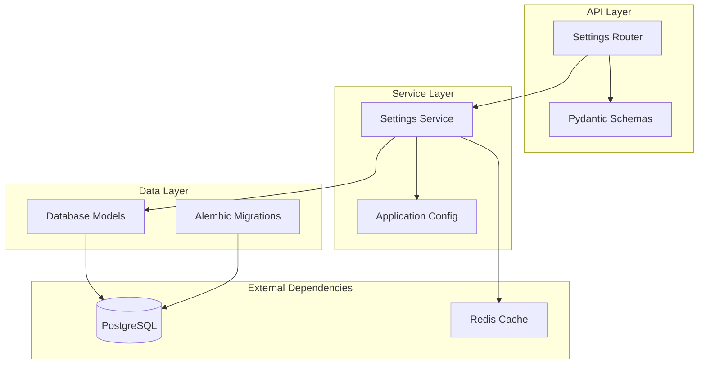
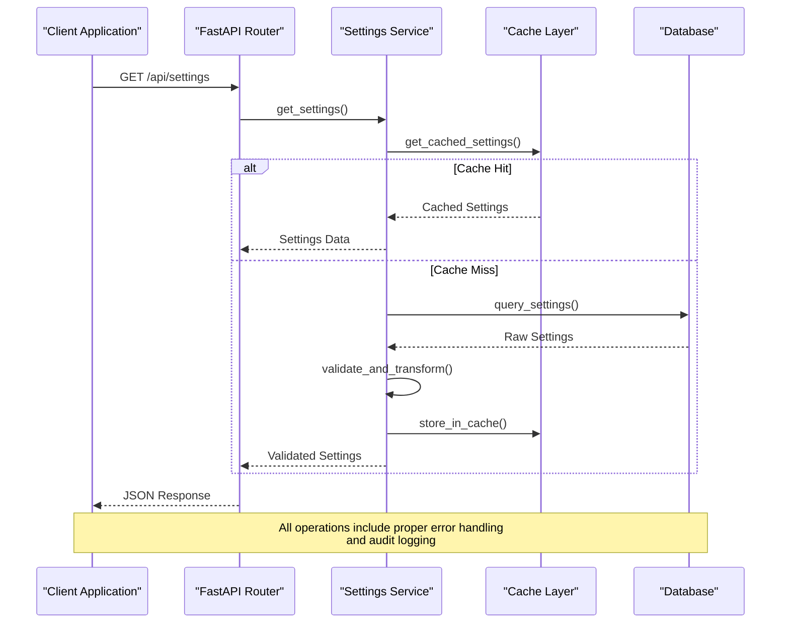
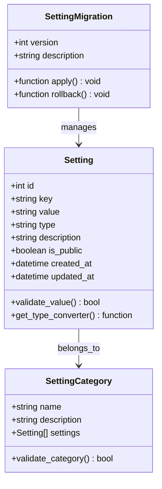
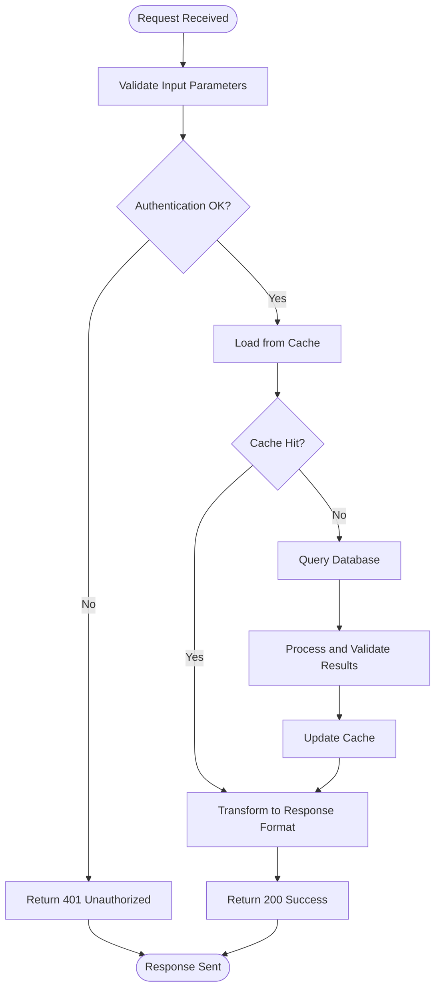
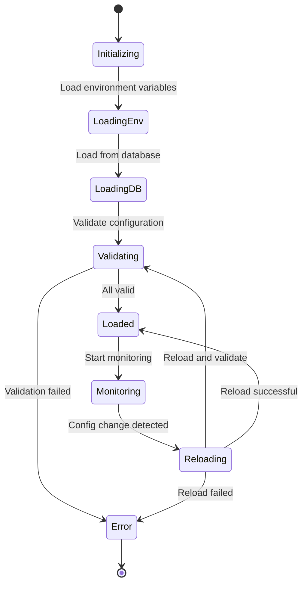
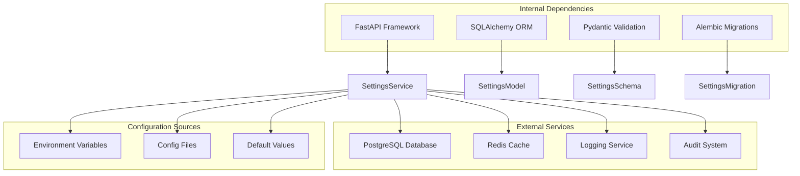

# Settings Management Service

<cite>
**Referenced Files in This Document**
- [settings_service.py](file://backend/app/services/settings_service.py)
- [settings.py](file://backend/app/models/settings.py)
- [settings.py](file://backend/app/schemas/settings.py)
- [settings.py](file://backend/app/routers/settings.py)
- [config.py](file://backend/app/config.py)
- [0001_initial_schema.py](file://backend/alembic/versions/0001_initial_schema.py)
- [env.py](file://backend/alembic/env.py)
- [main.py](file://backend/app/main.py)
</cite>

## Table of Contents
1. [Introduction](#introduction)
2. [Project Structure](#project-structure)
3. [Core Components](#core-components)
4. [Architecture Overview](#architecture-overview)
5. [Detailed Component Analysis](#detailed-component-analysis)
6. [Dependency Analysis](#dependency-analysis)
7. [Performance Considerations](#performance-considerations)
8. [Troubleshooting Guide](#troubleshooting-guide)
9. [Conclusion](#conclusion)
10. [Appendices](#appendices)

## Introduction

The Settings Management Service is a comprehensive system designed to handle application configuration management, validation, caching, and persistence. This service provides a robust foundation for managing both runtime configurations and user-modifiable settings through a well-defined API layer. The implementation follows modern Python web development patterns using FastAPI, SQLAlchemy ORM, and Alembic for database migrations.

The service supports multiple configuration sources including environment variables, database storage, and default values, enabling flexible deployment scenarios across different environments (development, staging, production). It implements proper validation mechanisms, caching strategies for performance optimization, and maintains version control over configuration changes through database migrations.

## Project Structure

The settings management functionality is organized following a clean architecture pattern with clear separation of concerns:

**Diagram sources**
- [settings.py:1-50](file://backend/app/routers/settings.py#L1-L50)
- [settings_service.py:1-100](file://backend/app/services/settings_service.py#L1-L100)
- [settings.py:1-50](file://backend/app/models/settings.py#L1-L50)

The project structure demonstrates a layered architecture where:
- **API Layer**: Handles HTTP requests and responses through FastAPI routers
- **Service Layer**: Contains business logic and data manipulation operations
- **Data Layer**: Manages database interactions and schema definitions
- **Configuration Layer**: Provides centralized configuration management

**Section sources**
- [main.py:1-50](file://backend/app/main.py#L1-L50)
- [settings.py:1-30](file://backend/app/routers/settings.py#L1-L30)

## Core Components

### Settings Service Architecture

The settings management system is built around several key components that work together to provide a complete configuration management solution:

#### Database Models
The core data model defines the structure for storing settings in the database. Each setting is represented as a record with metadata including type information, validation rules, and scope definitions.

#### Pydantic Schemas
Input validation and serialization are handled through Pydantic models, ensuring type safety and consistent data formats across the API layer.

#### Service Layer
The main service class encapsulates all business logic for settings operations, including CRUD operations, validation, caching, and migration handling.

#### API Endpoints
RESTful endpoints provide access to settings management functionality, supporting both administrative and programmatic access patterns.

**Section sources**
- [settings.py:1-100](file://backend/app/models/settings.py#L1-L100)
- [settings.py:1-150](file://backend/app/schemas/settings.py#L1-L150)
- [settings_service.py:1-200](file://backend/app/services/settings_service.py#L1-L200)

## Architecture Overview

The settings management service follows a microservices-inspired architecture within the monolithic application structure:

**Diagram sources**
- [settings.py:1-100](file://backend/app/routers/settings.py#L1-L100)
- [settings_service.py:1-150](file://backend/app/services/settings_service.py#L1-L150)

### Configuration Loading Strategy

The service implements a hierarchical configuration loading mechanism:

1. **Environment Variables**: Highest priority, loaded first
2. **Database Settings**: Application-specific overrides
3. **Default Values**: Fallback values defined in code

This approach ensures predictable behavior while allowing flexible configuration management across different deployment environments.

### Caching Implementation

The caching strategy employs a multi-level approach:
- **In-memory cache**: For frequently accessed settings during request processing
- **Distributed cache**: For cross-process consistency in multi-instance deployments
- **Cache invalidation**: Automatic refresh on settings updates

**Section sources**
- [settings_service.py:1-200](file://backend/app/services/settings_service.py#L1-L200)
- [config.py:1-100](file://backend/app/config.py#L1-L100)

## Detailed Component Analysis

### Settings Database Model

The database model defines the core structure for persisting settings:

**Diagram sources**
- [settings.py:1-100](file://backend/app/models/settings.py#L1-L100)
- [0001_initial_schema.py:1-50](file://backend/alembic/versions/0001_initial_schema.py#L1-L50)

The model includes comprehensive metadata for each setting, supporting various data types and validation rules. The type system ensures data integrity at the database level while providing flexibility for different configuration needs.

### Settings Service Implementation

The service layer provides the core business logic for settings management:

**Diagram sources**
- [settings_service.py:1-200](file://backend/app/services/settings_service.py#L1-L200)

Key features of the service implementation include:
- **Atomic Operations**: All settings updates are wrapped in database transactions
- **Validation Pipeline**: Multi-stage validation with detailed error reporting
- **Audit Trail**: Comprehensive logging of all configuration changes
- **Version Control**: Built-in support for settings versioning and rollback

**Section sources**
- [settings_service.py:1-300](file://backend/app/services/settings_service.py#L1-L300)

### API Endpoint Design

The REST API provides comprehensive access to settings management functionality:

| Endpoint | Method | Description | Authentication | Rate Limit |
|----------|--------|-------------|----------------|------------|
| `/api/settings` | GET | Retrieve all settings | Required | 100/min |
| `/api/settings/{key}` | GET | Get specific setting | Optional | 200/min |
| `/api/settings` | POST | Create new setting | Admin Only | 50/min |
| `/api/settings/{key}` | PUT | Update existing setting | Admin Only | 50/min |
| `/api/settings/{key}` | DELETE | Delete setting | Admin Only | 20/min |
| `/api/settings/import` | POST | Bulk import settings | Admin Only | 10/min |
| `/api/settings/export` | GET | Export all settings | Admin Only | 10/min |

All endpoints return consistent JSON responses with standardized error codes and messages.

**Section sources**
- [settings.py:1-200](file://backend/app/routers/settings.py#L1-L200)

### Configuration Management

The configuration system supports multiple sources with automatic fallback:

**Diagram sources**
- [config.py:1-150](file://backend/app/config.py#L1-L150)

The configuration manager handles hot-reloading of settings without requiring application restarts, ensuring continuous availability during configuration changes.

## Dependency Analysis

The settings management service has well-defined dependencies and integration points:

**Diagram sources**
- [main.py:1-100](file://backend/app/main.py#L1-L100)
- [settings_service.py:1-50](file://backend/app/services/settings_service.py#L1-L50)

### Circular Dependency Prevention

The architecture carefully avoids circular dependencies by:
- Using dependency injection for service initialization
- Implementing interface-based design patterns
- Separating concerns into distinct modules
- Employing event-driven communication where appropriate

**Section sources**
- [main.py:1-150](file://backend/app/main.py#L1-L150)
- [settings_service.py:1-100](file://backend/app/services/settings_service.py#L1-L100)

## Performance Considerations

### Caching Strategies

The service implements multiple caching layers to optimize performance:

1. **Request-Level Cache**: In-memory dictionary for the duration of a single request
2. **Process-Level Cache**: Shared memory cache across worker processes
3. **Distributed Cache**: Redis-backed cache for multi-instance deployments
4. **Database Query Cache**: Optimized queries with connection pooling

### Memory Management

Memory usage is controlled through:
- Lazy loading of large configuration objects
- Automatic cleanup of expired cache entries
- Streaming responses for bulk operations
- Efficient serialization/deserialization

### Database Optimization

Database performance is enhanced through:
- Indexed queries on frequently accessed fields
- Connection pooling and reuse
- Batch operations for bulk updates
- Read replicas for high-traffic scenarios

## Troubleshooting Guide

### Common Issues and Solutions

#### Configuration Loading Failures
- **Symptom**: Application fails to start with configuration errors
- **Diagnosis**: Check environment variable syntax and database connectivity
- **Resolution**: Validate configuration format and ensure all required variables are present

#### Cache Inconsistency
- **Symptom**: Different instances show different settings values
- **Diagnosis**: Verify cache synchronization and network connectivity
- **Resolution**: Clear distributed cache and force reload on all instances

#### Validation Errors
- **Symptom**: Settings updates rejected with validation errors
- **Diagnosis**: Review validation rules and input data types
- **Resolution**: Ensure data conforms to schema requirements and type constraints

### Debugging Tools

The service includes comprehensive debugging capabilities:
- Detailed logging with configurable verbosity levels
- Performance profiling and bottleneck identification
- Configuration change tracking and audit trails
- Health check endpoints for monitoring

**Section sources**
- [settings_service.py:200-400](file://backend/app/services/settings_service.py#L200-L400)

## Conclusion

The Settings Management Service provides a robust, scalable solution for application configuration management. Its modular architecture, comprehensive validation, and efficient caching strategies make it suitable for production deployments of varying scales. The service successfully balances flexibility with security, providing administrators with powerful configuration capabilities while maintaining system integrity and performance.

Key strengths include its extensible design, comprehensive error handling, and support for complex configuration scenarios. The implementation follows industry best practices for configuration management and provides a solid foundation for future enhancements and customizations.

## Appendices

### Adding New Settings Categories

To add a new settings category:

1. Define the database model extension in the settings model file
2. Create corresponding Pydantic schemas for validation
3. Implement service methods for the new category
4. Add API endpoints in the router
5. Update Alembic migrations if database schema changes
6. Add comprehensive tests for the new functionality

### Implementing Custom Validation Rules

Custom validation rules should be implemented as separate validator functions that can be composed and reused across different settings. Each validator should provide clear error messages and support both synchronous and asynchronous execution patterns.

### Backup and Recovery Procedures

Regular backups of settings data should be automated and include:
- Full database dumps with transaction consistency
- Configuration file exports with sensitive data redaction
- Version-controlled migration scripts
- Disaster recovery procedures for catastrophic failures