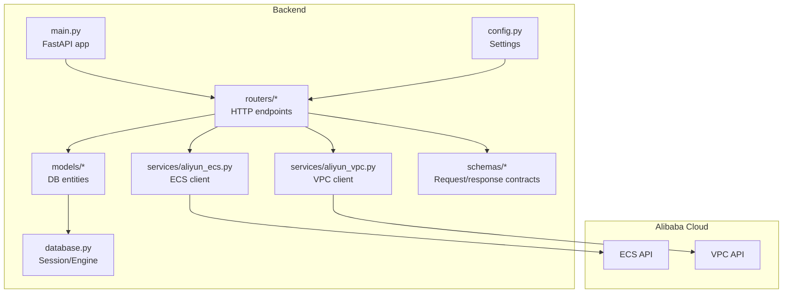
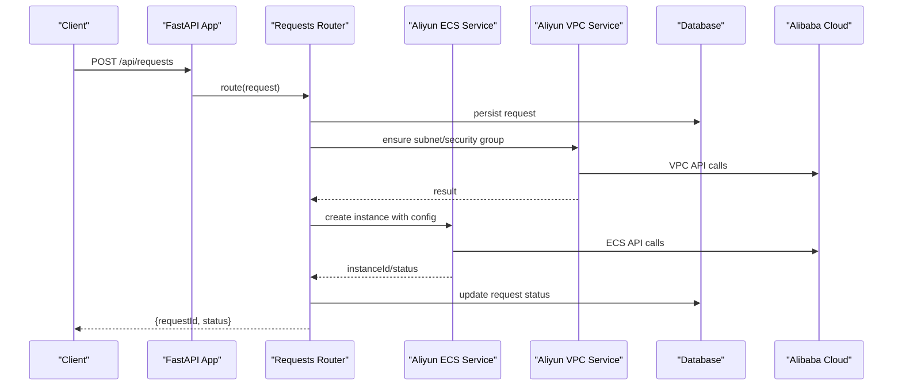
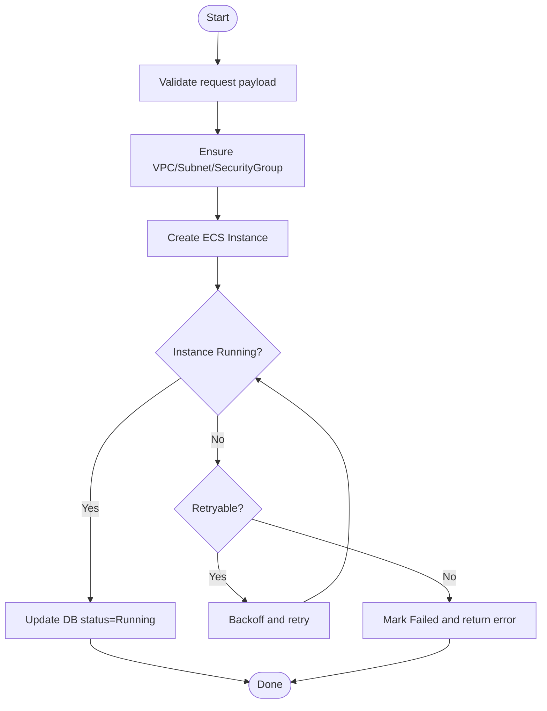
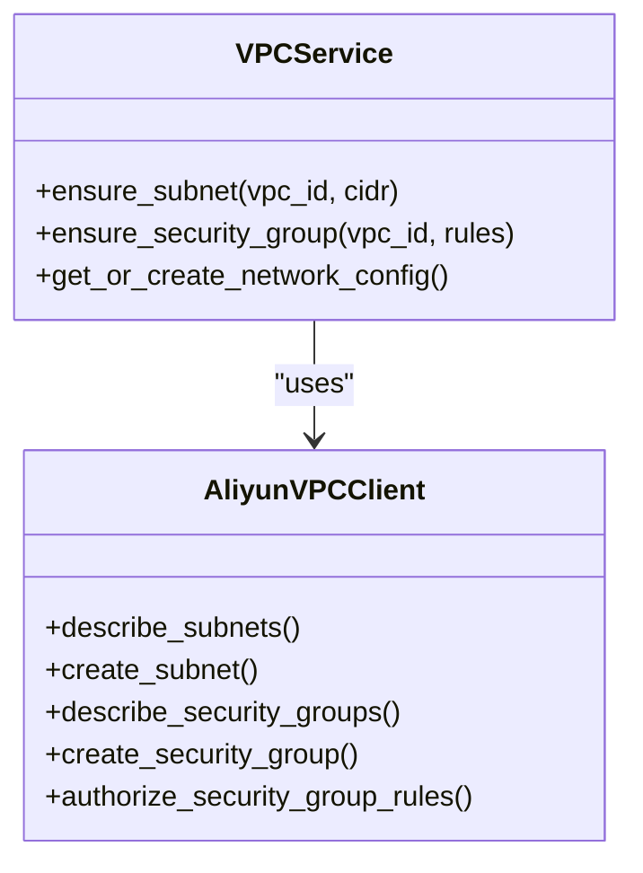
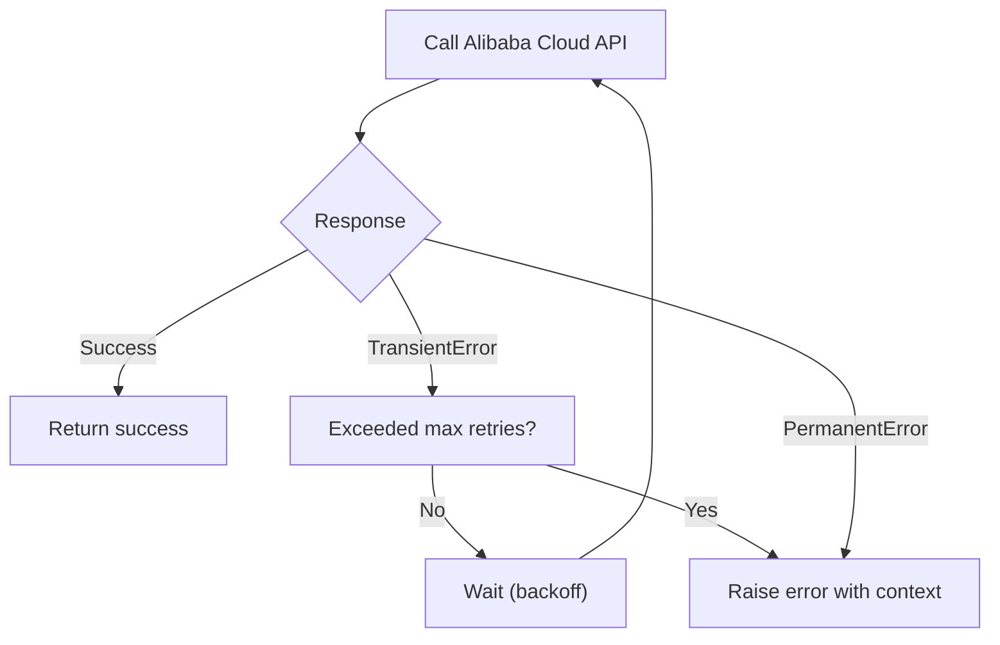
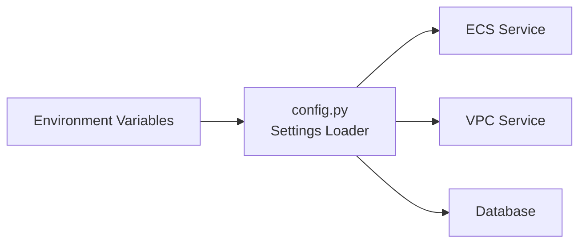
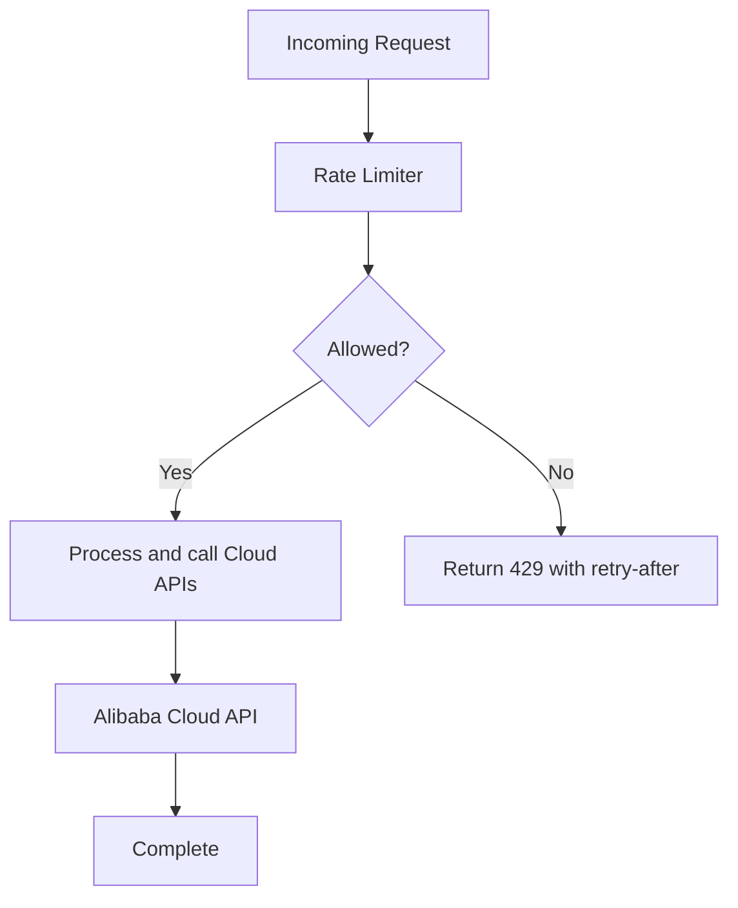
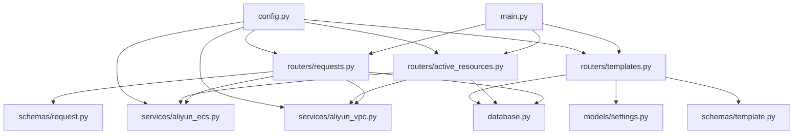

# Cloud Integration

<cite>
**Referenced Files in This Document**
- [backend/app/services/aliyun_ecs.py](file://backend/app/services/aliyun_ecs.py)
- [backend/app/services/aliyun_vpc.py](file://backend/app/services/aliyun_vpc.py)
- [backend/app/models/settings.py](file://backend/app/models/settings.py)
- [backend/app/routers/requests.py](file://backend/app/routers/requests.py)
- [backend/app/routers/active_resources.py](file://backend/app/routers/active_resources.py)
- [backend/app/routers/templates.py](file://backend/app/routers/templates.py)
- [backend/app/schemas/request.py](file://backend/app/schemas/request.py)
- [backend/app/schemas/template.py](file://backend/app/schemas/template.py)
- [backend/app/config.py](file://backend/app/config.py)
- [backend/app/database.py](file://backend/app/database.py)
- [backend/app/main.py](file://backend/app/main.py)
- [backend/alembic/versions/0001_initial_schema.py](file://backend/alembic/versions/0001_initial_schema.py)
- [backend/requirements.txt](file://backend/requirements.txt)
- [docker-compose.yml](file://docker-compose.yml)
- [README.md](file://README.md)
</cite>

## Table of Contents
1. [Introduction](#introduction)
2. [Project Structure](#project-structure)
3. [Core Components](#core-components)
4. [Architecture Overview](#architecture-overview)
5. [Detailed Component Analysis](#detailed-component-analysis)
6. [Dependency Analysis](#dependency-analysis)
7. [Performance Considerations](#performance-considerations)
8. [Troubleshooting Guide](#troubleshooting-guide)
9. [Conclusion](#conclusion)
10. [Appendices](#appendices)

## Introduction
This document explains the Alibaba Cloud integration services implemented in the project, focusing on ECS instance provisioning and VPC networking operations. It covers the end-to-end workflow from request intake to cloud resource lifecycle management, including error handling, retry strategies, asynchronous patterns, credential management, API rate limiting, cost optimization, scaling considerations, and production best practices. The goal is to provide both technical depth and practical guidance for operating this system reliably in production environments.

## Project Structure
The backend implements a FastAPI application with modular services for Alibaba Cloud integrations (ECS and VPC), database-backed models and schemas, and REST endpoints that orchestrate workflows. Key areas:
- Services layer: Aliyun ECS and VPC clients encapsulate SDK calls, retries, and state transitions.
- Routers: HTTP endpoints accept requests, validate inputs, and delegate to services.
- Models/Schemas: Data contracts and persistence structures.
- Configuration: Environment-driven settings for credentials and feature flags.
- Database: Migration-managed schema for requests, templates, audit logs, and sessions.

**Diagram sources**
- [backend/app/main.py](file://backend/app/main.py)
- [backend/app/routers/requests.py](file://backend/app/routers/requests.py)
- [backend/app/routers/active_resources.py](file://backend/app/routers/active_resources.py)
- [backend/app/routers/templates.py](file://backend/app/routers/templates.py)
- [backend/app/services/aliyun_ecs.py](file://backend/app/services/aliyun_ecs.py)
- [backend/app/services/aliyun_vpc.py](file://backend/app/services/aliyun_vpc.py)
- [backend/app/models/settings.py](file://backend/app/models/settings.py)
- [backend/app/schemas/request.py](file://backend/app/schemas/request.py)
- [backend/app/schemas/template.py](file://backend/app/schemas/template.py)
- [backend/app/config.py](file://backend/app/config.py)
- [backend/app/database.py](file://backend/app/database.py)

**Section sources**
- [backend/app/main.py](file://backend/app/main.py)
- [backend/app/config.py](file://backend/app/config.py)
- [backend/app/database.py](file://backend/app/database.py)
- [backend/alembic/versions/0001_initial_schema.py](file://backend/alembic/versions/0001_initial_schema.py)

## Core Components
- ECS Service: Encapsulates ECS instance creation, configuration, status polling, and termination flows. Implements retry/backoff and idempotency checks where applicable.
- VPC Service: Manages VPC/subnet selection, security group rules, and network bindings for instances.
- Request Router: Accepts provisioning requests, validates against schemas, persists requests, and coordinates ECS/VPC service calls.
- Active Resources Router: Exposes endpoints to list and manage running resources, enabling lifecycle control.
- Templates Router: Provides template-based provisioning definitions to standardize configurations.
- Settings Model: Stores environment-specific settings such as region, instance types, and quotas.
- Schemas: Pydantic models enforcing input/output validation for APIs.
- Config: Centralized settings loader for credentials and runtime options.

**Section sources**
- [backend/app/services/aliyun_ecs.py](file://backend/app/services/aliyun_ecs.py)
- [backend/app/services/aliyun_vpc.py](file://backend/app/services/aliyun_vpc.py)
- [backend/app/routers/requests.py](file://backend/app/routers/requests.py)
- [backend/app/routers/active_resources.py](file://backend/app/routers/active_resources.py)
- [backend/app/routers/templates.py](file://backend/app/routers/templates.py)
- [backend/app/models/settings.py](file://backend/app/models/settings.py)
- [backend/app/schemas/request.py](file://backend/app/schemas/request.py)
- [backend/app/schemas/template.py](file://backend/app/schemas/template.py)
- [backend/app/config.py](file://backend/app/config.py)

## Architecture Overview
The system exposes REST endpoints that validate requests, persist them, and invoke Alibaba Cloud APIs via dedicated services. ECS and VPC services handle SDK interactions, retries, and state synchronization. The database tracks requests, templates, and audit trails.

**Diagram sources**
- [backend/app/routers/requests.py](file://backend/app/routers/requests.py)
- [backend/app/services/aliyun_ecs.py](file://backend/app/services/aliyun_ecs.py)
- [backend/app/services/aliyun_vpc.py](file://backend/app/services/aliyun_vpc.py)
- [backend/app/database.py](file://backend/app/database.py)

## Detailed Component Analysis

### ECS Instance Provisioning Workflow
End-to-end flow:
- Receive a provisioning request and validate it against the request schema.
- Ensure required VPC resources exist (subnet, security groups).
- Create an ECS instance using the ECS service with provided or templated configuration.
- Poll instance status until Running or failure.
- Persist final state and return results.

**Diagram sources**
- [backend/app/routers/requests.py](file://backend/app/routers/requests.py)
- [backend/app/services/aliyun_ecs.py](file://backend/app/services/aliyun_ecs.py)
- [backend/app/services/aliyun_vpc.py](file://backend/app/services/aliyun_vpc.py)

Key responsibilities:
- Validation and persistence: handled by routers and schemas.
- Networking prerequisites: handled by VPC service.
- Instance lifecycle: handled by ECS service with retries and status polling.

**Section sources**
- [backend/app/routers/requests.py](file://backend/app/routers/requests.py)
- [backend/app/services/aliyun_ecs.py](file://backend/app/services/aliyun_ecs.py)
- [backend/app/services/aliyun_vpc.py](file://backend/app/services/aliyun_vpc.py)
- [backend/app/schemas/request.py](file://backend/app/schemas/request.py)

### VPC Network Operations
Responsibilities:
- Subnet management: select/create subnets within a VPC.
- Security groups: ensure required inbound/outbound rules exist.
- Networking configuration: bind instances to appropriate subnets and security groups.

**Diagram sources**
- [backend/app/services/aliyun_vpc.py](file://backend/app/services/aliyun_vpc.py)

Operational notes:
- Idempotent creation: prefer describe-before-create to avoid duplicates.
- Rule minimization: only open required ports to reduce attack surface.
- Region awareness: ensure all resources are created in the same region.

**Section sources**
- [backend/app/services/aliyun_vpc.py](file://backend/app/services/aliyun_vpc.py)

### Error Handling, Retry Logic, and Asynchronous Patterns
Patterns observed across services:
- Retry with exponential backoff for transient errors (e.g., throttling, temporary failures).
- Idempotency keys or pre-checks to prevent duplicate creations.
- Status polling loops with bounded retries for long-running operations.
- Clear separation between user-facing errors and internal diagnostics.

**Diagram sources**
- [backend/app/services/aliyun_ecs.py](file://backend/app/services/aliyun_ecs.py)
- [backend/app/services/aliyun_vpc.py](file://backend/app/services/aliyun_vpc.py)

Best practices:
- Classify errors into transient vs permanent.
- Use jittered backoff to avoid thundering herds.
- Record detailed context for debugging (request IDs, timestamps).

**Section sources**
- [backend/app/services/aliyun_ecs.py](file://backend/app/services/aliyun_ecs.py)
- [backend/app/services/aliyun_vpc.py](file://backend/app/services/aliyun_vpc.py)

### Credential Management and Configuration
- Credentials and settings are loaded via centralized configuration.
- Secrets should be injected at runtime (environment variables or secret managers).
- Avoid hardcoding secrets; use typed settings objects.

**Diagram sources**
- [backend/app/config.py](file://backend/app/config.py)
- [backend/app/services/aliyun_ecs.py](file://backend/app/services/aliyun_ecs.py)
- [backend/app/services/aliyun_vpc.py](file://backend/app/services/aliyun_vpc.py)
- [backend/app/database.py](file://backend/app/database.py)

**Section sources**
- [backend/app/config.py](file://backend/app/config.py)
- [backend/app/models/settings.py](file://backend/app/models/settings.py)

### API Rate Limiting and Quotas
- Implement per-client or global rate limiting at the API layer.
- Respect Alibaba Cloud API quotas and implement adaptive backoff.
- Cache read-only metadata when safe to reduce API calls.

**Diagram sources**
- [backend/app/routers/requests.py](file://backend/app/routers/requests.py)
- [backend/app/services/aliyun_ecs.py](file://backend/app/services/aliyun_ecs.py)
- [backend/app/services/aliyun_vpc.py](file://backend/app/services/aliyun_vpc.py)

**Section sources**
- [backend/app/routers/requests.py](file://backend/app/routers/requests.py)
- [backend/app/services/aliyun_ecs.py](file://backend/app/services/aliyun_ecs.py)
- [backend/app/services/aliyun_vpc.py](file://backend/app/services/aliyun_vpc.py)

### Cost Optimization Considerations
- Right-size instance types based on workload profiles.
- Prefer spot/preemptible instances for fault-tolerant workloads.
- Reuse shared VPC/network resources across tenants/projects.
- Enforce tagging and quotas to track and cap costs.
- Automate cleanup of orphaned resources.

[No sources needed since this section provides general guidance]

### Scaling Considerations and Production Best Practices
- Horizontal scaling of the API service behind a load balancer.
- Connection pooling for database and SDK clients.
- Circuit breakers around external API calls.
- Observability: structured logging, metrics, and distributed tracing.
- Blue/green or rolling deployments to minimize downtime.

[No sources needed since this section provides general guidance]

## Dependency Analysis
High-level dependencies among modules:

**Diagram sources**
- [backend/app/main.py](file://backend/app/main.py)
- [backend/app/routers/requests.py](file://backend/app/routers/requests.py)
- [backend/app/routers/active_resources.py](file://backend/app/routers/active_resources.py)
- [backend/app/routers/templates.py](file://backend/app/routers/templates.py)
- [backend/app/services/aliyun_ecs.py](file://backend/app/services/aliyun_ecs.py)
- [backend/app/services/aliyun_vpc.py](file://backend/app/services/aliyun_vpc.py)
- [backend/app/models/settings.py](file://backend/app/models/settings.py)
- [backend/app/schemas/request.py](file://backend/app/schemas/request.py)
- [backend/app/schemas/template.py](file://backend/app/schemas/template.py)
- [backend/app/config.py](file://backend/app/config.py)
- [backend/app/database.py](file://backend/app/database.py)

**Section sources**
- [backend/app/main.py](file://backend/app/main.py)
- [backend/app/routers/requests.py](file://backend/app/routers/requests.py)
- [backend/app/routers/active_resources.py](file://backend/app/routers/active_resources.py)
- [backend/app/routers/templates.py](file://backend/app/routers/templates.py)
- [backend/app/services/aliyun_ecs.py](file://backend/app/services/aliyun_ecs.py)
- [backend/app/services/aliyun_vpc.py](file://backend/app/services/aliyun_vpc.py)
- [backend/app/models/settings.py](file://backend/app/models/settings.py)
- [backend/app/schemas/request.py](file://backend/app/schemas/request.py)
- [backend/app/schemas/template.py](file://backend/app/schemas/template.py)
- [backend/app/config.py](file://backend/app/config.py)
- [backend/app/database.py](file://backend/app/database.py)

## Performance Considerations
- Minimize synchronous blocking calls; consider background tasks for long-running operations.
- Batch API calls where supported by Alibaba Cloud SDKs.
- Use connection pooling for database and HTTP clients.
- Cache stable metadata (e.g., image lists, instance type catalogs) with short TTLs.
- Tune concurrency limits to respect API quotas and avoid overloading.

[No sources needed since this section provides general guidance]

## Troubleshooting Guide
Common issues and resolutions:
- Authentication failures: verify credentials and permissions; ensure correct region and endpoint configuration.
- Resource conflicts: check for existing VPC/subnet/security group names or CIDR overlaps; implement idempotent creation.
- API throttling: observe retry-after headers; implement adaptive backoff and request pacing.
- Orphaned resources: scan active resources and reconcile with database records; automate cleanup jobs.
- Network misconfiguration: validate security group rules and routing; confirm instance is bound to the intended subnet.

Debugging techniques:
- Enable structured logging with correlation IDs for each request.
- Capture SDK request/response envelopes for failed calls.
- Use health checks and readiness probes to detect degraded states.
- Maintain an audit log of provisioning actions and outcomes.

**Section sources**
- [backend/app/routers/active_resources.py](file://backend/app/routers/active_resources.py)
- [backend/app/services/aliyun_ecs.py](file://backend/app/services/aliyun_ecs.py)
- [backend/app/services/aliyun_vpc.py](file://backend/app/services/aliyun_vpc.py)

## Conclusion
The Alibaba Cloud integration layer provides a robust foundation for ECS provisioning and VPC networking through well-structured services, clear API boundaries, and resilient error handling. By applying the recommended patterns for retries, rate limiting, observability, and cost controls, teams can operate this system safely at scale in production environments.

[No sources needed since this section summarizes without analyzing specific files]

## Appendices

### Configuration and Deployment
- Environment variables: inject credentials and settings at runtime.
- Container orchestration: use docker-compose or Kubernetes for deployment.
- Database migrations: apply Alembic migrations before starting the service.

**Section sources**
- [docker-compose.yml](file://docker-compose.yml)
- [backend/alembic/versions/0001_initial_schema.py](file://backend/alembic/versions/0001_initial_schema.py)
- [backend/requirements.txt](file://backend/requirements.txt)
- [README.md](file://README.md)