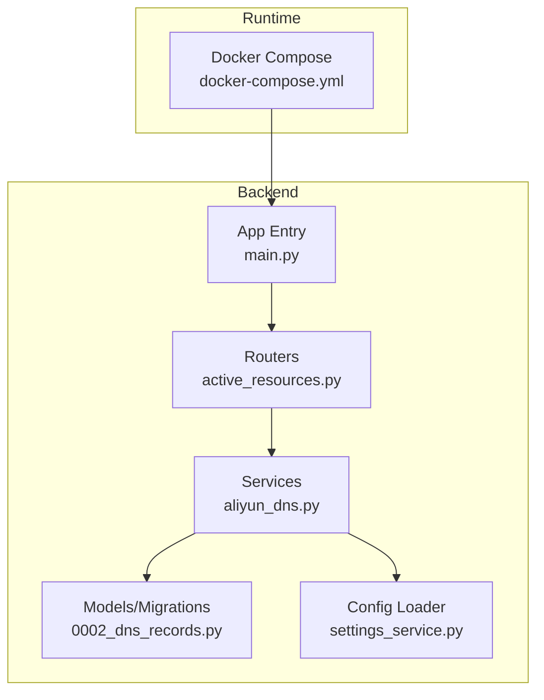
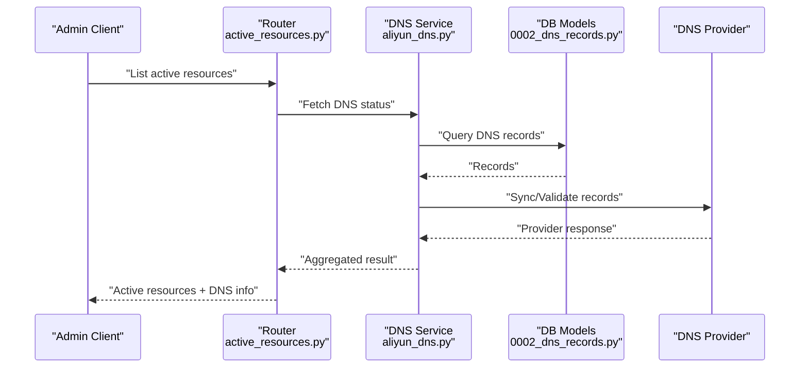
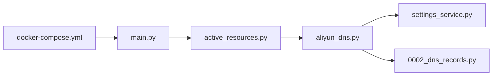

# DNS Service Integration

<cite>
**Referenced Files in This Document**
- [aliyun_dns.py](file://backend/app/services/aliyun_dns.py)
- [0002_dns_records.py](file://backend/alembic/versions/0002_dns_records.py)
- [active_resources.py](file://backend/app/routers/active_resources.py)
- [settings_service.py](file://backend/app/services/settings_service.py)
- [main.py](file://backend/app/main.py)
- [docker-compose.yml](file://docker-compose.yml)
</cite>

## Table of Contents
1. [Introduction](#introduction)
2. [Project Structure](#project-structure)
3. [Core Components](#core-components)
4. [Architecture Overview](#architecture-overview)
5. [Detailed Component Analysis](#detailed-component-analysis)
6. [Dependency Analysis](#dependency-analysis)
7. [Performance Considerations](#performance-considerations)
8. [Troubleshooting Guide](#troubleshooting-guide)
9. [Conclusion](#conclusion)

## Introduction
This document explains how the system integrates with a DNS service to manage DNS records as part of ECS resource provisioning and lifecycle management. It covers the data model, API surface, service implementation, configuration, and operational considerations. The goal is to help developers and operators understand how DNS records are created, updated, and removed in coordination with cloud resources.

## Project Structure
The DNS integration spans database migrations, backend services, API routers, and runtime configuration:
- Data persistence for DNS records via Alembic migration
- A dedicated DNS service module that encapsulates provider-specific logic
- API endpoints that expose DNS-related operations
- Configuration loading for DNS credentials and settings
- Container orchestration wiring environment variables into the application

**Diagram sources**
- [active_resources.py](file://backend/app/routers/active_resources.py)
- [aliyun_dns.py](file://backend/app/services/aliyun_dns.py)
- [0002_dns_records.py](file://backend/alembic/versions/0002_dns_records.py)
- [settings_service.py](file://backend/app/services/settings_service.py)
- [main.py](file://backend/app/main.py)
- [docker-compose.yml](file://docker-compose.yml)

**Section sources**
- [0002_dns_records.py](file://backend/alembic/versions/0002_dns_records.py)
- [aliyun_dns.py](file://backend/app/services/aliyun_dns.py)
- [active_resources.py](file://backend/app/routers/active_resources.py)
- [settings_service.py](file://backend/app/services/settings_service.py)
- [main.py](file://backend/app/main.py)
- [docker-compose.yml](file://docker-compose.yml)

## Core Components
- DNS Records Model and Migration: Defines the schema used to persist DNS record state alongside other resources.
- DNS Service Implementation: Encapsulates provider calls (e.g., Aliyun DNS), including create/update/delete operations and error handling.
- API Router: Exposes endpoints to list active resources and coordinate DNS changes during resource lifecycle events.
- Settings Service: Loads DNS-related configuration from environment or centralized settings store.
- Application Bootstrap: Wires routers and services together and exposes the HTTP interface.

Key responsibilities:
- Maintain authoritative state of DNS records in the database
- Translate business actions into provider-specific DNS operations
- Surface relevant DNS information through APIs for admin and user workflows
- Ensure configuration is securely loaded at runtime

**Section sources**
- [0002_dns_records.py](file://backend/alembic/versions/0002_dns_records.py)
- [aliyun_dns.py](file://backend/app/services/aliyun_dns.py)
- [active_resources.py](file://backend/app/routers/active_resources.py)
- [settings_service.py](file://backend/app/services/settings_service.py)
- [main.py](file://backend/app/main.py)

## Architecture Overview
The DNS integration follows a layered architecture:
- API Layer: Routers receive requests and delegate to services.
- Service Layer: Business logic and provider interactions live in the DNS service.
- Persistence Layer: Database models and migrations track DNS records.
- Configuration Layer: Settings service loads credentials and options.
- Orchestration: Docker Compose injects environment variables into the backend container.

**Diagram sources**
- [active_resources.py](file://backend/app/routers/active_resources.py)
- [aliyun_dns.py](file://backend/app/services/aliyun_dns.py)
- [0002_dns_records.py](file://backend/alembic/versions/0002_dns_records.py)

## Detailed Component Analysis

### DNS Records Model and Migration
- Purpose: Persist DNS record metadata such as domain, type, value, TTL, and association to resources.
- Responsibilities:
  - Define table structure and constraints
  - Provide relationships to other entities (e.g., ECS instances)
  - Support queries needed by the DNS service and API layer

Operational notes:
- Apply migrations before running the service
- Validate that required columns exist before enabling DNS features

**Section sources**
- [0002_dns_records.py](file://backend/alembic/versions/0002_dns_records.py)

### DNS Service Implementation
- Purpose: Implement provider-specific DNS operations and reconcile local state with the remote DNS provider.
- Responsibilities:
  - Create, update, and delete DNS records
  - Handle provider errors and retries where appropriate
  - Map internal record identifiers to provider record IDs
  - Expose helper methods consumed by routers and background tasks

Error handling:
- Normalize provider exceptions into application-level errors
- Return clear failure reasons for API consumers

**Section sources**
- [aliyun_dns.py](file://backend/app/services/aliyun_dns.py)

### API Router for Active Resources
- Purpose: Expose endpoints that include DNS status and allow triggering DNS updates when resources change.
- Responsibilities:
  - Aggregate resource and DNS information
  - Coordinate with the DNS service to ensure consistency
  - Return structured responses for frontend consumption

Integration points:
- Calls DNS service methods to fetch or update records
- Uses settings service to access provider configuration

**Section sources**
- [active_resources.py](file://backend/app/routers/active_resources.py)

### Settings Service
- Purpose: Load DNS-related configuration such as provider credentials, region, and feature flags.
- Responsibilities:
  - Read environment variables or centralized settings
  - Provide typed accessors for DNS configuration
  - Fail fast on missing critical configuration

Security note:
- Avoid logging sensitive values
- Prefer secret managers in production

**Section sources**
- [settings_service.py](file://backend/app/services/settings_service.py)

### Application Bootstrap
- Purpose: Initialize the web framework, register routers, and start the server.
- Responsibilities:
  - Import and mount routers
  - Configure middleware and lifespan events if needed
  - Ensure services are available to routers

**Section sources**
- [main.py](file://backend/app/main.py)

### Runtime Configuration via Docker Compose
- Purpose: Inject DNS provider credentials and related settings into the backend container.
- Responsibilities:
  - Map environment variables to container processes
  - Centralize configuration for development and production

Best practices:
- Use secrets management for sensitive values
- Separate dev and prod compose files

**Section sources**
- [docker-compose.yml](file://docker-compose.yml)

## Dependency Analysis
The following diagram shows key dependencies among components involved in DNS integration.

**Diagram sources**
- [main.py](file://backend/app/main.py)
- [active_resources.py](file://backend/app/routers/active_resources.py)
- [aliyun_dns.py](file://backend/app/services/aliyun_dns.py)
- [settings_service.py](file://backend/app/services/settings_service.py)
- [0002_dns_records.py](file://backend/alembic/versions/0002_dns_records.py)
- [docker-compose.yml](file://docker-compose.yml)

**Section sources**
- [main.py](file://backend/app/main.py)
- [active_resources.py](file://backend/app/routers/active_resources.py)
- [aliyun_dns.py](file://backend/app/services/aliyun_dns.py)
- [settings_service.py](file://backend/app/services/settings_service.py)
- [0002_dns_records.py](file://backend/alembic/versions/0002_dns_records.py)
- [docker-compose.yml](file://docker-compose.yml)

## Performance Considerations
- Batch operations: When updating multiple DNS records, prefer batch APIs if supported by the provider to reduce round trips.
- Caching: Cache provider responses for read-heavy endpoints; implement invalidation on write paths.
- Idempotency: Ensure DNS mutations are idempotent to tolerate retries safely.
- Concurrency: Avoid concurrent writes to the same record; use locks or queueing where necessary.
- Timeouts and retries: Configure sensible timeouts and exponential backoff for provider calls.

[No sources needed since this section provides general guidance]

## Troubleshooting Guide
Common issues and resolutions:
- Missing DNS configuration: Verify environment variables are present and correctly mapped in the container runtime.
- Authentication failures: Check provider credentials and permissions; ensure network egress to the DNS provider is allowed.
- Record not found: Confirm the migration has been applied and the record exists in the database before calling provider APIs.
- Inconsistent state: Reconcile local records with provider state using the DNS service’s sync/validation helpers.
- Rate limits: Implement retry with backoff and monitor provider quotas.

**Section sources**
- [aliyun_dns.py](file://backend/app/services/aliyun_dns.py)
- [settings_service.py](file://backend/app/services/settings_service.py)
- [0002_dns_records.py](file://backend/alembic/versions/0002_dns_records.py)

## Conclusion
The DNS integration is implemented as a focused service layer backed by a persistent model and exposed through well-scoped API endpoints. Proper configuration, robust error handling, and idempotent operations are essential for reliable DNS management across resource lifecycles. Follow the troubleshooting guidance and performance recommendations to maintain a stable and efficient integration.