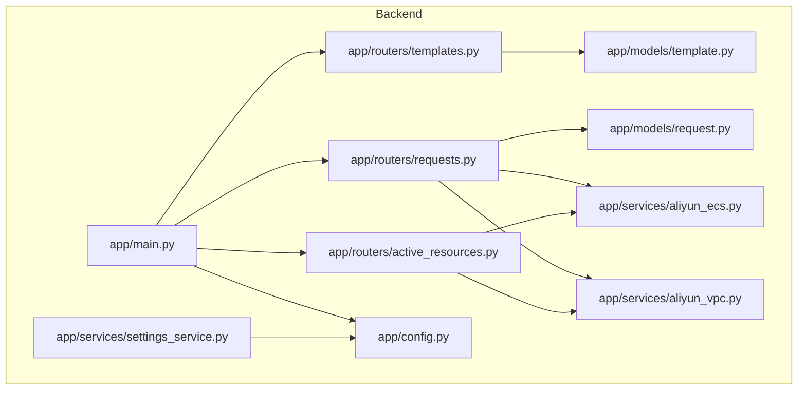
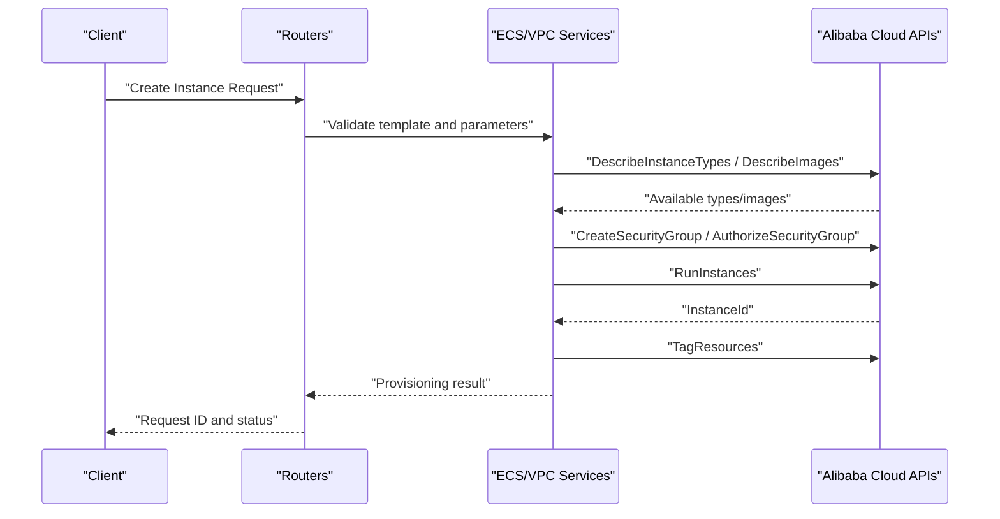
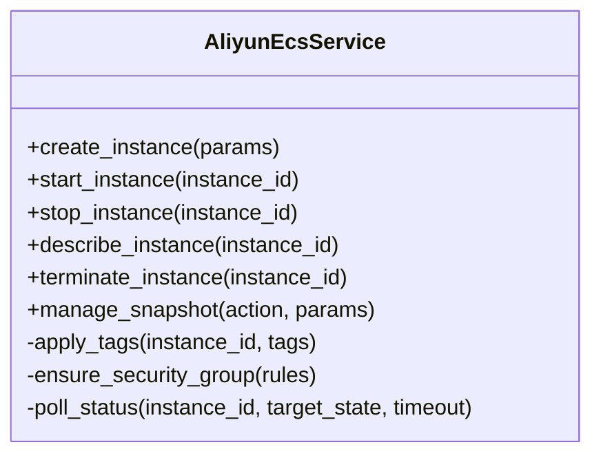
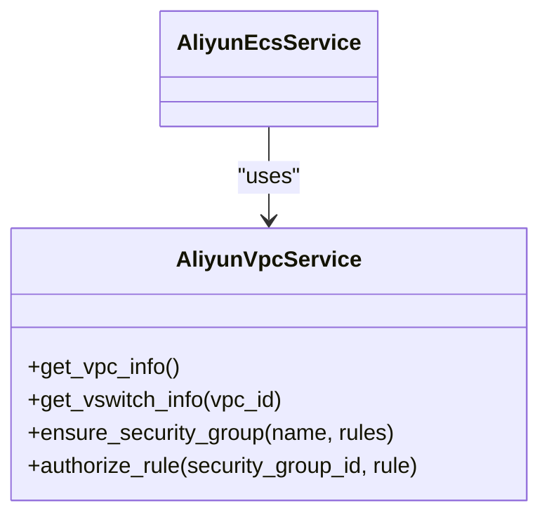
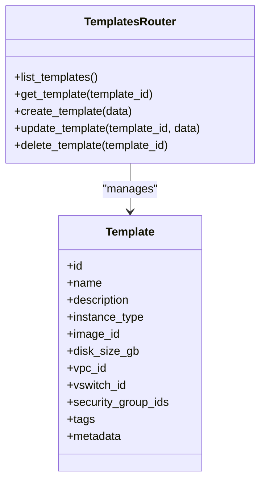
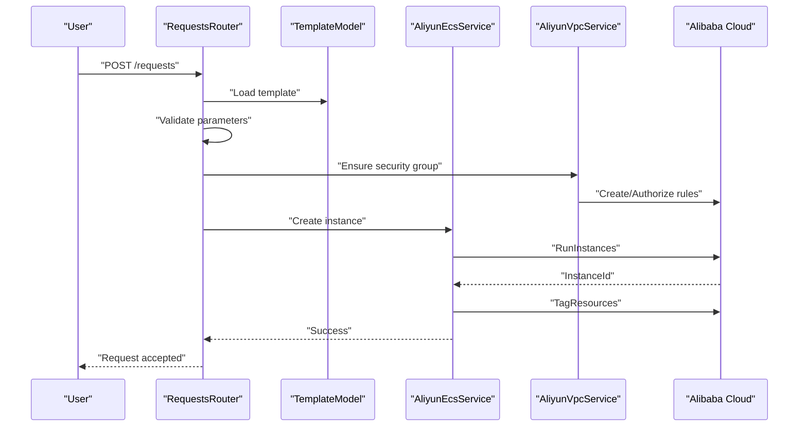
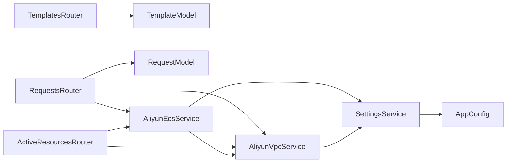

# ECS Service Integration

<cite>
**Referenced Files in This Document**
- [aliyun_ecs.py](file://backend/app/services/aliyun_ecs.py)
- [aliyun_vpc.py](file://backend/app/services/aliyun_vpc.py)
- [template.py](file://backend/app/models/template.py)
- [templates.py](file://backend/app/routers/templates.py)
- [request.py](file://backend/app/models/request.py)
- [requests.py](file://backend/app/routers/requests.py)
- [active_resources.py](file://backend/app/routers/active_resources.py)
- [settings_service.py](file://backend/app/services/settings_service.py)
- [config.py](file://backend/app/config.py)
- [main.py](file://backend/app/main.py)
- [README.md](file://README.md)
</cite>

## Table of Contents
1. [Introduction](#introduction)
2. [Project Structure](#project-structure)
3. [Core Components](#core-components)
4. [Architecture Overview](#architecture-overview)
5. [Detailed Component Analysis](#detailed-component-analysis)
6. [Dependency Analysis](#dependency-analysis)
7. [Performance Considerations](#performance-considerations)
8. [Troubleshooting Guide](#troubleshooting-guide)
9. [Conclusion](#conclusion)
10. [Appendices](#appendices)

## Introduction
This document explains the Alibaba Cloud ECS service integration within the project, focusing on end-to-end ECS instance lifecycle management: creation, configuration, monitoring, and termination. It also covers template-based provisioning that maps application requirements to cloud resources, error handling strategies, retry mechanisms, timeouts, security group and key pair management, resource tagging, performance optimization, and cost control measures. The goal is to provide both a high-level understanding and actionable guidance for developers and operators managing ECS resources through this system.

## Project Structure
The backend implements the ECS integration via dedicated services and API routers, with models representing templates and requests. Key areas include:
- Services layer for Alibaba Cloud interactions (ECS and VPC)
- Routers exposing REST endpoints for templates, requests, active resources, and settings
- Models defining data structures for templates and requests
- Configuration and application entrypoint

**Diagram sources**
- [main.py](file://backend/app/main.py)
- [config.py](file://backend/app/config.py)
- [aliyun_ecs.py](file://backend/app/services/aliyun_ecs.py)
- [aliyun_vpc.py](file://backend/app/services/aliyun_vpc.py)
- [template.py](file://backend/app/models/template.py)
- [request.py](file://backend/app/models/request.py)
- [templates.py](file://backend/app/routers/templates.py)
- [requests.py](file://backend/app/routers/requests.py)
- [active_resources.py](file://backend/app/routers/active_resources.py)
- [settings_service.py](file://backend/app/services/settings_service.py)

**Section sources**
- [main.py](file://backend/app/main.py)
- [config.py](file://backend/app/config.py)
- [aliyun_ecs.py](file://backend/app/services/aliyun_ecs.py)
- [aliyun_vpc.py](file://backend/app/services/aliyun_vpc.py)
- [template.py](file://backend/app/models/template.py)
- [request.py](file://backend/app/models/request.py)
- [templates.py](file://backend/app/routers/templates.py)
- [requests.py](file://backend/app/routers/requests.py)
- [active_resources.py](file://backend/app/routers/active_resources.py)
- [settings_service.py](file://backend/app/services/settings_service.py)

## Core Components
- ECS Service: Encapsulates Alibaba Cloud ECS operations such as creating instances, starting/stopping, describing status, and terminating. It integrates with VPC networking components and applies tags and security groups during provisioning.
- VPC Service: Provides networking primitives like VPC, vSwitch, and security group references used by ECS provisioning.
- Template Model: Defines reusable blueprints mapping application requirements (instance type, disk size, image, network, tags) to concrete cloud resources.
- Request Model: Represents user or workflow-driven provisioning requests, including approval state and lifecycle tracking.
- Templates Router: Exposes CRUD endpoints for templates, enabling administrators to define and manage provisioning blueprints.
- Requests Router: Orchestrates request submission, validation against templates, and execution of ECS lifecycle operations.
- Active Resources Router: Provides read-only access to currently running ECS instances and their metadata.
- Settings Service: Centralizes configuration loading (e.g., region, credentials, timeouts), consumed by services and routers.
- Application Entrypoint: Wires routers and middleware, initializes configuration, and starts the server.

**Section sources**
- [aliyun_ecs.py](file://backend/app/services/aliyun_ecs.py)
- [aliyun_vpc.py](file://backend/app/services/aliyun_vpc.py)
- [template.py](file://backend/app/models/template.py)
- [request.py](file://backend/app/models/request.py)
- [templates.py](file://backend/app/routers/templates.py)
- [requests.py](file://backend/app/routers/requests.py)
- [active_resources.py](file://backend/app/routers/active_resources.py)
- [settings_service.py](file://backend/app/services/settings_service.py)
- [main.py](file://backend/app/main.py)

## Architecture Overview
The system follows a layered architecture:
- API Layer: FastAPI routers expose endpoints for templates, requests, and active resources.
- Service Layer: Business logic and Alibaba Cloud SDK calls are encapsulated in ECS and VPC services.
- Data Layer: Models represent templates and requests; persistence is managed elsewhere in the app.
- Configuration: Centralized settings drive behavior across services.

**Diagram sources**
- [requests.py](file://backend/app/routers/requests.py)
- [aliyun_ecs.py](file://backend/app/services/aliyun_ecs.py)
- [aliyun_vpc.py](file://backend/app/services/aliyun_vpc.py)

## Detailed Component Analysis

### ECS Service
Responsibilities:
- Provisioning: Create instances using selected image, instance type, and network configuration.
- Lifecycle Management: Start, stop, describe, reboot, terminate instances.
- Tagging: Apply consistent resource tags for ownership, environment, and cost allocation.
- Security Groups: Ensure required rules exist before launching instances.
- Error Handling: Implement retries and timeouts for transient failures.

Key behaviors:
- Retry strategy: Exponential backoff with jitter for throttling and temporary network errors.
- Timeouts: Configurable per-operation timeouts to avoid hanging calls.
- Idempotency: Use request IDs and idempotent flags where supported by Alibaba Cloud APIs.
- State polling: Poll instance status until desired state is reached or timeout occurs.

Common operations:
- Create instance from template
- Start/stop/reboot instance
- Describe instance details and status
- Terminate instance
- Manage snapshots (create/describe/delete)

Error handling patterns:
- Map Alibaba Cloud error codes to domain-specific exceptions
- Surface actionable messages to clients
- Log detailed context for debugging

**Section sources**
- [aliyun_ecs.py](file://backend/app/services/aliyun_ecs.py)

#### Class Diagram

**Diagram sources**
- [aliyun_ecs.py](file://backend/app/services/aliyun_ecs.py)

### VPC Service
Responsibilities:
- Provide VPC and vSwitch identifiers for ECS provisioning
- Manage security groups and rules
- Return network topology information for templates

Integration points:
- Consumed by ECS service during provisioning
- Used by active resources router to enrich instance metadata

**Section sources**
- [aliyun_vpc.py](file://backend/app/services/aliyun_vpc.py)

#### Class Diagram

**Diagram sources**
- [aliyun_ecs.py](file://backend/app/services/aliyun_ecs.py)
- [aliyun_vpc.py](file://backend/app/services/aliyun_vpc.py)

### Template-Based Provisioning
Templates encode application requirements into reusable blueprints:
- Instance type selection based on CPU/memory profiles
- Disk sizes and snapshot policies
- Image selection (OS, preinstalled software)
- Network configuration (VPC, vSwitch, security groups)
- Tags for cost attribution and governance

Template model fields typically include:
- name, description
- instance_type_family or specific instance_type
- image_id
- disk_size_gb
- vpc_id, vswitch_id
- security_group_ids
- tags map
- optional metadata (owner, environment, cost_center)

Template router exposes:
- List templates
- Get template by ID
- Create/update/delete templates

**Section sources**
- [template.py](file://backend/app/models/template.py)
- [templates.py](file://backend/app/routers/templates.py)

#### Class Diagram

**Diagram sources**
- [template.py](file://backend/app/models/template.py)
- [templates.py](file://backend/app/routers/templates.py)

### Request Lifecycle
Requests capture user intent and orchestrate provisioning:
- Submit request referencing a template
- Validate inputs and permissions
- Execute ECS provisioning steps
- Track status and audit trail
- Support approvals if configured

Request model fields typically include:
- requester_id
- template_id
- parameters override
- status (pending, approved, provisioning, running, failed, terminated)
- created_at, updated_at
- external_resource_ids (instance_id, etc.)

Requests router orchestrates:
- Create request
- Approve/reject (if applicable)
- Query status
- Terminate resources

**Section sources**
- [request.py](file://backend/app/models/request.py)
- [requests.py](file://backend/app/routers/requests.py)

#### Sequence Diagram

**Diagram sources**
- [requests.py](file://backend/app/routers/requests.py)
- [template.py](file://backend/app/models/template.py)
- [aliyun_ecs.py](file://backend/app/services/aliyun_ecs.py)
- [aliyun_vpc.py](file://backend/app/services/aliyun_vpc.py)

### Active Resources Monitoring
Active resources router provides visibility into running instances:
- List current instances
- Retrieve instance details (status, IPs, tags)
- Filter by tags or owner

Use cases:
- Operational dashboards
- Cost reporting
- Compliance audits

**Section sources**
- [active_resources.py](file://backend/app/routers/active_resources.py)
- [aliyun_ecs.py](file://backend/app/services/aliyun_ecs.py)

### Configuration and Settings
Settings service centralizes configuration:
- Region and endpoint settings
- Credentials and authentication
- Timeouts and retry policies
- Feature toggles

Configuration is consumed by services and routers to ensure consistent behavior.

**Section sources**
- [settings_service.py](file://backend/app/services/settings_service.py)
- [config.py](file://backend/app/config.py)

## Dependency Analysis
High-level dependencies:
- Routers depend on services for business logic
- ECS service depends on VPC service for networking prerequisites
- Services depend on centralized configuration
- Models are used by routers for input/output validation

**Diagram sources**
- [templates.py](file://backend/app/routers/templates.py)
- [template.py](file://backend/app/models/template.py)
- [requests.py](file://backend/app/routers/requests.py)
- [request.py](file://backend/app/models/request.py)
- [active_resources.py](file://backend/app/routers/active_resources.py)
- [aliyun_ecs.py](file://backend/app/services/aliyun_ecs.py)
- [aliyun_vpc.py](file://backend/app/services/aliyun_vpc.py)
- [settings_service.py](file://backend/app/services/settings_service.py)
- [config.py](file://backend/app/config.py)

**Section sources**
- [templates.py](file://backend/app/routers/templates.py)
- [template.py](file://backend/app/models/template.py)
- [requests.py](file://backend/app/routers/requests.py)
- [request.py](file://backend/app/models/request.py)
- [active_resources.py](file://backend/app/routers/active_resources.py)
- [aliyun_ecs.py](file://backend/app/services/aliyun_ecs.py)
- [aliyun_vpc.py](file://backend/app/services/aliyun_vpc.py)
- [settings_service.py](file://backend/app/services/settings_service.py)
- [config.py](file://backend/app/config.py)

## Performance Considerations
- Batch operations: Prefer batch tagging and bulk queries when available to reduce API round trips.
- Connection reuse: Ensure SDK client reuse to minimize connection overhead.
- Pagination: Use pagination for listing large sets of instances or images.
- Caching: Cache stable metadata (images, instance types) with appropriate TTLs.
- Concurrency: Limit concurrent provisioning requests to respect quotas and avoid throttling.
- Backpressure: Implement rate limiting at the API layer to protect downstream services.

[No sources needed since this section provides general guidance]

## Troubleshooting Guide
Common issues and resolutions:
- Quota exceeded: Check ECS quota limits and request increases; implement retry with exponential backoff.
- Insufficient resources: Switch to alternative instance types or regions; validate availability zones.
- Security group conflicts: Review inbound/outbound rules; ensure required ports are open.
- Authentication failures: Verify credentials and scopes; rotate keys securely.
- Timeout errors: Increase operation timeouts for long-running tasks; monitor Alibaba Cloud service health.

Operational tips:
- Enable detailed logging around ECS and VPC calls.
- Correlate logs with Alibaba Cloud request IDs.
- Use tags to trace resources back to requests and owners.

**Section sources**
- [aliyun_ecs.py](file://backend/app/services/aliyun_ecs.py)
- [aliyun_vpc.py](file://backend/app/services/aliyun_vpc.py)
- [settings_service.py](file://backend/app/services/settings_service.py)

## Conclusion
This ECS integration provides a robust, template-driven approach to provisioning and managing Alibaba Cloud ECS instances. By encapsulating lifecycle operations in services, enforcing consistent tagging and security configurations, and implementing resilient error handling, the system supports scalable and auditable resource management. Operators can leverage active resources monitoring and structured requests to maintain control over costs and performance while ensuring compliance and security.

[No sources needed since this section summarizes without analyzing specific files]

## Appendices

### ECS Instance Types, Specifications, and Pricing Considerations
- Instance families: Choose based on workload characteristics (compute-optimized, memory-optimized, general-purpose).
- vCPU and memory ratios: Align with application needs to avoid overprovisioning.
- Storage options: Select SSD vs. efficient cloud disks based on IOPS and throughput requirements.
- Pricing models: Consider pay-as-you-go vs. subscription; evaluate spot instances for fault-tolerant workloads.
- Regional pricing differences: Account for cost variations across regions and availability zones.
- Right-sizing: Continuously review utilization metrics to adjust instance types and sizes.

[No sources needed since this section provides general guidance]

### Template Mapping Examples
- Development: Smaller instance types, shared storage, minimal security rules, strict tag governance.
- Staging: Balanced instance types, moderate storage, broader but controlled security rules.
- Production: Larger instance types, high-performance storage, strict security groups, comprehensive tagging.

[No sources needed since this section provides general guidance]

### Security Group Integration
- Least privilege: Open only required ports and source ranges.
- Rule management: Centralize rule definitions in templates and enforce via VPC service.
- Change control: Audit and approve security group modifications.

[No sources needed since this section provides general guidance]

### Key Pair Management
- Generate and store SSH keys securely.
- Associate key pairs with instances during provisioning.
- Rotate keys periodically and revoke unused keys.

[No sources needed since this section provides general guidance]

### Resource Tagging Strategies
- Required tags: owner, environment, project, cost_center, expiration_date.
- Naming conventions: Consistent prefixes and suffixes for readability.
- Automation: Enforce tagging at provisioning time; reject untagged resources.

[No sources needed since this section provides general guidance]

### Snapshot Management
- Create snapshots before risky operations.
- Schedule periodic snapshots for critical instances.
- Retention policies: Automate deletion of old snapshots to control costs.

[No sources needed since this section provides general guidance]

### Error Handling, Retries, and Timeouts
- Retry policy: Exponential backoff with jitter for transient errors.
- Timeouts: Configure per-operation timeouts aligned with expected durations.
- Idempotency: Use idempotent flags and deduplicate requests.
- Circuit breaking: Fail fast on persistent failures to prevent cascading issues.

[No sources needed since this section provides general guidance]

### Common Operations Examples
- Start/Stop instances: Use lifecycle endpoints with instance IDs.
- Modify configurations: Resize instances or change disks via update flows.
- Manage snapshots: Create, list, and delete snapshots programmatically.

[No sources needed since this section provides general guidance]

### Cost Control Measures
- Auto-termination: Set expiration dates via tags and automate cleanup.
- Alerts: Monitor usage spikes and budget thresholds.
- Reserved capacity: Evaluate reserved instances for steady-state workloads.
- Tag-based reporting: Attribute costs to teams and projects.

[No sources needed since this section provides general guidance]