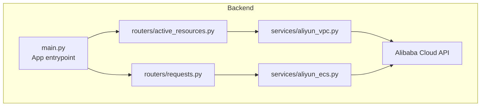
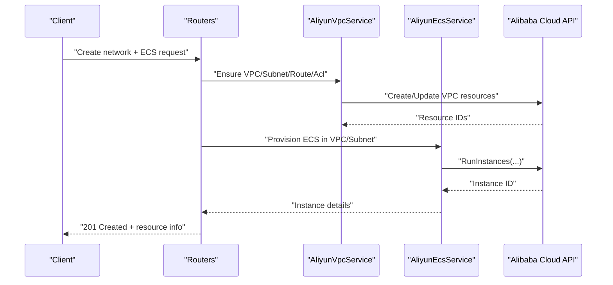
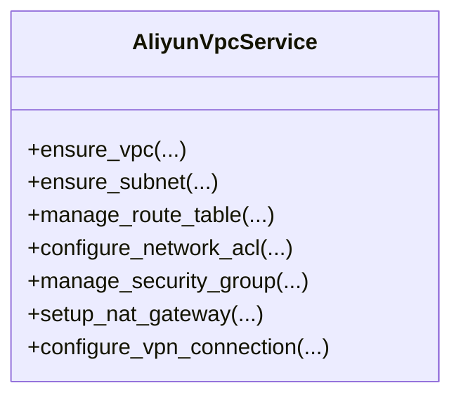
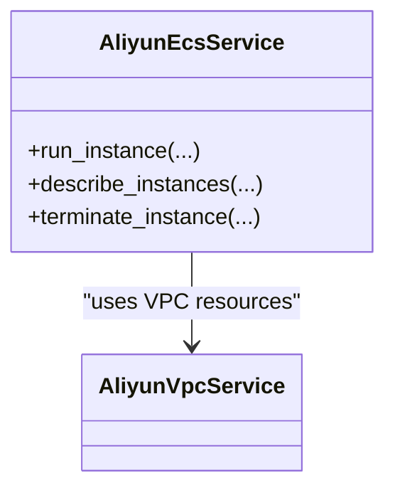
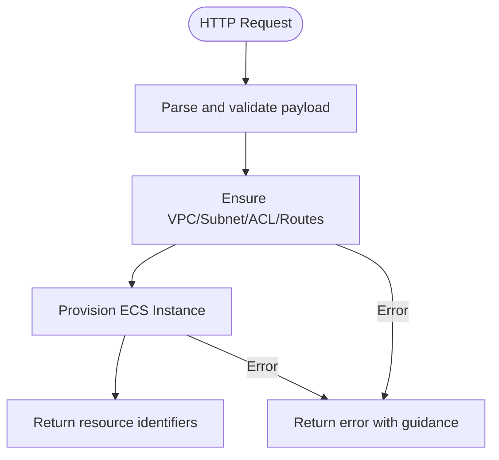
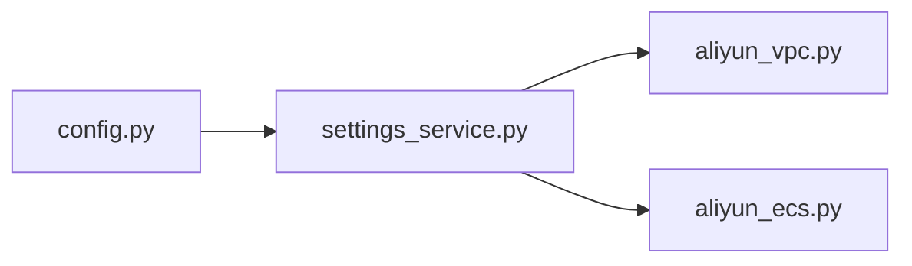
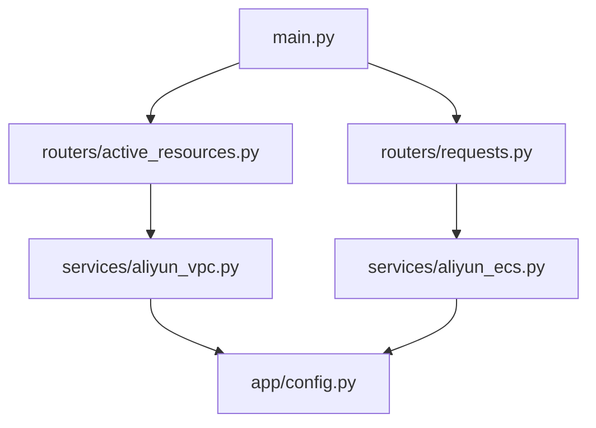

# VPC Network Integration

<cite>
**Referenced Files in This Document**
- [aliyun_vpc.py](file://backend/app/services/aliyun_vpc.py)
- [aliyun_ecs.py](file://backend/app/services/aliyun_ecs.py)
- [main.py](file://backend/app/main.py)
- [config.py](file://backend/app/config.py)
- [settings_service.py](file://backend/app/services/settings_service.py)
- [active_resources.py](file://backend/app/routers/active_resources.py)
- [requests.py](file://backend/app/routers/requests.py)
- [ecs-request-system-prompt.md](file://ecs-request-system-prompt.md)
</cite>

## Table of Contents
1. [Introduction](#introduction)
2. [Project Structure](#project-structure)
3. [Core Components](#core-components)
4. [Architecture Overview](#architecture-overview)
5. [Detailed Component Analysis](#detailed-component-analysis)
6. [Dependency Analysis](#dependency-analysis)
7. [Performance Considerations](#performance-considerations)
8. [Troubleshooting Guide](#troubleshooting-guide)
9. [Conclusion](#conclusion)
10. [Appendices](#appendices)

## Introduction
This document explains how the application integrates with Alibaba Cloud Virtual Private Cloud (VPC) services to provision and manage networking resources for ECS instances. It covers VPC configuration, subnet management, route tables, network ACLs, security groups, NAT gateway usage, VPN connectivity patterns, performance optimization, monitoring, troubleshooting, and cost optimization strategies. The content is grounded in the repository’s implementation and service interfaces.

## Project Structure
The backend exposes REST endpoints that orchestrate VPC and ECS operations via Alibaba Cloud SDK calls. Networking-related logic resides primarily in dedicated service modules and routers.

**Diagram sources**
- [main.py](file://backend/app/main.py)
- [active_resources.py](file://backend/app/routers/active_resources.py)
- [requests.py](file://backend/app/routers/requests.py)
- [aliyun_vpc.py](file://backend/app/services/aliyun_vpc.py)
- [aliyun_ecs.py](file://backend/app/services/aliyun_ecs.py)

**Section sources**
- [main.py](file://backend/app/main.py)
- [active_resources.py](file://backend/app/routers/active_resources.py)
- [requests.py](file://backend/app/routers/requests.py)
- [aliyun_vpc.py](file://backend/app/services/aliyun_vpc.py)
- [aliyun_ecs.py](file://backend/app/services/aliyun_ecs.py)

## Core Components
- VPC Service: Encapsulates VPC, vSwitch (subnet), route table, and related networking operations.
- ECS Service: Orchestrates ECS instance lifecycle and attaches them to VPC/subnet/security group resources.
- Routers: Expose HTTP endpoints for resource discovery and request handling that call into the services.
- Configuration: Centralized settings for cloud provider credentials and defaults.

Key responsibilities:
- Create and manage VPCs and subnets.
- Configure routing and access controls.
- Provision ECS instances within the desired network topology.
- Surface active resources for admin visibility.

**Section sources**
- [aliyun_vpc.py](file://backend/app/services/aliyun_vpc.py)
- [aliyun_ecs.py](file://backend/app/services/aliyun_ecs.py)
- [active_resources.py](file://backend/app/routers/active_resources.py)
- [requests.py](file://backend/app/routers/requests.py)
- [config.py](file://backend/app/config.py)

## Architecture Overview
The system follows a layered architecture:
- API Layer: FastAPI routers handle requests and responses.
- Service Layer: Business logic and Alibaba Cloud SDK interactions.
- Infrastructure: Alibaba Cloud VPC/ECS/NAT/VPN resources.

**Diagram sources**
- [main.py](file://backend/app/main.py)
- [requests.py](file://backend/app/routers/requests.py)
- [aliyun_vpc.py](file://backend/app/services/aliyun_vpc.py)
- [aliyun_ecs.py](file://backend/app/services/aliyun_ecs.py)

## Detailed Component Analysis

### VPC Service
Responsibilities:
- VPC creation and retrieval.
- Subnet (vSwitch) provisioning and association.
- Route table management and custom routes.
- Network ACL configuration and rule management.
- Security group operations (create, authorize/revoke rules).
- NAT gateway setup and SNAT/DNAT rules when applicable.
- VPN gateway and connection configuration for hybrid/cross-region scenarios.

Operational flow highlights:
- Idempotent creation checks before provisioning.
- Validation of CIDR blocks and overlapping constraints.
- Error propagation with actionable messages.

**Diagram sources**
- [aliyun_vpc.py](file://backend/app/services/aliyun_vpc.py)

**Section sources**
- [aliyun_vpc.py](file://backend/app/services/aliyun_vpc.py)

### ECS Service
Responsibilities:
- ECS instance lifecycle (create, describe, terminate).
- Attach instances to VPC/subnet/security groups.
- Retrieve instance IPs and status for integration with other components.

**Diagram sources**
- [aliyun_ecs.py](file://backend/app/services/aliyun_ecs.py)
- [aliyun_vpc.py](file://backend/app/services/aliyun_vpc.py)

**Section sources**
- [aliyun_ecs.py](file://backend/app/services/aliyun_ecs.py)

### Routers and Orchestration
- Active Resources Router: Lists current VPC/ECS resources for admin dashboards.
- Requests Router: Accepts user/admin requests to create networks and instances, orchestrating VPC and ECS services.

**Diagram sources**
- [active_resources.py](file://backend/app/routers/active_resources.py)
- [requests.py](file://backend/app/routers/requests.py)

**Section sources**
- [active_resources.py](file://backend/app/routers/active_resources.py)
- [requests.py](file://backend/app/routers/requests.py)

### Configuration and Settings
- Centralized configuration for Alibaba Cloud credentials and region selection.
- Settings service provides runtime access to configuration values used by VPC/ECS services.

**Diagram sources**
- [config.py](file://backend/app/config.py)
- [settings_service.py](file://backend/app/services/settings_service.py)
- [aliyun_vpc.py](file://backend/app/services/aliyun_vpc.py)
- [aliyun_ecs.py](file://backend/app/services/aliyun_ecs.py)

**Section sources**
- [config.py](file://backend/app/config.py)
- [settings_service.py](file://backend/app/services/settings_service.py)

## Dependency Analysis
- Routers depend on services for business logic.
- Services depend on Alibaba Cloud SDK clients configured via centralized settings.
- Potential coupling points:
  - Shared configuration keys between services.
  - Resource naming conventions and tagging policies.

**Diagram sources**
- [main.py](file://backend/app/main.py)
- [active_resources.py](file://backend/app/routers/active_resources.py)
- [requests.py](file://backend/app/routers/requests.py)
- [aliyun_vpc.py](file://backend/app/services/aliyun_vpc.py)
- [aliyun_ecs.py](file://backend/app/services/aliyun_ecs.py)
- [config.py](file://backend/app/config.py)

**Section sources**
- [main.py](file://backend/app/main.py)
- [active_resources.py](file://backend/app/routers/active_resources.py)
- [requests.py](file://backend/app/routers/requests.py)
- [aliyun_vpc.py](file://backend/app/services/aliyun_vpc.py)
- [aliyun_ecs.py](file://backend/app/services/aliyun_ecs.py)
- [config.py](file://backend/app/config.py)

## Performance Considerations
- Batch operations: Prefer batch APIs where available to reduce round-trips.
- Connection reuse: Keep SDK client instances alive across requests.
- Pagination: Use pagination for large resource lists to avoid memory spikes.
- Concurrency: Apply controlled concurrency for independent operations; guard against rate limits.
- Caching: Cache stable resource lookups (e.g., existing VPC/subnet IDs) with short TTLs.
- Backoff: Implement exponential backoff and retry for transient failures.

[No sources needed since this section provides general guidance]

## Troubleshooting Guide
Common issues and remedies:
- Authentication failures: Verify credentials, regions, and endpoint configurations.
- CIDR conflicts: Validate non-overlapping CIDRs across VPCs and subnets.
- Security group denials: Confirm inbound/outbound rules match traffic flows.
- NAT/SNAT misconfiguration: Ensure source IP ranges and egress rules are correct.
- VPN tunnel flapping: Check peer gateway configs, pre-shared keys, and IKE policies.
- DNS resolution: Validate resolver settings and private zone records if used.

Operational tips:
- Enable detailed logging around SDK calls.
- Tag all resources consistently for auditability.
- Maintain runbooks for common failure modes.

**Section sources**
- [aliyun_vpc.py](file://backend/app/services/aliyun_vpc.py)
- [aliyun_ecs.py](file://backend/app/services/aliyun_ecs.py)

## Conclusion
The application provides a structured integration layer over Alibaba Cloud VPC and ECS capabilities. By centralizing networking logic in dedicated services and exposing clear APIs, it enables repeatable, auditable, and scalable network provisioning. Following the best practices outlined here will improve reliability, performance, and cost efficiency in production environments.

[No sources needed since this section summarizes without analyzing specific files]

## Appendices

### Best Practices for Production Deployments
- Isolate workloads per environment using separate VPCs.
- Use multiple subnets across availability zones for high availability.
- Enforce least-privilege security group rules and review regularly.
- Use NAT gateways for outbound internet access from private subnets.
- Plan route tables per workload tier to simplify troubleshooting.
- Adopt consistent tagging and naming conventions.
- Monitor key metrics and set alerts for anomalies.

[No sources needed since this section provides general guidance]

### Example Topology Patterns
- Public-facing web tier behind NAT with private app/data tiers.
- Multi-AZ deployment with cross-AZ routing and redundancy.
- Hybrid connectivity via VPN or Express Connect to on-premises.
- Cross-region replication using regional VPCs and inter-region links.

[No sources needed since this section provides general guidance]

### Cost Optimization Recommendations
- Right-size bandwidth and choose appropriate NAT gateway types.
- Consolidate small subnets to reduce overhead.
- Use shared VPCs and peering where feasible to minimize data transfer costs.
- Leverage reserved capacity for predictable long-term workloads.
- Clean up unused resources (orphaned ENIs, snapshots, logs).

[No sources needed since this section provides general guidance]

### References and Additional Context
- System prompt and operational context:
  - [ecs-request-system-prompt.md](file://ecs-request-system-prompt.md)

**Section sources**
- [ecs-request-system-prompt.md](file://ecs-request-system-prompt.md)