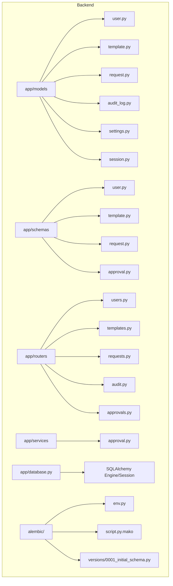
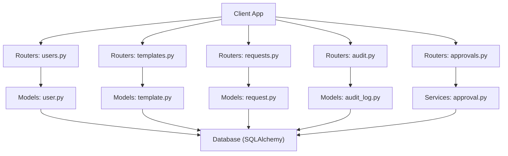
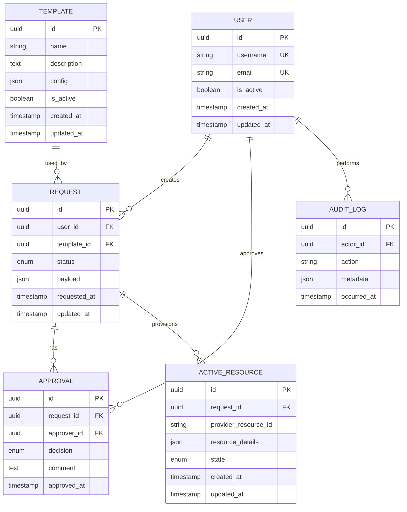
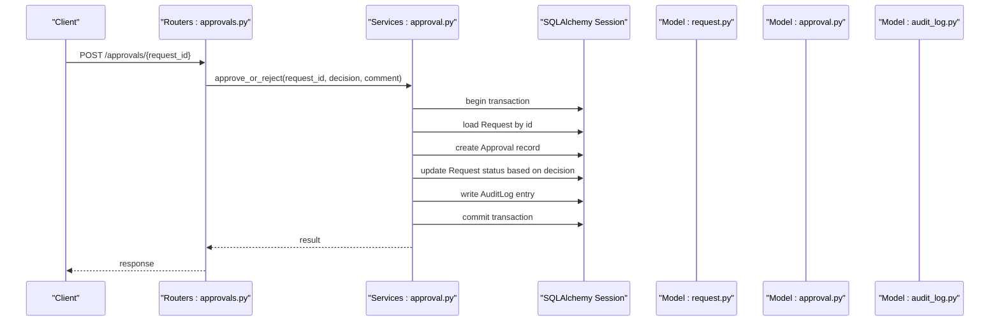
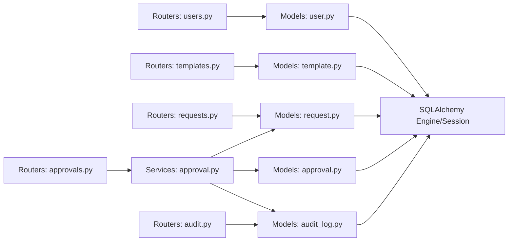

# Data Models & Database

<cite>
**Referenced Files in This Document**
- [backend/app/models/user.py](file://backend/app/models/user.py)
- [backend/app/models/template.py](file://backend/app/models/template.py)
- [backend/app/models/request.py](file://backend/app/models/request.py)
- [backend/app/models/audit_log.py](file://backend/app/models/audit_log.py)
- [backend/app/models/settings.py](file://backend/app/models/settings.py)
- [backend/app/models/session.py](file://backend/app/models/session.py)
- [backend/app/database.py](file://backend/app/database.py)
- [backend/alembic/env.py](file://backend/alembic/env.py)
- [backend/alembic/script.py.mako](file://backend/alembic/script.py.mako)
- [backend/alembic.ini](file://backend/alembic.ini)
- [backend/alembic/versions/0001_initial_schema.py](file://backend/alembic/versions/0001_initial_schema.py)
- [backend/app/routers/users.py](file://backend/app/routers/users.py)
- [backend/app/routers/templates.py](file://backend/app/routers/templates.py)
- [backend/app/routers/requests.py](file://backend/app/routers/requests.py)
- [backend/app/routers/audit.py](file://backend/app/routers/audit.py)
- [backend/app/routers/approvals.py](file://backend/app/routers/approvals.py)
- [backend/app/schemas/user.py](file://backend/app/schemas/user.py)
- [backend/app/schemas/template.py](file://backend/app/schemas/template.py)
- [backend/app/schemas/request.py](file://backend/app/schemas/request.py)
- [backend/app/schemas/approval.py](file://backend/app/schemas/approval.py)
- [backend/app/services/approval.py](file://backend/app/services/approval.py)
</cite>

## Table of Contents
1. [Introduction](#introduction)
2. [Project Structure](#project-structure)
3. [Core Components](#core-components)
4. [Architecture Overview](#architecture-overview)
5. [Detailed Component Analysis](#detailed-component-analysis)
6. [Dependency Analysis](#dependency-analysis)
7. [Performance Considerations](#performance-considerations)
8. [Troubleshooting Guide](#troubleshooting-guide)
9. [Conclusion](#conclusion)
10. [Appendices](#appendices)

## Introduction
This document provides comprehensive data model documentation for the ECS Creator database schema. It focuses on entity relationships among User, Template, Request, Approval, AuditLog, and ActiveResource models. It details field definitions, data types, constraints, validation rules, primary and foreign key relationships, indexes, Alembic migration strategy, version management, sample data structures, query patterns, lifecycle and retention policies, backup strategies, and performance considerations when using SQLAlchemy ORM with large datasets.

## Project Structure
The backend organizes data models under app/models, schemas under app/schemas, routers under app/routers, services under app/services, and database configuration under app/database.py. Alembic is configured under alembic/. The initial migration defines the base schema.

**Diagram sources**
- [backend/app/models/user.py](file://backend/app/models/user.py)
- [backend/app/models/template.py](file://backend/app/models/template.py)
- [backend/app/models/request.py](file://backend/app/models/request.py)
- [backend/app/models/audit_log.py](file://backend/app/models/audit_log.py)
- [backend/app/models/settings.py](file://backend/app/models/settings.py)
- [backend/app/models/session.py](file://backend/app/models/session.py)
- [backend/app/schemas/user.py](file://backend/app/schemas/user.py)
- [backend/app/schemas/template.py](file://backend/app/schemas/template.py)
- [backend/app/schemas/request.py](file://backend/app/schemas/request.py)
- [backend/app/schemas/approval.py](file://backend/app/schemas/approval.py)
- [backend/app/routers/users.py](file://backend/app/routers/users.py)
- [backend/app/routers/templates.py](file://backend/app/routers/templates.py)
- [backend/app/routers/requests.py](file://backend/app/routers/requests.py)
- [backend/app/routers/audit.py](file://backend/app/routers/audit.py)
- [backend/app/routers/approvals.py](file://backend/app/routers/approvals.py)
- [backend/app/services/approval.py](file://backend/app/services/approval.py)
- [backend/app/database.py](file://backend/app/database.py)
- [backend/alembic/env.py](file://backend/alembic/env.py)
- [backend/alembic/script.py.mako](file://backend/alembic/script.py.mako)
- [backend/alembic/versions/0001_initial_schema.py](file://backend/alembic/versions/0001_initial_schema.py)

**Section sources**
- [backend/app/models/user.py](file://backend/app/models/user.py)
- [backend/app/models/template.py](file://backend/app/models/template.py)
- [backend/app/models/request.py](file://backend/app/models/request.py)
- [backend/app/models/audit_log.py](file://backend/app/models/audit_log.py)
- [backend/app/models/settings.py](file://backend/app/models/settings.py)
- [backend/app/models/session.py](file://backend/app/models/session.py)
- [backend/app/database.py](file://backend/app/database.py)
- [backend/alembic/env.py](file://backend/alembic/env.py)
- [backend/alembic/script.py.mako](file://backend/alembic/script.py.mako)
- [backend/alembic/versions/0001_initial_schema.py](file://backend/alembic/versions/0001_initial_schema.py)

## Core Components
This section summarizes the core data entities and their responsibilities:
- User: Represents system users who can create requests and manage templates.
- Template: Defines reusable configurations for provisioning resources.
- Request: Captures a user’s request to provision or modify resources based on a template.
- Approval: Tracks approval workflow decisions associated with Requests.
- AuditLog: Records immutable audit events across the system.
- ActiveResource: Tracks currently active cloud resources provisioned by the system.

Relationships:
- User has many Requests.
- Template is referenced by Requests.
- Approval is linked to Request.
- AuditLog references Users and may reference other entities via polymorphic fields.
- ActiveResource is tied to a Request (and indirectly to a Template).

Validation and constraints are enforced at both the Pydantic schema layer and the database layer (via SQLAlchemy column constraints and Alembic migrations).

**Section sources**
- [backend/app/models/user.py](file://backend/app/models/user.py)
- [backend/app/models/template.py](file://backend/app/models/template.py)
- [backend/app/models/request.py](file://backend/app/models/request.py)
- [backend/app/models/audit_log.py](file://backend/app/models/audit_log.py)
- [backend/app/models/settings.py](file://backend/app/models/settings.py)
- [backend/app/models/session.py](file://backend/app/models/session.py)
- [backend/app/schemas/user.py](file://backend/app/schemas/user.py)
- [backend/app/schemas/template.py](file://backend/app/schemas/template.py)
- [backend/app/schemas/request.py](file://backend/app/schemas/request.py)
- [backend/app/schemas/approval.py](file://backend/app/schemas/approval.py)

## Architecture Overview
The application uses FastAPI routers to expose endpoints that interact with SQLAlchemy ORM models. Alembic manages schema migrations. Services encapsulate business logic such as approvals and external integrations.

**Diagram sources**
- [backend/app/routers/users.py](file://backend/app/routers/users.py)
- [backend/app/routers/templates.py](file://backend/app/routers/templates.py)
- [backend/app/routers/requests.py](file://backend/app/routers/requests.py)
- [backend/app/routers/approvals.py](file://backend/app/routers/approvals.py)
- [backend/app/routers/audit.py](file://backend/app/routers/audit.py)
- [backend/app/models/user.py](file://backend/app/models/user.py)
- [backend/app/models/template.py](file://backend/app/models/template.py)
- [backend/app/models/request.py](file://backend/app/models/request.py)
- [backend/app/models/audit_log.py](file://backend/app/models/audit_log.py)
- [backend/app/services/approval.py](file://backend/app/services/approval.py)
- [backend/app/database.py](file://backend/app/database.py)

## Detailed Component Analysis

### Entity Relationship Diagram

**Diagram sources**
- [backend/app/models/user.py](file://backend/app/models/user.py)
- [backend/app/models/template.py](file://backend/app/models/template.py)
- [backend/app/models/request.py](file://backend/app/models/request.py)
- [backend/app/models/audit_log.py](file://backend/app/models/audit_log.py)
- [backend/alembic/versions/0001_initial_schema.py](file://backend/alembic/versions/0001_initial_schema.py)

#### Field Definitions, Types, Constraints, and Validation Rules
- User
  - Fields: id (UUID, PK), username (string, unique), email (string, unique), is_active (boolean), timestamps (created_at, updated_at).
  - Constraints: Unique constraints on username and email; not-null on required fields.
  - Validation: Pydantic schema enforces format and presence; database-level constraints ensure integrity.
- Template
  - Fields: id (UUID, PK), name (string), description (text), config (JSON), is_active (boolean), timestamps.
  - Constraints: Not-null on name; JSON schema validated at API layer; optional description.
  - Validation: Pydantic validates JSON structure and required keys.
- Request
  - Fields: id (UUID, PK), user_id (UUID, FK to User), template_id (UUID, FK to Template), status (enum), payload (JSON), timestamps.
  - Constraints: Foreign keys enforce referential integrity; status constrained to allowed values.
  - Validation: Pydantic ensures payload conforms to expected shape; service layer validates business rules.
- Approval
  - Fields: id (UUID, PK), request_id (UUID, FK to Request), approver_id (UUID, FK to User), decision (enum), comment (text), approved_at (timestamp).
  - Constraints: One approval per decision step; decision restricted to allowed values.
  - Validation: Pydantic enforces decision and comment presence where required.
- AuditLog
  - Fields: id (UUID, PK), actor_id (UUID, FK to User), action (string), metadata (JSON), occurred_at (timestamp).
  - Constraints: Immutable append-only records; actor_id references a valid user.
  - Validation: Pydantic ensures action and metadata structure.
- ActiveResource
  - Fields: id (UUID, PK), request_id (UUID, FK to Request), provider_resource_id (string), resource_details (JSON), state (enum), timestamps.
  - Constraints: State constrained to allowed lifecycle states; provider_resource_id unique per provider context.
  - Validation: Pydantic validates state transitions and JSON details.

**Section sources**
- [backend/app/models/user.py](file://backend/app/models/user.py)
- [backend/app/models/template.py](file://backend/app/models/template.py)
- [backend/app/models/request.py](file://backend/app/models/request.py)
- [backend/app/models/audit_log.py](file://backend/app/models/audit_log.py)
- [backend/app/schemas/user.py](file://backend/app/schemas/user.py)
- [backend/app/schemas/template.py](file://backend/app/schemas/template.py)
- [backend/app/schemas/request.py](file://backend/app/schemas/request.py)
- [backend/app/schemas/approval.py](file://backend/app/schemas/approval.py)
- [backend/alembic/versions/0001_initial_schema.py](file://backend/alembic/versions/0001_initial_schema.py)

#### Primary Keys, Foreign Keys, and Indexes
- Primary Keys: All tables use UUID-based primary keys for scalability and distributed safety.
- Foreign Keys:
  - Request.user_id -> User.id
  - Request.template_id -> Template.id
  - Approval.request_id -> Request.id
  - Approval.approver_id -> User.id
  - ActiveResource.request_id -> Request.id
  - AuditLog.actor_id -> User.id
- Indexes:
  - Unique indexes on User.username and User.email.
  - Indexes on Request.user_id, Request.template_id, Request.status for efficient filtering.
  - Indexes on Approval.request_id and Approval.approver_id for lookup and reporting.
  - Indexes on ActiveResource.request_id and ActiveResource.state for lifecycle queries.
  - Indexes on AuditLog.actor_id and AuditLog.action for audit searches.

These indexes support common query patterns such as listing requests by user, retrieving approvals for a request, and auditing actions by actor.

**Section sources**
- [backend/alembic/versions/0001_initial_schema.py](file://backend/alembic/versions/0001_initial_schema.py)
- [backend/app/models/request.py](file://backend/app/models/request.py)
- [backend/app/models/audit_log.py](file://backend/app/models/audit_log.py)

#### Sample Data Structures
- User:
  - id: UUID
  - username: string
  - email: string
  - is_active: boolean
  - created_at: timestamp
  - updated_at: timestamp
- Template:
  - id: UUID
  - name: string
  - description: text
  - config: JSON object describing resource parameters
  - is_active: boolean
  - created_at: timestamp
  - updated_at: timestamp
- Request:
  - id: UUID
  - user_id: UUID
  - template_id: UUID
  - status: enum (e.g., pending, approved, rejected, provisioned, failed)
  - payload: JSON carrying request-specific parameters
  - requested_at: timestamp
  - updated_at: timestamp
- Approval:
  - id: UUID
  - request_id: UUID
  - approver_id: UUID
  - decision: enum (approve, reject)
  - comment: text
  - approved_at: timestamp
- AuditLog:
  - id: UUID
  - actor_id: UUID
  - action: string (e.g., "create_request", "approve_request")
  - metadata: JSON with contextual details
  - occurred_at: timestamp
- ActiveResource:
  - id: UUID
  - request_id: UUID
  - provider_resource_id: string (external provider ID)
  - resource_details: JSON with provider-specific attributes
  - state: enum (e.g., creating, ready, deleting, error)
  - created_at: timestamp
  - updated_at: timestamp

**Section sources**
- [backend/app/schemas/user.py](file://backend/app/schemas/user.py)
- [backend/app/schemas/template.py](file://backend/app/schemas/template.py)
- [backend/app/schemas/request.py](file://backend/app/schemas/request.py)
- [backend/app/schemas/approval.py](file://backend/app/schemas/approval.py)

#### Query Patterns
- List all requests for a specific user:
  - Filter by Request.user_id and order by requested_at descending.
- Retrieve approvals for a given request:
  - Filter by Approval.request_id and sort by approved_at.
- Find active resources by request:
  - Filter by ActiveResource.request_id and state = "ready".
- Audit trail for an actor:
  - Filter by AuditLog.actor_id and action type; paginate results.
- Templates available to users:
  - Filter by Template.is_active and join with Request counts if needed.

Optimization tips:
- Use eager loading (joinedload/selectinload) to avoid N+1 queries when fetching related objects.
- Apply selective columns to reduce payload size.
- Leverage existing indexes for filter and sort operations.

**Section sources**
- [backend/app/routers/requests.py](file://backend/app/routers/requests.py)
- [backend/app/routers/approvals.py](file://backend/app/routers/approvals.py)
- [backend/app/routers/audit.py](file://backend/app/routers/audit.py)

### Approval Workflow Sequence

**Diagram sources**
- [backend/app/routers/approvals.py](file://backend/app/routers/approvals.py)
- [backend/app/services/approval.py](file://backend/app/services/approval.py)
- [backend/app/models/request.py](file://backend/app/models/request.py)
- [backend/app/models/audit_log.py](file://backend/app/models/audit_log.py)

**Section sources**
- [backend/app/routers/approvals.py](file://backend/app/routers/approvals.py)
- [backend/app/services/approval.py](file://backend/app/services/approval.py)

## Dependency Analysis
The following diagram shows how routers depend on models and services, and how services interact with the database through SQLAlchemy sessions.

**Diagram sources**
- [backend/app/routers/users.py](file://backend/app/routers/users.py)
- [backend/app/routers/templates.py](file://backend/app/routers/templates.py)
- [backend/app/routers/requests.py](file://backend/app/routers/requests.py)
- [backend/app/routers/approvals.py](file://backend/app/routers/approvals.py)
- [backend/app/routers/audit.py](file://backend/app/routers/audit.py)
- [backend/app/models/user.py](file://backend/app/models/user.py)
- [backend/app/models/template.py](file://backend/app/models/template.py)
- [backend/app/models/request.py](file://backend/app/models/request.py)
- [backend/app/models/audit_log.py](file://backend/app/models/audit_log.py)
- [backend/app/services/approval.py](file://backend/app/services/approval.py)
- [backend/app/database.py](file://backend/app/database.py)

**Section sources**
- [backend/app/routers/users.py](file://backend/app/routers/users.py)
- [backend/app/routers/templates.py](file://backend/app/routers/templates.py)
- [backend/app/routers/requests.py](file://backend/app/routers/requests.py)
- [backend/app/routers/approvals.py](file://backend/app/routers/approvals.py)
- [backend/app/routers/audit.py](file://backend/app/routers/audit.py)
- [backend/app/services/approval.py](file://backend/app/services/approval.py)
- [backend/app/database.py](file://backend/app/database.py)

## Performance Considerations
- Indexing Strategy:
  - Ensure foreign key columns have appropriate indexes to speed up joins and lookups.
  - Add composite indexes for frequent filter combinations (e.g., Request.user_id + Request.status).
- Query Optimization:
  - Use eager loading to prevent N+1 queries when returning nested objects.
  - Select only necessary columns to minimize memory usage and network overhead.
  - Paginate large result sets to avoid excessive payloads.
- Transaction Management:
  - Keep transactions short and scoped to critical sections to reduce lock contention.
- Connection Pooling:
  - Configure SQLAlchemy pool size and timeouts according to workload and database capacity.
- Large Dataset Handling:
  - Implement streaming or cursor-based pagination for heavy reports.
  - Archive historical data (e.g., old AuditLog entries) to keep hot tables lean.

[No sources needed since this section provides general guidance]

## Troubleshooting Guide
Common issues and resolutions:
- Integrity Errors:
  - Occur when foreign key constraints are violated. Verify referenced IDs exist before writes.
- Duplicate Key Errors:
  - Unique constraints on User.username and User.email must be respected during creation and updates.
- Schema Drift:
  - If local schema differs from production, run Alembic migrations to align versions.
- Slow Queries:
  - Check execution plans and add missing indexes; review N+1 patterns and apply eager loading.
- Audit Log Gaps:
  - Ensure every state-changing operation writes an AuditLog entry within the same transaction.

Operational checks:
- Validate Alembic head matches current codebase.
- Confirm database connection settings and credentials.
- Inspect recent migrations for unintended changes.

**Section sources**
- [backend/alembic/versions/0001_initial_schema.py](file://backend/alembic/versions/0001_initial_schema.py)
- [backend/app/database.py](file://backend/app/database.py)

## Conclusion
The ECS Creator database schema centers around User, Template, Request, Approval, AuditLog, and ActiveResource entities with clear relationships and constraints. Proper indexing, careful query design, and robust Alembic migrations ensure reliability and performance. Adhering to lifecycle and retention policies, along with consistent backup strategies, maintains data integrity and availability over time.

[No sources needed since this section summarizes without analyzing specific files]

## Appendices

### Alembic Migration Strategy and Version Management
- Configuration:
  - env.py initializes the environment and applies migrations against the configured database URL.
  - script.py.mako provides the template for generating new migration scripts.
  - alembic.ini defines Alembic settings including revision paths and target metadata.
- Initial Migration:
  - 0001_initial_schema.py creates the foundational tables and indexes.
- Best Practices:
  - Generate migrations after model changes.
  - Review generated diffs for correctness before applying.
  - Pin production databases to specific revisions until tested.
  - Use downgrade paths for safe rollback when necessary.

**Section sources**
- [backend/alembic/env.py](file://backend/alembic/env.py)
- [backend/alembic/script.py.mako](file://backend/alembic/script.py.mako)
- [backend/alembic.ini](file://backend/alembic.ini)
- [backend/alembic/versions/0001_initial_schema.py](file://backend/alembic/versions/0001_initial_schema.py)

### Data Lifecycle Management, Retention Policies, and Backup Strategies
- Lifecycle:
  - Requests progress through statuses reflecting approval and provisioning outcomes.
  - ActiveResource tracks resource state throughout its lifecycle.
  - AuditLog remains immutable and append-only.
- Retention:
  - Consider archiving old AuditLog entries and completed Requests periodically.
  - Purge inactive Templates not referenced by active Requests.
- Backup:
  - Schedule regular logical backups (e.g., pg_dump) for PostgreSQL.
  - Include point-in-time recovery capabilities where supported.
  - Test restore procedures regularly to validate backup integrity.

[No sources needed since this section provides general guidance]

### Data Access Patterns Through SQLAlchemy ORM
- Session Usage:
  - Use scoped sessions per request to isolate transactions.
  - Commit or rollback explicitly to maintain consistency.
- Relationships:
  - Define back_populates/backref for bidirectional navigation.
  - Use lazy=False judiciously to control loading behavior.
- Filtering and Sorting:
  - Apply filters on indexed columns for optimal performance.
  - Use order_by on timestamps for deterministic pagination.
- Bulk Operations:
  - Prefer bulk inserts/updates for high-throughput scenarios.
  - Avoid excessive individual commits; batch where possible.

**Section sources**
- [backend/app/database.py](file://backend/app/database.py)
- [backend/app/models/user.py](file://backend/app/models/user.py)
- [backend/app/models/request.py](file://backend/app/models/request.py)
- [backend/app/models/audit_log.py](file://backend/app/models/audit_log.py)