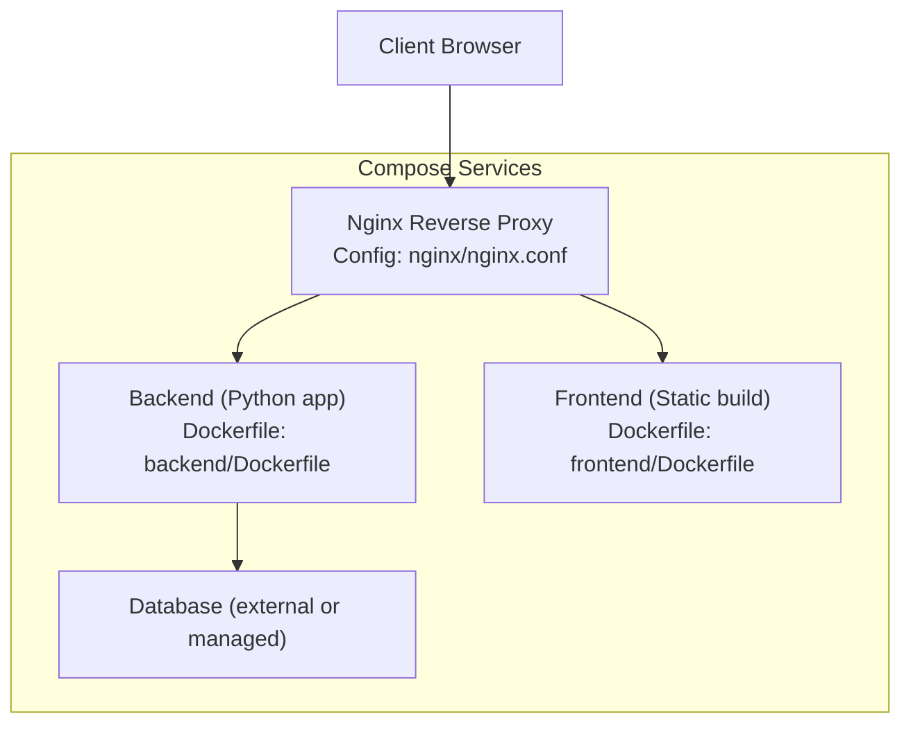
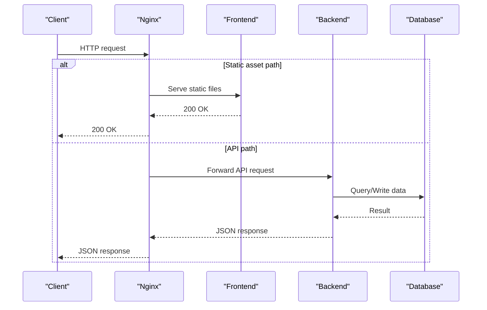
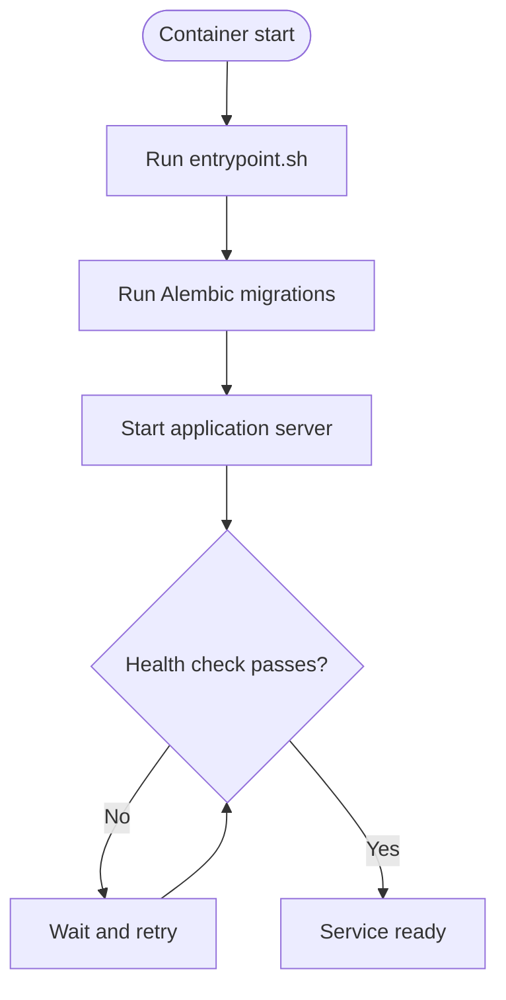
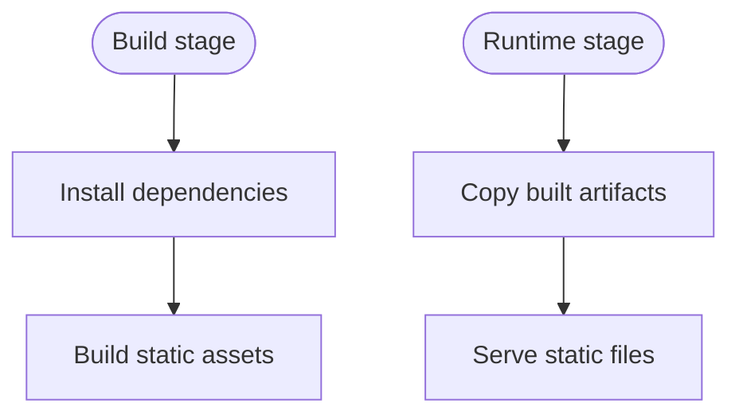
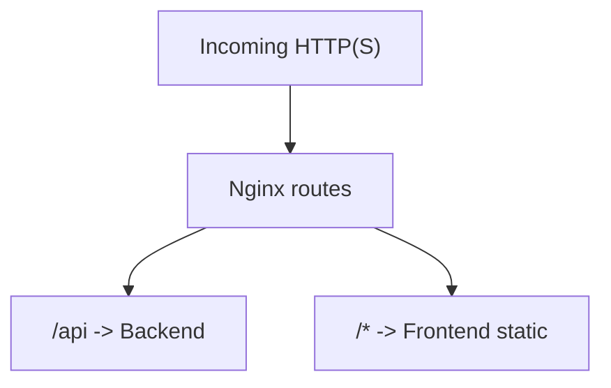
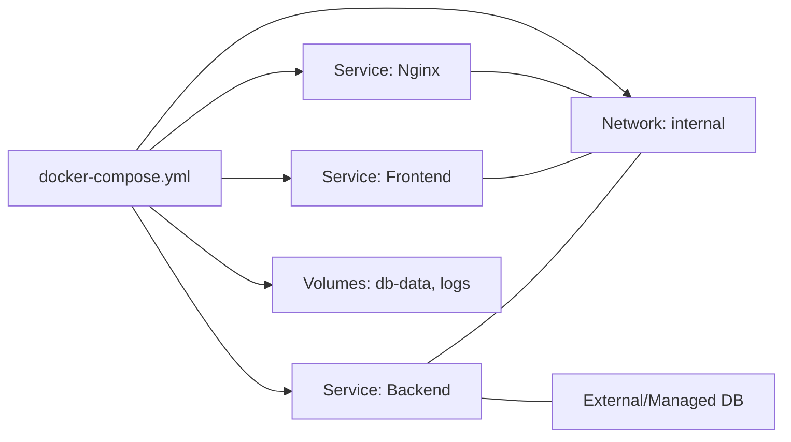
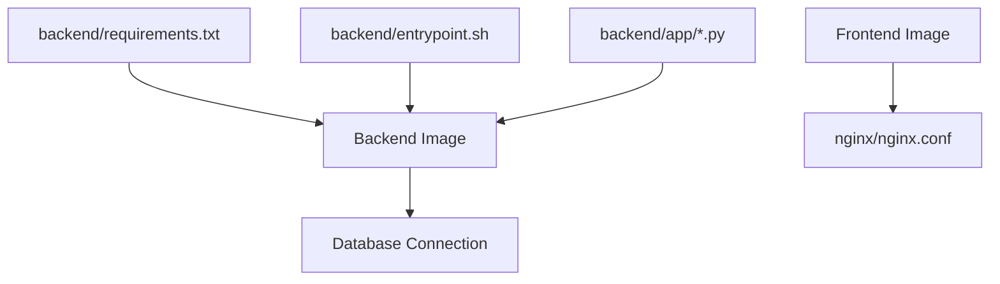

# Containerization & Docker

<cite>
**Referenced Files in This Document**
- [docker-compose.yml](file://docker-compose.yml)
- [backend/Dockerfile](file://backend/Dockerfile)
- [backend/entrypoint.sh](file://backend/entrypoint.sh)
- [backend/app/main.py](file://backend/app/main.py)
- [backend/app/config.py](file://backend/app/config.py)
- [backend/app/database.py](file://backend/app/database.py)
- [backend/requirements.txt](file://backend/requirements.txt)
- [frontend/Dockerfile](file://frontend/Dockerfile)
- [nginx/nginx.conf](file://nginx/nginx.conf)
</cite>

## Table of Contents
1. [Introduction](#introduction)
2. [Project Structure](#project-structure)
3. [Core Components](#core-components)
4. [Architecture Overview](#architecture-overview)
5. [Detailed Component Analysis](#detailed-component-analysis)
6. [Dependency Analysis](#dependency-analysis)
7. [Performance Considerations](#performance-considerations)
8. [Troubleshooting Guide](#troubleshooting-guide)
9. [Conclusion](#conclusion)
10. [Appendices](#appendices)

## Introduction
This document explains the containerization strategy for the ECS Creator platform, focusing on Docker and Docker Compose. It covers multi-stage builds, image optimization, security best practices, service orchestration, networking, volumes, environment configuration, health checks, lifecycle management, logging, resource constraints, secrets handling, and production hardening. The goal is to provide a clear, actionable guide for building, running, and securing the backend and frontend services using containers.

## Project Structure
The repository includes dedicated Dockerfiles for the backend and frontend, an Nginx reverse proxy configuration, and a Docker Compose file that orchestrates all services. The backend runs a Python application with database migrations, while the frontend is built with a modern JavaScript toolchain and served statically via Nginx.

**Diagram sources**
- [docker-compose.yml](file://docker-compose.yml)
- [backend/Dockerfile](file://backend/Dockerfile)
- [frontend/Dockerfile](file://frontend/Dockerfile)
- [nginx/nginx.conf](file://nginx/nginx.conf)

**Section sources**
- [docker-compose.yml](file://docker-compose.yml)
- [backend/Dockerfile](file://backend/Dockerfile)
- [frontend/Dockerfile](file://frontend/Dockerfile)
- [nginx/nginx.conf](file://nginx/nginx.conf)

## Core Components
- Backend service: Python application with Uvicorn/Gunicorn, Alembic migrations, and runtime configuration via environment variables.
- Frontend service: Static site generated by Vite and served by Nginx.
- Nginx: Reverse proxy routing traffic to backend API and frontend static assets.
- Database: External or managed; connection details provided via environment variables.

Key responsibilities:
- Build optimized images using multi-stage builds.
- Manage runtime configuration through environment variables and secure secret injection.
- Provide health checks for orchestration readiness.
- Use persistent volumes for database state and logs as needed.
- Enforce least privilege and minimal attack surface.

**Section sources**
- [backend/Dockerfile](file://backend/Dockerfile)
- [backend/entrypoint.sh](file://backend/entrypoint.sh)
- [backend/app/config.py](file://backend/app/config.py)
- [backend/app/database.py](file://backend/app/database.py)
- [backend/requirements.txt](file://backend/requirements.txt)
- [frontend/Dockerfile](file://frontend/Dockerfile)
- [nginx/nginx.conf](file://nginx/nginx.conf)

## Architecture Overview
The system uses Docker Compose to define services, networks, and volumes. Nginx acts as the single entry point, forwarding requests to the backend API and serving the frontend static files. The backend connects to a database using credentials supplied at runtime.

**Diagram sources**
- [docker-compose.yml](file://docker-compose.yml)
- [nginx/nginx.conf](file://nginx/nginx.conf)
- [backend/app/main.py](file://backend/app/main.py)
- [backend/app/database.py](file://backend/app/database.py)

## Detailed Component Analysis

### Backend Service
- Image build: Multi-stage build separates dependency installation from runtime image to minimize size and reduce attack surface.
- Entrypoint: A shell script initializes the process, runs database migrations, and starts the application server.
- Configuration: Environment-driven settings are loaded at startup; sensitive values should be injected securely.
- Health check: An endpoint or process-level readiness probe can be used by Compose to determine when the service is ready.

**Diagram sources**
- [backend/entrypoint.sh](file://backend/entrypoint.sh)
- [backend/app/main.py](file://backend/app/main.py)

**Section sources**
- [backend/Dockerfile](file://backend/Dockerfile)
- [backend/entrypoint.sh](file://backend/entrypoint.sh)
- [backend/app/config.py](file://backend/app/config.py)
- [backend/app/database.py](file://backend/app/database.py)
- [backend/app/main.py](file://backend/app/main.py)
- [backend/requirements.txt](file://backend/requirements.txt)

### Frontend Service
- Build stage: Installs dependencies and builds static assets.
- Runtime stage: Serves static files via a lightweight web server.
- Output: Only the compiled artifacts are included in the final image.

**Diagram sources**
- [frontend/Dockerfile](file://frontend/Dockerfile)

**Section sources**
- [frontend/Dockerfile](file://frontend/Dockerfile)

### Nginx Reverse Proxy
- Routes incoming traffic to backend API endpoints and serves frontend static content.
- Can enforce HTTPS termination, caching headers, and request limits.

**Diagram sources**
- [nginx/nginx.conf](file://nginx/nginx.conf)

**Section sources**
- [nginx/nginx.conf](file://nginx/nginx.conf)

### Docker Compose Orchestration
- Defines services, networks, and volumes.
- Manages service dependencies and startup order.
- Provides health checks and restart policies.
- Exposes ports and maps environment variables.

**Diagram sources**
- [docker-compose.yml](file://docker-compose.yml)

**Section sources**
- [docker-compose.yml](file://docker-compose.yml)

## Dependency Analysis
- Backend depends on:
  - Python runtime and application dependencies defined in requirements.
  - Database connectivity via environment variables.
  - Entrypoint script for initialization and migration execution.
- Frontend depends on:
  - Build-time Node.js toolchain.
  - Nginx runtime for serving static assets.
- Nginx depends on:
  - Backend API service availability.
  - Frontend static assets.

**Diagram sources**
- [backend/requirements.txt](file://backend/requirements.txt)
- [backend/entrypoint.sh](file://backend/entrypoint.sh)
- [backend/app/main.py](file://backend/app/main.py)
- [backend/app/config.py](file://backend/app/config.py)
- [backend/app/database.py](file://backend/app/database.py)
- [frontend/Dockerfile](file://frontend/Dockerfile)
- [nginx/nginx.conf](file://nginx/nginx.conf)

**Section sources**
- [backend/requirements.txt](file://backend/requirements.txt)
- [backend/entrypoint.sh](file://backend/entrypoint.sh)
- [backend/app/main.py](file://backend/app/main.py)
- [backend/app/config.py](file://backend/app/config.py)
- [backend/app/database.py](file://backend/app/database.py)
- [frontend/Dockerfile](file://frontend/Dockerfile)
- [nginx/nginx.conf](file://nginx/nginx.conf)

## Performance Considerations
- Multi-stage builds:
  - Separate build and runtime stages to reduce image size and improve pull times.
  - Cache dependency layers effectively by copying only requirement files first.
- Layer ordering:
  - Place frequently changing code later in the Dockerfile to leverage layer caching.
- Minimal base images:
  - Use slim or distroless variants where possible to shrink attack surface.
- Resource constraints:
  - Set CPU and memory limits per service in Compose to prevent noisy neighbor issues.
- Connection pooling:
  - Configure database client pools appropriately for expected concurrency.
- Static asset caching:
  - Enable browser caching for immutable frontend assets via Nginx.

[No sources needed since this section provides general guidance]

## Troubleshooting Guide
Common issues and resolutions:
- Migration failures:
  - Verify database connectivity and credentials.
  - Ensure migrations run before starting the application server.
- Health check flapping:
  - Increase initial delay and retries; ensure the health endpoint responds quickly.
- Port conflicts:
  - Check host port mappings and ensure no other processes bind to the same ports.
- Permission errors:
  - Run as non-root user; adjust file permissions for writable directories.
- Logging:
  - Centralize logs using Compose logging drivers; avoid writing large logs to stdout in high-throughput scenarios.

**Section sources**
- [backend/entrypoint.sh](file://backend/entrypoint.sh)
- [backend/app/database.py](file://backend/app/database.py)
- [backend/app/main.py](file://backend/app/main.py)

## Conclusion
By adopting multi-stage builds, strict environment configuration, health checks, and proper orchestration with Docker Compose, the ECS Creator platform achieves efficient, secure, and maintainable deployments. Following the recommendations for secrets management, scanning, and resource constraints ensures robust production operations.

[No sources needed since this section summarizes without analyzing specific files]

## Appendices

### Environment Variables and Secrets
- Use Compose environment files or secret mounts for sensitive values.
- Avoid baking secrets into images; inject at runtime.
- Validate required variables at startup and fail fast if missing.

**Section sources**
- [backend/app/config.py](file://backend/app/config.py)
- [backend/app/database.py](file://backend/app/database.py)
- [docker-compose.yml](file://docker-compose.yml)

### Security Best Practices
- Run containers as non-root users.
- Pin base image versions and rebuild regularly.
- Scan images for vulnerabilities and enforce policies.
- Limit capabilities and use read-only root filesystems where feasible.
- Restrict network exposure; expose only necessary ports.

**Section sources**
- [backend/Dockerfile](file://backend/Dockerfile)
- [frontend/Dockerfile](file://frontend/Dockerfile)
- [nginx/nginx.conf](file://nginx/nginx.conf)

### Lifecycle Management
- Graceful shutdown:
  - Handle SIGTERM/SIGINT to finish in-flight requests.
- Restart policies:
  - Use appropriate restart strategies in Compose for resilience.
- Rolling updates:
  - Update one service at a time and verify health checks pass.

**Section sources**
- [backend/app/main.py](file://backend/app/main.py)
- [docker-compose.yml](file://docker-compose.yml)