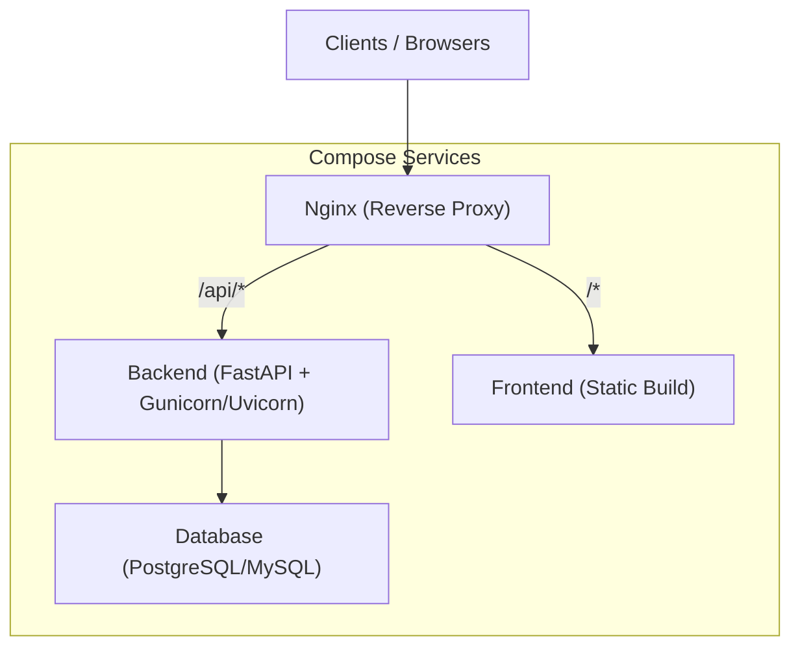
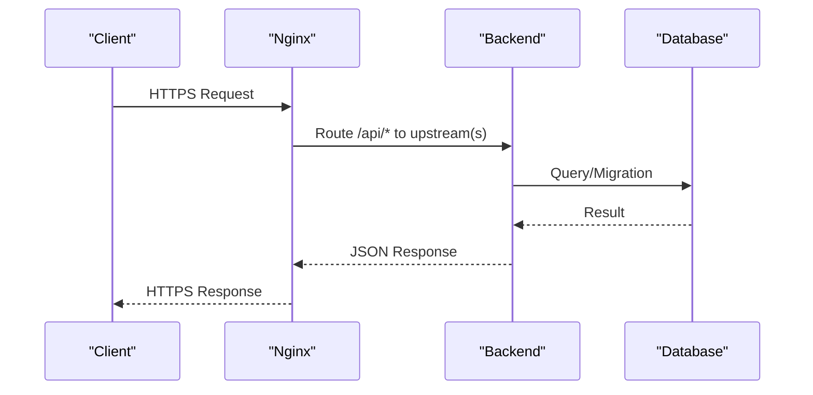
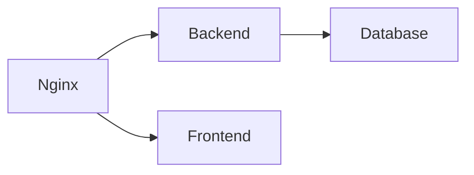

# Deployment & DevOps

<cite>
**Referenced Files in This Document**
- [docker-compose.yml](file://docker-compose.yml)
- [backend/Dockerfile](file://backend/Dockerfile)
- [frontend/Dockerfile](file://frontend/Dockerfile)
- [nginx/nginx.conf](file://nginx/nginx.conf)
- [backend/entrypoint.sh](file://backend/entrypoint.sh)
- [backend/app/main.py](file://backend/app/main.py)
- [backend/app/config.py](file://backend/app/config.py)
- [backend/app/database.py](file://backend/app/database.py)
- [backend/alembic.ini](file://backend/alembic.ini)
- [backend/requirements.txt](file://backend/requirements.txt)
- [frontend/package.json](file://frontend/package.json)
- [frontend/vite.config.js](file://frontend/vite.config.js)
- [README.md](file://README.md)
</cite>

## Table of Contents
1. [Introduction](#introduction)
2. [Project Structure](#project-structure)
3. [Core Components](#core-components)
4. [Architecture Overview](#architecture-overview)
5. [Detailed Component Analysis](#detailed-component-analysis)
6. [Dependency Analysis](#dependency-analysis)
7. [Performance Considerations](#performance-considerations)
8. [Troubleshooting Guide](#troubleshooting-guide)
9. [Conclusion](#conclusion)
10. [Appendices](#appendices)

## Introduction
This document provides comprehensive deployment and DevOps guidance for the ECS Creator platform. It covers container orchestration with Docker Compose, Nginx reverse proxy configuration for load balancing and SSL termination, environment-specific configurations across development, staging, and production, image building processes, health checks, monitoring setup, scaling strategies, database backup procedures, disaster recovery planning, CI/CD pipeline recommendations, automated deployment strategies, troubleshooting guides, and performance tuning recommendations.

The ECS Creator platform consists of:
- A Python FastAPI backend with Alembic migrations and a relational database dependency
- A React frontend built with Vite
- An Nginx reverse proxy for routing, load balancing, and TLS termination
- Docker Compose to orchestrate multi-service deployments

## Project Structure
At a high level, the repository is organized into feature-based directories:
- backend: Application code, configuration, migrations, Dockerfile, and runtime entrypoint
- frontend: UI application, build configuration, and Dockerfile
- nginx: Reverse proxy configuration
- docker-compose.yml: Orchestration definition for services, networks, volumes, and dependencies
- README.md: Project overview and usage notes

**Diagram sources**
- [docker-compose.yml](file://docker-compose.yml)
- [nginx/nginx.conf](file://nginx/nginx.conf)
- [backend/app/main.py](file://backend/app/main.py)
- [frontend/Dockerfile](file://frontend/Dockerfile)

**Section sources**
- [docker-compose.yml](file://docker-compose.yml)
- [README.md](file://README.md)

## Core Components
- Backend service: Python-based API server using FastAPI, with Alembic for schema migrations and a database client configured via environment variables. The service exposes REST endpoints and integrates with cloud provider SDKs for ECS/VPC operations.
- Frontend service: Static site generated by Vite and served by Nginx or a lightweight HTTP server.
- Nginx reverse proxy: Routes traffic to backend and frontend, supports multiple upstreams for load balancing, and terminates TLS.
- Database: Relational store used by the backend; managed as an external service within the compose stack.

Key responsibilities:
- Containerization: Each service has its own Dockerfile optimized for build and runtime.
- Configuration: Environment-driven settings for database connectivity, secrets, and feature flags.
- Health checks: Service readiness and liveness probes defined in the compose file.
- Networking: Internal network for inter-service communication and exposed ports for ingress.

**Section sources**
- [backend/Dockerfile](file://backend/Dockerfile)
- [frontend/Dockerfile](file://frontend/Dockerfile)
- [nginx/nginx.conf](file://nginx/nginx.conf)
- [docker-compose.yml](file://docker-compose.yml)
- [backend/app/config.py](file://backend/app/config.py)
- [backend/app/database.py](file://backend/app/database.py)
- [backend/requirements.txt](file://backend/requirements.txt)

## Architecture Overview
The system follows a layered architecture:
- Ingress layer: Nginx handles TLS termination, request routing, and load balancing across backend replicas.
- Application layer: Stateless backend instances scale horizontally behind Nginx.
- Data layer: Persistent database volume(s) ensure data durability across restarts and upgrades.
- Build artifacts: Frontend static assets are prebuilt and served efficiently.

**Diagram sources**
- [nginx/nginx.conf](file://nginx/nginx.conf)
- [docker-compose.yml](file://docker-compose.yml)
- [backend/app/database.py](file://backend/app/database.py)

## Detailed Component Analysis

### Docker Compose Orchestration
- Defines services: backend, frontend, nginx, and database.
- Configures networks for internal communication and port exposure for ingress.
- Sets up volumes for persistent database storage and shared artifacts if needed.
- Includes health checks for critical services to enable automatic restarts and readiness gating.
- Uses environment files or inline variables for configuration injection.

Operational notes:
- Use separate compose overrides or environment files per environment (dev/staging/prod).
- Ensure secrets are injected securely (e.g., via secret management or CI/CD vault).
- Pin versions for images and dependencies to improve reproducibility.

**Section sources**
- [docker-compose.yml](file://docker-compose.yml)

### Nginx Reverse Proxy and Load Balancing
- Terminates TLS at the edge using certificates mounted into the container.
- Routes API requests to backend upstreams and serves frontend static assets.
- Supports multiple backend instances for horizontal scaling.
- Can include caching headers, rate limiting, and access controls.

Configuration considerations:
- Define upstream blocks for backend services.
- Configure location blocks for /api and root paths.
- Set proper proxy headers and timeouts.
- Enable gzip compression and security headers.

**Section sources**
- [nginx/nginx.conf](file://nginx/nginx.conf)

### Backend Service
- Built from a minimal base image with Python runtime and compiled dependencies.
- Entrypoint script initializes the environment, runs Alembic migrations, and starts the server.
- Reads configuration from environment variables for database URL, secrets, and feature toggles.
- Exposes health endpoints for readiness/liveness checks.

Build and runtime:
- Requirements are installed during build to speed up startup.
- Entrypoint ensures migrations run before accepting traffic.
- Server process is managed by a production-grade ASGI/WSGI runner.

**Section sources**
- [backend/Dockerfile](file://backend/Dockerfile)
- [backend/entrypoint.sh](file://backend/entrypoint.sh)
- [backend/app/config.py](file://backend/app/config.py)
- [backend/app/database.py](file://backend/app/database.py)
- [backend/alembic.ini](file://backend/alembic.ini)
- [backend/requirements.txt](file://backend/requirements.txt)

### Frontend Service
- Builds static assets using Vite and packages them into a lightweight image.
- Served directly by Nginx or a simple HTTP server depending on compose configuration.
- Environment variables can control API base URLs and feature flags at build time.

Optimization tips:
- Multi-stage builds to minimize image size.
- Cache node_modules between layers.
- Preload critical assets and configure long-term caching for static files.

**Section sources**
- [frontend/Dockerfile](file://frontend/Dockerfile)
- [frontend/package.json](file://frontend/package.json)
- [frontend/vite.config.js](file://frontend/vite.config.js)

### Database and Migrations
- Database service is defined in the compose file with a persistent volume.
- Alembic manages schema evolution; migrations should be applied during deployment.
- Backup strategy involves periodic snapshots of the database volume or logical dumps.

Best practices:
- Use connection pooling and tune parameters for workload.
- Rotate credentials and restrict network access to the database service.
- Test migrations in non-production environments first.

**Section sources**
- [docker-compose.yml](file://docker-compose.yml)
- [backend/alembic.ini](file://backend/alembic.ini)
- [backend/app/database.py](file://backend/app/database.py)

## Dependency Analysis
Service dependencies and coupling:
- Nginx depends on backend and frontend availability.
- Backend depends on the database and optional cloud provider credentials.
- Frontend depends on backend APIs for dynamic features.

**Diagram sources**
- [docker-compose.yml](file://docker-compose.yml)
- [nginx/nginx.conf](file://nginx/nginx.conf)
- [backend/app/database.py](file://backend/app/database.py)

**Section sources**
- [docker-compose.yml](file://docker-compose.yml)
- [nginx/nginx.conf](file://nginx/nginx.conf)
- [backend/app/database.py](file://backend/app/database.py)

## Performance Considerations
- Horizontal scaling: Add more backend replicas behind Nginx; ensure statelessness and session affinity if required.
- Connection limits: Tune database max connections and pool sizes based on replica count.
- Caching: Leverage browser caching for static assets and consider CDN integration.
- Compression: Enable gzip/brotli in Nginx for text responses.
- Resource quotas: Set CPU/memory limits per container to prevent noisy neighbor issues.
- Health checks: Use short intervals and appropriate thresholds to balance responsiveness and overhead.

[No sources needed since this section provides general guidance]

## Troubleshooting Guide
Common issues and resolutions:
- Migration failures: Verify database connectivity and permissions; roll back migrations if necessary.
- TLS errors: Confirm certificate paths and permissions; validate domain names and SAN entries.
- Upstream not ready: Check backend health endpoints and logs; ensure migrations completed before serving traffic.
- CORS issues: Adjust allowed origins and methods in backend middleware.
- High latency: Inspect Nginx logs, backend response times, and database query performance.

Operational checks:
- Validate compose status and container logs.
- Review Nginx error and access logs for routing problems.
- Monitor resource utilization and alert on anomalies.

**Section sources**
- [backend/entrypoint.sh](file://backend/entrypoint.sh)
- [nginx/nginx.conf](file://nginx/nginx.conf)
- [docker-compose.yml](file://docker-compose.yml)

## Conclusion
The ECS Creator platform is designed for scalable, secure, and maintainable deployments using Docker Compose and Nginx. By following the recommended practices for environment configuration, health checks, scaling, backups, and CI/CD automation, teams can achieve reliable operations across development, staging, and production. Continuous monitoring and proactive troubleshooting will further enhance stability and performance.

[No sources needed since this section summarizes without analyzing specific files]

## Appendices

### Environment-Specific Configuration Strategy
- Development: Local compose overrides, debug logging, relaxed security policies.
- Staging: Mirrors production with smaller resources; enables full migration testing.
- Production: Strict secrets management, hardened TLS, autoscaling, and robust backups.

Recommendations:
- Use environment files per stage and inject secrets via CI/CD or secret managers.
- Pin images and dependencies to ensure consistency across stages.

**Section sources**
- [docker-compose.yml](file://docker-compose.yml)
- [backend/app/config.py](file://backend/app/config.py)

### Scaling Strategies
- Horizontal scaling: Increase backend replicas; ensure database connection limits accommodate growth.
- Read replicas: Introduce read-only replicas for heavy query workloads.
- Caching layer: Add Redis or similar cache for frequently accessed data.

**Section sources**
- [docker-compose.yml](file://docker-compose.yml)
- [nginx/nginx.conf](file://nginx/nginx.conf)

### Database Backup Procedures
- Logical backups: Schedule regular dumps using database-native tools.
- Volume snapshots: Periodically snapshot persistent volumes for point-in-time recovery.
- Offsite replication: Replicate backups to remote storage for disaster recovery.

**Section sources**
- [docker-compose.yml](file://docker-compose.yml)

### Disaster Recovery Planning
- RTO/RPO targets: Define acceptable recovery time and data loss windows.
- Runbooks: Document step-by-step recovery procedures for common failure scenarios.
- Testing: Conduct periodic drills to validate recovery processes.

[No sources needed since this section provides general guidance]

### CI/CD Pipeline Recommendations
- Build stages: Lint, test, build images, push to registry.
- Security scanning: Image and dependency vulnerability scans.
- Deployments: Blue/green or rolling updates for zero-downtime releases.
- Rollbacks: Automated rollback on failed health checks.

[No sources needed since this section provides general guidance]

### Monitoring Setup
- Metrics: Collect application metrics and infrastructure telemetry.
- Logging: Centralize logs from all containers for correlation.
- Alerting: Configure alerts for errors, latency, and resource saturation.

[No sources needed since this section provides general guidance]