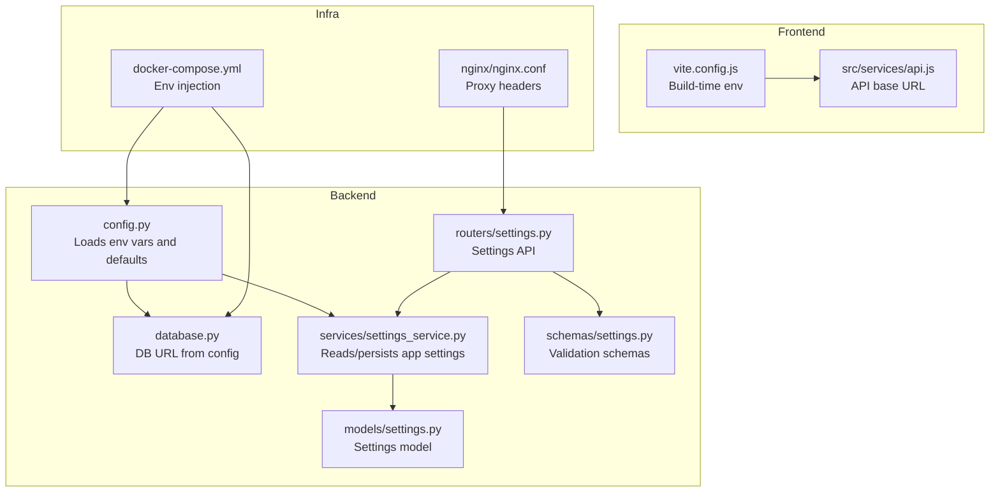
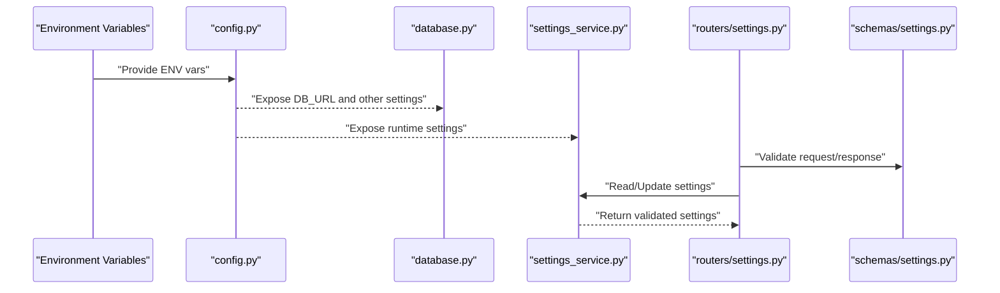
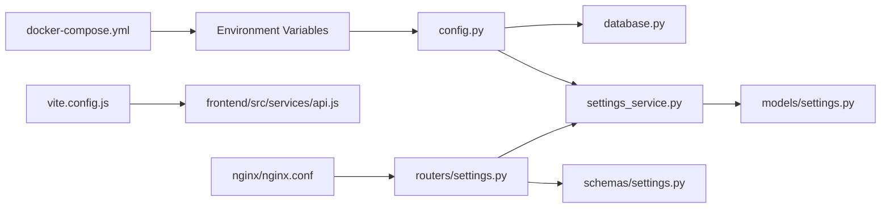

# Environment Configuration

<cite>
**Referenced Files in This Document**
- [backend/app/config.py](file://backend/app/config.py)
- [backend/app/database.py](file://backend/app/database.py)
- [backend/app/services/settings_service.py](file://backend/app/services/settings_service.py)
- [backend/app/models/settings.py](file://backend/app/models/settings.py)
- [backend/app/routers/settings.py](file://backend/app/routers/settings.py)
- [backend/app/schemas/settings.py](file://backend/app/schemas/settings.py)
- [backend/alembic/env.py](file://backend/alembic/env.py)
- [backend/entrypoint.sh](file://backend/entrypoint.sh)
- [docker-compose.yml](file://docker-compose.yml)
- [nginx/nginx.conf](file://nginx/nginx.conf)
- [frontend/vite.config.js](file://frontend/vite.config.js)
- [frontend/src/services/api.js](file://frontend/src/services/api.js)
</cite>

## Table of Contents
1. [Introduction](#introduction)
2. [Project Structure](#project-structure)
3. [Core Components](#core-components)
4. [Architecture Overview](#architecture-overview)
5. [Detailed Component Analysis](#detailed-component-analysis)
6. [Dependency Analysis](#dependency-analysis)
7. [Performance Considerations](#performance-considerations)
8. [Troubleshooting Guide](#troubleshooting-guide)
9. [Conclusion](#conclusion)
10. [Appendices](#appendices)

## Introduction
This document provides comprehensive environment configuration guidance for the ECS Creator platform. It covers how configuration is loaded, validated, and applied across development, staging, and production environments. It explains the configuration hierarchy, default values, validation rules, database connection strings, cloud provider credentials, API keys, security settings, environment-specific overrides, secret management strategies, and configuration validation procedures. It also includes examples of common deployment scenarios and troubleshooting steps.

## Project Structure
The project separates backend configuration (Python), frontend build-time configuration (Vite), container orchestration (Docker Compose), and reverse proxy configuration (Nginx). The backend centralizes runtime configuration loading and exposes a settings service to read and persist application settings.

**Diagram sources**
- [backend/app/config.py](file://backend/app/config.py)
- [backend/app/database.py](file://backend/app/database.py)
- [backend/app/services/settings_service.py](file://backend/app/services/settings_service.py)
- [backend/app/models/settings.py](file://backend/app/models/settings.py)
- [backend/app/routers/settings.py](file://backend/app/routers/settings.py)
- [backend/app/schemas/settings.py](file://backend/app/schemas/settings.py)
- [frontend/vite.config.js](file://frontend/vite.config.js)
- [frontend/src/services/api.js](file://frontend/src/services/api.js)
- [docker-compose.yml](file://docker-compose.yml)
- [nginx/nginx.conf](file://nginx/nginx.conf)

**Section sources**
- [backend/app/config.py](file://backend/app/config.py)
- [backend/app/database.py](file://backend/app/database.py)
- [backend/app/services/settings_service.py](file://backend/app/services/settings_service.py)
- [backend/app/models/settings.py](file://backend/app/models/settings.py)
- [backend/app/routers/settings.py](file://backend/app/routers/settings.py)
- [backend/app/schemas/settings.py](file://backend/app/schemas/settings.py)
- [frontend/vite.config.js](file://frontend/vite.config.js)
- [frontend/src/services/api.js](file://frontend/src/services/api.js)
- [docker-compose.yml](file://docker-compose.yml)
- [nginx/nginx.conf](file://nginx/nginx.conf)

## Core Components
- Configuration loader: Loads environment variables with typed parsing and sensible defaults. Used by database initialization and services.
- Database initializer: Builds the database URL from configuration and initializes the engine/session.
- Settings service: Provides runtime access to persisted settings and may cache them.
- Settings model and schema: Define the structure and validation rules for application settings.
- Settings router: Exposes endpoints to read/update settings at runtime.
- Frontend build-time configuration: Injects build-time variables into the frontend bundle.
- Container and proxy configuration: Provide environment variables and secure headers.

Key responsibilities:
- Centralize all configuration sources (env vars, files, secrets).
- Validate inputs early and fail fast on misconfiguration.
- Separate build-time vs runtime configuration.
- Support environment-specific overrides via Docker Compose or orchestrator.

**Section sources**
- [backend/app/config.py](file://backend/app/config.py)
- [backend/app/database.py](file://backend/app/database.py)
- [backend/app/services/settings_service.py](file://backend/app/services/settings_service.py)
- [backend/app/models/settings.py](file://backend/app/models/settings.py)
- [backend/app/routers/settings.py](file://backend/app/routers/settings.py)
- [backend/app/schemas/settings.py](file://backend/app/schemas/settings.py)
- [frontend/vite.config.js](file://frontend/vite.config.js)
- [frontend/src/services/api.js](file://frontend/src/services/api.js)

## Architecture Overview
Configuration flows from environment variables into the backend configuration module, which is consumed by the database layer and services. The settings service reads/writes persistent settings. The frontend uses build-time variables to configure its API client. Nginx forwards requests and can inject headers.

**Diagram sources**
- [backend/app/config.py](file://backend/app/config.py)
- [backend/app/database.py](file://backend/app/database.py)
- [backend/app/services/settings_service.py](file://backend/app/services/settings_service.py)
- [backend/app/routers/settings.py](file://backend/app/routers/settings.py)
- [backend/app/schemas/settings.py](file://backend/app/schemas/settings.py)

## Detailed Component Analysis

### Backend Configuration Loader
Responsibilities:
- Load environment variables with type-safe parsing.
- Provide defaults for optional settings.
- Expose a single source of truth for runtime configuration.

Typical categories of variables:
- Application mode and logging level.
- Database URL and pool options.
- Security tokens and encryption keys.
- Cloud provider credentials and region settings.
- Feature flags and timeouts.

Validation strategy:
- Parse and coerce types during load time.
- Fail fast if required variables are missing.
- Normalize values (e.g., trimming whitespace, lowercasing booleans).

Usage:
- Imported by database initialization and services that need runtime settings.

**Section sources**
- [backend/app/config.py](file://backend/app/config.py)

### Database Initialization
Responsibilities:
- Build the database URL from configuration.
- Initialize the database engine and session factory.
- Ensure connectivity at startup.

Common variables:
- Database URL including driver, host, port, database name, user, password.
- Connection pool size and timeout parameters.

Startup behavior:
- On application start, the database module reads the configured URL and attempts to connect.
- Errors surface immediately to indicate misconfiguration.

**Section sources**
- [backend/app/database.py](file://backend/app/database.py)

### Settings Service and Model
Responsibilities:
- Persist application settings to the database using the settings model.
- Provide methods to read current settings and update them safely.
- Optionally cache frequently accessed settings in memory.

Model and schema:
- The model defines fields and constraints.
- The schema enforces input validation for API endpoints.

Operational notes:
- Changes to settings should be validated before persistence.
- Sensitive settings should not be logged.

**Section sources**
- [backend/app/services/settings_service.py](file://backend/app/services/settings_service.py)
- [backend/app/models/settings.py](file://backend/app/models/settings.py)
- [backend/app/schemas/settings.py](file://backend/app/schemas/settings.py)

### Settings API Router
Responsibilities:
- Expose endpoints to retrieve and update settings.
- Use schemas to validate incoming requests and responses.
- Enforce authorization checks where applicable.

Security considerations:
- Protect write endpoints with authentication and authorization.
- Avoid returning sensitive values unless explicitly requested and authorized.

**Section sources**
- [backend/app/routers/settings.py](file://backend/app/routers/settings.py)
- [backend/app/schemas/settings.py](file://backend/app/schemas/settings.py)

### Alembic Migration Integration
Responsibilities:
- Read database URL from configuration to run migrations.
- Ensure migrations target the correct environment.

Integration points:
- The migration environment reads the same configuration used by the application.

**Section sources**
- [backend/alembic/env.py](file://backend/alembic/env.py)

### Entrypoint and Startup
Responsibilities:
- Execute pre-start tasks such as running migrations.
- Start the web server with the configured environment.

Operational notes:
- If migrations fail, the entrypoint should abort to prevent starting an incompatible instance.

**Section sources**
- [backend/entrypoint.sh](file://backend/entrypoint.sh)

### Frontend Build-Time Configuration
Responsibilities:
- Configure the API base URL and feature flags at build time.
- Allow different builds per environment.

Variables:
- Base API URL for the frontend to call the backend.
- Optional feature toggles exposed to the UI.

**Section sources**
- [frontend/vite.config.js](file://frontend/vite.config.js)
- [frontend/src/services/api.js](file://frontend/src/services/api.js)

### Container Orchestration and Reverse Proxy
Responsibilities:
- Provide environment variables to containers.
- Forward requests securely and set appropriate headers.

Docker Compose:
- Inject environment variables into backend and frontend services.
- Mount secrets or configuration files as needed.

Nginx:
- Set security-related headers.
- Route traffic to the backend service.

**Section sources**
- [docker-compose.yml](file://docker-compose.yml)
- [nginx/nginx.conf](file://nginx/nginx.conf)

## Dependency Analysis
The following diagram shows how configuration components depend on each other and external factors.

**Diagram sources**
- [backend/app/config.py](file://backend/app/config.py)
- [backend/app/database.py](file://backend/app/database.py)
- [backend/app/services/settings_service.py](file://backend/app/services/settings_service.py)
- [backend/app/models/settings.py](file://backend/app/models/settings.py)
- [backend/app/routers/settings.py](file://backend/app/routers/settings.py)
- [backend/app/schemas/settings.py](file://backend/app/schemas/settings.py)
- [frontend/vite.config.js](file://frontend/vite.config.js)
- [frontend/src/services/api.js](file://frontend/src/services/api.js)
- [docker-compose.yml](file://docker-compose.yml)
- [nginx/nginx.conf](file://nginx/nginx.conf)

**Section sources**
- [backend/app/config.py](file://backend/app/config.py)
- [backend/app/database.py](file://backend/app/database.py)
- [backend/app/services/settings_service.py](file://backend/app/services/settings_service.py)
- [backend/app/models/settings.py](file://backend/app/models/settings.py)
- [backend/app/routers/settings.py](file://backend/app/routers/settings.py)
- [backend/app/schemas/settings.py](file://backend/app/schemas/settings.py)
- [frontend/vite.config.js](file://frontend/vite.config.js)
- [frontend/src/services/api.js](file://frontend/src/services/api.js)
- [docker-compose.yml](file://docker-compose.yml)
- [nginx/nginx.conf](file://nginx/nginx.conf)

## Performance Considerations
- Keep database connection pool sizes aligned with expected concurrency and resource limits.
- Cache frequently accessed settings in memory to reduce database reads.
- Avoid heavy computations during startup; defer non-critical work.
- Use environment-specific log levels to minimize overhead in production.

[No sources needed since this section provides general guidance]

## Troubleshooting Guide
Common issues and resolutions:
- Missing environment variables:
  - Symptom: Startup fails due to missing required configuration.
  - Action: Verify all required variables are present in the environment or compose file.
- Invalid database URL:
  - Symptom: Database connection errors at startup.
  - Action: Check the database URL format, credentials, network reachability, and firewall rules.
- Migrations failing:
  - Symptom: Entry point aborts during migration step.
  - Action: Inspect migration logs, ensure the database is accessible, and verify schema compatibility.
- Frontend cannot reach backend:
  - Symptom: API calls fail from the browser.
  - Action: Confirm the frontend build-time API base URL matches the deployed backend address.
- CORS or header issues:
  - Symptom: Requests blocked by browser or missing headers.
  - Action: Review Nginx configuration for allowed origins and required headers.

**Section sources**
- [backend/entrypoint.sh](file://backend/entrypoint.sh)
- [backend/app/database.py](file://backend/app/database.py)
- [frontend/src/services/api.js](file://frontend/src/services/api.js)
- [nginx/nginx.conf](file://nginx/nginx.conf)

## Conclusion
A robust configuration strategy for the ECS Creator platform relies on a single source of truth for runtime settings, strict validation, clear separation between build-time and runtime configuration, and secure handling of secrets. By centralizing configuration in the backend, validating it early, and providing environment-specific overrides through container orchestration, you can reliably deploy across development, staging, and production.

[No sources needed since this section summarizes without analyzing specific files]

## Appendices

### Configuration Hierarchy and Precedence
- Environment variables take precedence over defaults.
- Runtime settings persisted in the database can override certain application behaviors when read by the settings service.
- Build-time variables in the frontend are fixed at build time and do not change at runtime.

**Section sources**
- [backend/app/config.py](file://backend/app/config.py)
- [backend/app/services/settings_service.py](file://backend/app/services/settings_service.py)
- [frontend/vite.config.js](file://frontend/vite.config.js)

### Secret Management Strategies
- Store secrets in environment variables provided by your orchestrator or secret manager.
- Avoid committing secrets to version control.
- Rotate secrets regularly and ensure updates propagate to all environments.

[No sources needed since this section provides general guidance]

### Validation Procedures
- Validate required variables at startup and fail fast on invalid values.
- Use typed parsing to coerce and normalize inputs.
- Apply schema validation for any settings updated via API endpoints.

**Section sources**
- [backend/app/config.py](file://backend/app/config.py)
- [backend/app/schemas/settings.py](file://backend/app/schemas/settings.py)

### Common Deployment Scenarios

- Local development:
  - Provide minimal environment variables for local database and basic features.
  - Enable verbose logging for debugging.

- Staging:
  - Mirror production configuration with separate credentials.
  - Run migrations automatically on startup.

- Production:
  - Use strong secrets and least-privilege credentials.
  - Disable debug features and enable structured logging.
  - Ensure Nginx sets security headers and restricts origins.

**Section sources**
- [docker-compose.yml](file://docker-compose.yml)
- [backend/entrypoint.sh](file://backend/entrypoint.sh)
- [nginx/nginx.conf](file://nginx/nginx.conf)