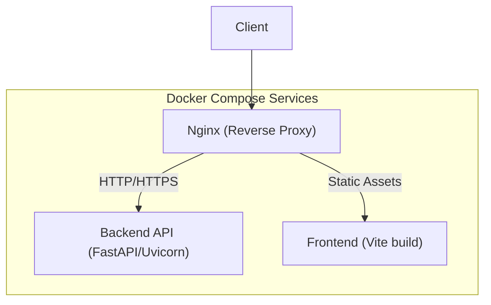
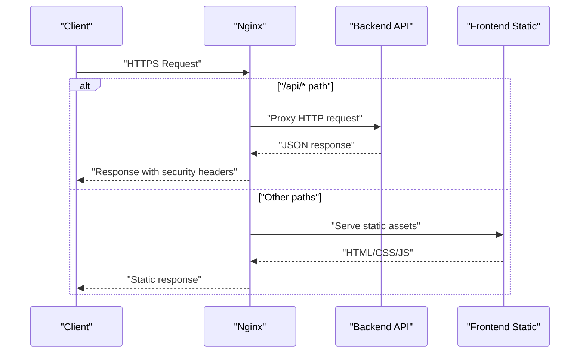
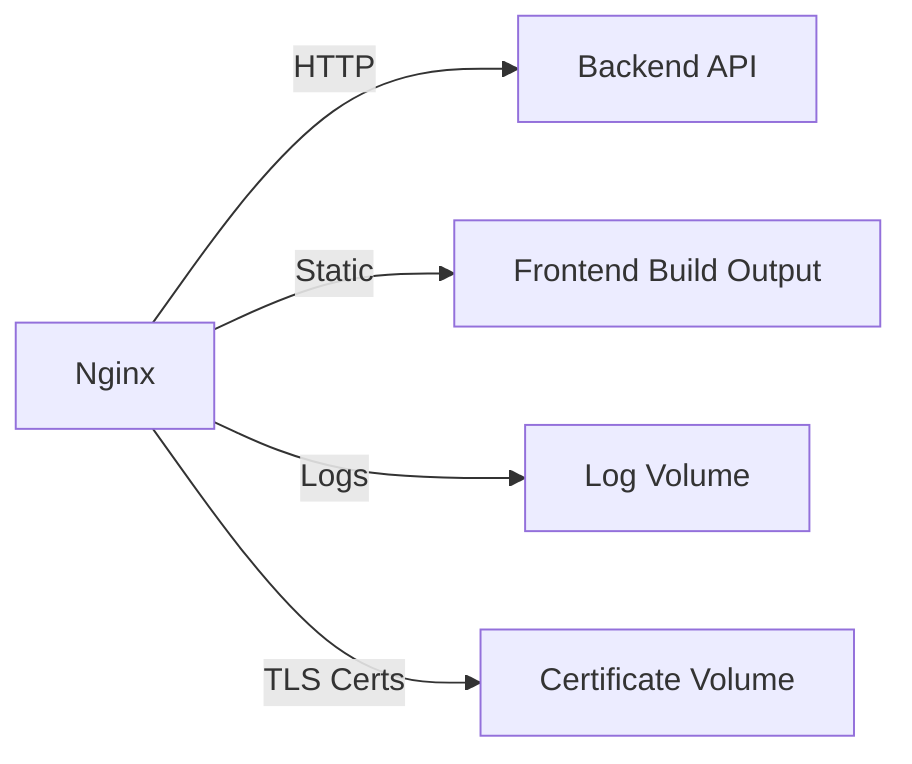

# Nginx Reverse Proxy Configuration

<cite>
**Referenced Files in This Document**
- [nginx.conf](file://nginx/nginx.conf)
- [docker-compose.yml](file://docker-compose.yml)
- [backend/app/main.py](file://backend/app/main.py)
- [frontend/Dockerfile](file://frontend/Dockerfile)
- [backend/Dockerfile](file://backend/Dockerfile)
</cite>

## Table of Contents
1. [Introduction](#introduction)
2. [Project Structure](#project-structure)
3. [Core Components](#core-components)
4. [Architecture Overview](#architecture-overview)
5. [Detailed Component Analysis](#detailed-component-analysis)
6. [Dependency Analysis](#dependency-analysis)
7. [Performance Considerations](#performance-considerations)
8. [Troubleshooting Guide](#troubleshooting-guide)
9. [Conclusion](#conclusion)
10. [Appendices](#appendices)

## Introduction
This document provides comprehensive guidance for configuring Nginx as a reverse proxy for the ECS Creator platform. It covers load balancing, SSL/TLS termination, caching strategies, security headers, request routing to backend services, static file serving for the frontend, WebSocket support, performance tuning, rate limiting, access control, monitoring, and log analysis. The content is designed to be accessible to both operators and developers while remaining precise enough for production deployments.

## Project Structure
The repository includes an Nginx configuration file under nginx/, a docker-compose orchestration file at the root, and containerized backend and frontend services. Nginx sits in front of the backend API and serves the built frontend assets.

**Diagram sources**
- [docker-compose.yml](file://docker-compose.yml)
- [nginx/nginx.conf](file://nginx/nginx.conf)
- [backend/app/main.py](file://backend/app/main.py)
- [frontend/Dockerfile](file://frontend/Dockerfile)
- [backend/Dockerfile](file://backend/Dockerfile)

**Section sources**
- [docker-compose.yml](file://docker-compose.yml)
- [nginx/nginx.conf](file://nginx/nginx.conf)
- [backend/app/main.py](file://backend/app/main.py)
- [frontend/Dockerfile](file://frontend/Dockerfile)
- [backend/Dockerfile](file://backend/Dockerfile)

## Core Components
- Nginx reverse proxy: terminates TLS, routes requests, applies security headers, enables caching, enforces rate limits, and proxies WebSockets.
- Backend API service: exposes REST endpoints and optional WebSocket endpoints.
- Frontend application: served as static files after build.

Key responsibilities:
- Route /api/* to the backend API.
- Serve frontend static assets from the build output directory.
- Enable secure HTTPS with modern TLS settings.
- Apply security headers across all responses.
- Cache appropriate static resources.
- Rate limit sensitive endpoints.
- Support real-time features via WebSocket upgrades.

**Section sources**
- [nginx/nginx.conf](file://nginx/nginx.conf)
- [docker-compose.yml](file://docker-compose.yml)
- [backend/app/main.py](file://backend/app/main.py)
- [frontend/Dockerfile](file://frontend/Dockerfile)

## Architecture Overview
The deployment uses Docker Compose to run Nginx alongside the backend and frontend services. Nginx acts as the single entry point, handling TLS termination and routing traffic to internal services over the Docker network.

**Diagram sources**
- [nginx/nginx.conf](file://nginx/nginx.conf)
- [docker-compose.yml](file://docker-compose.yml)
- [backend/app/main.py](file://backend/app/main.py)
- [frontend/Dockerfile](file://frontend/Dockerfile)

## Detailed Component Analysis

### Nginx Configuration Overview
The Nginx configuration defines upstreams for backend instances, server blocks for HTTP and HTTPS, location rules for API and static assets, caching zones, rate limiting, and security headers.

- Upstreams: Define one or more backend service addresses for load balancing.
- Server block (HTTP): Redirects all HTTP traffic to HTTPS.
- Server block (HTTPS): Enables TLS, sets protocols and ciphers, configures logging, and includes security headers.
- Location rules:
  - /api/* proxied to backend with proper headers and timeouts.
  - Root path serves frontend static files.
  - Optional WebSocket upgrade locations if required by the backend.
- Caching: Configured for static assets with cache keys and expiration policies.
- Security headers: HSTS, X-Frame-Options, CSP, Referrer-Policy, Permissions-Policy, etc.
- Rate limiting: Applied to sensitive endpoints using shared memory zones.
- Access control: IP allow/deny lists and basic auth where applicable.

**Section sources**
- [nginx/nginx.conf](file://nginx/nginx.conf)

#### Load Balancing Strategy
- Use round-robin by default or configure least_conn for long-lived connections.
- Add health checks via upstream parameters or external tools if needed.
- Ensure sticky sessions are configured only when the backend requires it.

**Section sources**
- [nginx/nginx.conf](file://nginx/nginx.conf)

#### SSL/TLS Termination
- Enable modern TLS protocols and strong cipher suites.
- Prefer ephemeral keys and enable OCSP stapling if available.
- Set strict transport security with includeSubDomains and preload if desired.

**Section sources**
- [nginx/nginx.conf](file://nginx/nginx.conf)

#### Caching Strategies
- Cache immutable static assets (JS/CSS/images) with long TTLs and versioned filenames.
- Use cache validation with ETag/Last-Modified for dynamic content.
- Configure proxy_cache_path and cache zone sizes based on expected footprint.

**Section sources**
- [nginx/nginx.conf](file://nginx/nginx.conf)

#### Security Headers
- Enforce HSTS, frame protection, XSS protection, content type sniffing prevention.
- Restrict referrer information and set permissions policy.
- Ensure CORS is configured only for trusted origins.

**Section sources**
- [nginx/nginx.conf](file://nginx/nginx.conf)

#### Request Routing to Backend Services
- Map /api/* to the backend upstream with correct host and scheme forwarding.
- Preserve client IP via X-Forwarded-For and X-Real-IP.
- Set appropriate proxy timeouts for long-running operations.

**Section sources**
- [nginx/nginx.conf](file://nginx/nginx.conf)

#### Static File Serving for the Frontend
- Serve built assets from the mounted volume containing the Vite output.
- Configure gzip/brotli compression for text-based assets.
- Set cache-control headers for optimal browser caching.

**Section sources**
- [nginx/nginx.conf](file://nginx/nginx.conf)
- [frontend/Dockerfile](file://frontend/Dockerfile)

#### WebSocket Support
- Upgrade connections for /ws/* or similar paths if the backend exposes WebSocket endpoints.
- Forward necessary headers for connection state and client identity.
- Adjust proxy timeouts to accommodate long-lived connections.

**Section sources**
- [nginx/nginx.conf](file://nginx/nginx.conf)

#### Performance Tuning Parameters
- Worker processes and events tuning for high concurrency.
- Buffer sizes for large headers and bodies.
- Keepalive connections to reduce overhead.
- Connection reuse and upstream keepalive settings.

**Section sources**
- [nginx/nginx.conf](file://nginx/nginx.conf)

#### Rate Limiting Configuration
- Define shared memory zones for per-IP or per-route limits.
- Apply burst allowances and nodelay behavior for sensitive endpoints.
- Return appropriate status codes and custom error pages.

**Section sources**
- [nginx/nginx.conf](file://nginx/nginx.conf)

#### Access Control Mechanisms
- Restrict admin endpoints by IP ranges.
- Optionally require basic authentication for management interfaces.
- Combine with WAF rules if deployed behind a gateway.

**Section sources**
- [nginx/nginx.conf](file://nginx/nginx.conf)

### Backend Service Integration
- The backend runs inside a container and listens on a local port exposed to the Docker network.
- Nginx proxies to the backend service name defined in docker-compose.
- Ensure the backend accepts forwarded headers and respects them for session and audit purposes.

**Section sources**
- [docker-compose.yml](file://docker-compose.yml)
- [backend/app/main.py](file://backend/app/main.py)

### Frontend Static Asset Serving
- The frontend is built into static files and mounted into the Nginx container.
- Nginx serves these files directly, reducing backend load and improving latency.

**Section sources**
- [frontend/Dockerfile](file://frontend/Dockerfile)
- [nginx/nginx.conf](file://nginx/nginx.conf)

## Dependency Analysis
Nginx depends on:
- Docker networking to reach backend and frontend services.
- Mounted volumes for static assets and logs.
- TLS certificates for HTTPS termination.

**Diagram sources**
- [docker-compose.yml](file://docker-compose.yml)
- [nginx/nginx.conf](file://nginx/nginx.conf)

**Section sources**
- [docker-compose.yml](file://docker-compose.yml)
- [nginx/nginx.conf](file://nginx/nginx.conf)

## Performance Considerations
- Tune worker_processes and worker_connections based on CPU cores and expected concurrency.
- Enable gzip/brotli for compressible content types.
- Use proxy_cache_path with adequate disk space and max_size.
- Set appropriate proxy_read_timeout and proxy_send_timeout for long operations.
- Prefer keepalive connections to upstreams.
- Monitor memory usage of cache zones and adjust sizes accordingly.

[No sources needed since this section provides general guidance]

## Troubleshooting Guide
Common issues and resolutions:
- 502 Bad Gateway: Verify backend service is running and reachable; check upstream address and port.
- 504 Gateway Timeout: Increase proxy timeouts for slow endpoints.
- Mixed Content Errors: Ensure all assets are served over HTTPS and avoid mixed schemes.
- CORS Failures: Confirm allowed origins and methods in backend and Nginx headers.
- WebSocket Disconnections: Check upgrade headers and long-lived connection timeouts.
- Rate Limiting 429 Responses: Review zone definitions and burst settings; adjust limits for legitimate traffic patterns.
- Certificate Issues: Validate certificate chain and expiry; ensure correct file paths and permissions.

Monitoring and log analysis:
- Centralize Nginx access and error logs for aggregation.
- Track upstream response times and error rates.
- Alert on increased 5xx errors and timeout spikes.
- Correlate logs with backend metrics for end-to-end visibility.

**Section sources**
- [nginx/nginx.conf](file://nginx/nginx.conf)
- [docker-compose.yml](file://docker-compose.yml)

## Conclusion
A well-configured Nginx reverse proxy enhances security, performance, and reliability for the ECS Creator platform. By applying robust TLS settings, caching strategies, rate limiting, and clear routing rules, you can deliver a fast and secure user experience while maintaining operational observability through centralized logging and monitoring.

[No sources needed since this section summarizes without analyzing specific files]

## Appendices

### Quick Checklist
- TLS enabled with modern protocols and strong ciphers.
- HSTS and other security headers applied globally.
- /api/* routed to backend with correct headers and timeouts.
- Static assets served with appropriate cache-control and compression.
- WebSocket endpoints upgraded and timed out appropriately.
- Rate limiting zones defined and applied to sensitive routes.
- Access controls enforced for admin endpoints.
- Logs centralized and monitored.

[No sources needed since this section provides general guidance]