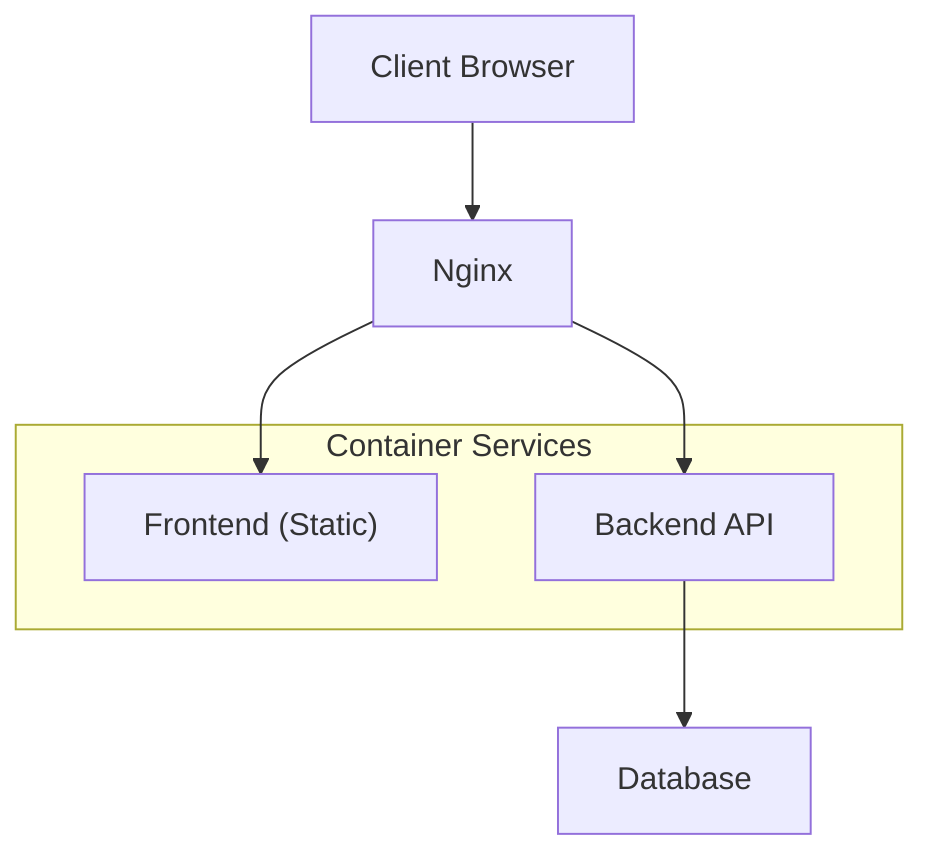
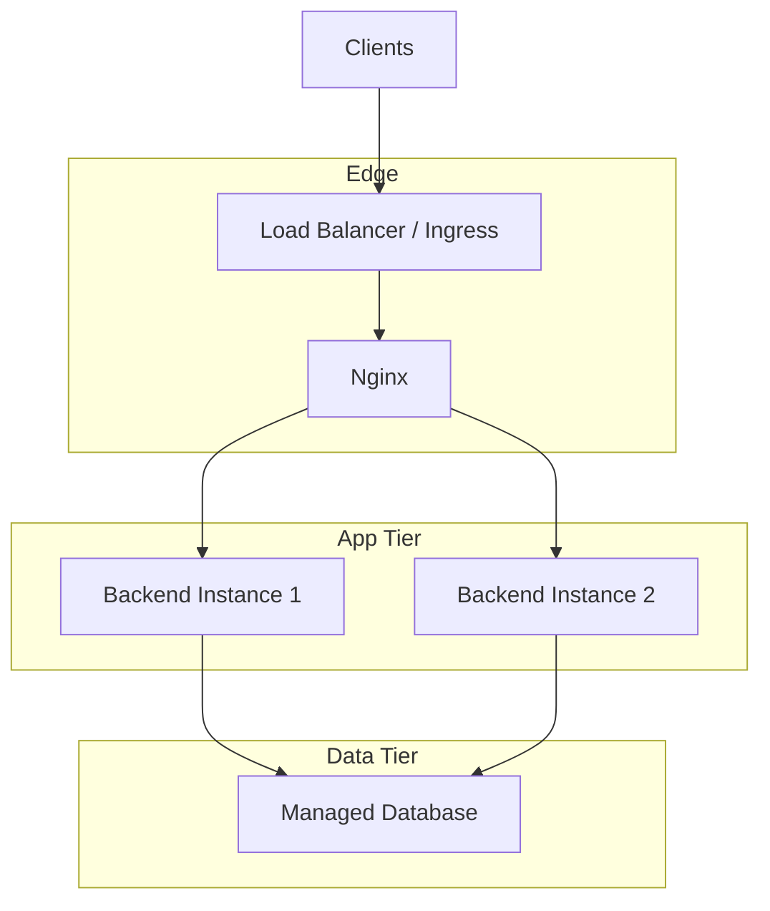
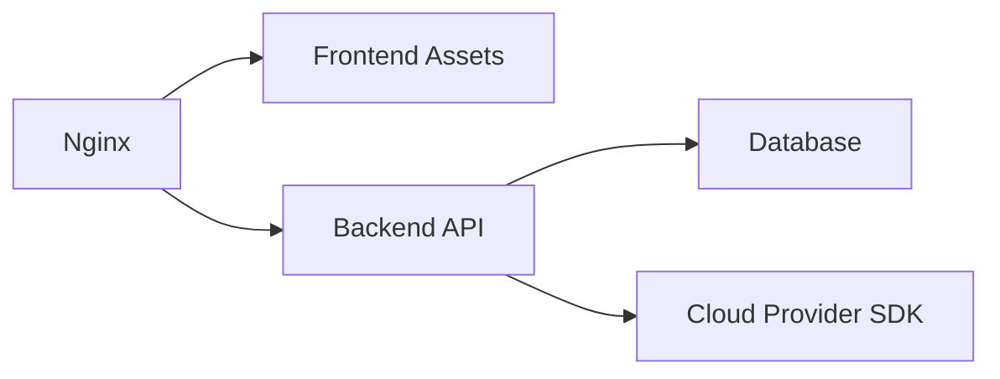

# Production Deployment Guide

<cite>
**Referenced Files in This Document**
- [README.md](file://README.md)
- [docker-compose.yml](file://docker-compose.yml)
- [backend/Dockerfile](file://backend/Dockerfile)
- [frontend/Dockerfile](file://frontend/Dockerfile)
- [nginx/nginx.conf](file://nginx/nginx.conf)
- [backend/entrypoint.sh](file://backend/entrypoint.sh)
- [backend/alembic.ini](file://backend/alembic.ini)
- [backend/app/config.py](file://backend/app/config.py)
- [backend/app/database.py](file://backend/app/database.py)
- [backend/app/main.py](file://backend/app/main.py)
- [backend/alembic/env.py](file://backend/alembic/env.py)
- [backend/alembic/versions/0001_initial_schema.py](file://backend/alembic/versions/0001_initial_schema.py)
</cite>

## Table of Contents
1. [Introduction](#introduction)
2. [Project Structure](#project-structure)
3. [Core Components](#core-components)
4. [Architecture Overview](#architecture-overview)
5. [Detailed Component Analysis](#detailed-component-analysis)
6. [Dependency Analysis](#dependency-analysis)
7. [Performance Considerations](#performance-considerations)
8. [Troubleshooting Guide](#troubleshooting-guide)
9. [Conclusion](#conclusion)
10. [Appendices](#appendices)

## Introduction
This guide provides production deployment instructions for the ECS Creator platform across cloud platforms, on-premises servers, and container orchestration systems. It covers environment setup, database initialization, migrations, data seeding, scaling, high availability, disaster recovery, monitoring, backups, maintenance, performance tuning, security hardening, and operational runbooks.

The application consists of:
- A Python backend (FastAPI-based) with Alembic for database migrations
- A React frontend built with Vite
- Nginx as a reverse proxy
- Docker Compose for local development and reference deployment

## Project Structure
High-level components:
- Backend: API server, database integration, configuration, migrations
- Frontend: Static assets served by Nginx
- Nginx: Reverse proxy and static file server
- Orchestration: docker-compose.yml defines services and networking

**Diagram sources**
- [docker-compose.yml](file://docker-compose.yml)
- [nginx/nginx.conf](file://nginx/nginx.conf)
- [backend/app/main.py](file://backend/app/main.py)

**Section sources**
- [README.md](file://README.md)
- [docker-compose.yml](file://docker-compose.yml)

## Core Components
- Backend application entry point and routing
- Database connection and migration tooling
- Configuration management
- Container images for backend and frontend
- Nginx reverse proxy configuration
- Entrypoint script for runtime initialization

Key responsibilities:
- Backend exposes REST endpoints and integrates with cloud provider SDKs
- Frontend serves UI assets
- Nginx terminates TLS (optional), proxies API requests, and serves static files
- Database layer manages schema and data via Alembic

**Section sources**
- [backend/app/main.py](file://backend/app/main.py)
- [backend/app/config.py](file://backend/app/config.py)
- [backend/app/database.py](file://backend/app/database.py)
- [backend/entrypoint.sh](file://backend/entrypoint.sh)
- [backend/alembic.ini](file://backend/alembic.ini)
- [backend/Dockerfile](file://backend/Dockerfile)
- [frontend/Dockerfile](file://frontend/Dockerfile)
- [nginx/nginx.conf](file://nginx/nginx.conf)

## Architecture Overview
Reference architecture using docker-compose:
- Nginx listens on HTTP/HTTPS and proxies /api to the backend
- Backend connects to an external or managed database
- Frontend is built into static assets and served by Nginx

[No sources needed since this diagram shows conceptual architecture]

## Detailed Component Analysis

### Backend Service
- Application framework and startup are defined in the main module
- Configuration is loaded from environment variables and/or config modules
- Database connectivity is configured centrally and used by routers/services
- Migrations are managed via Alembic with a dedicated env and versions directory

Operational notes:
- Ensure DATABASE_URL and other secrets are provided at runtime
- Health checks should target the root path or a dedicated health endpoint if implemented
- Use multiple backend replicas behind Nginx for HA

**Section sources**
- [backend/app/main.py](file://backend/app/main.py)
- [backend/app/config.py](file://backend/app/config.py)
- [backend/app/database.py](file://backend/app/database.py)

### Database and Migrations
- Alembic configuration and env are present; initial schema version exists
- Migration execution should be performed before starting the service in production
- Data seeding can be integrated via a one-off task or admin routine

Recommended steps:
- Initialize schema and apply all pending migrations
- Run any required seed scripts after migrations complete successfully

**Section sources**
- [backend/alembic.ini](file://backend/alembic.ini)
- [backend/alembic/env.py](file://backend/alembic/env.py)
- [backend/alembic/versions/0001_initial_schema.py](file://backend/alembic/versions/0001_initial_schema.py)

### Frontend Build and Serving
- Frontend builds static assets during image build
- Nginx serves these assets and proxies API traffic to the backend

Operational notes:
- Configure CORS only if necessary and restrict origins
- Enable caching headers for static assets

**Section sources**
- [frontend/Dockerfile](file://frontend/Dockerfile)
- [nginx/nginx.conf](file://nginx/nginx.conf)

### Nginx Reverse Proxy
- Proxies client requests to backend and serves frontend assets
- Can terminate TLS when configured with certificates

Operational notes:
- Set appropriate timeouts and buffering for API calls
- Add security headers (HSTS, X-Frame-Options, etc.)

**Section sources**
- [nginx/nginx.conf](file://nginx/nginx.conf)

### Entrypoint and Runtime Initialization
- The backend entrypoint script orchestrates startup tasks such as migrations and readiness checks

Operational notes:
- Make sure the script exits non-zero on failure to trigger container restart policies
- Integrate with orchestration liveness/readiness probes

**Section sources**
- [backend/entrypoint.sh](file://backend/entrypoint.sh)

### Container Images
- Backend image installs dependencies and runs the app server
- Frontend image builds static assets and serves them via Nginx

Operational notes:
- Pin base images and dependency versions
- Use multi-stage builds to minimize image size

**Section sources**
- [backend/Dockerfile](file://backend/Dockerfile)
- [frontend/Dockerfile](file://frontend/Dockerfile)

## Dependency Analysis
Service relationships and external integrations:
- Nginx depends on frontend assets and backend API
- Backend depends on database and cloud provider credentials
- Frontend depends on backend API endpoints

**Diagram sources**
- [nginx/nginx.conf](file://nginx/nginx.conf)
- [backend/app/main.py](file://backend/app/main.py)
- [backend/app/database.py](file://backend/app/database.py)

**Section sources**
- [docker-compose.yml](file://docker-compose.yml)
- [nginx/nginx.conf](file://nginx/nginx.conf)
- [backend/app/main.py](file://backend/app/main.py)

## Performance Considerations
- Scale horizontally by running multiple backend instances behind Nginx
- Tune Nginx worker processes, keepalive, and proxy buffers for API workloads
- Use connection pooling and tune database parameters for concurrent access
- Cache static assets aggressively and enable compression where appropriate
- Monitor CPU, memory, disk I/O, and network utilization; set autoscaling thresholds based on request latency and error rates

[No sources needed since this section provides general guidance]

## Troubleshooting Guide
Common issues and resolutions:
- Database connectivity failures: verify DATABASE_URL, network ACLs, and firewall rules
- Migration errors: review Alembic logs and ensure the correct revision head is applied
- TLS termination problems: validate certificate paths and permissions in Nginx
- High latency: check backend resource usage, database query performance, and upstream timeouts
- Container restart loops: inspect entrypoint logs and health probe responses

Operational tips:
- Centralize logs and forward to a log aggregation system
- Implement structured logging with correlation IDs for request tracing
- Use readiness probes to prevent traffic to unhealthy instances

**Section sources**
- [backend/entrypoint.sh](file://backend/entrypoint.sh)
- [backend/alembic.ini](file://backend/alembic.ini)
- [nginx/nginx.conf](file://nginx/nginx.conf)

## Conclusion
Deploying ECS Creator in production requires careful configuration of environment variables, secure storage of secrets, robust database management, and scalable infrastructure. Follow the procedures below to achieve a reliable, secure, and maintainable deployment.

[No sources needed since this section summarizes without analyzing specific files]

## Appendices

### A. Pre-deployment Checklist
- Provision a managed relational database and configure network access
- Generate and store secrets (database credentials, API keys, JWT secret)
- Prepare TLS certificates for Nginx
- Validate DNS records and load balancer configuration
- Confirm backup and monitoring solutions are in place

[No sources needed since this section provides general guidance]

### B. Environment Variables
Provide the following variables to the backend service:
- DATABASE_URL: Connection string for the database
- CLOUD_PROVIDER_*: Credentials for cloud provider access
- APP_SECRET_KEY: Secret key for signing tokens/sessions
- ALLOWED_ORIGINS: Comma-separated list of allowed CORS origins (if applicable)
- LOG_LEVEL: Logging verbosity (e.g., INFO, DEBUG)

Ensure these values are injected securely via your orchestration platform’s secret management.

[No sources needed since this section provides general guidance]

### C. Database Initialization and Migrations
Steps:
1. Create the database and user with least privilege
2. Apply Alembic migrations to initialize schema
3. Run any required seed scripts once after successful migration
4. Verify that the latest Alembic head matches the deployed codebase

Operational notes:
- Lock down write access to migrations outside CI/CD
- Maintain a rollback plan for failed migrations

**Section sources**
- [backend/alembic.ini](file://backend/alembic.ini)
- [backend/alembic/env.py](file://backend/alembic/env.py)
- [backend/alembic/versions/0001_initial_schema.py](file://backend/alembic/versions/0001_initial_schema.py)

### D. Data Seeding Strategy
- Implement idempotent seed routines executed post-migration
- Separate seeds for environments (dev/staging/prod)
- Version seed data alongside migrations for reproducibility

[No sources needed since this section provides general guidance]

### E. Scaling Strategies
- Horizontal scaling: run multiple backend replicas behind Nginx
- Stateless design: avoid storing session state locally; use shared stores if needed
- Autoscaling: scale out on CPU/memory or custom metrics like request latency
- Database scaling: read replicas for read-heavy workloads; consider sharding later

[No sources needed since this section provides general guidance]

### F. High Availability Setup
- Deploy at least two backend instances across failure domains
- Use a managed database with automatic failover
- Configure Nginx with upstream health checks and failover
- Store logs and metrics centrally

[No sources needed since this section provides general guidance]

### G. Disaster Recovery Planning
- Define RPO/RTO targets aligned with business needs
- Schedule regular database backups and test restores
- Maintain immutable artifacts (images, migrations) in a registry
- Document recovery procedures and run drills periodically

[No sources needed since this section provides general guidance]

### H. Monitoring and Alerting
- Expose health and metrics endpoints if available
- Collect application logs, access logs, and system metrics
- Configure alerts for error rates, latency spikes, and resource saturation
- Use dashboards to visualize SLOs and capacity trends

[No sources needed since this section provides general guidance]

### I. Backup Procedures
- Automated daily full backups and incremental WAL/log backups for databases
- Retain backups offsite and encrypt at rest
- Test restore procedures regularly and document recovery steps

[No sources needed since this section provides general guidance]

### J. Maintenance Tasks
- Rotate secrets and certificates on schedule
- Patch base images and dependencies regularly
- Review and prune unused resources and logs
- Validate migration compatibility before upgrades

[No sources needed since this section provides general guidance]

### K. Security Hardening Guidelines
- Enforce TLS everywhere and disable weak ciphers
- Restrict database access to application subnets only
- Use least-privilege IAM roles and service accounts
- Scan images for vulnerabilities and enforce supply chain controls
- Enable audit logging for sensitive operations

[No sources needed since this section provides general guidance]

### L. Operational Runbooks

#### L1. Rolling Update Procedure
- Build new images and push to registry
- Update deployment to new image version
- Monitor health checks and error rates
- Roll back immediately if anomalies detected

[No sources needed since this section provides general guidance]

#### L2. Database Migration Rollback
- Identify the previous safe migration revision
- Execute downgrade command to revert schema changes
- Validate application behavior and data integrity

**Section sources**
- [backend/alembic.ini](file://backend/alembic.ini)
- [backend/alembic/env.py](file://backend/alembic/env.py)

#### L3. Incident Response
- Triage: identify scope and impact
- Contain: isolate affected components
- Remediate: apply fixes or rollbacks
- Communicate: update stakeholders and status page
- Postmortem: document root cause and preventive actions

[No sources needed since this section provides general guidance]

### M. Local Development and Reference Deployment
Use docker-compose to spin up a local stack for testing and validation:
- Start services and run migrations
- Access frontend and API endpoints locally
- Adjust configurations for local-only settings

**Section sources**
- [docker-compose.yml](file://docker-compose.yml)

### N. Cloud Platform Deployment Notes
- AWS: deploy backend and Nginx on ECS/EKS; use RDS for database; ALB/NLB for ingress
- Azure: deploy on AKS; use Azure Database for PostgreSQL/MySQL; Application Gateway
- GCP: deploy on GKE; use Cloud SQL; Cloud Load Balancing
- Ensure secrets are stored in platform secret managers and mounted at runtime

[No sources needed since this section provides general guidance]

### O. On-Premises Deployment Notes
- Use Kubernetes or Docker Swarm for orchestration
- Provide persistent volumes for database backups and logs
- Manage TLS termination at edge or Nginx
- Implement internal PKI for service-to-service communication

[No sources needed since this section provides general guidance]