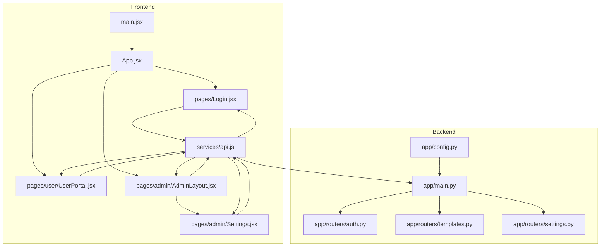
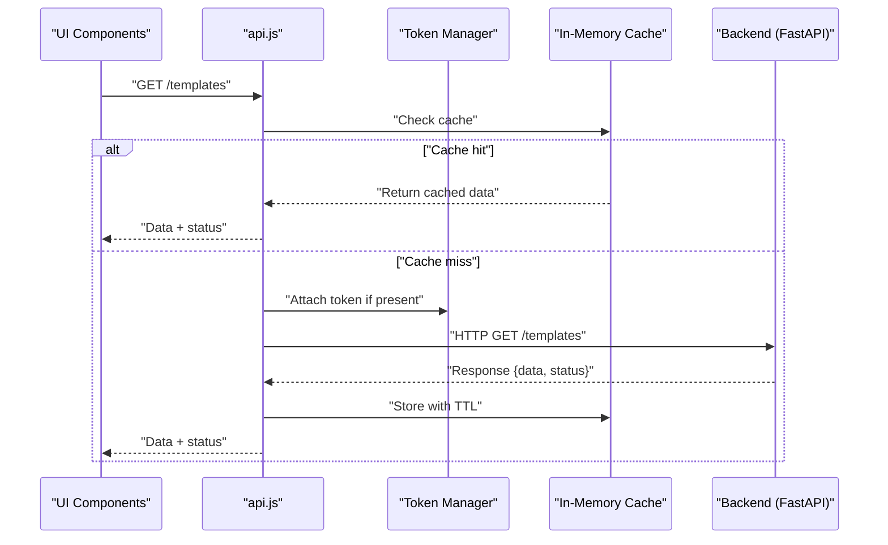
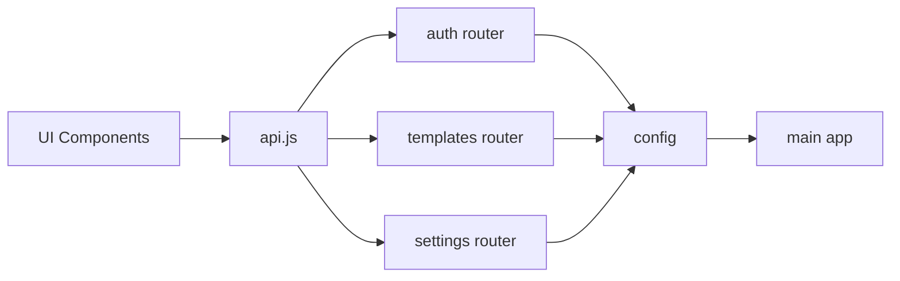

# API Service Layer

<cite>
**Referenced Files in This Document**
- [api.js](file://frontend/src/services/api.js)
- [main.jsx](file://frontend/src/main.jsx)
- [App.jsx](file://frontend/src/App.jsx)
- [Login.jsx](file://frontend/src/pages/Login.jsx)
- [UserPortal.jsx](file://frontend/src/pages/user/UserPortal.jsx)
- [AdminLayout.jsx](file://frontend/src/pages/admin/AdminLayout.jsx)
- [Settings.jsx](file://frontend/src/pages/admin/Settings.jsx)
- [templates.py](file://backend/app/routers/templates.py)
- [auth.py](file://backend/app/routers/auth.py)
- [settings.py](file://backend/app/routers/settings.py)
- [config.py](file://backend/app/config.py)
- [main.py](file://backend/app/main.py)
</cite>

## Table of Contents
1. [Introduction](#introduction)
2. [Project Structure](#project-structure)
3. [Core Components](#core-components)
4. [Architecture Overview](#architecture-overview)
5. [Detailed Component Analysis](#detailed-component-analysis)
6. [Dependency Analysis](#dependency-analysis)
7. [Performance Considerations](#performance-considerations)
8. [Troubleshooting Guide](#troubleshooting-guide)
9. [Conclusion](#conclusion)

## Introduction
This document describes the API service layer implementation that handles HTTP communication between the frontend and backend. It focuses on client configuration, request/response interceptors, authentication token management, error handling strategies, retry logic, loading state management, security considerations, rate limiting, caching strategies, and debugging techniques. The goal is to provide a comprehensive guide for developers working with or extending the API integration.

## Project Structure
The project follows a clear separation between frontend and backend:
- Frontend: React application using Vite, with a centralized API service module under services.
- Backend: FastAPI-based REST API with routers, schemas, models, and middleware.

**Diagram sources**
- [main.jsx](file://frontend/src/main.jsx)
- [App.jsx](file://frontend/src/App.jsx)
- [Login.jsx](file://frontend/src/pages/Login.jsx)
- [UserPortal.jsx](file://frontend/src/pages/user/UserPortal.jsx)
- [AdminLayout.jsx](file://frontend/src/pages/admin/AdminLayout.jsx)
- [Settings.jsx](file://frontend/src/pages/admin/Settings.jsx)
- [api.js](file://frontend/src/services/api.js)
- [main.py](file://backend/app/main.py)
- [auth.py](file://backend/app/routers/auth.py)
- [templates.py](file://backend/app/routers/templates.py)
- [settings.py](file://backend/app/routers/settings.py)
- [config.py](file://backend/app/config.py)

**Section sources**
- [main.jsx](file://frontend/src/main.jsx)
- [App.jsx](file://frontend/src/App.jsx)
- [api.js](file://frontend/src/services/api.js)
- [main.py](file://backend/app/main.py)

## Core Components
- API Client Configuration: Centralized base URL, headers, timeouts, and environment-specific settings.
- Interceptors: Request and response hooks for attaching tokens, logging, and normalizing responses.
- Authentication Token Management: Secure storage, refresh flow, and automatic re-authentication on failure.
- Error Handling: Unified error mapping, user-friendly messages, and actionable recovery paths.
- Retry Logic: Exponential backoff with jitter for transient failures.
- Loading State Management: Global and per-request loading flags to drive UI feedback.
- Security: HTTPS enforcement, secure header practices, and safe token handling.
- Rate Limiting: Client-side throttling and server-side guardrails.
- Caching Strategies: In-memory cache with TTL and invalidation policies.
- Debugging: Structured logs, request tracing, and test utilities.

**Section sources**
- [api.js](file://frontend/src/services/api.js)
- [auth.py](file://backend/app/routers/auth.py)
- [templates.py](file://backend/app/routers/templates.py)
- [settings.py](file://backend/app/routers/settings.py)
- [config.py](file://backend/app/config.py)
- [main.py](file://backend/app/main.py)

## Architecture Overview
The API service layer sits between UI components and the backend REST endpoints. It encapsulates HTTP calls, manages authentication, and standardizes error and loading states across the application.

**Diagram sources**
- [api.js](file://frontend/src/services/api.js)
- [auth.py](file://backend/app/routers/auth.py)
- [templates.py](file://backend/app/routers/templates.py)

## Detailed Component Analysis

### API Client Configuration
- Base URL and environment variables: Configure development vs production endpoints.
- Default headers: Content-Type, Accept, and optional feature flags.
- Timeouts and retries: Global timeout values and retry policy defaults.
- Interceptor registration: Attach auth, logging, and normalization hooks.

Best practices:
- Keep secrets out of client code; use environment variables injected at build time.
- Centralize all endpoint URLs to avoid duplication.
- Use typed interfaces for requests and responses where possible.

Security considerations:
- Enforce HTTPS in production.
- Avoid storing sensitive payloads in logs.
- Validate and sanitize inputs before sending.

**Section sources**
- [api.js](file://frontend/src/services/api.js)
- [config.py](file://backend/app/config.py)

### Request and Response Interceptors
Responsibilities:
- Request interceptor: Attach authorization headers, correlation IDs, and timestamps.
- Response interceptor: Normalize payloads, handle global errors, and update cache.
- Logging: Capture request metadata without exposing secrets.

Error normalization:
- Map backend error codes to consistent shapes.
- Provide actionable messages for users and developers.

Caching hooks:
- Store successful GET responses with TTL.
- Invalidate caches on mutations.

**Section sources**
- [api.js](file://frontend/src/services/api.js)

### Authentication Token Management
Flow:
- On login, store access token securely and set expiration.
- Attach token to subsequent requests via interceptor.
- On 401 Unauthorized, attempt silent refresh; if failed, redirect to login.

Storage:
- Prefer httpOnly cookies when supported by backend; otherwise, use secure in-memory storage.
- Never log tokens or include them in analytics.

Refresh strategy:
- Coalesce concurrent refresh attempts.
- Queue pending requests during refresh and replay upon success.

**Section sources**
- [auth.py](file://backend/app/routers/auth.py)
- [api.js](file://frontend/src/services/api.js)

### Error Handling Strategies
Approach:
- Centralized try/catch around API calls.
- Classify errors into network, server, validation, and auth categories.
- Surface user-facing messages while preserving detailed logs for debugging.

Recovery:
- Retry on transient errors (network timeouts, 5xx).
- Prompt user for input correction on validation errors.
- Force logout on persistent auth failures.

**Section sources**
- [api.js](file://frontend/src/services/api.js)

### Making API Calls
Patterns:
- Use typed functions for each resource (e.g., getTemplates, createTemplate).
- Return a consistent shape: { data, error, status }.
- Support optional query parameters and pagination.

Examples:
- Fetch templates list with pagination.
- Create a new template with validation.
- Update settings with optimistic updates and rollback on failure.

**Section sources**
- [api.js](file://frontend/src/services/api.js)
- [templates.py](file://backend/app/routers/templates.py)
- [settings.py](file://backend/app/routers/settings.py)

### Handling Different Response Types
- JSON payloads: Parse and validate against expected schema.
- File downloads: Stream binary data and trigger download safely.
- Streaming responses: Handle incremental updates for long-running tasks.

Validation:
- Perform lightweight client-side checks before sending.
- Rely on backend validation for authoritative results.

**Section sources**
- [api.js](file://frontend/src/services/api.js)

### Implementing Retry Logic
Policy:
- Exponential backoff with jitter for 5xx and network errors.
- Maximum retry count and total timeout cap.
- Idempotent methods only (GET, PUT, DELETE) should be retried.

Implementation tips:
- Wrap fetch calls with a retry decorator.
- Track retry attempts for observability.
- Fail fast on non-retryable errors (e.g., 400, 403).

**Section sources**
- [api.js](file://frontend/src/services/api.js)

### Managing Loading States
Global loading:
- Show a spinner for critical operations like authentication.
- Disable submit buttons during mutation.

Per-request loading:
- Track individual operation states for granular UI feedback.
- Cancel in-flight requests on navigation or unmount.

Optimistic updates:
- Update UI immediately, then reconcile with server response.
- Rollback on error with clear messaging.

**Section sources**
- [api.js](file://frontend/src/services/api.js)
- [Login.jsx](file://frontend/src/pages/Login.jsx)
- [UserPortal.jsx](file://frontend/src/pages/user/UserPortal.jsx)
- [AdminLayout.jsx](file://frontend/src/pages/admin/AdminLayout.jsx)
- [Settings.jsx](file://frontend/src/pages/admin/Settings.jsx)

### Security Considerations
- Transport security: Always use HTTPS in production.
- Token storage: Prefer httpOnly cookies; if using localStorage, mitigate XSS risks.
- CSRF protection: Ensure backend enforces CSRF for state-changing requests.
- Input validation: Sanitize and validate all inputs on both client and server.
- Secrets management: Do not embed secrets in client bundles.

**Section sources**
- [auth.py](file://backend/app/routers/auth.py)
- [api.js](file://frontend/src/services/api.js)

### Rate Limiting
Client-side:
- Debounce rapid successive calls (e.g., search).
- Throttle background syncs to respect quotas.

Server-side:
- Enforce per-user and per-endpoint limits.
- Return standardized rate limit headers and errors.

**Section sources**
- [api.js](file://frontend/src/services/api.js)
- [main.py](file://backend/app/main.py)

### Caching Strategies
In-memory cache:
- Keyed by normalized request URL and params.
- TTL-based expiration with background refresh.

Invalidation:
- Clear cache on mutations affecting resources.
- Version keys to support schema changes.

Cache-first vs network-first:
- Use cache-first for read-heavy endpoints.
- Network-first for real-time or write-dependent reads.

**Section sources**
- [api.js](file://frontend/src/services/api.js)

### Debugging Techniques
- Structured logging: Include correlation IDs, method, path, and latency.
- Network inspection: Use browser dev tools to inspect payloads and headers.
- Feature flags: Toggle verbose logging in development.
- Mocking: Provide local mocks for unstable dependencies.

**Section sources**
- [api.js](file://frontend/src/services/api.js)

## Dependency Analysis
The frontend API client depends on environment configuration and interacts with backend routers. The backend centralizes routing and configuration.

**Diagram sources**
- [api.js](file://frontend/src/services/api.js)
- [auth.py](file://backend/app/routers/auth.py)
- [templates.py](file://backend/app/routers/templates.py)
- [settings.py](file://backend/app/routers/settings.py)
- [config.py](file://backend/app/config.py)
- [main.py](file://backend/app/main.py)

**Section sources**
- [api.js](file://frontend/src/services/api.js)
- [auth.py](file://backend/app/routers/auth.py)
- [templates.py](file://backend/app/routers/templates.py)
- [settings.py](file://backend/app/routers/settings.py)
- [config.py](file://backend/app/config.py)
- [main.py](file://backend/app/main.py)

## Performance Considerations
- Minimize payload sizes: Select fields, paginate, and compress responses.
- Deduplicate requests: Coalesce identical in-flight calls.
- Lazy load routes and features to reduce initial bundle size.
- Use efficient caching to reduce server load and improve responsiveness.
- Monitor latency and error rates with structured metrics.

[No sources needed since this section provides general guidance]

## Troubleshooting Guide
Common issues and resolutions:
- 401 Unauthorized: Check token presence and expiry; trigger refresh or re-login.
- 403 Forbidden: Verify user roles and permissions.
- 429 Too Many Requests: Back off and retry after delay; inform user.
- 5xx Server Errors: Retry with exponential backoff; escalate if persistent.
- CORS errors: Ensure backend allows required origins and headers.
- Stale cache: Invalidate cache keys after mutations; force refresh when necessary.

Debug steps:
- Inspect network tab for request/response details.
- Enable verbose logging in development.
- Reproduce with minimal payload to isolate issues.

**Section sources**
- [api.js](file://frontend/src/services/api.js)
- [auth.py](file://backend/app/routers/auth.py)

## Conclusion
The API service layer provides a robust foundation for reliable, secure, and maintainable HTTP communication. By centralizing configuration, interceptors, authentication, error handling, retries, caching, and loading states, it ensures consistent behavior across the application. Adhering to the security, performance, and debugging recommendations will help deliver a high-quality user experience and simplify future enhancements.